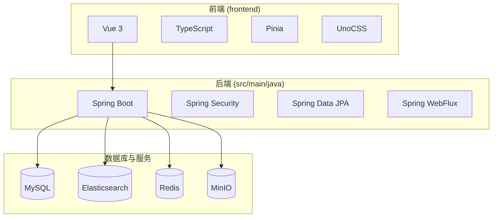
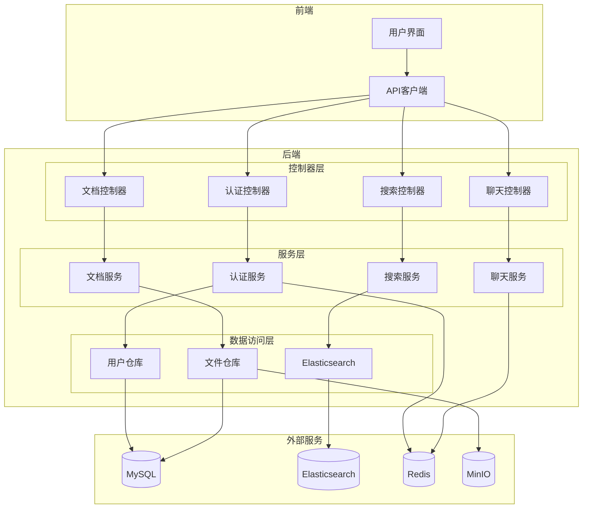
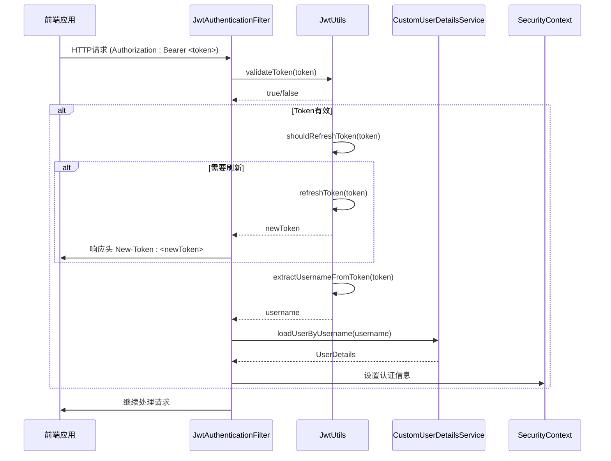
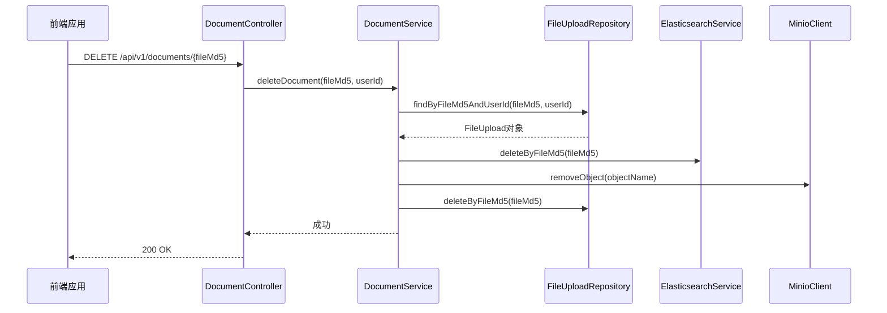
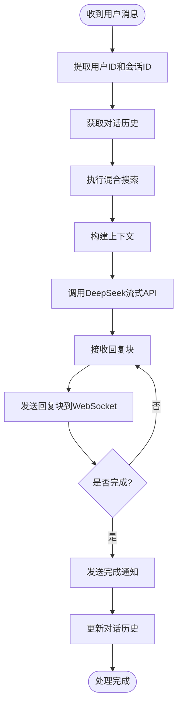
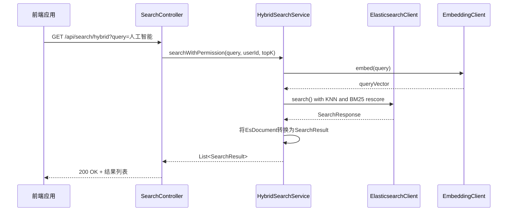
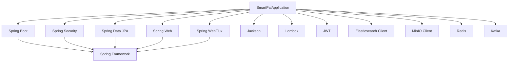

# API参考

<cite>
**本文档中引用的文件**   
- [AuthController.java](file://src/main/java/com/yizhaoqi/smartpai/controller/AuthController.java)
- [ChatController.java](file://src/main/java/com/yizhaoqi/smartpai/controller/ChatController.java)
- [DocumentController.java](file://src/main/java/com/yizhaoqi/smartpai/controller/DocumentController.java)
- [SearchController.java](file://src/main/java/com/yizhaoqi/smartpai/controller/SearchController.java)
- [WebSocketConfig.java](file://src/main/java/com/yizhaoqi/smartpai/config/WebSocketConfig.java)
- [ChatWebSocketHandler.java](file://src/main/java/com/yizhaoqi/smartpai/handler/ChatWebSocketHandler.java)
- [ChatHandler.java](file://src/main/java/com/yizhaoqi/smartpai/service/ChatHandler.java)
- [DocumentService.java](file://src/main/java/com/yizhaoqi/smartpai/service/DocumentService.java)
- [HybridSearchService.java](file://src/main/java/com/yizhaoqi/smartpai/service/HybridSearchService.java)
- [JwtUtils.java](file://src/main/java/com/yizhaoqi/smartpai/utils/JwtUtils.java)
- [SecurityConfig.java](file://src/main/java/com/yizhaoqi/smartpai/config/SecurityConfig.java)
- [JwtAuthenticationFilter.java](file://src/main/java/com/yizhaoqi/smartpai/config/JwtAuthenticationFilter.java)
- [CustomUserDetailsService.java](file://src/main/java/com/yizhaoqi/smartpai/service/CustomUserDetailsService.java)
- [User.java](file://src/main/java/com/yizhaoqi/smartpai/model/User.java)
- [FileUpload.java](file://src/main/java/com/yizhaoqi/smartpai/model/FileUpload.java)
- [SearchResult.java](file://src/main/java/com/yizhaoqi/smartpai/entity/SearchResult.java)
- [EsDocument.java](file://src/main/java/com/yizhaoqi/smartpai/entity/EsDocument.java)
- [Conversation.java](file://src/main/java/com/yizhaoqi/smartpai/model/Conversation.java)
</cite>

## 目录
1. [简介](#简介)
2. [项目结构](#项目结构)
3. [核心组件](#核心组件)
4. [架构概述](#架构概述)
5. [详细组件分析](#详细组件分析)
6. [依赖分析](#依赖分析)
7. [性能考虑](#性能考虑)
8. [故障排除指南](#故障排除指南)
9. [结论](#结论)

## 简介
本文档为PaiSmart智能问答系统提供完整的RESTful API参考，涵盖用户认证、文档管理、聊天交互和知识库搜索等所有公开接口。系统采用Spring Boot后端框架，结合Vue 3前端，实现了一个基于知识库的智能问答平台。后端通过JWT进行用户认证，利用Elasticsearch实现混合搜索（文本匹配+向量相似度），并通过WebSocket提供实时聊天功能。API设计遵循RESTful原则，所有响应均采用统一的JSON格式，包含`code`、`message`和`data`字段。文档详细记录了每个端点的HTTP方法、URL路径、请求参数、请求头和响应结构，并提供了curl示例和Postman调用场景。

## 项目结构
PaiSmart项目采用前后端分离的架构。后端位于`src/main/java`目录，基于Spring Boot构建，主要包含`controller`（控制器）、`service`（服务）、`repository`（数据访问）和`model`（实体）等包。前端位于`frontend/src`目录，使用Vue 3和TypeScript开发，包含`components`（组件）、`views`（视图）、`store`（状态管理）和`service`（API调用）等模块。配置文件如`application.yml`定义了数据库、Redis和MinIO等外部服务的连接信息。`pom.xml`文件管理了所有Java依赖。



**图源**
- [pom.xml](file://pom.xml)
- [package.json](file://frontend/package.json)

## 核心组件
系统的核心组件包括认证服务、文档管理、聊天引擎和知识库搜索。认证服务使用JWT（JSON Web Token）实现无状态认证，通过`JwtUtils`类生成和验证令牌，并在`JwtAuthenticationFilter`中进行拦截。文档管理服务负责文件的上传、存储和删除，文件内容被切分为文本块并生成向量，存储于Elasticsearch中。聊天引擎是系统的核心，通过WebSocket接收用户消息，调用`ChatHandler`处理消息，该处理器会先进行知识库检索，然后将上下文和检索结果发送给DeepSeek大模型生成回复。知识库搜索服务`HybridSearchService`结合了Elasticsearch的文本搜索和向量相似度搜索，实现高效的混合检索。

**节源**
- [JwtUtils.java](file://src/main/java/com/yizhaoqi/smartpai/utils/JwtUtils.java#L1-L50)
- [ChatHandler.java](file://src/main/java/com/yizhaoqi/smartpai/service/ChatHandler.java#L1-L50)
- [HybridSearchService.java](file://src/main/java/com/yizhaoqi/smartpai/service/HybridSearchService.java#L1-L50)

## 架构概述
系统采用典型的分层架构，从前端到后端再到数据存储。前端通过HTTP和WebSocket与后端API交互。后端控制器接收请求，调用服务层进行业务逻辑处理，服务层再调用数据访问层与数据库交互。安全配置由`SecurityConfig`统一管理，通过过滤器链实现认证和授权。聊天功能使用WebSocket，连接由`ChatController`处理，消息通过`ChatWebSocketHandler`分发给`ChatHandler`进行处理。知识库搜索利用Elasticsearch的KNN（K-Nearest Neighbors）功能进行向量搜索，并结合BM25算法进行文本相关性重打分。



**图源**
- [SecurityConfig.java](file://src/main/java/com/yizhaoqi/smartpai/config/SecurityConfig.java#L1-L20)
- [ChatController.java](file://src/main/java/com/yizhaoqi/smartpai/controller/ChatController.java#L1-L20)

## 详细组件分析

### 用户认证分析
用户认证基于JWT实现，整个流程由`JwtAuthenticationFilter`过滤器驱动。当请求到达时，过滤器从`Authorization`头中提取Bearer Token，使用`JwtUtils`进行验证。如果Token有效，用户信息将被加载到Spring Security的`SecurityContext`中，供后续的权限检查使用。系统实现了自动刷新机制，当Token剩余有效期少于5分钟时，会在响应头中返回新的`New-Token`，前端可自动更新，避免用户因Token过期而被强制登出。

#### 认证序列图


**图源**
- [JwtAuthenticationFilter.java](file://src/main/java/com/yizhaoqi/smartpai/config/JwtAuthenticationFilter.java#L1-L50)
- [JwtUtils.java](file://src/main/java/com/yizhaoqi/smartpai/utils/JwtUtils.java#L1-L50)

#### 认证接口
**刷新Token接口**
- **HTTP方法**: POST
- **URL路径**: `/api/v1/auth/refreshToken`
- **请求头**: `Content-Type: application/json`
- **请求体**:
  ```json
  {
    "refreshToken": "string"
  }
  ```
- **响应结构**:
  ```json
  {
    "code": 200,
    "message": "Token refreshed successfully",
    "data": {
      "token": "string",
      "refreshToken": "string"
    }
  }
  ```
- **状态码**:
  - `200`: 刷新成功
  - `400`: refreshToken为空
  - `401`: refreshToken无效
  - `500`: 服务器内部错误
- **curl示例**:
  ```bash
  curl -X POST https://api.paismart.com/api/v1/auth/refreshToken \
    -H "Content-Type: application/json" \
    -d '{"refreshToken": "your_refresh_token"}'
  ```

**节源**
- [AuthController.java](file://src/main/java/com/yizhaoqi/smartpai/controller/AuthController.java#L1-L85)

### 文档管理分析
文档管理功能允许用户上传、查看和删除文件。上传的文件被切分为多个块，合并后存储在MinIO对象存储中。文件的元数据（如文件名、大小、MD5值）存储在MySQL数据库的`file_upload`表中。为了支持搜索，系统会调用`EmbeddingClient`将文本块转换为向量，并将向量和文本内容索引到Elasticsearch中。删除文档时，`DocumentService`会执行一个事务性操作，确保同时删除数据库记录、MinIO文件、Elasticsearch索引和向量数据。

#### 文档删除序列图


**图源**
- [DocumentController.java](file://src/main/java/com/yizhaoqi/smartpai/controller/DocumentController.java#L1-L50)
- [DocumentService.java](file://src/main/java/com/yizhaoqi/smartpai/service/DocumentService.java#L1-L50)

#### 文档管理接口
**删除文档接口**
- **HTTP方法**: DELETE
- **URL路径**: `/api/v1/documents/{fileMd5}`
- **路径参数**:
  - `fileMd5` (string): 文件的MD5值
- **请求头**: `Authorization: Bearer <token>`
- **权限要求**: 文件所有者或管理员
- **响应结构**:
  ```json
  {
    "code": 200,
    "message": "文档删除成功"
  }
  ```
- **状态码**:
  - `200`: 删除成功
  - `404`: 文档不存在
  - `403`: 权限不足
  - `500`: 删除失败
- **curl示例**:
  ```bash
  curl -X DELETE https://api.paismart.com/api/v1/documents/abc123... \
    -H "Authorization: Bearer your_jwt_token"
  ```

**获取可访问文件列表接口**
- **HTTP方法**: GET
- **URL路径**: `/api/v1/documents/accessible`
- **请求头**: `Authorization: Bearer <token>`
- **响应结构**:
  ```json
  {
    "code": 200,
    "message": "获取可访问文件列表成功",
    "data": [
      {
        "fileMd5": "string",
        "fileName": "string",
        "totalSize": 0,
        "status": 0,
        "userId": "string",
        "public": false,
        "createdAt": "2023-08-01T12:00:00",
        "mergedAt": "2023-08-01T12:01:00",
        "orgTagName": "string"
      }
    ]
  }
  ```
- **状态码**:
  - `200`: 获取成功
  - `500`: 获取失败

**节源**
- [DocumentController.java](file://src/main/java/com/yizhaoqi/smartpai/controller/DocumentController.java#L50-L200)

### 聊天交互分析
聊天功能是系统的核心，通过WebSocket提供实时、低延迟的交互体验。前端通过`/chat/{token}`连接到后端，其中`token`是用户的JWT。`ChatWebSocketHandler`负责处理WebSocket的连接、消息和关闭事件。当收到消息时，`ChatHandler`会启动一个异步处理流程：首先从Redis获取对话历史，然后执行知识库检索，最后调用DeepSeek API流式生成回复。回复被分块发送回前端，实现“打字机”效果。

#### 聊天处理流程图


**图源**
- [ChatHandler.java](file://src/main/java/com/yizhaoqi/smartpai/service/ChatHandler.java#L1-L50)

#### WebSocket接口
**连接URL**: `wss://api.paismart.com/chat/{jwt_token}`
- **消息格式**: 发送纯文本消息。
- **停止指令**: 前端可以发送一个JSON消息来停止AI回复：
  ```json
  {
    "type": "stop",
    "_internal_cmd_token": "WSS_STOP_CMD_123456"
  }
  ```
  其中`_internal_cmd_token`的值需要通过`/api/chat/websocket-token`接口获取。
- **心跳机制**: 由前端实现，定期发送ping消息以保持连接。

**获取WebSocket停止指令Token接口**
- **HTTP方法**: GET
- **URL路径**: `/api/chat/websocket-token`
- **请求头**: 无（允许匿名访问）
- **响应结构**:
  ```json
  {
    "code": 200,
    "message": "获取WebSocket停止指令Token成功",
    "data": {
      "cmdToken": "WSS_STOP_CMD_123456"
    }
  }
  ```
- **状态码**:
  - `200`: 获取成功
  - `500`: 获取失败

**节源**
- [ChatController.java](file://src/main/java/com/yizhaoqi/smartpai/controller/ChatController.java#L1-L81)
- [ChatWebSocketHandler.java](file://src/main/java/com/yizhaoqi/smartpai/handler/ChatWebSocketHandler.java#L1-L121)

### 知识库搜索分析
知识库搜索服务`HybridSearchService`是实现智能问答的关键。它采用混合搜索策略，结合了Elasticsearch的KNN向量搜索和BM25文本搜索。查询时，系统首先生成查询文本的向量，然后在Elasticsearch中执行KNN搜索召回相关文本块。为了提高相关性，系统使用BM25算法对召回的结果进行重打分（rescore），最终返回综合得分最高的结果。搜索过程还集成了权限过滤，确保用户只能访问其有权限的文档。

#### 混合搜索序列图


**图源**
- [SearchController.java](file://src/main/java/com/yizhaoqi/smartpai/controller/SearchController.java#L1-L90)
- [HybridSearchService.java](file://src/main/java/com/yizhaoqi/smartpai/service/HybridSearchService.java#L1-L50)

#### 搜索接口
**混合搜索接口**
- **HTTP方法**: GET
- **URL路径**: `/api/search/hybrid`
- **查询参数**:
  - `query` (string, 必需): 搜索查询字符串
  - `topK` (integer, 可选, 默认10): 返回结果数量
- **请求头**: `Authorization: Bearer <token>` (可选，无Token时仅搜索公开内容)
- **响应结构**:
  ```json
  {
    "code": 200,
    "message": "success",
    "data": [
      {
        "fileMd5": "string",
        "chunkId": 0,
        "textContent": "string",
        "score": 0.9,
        "userId": "string",
        "orgTag": "string",
        "isPublic": false,
        "fileName": "string"
      }
    ]
  }
  ```
- **状态码**:
  - `200`: 搜索成功
  - `500`: 搜索失败
- **curl示例**:
  ```bash
  curl -G https://api.paismart.com/api/search/hybrid \
    -H "Authorization: Bearer your_jwt_token" \
    --data-urlencode "query=人工智能的发展" \
    --data-urlencode "topK=5"
  ```

**节源**
- [SearchController.java](file://src/main/java/com/yizhaoqi/smartpai/controller/SearchController.java#L1-L90)

## 依赖分析
系统依赖于多个外部服务。数据库使用MySQL存储用户和文件元数据。Elasticsearch用于存储文档的向量和文本内容，提供高效的混合搜索能力。Redis用于缓存JWT令牌状态和对话历史，提升性能。MinIO作为对象存储，存放用户上传的原始文件。这些依赖在`pom.xml`中通过Maven进行管理，确保了版本的一致性。



**图源**
- [pom.xml](file://pom.xml#L1-L50)

## 性能考虑
系统在设计时考虑了多项性能优化。首先，使用Redis缓存JWT令牌状态，避免了每次请求都解析JWT签名，显著降低了认证开销。其次，聊天历史存储在Redis中，相比数据库查询更快。Elasticsearch的混合搜索策略平衡了召回率和准确率，KNN快速召回，BM25精确排序。对于大文件上传，系统采用分块上传，避免了内存溢出。`ChatHandler`使用异步线程处理DeepSeek API调用，防止阻塞WebSocket连接。

## 故障排除指南
- **401 Unauthorized**: 检查`Authorization`头中的JWT是否正确，是否已过期。如果过期，尝试调用`/api/v1/auth/refreshToken`刷新。
- **403 Forbidden**: 检查用户权限。例如，删除文档时，用户必须是文件所有者或管理员。
- **WebSocket连接失败**: 检查URL中的JWT是否有效，以及后端`WebSocketConfig`是否正确配置了`/chat/{token}`路径。
- **搜索无结果**: 确认文件已成功上传并完成向量化。检查Elasticsearch索引`knowledge_base`是否存在数据。
- **聊天无响应**: 检查`DeepSeekClient`的配置和网络连接，确保能正常调用DeepSeek API。

**节源**
- [JwtAuthenticationFilter.java](file://src/main/java/com/yizhaoqi/smartpai/config/JwtAuthenticationFilter.java#L1-L98)
- [ChatHandler.java](file://src/main/java/com/yizhaoqi/smartpai/service/ChatHandler.java#L1-L199)

## 结论
本文档详细介绍了PaiSmart系统的RESTful API，涵盖了从用户认证到知识库搜索的完整流程。系统架构清晰，组件职责分明，通过JWT实现安全认证，利用Elasticsearch和大模型提供智能问答能力。API设计规范，易于第三方集成。开发者在使用时，应重点关注认证流程、WebSocket消息格式和搜索接口的权限控制。未来可考虑增加API版本控制和更详细的错误码定义，以进一步提升API的健壮性和易用性。