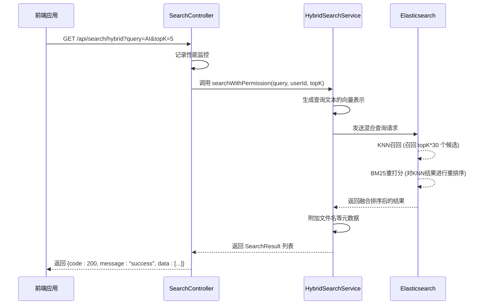

# 搜索API

<cite>
**本文档引用的文件**   
- [SearchController.java](file://src/main/java/com/yizhaoqi/smartpai/controller/SearchController.java#L21-L89)
- [HybridSearchService.java](file://src/main/java/com/yizhaoqi/smartpai/service/HybridSearchService.java#L30-L199)
- [SearchResult.java](file://src/main/java/com/yizhaoqi/smartpai/entity/SearchResult.java#L1-L38)
- [EsDocument.java](file://src/main/java/com/yizhaoqi/smartpai/entity/EsDocument.java#L1-L47)
- [test.html](file://src/main/resources/static/test.html#L1179-L1249)
</cite>

## 目录
1. [简介](#简介)
2. [搜索请求结构](#搜索请求结构)
3. [混合搜索实现原理](#混合搜索实现原理)
4. [搜索响应结构](#搜索响应结构)
5. [分页与参数说明](#分页与参数说明)
6. [典型使用示例](#典型使用示例)

## 简介
本API文档详细描述了派聪明（PaiSmart）知识库系统的混合搜索功能。该系统采用检索增强生成（RAG）技术，结合关键词匹配与向量语义搜索，为用户提供精准的文档检索服务。API通过整合Elasticsearch全文检索与向量数据库的近似最近邻（KNN）搜索，实现了高效的混合检索能力。本文档旨在为开发者提供完整的接口说明、请求/响应示例及后端实现逻辑，以便快速集成和使用搜索功能。

## 搜索请求结构
混合搜索API通过HTTP GET请求提供服务，主要参数通过查询字符串（query parameters）传递。

**请求端点**
- **URL**: `/api/search/hybrid`
- **方法**: `GET`

**请求参数**
| 参数名 | 类型 | 是否必需 | 默认值 | 说明 |
| :--- | :--- | :--- | :--- | :--- |
| `query` | 字符串 | 是 | 无 | 搜索查询文本，用户输入的关键词或问题 |
| `topK` | 整数 | 否 | 10 | 返回结果的最大数量，控制返回的文档片段数量 |

**权限处理**
- 当请求包含有效的JWT令牌时，系统会从令牌中提取`userId`，并执行带权限的搜索，确保用户只能访问其本人上传、公开或所属组织的文档。
- 若请求未携带令牌，则执行普通搜索，仅返回公开内容。

**Section sources**
- [SearchController.java](file://src/main/java/com/yizhaoqi/smartpai/controller/SearchController.java#L21-L56)

## 混合搜索实现原理
后端的混合搜索由`HybridSearchService`类实现，其核心逻辑是将Elasticsearch的全文检索（BM25算法）与向量数据库的近似最近邻（KNN）搜索相结合，并通过重打分（rescore）机制融合排序结果。



**Diagram sources**
- [SearchController.java](file://src/main/java/com/yizhaoqi/smartpai/controller/SearchController.java#L21-L89)
- [HybridSearchService.java](file://src/main/java/com/yizhaoqi/smartpai/service/HybridSearchService.java#L30-L199)

**Section sources**
- [HybridSearchService.java](file://src/main/java/com/yizhaoqi/smartpai/service/HybridSearchService.java#L30-L199)

### 搜索流程详解
1.  **向量生成**: 使用`EmbeddingClient`调用外部API（如通义千问）将查询文本`query`转换为高维向量（768维或2048维）。
2.  **KNN召回**: 在Elasticsearch中执行KNN搜索，基于生成的查询向量，在`knowledge_base`索引的`vector`字段上查找最相似的`topK * 30`个文档片段作为候选集。
3.  **关键词过滤与权限控制**: 在KNN召回的同时，使用`must`和`filter`子句确保所有返回结果都包含查询关键词，并且用户有访问权限（用户自己的文档、公开文档或用户所属组织标签的文档）。
4.  **BM25重打分**: 对KNN召回的候选集，在一个较小的窗口内（`windowSize = topK * 30`）使用BM25算法进行重打分。通过设置`queryWeight`和`rescoreQueryWeight`，让BM25的得分在最终排序中占主导地位，从而融合了语义相似度和关键词相关性。
5.  **结果返回**: 将最终排序的前`topK`个结果返回给前端。

此方法既利用了向量搜索的语义理解能力，又保留了关键词搜索的精确性和可解释性，同时通过权限过滤保障了数据安全。

## 搜索响应结构
API返回一个标准的JSON响应体，包含状态码、消息和数据。

**响应体结构**
```json
{
  "code": 200,
  "message": "success",
  "data": [
    {
      "fileMd5": "abc123...",
      "chunkId": 1,
      "textContent": "人工智能是未来科技发展的核心方向。",
      "score": 0.92,
      "userId": "user123",
      "orgTag": "TECH_DEPT",
      "isPublic": true,
      "fileName": "人工智能白皮书.pdf"
    },
    // ... 更多结果
  ]
}
```

**`data`数组中的`SearchResult`对象字段说明**
| 字段名 | 类型 | 说明 |
| :--- | :--- | :--- |
| `fileMd5` | 字符串 | 文档的唯一指纹（MD5哈希值），用于标识来源文件 |
| `chunkId` | 整数 | 文本在原始文档中的分块序号 |
| `textContent` | 字符串 | 与查询最相关的文档片段内容 |
| `score` | 浮点数 | 搜索匹配得分，综合了向量相似度和关键词相关性 |
| `userId` | 字符串 | 上传该文档的用户ID |
| `orgTag` | 字符串 | 该文档所属的组织标签，用于权限管理 |
| `isPublic` | 布尔值 | 文档是否公开 |
| `fileName` | 字符串 | 文档的原始文件名（由后端补充） |

**Section sources**
- [SearchResult.java](file://src/main/java/com/yizhaoqi/smartpai/entity/SearchResult.java#L1-L38)
- [test.html](file://src/main/resources/static/test.html#L1224-L1249)

## 分页与参数说明
根据代码库分析，当前的混合搜索API **不支持** 传统的`offset`和`limit`分页参数。

**分页现状**
- API通过`topK`参数控制单次请求返回的结果数量，其行为类似于`limit`。
- 系统没有实现基于`offset`的分页机制。这意味着无法通过修改参数来获取后续页的结果。
- 前端分页功能（如`use-table.ts`中的`page`和`pageSize`）主要用于其他列表型接口（如对话历史、文件列表），而非此搜索API。

**其他过滤条件**
- **文档ID过滤**: API本身不直接支持通过`fileMd5`进行过滤。但权限系统会自动限制用户只能看到其有权访问的文档。
- **时间范围过滤**: 搜索API本身不支持时间范围过滤。但类似功能（如按时间查询对话历史）在其他API（如`ConversationController`）中实现，表明系统具备时间过滤能力，但未集成到当前搜索接口。

**相似度阈值**
- API **不支持** 用户自定义的相似度阈值。代码中有一个固定的`minScore(0.3d)`用于纯文本搜索的后备方案，但此阈值是内部实现细节，不可由用户配置。

## 典型使用示例
以下示例展示了如何调用混合搜索API。

### curl请求示例
```bash
# 带认证的搜索请求
curl -X GET "http://localhost:8080/api/search/hybrid?query=人工智能的发展&topK=5" \
  -H "Authorization: Bearer your-jwt-token-here"

# 不带认证的搜索请求（仅返回公开内容）
curl -X GET "http://localhost:8080/api/search/hybrid?query=机器学习算法"
```

### 响应样例
```json
{
  "code": 200,
  "message": "success",
  "data": [
    {
      "fileMd5": "d41d8cd98f00b204e9800998ecf8427e",
      "chunkId": 3,
      "textContent": "深度学习是机器学习的一个重要分支，它通过模拟人脑神经网络的结构来处理复杂的数据模式。",
      "score": 0.951,
      "userId": "u1001",
      "orgTag": "AI_RESEARCH",
      "isPublic": false,
      "fileName": "深度学习入门指南.pdf"
    },
    {
      "fileMd5": "5d41402abc4b2a76b9719d911017c592",
      "chunkId": 1,
      "textContent": "人工智能（AI）是指由机器展示的智能，其目标是让机器能够执行通常需要人类智能才能完成的任务。",
      "score": 0.876,
      "userId": "u1002",
      "orgTag": "TECH_DEPT",
      "isPublic": true,
      "fileName": "AI技术概述.docx"
    }
  ]
}
```

**Section sources**
- [test.html](file://src/main/resources/static/test.html#L1179-L1249)