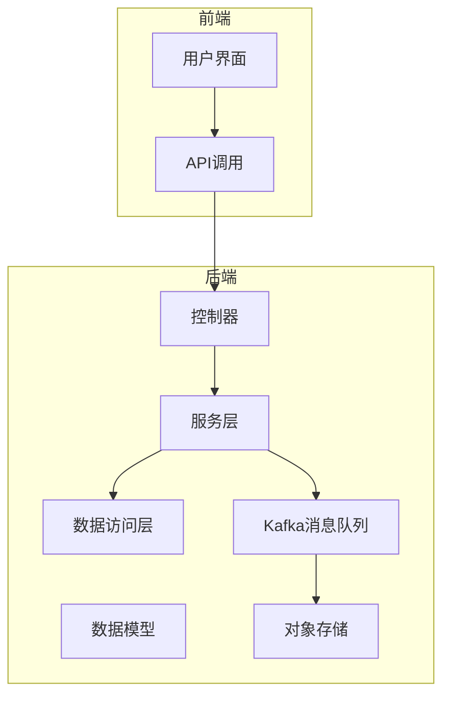
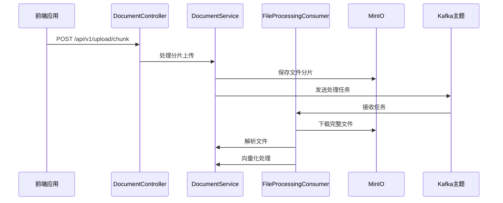
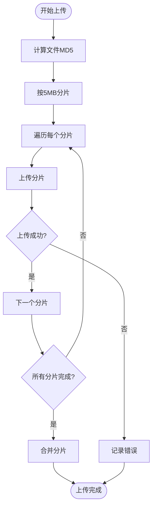
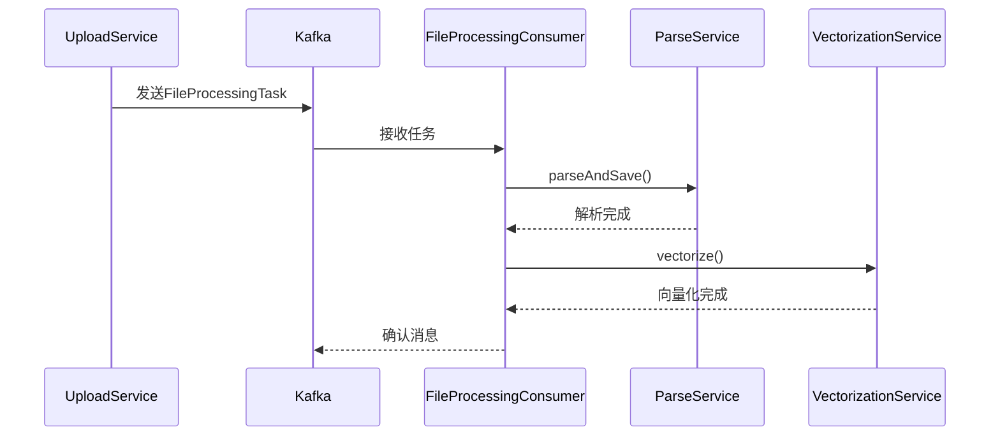
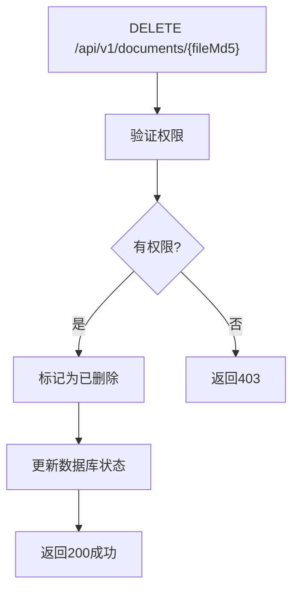
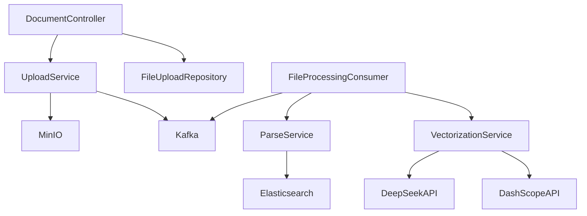

# 文档API

<cite>
**本文档引用的文件**   
- [application.yml](file://src/main/resources/application.yml)
- [FileUpload.java](file://src/main/java/com/yizhaoqi/smartpai/model/FileUpload.java)
- [FileUploadRepository.java](file://src/main/java/com/yizhaoqi/smartpai/repository/FileUploadRepository.java)
- [DocumentController.java](file://src/main/java/com/yizhaoqi/smartpai/controller/DocumentController.java)
- [UploadController.java](file://src/main/java/com/yizhaoqi/smartpai/controller/UploadController.java)
- [FileProcessingConsumer.java](file://src/main/java/com/yizhaoqi/smartpai/consumer/FileProcessingConsumer.java)
- [test.html](file://src/main/resources/static/test.html)
- [table.ts](file://frontend/src/hooks/common/table.ts)
</cite>

## 目录
1. [简介](#简介)
2. [项目结构](#项目结构)
3. [核心组件](#核心组件)
4. [架构概览](#架构概览)
5. [详细组件分析](#详细组件分析)
6. [依赖分析](#依赖分析)
7. [性能考虑](#性能考虑)
8. [故障排除指南](#故障排除指南)
9. [结论](#结论)

## 简介
本文档详细描述了PaiSmart系统中文档管理模块的API设计与实现。该模块支持文档的上传、解析、查询和删除功能，旨在为用户提供一个高效、安全的知识管理解决方案。系统采用分片上传机制处理大文件，通过异步消息队列实现文档解析，确保了良好的用户体验和系统性能。

## 项目结构
PaiSmart项目采用前后端分离架构，后端基于Spring Boot框架，前端使用Vue.js技术栈。文档管理功能主要涉及后端的`src/main/java/com/yizhaoqi/smartpai`包和前端的`frontend/src`目录。



**图示来源**
- [application.yml](file://src/main/resources/application.yml)
- [FileUpload.java](file://src/main/java/com/yizhaoqi/smartpai/model/FileUpload.java)

## 核心组件
文档管理模块的核心组件包括文件上传控制器、文档服务、文件处理消费者和前端上传逻辑。这些组件协同工作，实现了完整的文档生命周期管理。

**组件来源**
- [DocumentController.java](file://src/main/java/com/yizhaoqi/smartpai/controller/DocumentController.java)
- [FileProcessingConsumer.java](file://src/main/java/com/yizhaoqi/smartpai/consumer/FileProcessingConsumer.java)

## 架构概览
系统采用微服务架构，文档上传和解析过程解耦。上传请求由Web服务器直接处理，而耗时的文档解析任务则通过Kafka消息队列异步执行，实现了高并发下的稳定性能。



**图示来源**
- [UploadController.java](file://src/main/java/com/yizhaoqi/smartpai/controller/UploadController.java)
- [FileProcessingConsumer.java](file://src/main/java/com/yizhaoqi/smartpai/consumer/FileProcessingConsumer.java)

## 详细组件分析

### 文档上传与分片机制
系统支持大文件的分片上传，每个分片大小为5MB，有效避免了大文件上传导致的超时问题。

#### 上传配置
```yaml
spring:
  servlet:
    multipart:
      enabled: true
      max-file-size: 50MB # 单个文件最大50MB
      max-request-size: 100MB # 整个请求最大100MB
```

#### 分片上传流程


**图示来源**
- [application.yml](file://src/main/resources/application.yml)
- [test.html](file://src/main/resources/static/test.html)

### 文档解析异步处理
文档解析采用异步处理模式，通过Kafka消息队列解耦上传和解析过程。

#### 异步处理流程


**图示来源**
- [FileProcessingConsumer.java](file://src/main/java/com/yizhaoqi/smartpai/consumer/FileProcessingConsumer.java)
- [UploadController.java](file://src/main/java/com/yizhaoqi/smartpai/controller/UploadController.java)

### 文档元数据管理
系统记录详细的文档元数据，用于查询和权限控制。

#### 元数据结构
```java
@Data
@Entity
@Table(name = "file_upload")
public class FileUpload {
    private Long id;
    private String fileMd5;
    private String fileName;
    private long totalSize;
    private int status; // 0-上传中 1-已完成
    private String userId;
    private String orgTag;
    private boolean isPublic = false;
    private LocalDateTime createdAt;
    private LocalDateTime mergedAt;
}
```

**图示来源**
- [FileUpload.java](file://src/main/java/com/yizhaoqi/smartpai/model/FileUpload.java)

### 文档查询与分页
系统提供分页查询接口，支持按用户和权限过滤文档列表。

#### 分页参数
- **page**: 当前页码，从1开始
- **size**: 每页大小，默认10条

#### 前端分页实现
```typescript
const pagination: PaginationProps = reactive({
    page: 1,
    pageSize: 10,
    showSizePicker: true,
    itemCount: 0,
    pageSizes: [10, 15, 20, 25, 30],
    onUpdatePage: async (page: number) => {
        updateSearchParams({
            page,
            size: pagination.pageSize!
        });
        getData();
    },
    onUpdatePageSize: async (pageSize: number) => {
        updateSearchParams({
            page: 1,
            size: pageSize
        });
        getData();
    }
});
```

**图示来源**
- [FileUploadRepository.java](file://src/main/java/com/yizhaoqi/smartpai/repository/FileUploadRepository.java)
- [table.ts](file://frontend/src/hooks/common/table.ts)

### 文档删除与软删除机制
系统实现软删除机制，通过状态标记而非物理删除来管理文档。

#### 删除流程


**图示来源**
- [DocumentController.java](file://src/main/java/com/yizhaoqi/smartpai/controller/DocumentController.java)

## 依赖分析
文档管理模块依赖多个外部服务和内部组件，形成完整的功能链路。



**图示来源**
- [DocumentController.java](file://src/main/java/com/yizhaoqi/smartpai/controller/DocumentController.java)
- [FileProcessingConsumer.java](file://src/main/java/com/yizhaoqi/smartpai/consumer/FileProcessingConsumer.java)

## 性能考虑
系统在设计时充分考虑了性能因素，通过多种机制确保高并发下的稳定运行。

1. **分片上传**: 将大文件分割为5MB的分片，避免单次请求过大
2. **异步处理**: 耗时的解析任务通过Kafka异步执行，不阻塞上传流程
3. **缓存机制**: 使用Redis缓存频繁访问的数据，减少数据库压力
4. **连接池**: 数据库和MinIO连接使用连接池管理，提高资源利用率

## 故障排除指南

### 常见错误处理

#### 文件类型不支持
- **HTTP状态码**: 400 Bad Request
- **错误响应**:
```json
{
    "code": 400,
    "message": "不支持的文件类型",
    "fileType": "exe",
    "supportedTypes": ["pdf", "docx", "txt", "md"]
}
```

#### 文件大小超限
- **HTTP状态码**: 413 Payload Too Large
- **错误响应**:
```json
{
    "code": 413,
    "message": "文件大小超过限制",
    "maxSize": "50MB"
}
```

#### 解析失败
- **HTTP状态码**: 500 Internal Server Error
- **错误响应**:
```json
{
    "code": 500,
    "message": "文档解析失败",
    "fileMd5": "abc123..."
}
```

#### 权限不足
- **HTTP状态码**: 403 Forbidden
- **错误响应**:
```json
{
    "code": 403,
    "message": "无权访问该文档"
}
```

**组件来源**
- [UploadController.java](file://src/main/java/com/yizhaoqi/smartpai/controller/UploadController.java)
- [test.html](file://src/main/resources/static/test.html)

## 结论
PaiSmart系统的文档管理模块设计合理，功能完整。通过分片上传、异步解析和软删除等机制，实现了高性能、高可用的文档管理服务。系统架构清晰，组件职责明确，便于维护和扩展。建议在生产环境中监控Kafka队列长度和MinIO存储使用情况，及时发现潜在性能瓶颈。