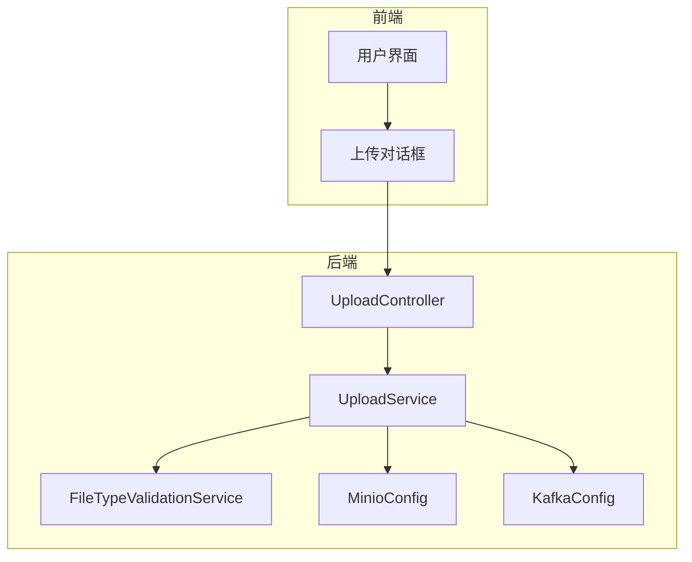
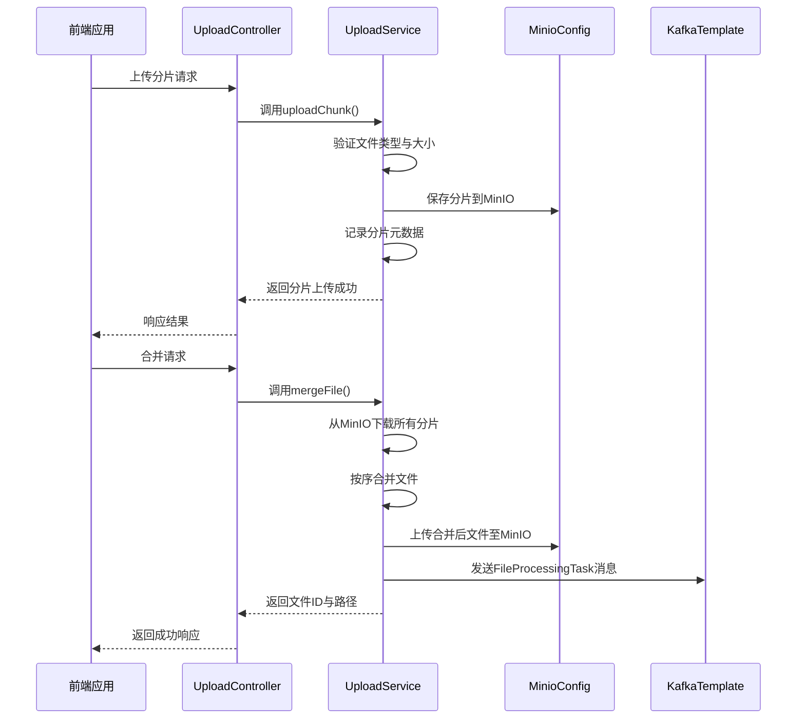
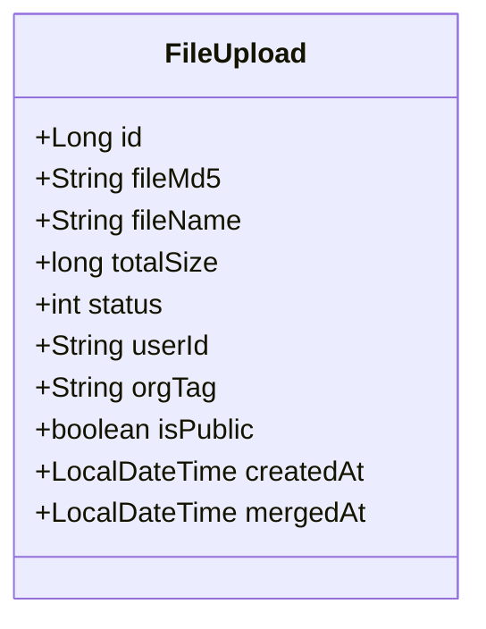
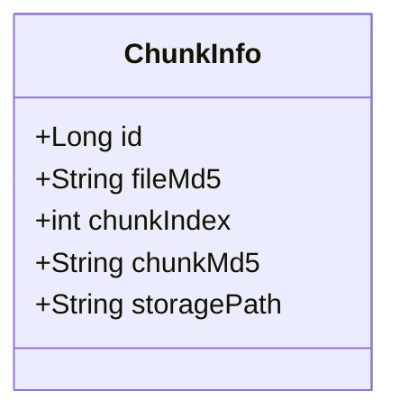
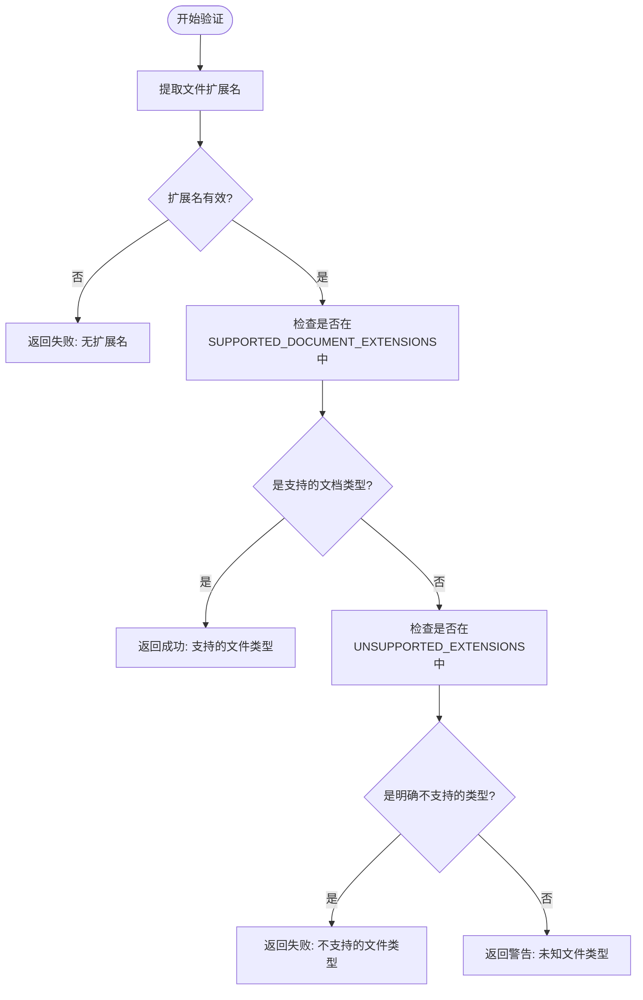
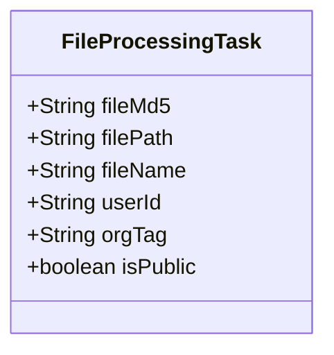
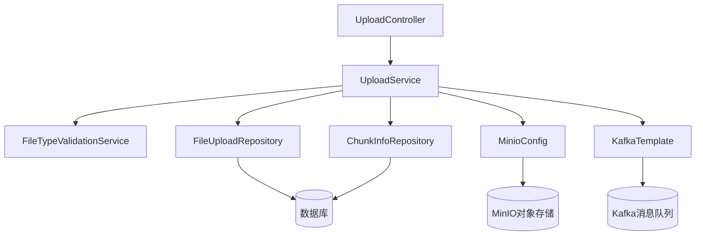

# 文档上传API

<cite>
**本文档引用的文件**  
- [FileUpload.java](file://src/main/java/com/yizhaoqi/smartpai/model/FileUpload.java#L0-L82)
- [ChunkInfo.java](file://src/main/java/com/yizhaoqi/smartpai/model/ChunkInfo.java#L0-L47)
- [UploadController.java](file://src/main/java/com/yizhaoqi/smartpai/controller/UploadController.java)
- [UploadService.java](file://src/main/java/com/yizhaoqi/smartpai/service/UploadService.java)
- [FileTypeValidationService.java](file://src/main/java/com/yizhaoqi/smartpai/service/FileTypeValidationService.java#L0-L294)
- [MinioConfig.java](file://src/main/java/com/yizhaoqi/smartpai/config/MinioConfig.java#L19-L33)
- [KafkaConfig.java](file://src/main/java/com/yizhaoqi/smartpai/config/KafkaConfig.java#L0-L104)
- [FileProcessingTask.java](file://src/main/java/com/yizhaoqi/smartpai/model/FileProcessingTask.java#L0-L32)
- [LogUtils.java](file://src/main/java/com/yizhaoqi/smartpai/utils/LogUtils.java#L0-L193)
- [FileUploadRepository.java](file://src/main/java/com/yizhaoqi/smartpai/repository/FileUploadRepository.java#L0-L64)
- [ChunkInfoRepository.java](file://src/main/java/com/yizhaoqi/smartpai/repository/ChunkInfoRepository.java#L0-L10)
</cite>

## 目录
1. [简介](#简介)
2. [项目结构](#项目结构)
3. [核心组件](#核心组件)
4. [架构概览](#架构概览)
5. [详细组件分析](#详细组件分析)
6. [依赖分析](#依赖分析)
7. [性能考量](#性能考量)
8. [故障排除指南](#故障排除指南)
9. [结论](#结论)

## 简介
本文档详细描述了“文档上传API”的实现机制，重点涵盖文件上传接口的设计与实现。系统支持多种文档格式（如PDF、DOCX、PPTX等）的上传，并通过MIME类型校验确保文件类型合规。单个文件大小限制为100MB，支持分片上传、断点续传功能，结合MinIO进行文件存储，并通过Kafka消息队列触发后续处理流程。文档还提供了完整的请求示例、响应结构及错误处理机制。

## 项目结构
项目采用前后端分离架构，前端基于Vue3构建，后端使用Spring Boot开发。文档上传相关功能主要集中在`src/main/java/com/yizhaoqi/smartpai`包下，涉及控制器、服务、实体模型和仓库接口。

**图示来源**
- [UploadController.java](file://src/main/java/com/yizhaoqi/smartpai/controller/UploadController.java)
- [UploadService.java](file://src/main/java/com/yizhaoqi/smartpai/service/UploadService.java)

**本节来源**
- [project_structure](file://project_structure)

## 核心组件
核心组件包括文件上传控制器（UploadController）、上传服务（UploadService）、文件类型验证服务（FileTypeValidationService）、MinIO配置（MinioConfig）和Kafka消息配置（KafkaConfig）。这些组件协同工作，完成文件上传、验证、存储和异步处理的完整流程。

**本节来源**
- [UploadController.java](file://src/main/java/com/yizhaoqi/smartpai/controller/UploadController.java)
- [UploadService.java](file://src/main/java/com/yizhaoqi/smartpai/service/UploadService.java)

## 架构概览
系统采用分层架构，从前端到后端依次为：用户界面 → 控制器层 → 服务层 → 数据访问层 → 存储层（MinIO）与消息中间件（Kafka）。上传流程中，文件先以分片形式接收，校验后暂存，合并后写入MinIO，并通过Kafka通知文件处理服务。

**图示来源**
- [UploadController.java](file://src/main/java/com/yizhaoqi/smartpai/controller/UploadController.java)
- [UploadService.java](file://src/main/java/com/yizhaoqi/smartpai/service/UploadService.java)
- [MinioConfig.java](file://src/main/java/com/yizhaoqi/smartpai/config/MinioConfig.java)
- [KafkaConfig.java](file://src/main/java/com/yizhaoqi/smartpai/config/KafkaConfig.java)

## 详细组件分析

### 文件上传实体模型分析
`FileUpload`实体类用于持久化文件的元数据信息，包括文件MD5、原始名称、总大小、上传状态、用户ID、组织标签、公开状态及时间戳。

**图示来源**
- [FileUpload.java](file://src/main/java/com/yizhaoqi/smartpai/model/FileUpload.java#L0-L82)

**本节来源**
- [FileUpload.java](file://src/main/java/com/yizhaoqi/smartpai/model/FileUpload.java#L0-L82)

### 分片信息实体模型分析
`ChunkInfo`实体类用于记录每个文件分片的元数据，包括所属文件的MD5、分片索引、分片MD5和存储路径。

**图示来源**
- [ChunkInfo.java](file://src/main/java/com/yizhaoqi/smartpai/model/ChunkInfo.java#L0-L47)

**本节来源**
- [ChunkInfo.java](file://src/main/java/com/yizhaoqi/smartpai/model/ChunkInfo.java#L0-L47)

### 文件类型验证服务分析
`FileTypeValidationService`服务类负责验证上传文件的扩展名是否在支持列表中。系统支持PDF、DOCX、PPTX、XLSX、TXT、MD等多种文档格式，拒绝图片、音频、视频、压缩包等非文档类型。

**图示来源**
- [FileTypeValidationService.java](file://src/main/java/com/yizhaoqi/smartpai/service/FileTypeValidationService.java#L0-L294)

**本节来源**
- [FileTypeValidationService.java](file://src/main/java/com/yizhaoqi/smartpai/service/FileTypeValidationService.java#L0-L294)

### 分片上传与合并逻辑
系统支持分片上传，分片大小由前端控制，后端根据`fileMd5`和`chunkIndex`识别分片。所有分片上传完成后，调用合并接口，服务从MinIO下载所有分片，按索引排序后合并为完整文件。

**本节来源**
- [UploadService.java](file://src/main/java/com/yizhaoqi/smartpai/service/UploadService.java)
- [ChunkInfoRepository.java](file://src/main/java/com/yizhaoqi/smartpai/repository/ChunkInfoRepository.java#L0-L10)

### Kafka消息机制
文件合并成功后，系统通过Kafka发送`FileProcessingTask`消息，包含文件MD5、存储路径、文件名、用户ID、组织标签和公开状态，用于触发后续的文本解析、向量化和索引构建。

**图示来源**
- [FileProcessingTask.java](file://src/main/java/com/yizhaoqi/smartpai/model/FileProcessingTask.java#L0-L32)
- [KafkaConfig.java](file://src/main/java/com/yizhaoqi/smartpai/config/KafkaConfig.java#L0-L104)

**本节来源**
- [FileProcessingTask.java](file://src/main/java/com/yizhaoqi/smartpai/model/FileProcessingTask.java#L0-L32)
- [KafkaConfig.java](file://src/main/java/com/yizhaoqi/smartpai/config/KafkaConfig.java#L0-L104)

### MinIO集成流程
系统通过`MinioConfig`配置MinIO客户端，使用`publicUrl`作为文件的公共访问前缀。上传的分片和合并后的文件均存储在MinIO中，路径由`fileMd5`和分片索引生成。

**本节来源**
- [MinioConfig.java](file://src/main/java/com/yizhaoqi/smartpai/config/MinioConfig.java#L19-L33)

## 依赖分析
系统依赖关系清晰，`UploadController`依赖`UploadService`，`UploadService`依赖`FileTypeValidationService`、`FileUploadRepository`、`ChunkInfoRepository`、`MinioConfig`和`KafkaTemplate`。数据访问层通过JPA与数据库交互。

**图示来源**
- [UploadController.java](file://src/main/java/com/yizhaoqi/smartpai/controller/UploadController.java)
- [UploadService.java](file://src/main/java/com/yizhaoqi/smartpai/service/UploadService.java)
- [FileUploadRepository.java](file://src/main/java/com/yizhaoqi/smartpai/repository/FileUploadRepository.java#L0-L64)
- [ChunkInfoRepository.java](file://src/main/java/com/yizhaoqi/smartpai/repository/ChunkInfoRepository.java#L0-L10)

**本节来源**
- [UploadService.java](file://src/main/java/com/yizhaoqi/smartpai/service/UploadService.java)

## 性能考量
系统通过分片上传支持大文件传输，避免内存溢出。日志工具`LogUtils`提供性能监控功能，可记录各操作耗时。Kafka的可靠投递配置（ACK=all, 幂等生产者）确保消息不丢失。

**本节来源**
- [LogUtils.java](file://src/main/java/com/yizhaoqi/smartpai/utils/LogUtils.java#L0-L193)

## 故障排除指南
常见错误及处理方式：
- **文件类型不支持**：返回HTTP 400，错误信息包含不支持的文件类型描述。
- **文件大小超限**：返回HTTP 413，前端应限制单文件不超过100MB。
- **存储失败**：返回HTTP 500，检查MinIO服务状态和网络连接。
- **分片丢失**：系统通过`getUploadStatus`接口支持断点续传，前端可查询已上传分片。

**本节来源**
- [FileTypeValidationService.java](file://src/main/java/com/yizhaoqi/smartpai/service/FileTypeValidationService.java#L0-L294)
- [UploadController.java](file://src/main/java/com/yizhaoqi/smartpai/controller/UploadController.java)

## 结论
文档上传API设计合理，功能完整，支持分片上传、类型校验、MinIO存储和Kafka异步处理。系统具备良好的扩展性和可靠性，可满足大文件上传和后续AI处理的需求。