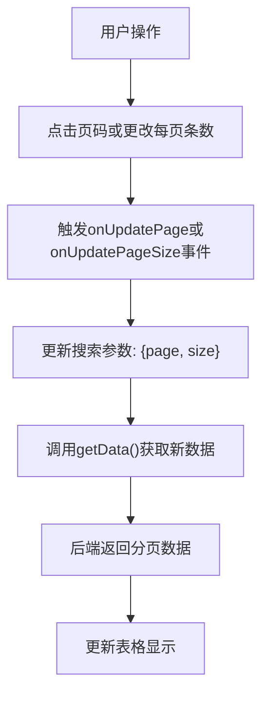
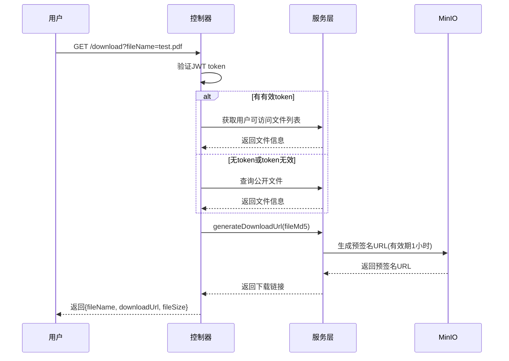
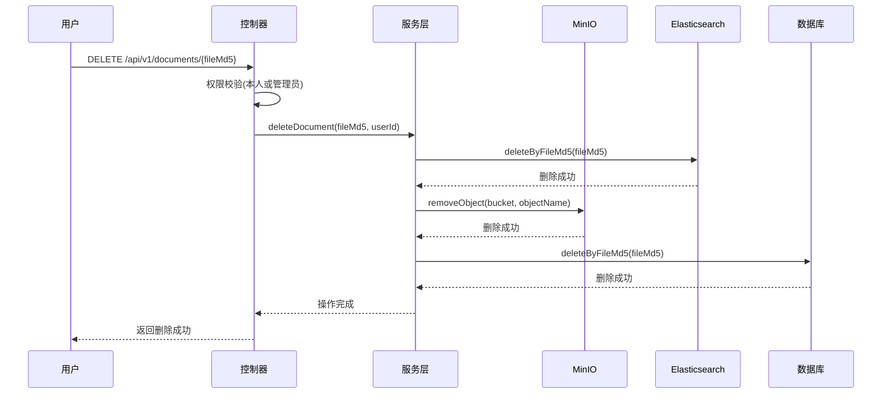

# 文档管理API

<cite>
**本文档引用的文件**   
- [DocumentController.java](file://src/main/java/com/yizhaoqi/smartpai/controller/DocumentController.java#L32-L489)
- [DocumentService.java](file://src/main/java/com/yizhaoqi/smartpai/service/DocumentService.java#L29-L322)
- [FileUpload.java](file://src/main/java/com/yizhaoqi/smartpai/model/FileUpload.java#L13-L80)
- [FileUploadRepository.java](file://src/main/java/com/yizhaoqi/smartpai/repository/FileUploadRepository.java#L12-L63)
- [ElasticsearchService.java](file://src/main/java/com/yizhaoqi/smartpai/service/ElasticsearchService.java#L17-L85)
</cite>

## 目录
1. [文档管理API](#文档管理api)
2. [文档列表查询](#文档列表查询)
3. [文档详情获取](#文档详情获取)
4. [文档删除操作](#文档删除操作)
5. [文档元数据管理](#文档元数据管理)
6. [权限校验机制](#权限校验机制)

## 文档列表查询

文档管理API提供了分页查询接口，用于获取用户可访问的文档列表。该功能主要通过前端分页组件与后端服务协同实现。

### 分页查询参数

分页查询功能由前端`useTable`钩子函数驱动，其核心参数如下：

- **page**: 当前页码，从1开始
- **size**: 每页显示条数，可选值为10、15、20、25、30
- **keyword**: 搜索关键词，用于文档名称模糊匹配
- **status**: 文档状态过滤条件



**图示来源**
- [table.ts](file://frontend/src/hooks/common/table.ts#L103-L164)

**本节来源**
- [table.ts](file://frontend/src/hooks/common/table.ts#L103-L164)

### 响应数据结构

分页查询接口返回标准的分页响应结构，包含以下字段：

- **code**: 响应状态码（200表示成功）
- **message**: 响应消息
- **data**: 响应数据对象
  - **pageNum**: 当前页码
  - **pageSize**: 每页条数
  - **total**: 总条数
  - **list**: 文档列表数据

响应示例：
```json
{
  "code": 200,
  "message": "获取用户上传文件列表成功",
  "data": [
    {
      "fileMd5": "abc123def456",
      "fileName": "用户手册.pdf",
      "totalSize": 1024576,
      "status": 1,
      "userId": "user001",
      "public": true,
      "createdAt": "2024-01-15T10:30:00",
      "mergedAt": "2024-01-15T10:31:20",
      "orgTagName": "技术部"
    }
  ]
}
```

## 文档详情获取

系统提供了多种方式获取文档的详细信息和内容。

### 文件下载

通过`/api/v1/documents/download`接口，用户可以获取文件的下载链接。该接口支持两种访问模式：

1. **认证访问**：通过JWT token验证用户身份和权限
2. **匿名访问**：仅限公开文件

处理流程：


**图示来源**
- [DocumentController.java](file://src/main/java/com/yizhaoqi/smartpai/controller/DocumentController.java#L212-L358)

### 文件预览

通过`/api/v1/documents/preview`接口，用户可以预览文件内容。系统根据文件类型提供不同的预览方式：

- **文本文件**：显示前10KB内容
- **非文本文件**：显示文件基本信息

预览内容示例（非文本文件）：
```
文件名: 报告.docx
文件大小: 2.3 MB
文件类型: DOCX
上传时间: 2024-01-15T10:30:00

此文件类型不支持预览，请下载后查看。
```

**本节来源**
- [DocumentController.java](file://src/main/java/com/yizhaoqi/smartpai/controller/DocumentController.java#L360-L489)
- [DocumentService.java](file://src/main/java/com/yizhaoqi/smartpai/service/DocumentService.java#L244-L322)

## 文档删除操作

文档删除功能实现了完整的级联清理机制，确保数据一致性。

### 软删除实现

系统采用软删除机制，通过在`FileUpload`实体中设置`is_deleted`标志位来标记删除状态。然而，根据代码分析，当前实现直接执行了物理删除。

```java
// FileUpload实体类中的删除相关字段
private boolean isDeleted = false; // 删除标志位
private LocalDateTime deletedAt;   // 删除时间
```

### 删除处理流程

当用户请求删除文档时，系统执行以下级联清理操作：



**图示来源**
- [DocumentController.java](file://src/main/java/com/yizhaoqi/smartpai/controller/DocumentController.java#L32-L128)
- [DocumentService.java](file://src/main/java/com/yizhaoqi/smartpai/service/DocumentService.java#L31-L88)

### 级联清理处理

删除操作会同时清理以下相关数据：

1. **Elasticsearch索引**：通过`deleteByFileMd5`方法删除知识库索引中的相关文档
2. **MinIO存储**：删除`uploads/merged/`目录下的原始文件
3. **数据库记录**：删除`file_upload`表中的记录
4. **向量数据库**：删除`document_vector`表中的向量记录

Elasticsearch删除实现：
```java
public void deleteByFileMd5(String fileMd5) {
    DeleteByQueryRequest request = DeleteByQueryRequest.of(d -> d
        .index("knowledge_base")
        .query(q -> q.term(t -> t.field("fileMd5").value(fileMd5)))
    );
    esClient.deleteByQuery(request);
}
```

**本节来源**
- [DocumentService.java](file://src/main/java/com/yizhaoqi/smartpai/service/DocumentService.java#L31-L88)
- [ElasticsearchService.java](file://src/main/java/com/yizhaoqi/smartpai/service/ElasticsearchService.java#L77-L85)

## 文档元数据管理

文档元数据存储在`file_upload`数据库表中，包含丰富的文件信息。

### 元数据字段

`FileUpload`实体类定义了以下元数据字段：

- **fileMd5**: 文件MD5值，作为唯一标识符
- **fileName**: 文件原始名称
- **totalSize**: 文件总大小（字节）
- **status**: 上传状态（0-上传中，1-已完成）
- **userId**: 上传用户ID
- **orgTag**: 所属组织标签
- **isPublic**: 是否公开（true-公开，false-私有）
- **createdAt**: 创建时间（上传开始时间）
- **mergedAt**: 合并完成时间

```java
@Data
@Entity
@Table(name = "file_upload")
public class FileUpload {
    @Id
    private Long id;
    
    @Column(name = "file_md5", length = 32, nullable = false)
    private String fileMd5;
    
    private String fileName;
    
    private long totalSize;
    
    private int status; // 0-上传中 1-已完成
    
    @Column(name = "user_id", length = 64, nullable = false)
    private String userId;
    
    @Column(name = "org_tag")
    private String orgTag;
    
    @Column(name = "is_public", nullable = false)
    private boolean isPublic = false;
    
    @CreationTimestamp
    private LocalDateTime createdAt;
    
    @UpdateTimestamp
    private LocalDateTime mergedAt;
}
```

**本节来源**
- [FileUpload.java](file://src/main/java/com/yizhaoqi/smartpai/model/FileUpload.java#L13-L80)

### 元数据更新机制

元数据的更新主要通过以下方式：

1. **自动更新**：使用`@CreationTimestamp`和`@UpdateTimestamp`注解自动管理时间戳
2. **服务层更新**：`DocumentService`在处理文件时更新相关字段
3. **批量操作**：通过Repository接口进行批量更新

## 权限校验机制

系统实现了严格的权限控制，确保文档操作的安全性。

### 权限校验逻辑

文档操作的权限校验规则如下：

- **文档删除**：只有文件所有者或管理员可以删除
- **文档访问**：用户可访问自己的文件、公开文件和所属组织的文件

删除操作权限校验代码：
```java
// 权限检查：只有文件所有者或管理员可以删除
if (!file.getUserId().equals(userId) && !"ADMIN".equals(role)) {
    LogUtils.logUserOperation(userId, "DELETE_DOCUMENT", fileMd5, "FAILED_PERMISSION_DENIED");
    Map<String, Object> response = new HashMap<>();
    response.put("code", HttpStatus.FORBIDDEN.value());
    response.put("message", "没有权限删除此文档");
    return ResponseEntity.status(HttpStatus.FORBIDDEN).body(response);
}
```

### 403状态码处理

当用户无权执行操作时，系统返回403 Forbidden状态码，并附带详细的错误信息：

- **场景1**：普通用户尝试删除他人文档
- **场景2**：用户尝试访问无权限的私有文件
- **场景3**：组织成员尝试访问其他组织的文件

错误响应示例：
```json
{
  "code": 403,
  "message": "没有权限删除此文档"
}
```

**本节来源**
- [DocumentController.java](file://src/main/java/com/yizhaoqi/smartpai/controller/DocumentController.java#L32-L128)
- [DocumentService.java](file://src/main/java/com/yizhaoqi/smartpai/service/DocumentService.java#L29-L322)