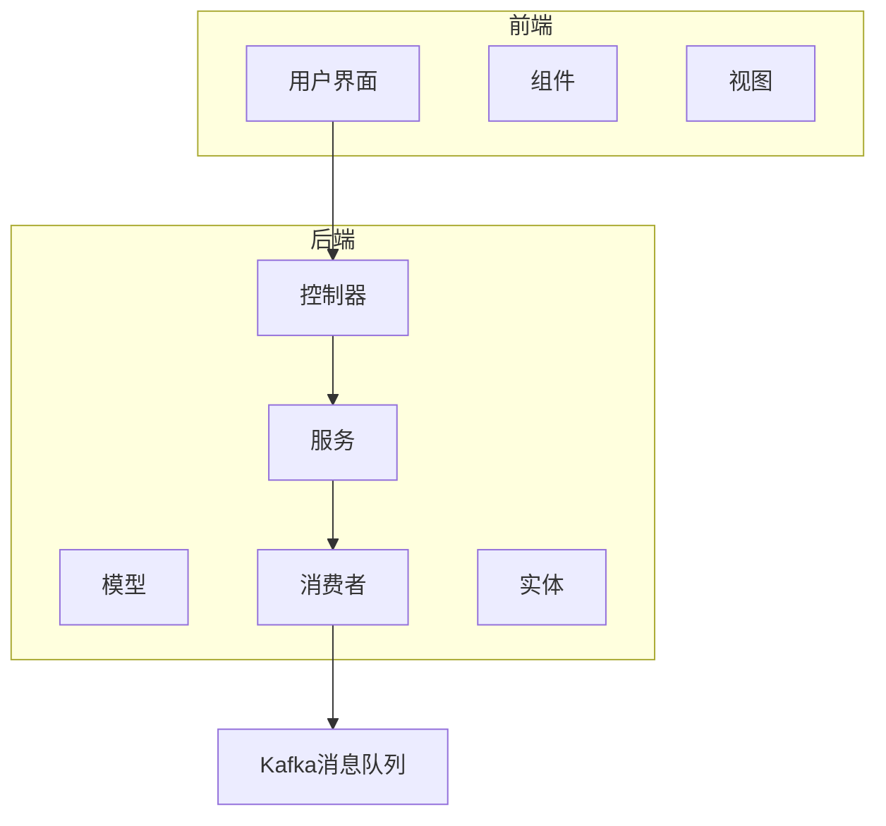
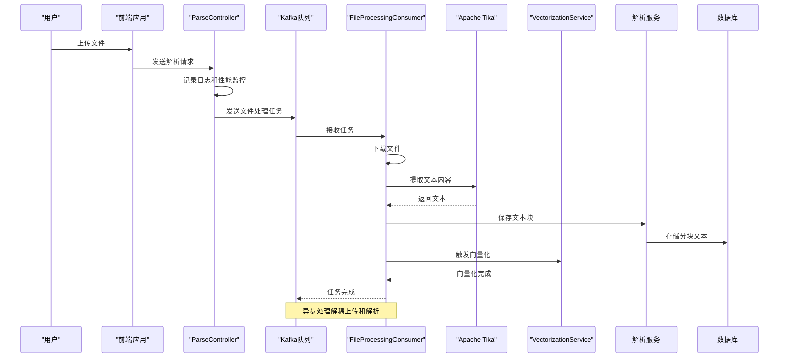
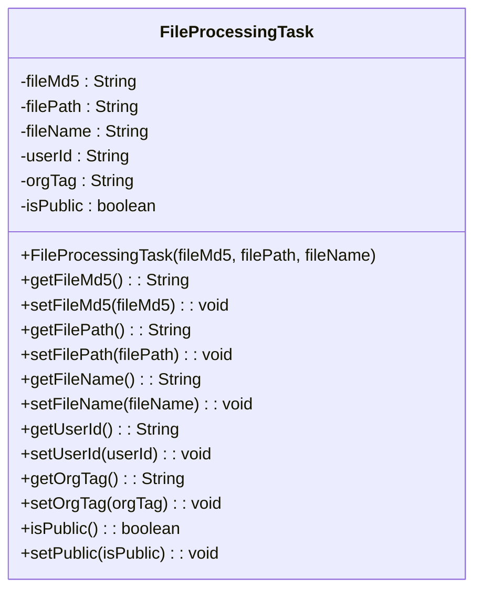
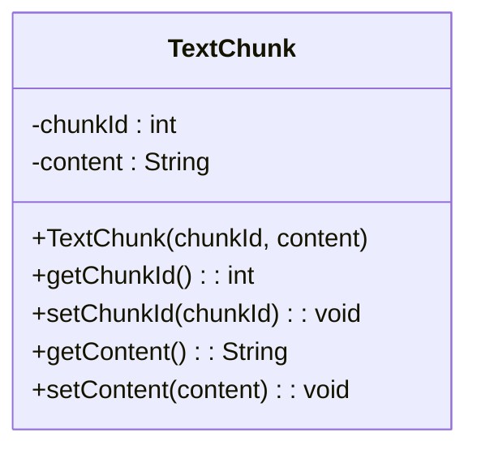
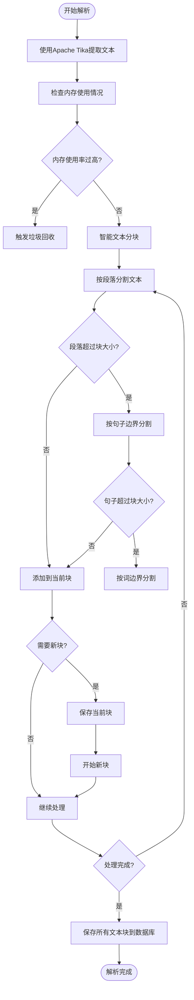
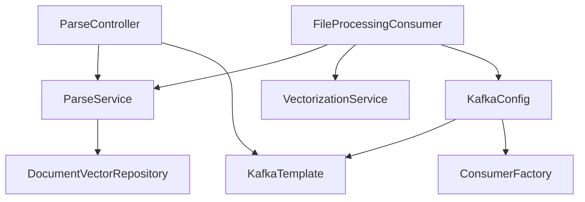

# 文档解析API

<cite>
**本文档引用的文件**   
- [ParseController.java](file://src/main/java/com/yizhaoqi/smartpai/controller/ParseController.java)
- [FileProcessingTask.java](file://src/main/java/com/yizhaoqi/smartpai/model/FileProcessingTask.java)
- [TextChunk.java](file://src/main/java/com/yizhaoqi/smartpai/entity/TextChunk.java)
- [ParseService.java](file://src/main/java/com/yizhaoqi/smartpai/service/ParseService.java)
- [FileProcessingConsumer.java](file://src/main/java/com/yizhaoqi/smartpai/consumer/FileProcessingConsumer.java)
- [KafkaConfig.java](file://src/main/java/com/yizhaoqi/smartpai/config/KafkaConfig.java)
- [WebSocketConfig.java](file://src/main/java/com/yizhaoqi/smartpai/config/WebSocketConfig.java)
- [ChatWebSocketHandler.java](file://src/main/java/com/yizhaoqi/smartpai/handler/ChatWebSocketHandler.java)
</cite>

## 目录
1. [简介](#简介)
2. [项目结构](#项目结构)
3. [核心组件](#核心组件)
4. [架构概述](#架构概述)
5. [详细组件分析](#详细组件分析)
6. [依赖分析](#依赖分析)
7. [性能考虑](#性能考虑)
8. [故障排除指南](#故障排除指南)
9. [结论](#结论)

## 简介
本文档详细描述了文档解析API的技术实现，重点介绍异步解析处理流程。系统通过Kafka消息队列触发文件解析任务，使用Apache Tika进行文本提取，并通过智能分块策略生成文本块。文档涵盖了从文件上传到向量化处理的完整流程，包括REST接口、WebSocket实时通知、错误重试机制等关键功能。

## 项目结构
项目采用典型的前后端分离架构，后端基于Spring Boot框架实现，前端使用Vue.js构建。文档解析功能主要集中在后端`src/main/java/com/yizhaoqi/smartpai`包下，涉及控制器、服务、模型和消费者等多个组件。



**图源**
- [ParseController.java](file://src/main/java/com/yizhaoqi/smartpai/controller/ParseController.java)
- [ParseService.java](file://src/main/java/com/yizhaoqi/smartpai/service/ParseService.java)

**节源**
- [ParseController.java](file://src/main/java/com/yizhaoqi/smartpai/controller/ParseController.java)
- [ParseService.java](file://src/main/java/com/yizhaoqi/smartpai/service/ParseService.java)

## 核心组件
文档解析系统的核心组件包括解析控制器、解析服务、文件处理任务模型、文本块实体和文件处理消费者。这些组件协同工作，实现了从文件上传到文本提取、分块和向量化的完整流程。

**节源**
- [ParseController.java](file://src/main/java/com/yizhaoqi/smartpai/controller/ParseController.java#L1-L45)
- [ParseService.java](file://src/main/java/com/yizhaoqi/smartpai/service/ParseService.java#L1-L418)

## 架构概述
系统采用异步处理架构，通过Kafka消息队列解耦文件上传和解析处理。当用户上传文件后，系统创建解析任务并发送到Kafka队列，后台消费者从队列中获取任务并执行解析操作。



**图源**
- [ParseController.java](file://src/main/java/com/yizhaoqi/smartpai/controller/ParseController.java#L1-L45)
- [FileProcessingConsumer.java](file://src/main/java/com/yizhaoqi/smartpai/consumer/FileProcessingConsumer.java#L1-L128)

## 详细组件分析

### 文件处理任务模型分析
`FileProcessingTask`模型定义了文件处理任务的数据结构，包含文件标识、路径、用户信息和权限设置等关键字段。



**图源**
- [FileProcessingTask.java](file://src/main/java/com/yizhaoqi/smartpai/model/FileProcessingTask.java#L1-L32)

**节源**
- [FileProcessingTask.java](file://src/main/java/com/yizhaoqi/smartpai/model/FileProcessingTask.java#L1-L32)

### 文本块实体分析
`TextChunk`实体类用于表示文档解析后的文本分块，每个块包含唯一的序号和具体内容。



**图源**
- [TextChunk.java](file://src/main/java/com/yizhaoqi/smartpai/entity/TextChunk.java#L1-L20)

**节源**
- [TextChunk.java](file://src/main/java/com/yizhaoqi/smartpai/entity/TextChunk.java#L1-L20)

### 解析服务分析
`ParseService`是文档解析的核心服务，负责文本提取、智能分块和数据存储。



**图源**
- [ParseService.java](file://src/main/java/com/yizhaoqi/smartpai/service/ParseService.java#L1-L418)

**节源**
- [ParseService.java](file://src/main/java/com/yizhaoqi/smartpai/service/ParseService.java#L1-L418)

### 文件处理消费者分析
`FileProcessingConsumer`是Kafka消息的消费者，负责从队列中获取任务并执行文件解析和向量化。

```mermaid
sequenceDiagram
participant Kafka as "Kafka队列"
participant 消费者 as "FileProcessingConsumer"
participant 存储 as "文件存储"
participant 解析服务 as "ParseService"
participant 向量化服务 as "VectorizationService"
Kafka->>消费者 : 发送FileProcessingTask
消费者->>消费者 : 记录任务接收日志
消费者->>存储 : 下载文件
存储-->>消费者 : 返回文件流
消费者->>解析服务 : 调用parseAndSave
解析服务->>解析服务 : 使用Tika提取文本
解析服务->>解析服务 : 智能分块
解析服务->>数据库 : 保存文本块
解析服务-->>消费者 : 解析完成
消费者->>向量化服务 : 调用vectorize
向量化服务-->>消费者 : 向量化完成
消费者-->>Kafka : 任务处理完成
exception(异常处理)
消费者->>消费者 : 记录错误日志
消费者->>Kafka : 抛出异常触发重试
```

**图源**
- [FileProcessingConsumer.java](file://src/main/java/com/yizhaoqi/smartpai/consumer/FileProcessingConsumer.java#L1-L128)

**节源**
- [FileProcessingConsumer.java](file://src/main/java/com/yizhaoqi/smartpai/consumer/FileProcessingConsumer.java#L1-L128)

## 依赖分析
系统各组件之间的依赖关系清晰，通过Spring的依赖注入机制进行管理。Kafka作为消息中间件，实现了上传服务和解析服务的解耦。



**图源**
- [ParseController.java](file://src/main/java/com/yizhaoqi/smartpai/controller/ParseController.java)
- [ParseService.java](file://src/main/java/com/yizhaoqi/smartpai/service/ParseService.java)
- [FileProcessingConsumer.java](file://src/main/java/com/yizhaoqi/smartpai/consumer/FileProcessingConsumer.java)
- [KafkaConfig.java](file://src/main/java/com/yizhaoqi/smartpai/config/KafkaConfig.java)

**节源**
- [ParseController.java](file://src/main/java/com/yizhaoqi/smartpai/controller/ParseController.java#L1-L45)
- [ParseService.java](file://src/main/java/com/yizhaoqi/smartpai/service/ParseService.java#L1-L418)
- [FileProcessingConsumer.java](file://src/main/java/com/yizhaoqi/smartpai/consumer/FileProcessingConsumer.java#L1-L128)

## 性能考虑
系统在设计时充分考虑了性能因素，包括内存使用监控、流式处理和智能分块等策略。

- **内存管理**：`ParseService`中实现了内存使用率监控，当内存使用超过阈值时会触发垃圾回收，防止内存溢出。
- **流式处理**：使用`StreamingContentHandler`实现流式文本提取，避免大文件一次性加载到内存。
- **智能分块**：采用语义感知的分块策略，优先在段落、句子边界分割，保持文本的语义完整性。
- **重试机制**：Kafka配置了`DefaultErrorHandler`，支持固定间隔的自动重试和死信队列，确保任务的可靠性。

## 故障排除指南
### 常见问题及解决方案

**解析失败**
- **现象**：返回500错误，日志显示"文档解析失败"
- **原因**：文件格式不受支持、文件损坏或内存不足
- **解决方案**：检查文件格式是否在支持列表中，验证文件完整性，增加JVM内存或调整`maxMemoryThreshold`配置

**任务积压**
- **现象**：Kafka队列中任务数量持续增加
- **原因**：消费者处理速度慢于生产速度
- **解决方案**：增加消费者实例，优化解析算法性能，或调整Kafka分区策略

**内存溢出**
- **现象**：系统频繁GC或OutOfMemoryError
- **原因**：处理大文件时内存使用过高
- **解决方案**：降低`chunk-size`配置，优化流式处理逻辑，增加堆内存

**WebSocket连接失败**
- **现象**：前端无法建立WebSocket连接
- **原因**：JWT令牌无效或WebSocket配置错误
- **解决方案**：验证JWT令牌有效性，检查`WebSocketConfig`中的路径配置

**节源**
- [ParseService.java](file://src/main/java/com/yizhaoqi/smartpai/service/ParseService.java#L1-L418)
- [FileProcessingConsumer.java](file://src/main/java/com/yizhaoqi/smartpai/consumer/FileProcessingConsumer.java#L1-L128)
- [WebSocketConfig.java](file://src/main/java/com/yizhaoqi/smartpai/config/WebSocketConfig.java#L1-L23)
- [ChatWebSocketHandler.java](file://src/main/java/com/yizhaoqi/smartpai/handler/ChatWebSocketHandler.java#L1-L121)

## 结论
文档解析API采用异步处理架构，通过Kafka消息队列实现了上传和解析的解耦，提高了系统的可扩展性和可靠性。系统使用Apache Tika进行多格式文档解析，结合智能分块策略保持文本语义完整性。通过WebSocket实现实时进度通知，提供良好的用户体验。完善的错误处理和重试机制确保了任务的可靠性。整体设计合理，性能优化到位，能够满足大规模文档处理的需求。