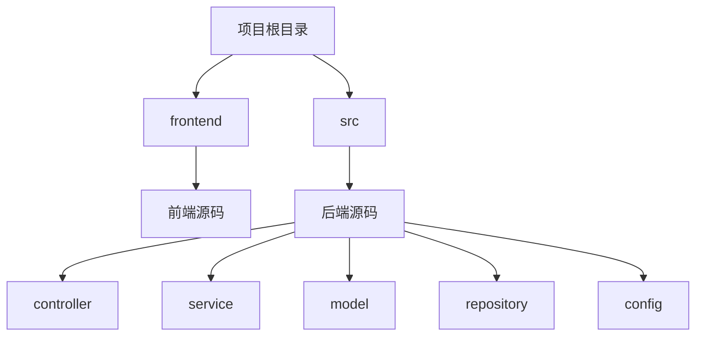
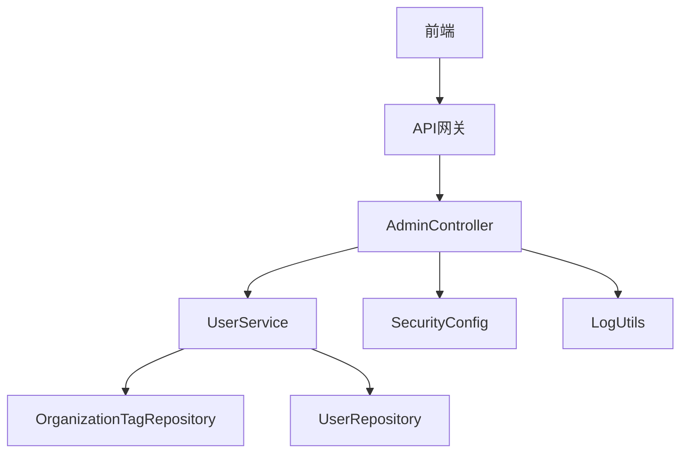
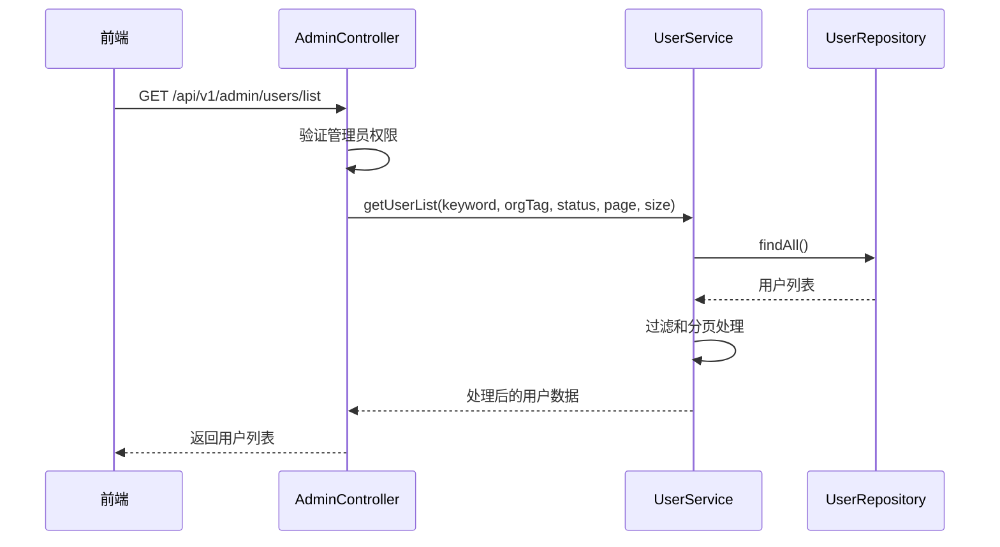
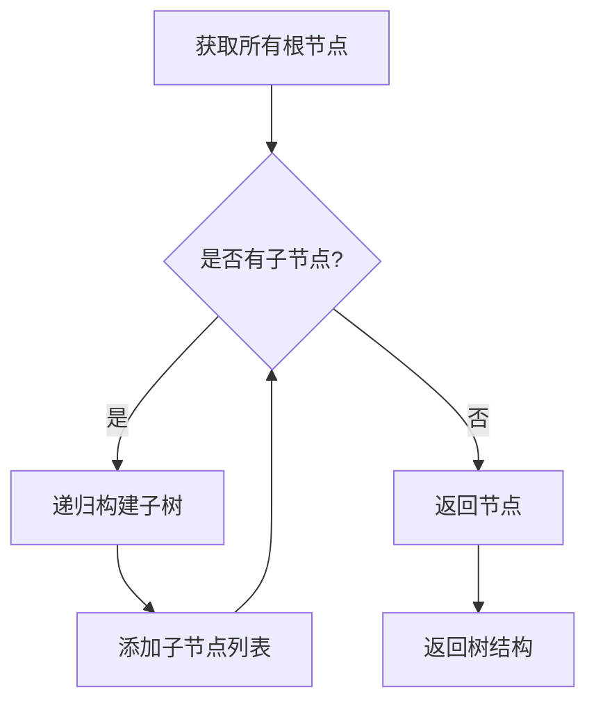
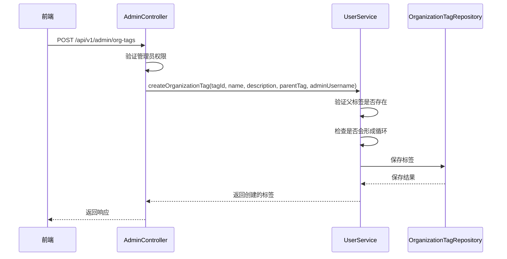
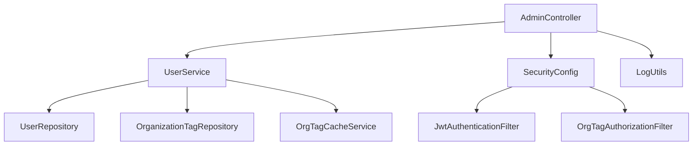

# 管理API

<cite>
**本文档中引用的文件**   
- [OrganizationTag.java](file://src/main/java/com/yizhaoqi/smartpai/model/OrganizationTag.java)
- [UserService.java](file://src/main/java/com/yizhaoqi/smartpai/service/UserService.java)
- [SecurityConfig.java](file://src/main/java/com/yizhaoqi/smartpai/config/SecurityConfig.java)
- [LogUtils.java](file://src/main/java/com/yizhaoqi/smartpai/utils/LogUtils.java)
- [AdminController.java](file://src/main/java/com/yizhaoqi/smartpai/controller/AdminController.java)
- [UserController.java](file://src/main/java/com/yizhaoqi/smartpai/controller/UserController.java)
</cite>

## 目录
1. [简介](#简介)
2. [项目结构](#项目结构)
3. [核心组件](#核心组件)
4. [架构概述](#架构概述)
5. [详细组件分析](#详细组件分析)
6. [依赖分析](#依赖分析)
7. [性能考虑](#性能考虑)
8. [故障排除指南](#故障排除指南)
9. [结论](#结论)

## 简介
本文档旨在为管理员提供全面的API文档，涵盖用户管理、系统配置、组织标签管理等后台功能。文档详细描述了各接口的权限等级要求、请求参数和响应结构，并说明了敏感操作的日志记录机制。所有接口均需管理员权限（ROLE_ADMIN）访问，禁止前端直接暴露于普通用户。

## 项目结构
项目采用前后端分离架构，后端基于Spring Boot框架，前端使用Vue.js。主要目录结构如下：



**图源**
- [项目结构](file://)

**章节源**
- [项目结构](file://)

## 核心组件
核心组件包括用户管理、组织标签管理、权限控制和日志记录。这些组件共同构成了系统的管理功能基础。

**章节源**
- [OrganizationTag.java](file://src/main/java/com/yizhaoqi/smartpai/model/OrganizationTag.java)
- [UserService.java](file://src/main/java/com/yizhaoqi/smartpai/service/UserService.java)

## 架构概述
系统采用分层架构，包括控制器层、服务层、数据访问层和模型层。权限控制通过Spring Security实现，日志记录使用SLF4J和MDC。



**图源**
- [AdminController.java](file://src/main/java/com/yizhaoqi/smartpai/controller/AdminController.java)
- [UserService.java](file://src/main/java/com/yizhaoqi/smartpai/service/UserService.java)
- [SecurityConfig.java](file://src/main/java/com/yizhaoqi/smartpai/config/SecurityConfig.java)
- [LogUtils.java](file://src/main/java/com/yizhaoqi/smartpai/utils/LogUtils.java)

## 详细组件分析
### 用户管理接口分析
#### 用户增删改查接口
管理员可通过以下接口管理用户：

**获取用户列表**
- **端点**: `GET /api/v1/admin/users/list`
- **权限**: ROLE_ADMIN
- **参数**:
  - `keyword`: 搜索关键词
  - `orgTag`: 组织标签过滤
  - `status`: 用户状态过滤（1: 普通用户, 0: 管理员）
  - `page`: 页码（默认1）
  - `size`: 每页大小（默认20）
- **响应结构**:
```json
{
  "content": [
    {
      "userId": "用户ID",
      "username": "用户名",
      "orgTags": [
        {
          "tagId": "标签ID",
          "name": "标签名称"
        }
      ],
      "primaryOrg": "主组织标签",
      "status": "状态",
      "createdAt": "创建时间"
    }
  ],
  "totalElements": "总元素数",
  "totalPages": "总页数",
  "size": "每页大小",
  "number": "当前页码"
}
```

**创建管理员用户**
- **端点**: `POST /api/v1/admin/users/create-admin`
- **权限**: ROLE_ADMIN
- **请求体**:
```json
{
  "username": "用户名",
  "password": "密码"
}
```



**图源**
- [AdminController.java](file://src/main/java/com/yizhaoqi/smartpai/controller/AdminController.java#L26-L625)
- [UserService.java](file://src/main/java/com/yizhaoqi/smartpai/service/UserService.java#L600-L806)

**章节源**
- [AdminController.java](file://src/main/java/com/yizhaoqi/smartpai/controller/AdminController.java#L26-L625)
- [UserService.java](file://src/main/java/com/yizhaoqi/smartpai/service/UserService.java#L600-L806)

### 组织标签管理接口分析
#### 组织标签树形结构处理
组织标签采用树形结构管理，支持父子层级关系。

**组织标签实体结构**
```java
@Data
@Entity
@Table(name = "organization_tags")
public class OrganizationTag {
    @Id
    @Column(name = "tag_id")
    private String tagId; // 标签唯一标识

    @Column(nullable = false)
    private String name; // 标签名称

    @Column(columnDefinition = "TEXT")
    private String description; // 描述

    @Column(name = "parent_tag", length = 255)
    private String parentTag; // 父标签ID

    @ManyToOne
    @JoinColumn(name = "created_by", nullable = false)
    private User createdBy; // 创建者ID

    @CreationTimestamp
    private LocalDateTime createdAt; // 创建时间

    @UpdateTimestamp
    private LocalDateTime updatedAt; // 更新时间
}
```

**树形结构构建逻辑**


**图源**
- [OrganizationTag.java](file://src/main/java/com/yizhaoqi/smartpai/model/OrganizationTag.java#L0-L35)
- [UserService.java](file://src/main/java/com/yizhaoqi/smartpai/service/UserService.java#L34-L804)

**章节源**
- [OrganizationTag.java](file://src/main/java/com/yizhaoqi/smartpai/model/OrganizationTag.java#L0-L35)
- [UserService.java](file://src/main/java/com/yizhaoqi/smartpai/service/UserService.java#L34-L804)

#### 组织标签CRUD接口
**创建组织标签**
- **端点**: `POST /api/v1/admin/org-tags`
- **权限**: ROLE_ADMIN
- **请求体**:
```json
{
  "tagId": "标签ID",
  "name": "标签名称",
  "description": "描述",
  "parentTag": "父标签ID（可选）"
}
```

**更新组织标签**
- **端点**: `PUT /api/v1/admin/org-tags/{tagId}`
- **权限**: ROLE_ADMIN
- **请求体**:
```json
{
  "name": "新名称",
  "description": "新描述",
  "parentTag": "新父标签ID"
}
```

**删除组织标签**
- **端点**: `DELETE /api/v1/admin/org-tags/{tagId}`
- **权限**: ROLE_ADMIN
- **删除限制**:
  - 不能删除默认标签
  - 不能删除有子标签的标签
  - 不能删除已分配给用户的标签
  - 不能删除作为主组织标签的标签



**图源**
- [AdminController.java](file://src/main/java/com/yizhaoqi/smartpai/controller/AdminController.java#L26-L625)
- [UserService.java](file://src/main/java/com/yizhaoqi/smartpai/service/UserService.java#L34-L804)

**章节源**
- [AdminController.java](file://src/main/java/com/yizhaoqi/smartpai/controller/AdminController.java#L26-L625)
- [UserService.java](file://src/main/java/com/yizhaoqi/smartpai/service/UserService.java#L34-L804)

## 依赖分析
系统各组件之间的依赖关系如下：



**图源**
- [AdminController.java](file://src/main/java/com/yizhaoqi/smartpai/controller/AdminController.java)
- [UserService.java](file://src/main/java/com/yizhaoqi/smartpai/service/UserService.java)
- [SecurityConfig.java](file://src/main/java/com/yizhaoqi/smartpai/config/SecurityConfig.java)

**章节源**
- [AdminController.java](file://src/main/java/com/yizhaoqi/smartpai/controller/AdminController.java)
- [UserService.java](file://src/main/java/com/yizhaoqi/smartpai/service/UserService.java)
- [SecurityConfig.java](file://src/main/java/com/yizhaoqi/smartpai/config/SecurityConfig.java)

## 性能考虑
- 使用Redis缓存组织标签信息，减少数据库查询
- 采用分页查询，避免一次性加载大量数据
- 使用MDC进行日志追踪，便于性能分析
- 对敏感操作进行性能监控

## 故障排除指南
### 常见问题
1. **无法创建组织标签**
   - 检查标签ID是否已存在
   - 检查父标签是否存在
   - 确认不会形成循环引用

2. **删除组织标签失败**
   - 检查标签是否有子标签
   - 检查标签是否已分配给用户
   - 确认标签不是默认标签

3. **权限不足**
   - 确认请求头中包含有效的JWT令牌
   - 确认用户角色为管理员（ROLE_ADMIN）

**章节源**
- [LogUtils.java](file://src/main/java/com/yizhaoqi/smartpai/utils/LogUtils.java#L0-L193)
- [SecurityConfig.java](file://src/main/java/com/yizhaoqi/smartpai/config/SecurityConfig.java#L0-L89)

## 结论
本文档详细介绍了管理员专用API的功能、权限要求和使用方法。所有管理接口均需管理员权限访问，系统通过完善的日志记录机制确保敏感操作的可追溯性。建议在使用这些接口时遵循最佳安全实践，避免直接暴露于前端。