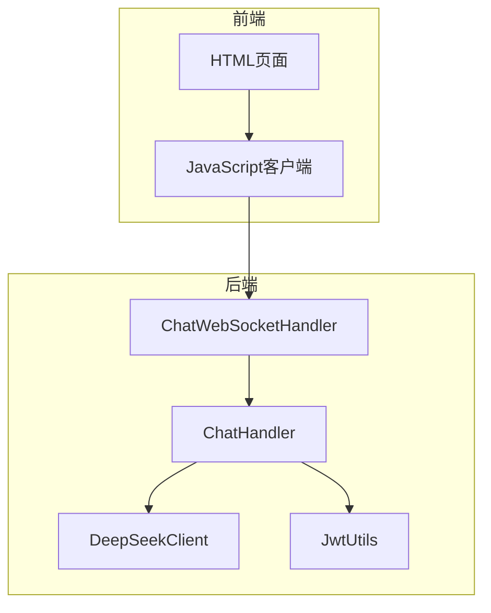
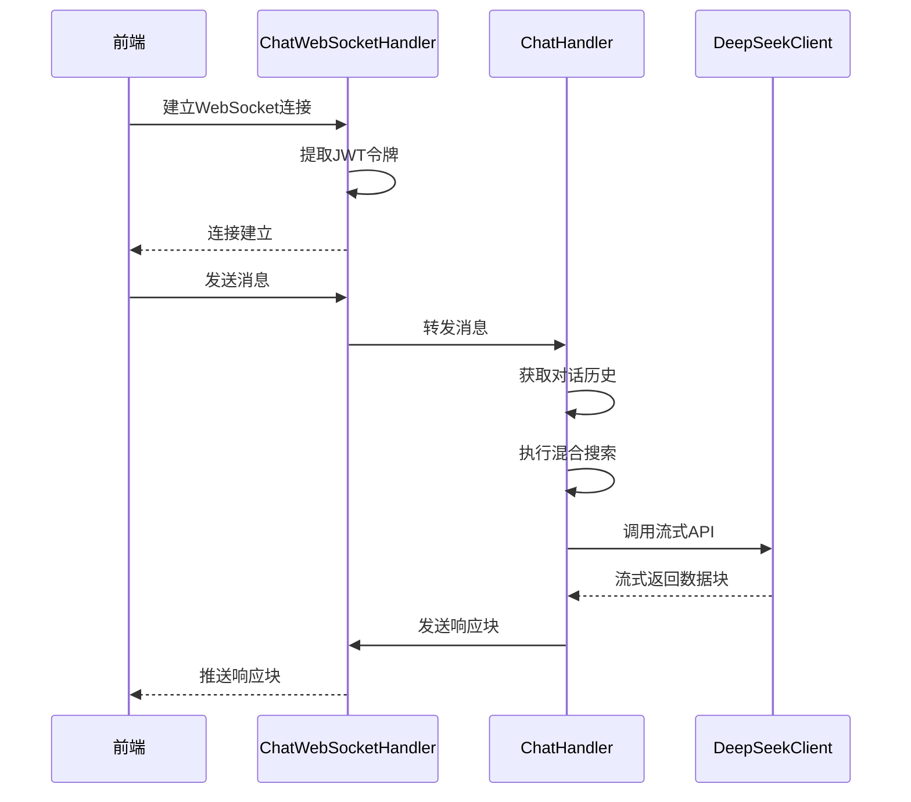
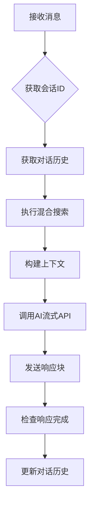
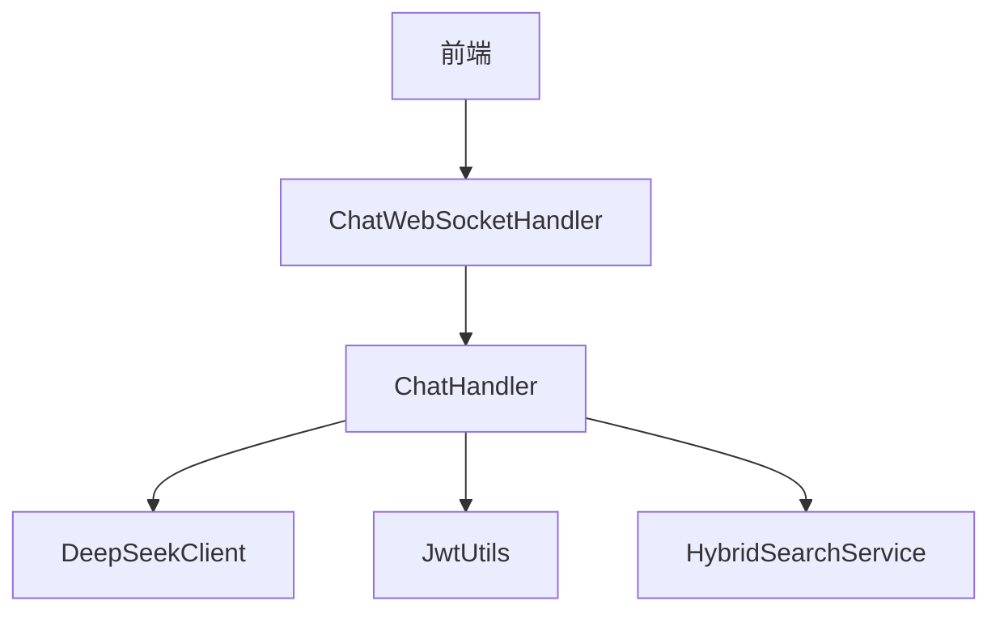

# WebSocket聊天API

<cite>
**本文档引用的文件**   
- [DeepSeekClient.java](file://src/main/java/com/yizhaoqi/smartpai/client/DeepSeekClient.java)
- [ChatWebSocketHandler.java](file://src/main/java/com/yizhaoqi/smartpai/handler/ChatWebSocketHandler.java)
- [ChatHandler.java](file://src/main/java/com/yizhaoqi/smartpai/service/ChatHandler.java)
- [JwtUtils.java](file://src/main/java/com/yizhaoqi/smartpai/utils/JwtUtils.java)
- [test.html](file://src/main/resources/static/test.html)
</cite>

## 目录
1. [简介](#简介)
2. [项目结构](#项目结构)
3. [核心组件](#核心组件)
4. [架构概述](#架构概述)
5. [详细组件分析](#详细组件分析)
6. [依赖分析](#依赖分析)
7. [性能考虑](#性能考虑)
8. [故障排除指南](#故障排除指南)
9. [结论](#结论)

## 简介
本文档详细描述了基于WebSocket的实时聊天API实现。系统通过WebSocket协议实现客户端与服务端的双向实时通信，支持流式AI响应生成。前端使用原生WebSocket连接，后端基于Spring WebSocket实现消息处理。认证机制采用JWT令牌，通过Redis进行令牌状态管理。系统实现了完整的连接生命周期管理、心跳检测、错误处理和消息序列化机制。

## 项目结构
项目采用前后端分离架构，前端位于`frontend`目录，后端位于`src/main`目录。后端使用Spring Boot框架，WebSocket处理器位于`handler`包，业务逻辑在`service`包，AI客户端在`client`包。前端静态资源位于`src/main/resources/static`目录，包含完整的WebSocket连接和消息处理逻辑。



**图示来源**
- [test.html](file://src/main/resources/static/test.html)
- [ChatWebSocketHandler.java](file://src/main/java/com/yizhaoqi/smartpai/handler/ChatWebSocketHandler.java)

## 核心组件
系统核心组件包括WebSocket处理器、聊天处理服务、AI客户端和JWT工具类。WebSocket处理器负责连接管理，聊天处理服务协调消息处理流程，AI客户端调用外部AI模型，JWT工具类处理认证和令牌管理。这些组件通过依赖注入紧密协作，实现完整的聊天功能。

**组件来源**
- [ChatWebSocketHandler.java](file://src/main/java/com/yizhaoqi/smartpai/handler/ChatWebSocketHandler.java#L15-L121)
- [ChatHandler.java](file://src/main/java/com/yizhaoqi/smartpai/service/ChatHandler.java#L0-L346)

## 架构概述
系统采用分层架构，前端通过WebSocket连接后端，后端各组件职责分明。连接建立时，通过JWT令牌认证用户身份。消息处理时，系统检索相关知识库，构建上下文，调用AI模型生成流式响应。整个流程通过WebSocket实时推送给前端。



**图示来源**
- [ChatWebSocketHandler.java](file://src/main/java/com/yizhaoqi/smartpai/handler/ChatWebSocketHandler.java)
- [ChatHandler.java](file://src/main/java/com/yizhaoqi/smartpai/service/ChatHandler.java)

## 详细组件分析

### WebSocket连接建立与认证
系统通过在WebSocket连接URL中传递JWT令牌实现认证。前端登录后获取令牌，将其作为路径参数建立连接。服务端从连接路径提取令牌，通过JwtUtils验证用户身份。

```javascript
// 前端连接代码
ws = new WebSocket(`ws://localhost:8081/chat/${token}`);

// 服务端提取用户ID
private String extractUserId(WebSocketSession session) {
    String path = session.getUri().getPath();
    String[] segments = path.split("/");
    String jwtToken = segments[segments.length - 1];
    return jwtUtils.extractUsernameFromToken(jwtToken);
}
```

**代码来源**
- [test.html](file://src/main/resources/static/test.html#L537-L564)
- [ChatWebSocketHandler.java](file://src/main/java/com/yizhaoqi/smartpai/handler/ChatWebSocketHandler.java#L100-L115)

### 消息帧结构与序列化
消息通过JSON格式传输，响应块包含`chunk`字段，完成通知包含`type`和`status`字段。前后端使用标准JSON序列化，确保数据格式一致。

```json
// 响应块
{"chunk": "这是AI回复的一部分"}

// 完成通知
{
  "type": "completion",
  "status": "finished",
  "message": "响应已完成"
}
```

**代码来源**
- [test.html](file://src/main/resources/static/test.html#L565-L585)
- [ChatHandler.java](file://src/main/java/com/yizhaoqi/smartpai/service/ChatHandler.java#L311-L346)

### 服务端消息处理机制
ChatHandler是核心处理组件，负责协调整个消息处理流程。它获取对话历史，执行知识库搜索，构建AI请求上下文，并处理流式响应。



**图示来源**
- [ChatHandler.java](file://src/main/java/com/yizhaoqi/smartpai/service/ChatHandler.java#L50-L346)

### AI模型流式响应实现
DeepSeekClient使用WebClient实现流式API调用，通过bodyToFlux将响应分解为数据块，逐个处理并推送给前端。

```java
public void streamResponse(String userMessage, 
                         String context,
                         List<Map<String, String>> history,
                         Consumer<String> onChunk,
                         Consumer<Throwable> onError) {
    
    Map<String, Object> request = buildRequest(userMessage, context, history);
    
    webClient.post()
            .uri("/chat/completions")
            .contentType(MediaType.APPLICATION_JSON)
            .bodyValue(request)
            .retrieve()
            .bodyToFlux(String.class)
            .subscribe(onChunk, onError);
}
```

**代码来源**
- [DeepSeekClient.java](file://src/main/java/com/yizhaoqi/smartpai/client/DeepSeekClient.java#L30-L50)

### 心跳检测与连接保活
系统通过前端重连机制实现连接保活。当连接意外关闭时，前端会指数退避重试，最大重试5次，每次间隔逐渐增加。

```javascript
ws.onclose = function(event) {
    if (!intentionalClosure && event.code !== 1000 && reconnectAttempts < maxReconnectAttempts) {
        const timeout = Math.min(1000 * Math.pow(2, reconnectAttempts), 30000);
        setTimeout(() => {
            reconnectAttempts++;
            initializeWebSocket();
        }, timeout);
    }
};
```

**代码来源**
- [test.html](file://src/main/resources/static/test.html#L545-L558)

### 前端连接与消息发送示例
前端使用原生WebSocket API实现连接和消息交互，包含完整的错误处理和状态管理。

```javascript
// 建立连接
function initializeWebSocket() {
    ws = new WebSocket(`ws://localhost:8081/chat/${token}`);
    
    ws.onopen = function() {
        updateConnectionStatus(true);
    };

    ws.onmessage = function(event) {
        const response = JSON.parse(event.data);
        if (response.chunk) {
            updateLastMessage(currentAssistantMessage + response.chunk);
        }
    };
}

// 发送消息
function sendMessage() {
    if (ws.readyState === WebSocket.OPEN) {
        ws.send(message);
    }
}
```

**代码来源**
- [test.html](file://src/main/resources/static/test.html#L530-L642)

## 依赖分析
系统组件间依赖关系清晰，遵循依赖倒置原则。高层组件依赖抽象，具体实现通过Spring容器注入。WebSocket处理器依赖聊天处理服务，聊天处理服务依赖AI客户端和JWT工具类。



**图示来源**
- [ChatWebSocketHandler.java](file://src/main/java/com/yizhaoqi/smartpai/handler/ChatWebSocketHandler.java)
- [ChatHandler.java](file://src/main/java/com/yizhaoqi/smartpai/service/ChatHandler.java)

## 性能考虑
系统在性能方面做了多项优化：使用Redis缓存对话历史，避免频繁数据库访问；流式响应减少用户等待时间；连接复用避免频繁握手。AI响应处理使用异步线程，避免阻塞WebSocket事件循环。

## 故障排除指南
常见问题及解决方案：

1. **连接失败**：检查JWT令牌是否有效，确保登录成功后获取令牌
2. **消息乱序**：系统使用单个WebSocket连接，正常情况下不会出现乱序
3. **网络延迟**：检查AI服务响应时间，优化知识库搜索性能
4. **连接中断**：前端有重连机制，检查网络状况和服务器负载

**问题来源**
- [test.html](file://src/main/resources/static/test.html#L545-L558)
- [ChatHandler.java](file://src/main/java/com/yizhaoqi/smartpai/service/ChatHandler.java#L200-L250)

## 结论
本WebSocket聊天API实现了完整的实时通信功能，具有良好的架构设计和错误处理机制。系统通过流式响应提供流畅的用户体验，通过JWT认证确保安全性，通过Redis缓存提升性能。整体实现稳定可靠，可扩展性强。