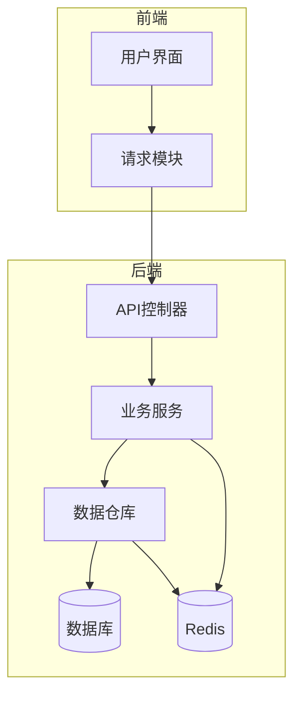
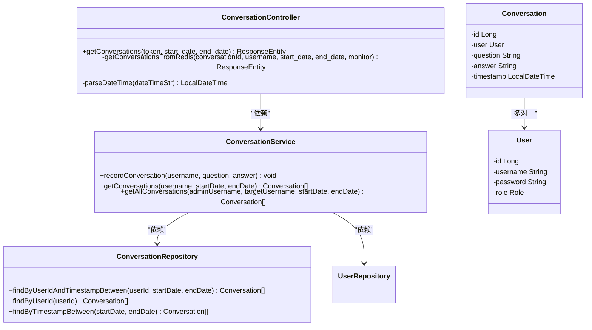
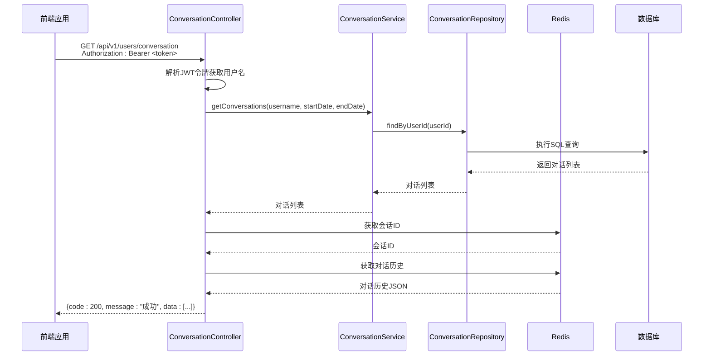
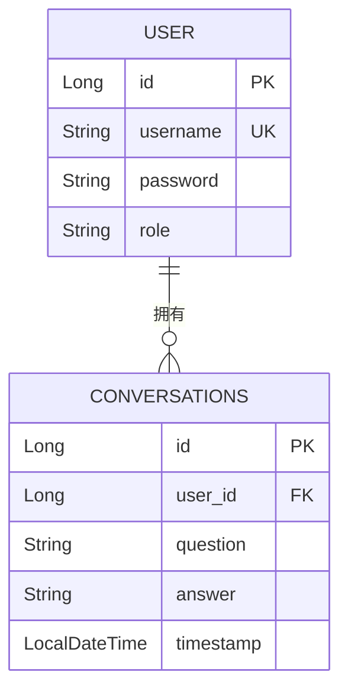
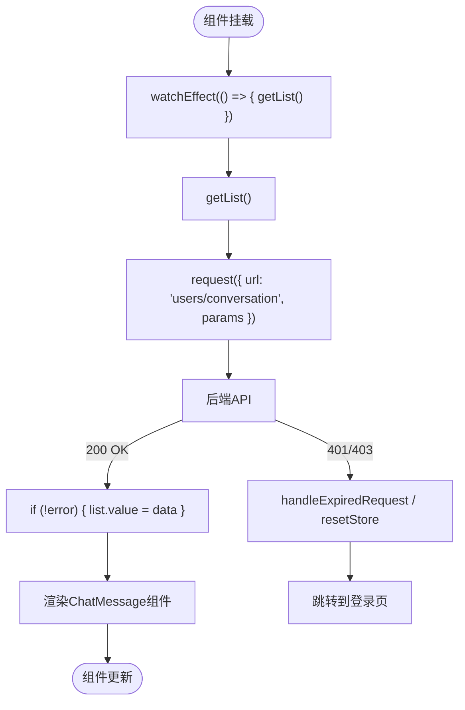
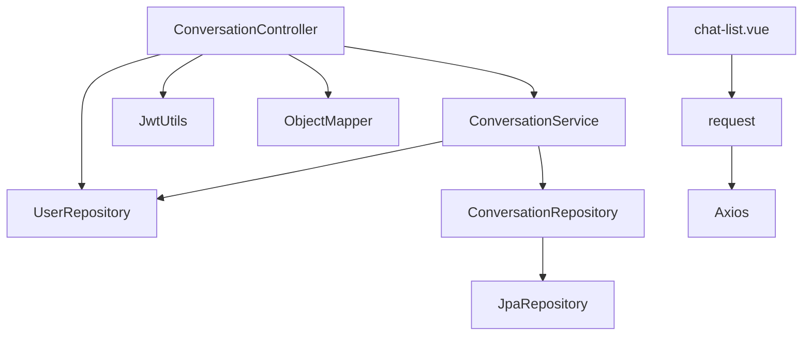

# 会话管理API

<cite>
**本文档中引用的文件**   
- [ConversationController.java](file://src/main/java/com/yizhaoqi/smartpai/controller/ConversationController.java)
- [Conversation.java](file://src/main/java/com/yizhaoqi/smartpai/model/Conversation.java)
- [ConversationService.java](file://src/main/java/com/yizhaoqi/smartpai/service/ConversationService.java)
- [ConversationRepository.java](file://src/main/java/com/yizhaoqi/smartpai/repository/ConversationRepository.java)
- [ChatHandler.java](file://src/main/java/com/yizhaoqi/smartpai/service/ChatHandler.java)
- [chat-list.vue](file://frontend/src/views/chat/modules/chat-list.vue)
- [index.ts](file://frontend/src/service/request/index.ts)
</cite>

## 目录
1. [简介](#简介)
2. [项目结构](#项目结构)
3. [核心组件](#核心组件)
4. [架构概述](#架构概述)
5. [详细组件分析](#详细组件分析)
6. [依赖分析](#依赖分析)
7. [性能考虑](#性能考虑)
8. [故障排除指南](#故障排除指南)
9. [结论](#结论)

## 简介
本文档详细描述了PaiSmart项目中的会话管理API，该API用于管理用户与AI助手之间的对话历史。系统采用前后端分离架构，后端基于Spring Boot实现RESTful API，前端使用Vue.js进行交互。会话数据主要存储在Redis中以实现高性能的实时访问，同时通过JPA持久化到关系型数据库以保证数据的长期存储和可追溯性。API设计遵循REST原则，支持通过HTTP请求进行会话的查询、创建和更新操作。本文档将深入分析API的端点设计、数据模型、业务逻辑以及前后端集成方式。

## 项目结构
该项目采用典型的分层架构，分为前端和后端两个主要部分。后端代码位于`src/main/java`目录下，按照`controller`、`service`、`repository`、`model`等包进行组织，清晰地分离了控制层、业务逻辑层、数据访问层和实体模型。前端代码位于`frontend/src`目录下，采用Vue 3和TypeScript构建，通过模块化的方式组织组件、服务和状态管理。会话管理功能的API端点由后端的`ConversationController`提供，前端通过`request`模块进行调用，并在`chat`视图中进行展示。

**图源**
- [ConversationController.java](file://src/main/java/com/yizhaoqi/smartpai/controller/ConversationController.java)
- [ConversationService.java](file://src/main/java/com/yizhaoqi/smartpai/service/ConversationService.java)
- [ConversationRepository.java](file://src/main/java/com/yizhaoqi/smartpai/repository/ConversationRepository.java)

**节源**
- [ConversationController.java](file://src/main/java/com/yizhaoqi/smartpai/controller/ConversationController.java)
- [ConversationService.java](file://src/main/java/com/yizhaoqi/smartpai/service/ConversationService.java)

## 核心组件
会话管理功能的核心组件包括`ConversationController`、`ConversationService`、`ConversationRepository`以及`Conversation`实体类。`ConversationController`负责处理HTTP请求，是API的入口点。`ConversationService`封装了业务逻辑，处理会话的创建、查询等核心操作。`ConversationRepository`作为数据访问层，负责与数据库和Redis进行交互。`Conversation`实体类定义了会话数据的结构，是数据持久化的基础。这些组件通过依赖注入（DI）紧密协作，共同实现了会话管理功能。

**节源**
- [ConversationController.java](file://src/main/java/com/yizhaoqi/smartpai/controller/ConversationController.java)
- [ConversationService.java](file://src/main/java/com/yizhaoqi/smartpai/service/ConversationService.java)
- [ConversationRepository.java](file://src/main/java/com/yizhaoqi/smartpai/repository/ConversationRepository.java)
- [Conversation.java](file://src/main/java/com/yizhaoqi/smartpai/model/Conversation.java)

## 架构概述
系统采用MVC（Model-View-Controller）架构模式。前端（View）通过HTTP请求与后端的控制器（Controller）交互。控制器接收请求后，调用服务层（Service）处理业务逻辑。服务层协调数据访问层（Repository）与数据库和Redis进行数据读写。数据模型（Model）在各层之间传递，确保数据的一致性。这种分层架构使得代码职责清晰，易于维护和扩展。会话数据的存储采用了混合策略，利用Redis的高性能进行实时读写，同时利用数据库的持久性进行长期存储。

**图源**
- [ConversationController.java](file://src/main/java/com/yizhaoqi/smartpai/controller/ConversationController.java)
- [ConversationService.java](file://src/main/java/com/yizhaoqi/smartpai/service/ConversationService.java)
- [ConversationRepository.java](file://src/main/java/com/yizhaoqi/smartpai/repository/ConversationRepository.java)
- [Conversation.java](file://src/main/java/com/yizhaoqi/smartpai/model/Conversation.java)

## 详细组件分析
### ConversationController 分析
`ConversationController`是会话管理API的入口，负责处理来自前端的HTTP请求。它通过`@RestController`和`@RequestMapping`注解定义了API的基础路径`/api/v1/users/conversation`。该控制器目前仅实现了`GET`方法，用于查询用户的对话历史。它从请求头中提取JWT令牌，解析出用户名，并调用`ConversationService`获取会话数据。控制器还集成了性能监控和日志记录功能，便于问题排查和性能优化。

#### API端点分析

**图源**
- [ConversationController.java](file://src/main/java/com/yizhaoqi/smartpai/controller/ConversationController.java)
- [ConversationService.java](file://src/main/java/com/yizhaoqi/smartpai/service/ConversationService.java)
- [ConversationRepository.java](file://src/main/java/com/yizhaoqi/smartpai/repository/ConversationRepository.java)

**节源**
- [ConversationController.java](file://src/main/java/com/yizhaoqi/smartpai/controller/ConversationController.java#L0-L247)

### Conversation 实体分析
`Conversation`实体类定义了会话数据的核心结构。它通过JPA注解映射到数据库的`conversations`表。实体包含以下关键字段：
- `id`: 主键，由数据库自动生成。
- `user`: 与`User`实体的多对一关联，通过`user_id`外键连接。
- `question`: 用户的提问内容，存储为TEXT类型。
- `answer`: AI助手的回答内容，存储为TEXT类型。
- `timestamp`: 对话发生的时间戳，由数据库自动填充。

该实体的设计简洁明了，专注于存储一次对话的核心信息。通过`@CreationTimestamp`注解，系统能自动记录对话的创建时间，无需手动设置。

**图源**
- [Conversation.java](file://src/main/java/com/yizhaoqi/smartpai/model/Conversation.java#L0-L33)

**节源**
- [Conversation.java](file://src/main/java/com/yizhaoqi/smartpai/model/Conversation.java#L0-L33)

### 前端集成分析
前端通过`chat-list.vue`组件集成会话管理API。该组件使用`useChatStore`管理聊天状态，并在`watchEffect`中监听参数变化，自动调用`getList`函数获取会话列表。`getList`函数通过`request`模块发送HTTP请求到`/users/conversation`端点，并将返回的数据更新到`list`状态中。组件还提供了日期范围选择器，允许用户按时间筛选会话。前端请求配置在`index.ts`中，统一设置了基础URL和请求头，包括JWT令牌的自动注入。

**图源**
- [chat-list.vue](file://frontend/src/views/chat/modules/chat-list.vue#L0-L78)
- [index.ts](file://frontend/src/service/request/index.ts#L0-L154)

**节源**
- [chat-list.vue](file://frontend/src/views/chat/modules/chat-list.vue#L0-L78)

## 依赖分析
系统各组件之间的依赖关系清晰。`ConversationController`直接依赖`ConversationService`、`UserRepository`、`JwtUtils`和`ObjectMapper`。`ConversationService`依赖`ConversationRepository`和`UserRepository`来访问数据。`ConversationRepository`继承自`JpaRepository`，由Spring Data JPA实现，间接依赖数据库驱动。前端的`chat-list.vue`组件依赖`request`模块进行网络通信。这种依赖关系确保了业务逻辑的集中和数据访问的统一。

**图源**
- [ConversationController.java](file://src/main/java/com/yizhaoqi/smartpai/controller/ConversationController.java)
- [ConversationService.java](file://src/main/java/com/yizhaoqi/smartpai/service/ConversationService.java)
- [ConversationRepository.java](file://src/main/java/com/yizhaoqi/smartpai/repository/ConversationRepository.java)
- [chat-list.vue](file://frontend/src/views/chat/modules/chat-list.vue)
- [index.ts](file://frontend/src/service/request/index.ts)

**节源**
- [ConversationController.java](file://src/main/java/com/yizhaoqi/smartpai/controller/ConversationController.java)
- [ConversationService.java](file://src/main/java/com/yizhaoqi/smartpai/service/ConversationService.java)
- [ConversationRepository.java](file://src/main/java/com/yizhaoqi/smartpai/repository/ConversationRepository.java)

## 性能考虑
系统在性能方面做了多项优化。首先，使用Redis作为会话历史的缓存层，极大地提高了读取速度。其次，`ConversationRepository`中的查询方法都定义了数据库索引（`idx_user_id`和`idx_timestamp`），确保了按用户和时间查询的高效性。此外，`ChatHandler`中的消息处理采用了异步非阻塞的方式，通过`CompletableFuture`和后台线程来处理流式响应，避免了阻塞主线程。日志系统还集成了性能监控，可以追踪关键操作的执行时间。

## 故障排除指南
当遇到API调用失败时，可以按照以下步骤进行排查：
1.  **检查HTTP状态码**：401表示未授权，通常是因为JWT令牌无效或过期；403表示权限不足；404表示资源未找到；500表示服务器内部错误。
2.  **查看响应体**：响应体中的`message`字段会提供具体的错误信息。
3.  **检查日志**：后端的`LogUtils`会记录详细的业务日志和错误日志，是定位问题的关键。
4.  **验证Redis和数据库**：确认Redis中是否存在对应的会话键（如`user:1:current_conversation`），以及数据库中是否有相关的会话记录。
5.  **检查网络和配置**：确保前端请求的URL和后端配置的`baseURL`一致。

**节源**
- [ConversationController.java](file://src/main/java/com/yizhaoqi/smartpai/controller/ConversationController.java)
- [index.ts](file://frontend/src/service/request/index.ts)

## 结论
PaiSmart项目的会话管理API设计合理，功能完整。它通过RESTful接口提供了对用户对话历史的查询能力，并利用Redis和数据库的混合存储策略兼顾了性能和持久性。虽然当前API仅实现了查询功能，但其分层架构和清晰的代码结构为后续添加创建、更新和删除等操作奠定了良好的基础。前端集成流畅，能够实现实时的会话列表展示。未来可以考虑增加对会话的增删改操作，并优化分页和排序功能，以提供更完善的用户体验。