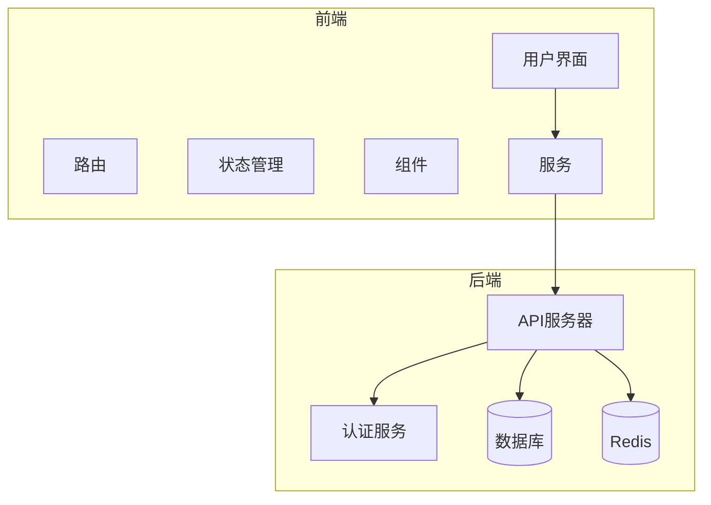
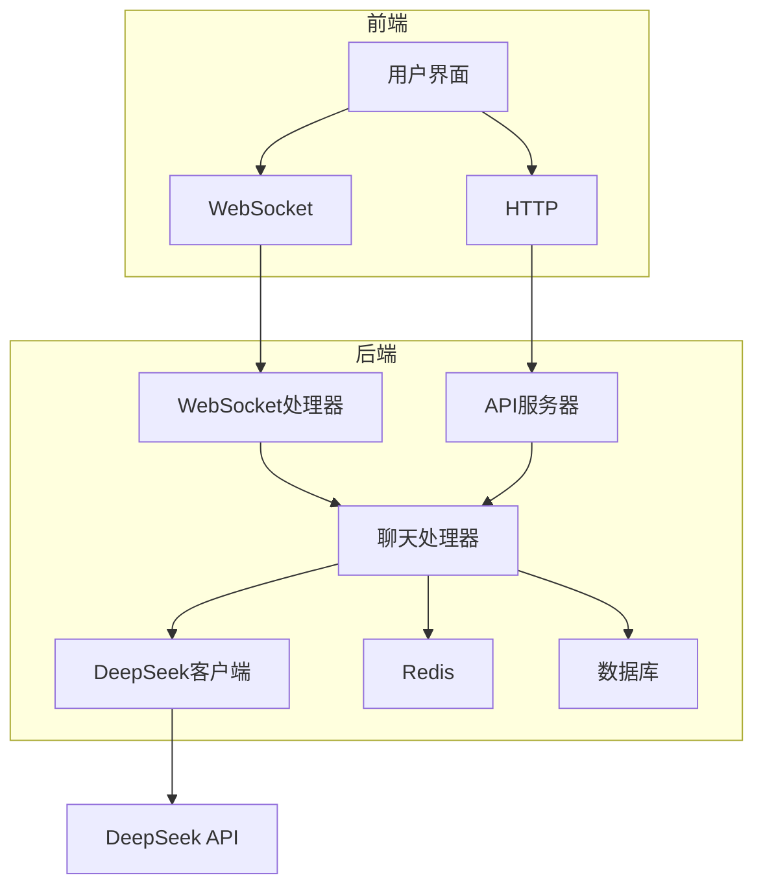
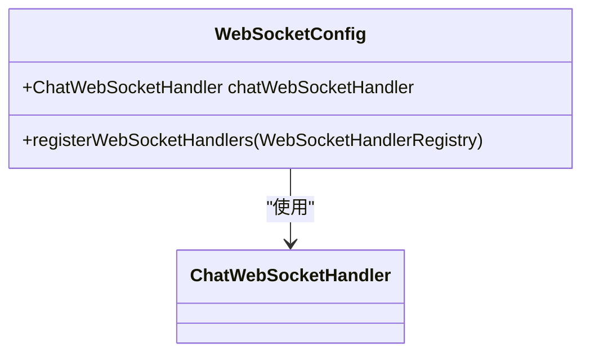
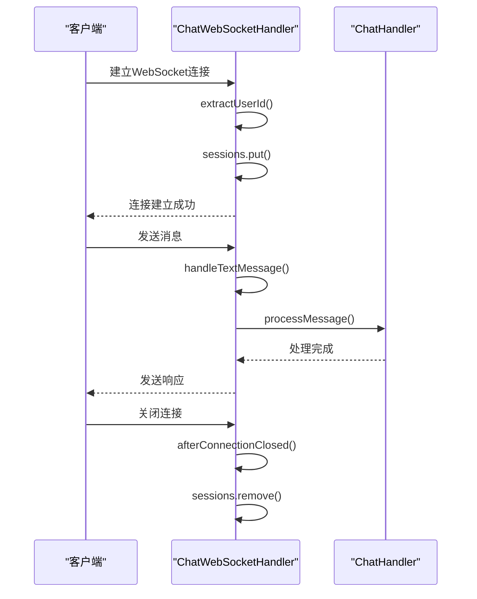
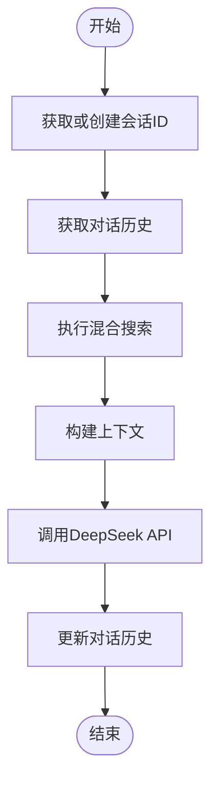
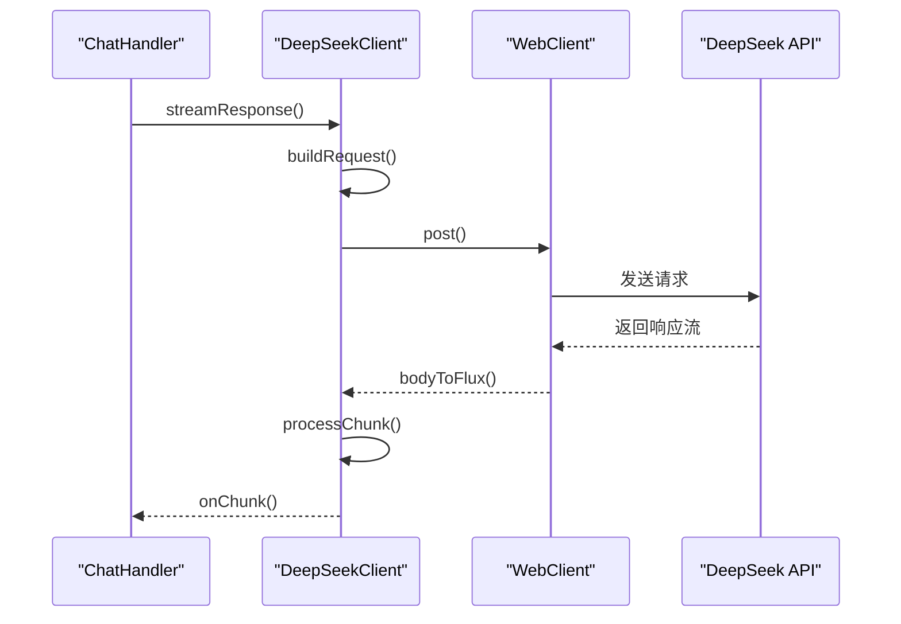
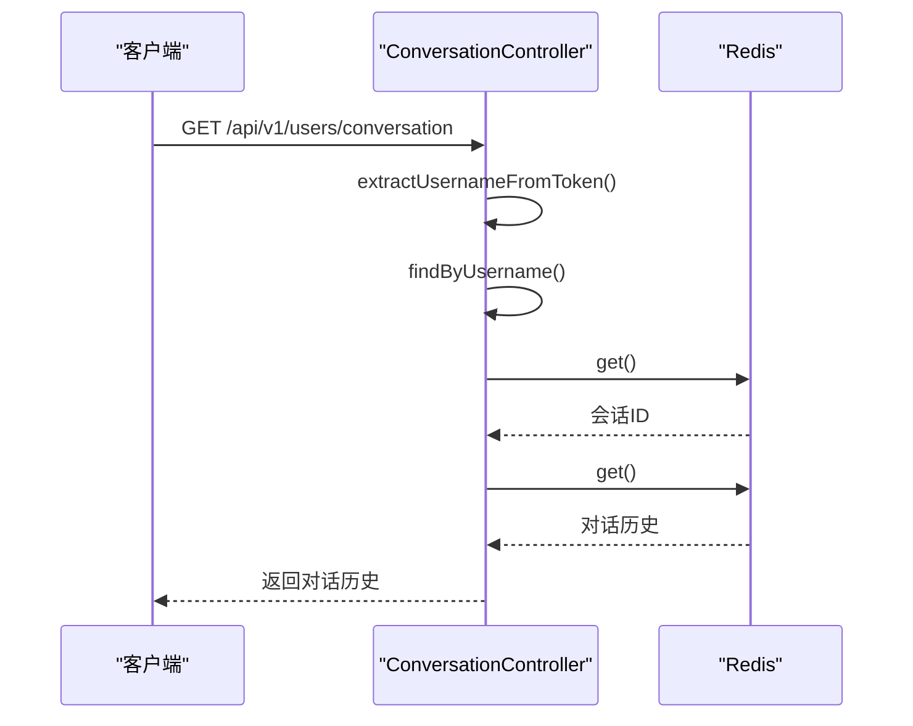
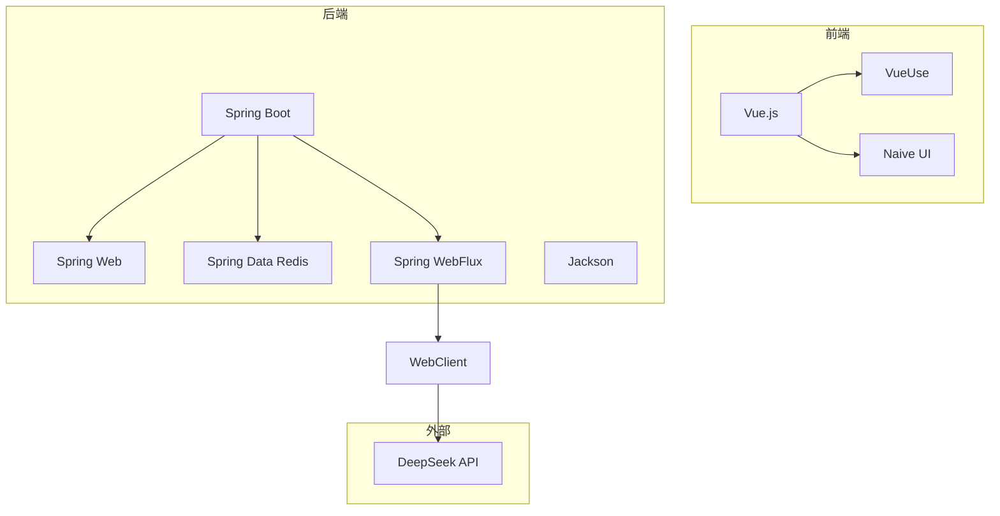

# 聊天API

<cite>
**本文档中引用的文件**   
- [WebSocketConfig.java](file://src/main/java/com/yizhaoqi/smartpai/config/WebSocketConfig.java#L10-L22)
- [ChatWebSocketHandler.java](file://src/main/java/com/yizhaoqi/smartpai/handler/ChatWebSocketHandler.java#L15-L121)
- [ChatHandler.java](file://src/main/java/com/yizhaoqi/smartpai/service/ChatHandler.java#L29-L399)
- [DeepSeekClient.java](file://src/main/java/com/yizhaoqi/smartpai/client/DeepSeekClient.java#L17-L161)
- [ConversationController.java](file://src/main/java/com/yizhaoqi/smartpai/controller/ConversationController.java#L24-L246)
- [index.vue](file://frontend/src/views/chat/index.vue#L1-L14)
- [input-box.vue](file://frontend/src/views/chat/modules/input-box.vue#L1-L115)
- [chat/index.ts](file://frontend/src/store/modules/chat/index.ts#L1-L34)
- [ChatController.java](file://src/main/java/com/yizhaoqi/smartpai/controller/ChatController.java#L16-L80)
</cite>

## 目录
1. [简介](#简介)
2. [项目结构](#项目结构)
3. [核心组件](#核心组件)
4. [架构概述](#架构概述)
5. [详细组件分析](#详细组件分析)
6. [依赖分析](#依赖分析)
7. [性能考虑](#性能考虑)
8. [故障排除指南](#故障排除指南)
9. [结论](#结论)

## 简介
本文档详细介绍了PaiSmart项目中的聊天API，涵盖了WebSocket连接建立、消息收发、会话管理等功能。文档详细说明了WebSocket连接URL（/chat/{token}）、握手协议、消息帧格式（JSON结构包含消息ID、内容、角色等）和心跳机制。同时，文档描述了HTTP接口用于获取历史会话列表、创建新会话、删除会话等操作。此外，文档还说明了消息流式响应的SSE或WebSocket实现方式，以及前后端消息确认机制。提供了前端连接WebSocket并发送查询消息的代码示例，并列出了常见错误（如连接超时、会话不存在）的处理方案。

## 项目结构
PaiSmart项目采用前后端分离的架构，前端使用Vue.js框架，后端使用Spring Boot框架。项目结构清晰，前端和后端代码分别位于`frontend`和`src`目录下。前端代码主要包含组件、常量、枚举、钩子、布局、本地化、插件、路由、服务、存储、样式、主题、类型定义、工具、视图等模块。后端代码主要包含客户端、配置、消费者、控制器、实体、异常、处理器、模型、仓库、服务、测试、工具等模块。

**图示来源**
- [WebSocketConfig.java](file://src/main/java/com/yizhaoqi/smartpai/config/WebSocketConfig.java#L10-L22)
- [ChatWebSocketHandler.java](file://src/main/java/com/yizhaoqi/smartpai/handler/ChatWebSocketHandler.java#L15-L121)

**本节来源**
- [WebSocketConfig.java](file://src/main/java/com/yizhaoqi/smartpai/config/WebSocketConfig.java#L10-L22)
- [ChatWebSocketHandler.java](file://src/main/java/com/yizhaoqi/smartpai/handler/ChatWebSocketHandler.java#L15-L121)

## 核心组件
聊天API的核心组件包括WebSocket配置、WebSocket处理器、聊天处理器、DeepSeek客户端和会话控制器。WebSocket配置类`WebSocketConfig`负责注册WebSocket处理器和URL路径。WebSocket处理器`ChatWebSocketHandler`负责处理WebSocket连接的建立、消息接收和连接关闭。聊天处理器`ChatHandler`负责处理聊天消息的核心逻辑，包括获取或创建会话ID、获取对话历史、执行混合搜索、构建上下文、调用DeepSeek API并处理流式响应。DeepSeek客户端`DeepSeekClient`负责与DeepSeek API进行通信，处理流式响应。会话控制器`ConversationController`负责管理会话相关的HTTP API，包括获取历史会话列表、创建新会话、删除会话等操作。

**本节来源**
- [ChatHandler.java](file://src/main/java/com/yizhaoqi/smartpai/service/ChatHandler.java#L29-L399)
- [DeepSeekClient.java](file://src/main/java/com/yizhaoqi/smartpai/client/DeepSeekClient.java#L17-L161)
- [ConversationController.java](file://src/main/java/com/yizhaoqi/smartpai/controller/ConversationController.java#L24-L246)

## 架构概述
聊天API的架构主要包括前端、后端、数据库和外部API。前端通过WebSocket与后端进行实时通信，后端通过HTTP API与前端进行非实时通信。后端通过Redis存储会话历史和会话ID，通过数据库存储用户信息和其他数据。后端通过WebClient与DeepSeek API进行通信，获取AI生成的回复。

**图示来源**
- [ChatHandler.java](file://src/main/java/com/yizhaoqi/smartpai/service/ChatHandler.java#L29-L399)
- [DeepSeekClient.java](file://src/main/java/com/yizhaoqi/smartpai/client/DeepSeekClient.java#L17-L161)
- [ConversationController.java](file://src/main/java/com/yizhaoqi/smartpai/controller/ConversationController.java#L24-L246)

## 详细组件分析

### WebSocket配置分析
WebSocket配置类`WebSocketConfig`负责注册WebSocket处理器和URL路径。该类使用`@Configuration`和`@EnableWebSocket`注解，实现了`WebSocketConfigurer`接口。在`registerWebSocketHandlers`方法中，注册了`ChatWebSocketHandler`处理器，并指定了URL路径为`/chat/{token}`，允许所有来源访问。

**图示来源**
- [WebSocketConfig.java](file://src/main/java/com/yizhaoqi/smartpai/config/WebSocketConfig.java#L10-L22)

**本节来源**
- [WebSocketConfig.java](file://src/main/java/com/yizhaoqi/smartpai/config/WebSocketConfig.java#L10-L22)

### WebSocket处理器分析
WebSocket处理器`ChatWebSocketHandler`负责处理WebSocket连接的建立、消息接收和连接关闭。该类继承了`TextWebSocketHandler`类，重写了`afterConnectionEstablished`、`handleTextMessage`和`afterConnectionClosed`方法。在`afterConnectionEstablished`方法中，提取用户ID并将其存储在`sessions`映射中。在`handleTextMessage`方法中，解析消息并调用`ChatHandler`处理消息。在`afterConnectionClosed`方法中，从`sessions`映射中移除用户ID。

**图示来源**
- [ChatWebSocketHandler.java](file://src/main/java/com/yizhaoqi/smartpai/handler/ChatWebSocketHandler.java#L15-L121)

**本节来源**
- [ChatWebSocketHandler.java](file://src/main/java/com/yizhaoqi/smartpai/handler/ChatWebSocketHandler.java#L15-L121)

### 聊天处理器分析
聊天处理器`ChatHandler`负责处理聊天消息的核心逻辑。该类使用`@Service`注解，注入了`RedisTemplate`、`HybridSearchService`和`DeepSeekClient`。`processMessage`方法是核心方法，负责处理用户消息。该方法首先获取或创建会话ID，然后获取对话历史，执行混合搜索，构建上下文，调用DeepSeek API并处理流式响应。

**图示来源**
- [ChatHandler.java](file://src/main/java/com/yizhaoqi/smartpai/service/ChatHandler.java#L29-L399)

**本节来源**
- [ChatHandler.java](file://src/main/java/com/yizhaoqi/smartpai/service/ChatHandler.java#L29-L399)

### DeepSeek客户端分析
DeepSeek客户端`DeepSeekClient`负责与DeepSeek API进行通信，处理流式响应。该类使用`@Service`注解，注入了`WebClient`、`apiKey`、`model`和`aiProperties`。`streamResponse`方法是核心方法，负责发送请求并处理流式响应。该方法构建请求，发送POST请求，并订阅响应流。

**图示来源**
- [DeepSeekClient.java](file://src/main/java/com/yizhaoqi/smartpai/client/DeepSeekClient.java#L17-L161)

**本节来源**
- [DeepSeekClient.java](file://src/main/java/com/yizhaoqi/smartpai/client/DeepSeekClient.java#L17-L161)

### 会话控制器分析
会话控制器`ConversationController`负责管理会话相关的HTTP API。该类使用`@RestController`和`@RequestMapping`注解，注入了`RedisTemplate`、`UserRepository`、`JwtUtils`和`ObjectMapper`。`getConversations`方法是核心方法，负责获取历史会话列表。该方法从token中提取用户名，查询Redis获取会话ID，然后获取对话历史。

**图示来源**
- [ConversationController.java](file://src/main/java/com/yizhaoqi/smartpai/controller/ConversationController.java#L24-L246)

**本节来源**
- [ConversationController.java](file://src/main/java/com/yizhaoqi/smartpai/controller/ConversationController.java#L24-L246)

## 依赖分析
聊天API的依赖关系主要包括前端依赖、后端依赖和外部依赖。前端依赖包括Vue.js、VueUse、Naive UI等。后端依赖包括Spring Boot、Spring Web、Spring Data Redis、Spring WebFlux、Jackson等。外部依赖包括DeepSeek API。

**图示来源**
- [pom.xml](file://pom.xml)
- [package.json](file://frontend/package.json)

**本节来源**
- [pom.xml](file://pom.xml)
- [package.json](file://frontend/package.json)

## 性能考虑
聊天API的性能主要受以下几个因素影响：WebSocket连接的建立和关闭、消息的序列化和反序列化、Redis的读写操作、DeepSeek API的响应时间。为了提高性能，可以采取以下措施：优化WebSocket连接的建立和关闭逻辑，减少不必要的连接和断开；优化消息的序列化和反序列化逻辑，使用高效的序列化库；优化Redis的读写操作，使用合适的Redis数据结构和命令；优化DeepSeek API的调用逻辑，使用缓存和重试机制。

## 故障排除指南
### 连接超时
如果WebSocket连接超时，可能是由于网络问题或服务器负载过高。可以检查网络连接是否正常，服务器负载是否过高，WebSocket配置是否正确。

### 会话不存在
如果会话不存在，可能是由于会话ID未正确存储或Redis中未找到会话ID。可以检查`getOrCreateConversationId`方法是否正确生成和存储会话ID，Redis中是否正确存储了会话ID。

### 消息处理失败
如果消息处理失败，可能是由于DeepSeek API返回错误或消息格式不正确。可以检查DeepSeek API的响应是否正确，消息格式是否符合要求。

**本节来源**
- [ChatHandler.java](file://src/main/java/com/yizhaoqi/smartpai/service/ChatHandler.java#L29-L399)
- [DeepSeekClient.java](file://src/main/java/com/yizhaoqi/smartpai/client/DeepSeekClient.java#L17-L161)

## 结论
本文档详细介绍了PaiSmart项目中的聊天API，涵盖了WebSocket连接建立、消息收发、会话管理等功能。通过分析核心组件和架构，提供了详细的代码示例和故障排除指南，帮助开发者更好地理解和使用聊天API。