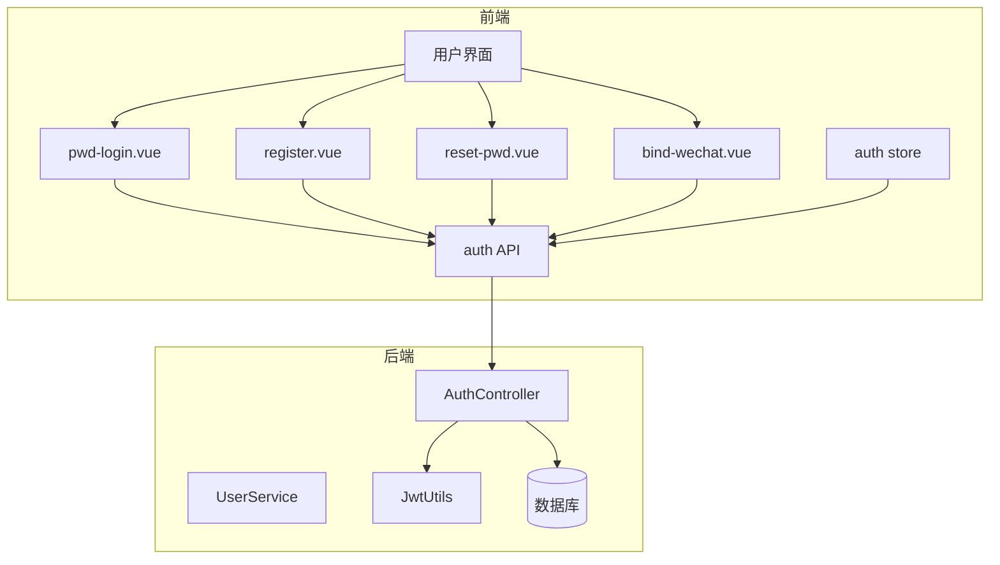
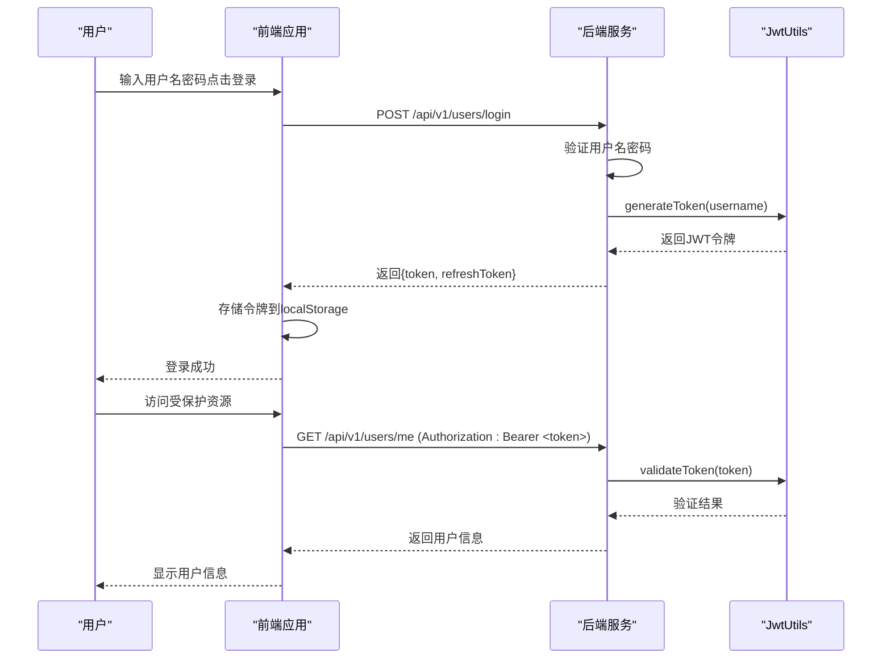
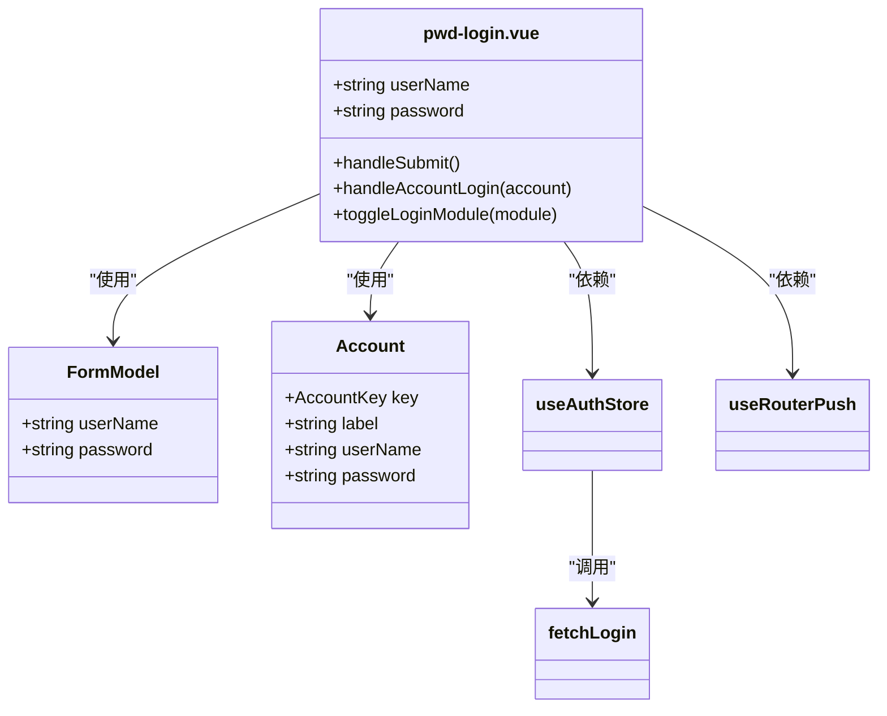
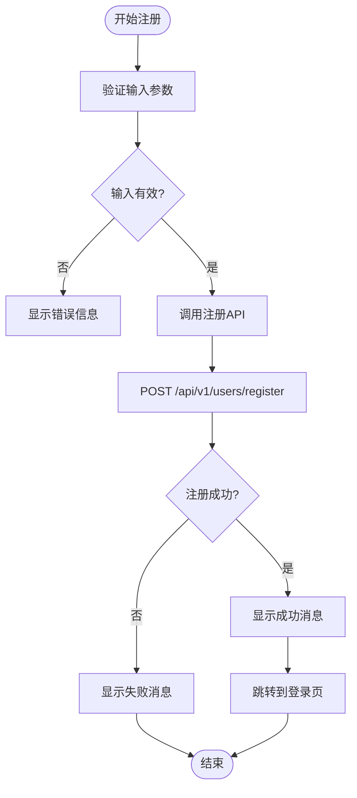
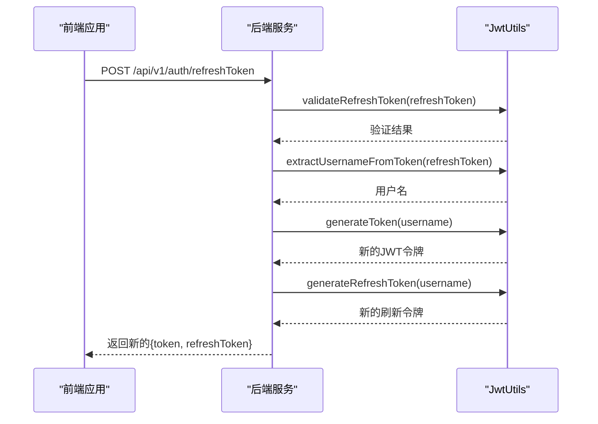
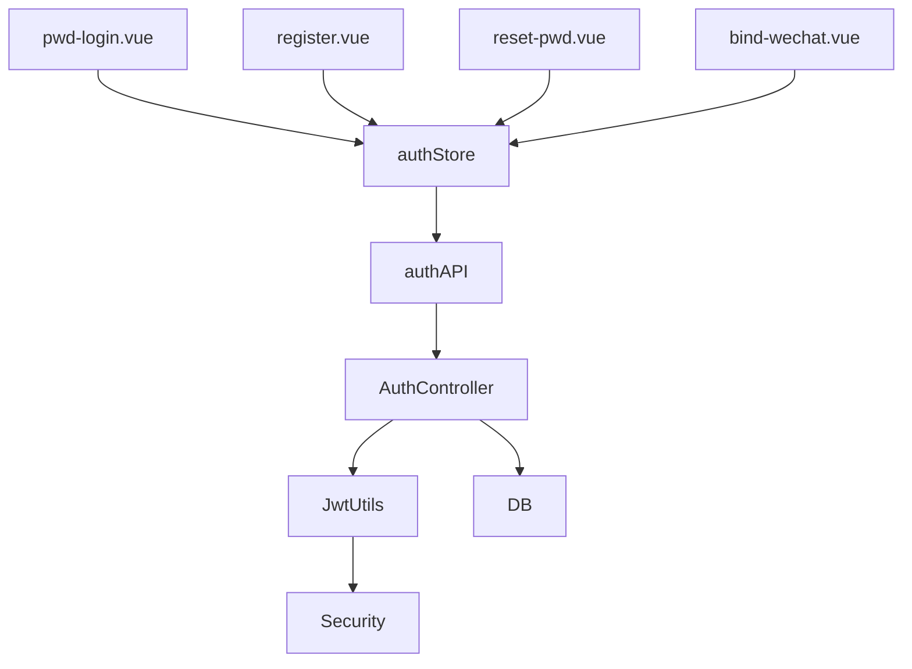

# 认证API

<cite>
**本文档引用的文件**   
- [AuthController.java](file://src/main/java/com/yizhaoqi/smartpai/controller/AuthController.java#L1-L85)
- [auth.ts](file://frontend/src/service/api/auth.ts#L1-L58)
- [pwd-login.vue](file://frontend/src/views/_builtin/login/modules/pwd-login.vue#L1-L117)
- [register.vue](file://frontend/src/views/_builtin/login/modules/register.vue#L1-L97)
- [reset-pwd.vue](file://frontend/src/views/_builtin/login/modules/reset-pwd.vue#L1-L89)
- [bind-wechat.vue](file://frontend/src/views/_builtin/login/modules/bind-wechat.vue#L1-L67)
- [index.vue](file://frontend/src/views/_builtin/login/index.vue#L1-L44)
- [JwtUtils.java](file://src/main/java/com/yizhaoqi/smartpai/utils/JwtUtils.java)
- [store/modules/auth/index.ts](file://frontend/src/store/modules/auth/index.ts#L87-L137)
</cite>

## 目录
1. [简介](#简介)
2. [项目结构](#项目结构)
3. [核心组件](#核心组件)
4. [架构概览](#架构概览)
5. [详细组件分析](#详细组件分析)
6. [依赖分析](#依赖分析)
7. [性能考量](#性能考量)
8. [故障排除指南](#故障排除指南)
9. [结论](#结论)

## 简介
本文档详细描述了PaiSmart项目中的认证相关RESTful API，涵盖用户登录、注册、密码重置、微信绑定及JWT令牌管理等核心功能。文档明确了各接口的HTTP方法、URL路径、请求参数、请求头和响应结构，并深入说明了JWT令牌的生成、刷新与失效机制。通过前端与后端代码的综合分析，展示了完整的认证流程和安全机制。

## 项目结构
项目采用前后端分离架构，前端基于Vue 3构建，后端使用Spring Boot实现。认证功能主要分布在前端`frontend/src/views/_builtin/login`目录下的多个Vue组件中，以及后端`src/main/java/com/yizhaoqi/smartpai/controller/AuthController.java`控制器中。

**图示来源**
- [pwd-login.vue](file://frontend/src/views/_builtin/login/modules/pwd-login.vue#L1-L117)
- [register.vue](file://frontend/src/views/_builtin/login/modules/register.vue#L1-L97)
- [AuthController.java](file://src/main/java/com/yizhaoqi/smartpai/controller/AuthController.java#L1-L85)

**本节来源**
- [frontend/src/views/_builtin/login](file://frontend/src/views/_builtin/login)
- [src/main/java/com/yizhaoqi/smartpai/controller](file://src/main/java/com/yizhaoqi/smartpai/controller)

## 核心组件
认证系统的核心组件包括前端登录界面、API服务层和后端认证控制器。前端通过Vue组件实现用户交互，通过API服务与后端通信，后端通过JWT实现安全的令牌认证机制。

**本节来源**
- [auth.ts](file://frontend/src/service/api/auth.ts#L1-L58)
- [AuthController.java](file://src/main/java/com/yizhaoqi/smartpai/controller/AuthController.java#L1-L85)

## 架构概览
系统采用标准的JWT认证流程：用户通过用户名密码登录，服务器验证后返回包含JWT令牌的响应。后续请求需在Authorization头中携带该令牌，服务器通过JwtUtils工具类验证令牌的有效性。

**图示来源**
- [AuthController.java](file://src/main/java/com/yizhaoqi/smartpai/controller/AuthController.java#L1-L85)
- [auth.ts](file://frontend/src/service/api/auth.ts#L1-L58)
- [JwtUtils.java](file://src/main/java/com/yizhaoqi/smartpai/utils/JwtUtils.java)

## 详细组件分析

### 登录功能分析
密码登录功能通过`pwd-login.vue`组件实现，提供了用户名密码输入表单和快速测试账号登录功能。

#### 登录界面组件

**图示来源**
- [pwd-login.vue](file://frontend/src/views/_builtin/login/modules/pwd-login.vue#L1-L117)

**本节来源**
- [pwd-login.vue](file://frontend/src/views/_builtin/login/modules/pwd-login.vue#L1-L117)

### 注册功能分析
用户注册功能通过`register.vue`组件实现，包含用户名、密码和确认密码的输入验证。

#### 注册流程

**图示来源**
- [register.vue](file://frontend/src/views/_builtin/login/modules/register.vue#L1-L97)
- [auth.ts](file://frontend/src/service/api/auth.ts#L1-L58)

**本节来源**
- [register.vue](file://frontend/src/views/_builtin/login/modules/register.vue#L1-L97)

### 密码重置功能分析
密码重置功能通过`reset-pwd.vue`组件实现，允许用户通过验证后重置密码。

**本节来源**
- [reset-pwd.vue](file://frontend/src/views/_builtin/login/modules/reset-pwd.vue#L1-L89)

### 微信绑定功能分析
微信绑定功能通过`bind-wechat.vue`组件实现，提供第三方登录集成。

**本节来源**
- [bind-wechat.vue](file://frontend/src/views/_builtin/login/modules/bind-wechat.vue#L1-L67)

### JWT令牌管理分析
JWT令牌管理是认证系统的核心，通过`AuthController`的`refreshToken`接口实现令牌刷新。

#### 令牌刷新流程

**图示来源**
- [AuthController.java](file://src/main/java/com/yizhaoqi/smartpai/controller/AuthController.java#L12-L82)
- [JwtUtils.java](file://src/main/java/com/yizhaoqi/smartpai/utils/JwtUtils.java)

**本节来源**
- [AuthController.java](file://src/main/java/com/yizhaoqi/smartpai/controller/AuthController.java#L12-L82)

## 依赖分析
认证系统涉及多个组件的协同工作，形成了清晰的依赖关系。

**图示来源**
- [auth.ts](file://frontend/src/service/api/auth.ts#L1-L58)
- [AuthController.java](file://src/main/java/com/yizhaoqi/smartpai/controller/AuthController.java#L1-L85)
- [store/modules/auth/index.ts](file://frontend/src/store/modules/auth/index.ts#L87-L137)

**本节来源**
- [frontend/src/service/api/auth.ts](file://frontend/src/service/api/auth.ts#L1-L58)
- [src/main/java/com/yizhaoqi/smartpai/controller/AuthController.java](file://src/main/java/com/yizhaoqi/smartpai/controller/AuthController.java#L1-L85)

## 性能考量
认证系统的性能主要体现在JWT令牌的生成和验证效率上。JwtUtils工具类采用了高效的加密算法，确保了令牌操作的快速执行。同时，系统通过refreshToken机制减少了数据库查询频率，提升了整体性能。

## 故障排除指南
常见认证问题及解决方案：

1. **401 Unauthorized错误**：检查JWT令牌是否过期，尝试使用refreshToken接口刷新令牌
2. **登录失败**：确认用户名密码正确，检查网络连接
3. **令牌刷新失败**：确认refreshToken有效且未过期
4. **跨域问题**：确保后端CORS配置正确

**本节来源**
- [AuthController.java](file://src/main/java/com/yizhaoqi/smartpai/controller/AuthController.java#L1-L85)
- [auth.ts](file://frontend/src/service/api/auth.ts#L1-L58)

## 结论
PaiSmart项目的认证系统设计合理，实现了完整的用户认证流程。系统采用JWT标准，提供了安全可靠的令牌管理机制。前后端分离的架构使得系统易于维护和扩展。建议未来可以增加更多的安全特性，如多因素认证和更复杂的密码策略。