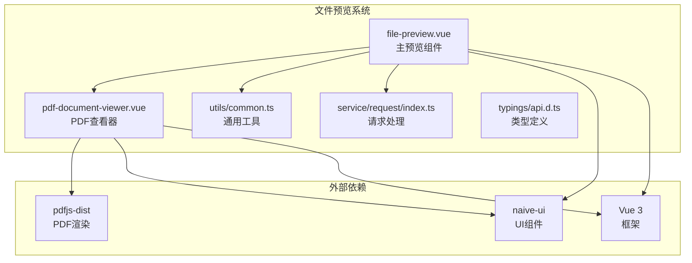
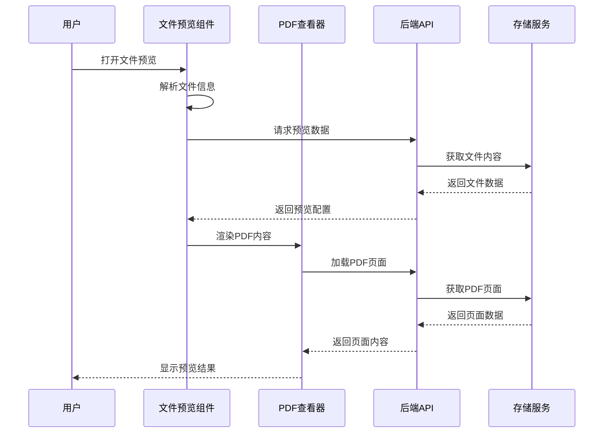
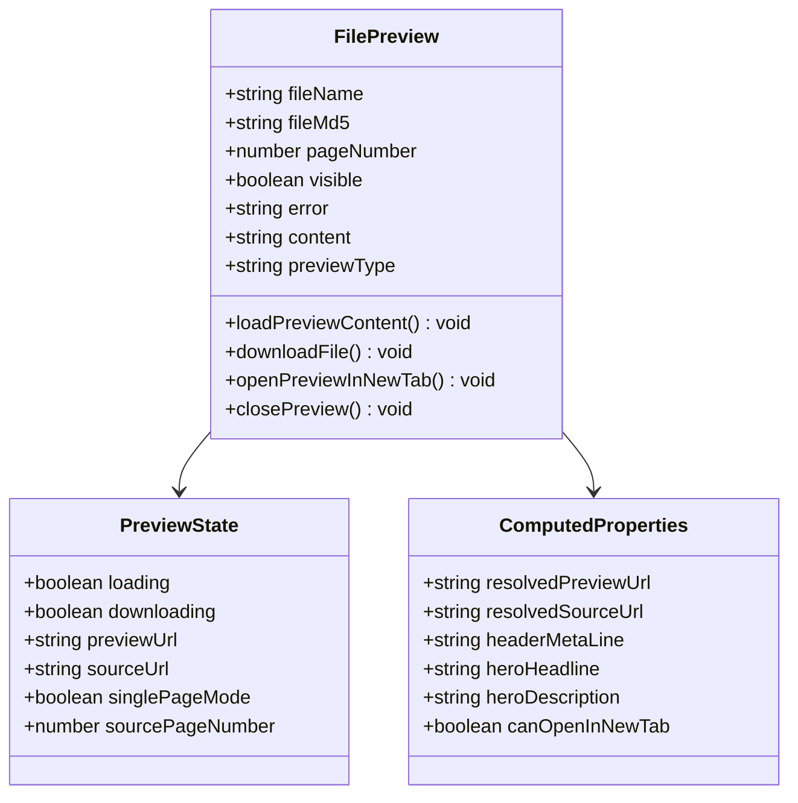
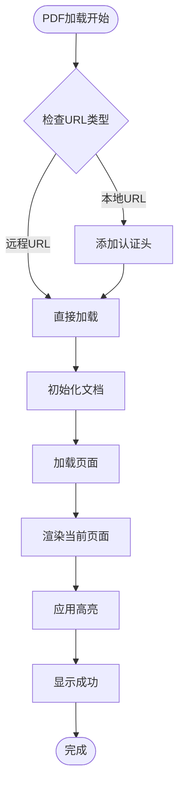
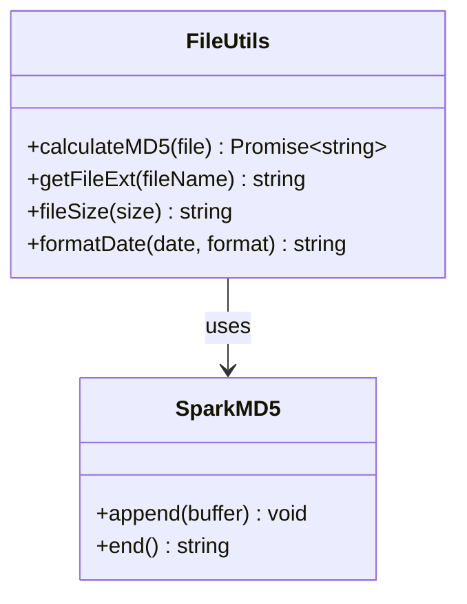
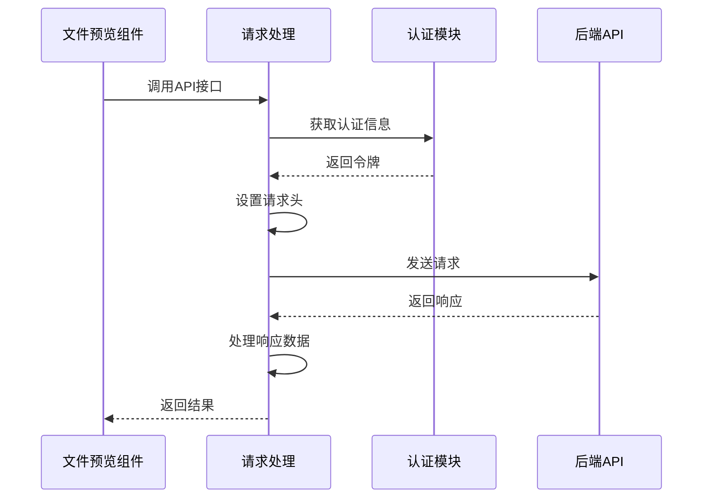
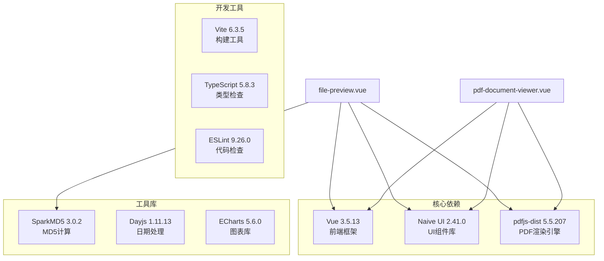
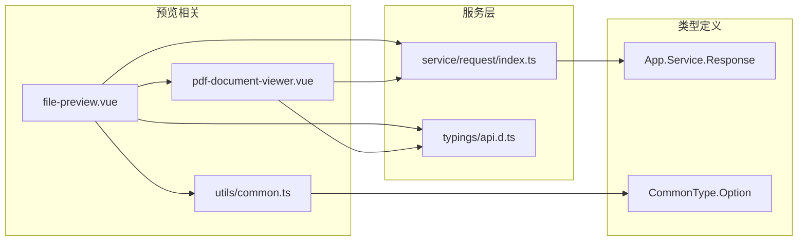
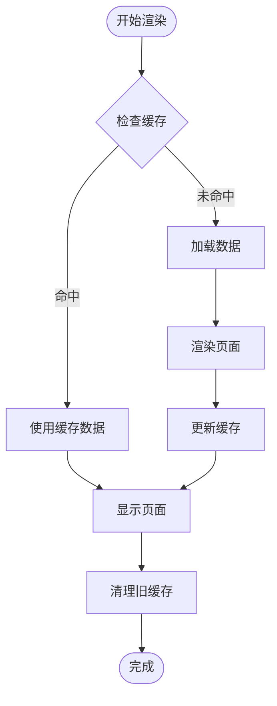

# 前端文件预览功能

<cite>
**本文档引用的文件**
- [frontend/src/components/custom/file-preview.vue](file://frontend/src/components/custom/file-preview.vue)
- [frontend/src/components/custom/pdf-document-viewer.vue](file://frontend/src/components/custom/pdf-document-viewer.vue)
- [frontend/src/utils/common.ts](file://frontend/src/utils/common.ts)
- [frontend/src/service/request/index.ts](file://frontend/src/service/request/index.ts)
- [frontend/src/typings/api.d.ts](file://frontend/src/typings/api.d.ts)
- [frontend/package.json](file://frontend/package.json)
</cite>

## 目录
1. [简介](#简介)
2. [项目结构](#项目结构)
3. [核心组件](#核心组件)
4. [架构概览](#架构概览)
5. [详细组件分析](#详细组件分析)
6. [依赖关系分析](#依赖关系分析)
7. [性能考虑](#性能考虑)
8. [故障排除指南](#故障排除指南)
9. [结论](#结论)

## 简介

前端文件预览功能是 PaiSmart AI 应用中的一个关键组件，负责为用户提供各种类型文件的在线预览能力。该功能支持 PDF、图片、文本等多种文件格式的实时预览，并提供了完整的引用证据展示和线索定位功能。

该系统特别针对 RAG（检索增强生成）场景进行了优化，能够显示文档检索过程中的相关信息，包括检索问题、定位线索、相关分数等，帮助用户验证 AI 回答的准确性。

## 项目结构

文件预览功能主要由以下核心文件组成：

**图表来源**
- [frontend/src/components/custom/file-preview.vue:153-512](file://frontend/src/components/custom/file-preview.vue#L153-L512)
- [frontend/src/components/custom/pdf-document-viewer.vue:108-171](file://frontend/src/components/custom/pdf-document-viewer.vue#L108-L171)

**章节来源**
- [frontend/src/components/custom/file-preview.vue:1-701](file://frontend/src/components/custom/file-preview.vue#L1-L701)
- [frontend/src/components/custom/pdf-document-viewer.vue:1-800](file://frontend/src/components/custom/pdf-document-viewer.vue#L1-L800)

## 核心组件

### 主要组件职责

1. **文件预览组件 (file-preview.vue)**：提供统一的文件预览界面，支持多种文件格式
2. **PDF文档查看器 (pdf-document-viewer.vue)**：专门处理PDF文件的高级预览功能
3. **通用工具 (utils/common.ts)**：提供文件扩展名解析、MD5计算等基础功能
4. **请求处理 (service/request/index.ts)**：封装HTTP请求和错误处理逻辑

### 支持的文件格式

系统支持以下文件类型的在线预览：
- **PDF文档**：完整的PDF渲染和交互功能
- **图片文件**：JPG、PNG、GIF等格式的缩放和导航
- **文本文件**：纯文本和Markdown内容的格式化显示
- **其他格式**：通过下载方式处理不支持的文件类型

**章节来源**
- [frontend/src/components/custom/file-preview.vue:289-297](file://frontend/src/components/custom/file-preview.vue#L289-L297)
- [frontend/src/components/custom/file-preview.vue:371-377](file://frontend/src/components/custom/file-preview.vue#L371-L377)

## 架构概览

文件预览系统的整体架构采用组件化设计，实现了清晰的关注点分离：

**图表来源**
- [frontend/src/components/custom/file-preview.vue:314-427](file://frontend/src/components/custom/file-preview.vue#L314-L427)
- [frontend/src/components/custom/pdf-document-viewer.vue:558-620](file://frontend/src/components/custom/pdf-document-viewer.vue#L558-L620)

### 数据流处理

系统采用异步数据流处理机制，确保预览过程的流畅性和可靠性：

1. **初始化阶段**：组件接收文件参数并开始加载流程
2. **数据获取**：通过API接口获取文件预览所需的数据
3. **内容渲染**：根据文件类型选择合适的渲染策略
4. **交互处理**：提供用户交互功能和状态反馈

**章节来源**
- [frontend/src/components/custom/file-preview.vue:314-427](file://frontend/src/components/custom/file-preview.vue#L314-L427)
- [frontend/src/components/custom/pdf-document-viewer.vue:558-620](file://frontend/src/components/custom/pdf-document-viewer.vue#L558-L620)

## 详细组件分析

### 文件预览组件 (file-preview.vue)

#### 组件架构

**图表来源**
- [frontend/src/components/custom/file-preview.vue:162-183](file://frontend/src/components/custom/file-preview.vue#L162-L183)
- [frontend/src/components/custom/file-preview.vue:185-261](file://frontend/src/components/custom/file-preview.vue#L185-L261)

#### 预览类型处理

组件支持四种不同的预览模式：

1. **PDF预览**：使用专用的PDF查看器组件
2. **图片预览**：直接渲染图片元素
3. **文本预览**：格式化显示文本内容
4. **下载模式**：提供下载选项而非在线预览

**章节来源**
- [frontend/src/components/custom/file-preview.vue:95-144](file://frontend/src/components/custom/file-preview.vue#L95-L144)
- [frontend/src/components/custom/file-preview.vue:189-194](file://frontend/src/components/custom/file-preview.vue#L189-L194)

### PDF文档查看器 (pdf-document-viewer.vue)

#### 高级PDF渲染功能

PDF查看器组件提供了丰富的PDF处理能力：

**图表来源**
- [frontend/src/components/custom/pdf-document-viewer.vue:558-620](file://frontend/src/components/custom/pdf-document-viewer.vue#L558-L620)
- [frontend/src/components/custom/pdf-document-viewer.vue:686-775](file://frontend/src/components/custom/pdf-document-viewer.vue#L686-L775)

#### 高亮和定位功能

PDF查看器支持智能文本高亮和页面定位：

1. **文本高亮**：基于检索关键词自动高亮匹配文本
2. **页面跳转**：支持快速跳转到指定页面
3. **缩放控制**：提供精确的缩放比例控制
4. **滚动同步**：保持页面滚动状态的一致性

**章节来源**
- [frontend/src/components/custom/pdf-document-viewer.vue:777-800](file://frontend/src/components/custom/pdf-document-viewer.vue#L777-L800)
- [frontend/src/components/custom/pdf-document-viewer.vue:508-547](file://frontend/src/components/custom/pdf-document-viewer.vue#L508-L547)

### 通用工具函数

#### 文件处理工具

通用工具模块提供了文件操作相关的辅助函数：

**图表来源**
- [frontend/src/utils/common.ts:72-102](file://frontend/src/utils/common.ts#L72-L102)
- [frontend/src/utils/common.ts:109-113](file://frontend/src/utils/common.ts#L109-L113)

**章节来源**
- [frontend/src/utils/common.ts:72-102](file://frontend/src/utils/common.ts#L72-L102)
- [frontend/src/utils/common.ts:109-113](file://frontend/src/utils/common.ts#L109-L113)

### 请求处理机制

#### API调用封装

请求处理模块提供了统一的API调用接口：

**图表来源**
- [frontend/src/service/request/index.ts:22-26](file://frontend/src/service/request/index.ts#L22-L26)
- [frontend/src/service/request/index.ts:102-104](file://frontend/src/service/request/index.ts#L102-L104)

**章节来源**
- [frontend/src/service/request/index.ts:13-155](file://frontend/src/service/request/index.ts#L13-L155)

## 依赖关系分析

### 外部依赖管理

文件预览功能依赖以下关键外部库：

**图表来源**
- [frontend/package.json:46-78](file://frontend/package.json#L46-L78)
- [frontend/package.json:79-117](file://frontend/package.json#L79-L117)

### 内部模块依赖

系统内部模块之间的依赖关系如下：

**图表来源**
- [frontend/src/components/custom/file-preview.vue:155-160](file://frontend/src/components/custom/file-preview.vue#L155-L160)
- [frontend/src/service/request/index.ts:1-9](file://frontend/src/service/request/index.ts#L1-L9)

**章节来源**
- [frontend/package.json:46-78](file://frontend/package.json#L46-L78)

## 性能考虑

### 渲染优化策略

文件预览系统采用了多项性能优化措施：

1. **懒加载机制**：仅在需要时加载PDF页面内容
2. **缓存策略**：缓存已渲染的页面以提高重复访问速度
3. **内存管理**：及时清理不再使用的PDF文档实例
4. **异步处理**：所有耗时操作都在后台线程执行

### 内存使用优化

**图表来源**
- [frontend/src/components/custom/pdf-document-viewer.vue:459-506](file://frontend/src/components/custom/pdf-document-viewer.vue#L459-L506)
- [frontend/src/components/custom/pdf-document-viewer.vue:622-684](file://frontend/src/components/custom/pdf-document-viewer.vue#L622-L684)

### 网络性能优化

系统通过以下方式优化网络请求性能：

1. **请求合并**：将多个小请求合并为批量请求
2. **超时控制**：设置合理的请求超时时间
3. **错误重试**：实现智能的请求重试机制
4. **进度反馈**：提供实时的加载进度指示

**章节来源**
- [frontend/src/components/custom/pdf-document-viewer.vue:459-506](file://frontend/src/components/custom/pdf-document-viewer.vue#L459-L506)
- [frontend/src/service/request/index.ts:105-147](file://frontend/src/service/request/index.ts#L105-L147)

## 故障排除指南

### 常见问题及解决方案

#### PDF加载失败

**问题症状**：PDF文档无法正常加载或显示错误

**可能原因**：
1. 网络连接不稳定
2. 文件权限不足
3. PDF文件损坏
4. 浏览器兼容性问题

**解决步骤**：
1. 检查网络连接状态
2. 验证文件访问权限
3. 尝试重新加载页面
4. 更换浏览器测试

#### 预览内容空白

**问题症状**：预览区域显示为空白

**可能原因**：
1. 文件格式不受支持
2. 服务器配置问题
3. 客户端缓存异常

**解决步骤**：
1. 确认文件格式支持情况
2. 清除浏览器缓存
3. 检查服务器日志
4. 联系技术支持

#### 性能问题

**问题症状**：页面加载缓慢或响应迟钝

**优化建议**：
1. 减少同时打开的预览窗口数量
2. 关闭不必要的浏览器标签页
3. 清理浏览器缓存和Cookie
4. 更新到最新版本的浏览器

**章节来源**
- [frontend/src/components/custom/file-preview.vue:17-27](file://frontend/src/components/custom/file-preview.vue#L17-L27)
- [frontend/src/components/custom/pdf-document-viewer.vue:69-72](file://frontend/src/components/custom/pdf-document-viewer.vue#L69-L72)

### 调试工具和方法

#### 开发者工具使用

1. **浏览器开发者工具**：监控网络请求和JavaScript错误
2. **Vue DevTools**：调试Vue组件状态和生命周期
3. **性能面板**：分析页面渲染性能瓶颈
4. **内存面板**：检测内存泄漏和过度占用

#### 日志记录

系统在关键位置设置了详细的日志记录：

- 预览加载过程的日志
- 错误处理的详细信息
- 性能指标的统计信息
- 用户交互行为的追踪

**章节来源**
- [frontend/src/components/custom/file-preview.vue:317-366](file://frontend/src/components/custom/file-preview.vue#L317-L366)
- [frontend/src/components/custom/pdf-document-viewer.vue:611-614](file://frontend/src/components/custom/pdf-document-viewer.vue#L611-L614)

## 结论

前端文件预览功能是一个高度模块化的系统，具有以下特点：

### 技术优势

1. **组件化设计**：清晰的职责分离和可复用的组件架构
2. **多格式支持**：全面的文件格式兼容性和优化的渲染策略
3. **RAG集成**：专门为检索增强生成场景优化的功能特性
4. **性能优化**：采用多种技术手段确保流畅的用户体验

### 功能特色

1. **智能预览**：根据文件类型自动选择最优的预览方案
2. **引用证据**：完整展示文档检索的相关信息
3. **交互友好**：提供直观的操作界面和丰富的交互功能
4. **错误处理**：完善的错误处理和用户提示机制

### 发展方向

未来可以考虑的功能改进：
1. **离线支持**：实现离线文件缓存和预览功能
2. **协作功能**：添加多人协作和标注功能
3. **移动端优化**：进一步优化移动设备上的使用体验
4. **AI增强**：集成更多AI辅助功能，如智能摘要等

该文件预览系统为 PaiSmart AI 应用提供了强大的文档处理能力，是整个应用生态系统中不可或缺的重要组成部分。