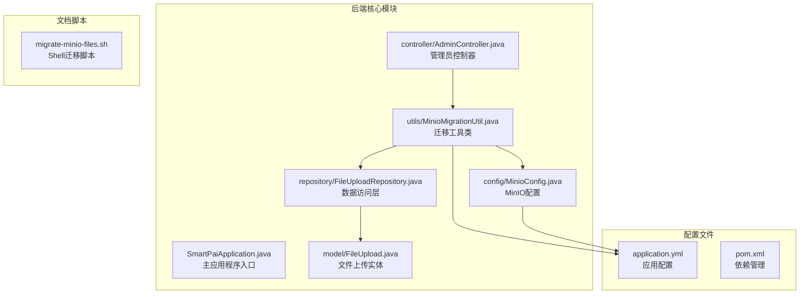
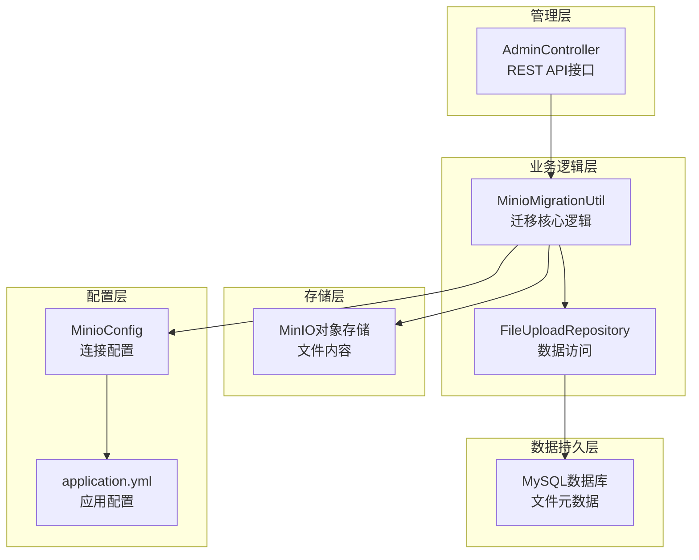
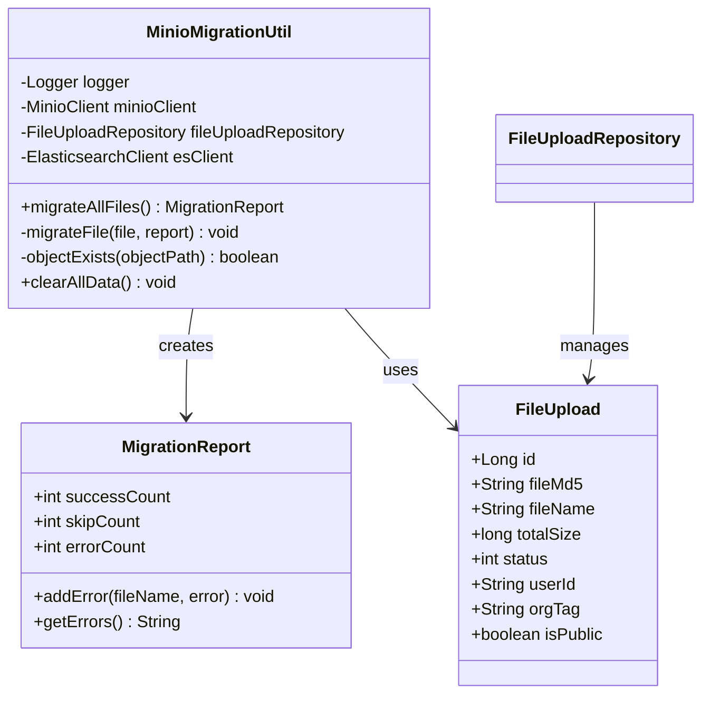
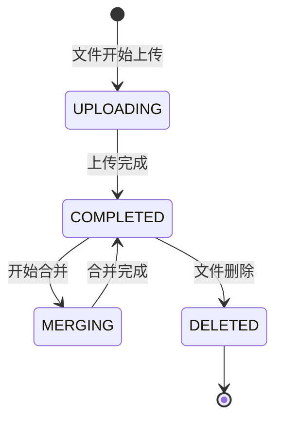
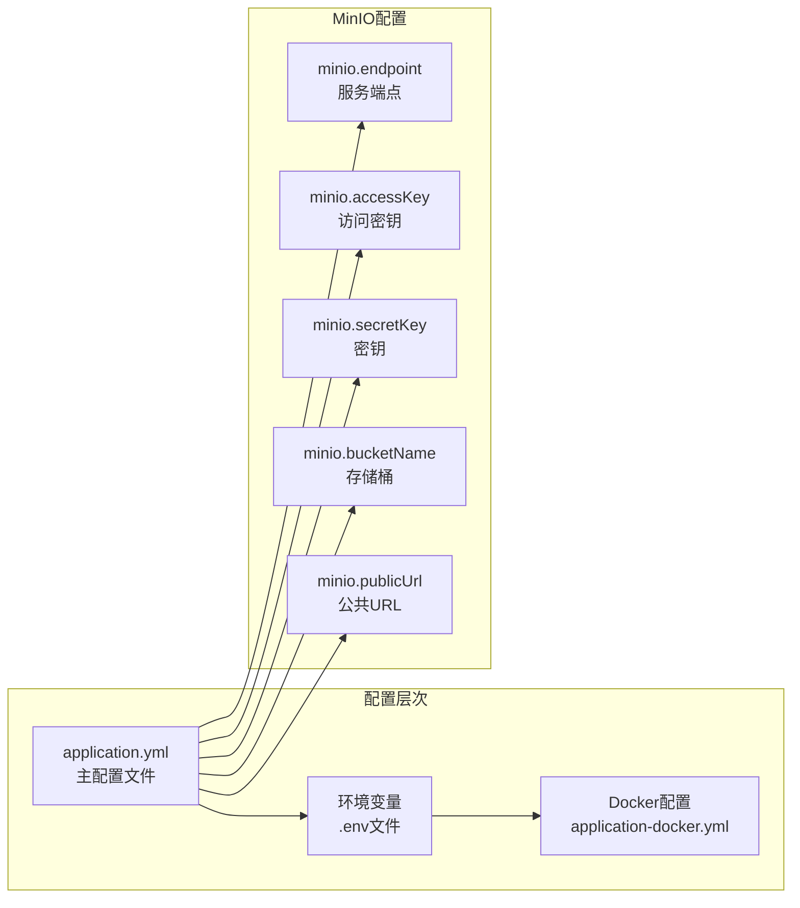
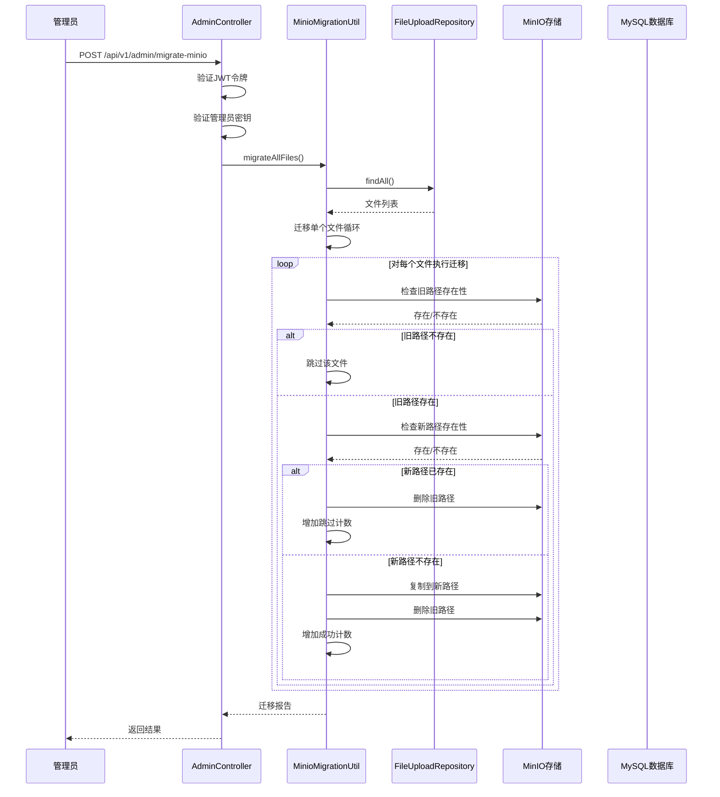
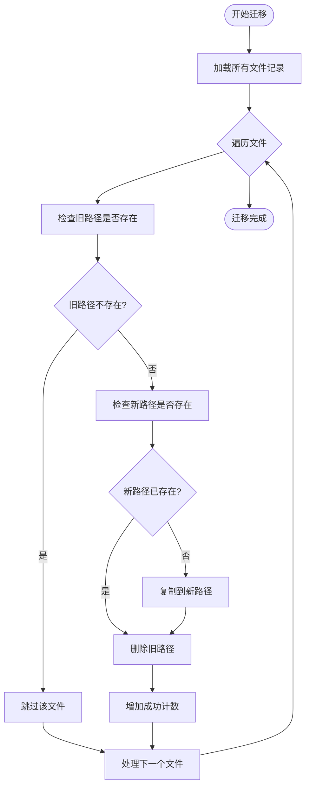

# Minio迁移工具文档

<cite>
**本文档中引用的文件**
- [MinioMigrationUtil.java](file://src/main/java/com/yizhaoqi/smartpai/utils/MinioMigrationUtil.java)
- [MinioConfig.java](file://src/main/java/com/yizhaoqi/smartpai/config/MinioConfig.java)
- [AdminController.java](file://src/main/java/com/yizhaoqi/smartpai/controller/AdminController.java)
- [FileUpload.java](file://src/main/java/com/yizhaoqi/smartpai/model/FileUpload.java)
- [FileUploadRepository.java](file://src/main/java/com/yizhaoqi/smartpai/repository/FileUploadRepository.java)
- [migrate-minio-files.sh](file://docs/migrate-minio-files.sh)
- [application.yml](file://src/main/resources/application.yml)
- [pom.xml](file://pom.xml)
- [README.md](file://README.md)
</cite>

## 目录
1. [简介](#简介)
2. [项目结构](#项目结构)
3. [核心组件](#核心组件)
4. [架构概览](#架构概览)
5. [详细组件分析](#详细组件分析)
6. [迁移流程详解](#迁移流程详解)
7. [性能考虑](#性能考虑)
8. [故障排除指南](#故障排除指南)
9. [总结](#总结)

## 简介

Minio迁移工具是派聪明（PaiSmart）AI知识库管理系统中的一个重要组件，专门用于将MinIO对象存储中的文件从旧路径结构迁移到新的MD5路径结构。该工具解决了系统升级过程中文件存储路径标准化的问题，确保文件访问的一致性和安全性。

派聪明是一个企业级的AI知识库管理系统，采用检索增强生成（RAG）技术，提供智能文档处理和检索能力。系统支持多租户架构，允许用户通过自然语言查询知识库，并获得基于自身文档的AI生成响应。

## 项目结构

派聪明项目采用标准的Spring Boot多模块架构，Minio迁移工具位于核心业务模块中：

**图表来源**
- [MinioMigrationUtil.java:1-245](file://src/main/java/com/yizhaoqi/smartpai/utils/MinioMigrationUtil.java#L1-L245)
- [MinioConfig.java:1-39](file://src/main/java/com/yizhaoqi/smartpai/config/MinioConfig.java#L1-L39)
- [AdminController.java:805-873](file://src/main/java/com/yizhaoqi/smartpai/controller/AdminController.java#L805-L873)

**章节来源**
- [README.md:32-48](file://README.md#L32-L48)
- [pom.xml:33-188](file://pom.xml#L33-L188)

## 核心组件

### MinioMigrationUtil迁移工具类

MinioMigrationUtil是整个迁移系统的核心组件，负责执行文件路径迁移的具体操作。该工具类实现了完整的迁移生命周期管理，包括文件发现、路径验证、对象复制和清理等操作。

**主要功能特性：**
- 支持批量文件迁移操作
- 提供详细的迁移进度报告
- 包含完善的错误处理机制
- 支持幂等性操作，避免重复迁移
- 提供数据清理功能（仅测试环境）

### MinioConfig配置类

MinioConfig负责管理MinIO客户端的配置信息，包括连接端点、访问密钥、存储桶名称等关键参数。该配置类通过Spring框架的依赖注入机制，为整个系统提供统一的MinIO访问接口。

**配置参数：**
- endpoint: MinIO服务端点地址
- accessKey: 访问密钥
- secretKey: 密钥
- bucketName: 存储桶名称
- publicUrl: 公共访问URL

### AdminController管理员控制器

AdminController提供了RESTful API接口，允许管理员通过HTTP请求触发文件迁移操作。该控制器实现了完整的权限验证和安全控制机制，确保只有授权的管理员才能执行迁移操作。

**API接口：**
- POST /api/v1/admin/migrate-minio
- 参数：Authorization头（JWT令牌）、adminKey（管理员密钥）

**章节来源**
- [MinioMigrationUtil.java:20-30](file://src/main/java/com/yizhaoqi/smartpai/utils/MinioMigrationUtil.java#L20-L30)
- [MinioConfig.java:13-23](file://src/main/java/com/yizhaoqi/smartpai/config/MinioConfig.java#L13-L23)
- [AdminController.java:814-873](file://src/main/java/com/yizhaoqi/smartpai/controller/AdminController.java#L814-L873)

## 架构概览

派聪明系统的Minio迁移架构采用了分层设计模式，确保了系统的可维护性和可扩展性：

**图表来源**
- [AdminController.java:814-873](file://src/main/java/com/yizhaoqi/smartpai/controller/AdminController.java#L814-L873)
- [MinioMigrationUtil.java:50-77](file://src/main/java/com/yizhaoqi/smartpai/utils/MinioMigrationUtil.java#L50-L77)
- [MinioConfig.java:26-37](file://src/main/java/com/yizhaoqi/smartpai/config/MinioConfig.java#L26-L37)

## 详细组件分析

### 迁移工具类架构

MinioMigrationUtil采用了面向对象的设计模式，将复杂的迁移逻辑封装在清晰的类结构中：

**图表来源**
- [MinioMigrationUtil.java:32-244](file://src/main/java/com/yizhaoqi/smartpai/utils/MinioMigrationUtil.java#L32-L244)
- [FileUpload.java:17-97](file://src/main/java/com/yizhaoqi/smartpai/model/FileUpload.java#L17-L97)

### 数据模型设计

FileUpload实体类设计体现了系统的业务需求，包含了文件管理所需的关键信息：

**核心字段说明：**
- fileMd5: 文件的MD5哈希值，作为文件的唯一标识符
- fileName: 文件的原始名称
- totalSize: 文件总大小（字节）
- status: 文件上传状态（0-上传中，1-已完成，2-合并中）
- userId: 上传用户的标识符
- orgTag: 文件所属组织标签
- isPublic: 文件是否公开

**状态转换流程：**

**章节来源**
- [FileUpload.java:18-97](file://src/main/java/com/yizhaoqi/smartpai/model/FileUpload.java#L18-L97)
- [FileUploadRepository.java:15-83](file://src/main/java/com/yizhaoqi/smartpai/repository/FileUploadRepository.java#L15-L83)

### 配置管理机制

系统通过多种配置方式确保灵活性和安全性：

**图表来源**
- [application.yml:66-72](file://src/main/resources/application.yml#L66-L72)
- [MinioConfig.java:13-23](file://src/main/java/com/yizhaoqi/smartpai/config/MinioConfig.java#L13-L23)

**章节来源**
- [application.yml:1-229](file://src/main/resources/application.yml#L1-L229)
- [MinioConfig.java:26-37](file://src/main/java/com/yizhaoqi/smartpai/config/MinioConfig.java#L26-L37)

## 迁移流程详解

### 完整迁移流程

Minio迁移工具实现了完整的文件迁移生命周期，确保数据迁移的安全性和完整性：

**图表来源**
- [AdminController.java:814-873](file://src/main/java/com/yizhaoqi/smartpai/controller/AdminController.java#L814-L873)
- [MinioMigrationUtil.java:50-141](file://src/main/java/com/yizhaoqi/smartpai/utils/MinioMigrationUtil.java#L50-L141)

### 迁移算法流程

迁移过程采用了精心设计的算法，确保操作的原子性和一致性：

**图表来源**
- [MinioMigrationUtil.java:82-141](file://src/main/java/com/yizhaoqi/smartpai/utils/MinioMigrationUtil.java#L82-L141)

### Shell脚本迁移方案

除了Java实现的迁移工具外，系统还提供了Shell脚本版本，适用于批量处理场景：

**脚本特点：**
- 使用MySQL CLI获取文件列表
- 通过mc命令行工具操作MinIO
- 提供详细的进度输出和错误处理
- 支持批量重命名操作

**执行流程：**
1. 从MySQL数据库导出文件记录
2. 遍历每个文件执行重命名操作
3. 验证迁移结果
4. 生成迁移报告

**章节来源**
- [migrate-minio-files.sh:15-64](file://docs/migrate-minio-files.sh#L15-L64)
- [MinioMigrationUtil.java:163-217](file://src/main/java/com/yizhaoqi/smartpai/utils/MinioMigrationUtil.java#L163-L217)

## 性能考虑

### 迁移性能优化

Minio迁移工具在设计时充分考虑了性能因素，采用了多种优化策略：

**并发处理：**
- 采用顺序处理模式，确保数据一致性
- 避免同时处理大量文件导致的内存压力
- 通过分批处理减少长时间阻塞

**资源管理：**
- 合理使用MinIO客户端连接池
- 及时释放数据库连接和文件句柄
- 监控内存使用情况，避免内存泄漏

**错误恢复：**
- 每个文件迁移都有独立的错误处理
- 支持部分失败后的继续执行
- 提供详细的错误日志便于诊断

### 系统监控

迁移过程包含了完整的监控机制：

**性能监控：**
- 使用LogUtils.PerformanceMonitor跟踪执行时间
- 记录每个阶段的处理时间和成功率
- 提供迁移进度的实时反馈

**日志记录：**
- 详细的迁移过程日志
- 错误信息的完整堆栈跟踪
- 性能指标的统计分析

**章节来源**
- [AdminController.java:819-843](file://src/main/java/com/yizhaoqi/smartpai/controller/AdminController.java#L819-L843)
- [MinioMigrationUtil.java:53-76](file://src/main/java/com/yizhaoqi/smartpai/utils/MinioMigrationUtil.java#L53-L76)

## 故障排除指南

### 常见问题及解决方案

**连接问题：**
- 检查MinIO服务端点配置是否正确
- 验证访问密钥和密钥的有效性
- 确认网络连接和防火墙设置

**权限问题：**
- 确认管理员账户具有足够的权限
- 验证JWT令牌的有效性和时效性
- 检查adminKey配置是否正确

**文件处理问题：**
- 检查文件是否存在于MinIO存储中
- 验证文件权限和访问控制设置
- 确认存储桶的配置正确

### 调试技巧

**启用详细日志：**
- 在application.yml中调整日志级别
- 监控MinIO相关的日志输出
- 使用调试模式获取更多信息

**性能分析：**
- 分析迁移过程中的性能瓶颈
- 监控系统资源使用情况
- 优化数据库查询和MinIO操作

**错误诊断：**
- 查看完整的错误堆栈信息
- 检查网络连接和存储状态
- 验证配置文件的正确性

**章节来源**
- [application.yml:162-168](file://src/main/resources/application.yml#L162-L168)
- [MinioMigrationUtil.java:136-140](file://src/main/java/com/yizhaoqi/smartpai/utils/MinioMigrationUtil.java#L136-L140)

## 总结

Minio迁移工具是派聪明AI知识库管理系统中的关键组件，它解决了文件存储路径标准化的重要问题。通过精心设计的架构和完善的错误处理机制，该工具确保了数据迁移的安全性和可靠性。

**主要优势：**
- 完整的迁移生命周期管理
- 幂等性设计，支持重复执行
- 详细的日志记录和监控
- 灵活的配置选项和环境适配
- 完善的错误处理和恢复机制

**应用场景：**
- 系统升级过程中的数据迁移
- 存储架构优化和重构
- 多租户环境下的文件管理
- 大规模文件系统的维护

该工具不仅解决了当前的技术挑战，也为未来的系统扩展奠定了坚实的基础。通过模块化的架构设计和清晰的职责划分，确保了系统的可维护性和可扩展性。