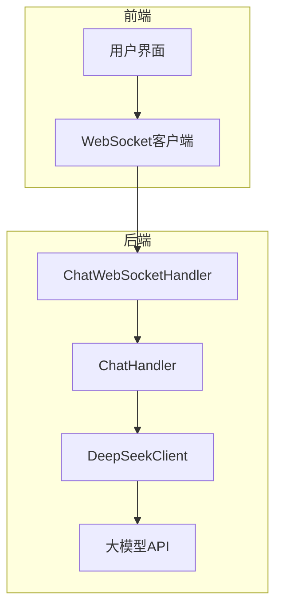
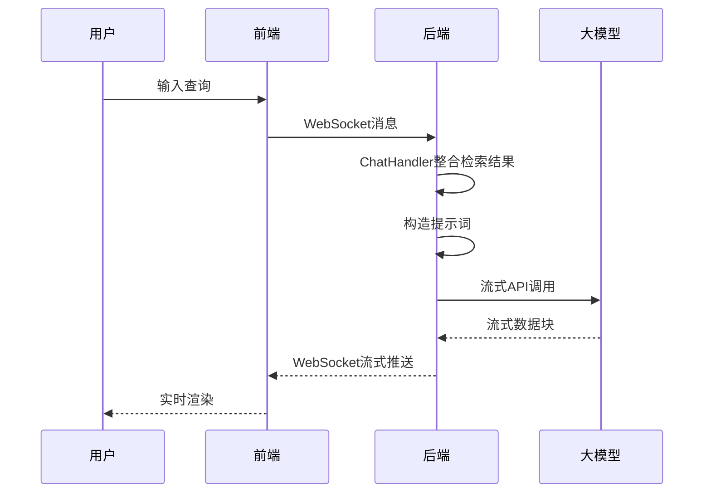
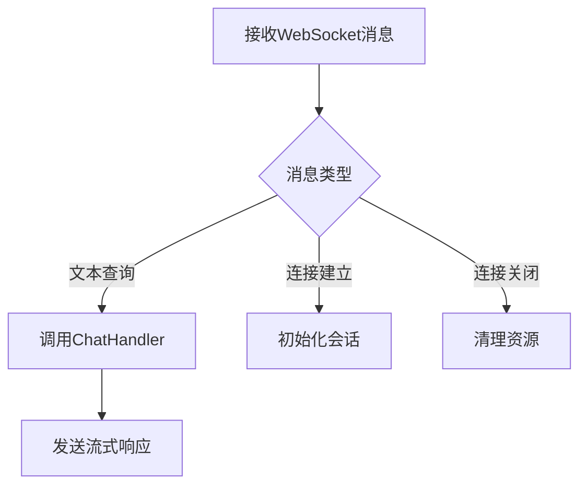
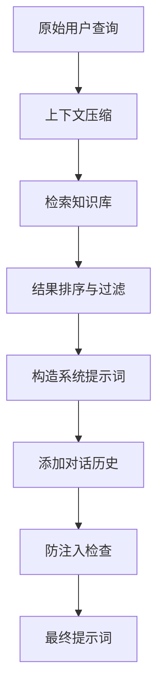
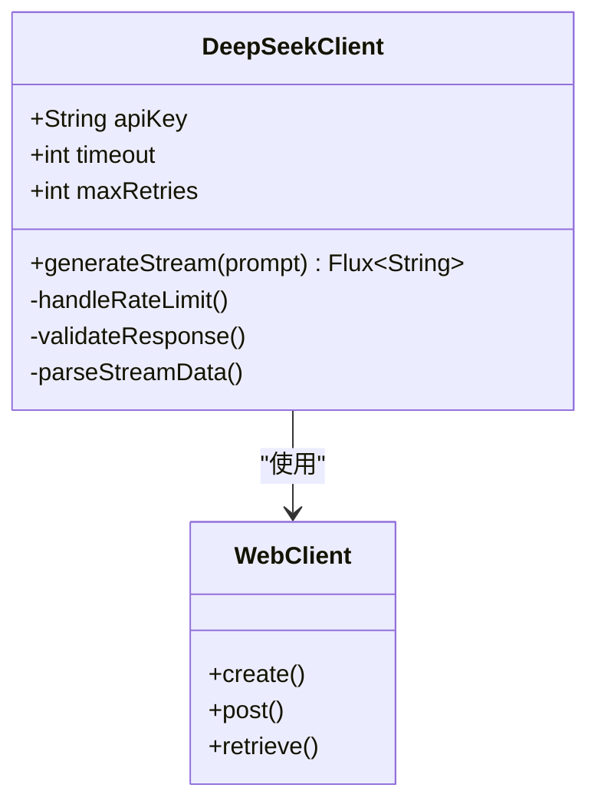
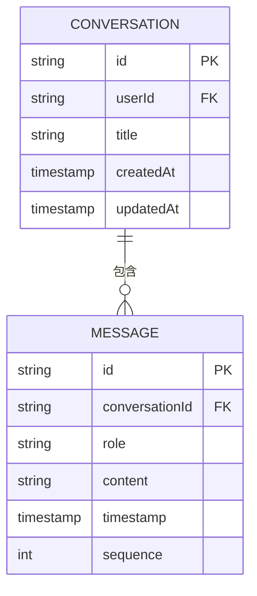
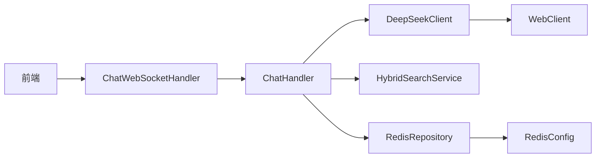

# AI响应生成

<cite>
**本文档引用文件**  
- [DeepSeekClient.java](file://src/main/java/com/yizhaoqi/smartpai/client/DeepSeekClient.java)
- [ChatWebSocketHandler.java](file://src/main/java/com/yizhaoqi/smartpai/handler/ChatWebSocketHandler.java)
- [ChatHandler.java](file://src/main/java/com/yizhaoqi/smartpai/service/ChatHandler.java)
- [Message.java](file://src/main/java/com/yizhaoqi/smartpai/entity/Message.java)
- [AiProperties.java](file://src/main/java/com/yizhaoqi/smartpai/config/AiProperties.java)
- [WebSocketConfig.java](file://src/main/java/com/yizhaoqi/smartpai/config/WebSocketConfig.java)
</cite>

## 目录
1. [引言](#引言)
2. [项目结构](#项目结构)
3. [核心组件](#核心组件)
4. [架构概览](#架构概览)
5. [详细组件分析](#详细组件分析)
6. [依赖分析](#依赖分析)
7. [性能考量](#性能考量)
8. [故障排除指南](#故障排除指南)
9. [结论](#结论)

## 引言
本文档系统讲解AI响应生成的全过程，涵盖从用户查询接收、混合搜索结果整合、提示词构造，到大模型API调用与流式响应处理的完整流程。重点分析DeepSeekClient的流式传输机制、提示词工程设计、对话历史管理及安全过滤策略，为开发者提供全面的技术实现参考。

## 项目结构
项目采用前后端分离架构，前端基于Vue3 + Vite构建，后端采用Spring Boot框架。AI响应生成核心逻辑位于后端`src/main/java/com/yizhaoqi/smartpai`包下，主要包括客户端、处理器、服务层和实体类。

**图示来源**  
- [ChatWebSocketHandler.java](file://src/main/java/com/yizhaoqi/smartpai/handler/ChatWebSocketHandler.java)
- [ChatHandler.java](file://src/main/java/com/yizhaoqi/smartpai/service/ChatHandler.java)
- [DeepSeekClient.java](file://src/main/java/com/yizhaoqi/smartpai/client/DeepSeekClient.java)

**本节来源**  
- [ChatWebSocketHandler.java](file://src/main/java/com/yizhaoqi/smartpai/handler/ChatWebSocketHandler.java)
- [ChatHandler.java](file://src/main/java/com/yizhaoqi/smartpai/service/ChatHandler.java)

## 核心组件
AI响应生成流程涉及多个核心组件协同工作：
- **ChatWebSocketHandler**：WebSocket消息处理器，接收用户查询
- **ChatHandler**：业务逻辑处理器，整合搜索结果并构造提示词
- **DeepSeekClient**：大模型API客户端，处理流式响应
- **Message**：对话消息实体，管理对话历史

**本节来源**  
- [ChatWebSocketHandler.java](file://src/main/java/com/yizhaoqi/smartpai/handler/ChatWebSocketHandler.java)
- [ChatHandler.java](file://src/main/java/com/yizhaoqi/smartpai/service/ChatHandler.java)
- [DeepSeekClient.java](file://src/main/java/com/yizhaoqi/smartpai/client/DeepSeekClient.java)
- [Message.java](file://src/main/java/com/yizhaoqi/smartpai/entity/Message.java)

## 架构概览
系统采用事件驱动架构，通过WebSocket实现全双工通信。用户查询经WebSocket通道传入，由处理器整合知识库检索结果，构造优化提示词后调用大模型API，最终将流式响应实时推送至前端。

**图示来源**  
- [ChatWebSocketHandler.java](file://src/main/java/com/yizhaoqi/smartpai/handler/ChatWebSocketHandler.java)
- [ChatHandler.java](file://src/main/java/com/yizhaoqi/smartpai/service/ChatHandler.java)
- [DeepSeekClient.java](file://src/main/java/com/yizhaoqi/smartpai/client/DeepSeekClient.java)

## 详细组件分析

### ChatWebSocketHandler分析
作为WebSocket消息的入口点，`ChatWebSocketHandler`负责接收用户查询并触发响应生成流程。

**图示来源**  
- [ChatWebSocketHandler.java](file://src/main/java/com/yizhaoqi/smartpai/handler/ChatWebSocketHandler.java)
- [WebSocketConfig.java](file://src/main/java/com/yizhaoqi/smartpai/config/WebSocketConfig.java)

**本节来源**  
- [ChatWebSocketHandler.java](file://src/main/java/com/yizhaoqi/smartpai/handler/ChatWebSocketHandler.java)

### ChatHandler分析
`ChatHandler`是核心业务逻辑处理器，负责整合混合搜索结果并构造安全有效的提示词。

#### 提示词工程设计

**图示来源**  
- [ChatHandler.java](file://src/main/java/com/yizhaoqi/smartpai/service/ChatHandler.java)
- [AiProperties.java](file://src/main/java/com/yizhaoqi/smartpai/config/AiProperties.java)

**本节来源**  
- [ChatHandler.java](file://src/main/java/com/yizhaoqi/smartpai/service/ChatHandler.java)

### DeepSeekClient分析
`DeepSeekClient`封装了与大模型API的交互，特别实现了流式响应处理机制。

#### 流式响应处理

**图示来源**  
- [DeepSeekClient.java](file://src/main/java/com/yizhaoqi/smartpai/client/DeepSeekClient.java)
- [WebClientConfig.java](file://src/main/java/com/yizhaoqi/smartpai/config/WebClientConfig.java)

**本节来源**  
- [DeepSeekClient.java](file://src/main/java/com/yizhaoqi/smartpai/client/DeepSeekClient.java)

### 对话历史管理
`Message`实体类用于管理对话历史，支持上下文感知的对话。

**图示来源**  
- [Message.java](file://src/main/java/com/yizhaoqi/smartpai/entity/Message.java)
- [Conversation.java](file://src/main/java/com/yizhaoqi/smartpai/model/Conversation.java)

**本节来源**  
- [Message.java](file://src/main/java/com/yizhaoqi/smartpai/entity/Message.java)

## 依赖分析
系统各组件间存在明确的依赖关系，确保职责分离和可维护性。

**图示来源**  
- [ChatWebSocketHandler.java](file://src/main/java/com/yizhaoqi/smartpai/handler/ChatWebSocketHandler.java)
- [ChatHandler.java](file://src/main/java/com/yizhaoqi/smartpai/service/ChatHandler.java)
- [DeepSeekClient.java](file://src/main/java/com/yizhaoqi/smartpai/client/DeepSeekClient.java)
- [WebClientConfig.java](file://src/main/java/com/yizhaoqi/smartpai/config/WebClientConfig.java)
- [RedisConfig.java](file://src/main/java/com/yizhaoqi/smartpai/config/RedisConfig.java)

**本节来源**  
- [ChatHandler.java](file://src/main/java/com/yizhaoqi/smartpai/service/ChatHandler.java)
- [DeepSeekClient.java](file://src/main/java/com/yizhaoqi/smartpai/client/DeepSeekClient.java)

## 性能考量
为优化AI响应生成性能，系统采用多项关键技术：

1. **流式传输**：通过WebSocket实现响应内容的实时推送，降低用户感知延迟
2. **缓存策略**：利用Redis缓存频繁访问的知识库内容和会话状态
3. **连接池**：配置HTTP连接池提高API调用效率
4. **异步处理**：采用响应式编程模型，最大化资源利用率

**本节来源**  
- [DeepSeekClient.java](file://src/main/java/com/yizhaoqi/smartpai/client/DeepSeekClient.java)
- [ChatHandler.java](file://src/main/java/com/yizhaoqi/smartpai/service/ChatHandler.java)
- [RedisConfig.java](file://src/main/java/com/yizhaoqi/smartpai/config/RedisConfig.java)

## 故障排除指南
常见问题及解决方案：

**API调用失败**
- 检查`AiProperties`中的API密钥配置
- 验证网络连接和API端点可达性
- 查看日志中的具体错误码

**响应延迟过高**
- 检查流式处理是否正常工作
- 验证WebSocket连接状态
- 监控大模型API的响应时间

**提示词注入风险**
- 确保`ChatHandler`中的输入验证逻辑启用
- 定期更新防注入规则库
- 启用内容安全过滤中间件

**本节来源**  
- [DeepSeekClient.java](file://src/main/java/com/yizhaoqi/smartpai/client/DeepSeekClient.java)
- [ChatHandler.java](file://src/main/java/com/yizhaoqi/smartpai/service/ChatHandler.java)
- [LoggingInterceptor.java](file://src/main/java/com/yizhaoqi/smartpai/config/LoggingInterceptor.java)

## 结论
AI响应生成系统通过精心设计的组件协作，实现了高效、安全的自然语言交互。流式传输机制显著提升了用户体验，而多层次的安全措施确保了系统的可靠性。未来可进一步优化提示词工程和缓存策略，以提升整体性能和响应质量。