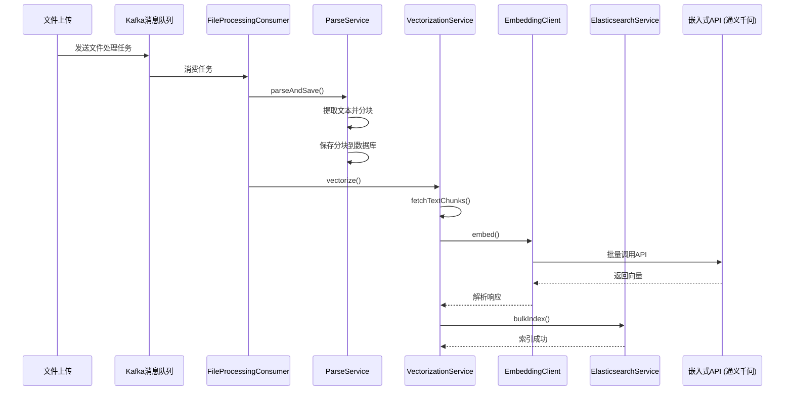
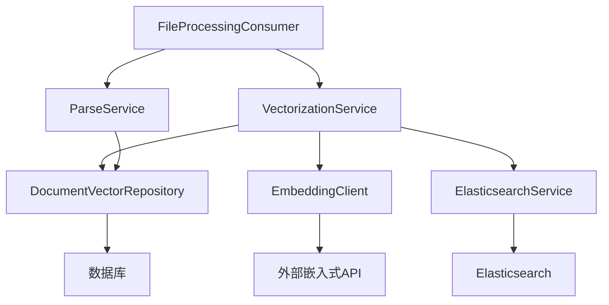
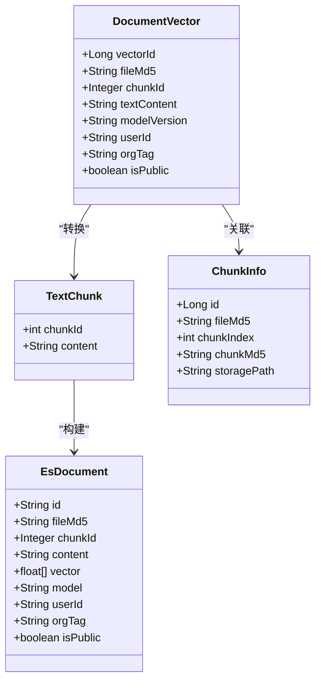

# 向量生成

<cite>
**本文档引用的文件**   
- [VectorizationService.java](file://src/main/java/com/yizhaoqi/smartpai/service/VectorizationService.java)
- [EmbeddingClient.java](file://src/main/java/com/yizhaoqi/smartpai/client/EmbeddingClient.java)
- [ParseService.java](file://src/main/java/com/yizhaoqi/smartpai/service/ParseService.java)
- [DocumentVector.java](file://src/main/java/com/yizhaoqi/smartpai/model/DocumentVector.java)
- [TextChunk.java](file://src/main/java/com/yizhaoqi/smartpai/entity/TextChunk.java)
- [ChunkInfo.java](file://src/main/java/com/yizhaoqi/smartpai/model/ChunkInfo.java)
- [ElasticsearchService.java](file://src/main/java/com/yizhaoqi/smartpai/service/ElasticsearchService.java)
- [DocumentVectorRepository.java](file://src/main/java/com/yizhaoqi/smartpai/repository/DocumentVectorRepository.java)
- [application.yml](file://src/main/resources/application.yml)
- [FileProcessingConsumer.java](file://src/main/java/com/yizhaoqi/smartpai/consumer/FileProcessingConsumer.java)
</cite>

## 目录
1. [向量化流程概述](#向量化流程概述)
2. [核心组件分析](#核心组件分析)
3. [向量化服务详解](#向量化服务详解)
4. [嵌入客户端实现](#嵌入客户端实现)
5. [文本分块策略](#文本分块策略)
6. [数据结构设计](#数据结构设计)
7. [配置参数说明](#配置参数说明)
8. [调用流程与错误处理](#调用流程与错误处理)
9. [性能优化建议](#性能优化建议)

## 向量化流程概述

向量化流程是将上传的文档内容转换为机器可理解的数值向量表示的过程，主要服务于后续的语义搜索和知识检索。整个流程始于文件上传，通过Kafka消息队列触发异步处理任务，最终生成的向量被存储在Elasticsearch中以支持高效检索。

该流程的核心步骤包括：
1.  **文件解析**：使用Apache Tika库解析多种格式的文档（如PDF、DOCX等），提取纯文本内容。
2.  **文本分块**：将提取的长文本分割成较小的、语义连贯的块（TextChunk），以便于后续处理和提高搜索精度。
3.  **向量生成**：调用外部嵌入式API（如通义千问）为每个文本块生成高维向量表示。
4.  **向量存储**：将生成的向量及其元数据（如文件ID、分块内容）批量索引到Elasticsearch中。



**图示来源**
- [FileProcessingConsumer.java](file://src/main/java/com/yizhaoqi/smartpai/consumer/FileProcessingConsumer.java#L45-L75)
- [ParseService.java](file://src/main/java/com/yizhaoqi/smartpai/service/ParseService.java#L25-L45)
- [VectorizationService.java](file://src/main/java/com/yizhaoqi/smartpai/service/VectorizationService.java#L25-L65)
- [EmbeddingClient.java](file://src/main/java/com/yizhaoqi/smartpai/client/EmbeddingClient.java#L45-L85)
- [ElasticsearchService.java](file://src/main/java/com/yizhaoqi/smartpai/service/ElasticsearchService.java#L25-L50)

## 核心组件分析

向量化系统由多个核心组件协同工作，每个组件负责特定的功能模块。

### 组件关系图


**图示来源**
- [FileProcessingConsumer.java](file://src/main/java/com/yizhaoqi/smartpai/consumer/FileProcessingConsumer.java)
- [VectorizationService.java](file://src/main/java/com/yizhaoqi/smartpai/service/VectorizationService.java)
- [ParseService.java](file://src/main/java/com/yizhaoqi/smartpai/service/ParseService.java)

## 向量化服务详解

`VectorizationService` 是整个向量化流程的核心协调者，负责串联解析、向量化和存储三个阶段。

### 主要功能
- **协调流程**：接收文件MD5等元数据，依次调用下游服务完成整个向量化过程。
- **数据获取**：从数据库中查询已解析的文本分块。
- **向量生成**：委托 `EmbeddingClient` 生成向量。
- **结果存储**：将向量和元数据构建为Elasticsearch文档并批量索引。

### 代码实现
```java
@Service
public class VectorizationService {
    @Autowired
    private EmbeddingClient embeddingClient;

    @Autowired
    private ElasticsearchService elasticsearchService;

    @Autowired
    private DocumentVectorRepository documentVectorRepository;

    public void vectorize(String fileMd5, String userId, String orgTag, boolean isPublic) {
        try {
            logger.info("开始向量化文件，fileMd5: {}", fileMd5);
            
            // 1. 获取分块内容
            List<TextChunk> chunks = fetchTextChunks(fileMd5);
            if (chunks.isEmpty()) return;

            // 2. 提取文本并调用API生成向量
            List<String> texts = chunks.stream().map(TextChunk::getContent).toList();
            List<float[]> vectors = embeddingClient.embed(texts);

            // 3. 构建Elasticsearch文档并存储
            List<EsDocument> esDocuments = IntStream.range(0, chunks.size())
                .mapToObj(i -> new EsDocument(
                    UUID.randomUUID().toString(),
                    fileMd5,
                    chunks.get(i).getChunkId(),
                    chunks.get(i).getContent(),
                    vectors.get(i),
                    "deepseek-embed",
                    userId,
                    orgTag,
                    isPublic
                ))
                .toList();

            elasticsearchService.bulkIndex(esDocuments);
            logger.info("向量化完成，fileMd5: {}", fileMd5);
        } catch (Exception e) {
            logger.error("向量化失败", e);
            throw new RuntimeException("向量化失败", e);
        }
    }

    private List<TextChunk> fetchTextChunks(String fileMd5) {
        List<DocumentVector> vectors = documentVectorRepository.findByFileMd5(fileMd5);
        return vectors.stream()
            .map(vector -> new TextChunk(vector.getChunkId(), vector.getTextContent()))
            .toList();
    }
}
```

**本节来源**
- [VectorizationService.java](file://src/main/java/com/yizhaoqi/smartpai/service/VectorizationService.java#L17-L101)

## 嵌入客户端实现

`EmbeddingClient` 负责与外部嵌入式API（如通义千问）进行通信，封装了HTTP请求、批处理、重试和响应解析等复杂逻辑。

### HTTP请求封装
客户端使用Spring的 `WebClient` 发起异步HTTP POST请求，构造符合API要求的JSON请求体。

**请求体结构**
```json
{
  "model": "text-embedding-v4",
  "input": ["文本1", "文本2", ...],
  "dimension": 2048,
  "encoding_format": "float"
}
```

### 重试机制
为了应对网络波动或API临时不可用，客户端实现了基于Reactor的重试策略，最多重试3次，每次间隔1秒。

```java
private String callApiOnce(List<String> batch) {
    return webClient.post()
        .uri("/embeddings")
        .bodyValue(requestBody)
        .retrieve()
        .bodyToMono(String.class)
        .retryWhen(Retry.fixedDelay(3, Duration.ofSeconds(1))
            .filter(e -> e instanceof WebClientResponseException))
        .block(Duration.ofSeconds(30));
}
```

### 响应处理
API返回的JSON响应被解析为 `JsonNode` 对象，从中提取 `data` 数组内的 `embedding` 字段，并转换为Java的 `float[]` 数组。

```java
private List<float[]> parseVectors(String response) throws Exception {
    JsonNode jsonNode = objectMapper.readTree(response);
    JsonNode data = jsonNode.get("data");
    List<float[]> vectors = new ArrayList<>();
    for (JsonNode item : data) {
        JsonNode embedding = item.get("embedding");
        float[] vector = new float[embedding.size()];
        for (int i = 0; i < embedding.size(); i++) {
            vector[i] = (float) embedding.get(i).asDouble();
        }
        vectors.add(vector);
    }
    return vectors;
}
```

**本节来源**
- [EmbeddingClient.java](file://src/main/java/com/yizhaoqi/smartpai/client/EmbeddingClient.java#L19-L102)

## 文本分块策略

文本分块是影响搜索精度的关键步骤。系统采用了智能分块策略，旨在保持语义完整性。

### 分块流程
1.  **按段落分割**：首先使用正则表达式 `\n\n+` 将文本按段落分割。
2.  **处理长段落**：如果单个段落超过配置的 `chunk-size`，则进一步按句子边界分割。
3.  **处理长句子**：如果单个句子过长，则按词边界进行分割。

### 配置参数
- **`file.parsing.chunk-size`**: 每个文本块的最大字符数，默认为512。
- **`file.parsing.buffer-size`**: 文件读取缓冲区大小，默认为8192字节。
- **`file.parsing.max-memory-threshold`**: 内存使用率阈值，超过80%时触发垃圾回收。

### 代码实现
```java
private List<String> splitTextIntoChunksWithSemantics(String text, int chunkSize) {
    List<String> chunks = new ArrayList<>();
    String[] paragraphs = text.split("\n\n+");
    StringBuilder currentChunk = new StringBuilder();

    for (String paragraph : paragraphs) {
        if (paragraph.length() > chunkSize) {
            // 处理长段落
            List<String> sentenceChunks = splitLongParagraph(paragraph, chunkSize);
            chunks.addAll(sentenceChunks);
        } else if (currentChunk.length() + paragraph.length() > chunkSize) {
            // 当前块已满，保存并开始新块
            chunks.add(currentChunk.toString().trim());
            currentChunk = new StringBuilder(paragraph);
        } else {
            // 添加到当前块
            currentChunk.append("\n\n").append(paragraph);
        }
    }
    if (currentChunk.length() > 0) {
        chunks.add(currentChunk.toString().trim());
    }
    return chunks;
}
```

**本节来源**
- [ParseService.java](file://src/main/java/com/yizhaoqi/smartpai/service/ParseService.java#L100-L250)
- [application.yml](file://src/main/resources/application.yml#L72-L74)

## 数据结构设计

系统中定义了多个实体类来表示向量化过程中的核心数据。

### 实体类关系图


**图示来源**
- [DocumentVector.java](file://src/main/java/com/yizhaoqi/smartpai/model/DocumentVector.java#L11-L48)
- [TextChunk.java](file://src/main/java/com/yizhaoqi/smartpai/entity/TextChunk.java#L6-L19)
- [ChunkInfo.java](file://src/main/java/com/yizhaoqi/smartpai/model/ChunkInfo.java#L10-L45)

### 字段说明
- **`DocumentVector`**: 存储在数据库中的分块实体，包含文本内容和用户权限信息。
- **`TextChunk`**: 用于向量化服务内部处理的轻量级分块对象，仅包含ID和内容。
- **`ChunkInfo`**: 存储分块的元数据，如存储路径和校验码。
- **`EsDocument`**: 映射到Elasticsearch索引的文档结构，包含向量数组。

## 配置参数说明

向量化相关的配置主要在 `application.yml` 文件中定义。

### 嵌入式API配置
```yaml
embedding:
  api:
    url: https://dashscope.aliyuncs.com/compatible-mode/v1
    key: sk-ba4a22d48eed4a03bf8f0ee03a792195
    model: text-embedding-v4
    batch-size: 10
    dimension: 2048
```

- **`model`**: 使用的嵌入式模型名称，当前为 `text-embedding-v4`。
- **`batch-size`**: 单次API调用的最大文本数量，受API服务商限制（DashScope为10）。
- **`dimension`**: 生成向量的维度，当前配置为2048维。

### 性能权衡分析
- **向量维度**:
  - **高维度 (如2048)**: 能捕获更丰富的语义信息，搜索精度更高，但占用更多存储空间和内存，计算成本更高。
  - **低维度 (如768)**: 更节省资源，速度快，但可能损失部分语义细节，适合对精度要求不高的场景。
- **批处理大小**:
  - **小批次**: 降低单次请求失败的影响，内存占用少，但总请求数多，网络开销大。
  - **大批次**: 减少网络往返次数，提高吞吐量，但单次请求失败会导致更多数据重试，且对内存要求高。

## 调用流程与错误处理

### 成功调用示例
```java
// 1. 上传文件后，Kafka消费者收到任务
FileProcessingTask task = new FileProcessingTask("abc123", "/path/to/file.pdf", "user123", "orgA", true);

// 2. 消费者调用向量化服务
vectorizationService.vectorize("abc123", "user123", "orgA", true);
```

### 错误处理场景
- **API限流/超时**:
  - **现象**: `WebClientResponseException` 或 `TimeoutException`。
  - **处理**: `EmbeddingClient` 的 `retryWhen` 机制会自动重试3次。若最终失败，`VectorizationService` 会记录错误日志并抛出运行时异常，导致Kafka任务失败并进入死信队列。
- **解析失败**:
  - **现象**: `TikaException` 或文件内容为空。
  - **处理**: `ParseService` 会记录警告日志，但不会中断流程，后续向量化会因无分块内容而跳过。
- **Elasticsearch索引失败**:
  - **现象**: `BulkResponse` 返回错误。
  - **处理**: `ElasticsearchService` 会记录详细的错误日志并抛出异常，中断向量化流程。

## 性能优化建议

1.  **向量缓存**:
    - **方案**: 在 `VectorizationService` 中引入本地缓存（如Caffeine），以 `fileMd5` 和 `modelId` 为键缓存向量结果。
    - **优点**: 避免对同一文件重复调用昂贵的API，显著提升性能。
    - **挑战**: 需要管理缓存失效策略，确保模型更新后能重新生成向量。

2.  **异步批处理**:
    - 将 `vectorize` 方法改为异步，允许系统在后台处理大量文件，避免阻塞主线程。

3.  **向量维度选择**:
    - 根据实际业务需求权衡。对于高精度的语义搜索，推荐使用2048维；对于资源受限或对速度要求极高的场景，可考虑768维模型。

4.  **分块重叠**:
    - 当前代码中存在 `splitTextWithOverlap` 方法，但未被调用。启用分块重叠（例如10%）可以解决语义被截断的问题，提高搜索召回率。