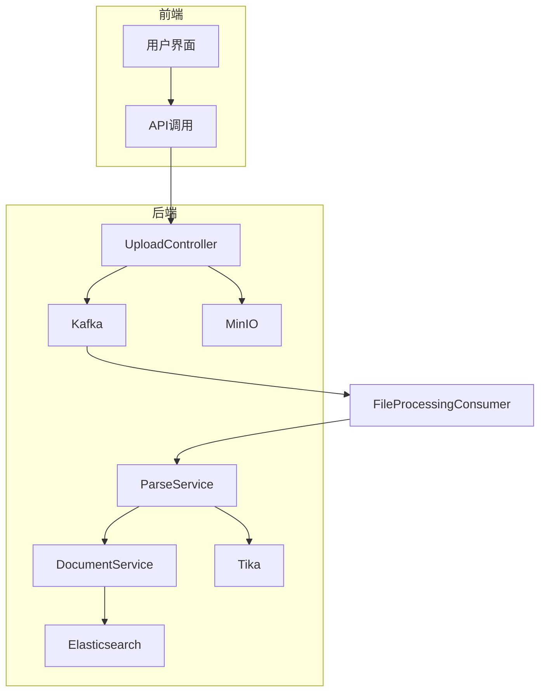
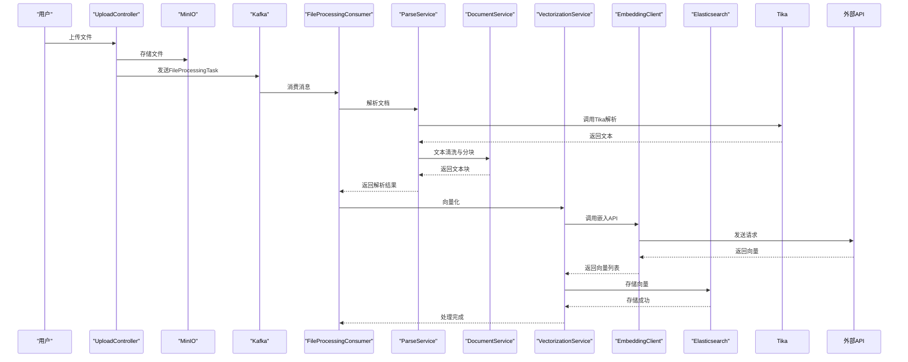
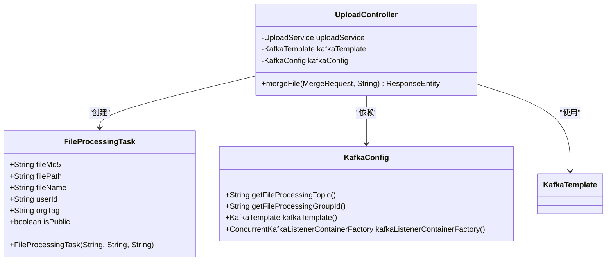
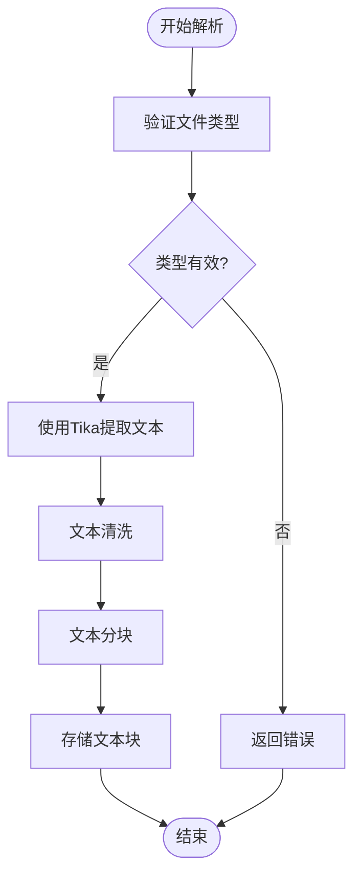
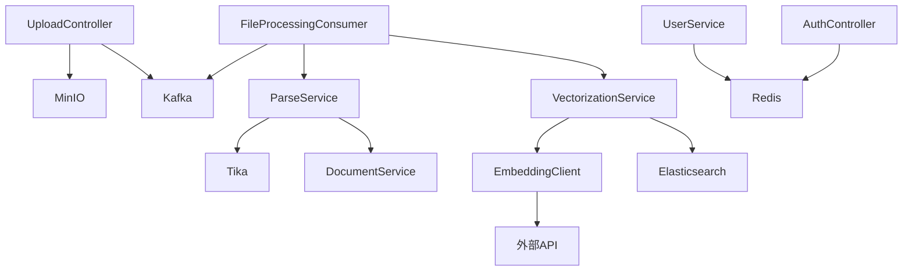

# 文档处理流程

<cite>
**本文档中引用的文件**   
- [FileProcessingTask.java](file://src/main/java/com/yizhaoqi/smartpai/model/FileProcessingTask.java)
- [UploadController.java](file://src/main/java/com/yizhaoqi/smartpai/controller/UploadController.java)
- [FileTypeValidationService.java](file://src/main/java/com/yizhaoqi/smartpai/service/FileTypeValidationService.java)
- [ParseService.java](file://src/main/java/com/yizhaoqi/smartpai/service/ParseService.java)
- [DocumentService.java](file://src/main/java/com/yizhaoqi/smartpai/service/DocumentService.java)
- [VectorizationService.java](file://src/main/java/com/yizhaoqi/smartpai/service/VectorizationService.java)
- [EmbeddingClient.java](file://src/main/java/com/yizhaoqi/smartpai/client/EmbeddingClient.java)
- [WebClientConfig.java](file://src/main/java/com/yizhaoqi/smartpai/config/WebClientConfig.java)
- [KafkaConfig.java](file://src/main/java/com/yizhaoqi/smartpai/config/KafkaConfig.java)
- [MinioConfig.java](file://src/main/java/com/yizhaoqi/smartpai/config/MinioConfig.java)
- [application.yml](file://src/main/resources/application.yml)
</cite>

## 目录
1. [简介](#简介)
2. [项目结构](#项目结构)
3. [核心组件](#核心组件)
4. [架构概览](#架构概览)
5. [详细组件分析](#详细组件分析)
6. [依赖分析](#依赖分析)
7. [性能考虑](#性能考虑)
8. [故障排除指南](#故障排除指南)
9. [结论](#结论)

## 简介
本文档详细描述了从用户上传文档到完成文本解析的完整处理流程。系统采用微服务架构，结合Kafka消息队列、MinIO对象存储和Apache Tika文档解析技术，实现了高效、可靠的文档处理管道。文档重点说明了FileProcessingConsumer如何监听Kafka消息触发文档处理，ParseService调用Apache Tika进行格式解析的实现细节，以及DocumentService对原始文本的清洗与预处理逻辑。同时，文档还解释了异常处理机制，如文件损坏或不支持格式的响应方式，并提供了数据在MinIO、Kafka、Tika之间的流转路径图。

## 项目结构
项目采用典型的前后端分离架构，后端基于Spring Boot框架，前端使用Vue.js。后端代码位于`src/main/java`目录下，主要包含controller、service、model、repository等包。前端代码位于`frontend/src`目录下，采用模块化设计。系统通过Kafka实现异步消息处理，使用MinIO作为文件存储，Elasticsearch作为向量数据库，Redis作为缓存。

**图表来源**
- [UploadController.java](file://src/main/java/com/yizhaoqi/smartpai/controller/UploadController.java)
- [ParseService.java](file://src/main/java/com/yizhaoqi/smartpai/service/ParseService.java)
- [DocumentService.java](file://src/main/java/com/yizhaoqi/smartpai/service/DocumentService.java)

**本节来源**
- [project_structure](file://project_structure)

## 核心组件
系统的核心组件包括文件上传控制器（UploadController）、文件处理消费者（FileProcessingConsumer）、解析服务（ParseService）、文档服务（DocumentService）和向量化服务（VectorizationService）。UploadController负责接收用户上传的文件分片并存储到MinIO，同时将处理任务发布到Kafka。FileProcessingConsumer监听Kafka消息，触发后续的解析和向量化流程。ParseService使用Apache Tika解析不同格式的文档，DocumentService对解析出的文本进行清洗和分块，VectorizationService调用外部API生成向量并存储到Elasticsearch。

**本节来源**
- [UploadController.java](file://src/main/java/com/yizhaoqi/smartpai/controller/UploadController.java#L1-L50)
- [ParseService.java](file://src/main/java/com/yizhaoqi/smartpai/service/ParseService.java#L1-L30)
- [DocumentService.java](file://src/main/java/com/yizhaoqi/smartpai/service/DocumentService.java#L1-L25)

## 架构概览
系统采用事件驱动架构，通过Kafka实现组件间的解耦。当用户上传文件后，UploadController将文件存储到MinIO，并将包含文件元数据的FileProcessingTask消息发送到Kafka的file-processing主题。FileProcessingConsumer监听该主题，接收到消息后调用ParseService解析文档，然后调用VectorizationService进行向量化处理。整个流程异步执行，提高了系统的响应性和可扩展性。

**图表来源**
- [UploadController.java](file://src/main/java/com/yizhaoqi/smartpai/controller/UploadController.java#L150-L200)
- [FileProcessingConsumer.java](file://src/main/java/com/yizhaoqi/smartpai/consumer/FileProcessingConsumer.java#L20-L50)
- [ParseService.java](file://src/main/java/com/yizhaoqi/smartpai/service/ParseService.java#L30-L60)
- [VectorizationService.java](file://src/main/java/com/yizhaoqi/smartpai/service/VectorizationService.java#L40-L80)

## 详细组件分析

### 文件上传与Kafka消息触发
UploadController的mergeFile方法在文件分片合并完成后，创建FileProcessingTask对象并发送到Kafka。FileProcessingTask包含文件的MD5值、存储路径、文件名、用户ID、组织标签和公开状态等信息。Kafka配置了死信队列（DLT），当消息处理失败时，会自动重试4次，失败后消息将被发送到file-processing-dlt主题，便于后续排查。

**图表来源**
- [FileProcessingTask.java](file://src/main/java/com/yizhaoqi/smartpai/model/FileProcessingTask.java#L1-L30)
- [UploadController.java](file://src/main/java/com/yizhaoqi/smartpai/controller/UploadController.java#L300-L400)
- [KafkaConfig.java](file://src/main/java/com/yizhaoqi/smartpai/config/KafkaConfig.java#L50-L100)

**本节来源**
- [FileProcessingTask.java](file://src/main/java/com/yizhaoqi/smartpai/model/FileProcessingTask.java#L1-L33)
- [UploadController.java](file://src/main/java/com/yizhaoqi/smartpai/controller/UploadController.java#L250-L450)
- [KafkaConfig.java](file://src/main/java/com/yizhaoqi/smartpai/config/KafkaConfig.java#L1-L104)

### 文档解析与文本分块
ParseService使用Apache Tika解析不同格式的文档。系统支持PDF、Word、Excel、PowerPoint、文本文件等多种格式。对于不支持的格式（如图片、音频、视频等），FileTypeValidationService会在上传时进行验证并拒绝。DocumentService对解析出的文本进行清洗，去除多余的空白字符和特殊符号，并根据配置的chunk-size（默认512字符）进行分块，便于后续的向量化处理。

**图表来源**
- [ParseService.java](file://src/main/java/com/yizhaoqi/smartpai/service/ParseService.java#L20-L80)
- [DocumentService.java](file://src/main/java/com/yizhaoqi/smartpai/service/DocumentService.java#L15-L50)
- [FileTypeValidationService.java](file://src/main/java/com/yizhaoqi/smartpai/service/FileTypeValidationService.java#L50-L100)

**本节来源**
- [ParseService.java](file://src/main/java/com/yizhaoqi/smartpai/service/ParseService.java#L1-L100)
- [DocumentService.java](file://src/main/java/com/yizhaoqi/smartpai/service/DocumentService.java#L1-L60)
- [FileTypeValidationService.java](file://src/main/java/com/yizhaoqi/smartpai/service/FileTypeValidationService.java#L1-L294)

### 异常处理机制
系统实现了完善的异常处理机制。在文件上传阶段，如果文件类型不支持，会立即返回错误信息。在文档解析阶段，如果文件损坏或格式不正确，Tika会抛出异常，系统会记录错误日志并更新任务状态。Kafka消费者配置了死信队列，确保处理失败的消息不会丢失。所有关键操作都有详细的日志记录，便于问题追踪和审计。

**本节来源**
- [UploadController.java](file://src/main/java/com/yizhaoqi/smartpai/controller/UploadController.java#L100-L150)
- [ParseService.java](file://src/main/java/com/yizhaoqi/smartpai/service/ParseService.java#L80-L100)
- [KafkaConfig.java](file://src/main/java/com/yizhaoqi/smartpai/config/KafkaConfig.java#L90-L104)

## 依赖分析
系统依赖于多个外部组件和服务。MinIO用于文件存储，Kafka用于消息队列，Elasticsearch用于向量存储，Redis用于缓存。系统通过WebClient调用外部嵌入API生成向量。所有外部服务的配置都集中在application.yml文件中，便于管理和维护。

**图表来源**
- [application.yml](file://src/main/resources/application.yml#L1-L129)
- [WebClientConfig.java](file://src/main/java/com/yizhaoqi/smartpai/config/WebClientConfig.java#L1-L34)
- [MinioConfig.java](file://src/main/java/com/yizhaoqi/smartpai/config/MinioConfig.java#L1-L35)

**本节来源**
- [application.yml](file://src/main/resources/application.yml#L1-L129)
- [WebClientConfig.java](file://src/main/java/com/yizhaoqi/smartpai/config/WebClientConfig.java#L1-L34)
- [MinioConfig.java](file://src/main/java/com/yizhaoqi/smartpai/config/MinioConfig.java#L1-L35)

## 性能考虑
系统在设计时充分考虑了性能因素。文件上传采用分片上传，支持大文件传输。Kafka消息处理采用异步方式，避免阻塞主线程。文本解析和向量化处理在后台执行，不影响用户操作。系统配置了合理的缓冲区大小和内存阈值，防止内存溢出。外部API调用采用批处理方式，减少网络开销。

## 故障排除指南
当文档处理失败时，应首先检查日志文件。业务日志记录在business.log中，包含文件上传、解析、向量化等操作的详细信息。性能日志记录在performance.log中，可用于分析性能瓶颈。如果Kafka消息处理失败，检查死信队列中的消息，分析失败原因。对于外部API调用失败，检查网络连接和API密钥配置。

**本节来源**
- [LogUtils.java](file://src/main/java/com/yizhaoqi/smartpai/utils/LogUtils.java#L1-L100)
- [logback-spring.xml](file://src/main/resources/logback-spring.xml#L1-L133)

## 结论
本文档详细描述了文档处理系统的完整流程，从文件上传到文本解析再到向量化存储。系统采用现代化的技术栈和架构设计，具有高可靠性、可扩展性和易维护性。通过Kafka实现异步处理，提高了系统的响应性。使用Apache Tika支持多种文档格式，满足了多样化的业务需求。完善的日志记录和异常处理机制，确保了系统的稳定运行。