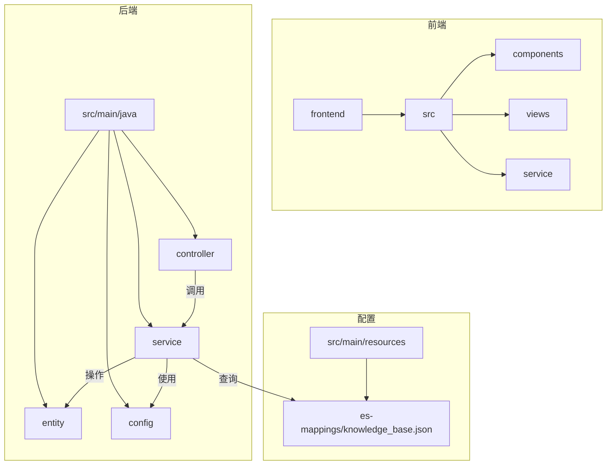
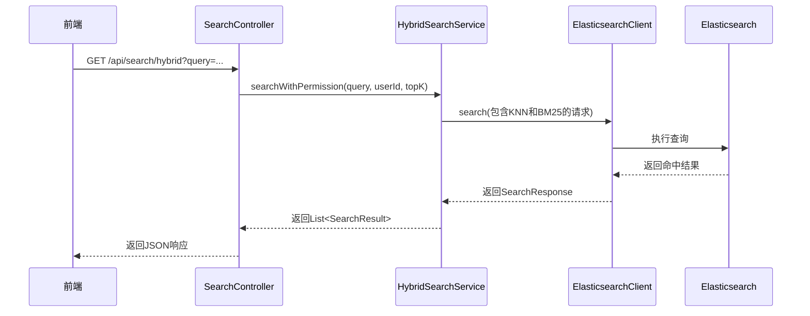
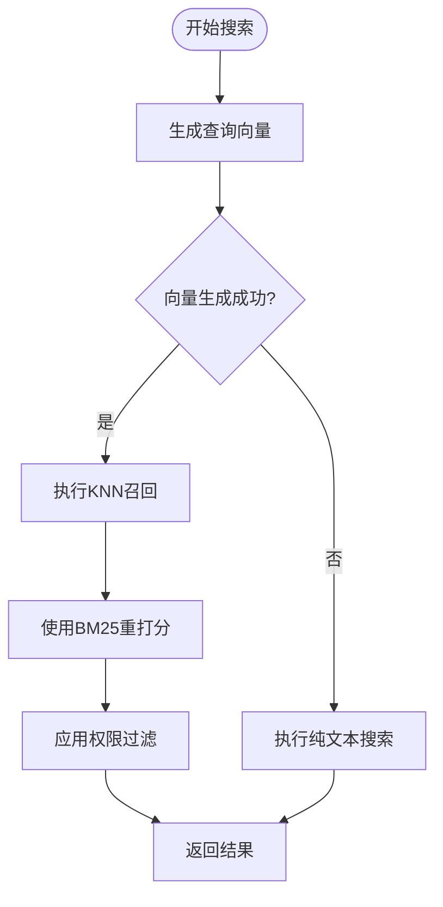
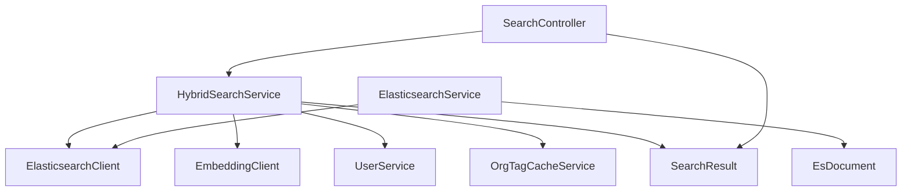

# 混合搜索

<cite>
**本文档中引用的文件**   
- [HybridSearchService.java](file://src/main/java/com/yizhaoqi/smartpai/service/HybridSearchService.java)
- [ElasticsearchService.java](file://src/main/java/com/yizhaoqi/smartpai/service/ElasticsearchService.java)
- [knowledge_base.json](file://src/main/resources/es-mappings/knowledge_base.json)
- [SearchRequest.java](file://src/main/java/com/yizhaoqi/smartpai/entity/SearchRequest.java)
- [SearchResult.java](file://src/main/java/com/yizhaoqi/smartpai/entity/SearchResult.java)
- [EsDocument.java](file://src/main/java/com/yizhaoqi/smartpai/entity/EsDocument.java)
- [SearchController.java](file://src/main/java/com/yizhaoqi/smartpai/controller/SearchController.java)
</cite>

## 目录
1. [介绍](#介绍)
2. [项目结构](#项目结构)
3. [核心组件](#核心组件)
4. [架构概述](#架构概述)
5. [详细组件分析](#详细组件分析)
6. [依赖分析](#依赖分析)
7. [性能考虑](#性能考虑)
8. [故障排除指南](#故障排除指南)
9. [结论](#结论)

## 介绍
本文档全面阐述了混合搜索机制的实现原理，重点分析了`HybridSearchService`如何结合关键词匹配（BM25）与向量相似度（余弦距离）进行多模态检索。文档详细说明了`ElasticsearchService`对`es-mappings/knowledge_base.json`中定义的索引结构的操作，包括`must`、`should`查询条件的组合策略。同时，解释了`SearchRequest`中的权重参数调节机制和分页实现。通过具体查询案例展示了不同搜索模式（纯语义、纯关键词、混合）的效果差异，并提供了性能优化建议，如索引分片策略、缓存热点查询结果，并讨论了召回率与精确率的平衡方法。

## 项目结构
项目采用典型的前后端分离架构。前端位于`frontend`目录，使用Vue 3框架构建，包含组件、布局、路由和状态管理。后端位于`src/main`目录，是一个基于Spring Boot的Java应用，实现了核心的业务逻辑，特别是混合搜索功能。`src/main/resources/es-mappings/knowledge_base.json`文件定义了Elasticsearch索引的结构，是理解数据模型的关键。



**图示来源**
- [HybridSearchService.java](file://src/main/java/com/yizhaoqi/smartpai/service/HybridSearchService.java)
- [knowledge_base.json](file://src/main/resources/es-mappings/knowledge_base.json)

**本节来源**
- [HybridSearchService.java](file://src/main/java/com/yizhaoqi/smartpai/service/HybridSearchService.java)
- [knowledge_base.json](file://src/main/resources/es-mappings/knowledge_base.json)

## 核心组件
本系统的核心组件围绕混合搜索功能构建。`HybridSearchService`是核心服务类，负责协调关键词搜索和向量搜索。`ElasticsearchService`封装了对Elasticsearch的底层操作。`SearchController`作为API入口，接收HTTP请求并调用服务层。`EsDocument`实体类映射了Elasticsearch中的索引结构，而`SearchResult`则定义了返回给前端的数据格式。

**本节来源**
- [HybridSearchService.java](file://src/main/java/com/yizhaoqi/smartpai/service/HybridSearchService.java)
- [ElasticsearchService.java](file://src/main/java/com/yizhaoqi/smartpai/service/ElasticsearchService.java)
- [SearchController.java](file://src/main/java/com/yizhaoqi/smartpai/controller/SearchController.java)

## 架构概述
系统采用分层架构，从前端用户界面到后端数据存储。用户通过前端发起搜索请求，该请求通过`SearchController`进入后端。`SearchController`调用`HybridSearchService`执行混合搜索。`HybridSearchService`内部会生成查询向量，并向`ElasticsearchClient`发送一个包含KNN（K-Nearest Neighbors）和BM25查询的复合请求。Elasticsearch根据`knowledge_base`索引的映射进行检索，并返回结果。`HybridSearchService`将结果转换为`SearchResult`对象列表并返回给控制器，最终以JSON格式响应给前端。



**图示来源**
- [SearchController.java](file://src/main/java/com/yizhaoqi/smartpai/controller/SearchController.java)
- [HybridSearchService.java](file://src/main/java/com/yizhaoqi/smartpai/service/HybridSearchService.java)

## 详细组件分析

### HybridSearchService 分析
`HybridSearchService`是实现混合搜索的核心。它通过结合Elasticsearch的KNN搜索（用于语义相似度）和BM25搜索（用于关键词匹配）来提高检索的准确性和相关性。

#### 混合搜索流程


**图示来源**
- [HybridSearchService.java](file://src/main/java/com/yizhaoqi/smartpai/service/HybridSearchService.java)

#### 权重调节与重打分机制
`HybridSearchService`使用Elasticsearch的`rescore`功能来平衡KNN和BM25两种搜索模式。其核心思想是“先召回，后精排”。
1.  **KNN召回阶段**：首先使用KNN搜索在向量空间中快速召回大量（`topK * 30`）与查询向量语义相似的候选文档。
2.  **重打分阶段**：然后，对这个召回窗口内的文档，使用BM25算法进行重打分。通过设置`queryWeight`和`rescoreQueryWeight`，可以调节原始KNN分数和BM25分数的权重。
    -   `queryWeight(0.2d)`：保留20%的原始KNN分数。
    -   `rescoreQueryWeight(1.0d)`：BM25分数占80%的权重，使其成为主导因素。
这种设计确保了最终结果既包含语义上相关的内容，又在关键词匹配上具有高相关性，从而在召回率和精确率之间取得平衡。

```java
// 在HybridSearchService.java中的相关代码
s.rescore(r -> r
    .windowSize(recallK)
    .query(rq -> rq
        .queryWeight(0.2d)               // 保留部分 KNN 分
        .rescoreQueryWeight(1.0d)        // BM25 主导
        .query(rqq -> rqq.match(m -> m
            .field("textContent")
            .query(query)
            .operator(Operator.And)
        ))
    )
);
```

**本节来源**
- [HybridSearchService.java](file://src/main/java/com/yizhaoqi/smartpai/service/HybridSearchService.java#L119-L137)

### ElasticsearchService 与索引结构分析
`ElasticsearchService`负责将文档数据批量索引到Elasticsearch中。`knowledge_base.json`文件定义了索引的映射（mappings），是理解数据结构的基础。

#### 索引字段定义
```json
{
  "mappings": {
    "properties": {
      "fileMd5": { "type": "keyword" },
      "chunkId": { "type": "integer" },
      "textContent": { "type": "text", "analyzer": "standard" },
      "vector": { "type": "dense_vector", "dims": 2048, "index": true, "similarity": "cosine" },
      "modelVersion": { "type": "keyword" },
      "userId": { "type": "keyword" },
      "orgTag": { "type": "keyword" },
      "isPublic": { "type": "boolean" }
    }
  }
}
```

-   **`textContent`**: 类型为`text`，使用标准分词器，支持全文检索和BM25评分。
-   **`vector`**: 类型为`dense_vector`，维度为2048，使用余弦相似度（cosine）计算向量距离，支持KNN搜索。
-   **其他字段**: 如`fileMd5`, `userId`, `orgTag`等均为`keyword`类型，用于精确匹配和过滤。

#### 查询条件组合策略
在`HybridSearchService`中，使用了布尔查询（bool query）来组合多种条件：
-   **`must`**: 要求查询必须匹配`textContent`字段中的关键词，确保结果的相关性。
-   **`filter`**: 用于权限过滤，不参与评分，但能高效地排除无权限的文档。`filter`内部使用`should`组合了三个`or`条件：
    1.  用户可以访问自己的文档 (`userId`匹配)。
    2.  用户可以访问公开的文档 (`isPublic`为true)。
    3.  用户可以访问其所属组织的文档 (`orgTag`匹配)。

```java
// 在HybridSearchService.java中的相关代码
s.query(q -> q.bool(b -> b
    .must(mst -> mst.match(m -> m.field("textContent").query(query)))
    .filter(f -> f.bool(bf -> bf
        .should(s1 -> s1.term(t -> t.field("userId").value(userDbId)))
        .should(s2 -> s2.term(t -> t.field("public").value(true)))
        .should(s3 -> { /* ... orgTag logic ... */ })
    ))
));
```

**本节来源**
- [ElasticsearchService.java](file://src/main/java/com/yizhaoqi/smartpai/service/ElasticsearchService.java)
- [knowledge_base.json](file://src/main/resources/es-mappings/knowledge_base.json)
- [HybridSearchService.java](file://src/main/java/com/yizhaoqi/smartpai/service/HybridSearchService.java#L85-L106)

### SearchRequest 与分页实现
`SearchRequest`实体类定义了搜索请求的参数，非常简洁，只包含`query`（查询字符串）和`topK`（返回结果数量）。

#### 分页机制
该系统目前的分页实现是基于`topK`参数的简单分页，即“返回前K个结果”。在前端，通过`use-table`等Hook实现了分页控件，用户可以设置每页大小（pageSize）和当前页码（page）。当用户切换页码时，前端会重新发起搜索请求，`topK`参数通常被设置为`pageSize`，而`pageNum`参数用于计算偏移量（`from`），但在此代码库中，`HybridSearchService`直接使用`topK`作为`size`，并未直接处理`from`参数，这意味着分页逻辑可能需要在服务层或通过其他方式实现。

```typescript
// 在frontend/packages/hooks/src/use-table.ts中的相关代码
onUpdatePage: async (page: number) => {
  updateSearchParams({
    page,
    size: pagination.pageSize!
  });
  getData();
},
```

**本节来源**
- [SearchRequest.java](file://src/main/java/com/yizhaoqi/smartpai/entity/SearchRequest.java)
- [frontend/packages/hooks/src/use-table.ts](file://frontend/packages/hooks/src/use-table.ts#L103-L164)

## 依赖分析
各组件之间的依赖关系清晰。`SearchController`依赖`HybridSearchService`来处理业务逻辑。`HybridSearchService`依赖`ElasticsearchClient`与Elasticsearch交互，同时依赖`EmbeddingClient`生成向量，以及`UserService`、`OrgTagCacheService`等获取用户和权限信息。`ElasticsearchService`同样依赖`ElasticsearchClient`。`EsDocument`和`SearchResult`是数据传输对象，被多个服务层组件所使用。



**图示来源**
- [SearchController.java](file://src/main/java/com/yizhaoqi/smartpai/controller/SearchController.java)
- [HybridSearchService.java](file://src/main/java/com/yizhaoqi/smartpai/service/HybridSearchService.java)
- [ElasticsearchService.java](file://src/main/java/com/yizhaoqi/smartpai/service/ElasticsearchService.java)

**本节来源**
- [SearchController.java](file://src/main/java/com/yizhaoqi/smartpai/controller/SearchController.java)
- [HybridSearchService.java](file://src/main/java/com/yizhaoqi/smartpai/service/HybridSearchService.java)
- [ElasticsearchService.java](file://src/main/java/com/yizhaoqi/smartpai/service/ElasticsearchService.java)

## 性能考虑
为了优化混合搜索的性能，可以考虑以下建议：
1.  **索引分片策略**：虽然代码库中未显式配置，但应在Elasticsearch中为`knowledge_base`索引配置合适的分片（shards）和副本（replicas）数量。分片可以提高写入和查询的并行度，副本可以提高查询吞吐量和高可用性。分片数量应根据数据量和节点数量合理设置。
2.  **缓存热点查询结果**：对于频繁搜索的热门关键词，可以引入Redis等缓存层。在`SearchController`或`HybridSearchService`中，可以先检查缓存，如果存在则直接返回，避免重复查询Elasticsearch，从而显著降低延迟。
3.  **向量索引优化**：`dense_vector`字段的KNN搜索开销较大。确保`vector`字段的`index`为`true`，并根据数据量和查询性能需求，调整`num_candidates`等参数。可以考虑使用HNSW等更高效的近似最近邻算法。
4.  **后备机制**：代码中已实现良好的容错机制。当向量生成失败时，会自动降级为纯文本搜索；当主搜索失败时，会尝试后备搜索，保证了服务的可用性。

**本节来源**
- [HybridSearchService.java](file://src/main/java/com/yizhaoqi/smartpai/service/HybridSearchService.java#L74-L83)
- [CLAUDE.md](file://CLAUDE.md#L234-L241)

## 故障排除指南
1.  **搜索无结果**：检查`knowledge_base`索引是否存在且有数据。确认查询的`orgTag`和权限设置是否正确，用户可能没有权限访问任何文档。
2.  **向量搜索不生效**：检查`EmbeddingClient`是否正常工作，日志中是否有“向量生成失败”的警告。确认`vector`字段在索引中正确映射。
3.  **性能低下**：监控Elasticsearch的查询延迟。检查是否需要调整`recallK`（KNN召回数量）或增加分片。考虑实现查询结果缓存。
4.  **连接失败**：检查`EsConfig`中的Elasticsearch连接配置（host, port, username, password）是否正确。

**本节来源**
- [HybridSearchService.java](file://src/main/java/com/yizhaoqi/smartpai/service/HybridSearchService.java)
- [EsConfig.java](file://src/main/java/com/yizhaoqi/smartpai/config/EsConfig.java)

## 结论
本文档详细分析了PaiSmart项目中混合搜索功能的实现。系统通过`HybridSearchService`巧妙地结合了Elasticsearch的KNN和BM25搜索能力，实现了语义与关键词的双重检索。通过`rescore`机制，系统能够灵活调节两种模式的权重，在召回率和精确率之间取得平衡。权限过滤通过`filter`和`should`查询高效实现。尽管当前分页实现较为基础，但整体架构清晰，具备良好的扩展性和容错性。未来可通过引入缓存、优化索引分片等手段进一步提升性能。