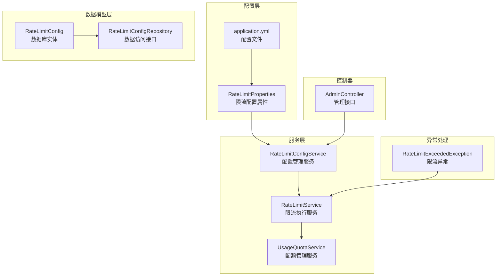
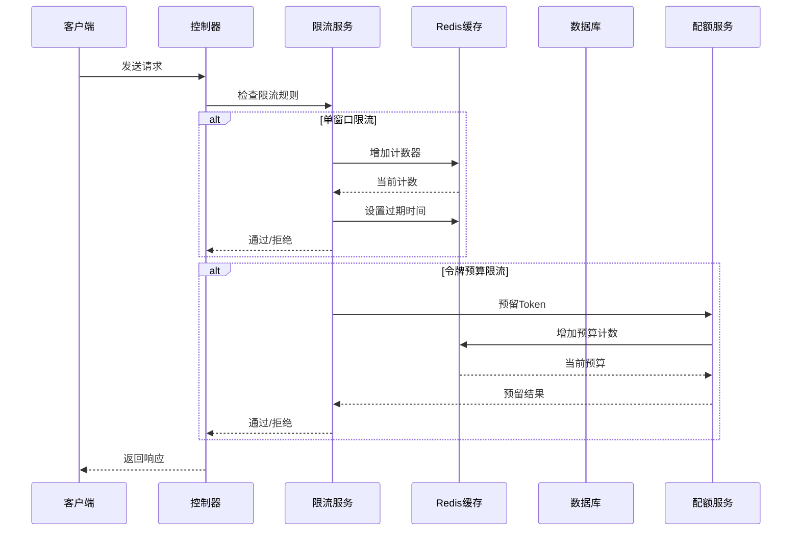
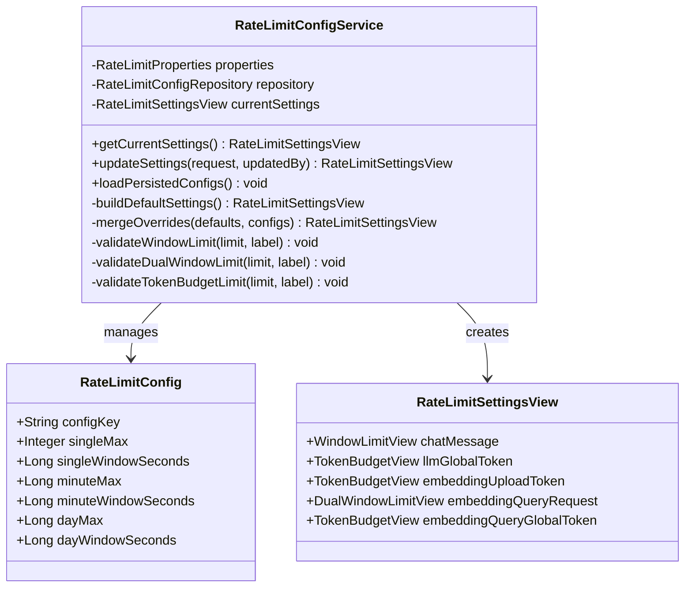
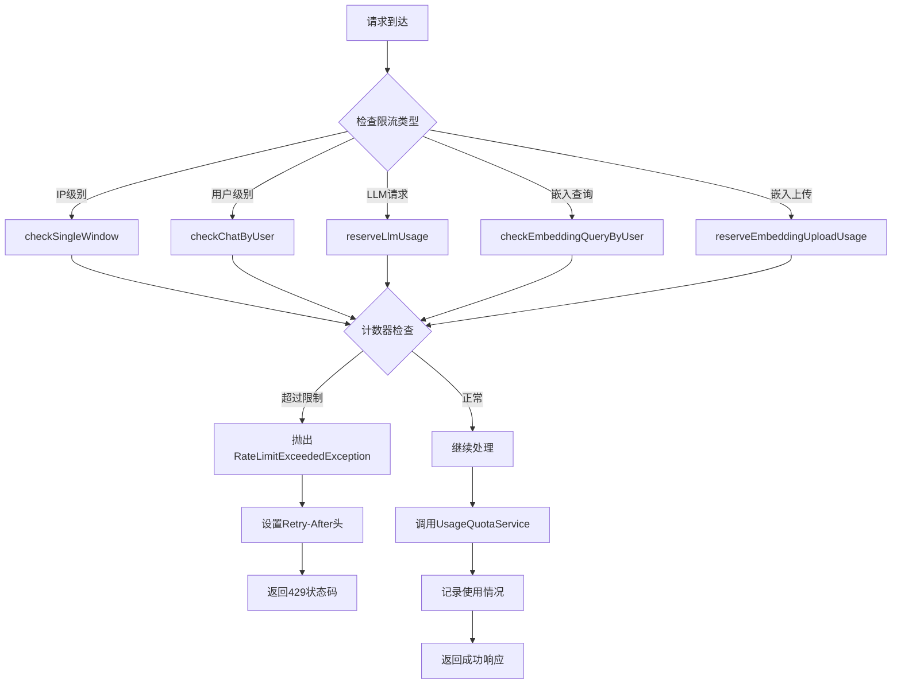
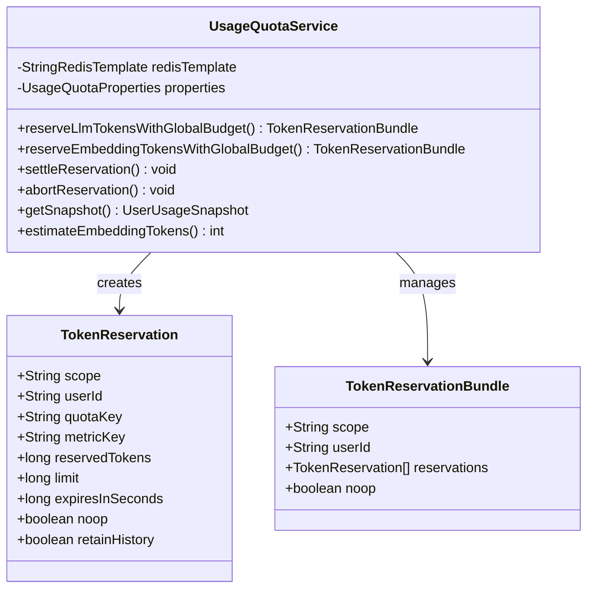
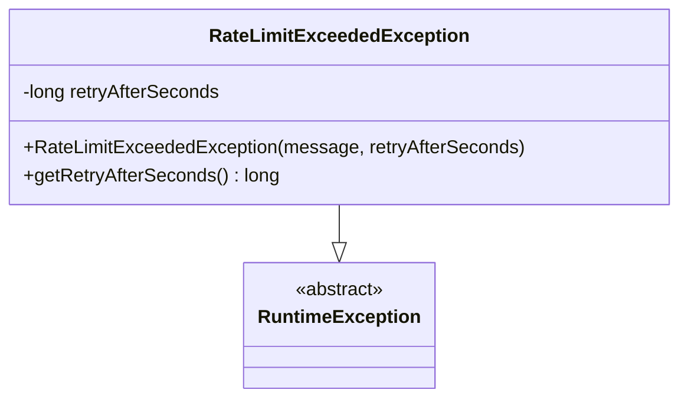
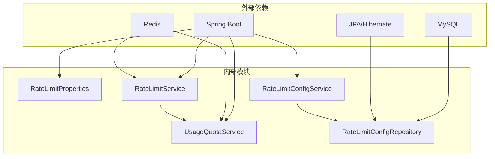

# Rate Limiting System

<cite>
**本文档引用的文件**
- [RateLimitProperties.java](file://src/main/java/com/yizhaoqi/smartpai/config/RateLimitProperties.java)
- [RateLimitConfig.java](file://src/main/java/com/yizhaoqi/smartpai/model/RateLimitConfig.java)
- [RateLimitConfigService.java](file://src/main/java/com/yizhaoqi/smartpai/service/RateLimitConfigService.java)
- [RateLimitService.java](file://src/main/java/com/yizhaoqi/smartpai/service/RateLimitService.java)
- [RateLimitConfigRepository.java](file://src/main/java/com/yizhaoqi/smartpai/repository/RateLimitConfigRepository.java)
- [RateLimitExceededException.java](file://src/main/java/com/yizhaoqi/smartpai/exception/RateLimitExceededException.java)
- [UsageQuotaService.java](file://src/main/java/com/yizhaoqi/smartpai/service/UsageQuotaService.java)
- [application.yml](file://src/main/resources/application.yml)
- [AdminController.java](file://src/main/java/com/yizhaoqi/smartpai/controller/AdminController.java)
- [RateLimitConfigServiceTest.java](file://src/test/java/com/yizhaoqi/smartpai/service/RateLimitConfigServiceTest.java)
</cite>

## 目录
1. [简介](#简介)
2. [项目结构](#项目结构)
3. [核心组件](#核心组件)
4. [架构概览](#架构概览)
5. [详细组件分析](#详细组件分析)
6. [依赖关系分析](#依赖关系分析)
7. [性能考虑](#性能考虑)
8. [故障排除指南](#故障排除指南)
9. [结论](#结论)

## 简介

PaiSmart 项目的限流系统是一个基于 Redis 的分布式限流解决方案，旨在保护系统免受滥用和过载攻击。该系统采用多种限流策略，包括基于时间窗口的计数器、令牌桶算法和全局预算限制，为不同的业务场景提供精确的流量控制。

系统主要保护以下关键功能：
- 用户注册和登录安全
- 聊天消息请求频率控制
- LLM 请求的全局 Token 限制
- Embedding 批量处理的预算控制
- 向量查询的双重窗口限制

## 项目结构

限流系统的核心文件组织如下：

**图表来源**
- [RateLimitProperties.java:1-173](file://src/main/java/com/yizhaoqi/smartpai/config/RateLimitProperties.java#L1-L173)
- [RateLimitConfigService.java:1-280](file://src/main/java/com/yizhaoqi/smartpai/service/RateLimitConfigService.java#L1-L280)
- [RateLimitService.java:1-115](file://src/main/java/com/yizhaoqi/smartpai/service/RateLimitService.java#L1-L115)

**章节来源**
- [RateLimitProperties.java:1-173](file://src/main/java/com/yizhaoqi/smartpai/config/RateLimitProperties.java#L1-L173)
- [application.yml:96-117](file://src/main/resources/application.yml#L96-L117)

## 核心组件

### 限流配置属性

系统通过 `RateLimitProperties` 类管理所有限流配置，支持多种限流模式：

1. **单窗口限流**：用于注册、登录和聊天消息
2. **双窗口限流**：用于 Embedding 查询请求
3. **令牌预算限流**：用于 LLM 和 Embedding 全局 Token 控制

### 数据持久化模型

`RateLimitConfig` 实体支持灵活的配置存储，包含：
- 单次请求限制（单窗口模式）
- 分钟级限制（令牌预算模式）
- 日级限制（令牌预算模式）

### 限流执行服务

`RateLimitService` 是限流系统的核心执行器，负责：
- IP 地址级别的注册/登录保护
- 用户级别的聊天消息限流
- 全局 Token 预算检查
- 嵌入式查询的双重窗口验证

**章节来源**
- [RateLimitConfigService.java:1-280](file://src/main/java/com/yizhaoqi/smartpai/service/RateLimitConfigService.java#L1-L280)
- [RateLimitService.java:1-115](file://src/main/java/com/yizhaoqi/smartpai/service/RateLimitService.java#L1-L115)

## 架构概览

**图表来源**
- [RateLimitService.java:30-115](file://src/main/java/com/yizhaoqi/smartpai/service/RateLimitService.java#L30-L115)
- [UsageQuotaService.java:61-136](file://src/main/java/com/yizhaoqi/smartpai/service/UsageQuotaService.java#L61-L136)

## 详细组件分析

### 配置管理系统

#### RateLimitConfigService 分析

**图表来源**
- [RateLimitConfigService.java:14-280](file://src/main/java/com/yizhaoqi/smartpai/service/RateLimitConfigService.java#L14-L280)
- [RateLimitConfig.java:13-49](file://src/main/java/com/yizhaoqi/smartpai/model/RateLimitConfig.java#L13-L49)

#### 配置验证机制

系统实现了多层次的配置验证：

1. **基本验证**：确保所有数值都大于 0
2. **预算验证**：日限额必须不小于分钟限额
3. **窗口验证**：日窗口必须不小于分钟窗口

**章节来源**
- [RateLimitConfigService.java:212-251](file://src/main/java/com/yizhaoqi/smartpai/service/RateLimitConfigService.java#L212-L251)

### 限流执行引擎

#### RateLimitService 工作流程

**图表来源**
- [RateLimitService.java:30-115](file://src/main/java/com/yizhaoqi/smartpai/service/RateLimitService.java#L30-L115)

#### 限流策略实现

系统采用三种主要的限流策略：

1. **单窗口计数器**：使用 Redis 的 INCR 命令实现简单高效的计数
2. **令牌预算**：结合全局预算和滑动窗口实现更精细的控制
3. **双重窗口**：同时限制分钟和日级别的请求频率

**章节来源**
- [RateLimitService.java:98-113](file://src/main/java/com/yizhaoqi/smartpai/service/RateLimitService.java#L98-L113)

### 配额管理服务

#### UsageQuotaService 功能分析

**图表来源**
- [UsageQuotaService.java:24-535](file://src/main/java/com/yizhaoqi/smartpai/service/UsageQuotaService.java#L24-L535)

#### Token 估算算法

系统实现了智能的 Token 估算算法，支持多语言文本：

- **ASCII 文本**：使用 0.30 的比率
- **CJK 文本**（中日韩字符）：使用 0.95 的比率  
- **其他字符**：使用 0.55 的比率

**章节来源**
- [UsageQuotaService.java:259-301](file://src/main/java/com/yizhaoqi/smartpai/service/UsageQuotaService.java#L259-L301)

### 异常处理机制

#### RateLimitExceededException 设计

**图表来源**
- [RateLimitExceededException.java:1-15](file://src/main/java/com/yizhaoqi/smartpai/exception/RateLimitExceededException.java#L1-L15)

**章节来源**
- [RateLimitExceededException.java:1-15](file://src/main/java/com/yizhaoqi/smartpai/exception/RateLimitExceededException.java#L1-L15)

## 依赖关系分析

**图表来源**
- [RateLimitService.java:13-28](file://src/main/java/com/yizhaoqi/smartpai/service/RateLimitService.java#L13-L28)
- [RateLimitConfigRepository.java:1-8](file://src/main/java/com/yizhaoqi/smartpai/repository/RateLimitConfigRepository.java#L1-L8)

### 关键依赖特性

1. **Redis 集成**：使用 StringRedisTemplate 进行高性能的限流计数
2. **数据库持久化**：通过 JPA 实现配置的持久化存储
3. **Spring 管理**：所有服务都是 Spring 管理的 Bean，支持依赖注入

**章节来源**
- [RateLimitService.java:13-28](file://src/main/java/com/yizhaoqi/smartpai/service/RateLimitService.java#L13-L28)

## 性能考虑

### Redis 性能优化

1. **原子操作**：使用 Redis 的 INCR 命令确保计数的原子性
2. **过期策略**：合理设置 TTL 避免内存泄漏
3. **批量操作**：支持多个限流检查的组合执行

### 内存管理

1. **配置缓存**：使用 volatile 变量缓存当前配置，减少数据库查询
2. **连接池**：RedisTemplate 使用连接池提高性能
3. **数据结构**：使用紧凑的数据结构存储限流状态

### 扩展性设计

1. **可配置性**：所有限流参数都可以通过配置文件调整
2. **动态更新**：支持运行时更新限流配置而无需重启
3. **监控集成**：内置使用量统计和历史记录功能

## 故障排除指南

### 常见问题诊断

#### 限流配置错误

**症状**：更新配置后限流规则未生效
**解决方法**：
1. 检查数据库中的 RateLimitConfig 表
2. 确认配置键值正确
3. 验证配置的数值范围

#### Redis 连接问题

**症状**：限流检查失败或超时
**解决方法**：
1. 检查 Redis 服务器状态
2. 验证连接配置
3. 查看网络连通性

#### Token 估算不准确

**症状**：实际使用量与估算值偏差较大
**解决方法**：
1. 检查文本内容的语言类型
2. 验证 Token 估算算法
3. 调整估算比率

**章节来源**
- [RateLimitConfigServiceTest.java:1-119](file://src/test/java/com/yizhaoqi/smartpai/service/RateLimitConfigServiceTest.java#L1-L119)

### 监控和调试

系统提供了完整的监控功能：

1. **使用量快照**：获取用户的实时使用情况
2. **历史聚合**：查看多日的使用统计数据
3. **异常日志**：详细的限流异常记录

**章节来源**
- [UsageQuotaService.java:209-243](file://src/main/java/com/yizhaoqi/smartpai/service/UsageQuotaService.java#L209-L243)

## 结论

PaiSmart 项目的限流系统是一个设计精良的分布式限流解决方案，具有以下特点：

1. **多策略支持**：涵盖了从简单的计数器到复杂的令牌预算等多种限流策略
2. **高可用性**：基于 Redis 的分布式实现，支持水平扩展
3. **灵活性**：完全可配置的限流规则，支持运行时动态调整
4. **可观测性**：完善的监控和统计功能，便于运维和调试
5. **安全性**：多层次的异常处理和安全防护机制

该系统为 PaiSmart 平台提供了强有力的流量控制能力，能够有效保护系统资源，确保服务质量，并为未来的功能扩展奠定了坚实的基础。