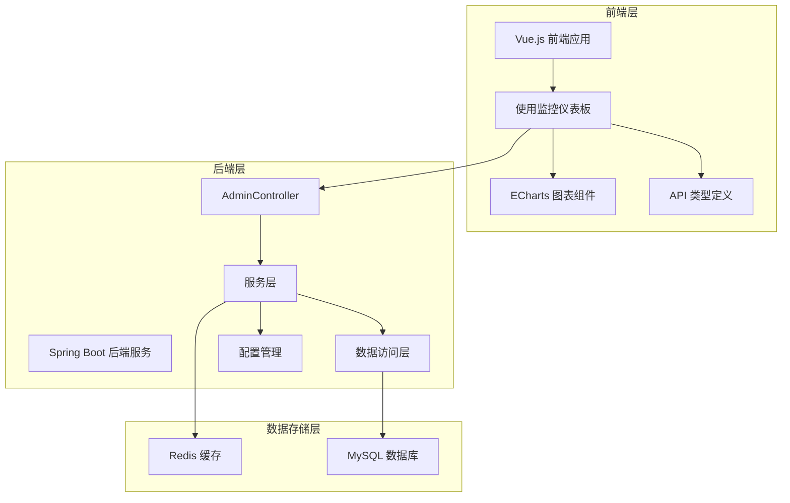
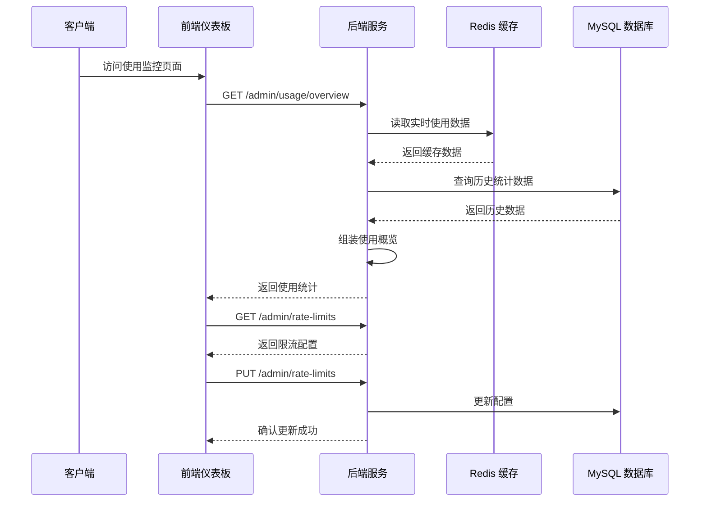
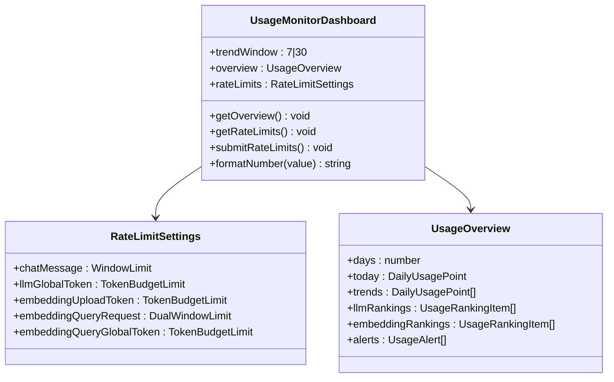
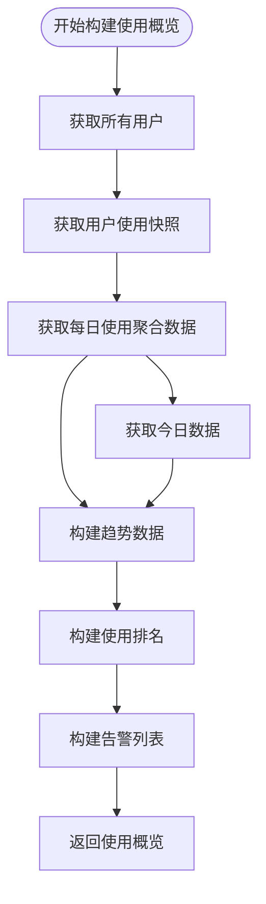
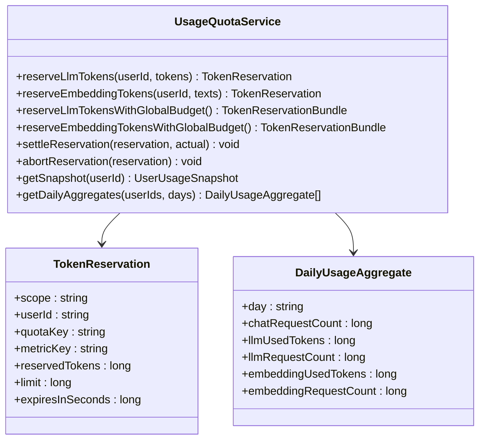
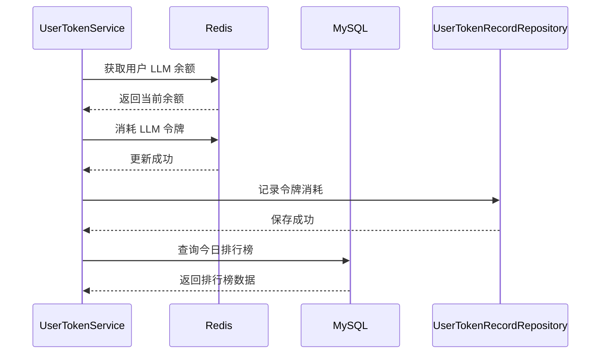
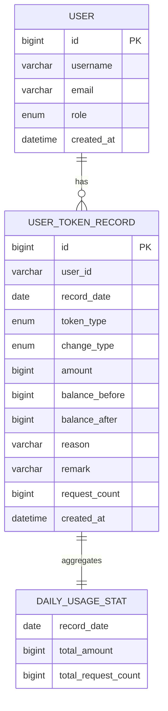
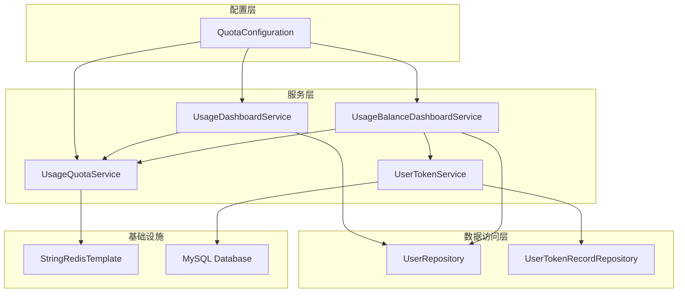

# Usage Monitoring Dashboard

<cite>
**本文档引用的文件**
- [frontend/src/views/usage-monitor/index.vue](file://frontend/src/views/usage-monitor/index.vue)
- [src/main/java/com/yizhaoqi/smartpai/service/UsageDashboardService.java](file://src/main/java/com/yizhaoqi/smartpai/service/UsageDashboardService.java)
- [src/main/java/com/yizhaoqi/smartpai/service/UsageBalanceDashboardService.java](file://src/main/java/com/yizhaoqi/smartpai/service/UsageBalanceDashboardService.java)
- [src/main/java/com/yizhaoqi/smartpai/service/UsageQuotaService.java](file://src/main/java/com/yizhaoqi/smartpai/service/UsageQuotaService.java)
- [src/main/java/com/yizhaoqi/smartpai/service/UserTokenService.java](file://src/main/java/com/yizhaoqi/smartpai/service/UserTokenService.java)
- [src/main/java/com/yizhaoqi/smartpai/config/QuotaConfiguration.java](file://src/main/java/com/yizhaoqi/smartpai/config/QuotaConfiguration.java)
- [src/main/java/com/yizhaoqi/smartpai/model/UserTokenRecord.java](file://src/main/java/com/yizhaoqi/smartpai/model/UserTokenRecord.java)
- [src/main/java/com/yizhaoqi/smartpai/repository/UserTokenRecordRepository.java](file://src/main/java/com/yizhaoqi/smartpai/repository/UserTokenRecordRepository.java)
- [frontend/src/typings/api.d.ts](file://frontend/src/typings/api.d.ts)
- [src/main/resources/application.yml](file://src/main/resources/application.yml)
</cite>

## 目录
1. [简介](#简介)
2. [项目结构](#项目结构)
3. [核心组件](#核心组件)
4. [架构概览](#架构概览)
5. [详细组件分析](#详细组件分析)
6. [依赖关系分析](#依赖关系分析)
7. [性能考虑](#性能考虑)
8. [故障排除指南](#故障排除指南)
9. [结论](#结论)

## 简介

Usage Monitoring Dashboard 是 PaiSmart 项目中的一个关键监控功能模块，负责提供系统的使用情况监控、限额管理和告警功能。该仪表板为管理员提供了全面的系统使用洞察，包括实时用量统计、趋势分析、用户行为监控和系统健康状态。

该功能实现了两种不同的配额管理模式：
- **传统配额模式**：基于每日重置的令牌配额系统
- **余额消费模式**：基于用户令牌余额的消费跟踪系统

## 项目结构

Usage Monitoring Dashboard 采用前后端分离的架构设计，主要由以下组件构成：

**图表来源**
- [frontend/src/views/usage-monitor/index.vue:1-556](file://frontend/src/views/usage-monitor/index.vue#L1-L556)
- [src/main/java/com/yizhaoqi/smartpai/service/UsageDashboardService.java:1-193](file://src/main/java/com/yizhaoqi/smartpai/service/UsageDashboardService.java#L1-L193)

**章节来源**
- [frontend/src/views/usage-monitor/index.vue:1-556](file://frontend/src/views/usage-monitor/index.vue#L1-L556)
- [src/main/java/com/yizhaoqi/smartpai/service/UsageDashboardService.java:1-193](file://src/main/java/com/yizhaoqi/smartpai/service/UsageDashboardService.java#L1-L193)

## 核心组件

### 前端组件

前端使用 Vue.js 和 TypeScript 构建，主要包含以下核心组件：

1. **使用监控仪表板** (`index.vue`)
   - 实时展示系统使用情况
   - 支持 7 天和 30 天时间范围切换
   - 提供交互式图表展示

2. **限流配置管理**
   - 聊天消息限流配置
   - LLM 全局令牌预算
   - Embedding 上传/查询限流

3. **图表可视化**
   - ECharts 集成
   - 多维度数据展示
   - 响应式布局设计

### 后端服务组件

后端采用分层架构，主要服务组件包括：

1. **UsageDashboardService** - 基础使用情况统计服务
2. **UsageBalanceDashboardService** - 余额模式专用服务
3. **UsageQuotaService** - 配额管理核心服务
4. **UserTokenService** - 用户令牌管理服务

**章节来源**
- [frontend/src/views/usage-monitor/index.vue:1-556](file://frontend/src/views/usage-monitor/index.vue#L1-L556)
- [src/main/java/com/yizhaoqi/smartpai/service/UsageDashboardService.java:1-193](file://src/main/java/com/yizhaoqi/smartpai/service/UsageDashboardService.java#L1-L193)
- [src/main/java/com/yizhaoqi/smartpai/service/UsageBalanceDashboardService.java:1-131](file://src/main/java/com/yizhaoqi/smartpai/service/UsageBalanceDashboardService.java#L1-L131)

## 架构概览

Usage Monitoring Dashboard 采用了现代化的微服务架构，结合了缓存优化和数据库持久化的优势：

**图表来源**
- [frontend/src/views/usage-monitor/index.vue:14-125](file://frontend/src/views/usage-monitor/index.vue#L14-L125)
- [src/main/java/com/yizhaoqi/smartpai/service/UsageDashboardService.java:21-67](file://src/main/java/com/yizhaoqi/smartpai/service/UsageDashboardService.java#L21-L67)

## 详细组件分析

### 前端仪表板组件

前端仪表板采用响应式设计，提供了丰富的可视化功能：

#### 使用概览卡片
- **今日聊天消息**：显示通过限流的聊天消息数量
- **今日 LLM Tokens**：显示 LLM 生成使用的 Token 数量和请求次数
- **今日 Embedding Tokens**：显示 Embedding 向量化的 Token 数量和请求次数
- **高风险用户**：显示额度耗尽的用户数量
- **总告警数**：显示所有告警的总数

#### 趋势图表分析
使用 ECharts 实现多维度数据可视化：
- LLM Tokens 使用趋势（折线图）
- Embedding Tokens 使用趋势（折线图）
- Chat Messages 请求量（柱状图）
- LLM Requests 请求量（柱状图）
- Embedding Requests 请求量（柱状图）

#### 限流配置管理
支持多种限流策略配置：
- **聊天消息限流**：设置每分钟消息数量上限
- **LLM 全局令牌预算**：设置分钟和日级别的令牌使用限制
- **Embedding 上传令牌预算**：设置上传操作的令牌使用限制
- **Embedding 查询**：设置查询操作的双窗口限流（分钟和日）

**图表来源**
- [frontend/src/views/usage-monitor/index.vue:1-556](file://frontend/src/views/usage-monitor/index.vue#L1-L556)
- [frontend/src/typings/api.d.ts:221-320](file://frontend/src/typings/api.d.ts#L221-L320)

**章节来源**
- [frontend/src/views/usage-monitor/index.vue:1-556](file://frontend/src/views/usage-monitor/index.vue#L1-L556)
- [frontend/src/typings/api.d.ts:221-320](file://frontend/src/typings/api.d.ts#L221-L320)

### 后端服务组件

#### UsageDashboardService - 基础使用统计服务

该服务负责收集和处理系统使用数据，提供基础的使用情况概览：

**图表来源**
- [src/main/java/com/yizhaoqi/smartpai/service/UsageDashboardService.java:21-67](file://src/main/java/com/yizhaoqi/smartpai/service/UsageDashboardService.java#L21-L67)

#### UsageQuotaService - 配额管理核心服务

该服务实现了复杂的配额管理系统，支持多种限流策略：

**图表来源**
- [src/main/java/com/yizhaoqi/smartpai/service/UsageQuotaService.java:40-535](file://src/main/java/com/yizhaoqi/smartpai/service/UsageQuotaService.java#L40-L535)

#### UserTokenService - 用户令牌管理服务

该服务专门处理基于余额的令牌消费模式：

**图表来源**
- [src/main/java/com/yizhaoqi/smartpai/service/UserTokenService.java:124-169](file://src/main/java/com/yizhaoqi/smartpai/service/UserTokenService.java#L124-L169)

**章节来源**
- [src/main/java/com/yizhaoqi/smartpai/service/UsageDashboardService.java:1-193](file://src/main/java/com/yizhaoqi/smartpai/service/UsageDashboardService.java#L1-L193)
- [src/main/java/com/yizhaoqi/smartpai/service/UsageQuotaService.java:1-535](file://src/main/java/com/yizhaoqi/smartpai/service/UsageQuotaService.java#L1-L535)
- [src/main/java/com/yizhaoqi/smartpai/service/UserTokenService.java:1-457](file://src/main/java/com/yizhaoqi/smartpai/service/UserTokenService.java#L1-L457)

### 数据模型设计

系统使用了精心设计的数据模型来支持复杂的监控需求：

**图表来源**
- [src/main/java/com/yizhaoqi/smartpai/model/UserTokenRecord.java:1-111](file://src/main/java/com/yizhaoqi/smartpai/model/UserTokenRecord.java#L1-L111)
- [src/main/java/com/yizhaoqi/smartpai/repository/UserTokenRecordRepository.java:1-58](file://src/main/java/com/yizhaoqi/smartpai/repository/UserTokenRecordRepository.java#L1-L58)

**章节来源**
- [src/main/java/com/yizhaoqi/smartpai/model/UserTokenRecord.java:1-111](file://src/main/java/com/yizhaoqi/smartpai/model/UserTokenRecord.java#L1-L111)
- [src/main/java/com/yizhaoqi/smartpai/repository/UserTokenRecordRepository.java:1-58](file://src/main/java/com/yizhaoqi/smartpai/repository/UserTokenRecordRepository.java#L1-L58)

## 依赖关系分析

系统采用了模块化的依赖管理，确保各个组件之间的松耦合：

**图表来源**
- [src/main/java/com/yizhaoqi/smartpai/config/QuotaConfiguration.java:1-59](file://src/main/java/com/yizhaoqi/smartpai/config/QuotaConfiguration.java#L1-L59)

### 关键依赖特性

1. **条件配置**：根据配置动态选择使用哪种配额模式
2. **服务继承**：余额模式服务继承基础服务，扩展特定功能
3. **缓存优化**：大量使用 Redis 缓存提升查询性能
4. **数据库持久化**：重要的统计数据持久化到 MySQL

**章节来源**
- [src/main/java/com/yizhaoqi/smartpai/config/QuotaConfiguration.java:1-59](file://src/main/java/com/yizhaoqi/smartpai/config/QuotaConfiguration.java#L1-L59)

## 性能考虑

### 缓存策略

系统采用了多层次的缓存策略来优化性能：

1. **Redis 缓存**：存储实时使用数据和配额信息
2. **数据库索引**：为高频查询建立合适的索引
3. **数据聚合**：减少重复计算和数据库查询

### 查询优化

针对大数据量场景，系统实现了以下优化措施：

1. **分页查询**：排行榜和历史数据采用分页处理
2. **条件过滤**：只查询活跃用户和有效数据
3. **批量操作**：用户快照采用批量获取方式

### 内存管理

系统特别注意内存使用效率：

1. **用户快照优化**：基础服务中存在 OOM 风险警告
2. **数据结构优化**：使用高效的集合和映射结构
3. **资源清理**：及时释放不再使用的资源

## 故障排除指南

### 常见问题及解决方案

#### 1. 仪表板数据不更新
- **检查 Redis 连接**：确认 Redis 服务正常运行
- **验证缓存键**：检查配额和使用数据的缓存键
- **查看日志**：检查后端服务的日志输出

#### 2. 限流配置不生效
- **确认配置加载**：检查配置文件是否正确加载
- **验证权限**：确认管理员权限验证通过
- **检查数据库**：确认配置已正确保存到数据库

#### 3. 性能问题
- **监控 Redis**：检查 Redis 内存使用情况
- **分析查询**：使用慢查询日志分析数据库性能
- **调整缓存**：优化缓存策略和过期时间

#### 4. 数据不一致
- **检查事务**：确认关键操作的事务完整性
- **验证幂等性**：确保操作的幂等性设计
- **数据同步**：检查缓存和数据库的数据同步

**章节来源**
- [src/main/java/com/yizhaoqi/smartpai/service/UsageQuotaService.java:303-343](file://src/main/java/com/yizhaoqi/smartpai/service/UsageQuotaService.java#L303-L343)
- [src/main/java/com/yizhaoqi/smartpai/service/UserTokenService.java:329-361](file://src/main/java/com/yizhaoqi/smartpai/service/UserTokenService.java#L329-L361)

## 结论

Usage Monitoring Dashboard 是一个功能完整、架构清晰的监控系统。它成功地结合了前端可视化技术和后端高性能服务，为系统管理员提供了强大的监控和管理能力。

### 主要优势

1. **双模式支持**：同时支持传统配额模式和余额消费模式
2. **实时监控**：通过 Redis 缓存实现实时数据展示
3. **灵活配置**：支持细粒度的限流和配额配置
4. **可视化强**：提供直观的图表和仪表板界面
5. **性能优化**：采用多种技术手段优化系统性能

### 技术亮点

1. **模块化设计**：清晰的分层架构和职责分离
2. **缓存优化**：合理的缓存策略提升系统响应速度
3. **数据持久化**：重要数据的可靠存储和备份
4. **错误处理**：完善的异常处理和故障恢复机制

该系统为 PaiSmart 项目提供了坚实的监控基础，能够有效帮助管理员了解系统使用状况，及时发现和解决问题，确保系统的稳定运行。