# 前端架构

<cite>
**本文档引用的文件**  
- [main.ts](file://frontend/src/main.ts#L1-L34)
- [App.vue](file://frontend/src/App.vue#L1-L59)
- [index.ts](file://frontend/src/store/index.ts#L1-L13)
- [index.ts](file://frontend/src/router/index.ts#L1-L31)
- [auth.ts](file://frontend/src/hooks/business/auth.ts#L1-L22)
- [index.ts](file://frontend/src/service/request/index.ts#L1-L155)
- [settings.ts](file://frontend/src/theme/settings.ts#L1-L50)
- [table-header-operation.vue](file://frontend/src/components/advanced/table-header-operation.vue#L1-L76)
- [use-request.ts](file://frontend/packages/hooks/src/use-request.ts#L1-L78)
</cite>

## 目录
1. [简介](#简介)
2. [项目结构](#项目结构)
3. [核心组件](#核心组件)
4. [架构概览](#架构概览)
5. [详细组件分析](#详细组件分析)
6. [依赖分析](#依赖分析)
7. [性能考虑](#性能考虑)
8. [故障排除指南](#故障排除指南)
9. [结论](#结论)

## 简介
本文档深入分析了PaiSmart项目的前端架构，重点介绍Vue 3组合式API、Pinia状态管理、Vue Router路由系统和UnoCSS原子化CSS方案的集成与应用。文档详细说明了项目目录结构的组织逻辑，解释了主题系统、国际化（i18n）、权限控制和请求封装的实现方式，并通过实际组件展示了UI架构设计思想。

## 项目结构
PaiSmart前端项目采用模块化分层架构，主要分为`components`（组件）、`views`（视图）、`store`（状态管理）、`router`（路由）、`hooks`（组合式函数）、`service`（服务层）等核心目录。项目使用Vite作为构建工具，通过`vite.config.ts`进行配置，并利用`pnpm`进行包管理。

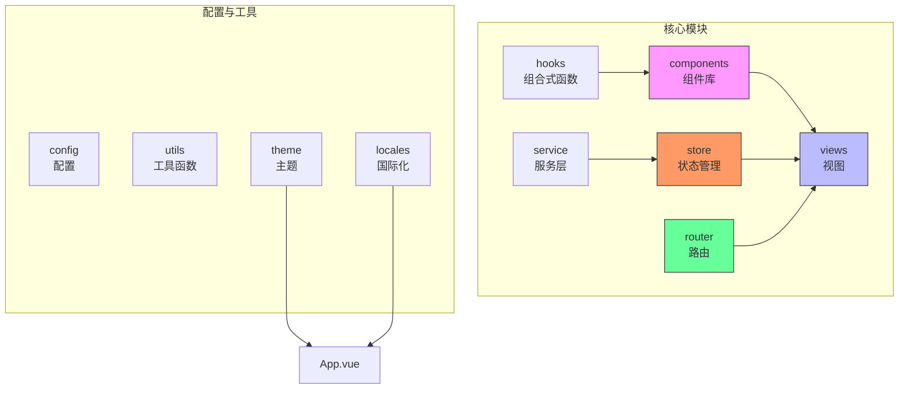

**图示来源**  
- [frontend/src](file://frontend/src)

**本节来源**  
- [frontend/src](file://frontend/src)

## 核心组件
项目的核心组件包括应用入口`main.ts`、根组件`App.vue`、状态管理`store/index.ts`和路由系统`router/index.ts`。这些文件共同构成了应用的初始化流程和基础架构。

**本节来源**  
- [main.ts](file://frontend/src/main.ts#L1-L34)
- [App.vue](file://frontend/src/App.vue#L1-L59)
- [index.ts](file://frontend/src/store/index.ts#L1-L13)
- [index.ts](file://frontend/src/router/index.ts#L1-L31)

## 架构概览
PaiSmart前端采用现代化的Vue 3技术栈，基于组合式API构建，使用Pinia进行状态管理，Vue Router进行路由控制，并通过UnoCSS实现原子化CSS样式管理。应用初始化流程清晰，各模块职责分明。

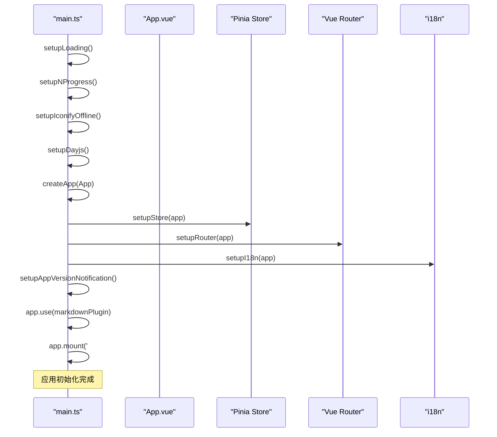

**图示来源**  
- [main.ts](file://frontend/src/main.ts#L1-L34)
- [App.vue](file://frontend/src/App.vue#L1-L59)

## 详细组件分析
### 应用初始化流程分析
应用的初始化流程在`main.ts`中定义，通过异步函数`setupApp()`按序执行各项配置。流程包括加载动画、进度条、图标离线加载、日期库配置等插件的初始化，然后依次设置状态管理、路由、国际化等核心功能。

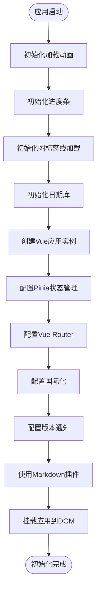

**图示来源**  
- [main.ts](file://frontend/src/main.ts#L1-L34)

**本节来源**  
- [main.ts](file://frontend/src/main.ts#L1-L34)

### 状态管理分析
项目使用Pinia作为状态管理解决方案，在`store/index.ts`中通过`setupStore`函数进行初始化。Pinia实例创建后，应用了`resetSetupStore`插件，用于在特定情况下重置状态。

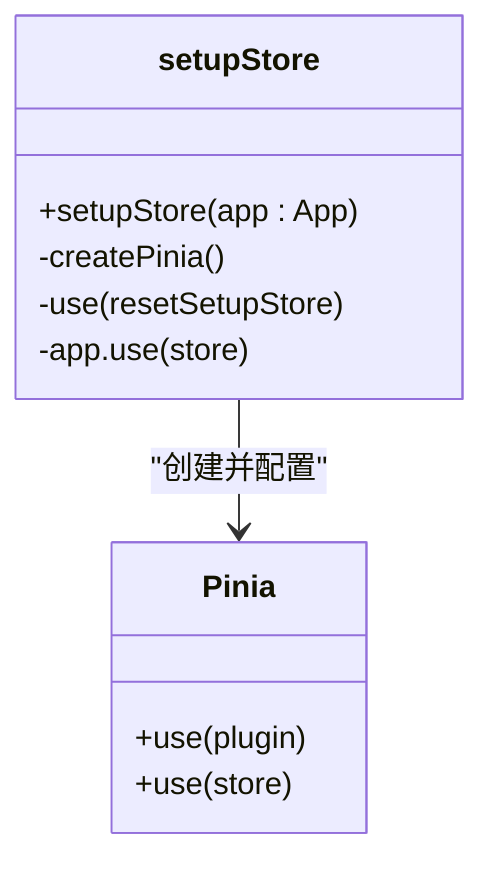

**图示来源**  
- [index.ts](file://frontend/src/store/index.ts#L1-L13)

**本节来源**  
- [index.ts](file://frontend/src/store/index.ts#L1-L13)

### 路由系统分析
路由系统在`router/index.ts`中配置，支持hash、history和memory三种模式，通过环境变量`VITE_ROUTER_HISTORY_MODE`进行切换。路由守卫`createRouterGuard`在路由初始化后被创建，用于处理路由跳转的逻辑。

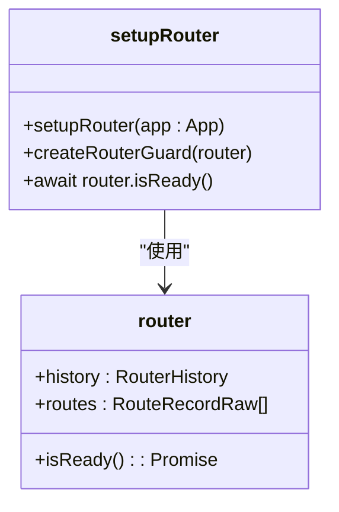

**图示来源**  
- [index.ts](file://frontend/src/router/index.ts#L1-L31)

**本节来源**  
- [index.ts](file://frontend/src/router/index.ts#L1-L31)

### 权限控制分析
权限控制通过`hooks/business/auth.ts`中的`useAuth`组合式函数实现。该函数使用`useAuthStore`获取认证状态，提供`hasAuth`方法检查用户权限，支持单个或多个权限码的验证。

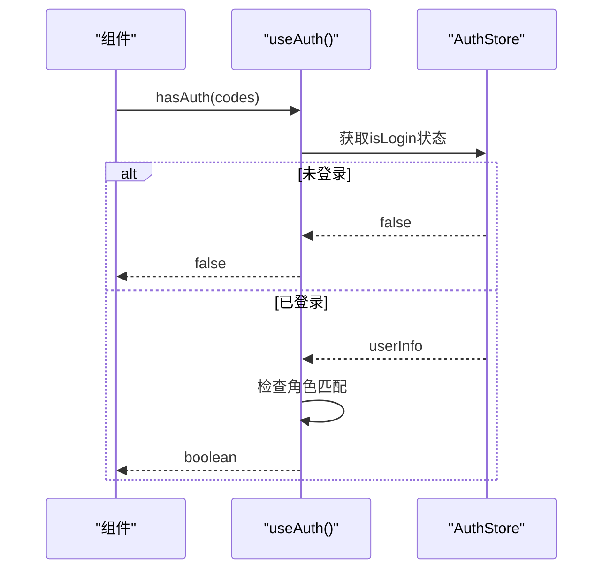

**图示来源**  
- [auth.ts](file://frontend/src/hooks/business/auth.ts#L1-L22)

**本节来源**  
- [auth.ts](file://frontend/src/hooks/business/auth.ts#L1-L22)

### 请求封装分析
请求封装在`service/request/index.ts`中实现，基于`@sa/axios`创建扁平化请求实例。封装了请求拦截器、响应处理、错误处理、token刷新等机制，提供了统一的API调用接口。

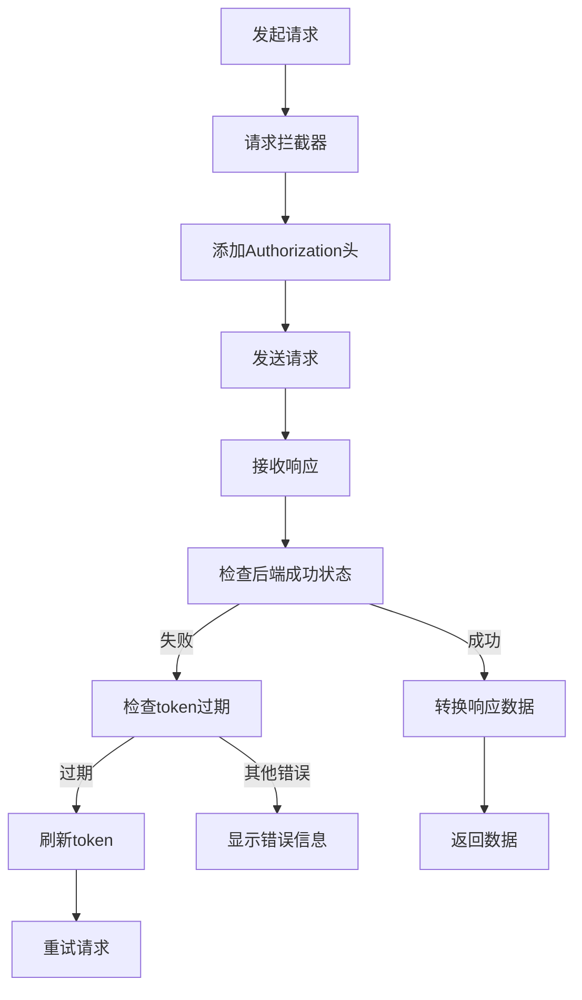

**图示来源**  
- [index.ts](file://frontend/src/service/request/index.ts#L1-L155)

**本节来源**  
- [index.ts](file://frontend/src/service/request/index.ts#L1-L155)

### 主题系统分析
主题系统在`theme/settings.ts`中定义，包含主题方案、颜色、布局、水印等配置。支持自动、亮色、暗色三种主题模式，可配置布局模式、页面动画、头部、标签页、侧边栏等UI元素。

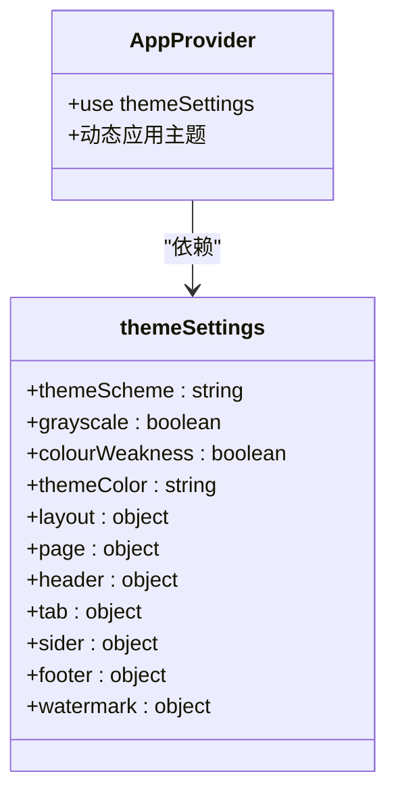

**图示来源**  
- [settings.ts](file://frontend/src/theme/settings.ts#L1-L50)

**本节来源**  
- [settings.ts](file://frontend/src/theme/settings.ts#L1-L50)

### UI组件分析
`components/advanced/table-header-operation.vue`是一个高级表格头部操作组件，提供添加、批量删除、刷新和列设置功能。组件使用插槽机制，支持自定义内容的灵活扩展。

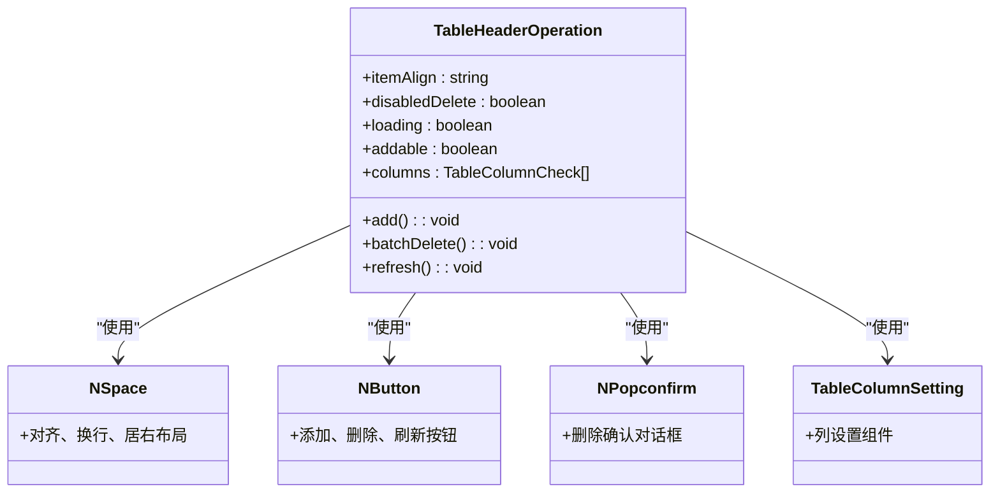

**图示来源**  
- [table-header-operation.vue](file://frontend/src/components/advanced/table-header-operation.vue#L1-L76)

**本节来源**  
- [table-header-operation.vue](file://frontend/src/components/advanced/table-header-operation.vue#L1-L76)

### 组合式API分析
`packages/hooks/src/use-request.ts`实现了基于组合式API的请求钩子，封装了加载状态、数据和错误的响应式引用，简化了组件中的异步数据获取逻辑。

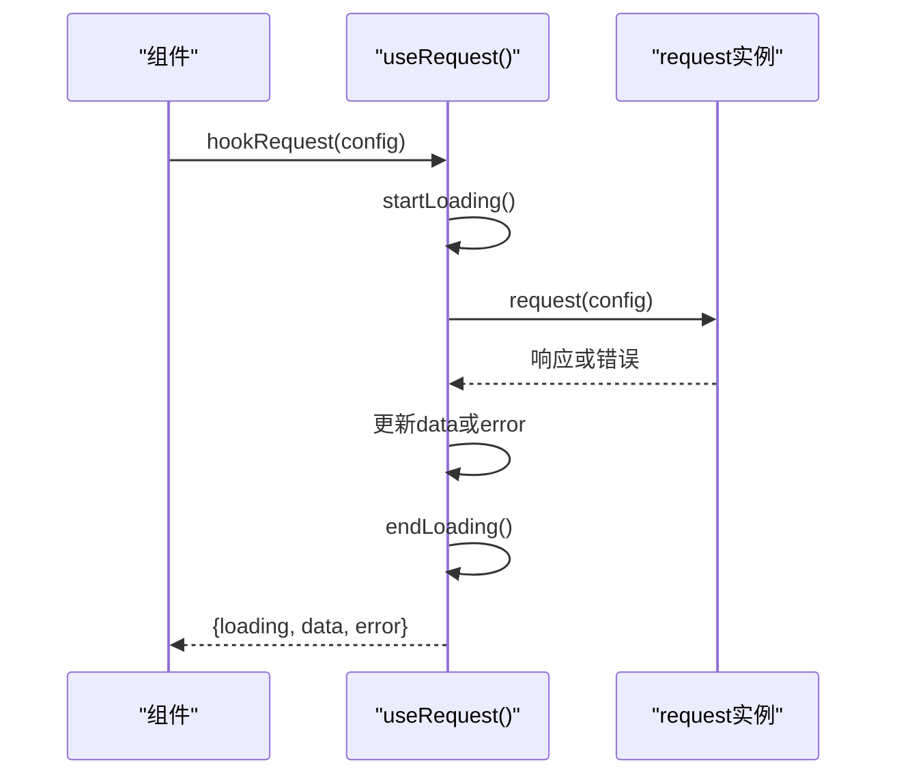

**图示来源**  
- [use-request.ts](file://frontend/packages/hooks/src/use-request.ts#L1-L78)

**本节来源**  
- [use-request.ts](file://frontend/packages/hooks/src/use-request.ts#L1-L78)

## 依赖分析
项目各模块之间存在清晰的依赖关系。`main.ts`作为入口文件，依赖`App.vue`、`store`、`router`、`locales`等核心模块。`App.vue`作为根组件，依赖`store`中的`appStore`和`themeStore`，以及`locales`中的国际化配置。

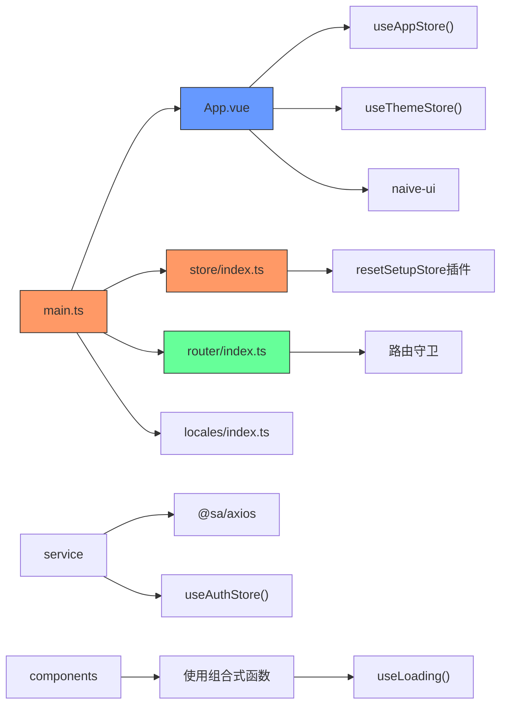

**图示来源**  
- [main.ts](file://frontend/src/main.ts#L1-L34)
- [App.vue](file://frontend/src/App.vue#L1-L59)
- [index.ts](file://frontend/src/store/index.ts#L1-L13)
- [index.ts](file://frontend/src/router/index.ts#L1-L31)

**本节来源**  
- [main.ts](file://frontend/src/main.ts#L1-L34)
- [App.vue](file://frontend/src/App.vue#L1-L59)
- [index.ts](file://frontend/src/store/index.ts#L1-L13)
- [index.ts](file://frontend/src/router/index.ts#L1-L31)

## 性能考虑
项目在性能优化方面采用了多种策略：使用懒加载减少初始加载时间，通过Pinia状态管理避免重复请求，利用UnoCSS原子化CSS减少样式文件体积，以及在请求封装中实现错误堆栈管理避免重复提示。

## 故障排除指南
常见问题包括：环境变量配置错误导致路由模式异常，API基础URL配置不正确，token过期处理逻辑异常等。建议检查`.env`文件中的配置，确保`VITE_BASE_URL`、`VITE_ROUTER_HISTORY_MODE`等环境变量正确设置。

**本节来源**  
- [main.ts](file://frontend/src/main.ts#L1-L34)
- [index.ts](file://frontend/src/router/index.ts#L1-L31)
- [index.ts](file://frontend/src/service/request/index.ts#L1-L155)

## 结论
PaiSmart前端架构设计合理，采用现代化的技术栈和模块化的组织方式，具有良好的可维护性和扩展性。通过深入分析各核心组件的实现，可以更好地理解项目的整体架构和设计思想，为后续开发和维护提供指导。