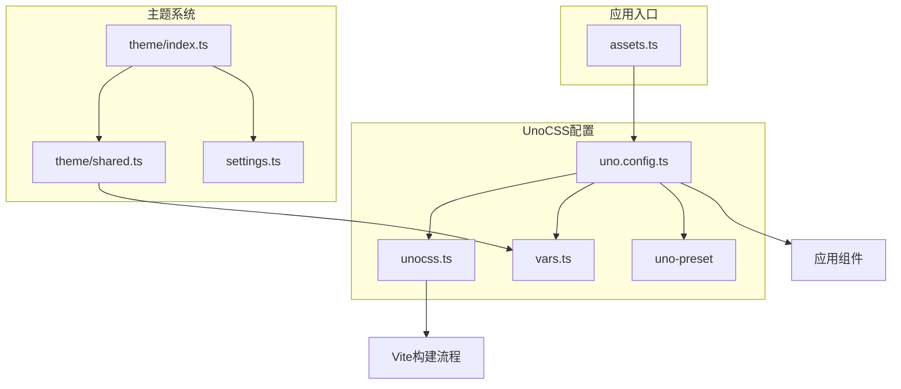
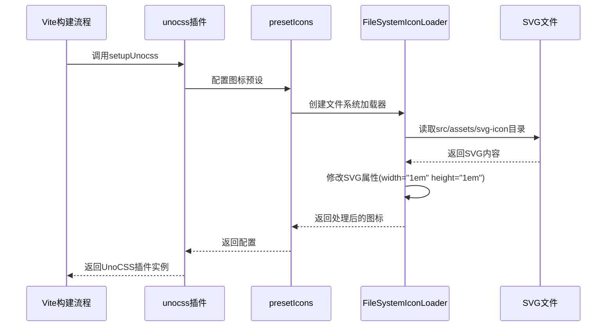

# UnoCSS集成方案

<cite>
**本文档引用的文件**
- [uno.config.ts](file://frontend/uno.config.ts)
- [unocss.ts](file://frontend/build/plugins/unocss.ts)
- [index.ts](file://frontend/packages/uno-preset/src/index.ts)
- [vars.ts](file://frontend/src/theme/vars.ts)
- [theme/index.ts](file://frontend/src/store/modules/theme/index.ts)
- [theme/shared.ts](file://frontend/src/store/modules/theme/shared.ts)
- [settings.ts](file://frontend/src/theme/settings.ts)
- [app.ts](file://frontend/src/constants/app.ts)
- [dark-mode-container.vue](file://frontend/src/components/common/dark-mode-container.vue)
- [assets.ts](file://frontend/src/plugins/assets.ts)
</cite>

## 目录
1. [项目结构](#项目结构)
2. [核心配置分析](#核心配置分析)
3. [自定义预设包解析](#自定义预设包解析)
4. [主题与设计Token管理](#主题与设计token管理)
5. [Vite集成机制](#vite集成机制)
6. [暗黑模式实现](#暗黑模式实现)
7. [图标集成方案](#图标集成方案)
8. [常见问题排查](#常见问题排查)

## 项目结构

项目采用模块化架构，UnoCSS相关配置分散在多个位置。核心配置位于项目根目录的`uno.config.ts`，Vite插件配置在`build/plugins/unocss.ts`，自定义预设包位于`packages/uno-preset`，主题变量定义在`src/theme/vars.ts`。



**图示来源**
- [uno.config.ts](file://frontend/uno.config.ts)
- [unocss.ts](file://frontend/build/plugins/unocss.ts)
- [vars.ts](file://frontend/src/theme/vars.ts)

## 核心配置分析

`uno.config.ts`文件定义了UnoCSS的核心配置，包括预设、主题、快捷方式和转换器。

```typescript
import { defineConfig } from '@unocss/vite';
import transformerDirectives from '@unocss/transformer-directives';
import transformerVariantGroup from '@unocss/transformer-variant-group';
import presetWind3 from '@unocss/preset-wind3';
import type { Theme } from '@unocss/preset-uno';
import { presetSoybeanAdmin } from '@sa/uno-preset';
import { themeVars } from './src/theme/vars';

export default defineConfig<Theme>({
  content: {
    pipeline: {
      exclude: ['node_modules', 'dist']
    }
  },
  theme: {
    ...themeVars,
    fontSize: {
      'icon-xs': '0.875rem',
      'icon-small': '1rem',
      icon: '1.125rem',
      'icon-large': '1.5rem',
      'icon-xl': '2rem'
    }
  },
  shortcuts: {
    'card-wrapper': 'rd-4 shadow-2xl dark:shadow-[0_25px_50px_-12px_rgba(27,27,27,0.1)]',
    'flex-cc': 'flex items-center justify-center'
  },
  transformers: [transformerDirectives(), transformerVariantGroup()],
  presets: [presetWind3({ dark: 'class' }), presetSoybeanAdmin()]
});
```

配置要点：
- **预设(presets)**：使用`presetWind3`提供Wind CSS风格的原子类，并配置`dark: 'class'`启用基于类名的暗黑模式
- **主题(theme)**：通过扩展`themeVars`引入项目自定义主题变量
- **快捷方式(shortcuts)**：定义`card-wrapper`和`flex-cc`等复合类快捷方式
- **转换器(transformers)**：启用指令转换器和变体组转换器

**本节来源**
- [uno.config.ts](file://frontend/uno.config.ts)

## 自定义预设包解析

`packages/uno-preset/src/index.ts`文件定义了自定义预设`presetSoybeanAdmin`，扩展了设计系统。

```typescript
export function presetSoybeanAdmin(): Preset<Theme> {
  const preset: Preset<Theme> = {
    name: 'preset-soybean-admin',
    shortcuts: [
      {
        'flex-center': 'flex justify-center items-center',
        'flex-x-center': 'flex justify-center',
        'flex-y-center': 'flex items-center',
        'flex-col': 'flex flex-col',
        'flex-col-center': 'flex-center flex-col',
        'flex-col-stretch': 'flex-col items-stretch',
        'i-flex-center': 'inline-flex justify-center items-center',
        'i-flex-x-center': 'inline-flex justify-center',
        'i-flex-y-center': 'inline-flex items-center',
        'i-flex-col': 'flex-col inline-flex',
        'i-flex-col-center': 'flex-col i-flex-center',
        'i-flex-col-stretch': 'i-flex-col items-stretch',
        'flex-1-hidden': 'flex-1 overflow-hidden'
      },
      {
        'absolute-lt': 'absolute left-0 top-0',
        'absolute-lb': 'absolute left-0 bottom-0',
        'absolute-rt': 'absolute right-0 top-0',
        'absolute-rb': 'absolute right-0 bottom-0',
        'absolute-center': 'absolute-lt flex-center size-full',
        'fixed-lt': 'fixed left-0 top-0',
        'fixed-lb': 'fixed left-0 bottom-0',
        'fixed-rt': 'fixed right-0 top-0',
        'fixed-rb': 'fixed right-0 bottom-0',
        'fixed-center': 'fixed-lt flex-center size-full'
      },
      {
        'nowrap-hidden': 'overflow-hidden whitespace-nowrap',
        'ellipsis-text': 'nowrap-hidden text-ellipsis'
      }
    ]
  };

  return preset;
}
```

该预设包提供了三类快捷方式：
- **布局类**：如`flex-center`、`flex-col-center`等，简化Flex布局代码
- **定位类**：如`absolute-lt`、`fixed-center`等，简化绝对和固定定位
- **文本类**：如`nowrap-hidden`、`ellipsis-text`等，处理文本溢出

这些快捷方式实现了设计Token的统一管理，确保UI组件在不同场景下的一致性。

**本节来源**
- [index.ts](file://frontend/packages/uno-preset/src/index.ts)

## 主题与设计Token管理

主题变量通过`src/theme/vars.ts`文件定义，并在UnoCSS配置中引用。

```typescript
function createColorPaletteVars() {
  const colors: App.Theme.ThemeColorKey[] = ['primary', 'info', 'success', 'warning', 'error'];
  const colorPaletteNumbers: App.Theme.ColorPaletteNumber[] = [50, 100, 200, 300, 400, 500, 600, 700, 800, 900, 950];

  const colorPaletteVar = {} as App.Theme.ThemePaletteColor;

  colors.forEach(color => {
    colorPaletteVar[color] = `rgb(var(--${color}-color))`;
    colorPaletteNumbers.forEach(number => {
      colorPaletteVar[`${color}-${number}`] = `rgb(var(--${color}-${number}-color))`;
    });
  });

  return colorPaletteVar;
}

const colorPaletteVars = createColorPaletteVars();

export const themeVars: App.Theme.ThemeTokenCSSVars = {
  colors: {
    ...colorPaletteVars,
    nprogress: 'rgb(var(--nprogress-color))',
    container: 'rgb(var(--container-bg-color))',
    layout: 'rgb(var(--layout-bg-color))',
    inverted: 'rgb(var(--inverted-bg-color))',
    'base-text': 'rgb(var(--base-text-color))'
  },
  boxShadow: {
    header: 'var(--header-box-shadow)',
    sider: 'var(--sider-box-shadow)',
    tab: 'var(--tab-box-shadow)'
  }
};
```

主题变量管理流程：
1. 创建颜色调色板变量，将CSS变量转换为UnoCSS可识别的格式
2. 定义包含颜色和阴影的主题变量对象
3. 在`uno.config.ts`中通过扩展运算符`...themeVars`引入

这种设计实现了设计系统与样式系统的解耦，主题变量可以在运行时动态更新。

**本节来源**
- [vars.ts](file://frontend/src/theme/vars.ts)

## Vite集成机制

UnoCSS通过Vite插件在构建流程中集成，配置位于`build/plugins/unocss.ts`。

```typescript
export function setupUnocss(viteEnv: Env.ImportMeta) {
  const { VITE_ICON_PREFIX, VITE_ICON_LOCAL_PREFIX } = viteEnv;

  const localIconPath = path.join(process.cwd(), 'src/assets/svg-icon');

  /** The name of the local icon collection */
  const collectionName = VITE_ICON_LOCAL_PREFIX.replace(`${VITE_ICON_PREFIX}-`, '');

  return unocss({
    presets: [
      presetIcons({
        prefix: `${VITE_ICON_PREFIX}-`,
        scale: 1,
        extraProperties: {
          display: 'inline-block'
        },
        collections: {
          [collectionName]: FileSystemIconLoader(localIconPath, svg =>
            svg.replace(/^<svg\s/, '<svg width="1em" height="1em" ')
          )
        },
        warn: true
      })
    ]
  });
}
```

集成流程：
1. 在`build/plugins/index.ts`中调用`setupUnocss`函数
2. 插件返回UnoCSS Vite插件实例
3. 配置`presetIcons`处理图标
4. 使用`FileSystemIconLoader`从本地文件系统加载SVG图标
5. 修改SVG属性，设置默认宽高为`1em`



**图示来源**
- [unocss.ts](file://frontend/build/plugins/unocss.ts)
- [index.ts](file://frontend/build/plugins/index.ts)

**本节来源**
- [unocss.ts](file://frontend/build/plugins/unocss.ts)

## 暗黑模式实现

暗黑模式通过CSS类名切换实现，核心逻辑在主题状态管理模块。

```typescript
// src/constants/app.ts
export const DARK_CLASS = 'dark';

// uno.config.ts
presets: [presetWind3({ dark: 'class' }), presetSoybeanAdmin()]

// src/store/modules/theme/shared.ts
export function toggleCssDarkMode(darkMode = false) {
  const { add, remove } = toggleHtmlClass(DARK_CLASS);

  if (darkMode) {
    add();
  } else {
    remove();
  }
}
```

实现机制：
1. UnoCSS配置`dark: 'class'`指定使用类名`dark`作为暗黑模式标识
2. 当用户切换主题时，`toggleCssDarkMode`函数向`html`元素添加或移除`dark`类
3. UnoCSS的`dark:`变体根据`html`元素上是否存在`dark`类来应用相应的样式

```mermaid
flowchart TD
A[用户操作] --> B{主题模式}
B --> |自动| C[系统偏好]
B --> |亮色| D[toggleCssDarkMode(false)]
B --> |暗色| E[toggleCssDarkMode(true)]
C --> F[usePreferredColorScheme]
F --> G[返回系统主题]
G --> H{系统主题}
H --> |暗色| E
H --> |亮色| D
D --> I[移除html的dark类]
E --> J[添加html的dark类]
I --> K[UnoCSS应用亮色样式]
J --> L[UnoCSS应用暗色样式]
```

**图示来源**
- [app.ts](file://frontend/src/constants/app.ts)
- [uno.config.ts](file://frontend/uno.config.ts)
- [shared.ts](file://frontend/src/store/modules/theme/shared.ts)

**本节来源**
- [theme/index.ts](file://frontend/src/store/modules/theme/index.ts)
- [theme/shared.ts](file://frontend/src/store/modules/theme/shared.ts)
- [app.ts](file://frontend/src/constants/app.ts)

## 图标集成方案

项目通过`preset-icons`实现图标集成，支持Iconify图标库和本地SVG图标。

```typescript
// build/plugins/unocss.ts
presets: [
  presetIcons({
    prefix: `${VITE_ICON_PREFIX}-`,
    scale: 1,
    extraProperties: {
      display: 'inline-block'
    },
    collections: {
      [collectionName]: FileSystemIconLoader(localIconPath, svg =>
        svg.replace(/^<svg\s/, '<svg width="1em" height="1em" ')
      )
    },
    warn: true
  })
]

// src/plugins/assets.ts
import 'virtual:svg-icons-register';
```

集成要点：
- 使用`virtual:svg-icons-register`虚拟模块注册所有SVG图标
- 配置`FileSystemIconLoader`从`src/assets/svg-icon`目录加载本地SVG
- 为SVG图标设置默认宽高为`1em`，确保与文本大小一致
- 通过`prefix`配置图标类名前缀

使用示例：
```html
<!-- 使用本地图标 -->
<div class="i-local-icon-name"></div>

<!-- 使用Iconify图标 -->
<div class="i-mdi-home"></div>
```

**本节来源**
- [unocss.ts](file://frontend/build/plugins/unocss.ts)
- [assets.ts](file://frontend/src/plugins/assets.ts)

## 常见问题排查

### 样式未生成
**问题**：在模板中使用了UnoCSS类名，但样式未生效。

**解决方案**：
1. 检查`uno.config.ts`中的`content`配置，确保包含相关文件路径
2. 确认类名拼写正确，UnoCSS对大小写敏感
3. 检查是否在`content.pipeline.exclude`中错误排除了相关文件

### HMR失效
**问题**：修改样式后，热更新未生效。

**解决方案**：
1. 检查Vite插件配置，确保`unocss`插件正确注册
2. 确认`vite.config.ts`中导入了`uno.config.ts`
3. 检查是否有语法错误导致插件初始化失败

### 图标不显示
**问题**：图标类名已正确使用，但图标未显示。

**解决方案**：
1. 检查`src/assets/svg-icon`目录是否存在且包含SVG文件
2. 确认`VITE_ICON_PREFIX`环境变量配置正确
3. 检查浏览器控制台是否有加载错误

### 暗黑模式不生效
**问题**：切换暗黑模式，但样式未变化。

**解决方案**：
1. 检查`uno.config.ts`中`presetWind3`的`dark`配置是否为`'class'`
2. 确认`html`元素上正确添加了`dark`类
3. 检查主题变量中是否有`dark:`前缀的样式定义

**本节来源**
- [uno.config.ts](file://frontend/uno.config.ts)
- [unocss.ts](file://frontend/build/plugins/unocss.ts)
- [shared.ts](file://frontend/src/store/modules/theme/shared.ts)