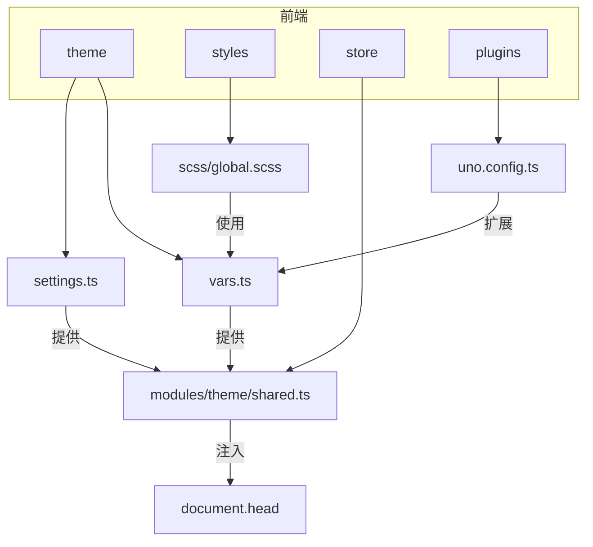
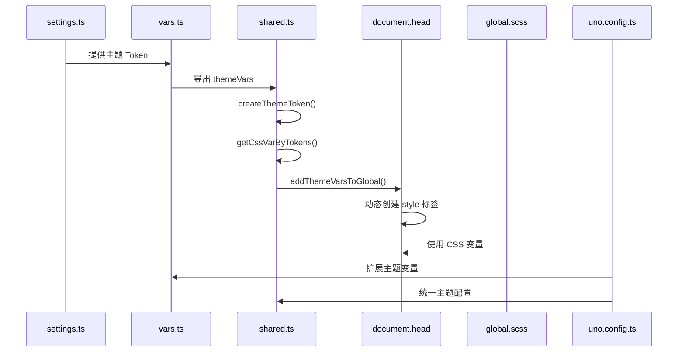
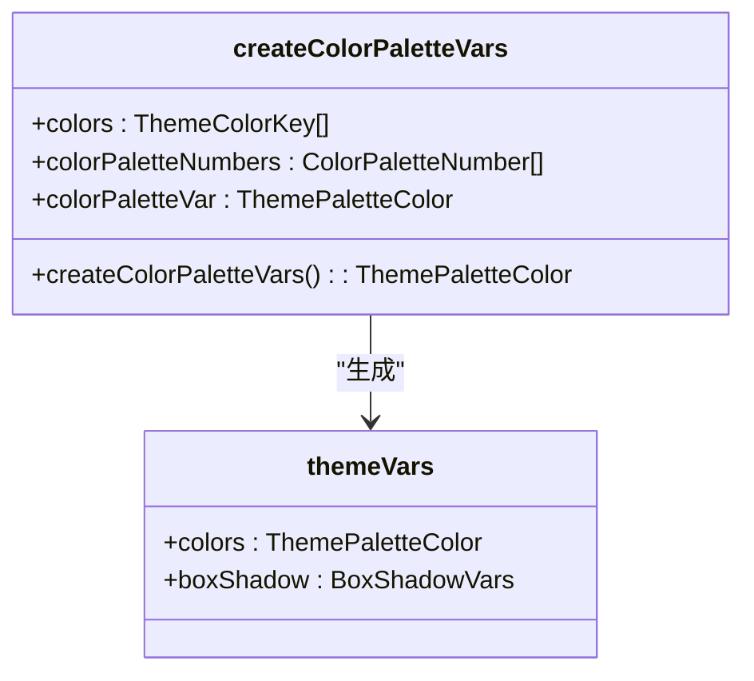
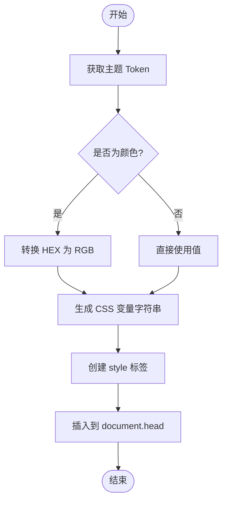
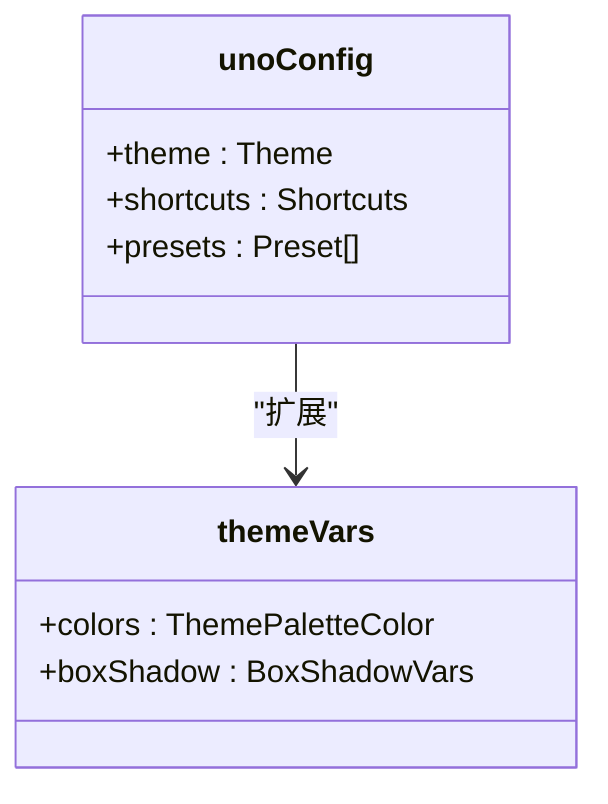
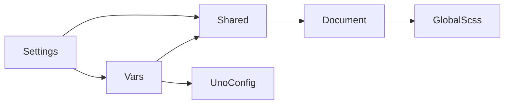

# CSS变量集成

<cite>
**本文档引用的文件**  
- [vars.ts](file://frontend/src/theme/vars.ts)
- [global.scss](file://frontend/src/styles/scss/global.scss)
- [shared.ts](file://frontend/src/store/modules/theme/shared.ts)
- [settings.ts](file://frontend/src/theme/settings.ts)
- [uno.config.ts](file://frontend/uno.config.ts)
</cite>

## 目录
1. [引言](#引言)
2. [项目结构](#项目结构)
3. [核心组件](#核心组件)
4. [架构概览](#架构概览)
5. [详细组件分析](#详细组件分析)
6. [依赖分析](#依赖分析)
7. [性能考量](#性能考量)
8. [故障排除指南](#故障排除指南)
9. [结论](#结论)

## 引言
本文档详细说明了 `vars.ts` 文件如何将设计 Token 编译为 CSS 自定义属性（CSS Variables），并全局注入到应用中。同时分析了 `global.scss` 如何引入并使用这些 CSS 变量进行样式定义，特别是在 SCSS 混合宏和 UnoCSS 指令中的统一调用模式。此外，还阐述了 CSS 变量在运行时动态更新的优势，以及如何确保主题变量在所有组件和第三方库中的一致性渲染。

## 专案结构
该专案采用模块化设计，前端部分位于 `frontend` 目录下，主要包含构建配置、插件、包管理及源代码。主题相关的配置和变量定义集中在 `frontend/src/theme` 目录中，而样式文件则存放在 `frontend/src/styles` 目录下。

**图示来源**
- [vars.ts](file://frontend/src/theme/vars.ts)
- [global.scss](file://frontend/src/styles/scss/global.scss)
- [shared.ts](file://frontend/src/store/modules/theme/shared.ts)
- [settings.ts](file://frontend/src/theme/settings.ts)
- [uno.config.ts](file://frontend/uno.config.ts)

## 核心组件
`vars.ts` 是主题变量的核心定义文件，负责将设计 Token 转换为 CSS 自定义属性。`global.scss` 则是全局样式的入口文件，通过 SCSS 的 `@forward` 机制引入滚动条样式。

**章节来源**
- [vars.ts](file://frontend/src/theme/vars.ts#L0-L34)
- [global.scss](file://frontend/src/styles/scss/global.scss#L0-L1)

## 架构概览
整个主题系统通过 `vars.ts` 定义基础变量，`settings.ts` 提供默认配置，`shared.ts` 中的 `addThemeVarsToGlobal` 函数将变量注入到 DOM 中，`global.scss` 使用这些变量定义全局样式，`uno.config.ts` 将变量扩展到 UnoCSS 主题中。

**图示来源**
- [vars.ts](file://frontend/src/theme/vars.ts)
- [shared.ts](file://frontend/src/store/modules/theme/shared.ts)
- [settings.ts](file://frontend/src/theme/settings.ts)
- [global.scss](file://frontend/src/styles/scss/global.scss)
- [uno.config.ts](file://frontend/uno.config.ts)

## 详细组件分析

### vars.ts 分析
`vars.ts` 文件定义了 `themeVars` 常量，该常量包含了颜色和阴影等设计 Token。通过 `createColorPaletteVars` 函数生成颜色调色板变量，每个颜色都有多个色阶（50 到 950），并转换为 `rgb(var(--color))` 格式。

**图示来源**
- [vars.ts](file://frontend/src/theme/vars.ts#L0-L34)

**章节来源**
- [vars.ts](file://frontend/src/theme/vars.ts#L0-L34)

### shared.ts 分析
`shared.ts` 文件中的 `addThemeVarsToGlobal` 函数负责将主题变量注入到全局。它通过 `getCssVarByTokens` 函数处理 Token，将 HEX 颜色转换为 RGB 格式，并生成 CSS 变量字符串，最终动态插入到 `document.head` 中。

**图示来源**
- [shared.ts](file://frontend/src/store/modules/theme/shared.ts#L88-L167)

**章节来源**
- [shared.ts](file://frontend/src/store/modules/theme/shared.ts#L88-L167)

### global.scss 分析
`global.scss` 文件通过 `@forward 'scrollbar';` 引入滚动条样式，虽然文件本身内容较少，但它作为全局样式入口，确保了滚动条样式的统一应用。

**章节来源**
- [global.scss](file://frontend/src/styles/scss/global.scss#L0-L1)

### uno.config.ts 分析
`uno.config.ts` 文件通过 `theme` 配置项扩展了 UnoCSS 的主题，将 `themeVars` 中定义的变量直接集成到 UnoCSS 中，使得可以在类名中直接使用这些变量。

**图示来源**
- [uno.config.ts](file://frontend/uno.config.ts#L0-L31)

**章节来源**
- [uno.config.ts](file://frontend/uno.config.ts#L0-L31)

## 依赖分析
主题系统各组件之间存在紧密的依赖关系。`vars.ts` 依赖 `settings.ts` 提供的 Token，`shared.ts` 依赖 `vars.ts` 和 `settings.ts` 进行变量处理和注入，`global.scss` 依赖注入的 CSS 变量，`uno.config.ts` 依赖 `vars.ts` 扩展主题。

**图示来源**
- [vars.ts](file://frontend/src/theme/vars.ts)
- [shared.ts](file://frontend/src/store/modules/theme/shared.ts)
- [settings.ts](file://frontend/src/theme/settings.ts)
- [global.scss](file://frontend/src/styles/scss/global.scss)
- [uno.config.ts](file://frontend/uno.config.ts)

**章节来源**
- [vars.ts](file://frontend/src/theme/vars.ts)
- [shared.ts](file://frontend/src/store/modules/theme/shared.ts)
- [settings.ts](file://frontend/src/theme/settings.ts)
- [global.scss](file://frontend/src/styles/scss/global.scss)
- [uno.config.ts](file://frontend/uno.config.ts)

## 性能考量
通过动态注入 CSS 变量，系统实现了主题的实时切换，避免了重新加载样式表的开销。同时，使用 RGB 格式而非 HEX 格式，便于在 CSS 中进行透明度调整，提升了样式的灵活性。

## 故障排除指南
若发现主题变量未生效，可检查以下几点：
1. 确认 `addThemeVarsToGlobal` 是否被正确调用。
2. 检查 `document.head` 中是否存在 ID 为 `theme-vars` 的 style 标签。
3. 验证 `themeVars` 中的变量名是否与实际使用的一致。
4. 确保 `uno.config.ts` 中正确扩展了主题变量。

**章节来源**
- [shared.ts](file://frontend/src/store/modules/theme/shared.ts#L142-L167)
- [vars.ts](file://frontend/src/theme/vars.ts#L0-L34)

## 结论
通过 `vars.ts` 将设计 Token 编译为 CSS 自定义属性，并结合 `shared.ts` 的动态注入机制，实现了主题的灵活管理和实时切换。`global.scss` 和 `uno.config.ts` 的集成确保了样式的一致性和可维护性，为应用提供了强大的主题支持能力。