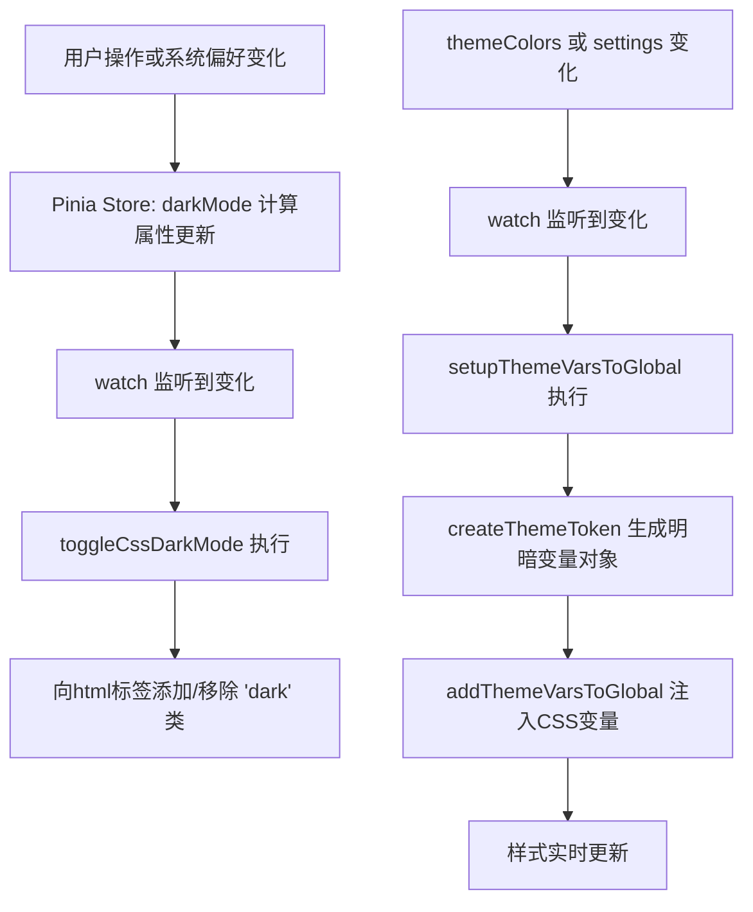
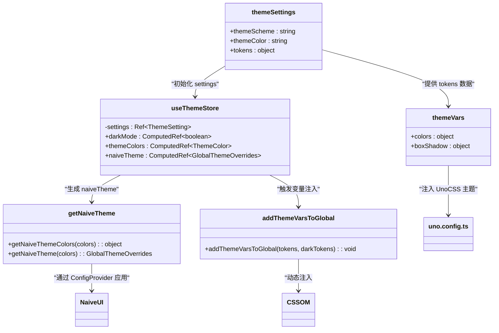

# 主题与变量系统

<cite>
**本文档引用的文件**  
- [theme/settings.ts](file://frontend/src/theme/settings.ts)
- [theme/vars.ts](file://frontend/src/theme/vars.ts)
- [store/modules/theme/shared.ts](file://frontend/src/store/modules/theme/shared.ts)
- [store/modules/theme/index.ts](file://frontend/src/store/modules/theme/index.ts)
- [components/common/theme-schema-switch.vue](file://frontend/src/components/common/theme-schema-switch.vue)
- [uno.config.ts](file://frontend/uno.config.ts)
</cite>

## 目录
1. [主题配置与设计Token体系](#主题配置与设计token体系)
2. [CSS变量映射与统一使用机制](#css变量映射与统一使用机制)
3. [暗黑模式切换与动态更新机制](#暗黑模式切换与动态更新机制)
4. [自定义主题扩展方法](#自定义主题扩展方法)
5. [Naive UI组件库主题集成](#naive-ui组件库主题集成)

## 主题配置与设计Token体系

项目通过 `theme/settings.ts` 文件定义了完整的主题配置对象，采用结构化方式组织设计Token，涵盖颜色、间距、字体、布局等视觉设计变量。该配置体系遵循设计系统（Design System）的最佳实践，将设计决策抽象为可复用的Token。

核心配置对象 `themeSettings` 包含以下关键部分：

- **主题方案（themeScheme）**：支持 `light`（浅色）、`dark`（深色）、`auto`（自动）三种模式。
- **主色调与辅助色（themeColor, otherColor）**：定义了主色及信息、成功、警告、错误等语义化颜色。
- **布局配置（layout）**：包含菜单模式、滚动方式等。
- **页面动画（page）**：控制页面切换动画效果。
- **头部、标签页、侧边栏、页脚等组件的尺寸与行为**。
- **设计Token（tokens）**：核心设计变量，分为 `light` 和 `dark` 两套，包含容器背景色、布局背景色、文本颜色、阴影等。

```ts
// theme/settings.ts
export const themeSettings: App.Theme.ThemeSetting = {
  themeScheme: 'auto',
  themeColor: '#646cff',
  otherColor: { info: '#2080f0', success: '#52c41a', warning: '#faad14', error: '#f5222d' },
  tokens: {
    light: {
      colors: {
        container: 'rgb(255, 255, 255)',
        layout: 'rgb(247, 250, 252)',
        'base-text': 'rgb(31, 31, 31)'
      },
      boxShadow: {
        header: '0 1px 2px rgb(0, 21, 41, 0.08)'
      }
    },
    dark: { 
      colors: { 
        container: 'rgb(28, 28, 28)', 
        layout: 'rgb(18, 18, 18)', 
        'base-text': 'rgb(224, 224, 224)' 
      } 
    }
  }
};
```

此设计允许在不同主题模式下使用不同的视觉变量，为后续的动态切换奠定了基础。

**Section sources**
- [theme/settings.ts](file://frontend/src/theme/settings.ts#L1-L50)

## CSS变量映射与统一使用机制

`theme/vars.ts` 文件负责将设计Token映射为CSS变量（CSS Custom Properties），这是实现主题动态切换的核心桥梁。该文件定义了 `themeVars` 对象，其结构与 `theme/settings.ts` 中的 `tokens` 相对应，但值为CSS变量引用。

其核心机制如下：

1.  **创建调色板变量**：`createColorPaletteVars` 函数为每种主题色（如 primary, info）生成一个调色板，包含从50到950的多个色阶，并映射到 `--primary-color`, `--primary-500-color` 等CSS变量。
2.  **定义主题变量**：`themeVars` 对象整合了调色板变量、容器背景色、布局背景色、文本颜色和阴影等，其值均为 `var(--xxx)` 形式。

```ts
// theme/vars.ts
function createColorPaletteVars() {
  const colors: App.Theme.ThemeColorKey[] = ['primary', 'info', 'success', 'warning', 'error'];
  const colorPaletteNumbers: App.Theme.ColorPaletteNumber[] = [50, 100, ..., 950];
  const colorPaletteVar = {} as App.Theme.ThemePaletteColor;

  colors.forEach(color => {
    colorPaletteVar[color] = `rgb(var(--${color}-color))`;
    colorPaletteNumbers.forEach(number => {
      colorPaletteVar[`${color}-${number}`] = `rgb(var(--${color}-${number}-color))`;
    });
  });
  return colorPaletteVar;
}

export const themeVars: App.Theme.ThemeTokenCSSVars = {
  colors: {
    ...colorPaletteVars,
    container: 'rgb(var(--container-bg-color))',
    'base-text': 'rgb(var(--base-text-color))'
  },
  boxShadow: {
    header: 'var(--header-box-shadow)'
  }
};
```

### 与UnoCSS的集成

UnoCSS通过其配置文件 `uno.config.ts` 直接消费 `themeVars`。在 `theme` 配置项中，使用扩展运算符 `...themeVars` 将所有主题变量注入到UnoCSS的全局主题中。

```ts
// uno.config.ts
import { themeVars } from './src/theme/vars';

export default defineConfig<Theme>({
  theme: {
    ...themeVars, // 将主题变量注入UnoCSS
    fontSize: { /* ... */ }
  },
  presets: [presetWind3({ dark: 'class' }), presetSoybeanAdmin()]
});
```

这使得开发者可以在模板中直接使用如 `bg-container`、`text-base-text`、`shadow-header` 等UnoCSS类名，这些类名会引用对应的CSS变量，从而实现样式与主题配置的解耦。

### 与SCSS的集成

虽然项目中未直接在SCSS文件中定义主题变量，但通过 `addThemeVarsToGlobal` 函数（见下文）动态注入的CSS变量，可以在任何SCSS文件中通过 `var(--variable-name)` 的方式安全使用。例如，在 `index.module.css` 中可以看到 `var(--soy-primary-color)` 的使用，这表明SCSS/CSS模块化样式也依赖于这套全局CSS变量系统。

**Section sources**
- [theme/vars.ts](file://frontend/src/theme/vars.ts#L1-L35)
- [uno.config.ts](file://frontend/uno.config.ts#L1-L32)

## 暗黑模式切换与动态更新机制

主题的动态更新是一个涉及状态管理、CSS变量生成和DOM操作的完整流程。其核心在于 `store/modules/theme` 模块。

### 核心流程分析

1.  **状态管理**：`useThemeStore` 使用Pinia管理主题状态。`settings` 存储完整的配置，`darkMode` 是一个计算属性，根据 `themeScheme` 和系统偏好（`osTheme`）决定当前是否为暗黑模式。
2.  **变量生成**：`createThemeToken` 函数接收当前主题颜色和配置，利用 `createThemePaletteColors` 生成完整的调色板（将HEX颜色转换为RGB值），并结合 `tokens.light` 和 `tokens.dark` 中的值，创建出两套完整的CSS变量值对象（`themeTokens` 和 `darkThemeTokens`）。
3.  **CSS变量注入**：`addThemeVarsToGlobal` 函数是关键。它接收明暗两套变量对象，调用 `getCssVarByTokens` 将对象转换为CSS声明字符串。最终生成的 `<style>` 标签内容如下：

```css
:root {
  --primary-color: 100 107 255;
  --container-bg-color: 255 255 255;
  /* ... 其他明色变量 */
}
html.dark {
  --container-bg-color: 28 28 28;
  /* ... 其他暗色变量 */
}
```

4.  **模式切换**：`toggleCssDarkMode` 函数通过向 `<html>` 标签添加或移除 `dark` 类（由 `DARK_CLASS` 常量定义）来触发主题切换。当 `darkMode` 计算属性变化时，Pinia的 `watch` 会立即调用此函数。

```ts
// store/modules/theme/index.ts
watch(darkMode, val => {
  toggleCssDarkMode(val); // 切换html类
  localStg.set('darkMode', val);
}, { immediate: true });
```

### 无缝过渡实现

该机制实现了无缝主题过渡，原因如下：
- **CSS变量**：所有样式都基于CSS变量，更改变量值即可全局生效。
- **动态注入**：`addThemeVarsToGlobal` 在主题颜色或配置变化时被调用，确保最新的设计Token被注入。
- **CSS类切换**：通过切换 `html` 标签上的类，浏览器会自动应用对应的CSS规则块（`:root` 或 `html.dark`），整个过程由浏览器高效完成，无需重载页面。



**Diagram sources**
- [store/modules/theme/index.ts](file://frontend/src/store/modules/theme/index.ts#L1-L221)
- [store/modules/theme/shared.ts](file://frontend/src/store/modules/theme/shared.ts#L1-L259)

**Section sources**
- [store/modules/theme/index.ts](file://frontend/src/store/modules/theme/index.ts#L1-L221)
- [store/modules/theme/shared.ts](file://frontend/src/store/modules/theme/shared.ts#L1-L259)

## 自定义主题扩展方法

项目提供了清晰的扩展点，允许开发者自定义主题。

### 新增颜色方案

1.  **修改 `theme/settings.ts`**：在 `themeSettings` 对象中，可以直接修改 `themeColor` 和 `otherColor` 的值来改变默认主题色。
2.  **使用 `overrideThemeSettings`**：在生产环境中，推荐使用 `overrideThemeSettings` 对象来覆盖默认配置，避免修改核心文件，便于版本升级。

```ts
// theme/settings.ts
export const overrideThemeSettings: Partial<App.Theme.ThemeSetting> = {
  themeColor: '#007AFF', // 覆盖主色为苹果蓝
  otherColor: {
    success: '#34C759'
  }
};
```

### 修改设计Token

1.  **扩展 `tokens` 对象**：可以在 `theme/settings.ts` 的 `tokens.light` 和 `tokens.dark` 中添加新的设计变量，例如新的间距或字体大小。
2.  **在 `theme/vars.ts` 中声明**：如果新增的Token需要作为CSS变量使用，必须在 `themeVars` 对象中声明其对应的CSS变量名。

```ts
// theme/vars.ts
export const themeVars: App.Theme.ThemeTokenCSSVars = {
  colors: { /* ... */ },
  boxShadow: { /* ... */ },
  spacing: {
    'extra-large': 'var(--extra-large-spacing)' // 新增间距变量
  }
};
```

3.  **在样式中使用**：之后即可在UnoCSS类名或SCSS中使用 `var(--extra-large-spacing)`。

### 扩展UnoCSS主题

在 `uno.config.ts` 中，除了注入 `themeVars`，还可以直接在 `theme` 对象中定义新的主题属性，如 `fontSize`，这些将被UnoCSS识别。

```ts
// uno.config.ts
export default defineConfig<Theme>({
  theme: {
    ...themeVars,
    spacing: { // 直接扩展UnoCSS主题
      '128': '32rem'
    }
  }
});
```

**Section sources**
- [theme/settings.ts](file://frontend/src/theme/settings.ts#L1-L50)
- [theme/vars.ts](file://frontend/src/theme/vars.ts#L1-L35)
- [uno.config.ts](file://frontend/uno.config.ts#L1-L32)

## Naive UI组件库主题集成

项目使用Naive UI作为UI组件库，其主题通过 `getNaiveTheme` 函数进行深度集成。

1.  **生成主题颜色**：`getNaiveThemeColors` 函数遍历主题颜色（如 primary），并为每个颜色生成Naive UI所需的多种状态色，例如：
    -   `primaryColorHover`: 通过 `getPaletteColorByNumber(color, 500)` 获取调色板中的500色阶。
    -   `primaryColorPressed`: 获取700色阶。
    -   `primaryColorActive`: 通过 `addColorAlpha(color, 0.1)` 添加透明度。
2.  **创建主题覆盖对象**：`getNaiveTheme` 函数返回一个 `GlobalThemeOverrides` 对象，将生成的颜色和固定的样式（如圆角 `borderRadius`）应用到Naive UI的各个组件上。

```ts
// store/modules/theme/shared.ts
export function getNaiveTheme(colors: App.Theme.ThemeColor, recommended = false) {
  const theme: GlobalThemeOverrides = {
    common: {
      ...getNaiveThemeColors(colors, recommended),
      borderRadius: '6px'
    },
    LoadingBar: {
      colorLoading: colors.primary
    }
  };
  return theme;
}
```

在 `useThemeStore` 中，`naiveTheme` 是一个计算属性，它会随着 `themeColors` 的变化而重新计算。这个计算属性被传递给Naive UI的 `<n-config-provider>` 组件，从而实现UI组件库主题的实时同步更新。



**Diagram sources**
- [store/modules/theme/shared.ts](file://frontend/src/store/modules/theme/shared.ts#L1-L259)
- [store/modules/theme/index.ts](file://frontend/src/store/modules/theme/index.ts#L1-L221)

**Section sources**
- [store/modules/theme/shared.ts](file://frontend/src/store/modules/theme/shared.ts#L1-L259)
- [store/modules/theme/index.ts](file://frontend/src/store/modules/theme/index.ts#L1-L221)