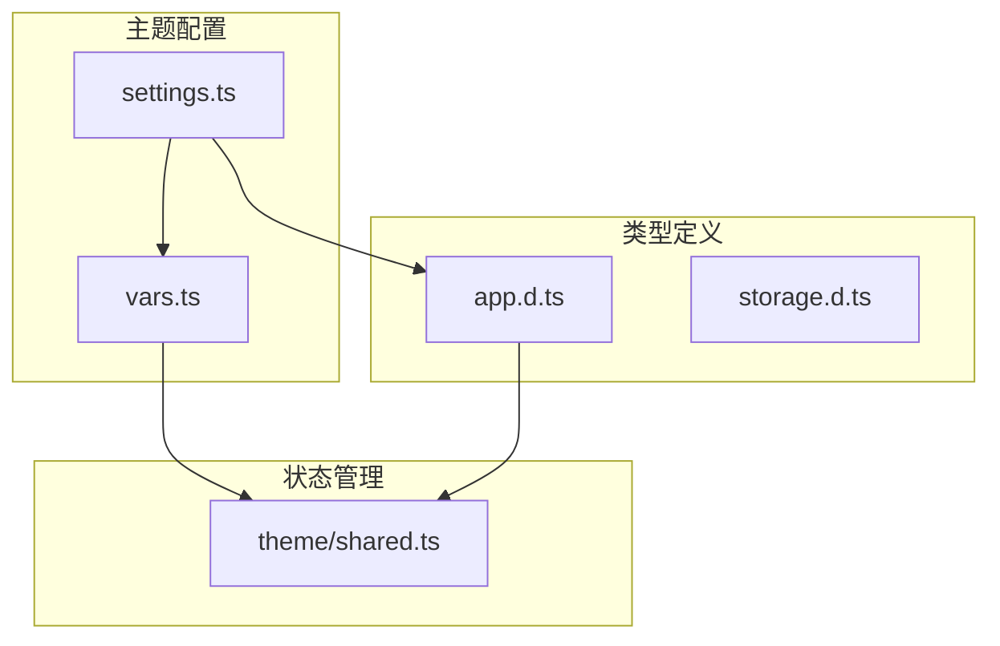
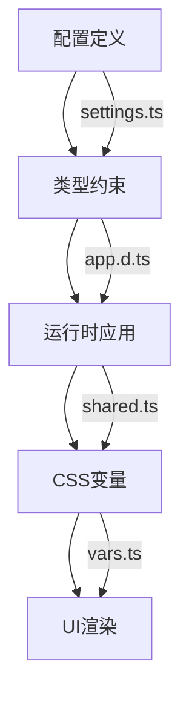
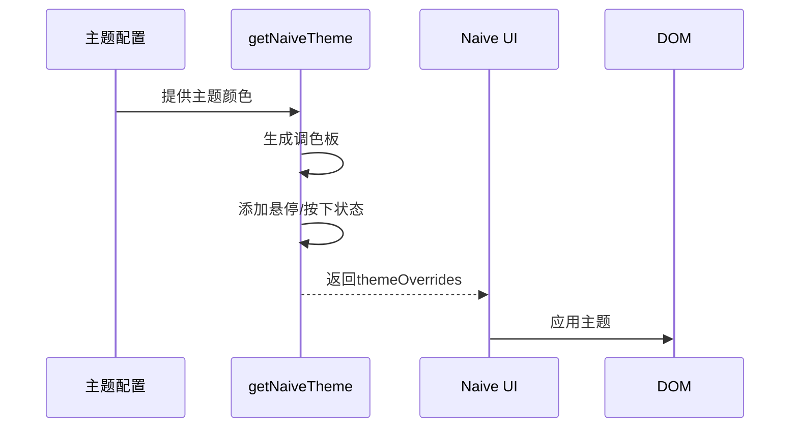
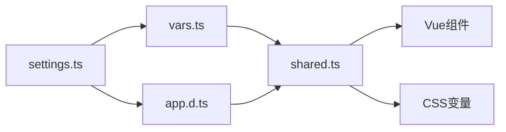

# 主题配置

<cite>
**本文档引用的文件**   
- [settings.ts](file://frontend/src/theme/settings.ts#L1-L50)
- [vars.ts](file://frontend/src/theme/vars.ts#L1-L36)
- [app.d.ts](file://frontend/src/typings/app.d.ts#L7-L157)
- [shared.ts](file://frontend/src/store/modules/theme/shared.ts#L28-L258)
</cite>

## 目录
1. [简介](#简介)
2. [项目结构](#项目结构)
3. [核心组件](#核心组件)
4. [架构概览](#架构概览)
5. [详细组件分析](#详细组件分析)
6. [依赖分析](#依赖分析)
7. [性能考虑](#性能考虑)
8. [故障排除指南](#故障排除指南)
9. [结论](#结论)

## 简介
本文档深入解析 `theme/settings.ts` 中的主题配置体系，详细说明设计Token的组织结构、多主题方案管理机制以及与Naive UI组件库的集成方式。文档涵盖颜色系统、间距层级、字体排版、圆角半径等基础设计变量的定义方式，并提供新增自定义颜色方案或修改设计Token的具体操作步骤。

## 项目结构
项目前端部分采用模块化结构，主题配置相关文件位于 `frontend/src/theme` 目录下，主要包括 `settings.ts` 和 `vars.ts` 两个核心文件。`settings.ts` 定义了主题配置对象及其默认值，`vars.ts` 则负责将这些配置转换为CSS变量。



**图示来源**
- [settings.ts](file://frontend/src/theme/settings.ts#L1-L50)
- [vars.ts](file://frontend/src/theme/vars.ts#L1-L36)
- [app.d.ts](file://frontend/src/typings/app.d.ts#L7-L157)

## 核心组件
主题配置体系的核心是 `themeSettings` 对象，它定义了应用的视觉风格和行为特性。该对象包含主题方案、颜色设置、布局模式、页面动画等多个维度的配置项。

**组件来源**
- [settings.ts](file://frontend/src/theme/settings.ts#L1-L50)
- [app.d.ts](file://frontend/src/typings/app.d.ts#L7-L118)

## 架构概览
主题配置系统采用分层架构，上层为配置定义，中层为类型约束，下层为运行时应用。配置通过CSS变量注入DOM，实现动态主题切换。



**图示来源**
- [settings.ts](file://frontend/src/theme/settings.ts#L1-L50)
- [app.d.ts](file://frontend/src/typings/app.d.ts#L7-L157)
- [shared.ts](file://frontend/src/store/modules/theme/shared.ts#L28-L258)

## 详细组件分析

### 主题配置对象分析
`themeSettings` 对象是主题配置的核心，其结构遵循 `App.Theme.ThemeSetting` 接口定义，包含多个嵌套的配置项。

#### 配置结构
```typescript
export const themeSettings: App.Theme.ThemeSetting = {
  themeScheme: 'auto',
  grayscale: false,
  colourWeakness: false,
  recommendColor: true,
  themeColor: '#646cff',
  otherColor: { info: '#2080f0', success: '#52c41a', warning: '#faad14', error: '#f5222d' },
  isInfoFollowPrimary: true,
  resetCacheStrategy: 'close',
  layout: { mode: 'vertical', scrollMode: 'content', reverseHorizontalMix: false },
  page: { animate: true, animateMode: 'fade-slide' },
  header: { height: 56, breadcrumb: { visible: false, showIcon: true }, multilingual: { visible: false } },
  tab: { visible: false, cache: true, height: 44, mode: 'chrome' },
  fixedHeaderAndTab: true,
  sider: {
    inverted: false,
    width: 180,
    collapsedWidth: 64,
    mixWidth: 90,
    mixCollapsedWidth: 64,
    mixChildMenuWidth: 200
  },
  footer: { visible: false, fixed: false, height: 48, right: true },
  watermark: { visible: false, text: '派聪明 PaiSmart' },
  tokens: {
    light: {
      colors: {
        container: 'rgb(255, 255, 255)',
        layout: 'rgb(247, 250, 252)',
        inverted: 'rgb(0, 20, 40)',
        'base-text': 'rgb(31, 31, 31)'
      },
      boxShadow: {
        header: '0 1px 2px rgb(0, 21, 41, 0.08)',
        sider: '2px 0 8px 0 rgb(29, 35, 41, 0.05)',
        tab: '0 1px 2px rgb(0, 21, 41, 0.08)'
      }
    },
    dark: { colors: { container: 'rgb(28, 28, 28)', layout: 'rgb(18, 18, 18)', 'base-text': 'rgb(224, 224, 224)' } }
  }
};
```

#### 类型定义
```typescript
interface ThemeSetting {
  themeScheme: UnionKey.ThemeScheme;
  grayscale: boolean;
  colourWeakness: boolean;
  recommendColor: boolean;
  themeColor: string;
  otherColor: OtherColor;
  isInfoFollowPrimary: boolean;
  resetCacheStrategy: UnionKey.ResetCacheStrategy;
  layout: {
    mode: UnionKey.ThemeLayoutMode;
    scrollMode: UnionKey.ThemeScrollMode;
    reverseHorizontalMix: boolean;
  };
  page: {
    animate: boolean;
    animateMode: UnionKey.ThemePageAnimateMode;
  };
  header: {
    height: number;
    breadcrumb: {
      visible: boolean;
      showIcon: boolean;
    };
    multilingual: {
      visible: boolean;
    };
  };
  tab: {
    visible: boolean;
    cache: boolean;
    height: number;
    mode: UnionKey.ThemeTabMode;
  };
  fixedHeaderAndTab: boolean;
  sider: {
    inverted: boolean;
    width: number;
    collapsedWidth: number;
    mixWidth: number;
    mixCollapsedWidth: number;
    mixChildMenuWidth: number;
  };
  footer: {
    visible: boolean;
    fixed: boolean;
    height: number;
    right: boolean;
  };
  watermark: {
    visible: boolean;
    text: string;
  };
  tokens: {
    light: ThemeSettingToken;
    dark?: {
      [K in keyof ThemeSettingToken]?: Partial<ThemeSettingToken[K]>;
    };
  };
}
```

**组件来源**
- [settings.ts](file://frontend/src/theme/settings.ts#L1-L50)
- [app.d.ts](file://frontend/src/typings/app.d.ts#L7-L118)

### 设计Token系统分析
设计Token系统通过 `vars.ts` 文件实现，将主题配置转换为CSS变量，供整个应用使用。

#### Token生成逻辑
```typescript
function createColorPaletteVars() {
  const colors: App.Theme.ThemeColorKey[] = ['primary', 'info', 'success', 'warning', 'error'];
  const colorPaletteNumbers: App.Theme.ColorPaletteNumber[] = [50, 100, 200, 300, 400, 500, 600, 700, 800, 900, 950];

  const colorPaletteVar = {} as App.Theme.ThemePaletteColor;

  colors.forEach(color => {
    colorPaletteVar[color] = `rgb(var(--${color}-color))`;
    colorPaletteNumbers.forEach(number => {
      colorPaletteVar[`${color}-${number}`] = `rgb(var(--${color}-${number}-color))`;
    });
  });

  return colorPaletteVar;
}
```

#### Token结构
```typescript
export const themeVars: App.Theme.ThemeTokenCSSVars = {
  colors: {
    ...colorPaletteVars,
    nprogress: 'rgb(var(--nprogress-color))',
    container: 'rgb(var(--container-bg-color))',
    layout: 'rgb(var(--layout-bg-color))',
    inverted: 'rgb(var(--inverted-bg-color))',
    'base-text': 'rgb(var(--base-text-color))'
  },
  boxShadow: {
    header: 'var(--header-box-shadow)',
    sider: 'var(--sider-box-shadow)',
    tab: 'var(--tab-box-shadow)'
  }
};
```

**组件来源**
- [vars.ts](file://frontend/src/theme/vars.ts#L1-L36)
- [app.d.ts](file://frontend/src/typings/app.d.ts#L139-L157)

### Naive UI集成分析
主题配置通过 `getNaiveTheme` 函数与Naive UI组件库集成，生成符合其要求的主题覆盖对象。

#### 集成流程


**图示来源**
- [shared.ts](file://frontend/src/store/modules/theme/shared.ts#L205-L258)

## 依赖分析
主题配置系统依赖多个文件和模块，形成完整的主题管理链条。



**图示来源**
- [settings.ts](file://frontend/src/theme/settings.ts#L1-L50)
- [vars.ts](file://frontend/src/theme/vars.ts#L1-L36)
- [shared.ts](file://frontend/src/store/modules/theme/shared.ts#L28-L258)

## 性能考虑
主题配置系统在性能方面做了以下优化：
- 使用CSS变量实现主题切换，避免频繁的DOM操作
- 预生成调色板，减少运行时计算
- 支持按需加载主题配置，减少初始加载时间

## 故障排除指南
### 常见问题
1. **主题不生效**：检查CSS变量是否正确注入DOM
2. **颜色显示异常**：验证颜色值格式是否正确（应为rgb或hex）
3. **暗色模式失效**：确认HTML元素是否添加了暗色模式类名

### 调试步骤
1. 检查 `themeSettings` 对象的配置值
2. 验证CSS变量是否存在于 `<style>` 标签中
3. 确认Naive UI组件是否正确应用了主题覆盖

**组件来源**
- [shared.ts](file://frontend/src/store/modules/theme/shared.ts#L146-L203)

## 结论
主题配置体系通过结构化的设计Token和清晰的集成机制，实现了灵活的主题管理。系统支持多主题方案、可扩展的设计变量和与第三方组件库的无缝集成，为应用提供了强大的视觉定制能力。