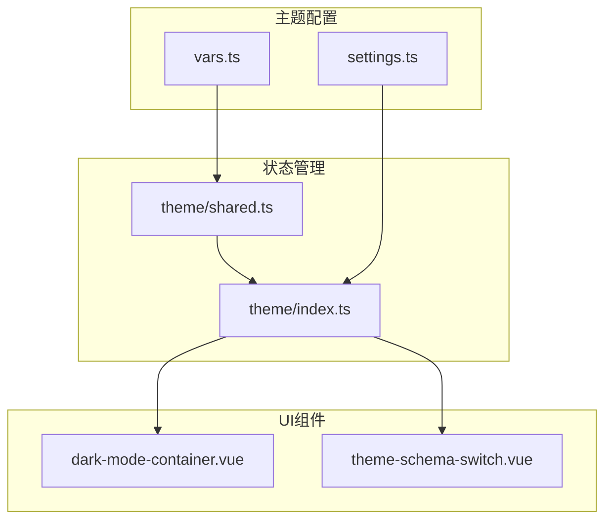
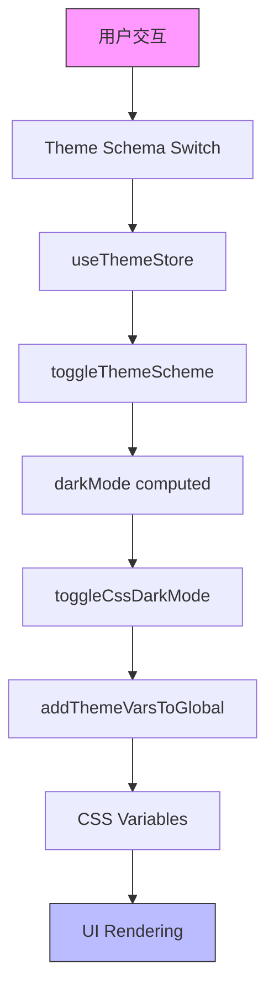
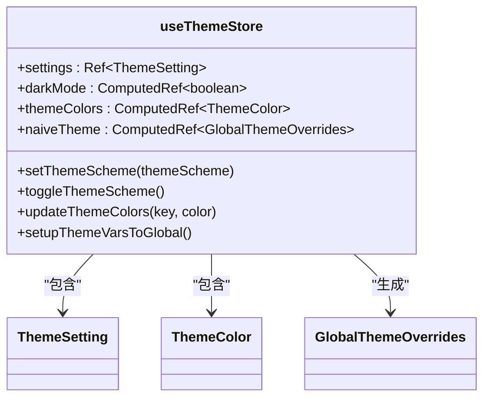
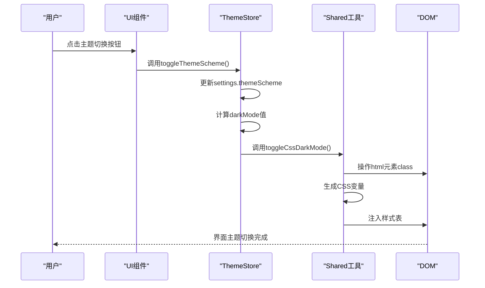
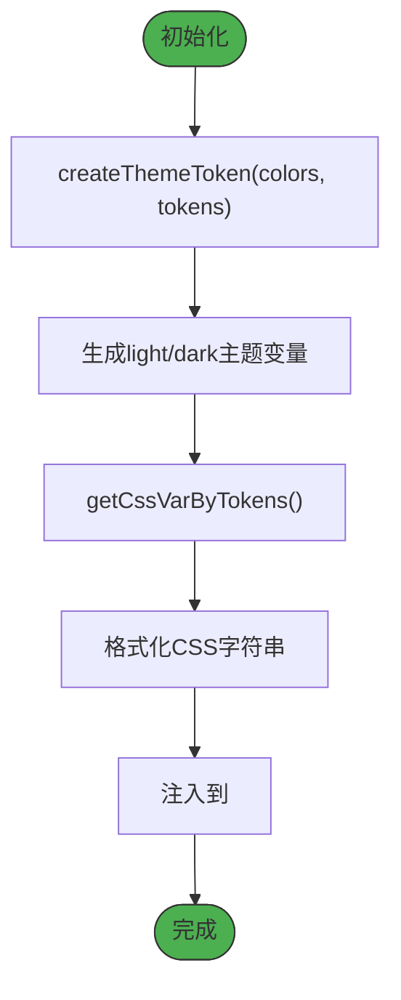
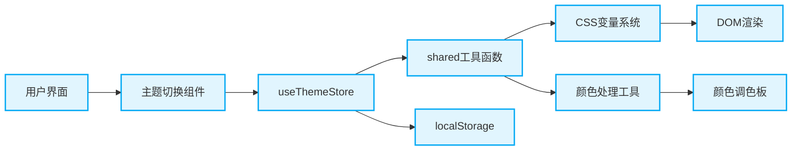
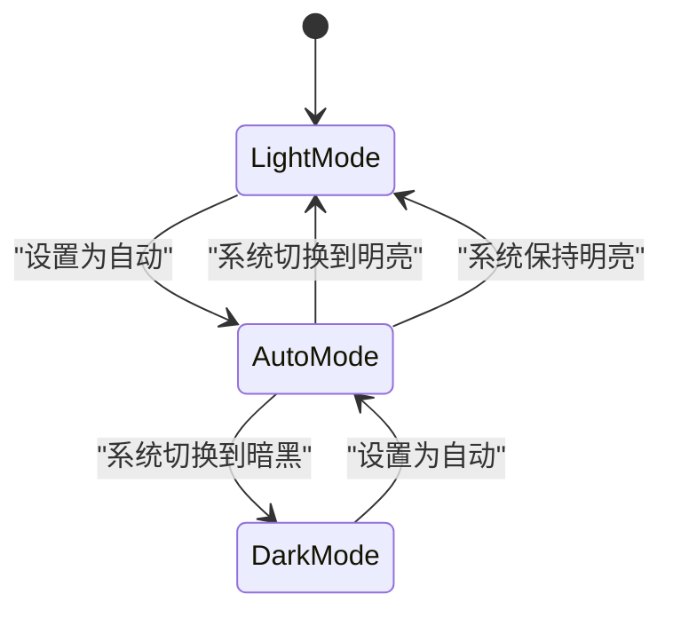

# 暗黑模式实现

<cite>
**本文档引用的文件**
- [index.ts](file://frontend/src/store/modules/theme/index.ts)
- [shared.ts](file://frontend/src/store/modules/theme/shared.ts)
- [dark-mode-container.vue](file://frontend/src/components/common/dark-mode-container.vue)
- [settings.ts](file://frontend/src/theme/settings.ts)
- [vars.ts](file://frontend/src/theme/vars.ts)
- [app.ts](file://frontend/src/constants/app.ts)
</cite>

## 目录
1. [引言](#引言)
2. [项目结构分析](#项目结构分析)
3. [核心组件分析](#核心组件分析)
4. [架构概览](#架构概览)
5. [详细组件分析](#详细组件分析)
6. [依赖关系分析](#依赖关系分析)
7. [性能考量](#性能考量)
8. [故障排除指南](#故障排除指南)
9. [结论](#结论)

## 引言
本文档全面解析了PaiSmart项目中暗黑模式的实现机制。通过分析Pinia状态管理、CSS变量动态更新、视觉隔离与过渡动画等关键技术，详细阐述了主题切换的完整流程。文档涵盖了从状态管理到UI渲染的各个层面，为开发者提供了深入理解暗黑模式实现原理的完整视角。

## 项目结构分析
通过对项目结构的分析，可以清晰地看到暗黑模式相关代码的组织方式。主题管理功能主要集中在`frontend/src/store/modules/theme`目录下，包含状态定义和共享工具。UI组件则分布在`frontend/src/components/common`目录中，特别是`dark-mode-container.vue`组件负责视觉隔离。主题配置和变量定义位于`frontend/src/theme`目录。



**图示来源**
- [index.ts](file://frontend/src/store/modules/theme/index.ts)
- [shared.ts](file://frontend/src/store/modules/theme/shared.ts)
- [dark-mode-container.vue](file://frontend/src/components/common/dark-mode-container.vue)
- [settings.ts](file://frontend/src/theme/settings.ts)
- [vars.ts](file://frontend/src/theme/vars.ts)

**本节来源**
- [index.ts](file://frontend/src/store/modules/theme/index.ts)
- [shared.ts](file://frontend/src/store/modules/theme/shared.ts)

## 核心组件
暗黑模式的核心实现依赖于Pinia状态管理、CSS变量系统和Vue组件的协同工作。`useThemeStore`是全局主题状态的管理中心，负责管理主题方案、颜色设置和布局模式。`dark-mode-container.vue`组件通过CSS类名实现视觉隔离，确保特定区域的样式独立于全局主题。CSS变量系统通过动态注入样式表实现主题的无缝切换。

**本节来源**
- [index.ts](file://frontend/src/store/modules/theme/index.ts)
- [dark-mode-container.vue](file://frontend/src/components/common/dark-mode-container.vue)
- [vars.ts](file://frontend/src/theme/vars.ts)

## 架构概览
暗黑模式的实现采用了分层架构设计，各组件职责分明，协同工作。状态管理层负责管理主题配置和模式切换逻辑，工具层负责生成和应用CSS变量，UI层负责视觉呈现和用户交互。



**图示来源**
- [index.ts](file://frontend/src/store/modules/theme/index.ts)
- [shared.ts](file://frontend/src/store/modules/theme/shared.ts)
- [dark-mode-container.vue](file://frontend/src/components/common/dark-mode-container.vue)

## 详细组件分析
### 主题状态管理分析
主题状态管理通过Pinia store实现全局状态的集中管理。`useThemeStore`定义了主题设置、暗黑模式、颜色配置等状态，并通过计算属性和监听器实现自动更新。



**图示来源**
- [index.ts](file://frontend/src/store/modules/theme/index.ts#L0-L221)

#### 主题切换流程分析
主题切换是一个多步骤的流程，涉及状态更新、CSS变量生成和DOM操作。当用户触发主题切换时，系统会按照特定顺序执行一系列操作，确保界面平滑过渡。



**图示来源**
- [index.ts](file://frontend/src/store/modules/theme/index.ts#L93-L135)
- [shared.ts](file://frontend/src/store/modules/theme/shared.ts#L175-L183)

### 暗黑模式容器组件分析
`dark-mode-container.vue`组件是实现视觉隔离的关键组件，它允许特定UI区域独立于全局主题设置。

```mermaid
classDiagram
class DarkModeContainer {
+inverted : boolean
+bg-container
+text-base-text
+transition-300
+bg-inverted
+text-#1f1f1f
}
note right of DarkModeContainer
通过Unocss原子类实现样式
transition-300提供300ms过渡动画
inverted属性控制反转样式
end
```

**图示来源**
- [dark-mode-container.vue](file://frontend/src/components/common/dark-mode-container.vue#L0-L17)

#### CSS变量管理机制
CSS变量的管理通过`themeVars`对象和`addThemeVarsToGlobal`函数实现，将主题配置转换为可被CSS使用的变量。



**图示来源**
- [shared.ts](file://frontend/src/store/modules/theme/shared.ts#L88-L144)
- [vars.ts](file://frontend/src/theme/vars.ts#L0-L34)

## 依赖关系分析
暗黑模式的实现涉及多个模块的协同工作，形成了复杂的依赖关系网络。



**图示来源**
- [index.ts](file://frontend/src/store/modules/theme/index.ts)
- [shared.ts](file://frontend/src/store/modules/theme/shared.ts)
- [vars.ts](file://frontend/src/theme/vars.ts)

**本节来源**
- [index.ts](file://frontend/src/store/modules/theme/index.ts)
- [shared.ts](file://frontend/src/store/modules/theme/shared.ts)

## 性能考量
暗黑模式的实现充分考虑了性能优化，避免了不必要的重排和重绘操作。

### 避免重排重绘策略
通过使用CSS变量和类名切换，系统避免了直接操作元素样式可能引起的重排重绘。所有主题相关的样式变更都通过修改根元素的CSS变量来实现，这种批量更新的方式大大提高了性能。

**本节来源**
- [shared.ts](file://frontend/src/store/modules/theme/shared.ts#L146-L203)

### 系统级自动适配
系统通过`usePreferredColorScheme` Hook监听操作系统主题变化，实现自动适配。当用户在系统设置中切换主题时，应用会自动跟随切换，提供无缝的用户体验。



**图示来源**
- [index.ts](file://frontend/src/store/modules/theme/index.ts#L0-L36)

## 故障排除指南
### 主题切换无反应
1. 检查`useThemeStore`是否正确初始化
2. 确认`DARK_CLASS`常量是否正确应用到html元素
3. 验证CSS变量是否成功注入到DOM

### 颜色显示异常
1. 检查`themeColors`计算属性的值是否正确
2. 确认`recommendColor`设置是否影响颜色生成
3. 验证颜色调色板生成逻辑

**本节来源**
- [index.ts](file://frontend/src/store/modules/theme/index.ts#L200-L220)
- [app.ts](file://frontend/src/constants/app.ts#L64)

## 结论
PaiSmart项目的暗黑模式实现采用了现代化的前端架构，通过Pinia状态管理、CSS变量系统和Vue组件的有机结合，实现了高效、灵活的主题切换功能。系统不仅支持手动切换，还能自动适配系统主题，为用户提供了优质的视觉体验。通过合理的架构设计和性能优化，确保了主题切换的流畅性和稳定性。