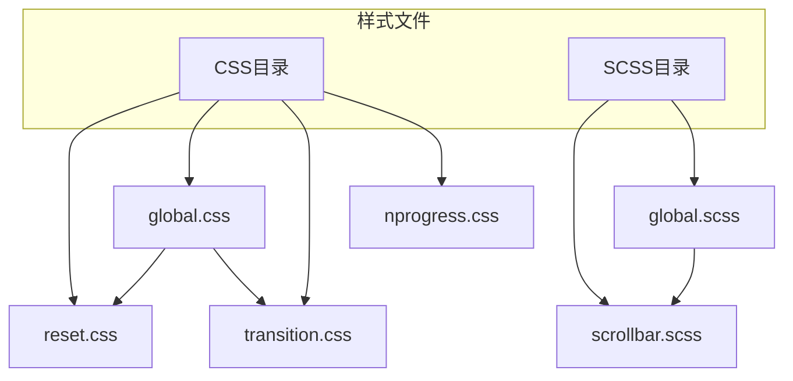
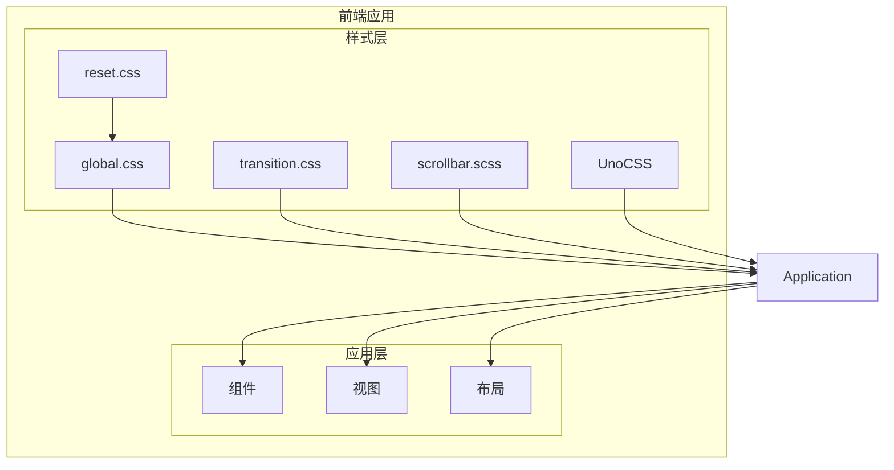
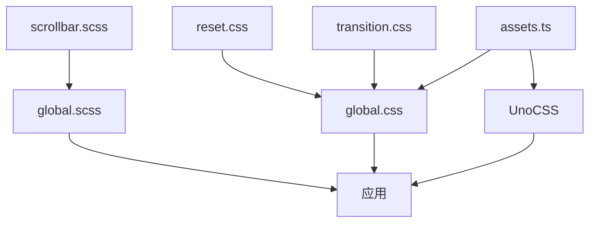

# 全局样式管理

<cite>
**本文档引用的文件**   
- [reset.css](file://frontend/src/styles/css/reset.css)
- [global.css](file://frontend/src/styles/css/global.css)
- [transition.css](file://frontend/src/styles/css/transition.css)
- [scrollbar.scss](file://frontend/src/styles/scss/scrollbar.scss)
- [global.scss](file://frontend/src/styles/scss/global.scss)
- [assets.ts](file://frontend/src/plugins/assets.ts)
- [uno.config.ts](file://frontend/uno.config.ts)
- [unocss.ts](file://frontend/build/plugins/unocss.ts)
- [index.ts](file://frontend/packages/uno-preset/src/index.ts)
- [union-key.d.ts](file://frontend/src/typings/union-key.d.ts)
</cite>

## 目录
1. [项目结构](#项目结构)
2. [核心组件分析](#核心组件分析)
3. [架构概览](#架构概览)
4. [详细组件分析](#详细组件分析)
5. [依赖分析](#依赖分析)
6. [性能考虑](#性能考虑)
7. [故障排除指南](#故障排除指南)
8. [结论](#结论)

## 项目结构
项目中的全局样式管理体系位于`frontend/src/styles`目录下，分为CSS和SCSS两个子目录。CSS目录包含传统的全局样式文件，而SCSS目录则包含使用SCSS预处理器编写的样式文件。这种分离的设计使得传统CSS样式和现代SCSS功能可以并行存在，互不干扰。



**图示来源**
- [reset.css](file://frontend/src/styles/css/reset.css)
- [global.css](file://frontend/src/styles/css/global.css)
- [transition.css](file://frontend/src/styles/css/transition.css)
- [scrollbar.scss](file://frontend/src/styles/scss/scrollbar.scss)
- [global.scss](file://frontend/src/styles/scss/global.scss)

## 核心组件分析
全局样式管理的核心组件包括五个关键文件：`reset.css`、`global.css`、`transition.css`、`scrollbar.scss`和`global.scss`。这些文件共同构成了项目的样式基础，为整个应用提供一致的视觉体验。

`reset.css`文件实现了浏览器样式重置策略，消除了不同浏览器之间的默认样式差异。`global.css`定义了全局布局规则，确保页面的基本结构一致性。`transition.css`实现了页面路由过渡动画效果，提升了用户体验。`scrollbar.scss`使用SCSS混合宏实现了自定义滚动条样式。`global.scss`则通过SCSS的模块系统组织和导出这些样式。

**组件来源**
- [reset.css](file://frontend/src/styles/css/reset.css)
- [global.css](file://frontend/src/styles/css/global.css)
- [transition.css](file://frontend/src/styles/css/transition.css)
- [scrollbar.scss](file://frontend/src/styles/scss/scrollbar.scss)
- [global.scss](file://frontend/src/styles/scss/global.scss)

## 架构概览
全局样式管理的架构设计体现了传统CSS与现代原子化CSS（UnoCSS）共存协作的理念。传统CSS文件负责基础样式重置、全局布局和特定动画效果，而UnoCSS则负责细粒度的原子化样式应用。



**图示来源**
- [reset.css](file://frontend/src/styles/css/reset.css)
- [global.css](file://frontend/src/styles/css/global.css)
- [transition.css](file://frontend/src/styles/css/transition.css)
- [scrollbar.scss](file://frontend/src/styles/scss/scrollbar.scss)
- [uno.config.ts](file://frontend/uno.config.ts)

## 详细组件分析

### reset.css中的浏览器样式重置策略
`reset.css`文件实现了全面的浏览器样式重置策略，确保在不同浏览器中有一致的渲染效果。该文件基于Tailwind CSS的重置策略，并针对UnoCSS进行了优化。

```css
/*
1. 防止padding和border影响元素宽度
2. 允许通过添加border-width来为元素添加边框
3. [UnoCSS]: 允许使用css变量`--un-default-border-color`覆盖默认边框颜色
*/

*,
::before,
::after {
  box-sizing: border-box;
  border-width: 0;
  border-style: solid;
  border-color: var(--un-default-border-color, #e5e7eb);
}
```

该重置策略首先通过`box-sizing: border-box`改变了盒模型，使得padding和border不会影响元素的总宽度。同时，它将所有元素的边框宽度设置为0，边框样式设置为solid，并使用CSS变量`--un-default-border-color`定义边框颜色，这使得边框样式可以被UnoCSS轻松覆盖。

**组件来源**
- [reset.css](file://frontend/src/styles/css/reset.css)

### global.css中的全局布局规则
`global.css`文件定义了应用的全局布局规则，是整个样式系统的基础。它通过导入其他CSS文件来组织样式，并设置了基本的布局属性。

```css
@import './reset.css';
@import './nprogress.css';
@import './transition.css';

html,
body,
#app {
  height: 100%;
}

html {
  overflow-x: hidden;
}
```

该文件首先导入了`reset.css`、`nprogress.css`和`transition.css`三个文件，建立了完整的样式基础。然后，它设置了`html`、`body`和`#app`元素的高度为100%，确保应用可以充分利用整个视口空间。最后，通过`overflow-x: hidden`隐藏了水平滚动条，防止内容溢出。

**组件来源**
- [global.css](file://frontend/src/styles/css/global.css)

### transition.css中的页面路由过渡动画
`transition.css`文件实现了多种页面路由过渡动画效果，提升了应用的用户体验。这些动画使用Vue的过渡类名系统实现。

```css
/* fade */
.fade-enter-active,
.fade-leave-active {
  transition: opacity 0.3s ease-in-out;
}
.fade-enter-from,
.fade-leave-to {
  opacity: 0;
}

/* fade-slide */
.fade-slide-leave-active,
.fade-slide-enter-active {
  transition: all 0.3s;
}
.fade-slide-enter-from {
  opacity: 0;
  transform: translateX(-30px);
}
.fade-slide-leave-to {
  opacity: 0;
  transform: translateX(30px);
}
```

该文件定义了六种不同的过渡动画：淡入淡出（fade）、滑动淡出（fade-slide）、底部淡出（fade-bottom）、缩放淡出（fade-scale）、缩放淡入（zoom-fade）和缩放消失（zoom-out）。每种动画都使用CSS transition属性定义了过渡效果，并通过Vue的过渡类名指定了进入和离开时的状态。

**组件来源**
- [transition.css](file://frontend/src/styles/css/transition.css)

### scrollbar.scss中的自定义滚动条实现
`scrollbar.scss`文件使用SCSS混合宏实现了自定义滚动条样式，提供了灵活的配置选项。

```scss
@mixin scrollbar($size: 7px, $color: rgba(0, 0, 0, 0.5)) {
  scrollbar-width: thin;
  scrollbar-color: $color transparent;

  &::-webkit-scrollbar-thumb {
    background-color: $color;
    border-radius: $size;
  }
  &::-webkit-scrollbar-thumb:hover {
    background-color: $color;
    border-radius: $size;
  }
  &::-webkit-scrollbar {
    width: $size;
    height: $size;
  }
  &::-webkit-scrollbar-track-piece {
    background-color: rgba(0, 0, 0, 0);
    border-radius: 0;
  }
}
```

该混合宏`scrollbar`接受两个参数：`$size`（滚动条尺寸，默认7px）和`$color`（滚动条颜色，默认半透明黑色）。它同时支持WebKit浏览器的滚动条伪元素和标准的`scrollbar-width`与`scrollbar-color`属性，确保了跨浏览器兼容性。

**组件来源**
- [scrollbar.scss](file://frontend/src/styles/scss/scrollbar.scss)

### global.scss中的SCSS使用规范
`global.scss`文件使用SCSS的模块系统来组织和导出样式，体现了现代CSS开发的最佳实践。

```scss
@forward 'scrollbar';
```

该文件非常简洁，只包含一行代码`@forward 'scrollbar'`。`@forward`规则是SCSS模块系统的一部分，它将`scrollbar.scss`文件中的内容转发到当前模块，使得导入`global.scss`的文件可以访问`scrollbar`混合宏。这种设计模式使得样式可以被模块化组织和复用。

**组件来源**
- [global.scss](file://frontend/src/styles/scss/global.scss)

### 传统样式与UnoCSS的共存协作
项目通过精心设计的引入顺序和配置，实现了传统样式文件与UnoCSS原子化样式的共存协作。

```ts
// src/plugins/assets.ts
import 'virtual:svg-icons-register';
import 'uno.css';
import '../styles/css/global.css';
```

在`assets.ts`文件中，样式文件的引入顺序至关重要：首先引入`uno.css`，然后引入`global.css`。这种顺序确保了UnoCSS生成的原子化样式可以被传统CSS文件覆盖，避免了样式冲突。

```ts
// uno.config.ts
export default defineConfig<Theme>({
  content: {
    pipeline: {
      exclude: ['node_modules', 'dist']
    }
  },
  theme: {
    ...themeVars,
    fontSize: {
      'icon-xs': '0.875rem',
      'icon-small': '1rem',
      icon: '1.125rem',
      'icon-large': '1.5rem',
      'icon-xl': '2rem'
    }
  },
  shortcuts: {
    'card-wrapper': 'rd-4 shadow-2xl dark:shadow-[0_25px_50px_-12px_rgba(27,27,27,0.1)]',
    'flex-cc': 'flex items-center justify-center'
  },
  transformers: [transformerDirectives(), transformerVariantGroup()],
  presets: [presetWind3({ dark: 'class' }), presetSoybeanAdmin()]
});
```

UnoCSS配置文件中定义了主题变量、快捷方式和预设，这些配置与传统CSS文件协同工作。例如，`shortcuts`中定义的`flex-cc`快捷方式与`global.css`中的全局规则互补，提供了更高效的样式编写方式。

```ts
// packages/uno-preset/src/index.ts
export function presetSoybeanAdmin(): Preset<Theme> {
  const preset: Preset<Theme> = {
    name: 'preset-soybean-admin',
    shortcuts: [
      {
        'flex-center': 'flex justify-center items-center',
        'flex-x-center': 'flex justify-center',
        'flex-y-center': 'flex items-center',
        // ... 其他快捷方式
      },
      {
        'absolute-lt': 'absolute left-0 top-0',
        'absolute-lb': 'absolute left-0 bottom-0',
        // ... 其他快捷方式
      }
    ]
  };

  return preset;
}
```

自定义的UnoCSS预设进一步扩展了原子化样式的能力，定义了大量实用的快捷方式，这些快捷方式与传统CSS文件中的全局规则形成了完整的样式体系。

**组件来源**
- [assets.ts](file://frontend/src/plugins/assets.ts)
- [uno.config.ts](file://frontend/uno.config.ts)
- [unocss.ts](file://frontend/build/plugins/unocss.ts)
- [index.ts](file://frontend/packages/uno-preset/src/index.ts)

## 依赖分析
全局样式管理系统的依赖关系清晰明确，体现了分层设计的思想。



`reset.css`和`transition.css`被`global.css`直接导入，形成了基础样式层。`scrollbar.scss`通过`global.scss`的`@forward`机制被导出，形成了SCSS样式层。`assets.ts`文件负责最终的样式引入，将传统CSS和UnoCSS整合到应用中。

**图示来源**
- [reset.css](file://frontend/src/styles/css/reset.css)
- [global.css](file://frontend/src/styles/css/global.css)
- [transition.css](file://frontend/src/styles/css/transition.css)
- [scrollbar.scss](file://frontend/src/styles/scss/scrollbar.scss)
- [global.scss](file://frontend/src/styles/scss/global.scss)
- [assets.ts](file://frontend/src/plugins/assets.ts)

## 性能考虑
全局样式管理在性能方面有以下考虑：

1. **文件大小优化**：通过将样式分为多个小文件，可以实现按需加载和更好的缓存策略。
2. **重置策略效率**：`reset.css`使用了经过优化的重置策略，避免了过度重置带来的性能开销。
3. **动画性能**：`transition.css`中的动画使用了`transform`和`opacity`属性，这些属性可以被GPU加速，确保动画流畅。
4. **SCSS编译效率**：`scrollbar.scss`使用混合宏而不是重复的CSS规则，减少了最终CSS文件的大小。

## 故障排除指南
在使用全局样式管理系统时，可能会遇到以下常见问题：

1. **样式冲突**：确保`uno.css`在`global.css`之前引入，以避免UnoCSS样式被传统CSS覆盖。
2. **滚动条不显示**：检查是否正确应用了`scrollbar`混合宏，并确保浏览器支持自定义滚动条。
3. **动画不生效**：确认组件使用了正确的Vue过渡类名，并检查CSS文件是否正确导入。
4. **重置样式影响**：如果某些元素的默认样式被意外重置，可以使用更具体的选择器来覆盖重置样式。

**问题来源**
- [reset.css](file://frontend/src/styles/css/reset.css)
- [global.css](file://frontend/src/styles/css/global.css)
- [transition.css](file://frontend/src/styles/css/transition.css)
- [scrollbar.scss](file://frontend/src/styles/scss/scrollbar.scss)

## 结论
该项目的全局样式管理体系成功地将传统CSS/SCSS与现代原子化CSS（UnoCSS）相结合，创造了一个高效、灵活且易于维护的样式系统。通过合理的文件组织、清晰的依赖关系和精心设计的共存机制，该系统为应用提供了统一的视觉体验，同时保持了开发的高效性。这种混合样式管理方法为现代前端开发提供了一个优秀的实践范例。