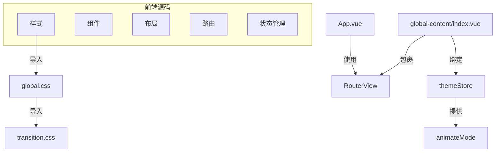
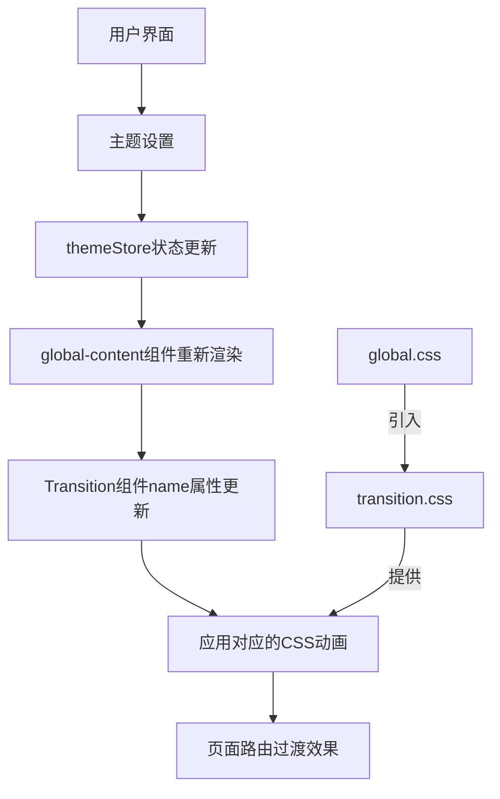
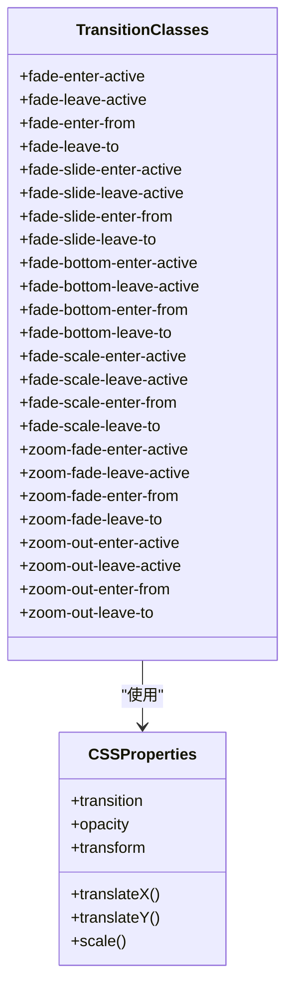
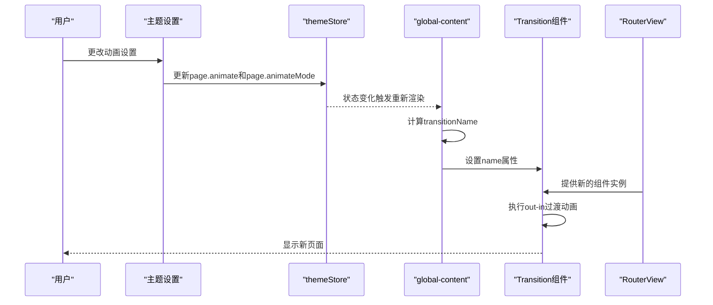
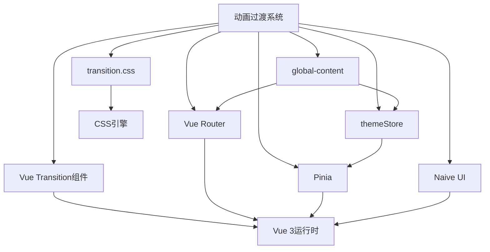

# 动画过渡系统

<cite>
**本文档中引用的文件**   
- [transition.css](file://frontend/src/styles/css/transition.css)
- [global.css](file://frontend/src/styles/css/global.css)
- [App.vue](file://frontend/src/App.vue)
- [global-content/index.vue](file://frontend/src/layouts/modules/global-content/index.vue)
- [app.ts](file://frontend/src/constants/app.ts)
- [index.ts](file://frontend/src/store/modules/theme/index.ts)
</cite>

## 目录
1. [项目结构](#项目结构)
2. [核心组件](#核心组件)
3. [架构概述](#架构概述)
4. [详细组件分析](#详细组件分析)
5. [依赖分析](#依赖分析)

## 项目结构

项目采用分层架构设计，前端代码位于`frontend`目录下，主要包含构建配置、包管理、源代码等部分。源代码（`src`）目录下组织了组件、常量、枚举、钩子、布局、本地化、插件、路由、服务、状态管理、样式、主题、类型定义、工具和视图等模块。

动画过渡系统的核心实现位于`frontend/src/styles/css/transition.css`文件中，该文件定义了多种CSS过渡动画效果。这些样式通过`frontend/src/styles/css/global.css`被全局引入，确保在整个应用中可用。



**Diagram sources**
- [global.css](file://frontend/src/styles/css/global.css#L1-L12)
- [transition.css](file://frontend/src/styles/css/transition.css#L0-L81)
- [App.vue](file://frontend/src/App.vue#L51)
- [global-content/index.vue](file://frontend/src/layouts/modules/global-content/index.vue#L36)

**Section sources**
- [global.css](file://frontend/src/styles/css/global.css#L1-L12)
- [transition.css](file://frontend/src/styles/css/transition.css#L0-L81)

## 核心组件

动画过渡系统的核心组件包括：
- `transition.css`：定义了所有CSS过渡动画的样式规则
- `global-content/index.vue`：实现了基于Vue Transition组件的路由页面过渡逻辑
- `themeStore`：提供动画配置的状态管理
- `App.vue`：应用的根组件，渲染主视图

这些组件协同工作，实现了可配置的页面路由过渡动画效果。

**Section sources**
- [transition.css](file://frontend/src/styles/css/transition.css#L0-L81)
- [global-content/index.vue](file://frontend/src/layouts/modules/global-content/index.vue#L36-L58)
- [App.vue](file://frontend/src/App.vue#L51)

## 架构概述

动画过渡系统基于Vue 3的Transition组件和CSS transition技术构建。系统架构分为三层：

1. **样式层**：在`transition.css`中定义各种CSS动画类
2. **逻辑层**：在`global-content/index.vue`中使用Transition组件，根据主题配置动态选择动画
3. **配置层**：通过Pinia store（`themeStore`）管理动画的启用状态和模式选择

当用户在主题设置中选择不同的动画模式时，`themeStore`中的状态会更新，触发`global-content`组件重新计算过渡名称，从而应用相应的CSS动画。



**Diagram sources**
- [transition.css](file://frontend/src/styles/css/transition.css#L0-L81)
- [global-content/index.vue](file://frontend/src/layouts/modules/global-content/index.vue#L36-L58)
- [index.ts](file://frontend/src/store/modules/theme/index.ts#L1-L100)

## 详细组件分析

### 动画样式实现分析

`transition.css`文件定义了六种不同的页面过渡动画效果，每种效果都遵循Vue的过渡类名约定。

#### 淡入淡出动画
```css
/* fade */
.fade-enter-active,
.fade-leave-active {
  transition: opacity 0.3s ease-in-out;
}
.fade-enter-from,
.fade-leave-to {
  opacity: 0;
}
```
淡入淡出效果通过改变元素的`opacity`属性实现。`fade-enter-active`和`fade-leave-active`类定义了过渡的持续时间（0.3秒）和缓动函数（ease-in-out），而`fade-enter-from`和`fade-leave-to`类将元素的初始或最终透明度设置为0。

#### 滑动进入动画
```css
/* fade-slide */
.fade-slide-leave-active,
.fade-slide-enter-active {
  transition: all 0.3s;
}
.fade-slide-enter-from {
  opacity: 0;
  transform: translateX(-30px);
}
.fade-slide-leave-to {
  opacity: 0;
  transform: translateX(30px);
}
```
滑动进入效果结合了透明度变化和位置移动。进入时，元素从左侧30px位置（`translateX(-30px)`）且完全透明开始，过渡到正常位置和完全不透明。离开时则相反，向右移动30px并变为透明。

#### 底部淡入动画
```css
/* fade-bottom */
.fade-bottom-enter-active,
.fade-bottom-leave-active {
  transition:
    opacity 0.25s,
    transform 0.3s;
}
.fade-bottom-enter-from {
  opacity: 0;
  transform: translateY(-10%);
}
.fade-bottom-leave-to {
  opacity: 0;
  transform: translateY(10%);
}
```
底部淡入效果使用`translateY`进行垂直移动。进入时从上方10%位置开始，离开时移动到下方10%位置。这里分别设置了opacity和transform的不同过渡时间，创造了更丰富的动画效果。

#### 缩放动画
```css
/* fade-scale */
.fade-scale-leave-active,
.fade-scale-enter-active {
  transition: all 0.28s;
}
.fade-scale-enter-from {
  opacity: 0;
  transform: scale(1.2);
}
.fade-scale-leave-to {
  opacity: 0;
  transform: scale(0.8);
}
```
缩放动画通过`scale`变换实现。进入时元素从1.2倍大小缩小到正常大小，离开时从正常大小缩小到0.8倍大小，同时伴随着透明度变化。

#### 缩放淡入动画
```css
/* zoom-fade */
.zoom-fade-enter-active,
.zoom-fade-leave-active {
  transition:
    transform 0.2s,
    opacity 0.3s ease-out;
}
.zoom-fade-enter-from {
  opacity: 0;
  transform: scale(0.92);
}
.zoom-fade-leave-to {
  opacity: 0;
  transform: scale(1.06);
}
```
缩放淡入效果结合了缩放和淡入，但方向相反：进入时从略小（0.92倍）放大到正常，离开时从正常放大到略大（1.06倍）。

#### 缩放消失动画
```css
/* zoom-out */
.zoom-out-enter-active,
.zoom-out-leave-active {
  transition:
    opacity 0.1s ease-in-out,
    transform 0.15s ease-out;
}
.zoom-out-enter-from,
.zoom-out-leave-to {
  opacity: 0;
  transform: scale(0);
}
```
缩放消失效果最为简洁，元素从完全透明且无大小（`scale(0)`）的状态开始或结束，创造出"消失"的视觉效果。



**Diagram sources**
- [transition.css](file://frontend/src/styles/css/transition.css#L0-L81)

**Section sources**
- [transition.css](file://frontend/src/styles/css/transition.css#L0-L81)

### 过渡逻辑实现分析

`global-content/index.vue`文件实现了动画过渡的核心逻辑，使用Vue的Transition组件包裹RouterView。

```vue
<RouterView v-slot="{ Component, route }">
  <Transition
    :name="transitionName"
    mode="out-in"
    @before-leave="appStore.setContentXScrollable(true)"
    @after-leave="resetScroll"
    @after-enter="appStore.setContentXScrollable(false)"
  >
    <KeepAlive :include="routeStore.cacheRoutes" :exclude="routeStore.excludeCacheRoutes">
      <component
        :is="Component"
        v-if="appStore.reloadFlag"
        :key="tabStore.getTabIdByRoute(route)"
        :class="{ 'p-[32px_16px_16px_32px]': showPadding }"
        class="flex-grow bg-layout transition-300"
      />
    </KeepAlive>
  </Transition>
</RouterView>
```

#### 过渡名称绑定
`transitionName`是一个计算属性，其值来源于`themeStore.page.animateMode`：

```typescript
const transitionName = computed(() => (themeStore.page.animate ? themeStore.page.animateMode : ''));
```

当`themeStore.page.animate`为true时，使用`themeStore.page.animateMode`的值作为过渡名称；否则为空字符串，禁用动画。

#### 过渡模式
`mode="out-in"`确保当前页面完全离开后，新页面才开始进入，避免了两个页面同时显示的重叠效果。

#### 生命周期钩子
- `@before-leave`：在离开动画开始前，设置内容区域的X轴可滚动性为true
- `@after-leave`：在离开动画结束后，重置滚动位置到顶部
- `@after-enter`：在进入动画结束后，设置内容区域的X轴可滚动性为false

#### KeepAlive组件
使用KeepAlive组件缓存路由组件实例，提高性能。`:include`和`:exclude`属性根据`routeStore`中的缓存路由配置动态决定哪些组件需要缓存。



**Diagram sources**
- [global-content/index.vue](file://frontend/src/layouts/modules/global-content/index.vue#L36-L58)
- [index.ts](file://frontend/src/store/modules/theme/index.ts#L1-L100)

**Section sources**
- [global-content/index.vue](file://frontend/src/layouts/modules/global-content/index.vue#L36-L58)

### 配置系统分析

动画系统的可配置性通过`themeStore`实现，用户可以在主题设置中开启/关闭动画并选择不同的动画模式。

#### 主题设置界面
在`theme-drawer/modules/page-fun.vue`中，提供了动画设置的UI：

```vue
<SettingItem key="1-1" :label="$t('theme.page.animate')">
  <NSwitch v-model:value="themeStore.page.animate" />
</SettingItem>
<SettingItem v-if="themeStore.page.animate" key="1-2" :label="$t('theme.page.mode.title')">
  <NSelect
    v-model:value="themeStore.page.animateMode"
    :options="translateOptions(themePageAnimationModeOptions)"
    size="small"
    class="w-120px"
  />
</SettingItem>
```

这是一个开关控件，用于启用/禁用页面动画。当动画启用时，显示下拉选择框让用户选择动画模式。

#### 动画模式定义
动画模式的选项在`constants/app.ts`中定义：

```typescript
export const themePageAnimationModeRecord: Record<UnionKey.ThemePageAnimateMode, App.I18n.I18nKey> = {
  'fade-slide': 'theme.page.mode.fade-slide',
  fade: 'theme.page.mode.fade',
  'fade-bottom': 'theme.page.mode.fade-bottom',
  'fade-scale': 'theme.page.mode.fade-scale',
  'zoom-fade': 'theme.page.mode.zoom-fade',
  'zoom-out': 'theme.page.mode.zoom-out',
  none: 'theme.page.mode.none'
};
```

这些键名与`transition.css`中的类名前缀完全对应，确保了配置与样式的无缝衔接。

#### 状态管理
`themeStore`的定义在`store/modules/theme/index.ts`中，它管理着包括动画设置在内的所有主题相关状态。

```mermaid
erDiagram
THEME_STORE {
boolean page.animate
string page.animateMode
string layout.scrollMode
boolean fixedHeaderAndTab
}
ANIMATION_MODES {
string fade-slide
string fade
string fade-bottom
string fade-scale
string zoom-fade
string zoom-out
string none
}
THEME_STORE ||--|| ANIMATION_MODES : "包含"
```

**Diagram sources**
- [page-fun.vue](file://frontend/src/layouts/modules/theme-drawer/modules/page-fun.vue#L26-L59)
- [app.ts](file://frontend/src/constants/app.ts#L36-L64)
- [index.ts](file://frontend/src/store/modules/theme/index.ts#L1-L100)

**Section sources**
- [page-fun.vue](file://frontend/src/layouts/modules/theme-drawer/modules/page-fun.vue#L26-L59)
- [app.ts](file://frontend/src/constants/app.ts#L36-L64)

## 依赖分析

动画过渡系统依赖于多个Vue生态系统组件和项目内部模块。



系统主要依赖：
- **Vue Transition组件**：提供声明式过渡动画的基础能力
- **Vue Router**：提供路由视图和导航功能
- **Pinia**：提供状态管理，存储动画配置
- **Naive UI**：提供UI组件库，包括主题设置中的开关和下拉框
- **CSS引擎**：浏览器的CSS渲染引擎，执行实际的动画效果

这些依赖共同构成了一个完整、可配置的页面路由过渡动画系统。

**Diagram sources**
- [transition.css](file://frontend/src/styles/css/transition.css#L0-L81)
- [global-content/index.vue](file://frontend/src/layouts/modules/global-content/index.vue#L36-L58)
- [index.ts](file://frontend/src/store/modules/theme/index.ts#L1-L100)

**Section sources**
- [transition.css](file://frontend/src/styles/css/transition.css#L0-L81)
- [global-content/index.vue](file://frontend/src/layouts/modules/global-content/index.vue#L36-L58)
- [index.ts](file://frontend/src/store/modules/theme/index.ts#L1-L100)