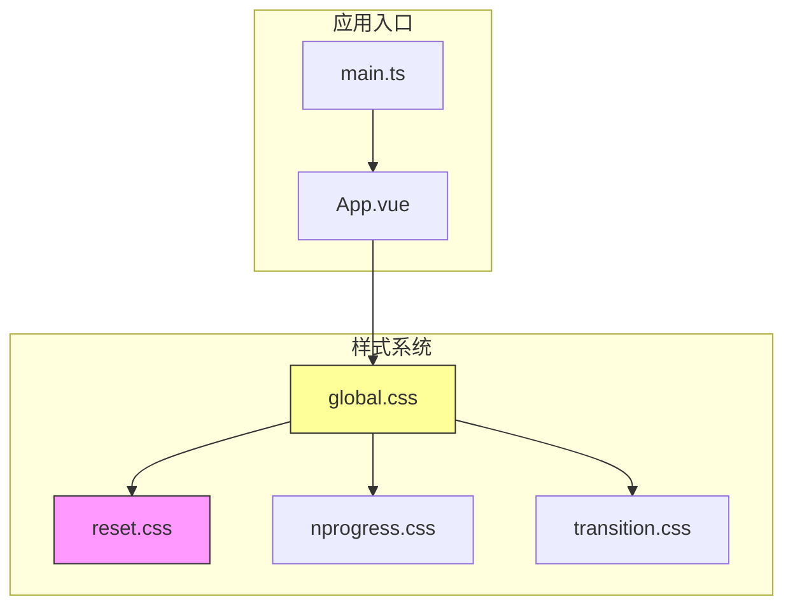
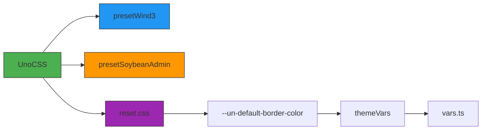
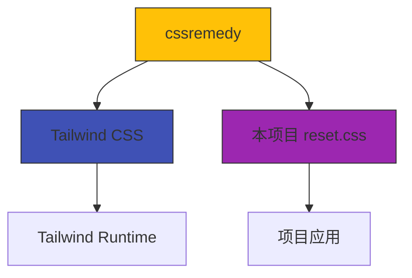
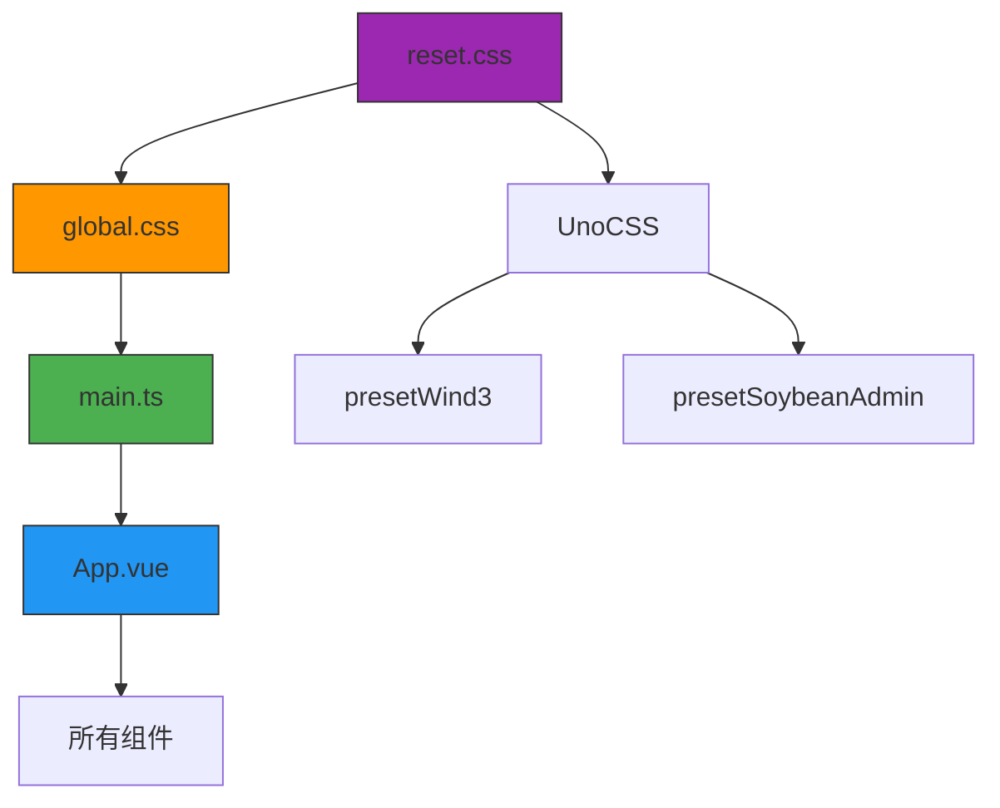

# 基础样式重置

<cite>
**本文档引用文件**  
- [reset.css](file://frontend/src/styles/css/reset.css)
- [global.css](file://frontend/src/styles/css/global.css)
- [uno.config.ts](file://frontend/uno.config.ts)
- [vars.ts](file://frontend/src/theme/vars.ts)
- [index.ts](file://frontend/packages/uno-preset/src/index.ts)
</cite>

## 目录
1. [项目结构](#项目结构)
2. [核心组件](#核心组件)
3. [架构概览](#架构概览)
4. [详细组件分析](#详细组件分析)
5. [依赖分析](#依赖分析)
6. [性能考量](#性能考量)
7. [故障排除指南](#故障排除指南)
8. [结论](#结论)

## 项目结构

项目采用模块化前端架构，`frontend`目录下包含构建配置、UI组件库和核心源码。样式系统位于`frontend/src/styles/css/`目录，由`reset.css`、`global.css`和`nprogress.css`等文件组成。`reset.css`作为基础样式重置文件，被`global.css`通过`@import`引入，确保在应用全局样式前统一浏览器默认行为。



**图示来源**  
- [reset.css](file://frontend/src/styles/css/reset.css)
- [global.css](file://frontend/src/styles/css/global.css)

**本节来源**  
- [reset.css](file://frontend/src/styles/css/reset.css)
- [global.css](file://frontend/src/styles/css/global.css)

## 核心组件

`reset.css`文件实现了全面的浏览器默认样式重置策略，其核心目标是消除跨浏览器渲染差异，为项目建立一致的样式基础。该文件借鉴了`cssremedy`的设计理念，并针对UnoCSS框架进行了优化，通过CSS变量实现主题化支持。

**本节来源**  
- [reset.css](file://frontend/src/styles/css/reset.css)

## 架构概览

项目采用UnoCSS作为原子化CSS引擎，替代了传统的Tailwind CSS。`reset.css`作为UnoCSS生态的一部分，其设计与UnoCSS的预设系统紧密集成。通过`uno.config.ts`配置文件，项目引入了`presetWind3`（Tailwind兼容预设）和自定义的`presetSoybeanAdmin`，形成了独特的样式体系。



**图示来源**  
- [uno.config.ts](file://frontend/uno.config.ts)
- [reset.css](file://frontend/src/styles/css/reset.css)
- [vars.ts](file://frontend/src/theme/vars.ts)

## 详细组件分析

### reset.css 核心重置规则分析

#### 盒模型重置
`reset.css`通过通配符选择器将所有元素的`box-sizing`设置为`border-box`，这是现代CSS重置的核心策略。此设置确保元素的`padding`和`border`包含在`width`和`height`内，简化了布局计算。

```css
*,
::before,
::after {
  box-sizing: border-box;
  border-width: 0;
  border-style: solid;
  border-color: var(--un-default-border-color, #e5e7eb);
}
```

此规则解决了传统`content-box`模型中，添加`padding`或`border`会导致元素实际尺寸超出预期的问题，使布局更加可预测。

**本节来源**  
- [reset.css](file://frontend/src/styles/css/reset.css#L0-L52)

#### 全局排版重置
文件对HTML文档的根元素`html`进行了标准化设置，统一了行高、字体族和文本调整行为，确保跨浏览器的一致性。

```css
html {
  line-height: 1.5;
  -webkit-text-size-adjust: 100%;
  -moz-tab-size: 4;
  tab-size: 4;
  font-family:
    ui-sans-serif,
    system-ui,
    -apple-system,
    BlinkMacSystemFont,
    'Segoe UI',
    Roboto,
    'Helvetica Neue',
    Arial,
    'Noto Sans',
    sans-serif,
    'Apple Color Emoji',
    'Segoe UI Emoji',
    'Segoe UI Symbol',
    'Noto Color Emoji';
}
```

这些设置确保了：
- `line-height: 1.5`提供舒适的阅读行高
- `-webkit-text-size-adjust: 100%`防止iOS设备旋转时自动调整字体大小
- 标准化的`tab-size`改善代码可读性
- 系统优先的字体栈确保最佳渲染效果

**本节来源**  
- [reset.css](file://frontend/src/styles/css/reset.css#L53-L78)

#### 元素间距重置
`reset.css`系统性地清除了HTML元素的默认外边距，包括标题、段落、列表和表单元素，为项目建立干净的布局起点。

```css
body,
h1, h2, h3, h4, h5, h6,
blockquote, dl, dd, hr, figure, p, pre,
fieldset, legend,
ol, ul, menu {
  margin: 0;
}

fieldset {
  padding: 0;
}

legend {
  padding: 0;
}

ol, ul, menu {
  list-style: none;
}
```

这种"零基线"方法强制开发者显式地添加所需间距，避免了不同浏览器默认间距不一致的问题，提高了样式的可预测性。

**本节来源**  
- [reset.css](file://frontend/src/styles/css/reset.css#L278-L301)

#### 表单元素统一化
表单控件在不同浏览器中差异显著，`reset.css`通过继承父元素样式来统一其外观。

```css
button,
input,
optgroup,
select,
textarea {
  font-family: inherit;
  font-size: 100%;
  font-weight: inherit;
  line-height: inherit;
  color: inherit;
  margin: 0;
  padding: 0;
}

button,
[type='button'],
[type='reset'],
[type='submit'] {
  -webkit-appearance: button;
  background-image: none;
}
```

关键点包括：
- 继承字体和颜色属性，确保与周围文本一致
- 重置`-webkit-appearance`以消除浏览器默认按钮样式
- 移除背景图像，为自定义样式提供基础

**本节来源**  
- [reset.css](file://frontend/src/styles/css/reset.css#L140-L203)

#### 媒体元素处理
`reset.css`对图像、视频等替换元素进行了标准化处理，确保它们在布局中表现一致。

```css
img,
svg,
video,
canvas,
audio,
iframe,
embed,
object {
  display: block;
  vertical-align: middle;
}

img,
video {
  max-width: 100%;
  height: auto;
}
```

这些规则确保：
- 媒体元素默认为块级，避免内联元素的基线对齐问题
- `vertical-align: middle`提供更合理的垂直对齐
- `max-width: 100%`实现响应式图像，防止溢出容器

**本节来源**  
- [reset.css](file://frontend/src/styles/css/reset.css#L349-L377)

### 与现代CSS重置方案的对比

#### 与Normalize.css的异同
`reset.css`与`Normalize.css`都旨在解决跨浏览器一致性问题，但采用不同哲学：

- **`reset.css`（本项目）**：采用"重置"哲学，将大多数样式属性归零，建立干净的样式画布。这种方法更激进，强制开发者显式定义所有样式。
- **`Normalize.css`**：采用"标准化"哲学，保留有用的默认样式，仅修正浏览器间的差异。它更温和，保留了部分可访问性友好的默认行为。

本项目选择`reset.css`方案，因为它与UnoCSS的原子化设计理念更契合，为组件化开发提供了更一致的基础。

**本节来源**  
- [reset.css](file://frontend/src/styles/css/reset.css)

#### 与Tailwind CSS的关联
通过分析`homepage/css/tailwind-runtime.css`，可以发现`reset.css`的实现与Tailwind CSS高度相似，特别是盒模型和字体设置部分。这表明`reset.css`可能直接借鉴了Tailwind的`base`样式，或共同参考了`cssremedy`项目。



**图示来源**  
- [reset.css](file://frontend/src/styles/css/reset.css)
- [tailwind-runtime.css](file://homepage/css/tailwind-runtime.css)

**本节来源**  
- [reset.css](file://frontend/src/styles/css/reset.css)
- [tailwind-runtime.css](file://homepage/css/tailwind-runtime.css)

### UnoCSS集成与主题化

#### CSS变量集成
`reset.css`中的`border-color: var(--un-default-border-color, #e5e7eb)`展示了与UnoCSS的深度集成。`--un-default-border-color`是UnoCSS的内置变量，允许通过主题配置覆盖默认边框颜色。

```typescript
// uno.config.ts
import { defineConfig } from '@unocss/vite';
import { presetWind3 } from '@unocss/preset-wind3';
import { presetSoybeanAdmin } from '@sa/uno-preset';
import { themeVars } from './src/theme/vars';

export default defineConfig<Theme>({
  theme: {
    ...themeVars,
    // 其他主题配置
  },
  presets: [presetWind3({ dark: 'class' }), presetSoybeanAdmin()]
});
```

#### 主题变量系统
主题变量在`vars.ts`中定义，通过`themeVars`对象暴露给UnoCSS，实现了设计系统的集中管理。

```typescript
// vars.ts
export const themeVars: App.Theme.ThemeTokenCSSVars = {
  colors: {
    'nprogress': 'rgb(var(--nprogress-color))',
    'container': 'rgb(var(--container-bg-color))',
    // 其他颜色变量
  },
  boxShadow: {
    header: 'var(--header-box-shadow)',
    // 其他阴影变量
  }
};
```

这种架构实现了样式与逻辑的分离，支持动态主题切换。

**本节来源**  
- [uno.config.ts](file://frontend/uno.config.ts#L0-L31)
- [vars.ts](file://frontend/src/theme/vars.ts#L0-L35)
- [reset.css](file://frontend/src/styles/css/reset.css#L0-L52)

## 依赖分析

`reset.css`作为样式系统的基础层，被`global.css`直接依赖，并通过`main.ts`中的样式导入影响整个应用。其设计依赖于UnoCSS的预设系统，特别是`presetWind3`提供的Tailwind兼容类名。



**图示来源**  
- [reset.css](file://frontend/src/styles/css/reset.css)
- [global.css](file://frontend/src/styles/css/global.css)
- [main.ts](file://frontend/src/main.ts)
- [uno.config.ts](file://frontend/uno.config.ts)

**本节来源**  
- [reset.css](file://frontend/src/styles/css/reset.css)
- [global.css](file://frontend/src/styles/css/global.css)
- [uno.config.ts](file://frontend/uno.config.ts)

## 性能考量

`reset.css`采用通配符选择器（`*`），虽然可能引发性能担忧，但在现代浏览器中，这种影响微乎其微。更重要的是，它通过减少浏览器默认样式的计算和重排，实际上可能提升整体渲染性能。此外，文件被UnoCSS处理后，未使用的重置规则会被自动移除，进一步优化了最终的CSS体积。

## 故障排除指南

### 常见问题
1. **边框颜色不生效**：检查`--un-default-border-color`变量是否在主题中正确定义。
2. **字体显示异常**：确认`html`元素的`font-family`栈是否被意外覆盖。
3. **表单元素样式错乱**：检查是否遗漏了对`button`、`input`等元素的显式样式定义。

### 调试技巧
- 使用浏览器开发者工具检查元素的计算样式，确认重置规则是否应用。
- 在`global.css`中临时注释`@import './reset.css'`，观察样式变化以定位问题。

**本节来源**  
- [reset.css](file://frontend/src/styles/css/reset.css)
- [global.css](file://frontend/src/styles/css/global.css)

## 结论

`reset.css`文件通过系统性的浏览器默认样式重置，为项目建立了坚实、一致的样式基础。其设计融合了`cssremedy`的现代理念和UnoCSS的工程化优势，通过CSS变量支持主题化，与项目的整体技术栈深度集成。相比`Normalize.css`，它提供了更彻底的样式控制，更适合组件化和原子化CSS的开发模式。该文件不仅是样式重置工具，更是项目设计系统的重要组成部分，确保了跨浏览器、跨组件的一致用户体验。