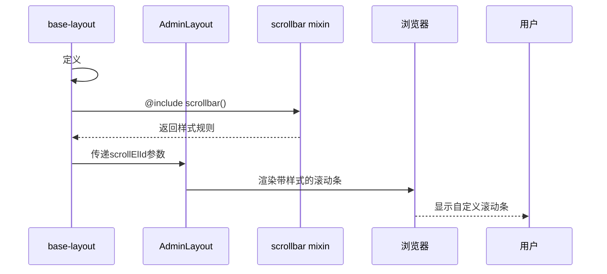
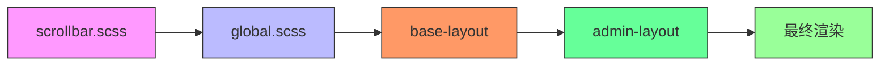

# 滚动条定制

<cite>
**本文档引用的文件**   
- [scrollbar.scss](file://frontend/src/styles/scss/scrollbar.scss)
- [global.scss](file://frontend/src/styles/scss/global.scss)
- [base-layout/index.vue](file://frontend/src/layouts/base-layout/index.vue)
- [admin-layout/shared.ts](file://frontend/packages/materials/src/libs/admin-layout/shared.ts)
- [admin-layout/index.vue](file://frontend/packages/materials/src/libs/admin-layout/index.vue)
</cite>

## 目录
1. [简介](#简介)
2. [项目结构](#项目结构)
3. [核心组件](#核心组件)
4. [架构概述](#架构概述)
5. [详细组件分析](#详细组件分析)
6. [依赖分析](#依赖分析)
7. [性能考虑](#性能考虑)
8. [故障排除指南](#故障排除指南)
9. [结论](#结论)

## 简介
本文档深入解析了PaiSmart项目中自定义滚动条的SCSS实现方案。重点分析了`scrollbar.scss`文件如何使用WebKit伪元素选择器定义滚动条的视觉样式，包括轨道、滑块、箭头的颜色、尺寸和圆角等属性。文档详细说明了hover、active等状态下的交互样式变化，以及如何通过SCSS mixin实现主题化配置。同时，解释了该实现的浏览器兼容性限制，并说明了在非WebKit内核浏览器中的降级处理策略。最后，通过实际代码示例展示了该样式在BetterScroll组件中的应用效果。

## 项目结构
项目中的滚动条样式实现主要分布在样式文件和布局组件中。核心的滚动条样式定义位于`frontend/src/styles/scss/`目录下，而其应用则贯穿于布局组件中。

```mermaid
graph TB
subgraph "样式系统"
scrollbar[scrollbar.scss]
global[global.scss]
end
subgraph "布局组件"
baseLayout[base-layout/index.vue]
adminLayout[admin-layout/index.vue]
end
scrollbar --> global : "@forward导入"
global --> baseLayout : "全局可用"
baseLayout --> adminLayout : "使用滚动条样式"
```

**Diagram sources**
- [scrollbar.scss](file://frontend/src/styles/scss/scrollbar.scss)
- [global.scss](file://frontend/src/styles/scss/global.scss)
- [base-layout/index.vue](file://frontend/src/layouts/base-layout/index.vue)

## 核心组件
滚动条定制的核心实现位于`scrollbar.scss`文件中，通过SCSS mixin的方式提供可复用的滚动条样式定义。该mixin被`global.scss`全局导入，使得整个项目都可以使用自定义滚动条样式。

**Section sources**
- [scrollbar.scss](file://frontend/src/styles/scss/scrollbar.scss#L0-L20)
- [global.scss](file://frontend/src/styles/scss/global.scss#L0)

## 架构概述
项目的滚动条定制架构采用分层设计模式，从底层样式定义到上层组件应用形成了清晰的层次结构。样式系统通过SCSS模块化机制实现，而组件系统则通过Vue的布局组件集成这些样式。

```mermaid
graph TD
A["SCSS样式层"] --> B["组件应用层"]
B --> C["最终渲染"]
subgraph "SCSS样式层"
A1[scrollbar.scss]
A2[global.scss]
end
subgraph "组件应用层"
B1[base-layout]
B2[admin-layout]
end
subgraph "最终渲染"
C1[浏览器渲染]
C2[用户交互]
end
A1 --> |@forward| A2
A2 --> |全局可用| B1
B1 --> |应用样式| B2
B2 --> C1
C1 --> C2
```

**Diagram sources**
- [scrollbar.scss](file://frontend/src/styles/scss/scrollbar.scss)
- [global.scss](file://frontend/src/styles/scss/global.scss)
- [base-layout/index.vue](file://frontend/src/layouts/base-layout/index.vue)

## 详细组件分析

### 滚动条样式实现分析
`scrollbar.scss`文件通过SCSS mixin实现了可配置的自定义滚动条样式，支持参数化配置滚动条的尺寸和颜色。

#### 样式实现细节
```scss
@mixin scrollbar($size: 7px, $color: rgba(0, 0, 0, 0.5)) {
  scrollbar-width: thin;
  scrollbar-color: $color transparent;

  &::-webkit-scrollbar-thumb {
    background-color: $color;
    border-radius: $size;
  }
  &::-webkit-scrollbar-thumb:hover {
    background-color: $color;
    border-radius: $size;
  }
  &::-webkit-scrollbar {
    width: $size;
    height: $size;
  }
  &::-webkit-scrollbar-track-piece {
    background-color: rgba(0, 0, 0, 0);
    border-radius: 0;
  }
}
```

上述代码定义了一个名为`scrollbar`的SCSS mixin，接受两个参数：
- `$size`: 滚动条的尺寸，默认为7px
- `$color`: 滚动条滑块的颜色，默认为半透明黑色

该mixin使用了WebKit特有的伪元素选择器来定制滚动条的各个部分：
- `::-webkit-scrollbar`: 定义滚动条的整体样式
- `::-webkit-scrollbar-thumb`: 定义滚动条滑块的样式
- `::-webkit-scrollbar-track-piece`: 定义滚动条轨道的样式

**Diagram sources**
- [scrollbar.scss](file://frontend/src/styles/scss/scrollbar.scss#L0-L20)

### 布局组件集成分析
自定义滚动条样式在`base-layout/index.vue`组件中被实际应用，通过特定的元素ID将样式应用到布局的滚动区域。

#### 样式应用流程


**Diagram sources**
- [base-layout/index.vue](file://frontend/src/layouts/base-layout/index.vue#L140-L148)
- [admin-layout/index.vue](file://frontend/packages/materials/src/libs/admin-layout/index.vue)

#### 实际应用代码
在`base-layout/index.vue`文件中，通过以下代码应用滚动条样式：

```vue
<style lang="scss">
#__SCROLL_EL_ID__ {
  @include scrollbar();
}
</style>
```

这里使用了SCSS的`@include`指令来调用`scrollbar` mixin，将自定义样式应用到ID为`__SCROLL_EL_ID__`的元素上。这个ID在`admin-layout/shared.ts`中定义为常量：

```ts
export const LAYOUT_SCROLL_EL_ID = '__SCROLL_EL_ID__';
```

**Section sources**
- [base-layout/index.vue](file://frontend/src/layouts/base-layout/index.vue#L140-L148)
- [admin-layout/shared.ts](file://frontend/packages/materials/src/libs/admin-layout/shared.ts#L3)

## 依赖分析
滚动条样式系统的依赖关系清晰，形成了从样式定义到组件应用的完整链条。



**Diagram sources**
- [scrollbar.scss](file://frontend/src/styles/scss/scrollbar.scss)
- [global.scss](file://frontend/src/styles/scss/global.scss)
- [base-layout/index.vue](file://frontend/src/layouts/base-layout/index.vue)
- [admin-layout/index.vue](file://frontend/packages/materials/src/libs/admin-layout/index.vue)

## 性能考虑
自定义滚动条样式的实现对性能影响较小，主要考虑以下几点：

1. **样式复用**: 通过SCSS mixin实现样式复用，避免了重复代码
2. **轻量级**: 样式规则简单，不会增加过多的CSS文件体积
3. **浏览器优化**: WebKit的滚动条渲染已经过优化，自定义样式不会显著影响滚动性能
4. **条件应用**: 样式只在需要的元素上应用，避免全局污染

然而，需要注意的是，自定义滚动条样式仅在WebKit内核浏览器中生效，在其他浏览器中会回退到默认样式，这需要在用户体验设计时予以考虑。

## 故障排除指南
在使用自定义滚动条样式时，可能会遇到以下常见问题：

1. **样式不生效**: 确保`global.scss`已正确导入`scrollbar.scss`，并且组件中正确引用了mixin
2. **浏览器兼容性**: 在非WebKit浏览器中，自定义样式不会生效，应确保在这些浏览器中用户体验仍然良好
3. **ID冲突**: 确保`__SCROLL_EL_ID__`在页面中唯一，避免样式应用错误
4. **参数配置**: 正确配置mixin的参数，避免尺寸或颜色设置不当导致视觉问题

**Section sources**
- [scrollbar.scss](file://frontend/src/styles/scss/scrollbar.scss#L0-L20)
- [base-layout/index.vue](file://frontend/src/layouts/base-layout/index.vue#L140-L148)

## 结论
PaiSmart项目中的滚动条定制方案采用了现代化的SCSS模块化设计，通过mixin实现了可复用、可配置的自定义滚动条样式。该方案具有以下优点：

1. **模块化**: 样式定义与应用分离，便于维护和复用
2. **可配置**: 通过参数支持尺寸和颜色的自定义
3. **渐进增强**: 在支持的浏览器中提供增强体验，在不支持的浏览器中优雅降级
4. **集成良好**: 与项目的布局组件无缝集成，提供一致的用户体验

该实现方案为项目提供了美观且一致的滚动条体验，同时保持了良好的可维护性和扩展性。