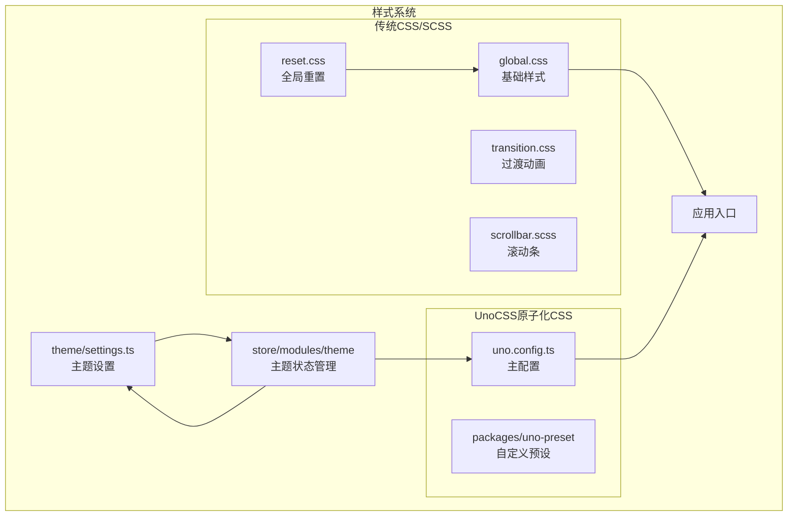
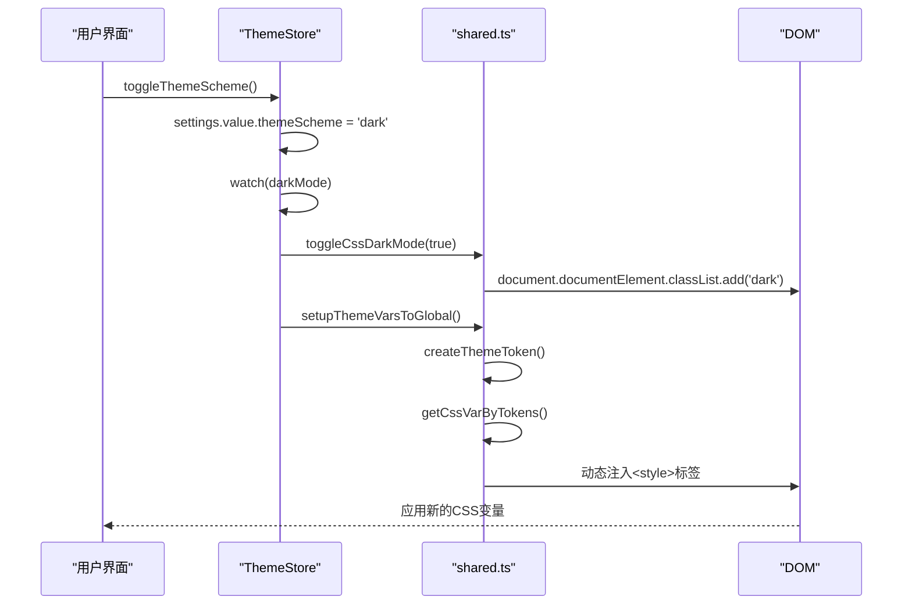

# 样式方案

<cite>
**本文档引用的文件**   
- [uno.config.ts](file://frontend/uno.config.ts)
- [reset.css](file://frontend/src/styles/css/reset.css)
- [global.css](file://frontend/src/styles/css/global.css)
- [transition.css](file://frontend/src/styles/css/transition.css)
- [scrollbar.scss](file://frontend/src/styles/scss/scrollbar.scss)
- [settings.ts](file://frontend/src/theme/settings.ts)
- [vars.ts](file://frontend/src/theme/vars.ts)
- [index.ts](file://frontend/packages/uno-preset/src/index.ts)
- [shared.ts](file://frontend/src/store/modules/theme/shared.ts)
- [index.ts](file://frontend/src/store/modules/theme/index.ts)
</cite>

## 目录
1. [项目结构概览](#项目结构概览)
2. [全局样式重置与基础样式](#全局样式重置与基础样式)
3. [UnoCSS原子化CSS集成](#unocss原子化css集成)
4. [主题系统与暗黑模式](#主题系统与暗黑模式)
5. [响应式设计与动画](#响应式设计与动画)
6. [自定义滚动条样式](#自定义滚动条样式)

## 项目结构概览

本项目采用前后端分离架构，前端位于`frontend`目录下，其样式系统主要由两部分构成：传统的CSS/SCSS文件和现代的UnoCSS原子化CSS框架。样式文件集中存放在`frontend/src/styles`目录中，分为`css`和`scss`两个子目录。



**Diagram sources**
- [frontend/src/styles/css/reset.css](file://frontend/src/styles/css/reset.css)
- [frontend/src/styles/css/global.css](file://frontend/src/styles/css/global.css)
- [frontend/src/styles/css/transition.css](file://frontend/src/styles/css/transition.css)
- [frontend/src/styles/scss/scrollbar.scss](file://frontend/src/styles/scss/scrollbar.scss)
- [frontend/uno.config.ts](file://frontend/uno.config.ts)
- [frontend/packages/uno-preset/src/index.ts](file://frontend/packages/uno-preset/src/index.ts)
- [frontend/src/theme/settings.ts](file://frontend/src/theme/settings.ts)
- [frontend/src/store/modules/theme/index.ts](file://frontend/src/store/modules/theme/index.ts)

**Section sources**
- [frontend/src/styles](file://frontend/src/styles)
- [frontend/uno.config.ts](file://frontend/uno.config.ts)

## 全局样式重置与基础样式

### 样式重置规则 (reset.css)

`reset.css`文件基于现代CSS重置理念，旨在消除不同浏览器间的默认样式差异，为项目提供一个一致的样式基础。它借鉴了Tailwind CSS等现代框架的重置策略。

```css
*,
::before,
::after {
  box-sizing: border-box;
  border-width: 0;
  border-style: solid;
  border-color: var(--un-default-border-color, #e5e7eb);
}
```

**关键重置规则**:
- **盒模型统一**: 所有元素默认使用`border-box`盒模型，确保`padding`和`border`不会增加元素的总宽度。
- **边框控制**: 默认移除边框，并允许通过CSS变量`--un-default-border-color`统一控制默认边框颜色。
- **字体继承**: 表单元素（如`button`, `input`）继承父元素的字体、颜色和行高等样式，保证视觉一致性。
- **列表与边距**: 移除`ul`, `ol`, `p`, `h1-h6`等元素的默认外边距和列表样式，为原子化CSS的精确控制铺平道路。
- **图片约束**: 图片和视频默认设置`max-width: 100%`和`height: auto`，确保它们在容器内响应式缩放，防止溢出。

**Section sources**
- [frontend/src/styles/css/reset.css](file://frontend/src/styles/css/reset.css#L1-L379)

### 全局基础样式 (global.css)

`global.css`是项目全局样式的入口文件，它通过`@import`指令引入了所有基础CSS文件，并定义了应用的根级布局。

```css
@import './reset.css';
@import './nprogress.css';
@import './transition.css';

html,
body,
#app {
  height: 100%;
}

html {
  overflow-x: hidden;
}
```

**功能解析**:
- **样式聚合**: 作为单一入口，集中管理`reset.css`、`transition.css`和`nprogress.css`（第三方进度条样式），简化了在`main.ts`中的引入。
- **全屏布局**: 确保`html`、`body`和根元素`#app`的高度占满整个视口，这是实现全屏应用布局的基础。
- **水平滚动控制**: 隐藏`html`元素的水平滚动条，防止因内容溢出导致不必要的滚动。

**Section sources**
- [frontend/src/styles/css/global.css](file://frontend/src/styles/css/global.css#L1-L14)

### 页面过渡动画 (transition.css)

`transition.css`文件定义了一系列Vue组件的过渡动画类，用于提升用户界面的交互体验。

```css
/* fade */
.fade-enter-active,
.fade-leave-active {
  transition: opacity 0.3s ease-in-out;
}
.fade-enter-from,
.fade-leave-to {
  opacity: 0;
}

/* fade-slide */
.fade-slide-enter-from {
  opacity: 0;
  transform: translateX(-30px);
}
.fade-slide-leave-to {
  opacity: 0;
  transform: translateX(30px);
}
```

**动画类型**:
- **淡入淡出 (fade)**: 基础的透明度变化动画。
- **滑动淡出 (fade-slide)**: 结合透明度和X轴平移，常用于页面或侧边栏的切换。
- **底部淡出 (fade-bottom)**: 结合透明度和Y轴平移，模拟从底部弹出或消失的效果。
- **缩放淡出 (fade-scale)**: 通过缩放实现的淡入淡出，适用于模态框。
- **缩放 (zoom-fade/zoom-out)**: 更精细的缩放动画，提供不同的视觉反馈。

这些动画类可直接在Vue的`<Transition>`组件中使用，例如`<Transition name="fade-slide">`。

**Section sources**
- [frontend/src/styles/css/transition.css](file://frontend/src/styles/css/transition.css#L1-L83)

## UnoCSS原子化CSS集成

### UnoCSS主配置 (uno.config.ts)

`uno.config.ts`是UnoCSS的核心配置文件，它定义了如何生成和应用原子化CSS类。

```typescript
import { defineConfig } from '@unocss/vite';
import { presetWind3 } from '@unocss/preset-wind3';
import { presetSoybeanAdmin } from '@sa/uno-preset';
import { themeVars } from './src/theme/vars';

export default defineConfig<Theme>({
  theme: {
    ...themeVars,
    fontSize: {
      'icon-xs': '0.875rem',
      'icon-small': '1rem',
      icon: '1.125rem',
      'icon-large': '1.5rem',
      'icon-xl': '2rem'
    }
  },
  shortcuts: {
    'card-wrapper': 'rd-4 shadow-2xl dark:shadow-[0_25px_50px_-12px_rgba(27,27,27,0.1)]',
    'flex-cc': 'flex items-center justify-center'
  },
  transformers: [transformerDirectives(), transformerVariantGroup()],
  presets: [presetWind3({ dark: 'class' }), presetSoybeanAdmin()]
});
```

**配置解析**:
- **预设 (Presets)**:
  - `presetWind3`: 采用类似Tailwind CSS的Wind CSS预设，提供`p-4`, `text-lg`, `bg-red-500`等熟悉的原子类。
  - `presetSoybeanAdmin`: 集成项目自定义的`uno-preset`，扩展了设计系统。
- **主题 (Theme)**: 将`theme/vars.ts`中定义的CSS变量注入UnoCSS主题，使得`bg-container`、`text-base-text`等类可以动态响应主题变化。
- **快捷方式 (Shortcuts)**: 定义了`card-wrapper`（卡片容器）和`flex-cc`（弹性居中）等复合类，将常用样式组合封装，提高开发效率。
- **转换器 (Transformers)**:
  - `transformerVariantGroup`: 支持`@(hover:underline focus:underline)`这样的变体组语法。
  - `transformerDirectives`: 支持`@apply`指令，可在SCSS文件中应用UnoCSS类。

**Section sources**
- [frontend/uno.config.ts](file://frontend/uno.config.ts#L1-L32)

### 自定义UnoCSS预设 (uno-preset)

`packages/uno-preset`是项目的核心设计系统扩展，它通过UnoCSS预设的形式，将项目特有的布局模式和快捷方式注入到原子化CSS系统中。

```typescript
export function presetSoybeanAdmin(): Preset<Theme> {
  const preset: Preset<Theme> = {
    name: 'preset-soybean-admin',
    shortcuts: [
      {
        'flex-center': 'flex justify-center items-center',
        'flex-x-center': 'flex justify-center',
        'flex-y-center': 'flex items-center',
        'flex-col': 'flex flex-col',
        'flex-col-center': 'flex-center flex-col'
      },
      {
        'absolute-lt': 'absolute left-0 top-0',
        'absolute-center': 'absolute-lt flex-center size-full',
        'fixed-center': 'fixed-lt flex-center size-full'
      },
      {
        'nowrap-hidden': 'overflow-hidden whitespace-nowrap',
        'ellipsis-text': 'nowrap-hidden text-ellipsis'
      }
    ]
  };
  return preset;
}
```

**预设功能**:
- **弹性布局快捷方式**: 提供了比原生更语义化的弹性布局类，如`flex-center`（水平垂直居中）、`flex-col-center`（纵向居中）。
- **定位快捷方式**: 封装了绝对定位和固定定位的常用组合，如`absolute-center`（绝对居中）、`fixed-center`（固定居中）。
- **文本处理**: `ellipsis-text`一键实现文本溢出省略，是`overflow-hidden`, `whitespace-nowrap`, `text-ellipsis`的组合。

这种预设机制使得团队可以建立一套统一、高效的UI开发规范。

**Section sources**
- [frontend/packages/uno-preset/src/index.ts](file://frontend/packages/uno-preset/src/index.ts#L1-L56)

## 主题系统与暗黑模式

### 主题变量与设置 (settings.ts & vars.ts)

主题系统由`settings.ts`和`vars.ts`两个文件共同驱动。

- **`settings.ts`**: 定义了主题的配置项和默认值。
  ```typescript
  export const themeSettings: App.Theme.ThemeSetting = {
    themeScheme: 'auto', // 主题模式: light, dark, auto
    themeColor: '#646cff', // 主题色
    tokens: { // 深色/浅色模式下的具体颜色值
      light: { colors: { container: 'rgb(255, 255, 255)' } },
      dark: { colors: { container: 'rgb(28, 28, 28)' } }
    }
  };
  ```
- **`vars.ts`**: 定义了CSS变量的映射关系，将UnoCSS主题与实际的CSS变量关联。
  ```typescript
  export const themeVars: App.Theme.ThemeTokenCSSVars = {
    colors: {
      container: 'rgb(var(--container-bg-color))',
      'base-text': 'rgb(var(--base-text-color))'
    }
  };
  ```

**Section sources**
- [frontend/src/theme/settings.ts](file://frontend/src/theme/settings.ts#L1-L50)
- [frontend/src/theme/vars.ts](file://frontend/src/theme/vars.ts#L1-L36)

### 主题状态管理 (theme store)

主题状态由Pinia的`useThemeStore`管理，它是一个复杂的响应式系统。



**工作流程**:
1. **用户交互**: 用户在UI上切换主题模式。
2. **状态更新**: `useThemeStore`中的`settings`状态被更新。
3. **计算属性**: `darkMode`计算属性根据`settings`和操作系统偏好自动计算。
4. **副作用**: `watch`监听器被触发。
5. **DOM操作**: `toggleCssDarkMode`函数向`html`元素添加或移除`dark`类。
6. **CSS变量注入**: `setupThemeVarsToGlobal`函数根据当前主题色，动态生成包含`--primary-color`, `--container-bg-color`等变量的CSS代码，并注入到`<head>`中。
7. **样式生效**: UnoCSS生成的类（如`bg-container`）引用这些CSS变量，从而实现主题的实时切换。

**Section sources**
- [frontend/src/store/modules/theme/index.ts](file://frontend/src/store/modules/theme/index.ts#L1-L222)
- [frontend/src/store/modules/theme/shared.ts](file://frontend/src/store/modules/theme/shared.ts#L1-L259)

## 响应式设计与动画

项目的响应式设计主要依赖于UnoCSS的内置变体，如`sm:`, `md:`, `lg:`等。例如，`md:flex`表示在中等屏幕及以上显示为弹性布局。

动画系统则结合了`transition.css`中定义的Vue过渡类和UnoCSS的`transition-*`、`duration-*`、`ease-*`等原子类，提供了灵活的动画控制能力。

## 自定义滚动条样式

`scrollbar.scss`文件通过一个SCSS混合宏`@mixin scrollbar`来定义自定义滚动条。

```scss
@mixin scrollbar($size: 7px, $color: rgba(0, 0, 0, 0.5)) {
  scrollbar-width: thin;
  scrollbar-color: $color transparent;

  &::-webkit-scrollbar-thumb {
    background-color: $color;
    border-radius: $size;
  }
  &::-webkit-scrollbar {
    width: $size;
    height: $size;
  }
}
```

**使用方式**:
该SCSS文件并未被全局引入，而是需要在特定组件中按需引入并调用`@include scrollbar()`。这体现了SCSS的模块化优势，可以为不同区域（如侧边栏、内容区）定制不同风格的滚动条。

**Section sources**
- [frontend/src/styles/scss/scrollbar.scss](file://frontend/src/styles/scss/scrollbar.scss#L1-L22)