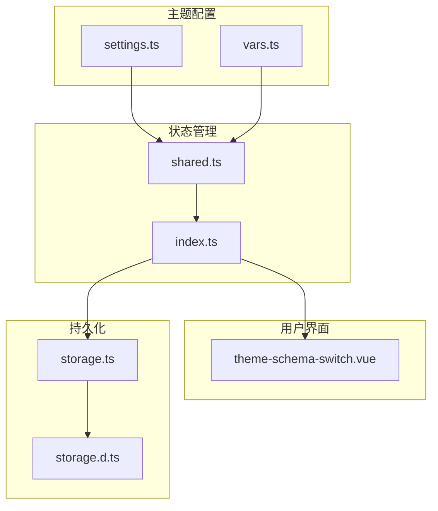
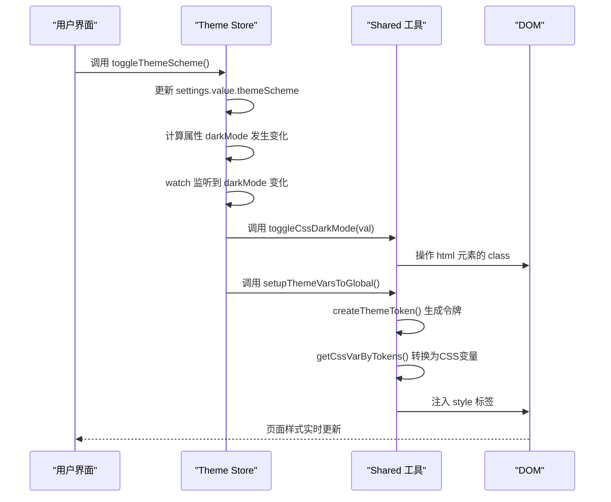
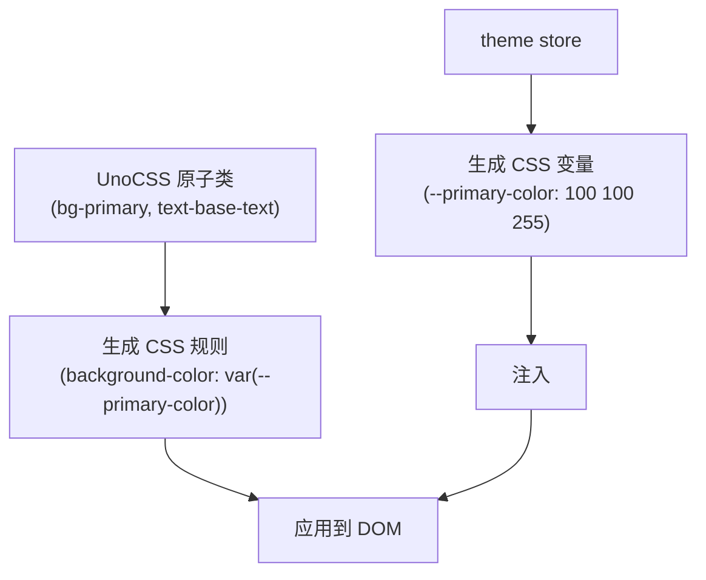

# 主题系统

<cite>
**本文档中引用的文件**   
- [settings.ts](file://frontend/src/theme/settings.ts)
- [vars.ts](file://frontend/src/theme/vars.ts)
- [index.ts](file://frontend/src/store/modules/theme/index.ts)
- [shared.ts](file://frontend/src/store/modules/theme/shared.ts)
- [theme-schema-switch.vue](file://frontend/src/components/common/theme-schema-switch.vue)
- [storage.d.ts](file://frontend/src/typings/storage.d.ts)
- [app.ts](file://frontend/src/plugins/app.ts)
- [global.d.ts](file://frontend/src/typings/global.d.ts)
- [vite.config.ts](file://frontend/vite.config.ts)
</cite>

## 目录
1. [项目结构](#项目结构)
2. [核心组件](#核心组件)
3. [架构概述](#架构概述)
4. [详细组件分析](#详细组件分析)
5. [依赖分析](#依赖分析)
6. [性能考虑](#性能考虑)
7. [故障排除指南](#故障排除指南)
8. [结论](#结论)

## 项目结构

主题系统主要由以下几个核心模块构成，分布在不同的目录中：

- **主题配置**：`frontend/src/theme/` 目录下的 `settings.ts` 和 `vars.ts` 文件，定义了主题的默认配置和CSS变量体系。
- **状态管理**：`frontend/src/store/modules/theme/` 目录下的 `index.ts` 和 `shared.ts` 文件，使用Pinia管理主题状态。
- **用户界面**：`frontend/src/components/common/theme-schema-switch.vue` 组件，提供主题切换的UI。
- **持久化**：`frontend/src/utils/storage.ts` 和 `frontend/src/typings/storage.d.ts`，处理配置的本地存储。



**图示来源**
- [settings.ts](file://frontend/src/theme/settings.ts)
- [vars.ts](file://frontend/src/theme/vars.ts)
- [index.ts](file://frontend/src/store/modules/theme/index.ts)
- [shared.ts](file://frontend/src/store/modules/theme/shared.ts)
- [theme-schema-switch.vue](file://frontend/src/components/common/theme-schema-switch.vue)
- [storage.d.ts](file://frontend/src/typings/storage.d.ts)

## 核心组件

主题系统的核心是通过**主题配置**、**状态管理**和**CSS变量注入**三者协同工作，实现动态主题切换。系统首先在 `settings.ts` 中定义默认主题配置，然后通过 `theme store` 管理这些配置的状态。当用户更改主题时，`shared.ts` 中的工具函数会根据最新的状态生成CSS变量，并注入到全局样式中，从而实现样式的实时更新。整个过程通过 `localStorage` 持久化用户偏好，确保刷新后配置不丢失。

**组件来源**
- [settings.ts](file://frontend/src/theme/settings.ts#L0-L48)
- [index.ts](file://frontend/src/store/modules/theme/index.ts#L0-L221)
- [shared.ts](file://frontend/src/store/modules/theme/shared.ts#L0-L259)

## 架构概述

动态主题系统的整体架构遵循“配置-状态-样式”的设计模式。系统启动时，从 `settings.ts` 读取默认配置，并结合 `localStorage` 中的持久化数据初始化 `theme store`。该store暴露计算属性（如 `darkMode`）和操作方法（如 `setThemeScheme`）。当store状态变化时，通过 `watch` 监听器触发副作用：调用 `addThemeVarsToGlobal` 将最新的主题令牌（tokens）转换为CSS变量并注入DOM。用户界面组件（如 `theme-schema-switch.vue`）通过调用store的action来触发状态变更，形成一个完整的闭环。



**图示来源**
- [index.ts](file://frontend/src/store/modules/theme/index.ts#L0-L221)
- [shared.ts](file://frontend/src/store/modules/theme/shared.ts#L0-L259)

## 详细组件分析

### 主题配置分析

`settings.ts` 文件定义了应用的默认主题配置对象 `themeSettings`，其结构设计非常全面，涵盖了布局、颜色、动画等多个维度。

#### 配置对象结构

```typescript
export const themeSettings: App.Theme.ThemeSetting = {
  themeScheme: 'auto', // 主题方案：亮色、暗色、自动
  grayscale: false, // 是否开启灰度模式
  colourWeakness: false, // 是否开启色弱模式
  recommendColor: true, // 是否使用推荐色板
  themeColor: '#646cff', // 主题色
  otherColor: { info: '#2080f0', success: '#52c41a', warning: '#faad14', error: '#f5222d' }, // 其他颜色
  isInfoFollowPrimary: true, // info色是否跟随主题色
  layout: { mode: 'vertical', scrollMode: 'content', reverseHorizontalMix: false }, // 布局模式
  header: { height: 56, breadcrumb: { visible: false, showIcon: true } }, // 头部配置
  tab: { visible: false, cache: true, height: 44, mode: 'chrome' }, // 标签页配置
  tokens: { // 主题令牌，用于生成CSS变量
    light: { colors: { container: 'rgb(255, 255, 255)', layout: 'rgb(247, 250, 252)' } },
    dark: { colors: { container: 'rgb(28, 28, 28)', layout: 'rgb(18, 18, 18)' } }
  }
};
```

该配置对象的结构清晰地分为几个部分：
- **基础模式**：`themeScheme`, `grayscale`, `colourWeakness` 控制全局视觉模式。
- **颜色方案**：`themeColor`, `otherColor` 定义了主色调和辅助色。
- **布局配置**：`layout`, `header`, `tab`, `sider` 等对象分别管理不同区域的布局参数。
- **主题令牌**：`tokens` 对象包含了亮色和暗色模式下的具体颜色值，是生成CSS变量的基础。

**组件来源**
- [settings.ts](file://frontend/src/theme/settings.ts#L0-L48)

### CSS变量体系分析

`vars.ts` 文件定义了应用的CSS变量体系，它与UnoCSS集成，为动态主题提供了样式基础。

#### CSS变量定义

```typescript
/** Theme vars */
export const themeVars: App.Theme.ThemeTokenCSSVars = {
  colors: {
    primary: 'rgb(var(--primary-color))',
    'primary-500': 'rgb(var(--primary-500-color))',
    nprogress: 'rgb(var(--nprogress-color))',
    container: 'rgb(var(--container-bg-color))',
    layout: 'rgb(var(--layout-bg-color))',
    'base-text': 'rgb(var(--base-text-color))'
  },
  boxShadow: {
    header: 'var(--header-box-shadow)',
    sider: 'var(--sider-box-shadow)',
    tab: 'var(--tab-box-shadow)'
  }
};
```

`vars.ts` 的核心是 `themeVars` 对象，它使用 `var(--variable-name)` 语法定义了一系列CSS变量。这些变量名（如 `--primary-color`）是占位符，其真实值由 `theme store` 在运行时动态注入。`createColorPaletteVars` 函数批量生成了主色及其调色板（50-950）的变量，确保了颜色的一致性和可扩展性。

#### 与UnoCSS的集成

UnoCSS通过其原子化CSS引擎，能够识别并处理这些CSS变量。例如，当在模板中使用 `bg-primary` 这个类时，UnoCSS会生成 `background-color: rgb(var(--primary-color));` 的CSS规则。由于 `--primary-color` 的值是由JavaScript动态设置的，因此可以实现主题色的实时切换，而无需重新编译CSS。



**图示来源**
- [vars.ts](file://frontend/src/theme/vars.ts#L0-L34)
- [shared.ts](file://frontend/src/store/modules/theme/shared.ts#L88-L144)

### 主题状态管理分析

`theme store` 是动态主题系统的核心，它使用Pinia进行状态管理，实现了主题状态的集中控制和响应式更新。

#### 状态定义与计算属性

`index.ts` 文件定义了 `useThemeStore`，其核心是 `settings` 这个响应式引用（ref），它持有了 `themeSettings` 的完整配置。store还定义了多个计算属性来派生状态：

- **darkMode**：根据 `themeScheme` 和操作系统偏好（`usePreferredColorScheme`）计算当前是否为暗色模式。
- **themeColors**：根据 `themeColor` 和 `isInfoFollowPrimary` 等配置，计算出最终的主题色对象。
- **naiveTheme**：为Naive UI组件库生成定制化的主题覆盖对象。

```typescript
const darkMode = computed(() => {
  if (settings.value.themeScheme === 'auto') {
    return osTheme.value === 'dark'; // 自动模式下，跟随系统
  }
  return settings.value.themeScheme === 'dark'; // 否则，根据配置
});
```

#### 状态更新与副作用

当用户通过UI更改主题时，store的action（如 `setThemeScheme`）会修改 `settings` 的值。`watch` 监听器会立即响应这些变化：

1. **监听 `darkMode`**：调用 `toggleCssDarkMode`，通过添加或移除 `html` 元素上的 `dark` 类来切换暗色模式。
2. **监听 `themeColors`**：调用 `setupThemeVarsToGlobal`，触发CSS变量的重新生成和注入。

```mermaid
classDiagram
class ThemeStore {
+settings : Ref~ThemeSetting~
+darkMode : ComputedRef~boolean~
+themeColors : ComputedRef~ThemeColor~
+naiveTheme : ComputedRef~GlobalThemeOverrides~
+setThemeScheme(scheme)
+setGrayscale(bool)
+updateThemeColors(key, color)
+toggleThemeScheme()
}
class ThemeShared {
+initThemeSettings()
+createThemeToken(colors, tokens)
+addThemeVarsToGlobal(tokens, darkTokens)
+toggleCssDarkMode(bool)
+toggleAuxiliaryColorModes(grayscale, weakness)
}
ThemeStore --> ThemeShared : "使用"
ThemeStore --> "localStorage" : "读写"
```

**图示来源**
- [index.ts](file://frontend/src/store/modules/theme/index.ts#L0-L221)
- [shared.ts](file://frontend/src/store/modules/theme/shared.ts#L0-L259)

### 主题切换组件分析

`theme-schema-switch.vue` 是一个轻量级的UI组件，为用户提供了一个便捷的主题切换按钮。

#### 组件实现

该组件是一个Vue 3的 `<script setup>` 组件，其主要逻辑如下：

1. **Props**：接收 `themeSchema`（当前主题方案）、`showTooltip`（是否显示提示）等属性。
2. **图标映射**：通过 `icons` 对象将 `light`, `dark`, `auto` 映射到Material Symbols图标。
3. **事件处理**：点击按钮时，触发 `switch` 事件，通知父组件进行主题切换。

```vue
<template>
  <ButtonIcon
    :icon="icon"
    :tooltip-content="tooltipContent"
    @click="handleSwitch"
  />
</template>
```

该组件本身不直接修改主题状态，而是通过事件机制与更上层的逻辑（如 `theme-drawer` 中的 `dark-mode.vue`）解耦，体现了良好的组件设计原则。

**组件来源**
- [theme-schema-switch.vue](file://frontend/src/components/common/theme-schema-switch.vue#L0-L55)

## 依赖分析

主题系统依赖于多个内部和外部模块，形成了一个紧密协作的生态系统。

```mermaid
graph LR
A[theme-schema-switch.vue] --> B[useThemeStore]
B --> C[settings.ts]
B --> D[shared.ts]
D --> E[@sa/color]
D --> F[localStg]
F --> G[storage.ts]
G --> H[storage.d.ts]
C --> I[overrideThemeSettings]
I --> J[BUILD_TIME]
J --> K[vite.config.ts]
J --> L[app.ts]
```

**图示来源**
- [theme-schema-switch.vue](file://frontend/src/components/common/theme-schema-switch.vue)
- [index.ts](file://frontend/src/store/modules/theme/index.ts)
- [shared.ts](file://frontend/src/store/modules/theme/shared.ts)
- [settings.ts](file://frontend/src/theme/settings.ts)
- [storage.d.ts](file://frontend/src/typings/storage.d.ts)
- [vite.config.ts](file://frontend/vite.config.ts)
- [app.ts](file://frontend/src/plugins/app.ts)

## 性能考虑

动态主题系统在性能方面表现良好：
- **CSS变量注入**：通过一次性注入所有CSS变量，避免了频繁的DOM操作，性能开销极小。
- **计算属性缓存**：Vue的计算属性具有缓存机制，只有当依赖项变化时才会重新计算，减少了不必要的开销。
- **生产环境优化**：在开发模式下，主题配置不缓存，便于调试；在生产模式下，配置被持久化，减少了初始化时间。

## 故障排除指南

- **主题切换无反应**：检查 `theme store` 的 `watch` 是否正常工作，确认 `setupThemeVarsToGlobal` 是否被调用。
- **CSS变量未生效**：检查注入的 `<style>` 标签是否存在于 `head` 中，确认UnoCSS是否正确解析了原子类。
- **持久化失效**：检查 `localStorage` 中的 `themeSettings` 和 `darkMode` 键值，确认 `cacheThemeSettings` 函数是否在 `beforeunload` 事件中被正确调用。
- **版本更新后配置未覆盖**：检查 `BUILD_TIME` 常量是否在构建时正确注入，确认 `overrideThemeFlag` 的值是否匹配。

**组件来源**
- [index.ts](file://frontend/src/store/modules/theme/index.ts#L137-L198)
- [shared.ts](file://frontend/src/store/modules/theme/shared.ts#L0-L259)
- [storage.d.ts](file://frontend/src/typings/storage.d.ts#L0-L42)

## 结论

该动态主题系统设计精巧，通过“配置-状态-样式”的三层架构，实现了高度灵活和响应式的主题管理。`settings.ts` 提供了清晰的配置接口，`theme store` 实现了状态的集中管理和响应式更新，`vars.ts` 与UnoCSS的集成则确保了样式的动态化。系统还通过 `localStorage` 实现了配置的持久化，并利用 `usePreferredColorScheme` 实现了与操作系统的无缝集成。整体代码结构清晰，职责分明，是一个可维护性高、扩展性强的优秀实现。