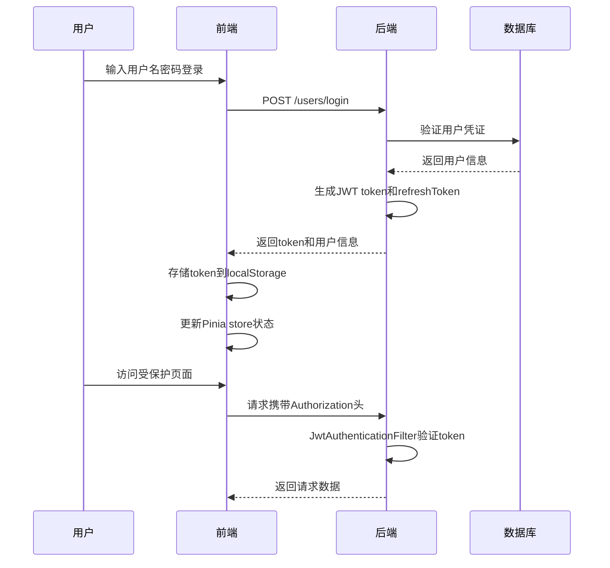
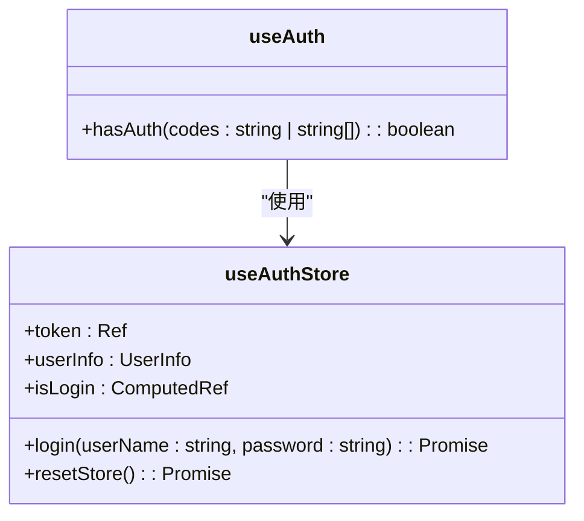
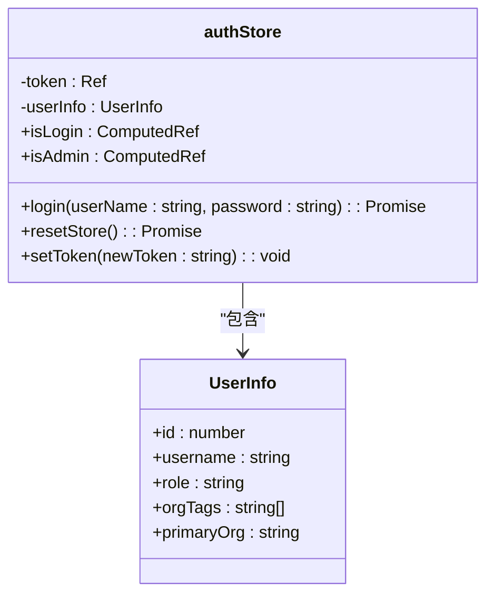
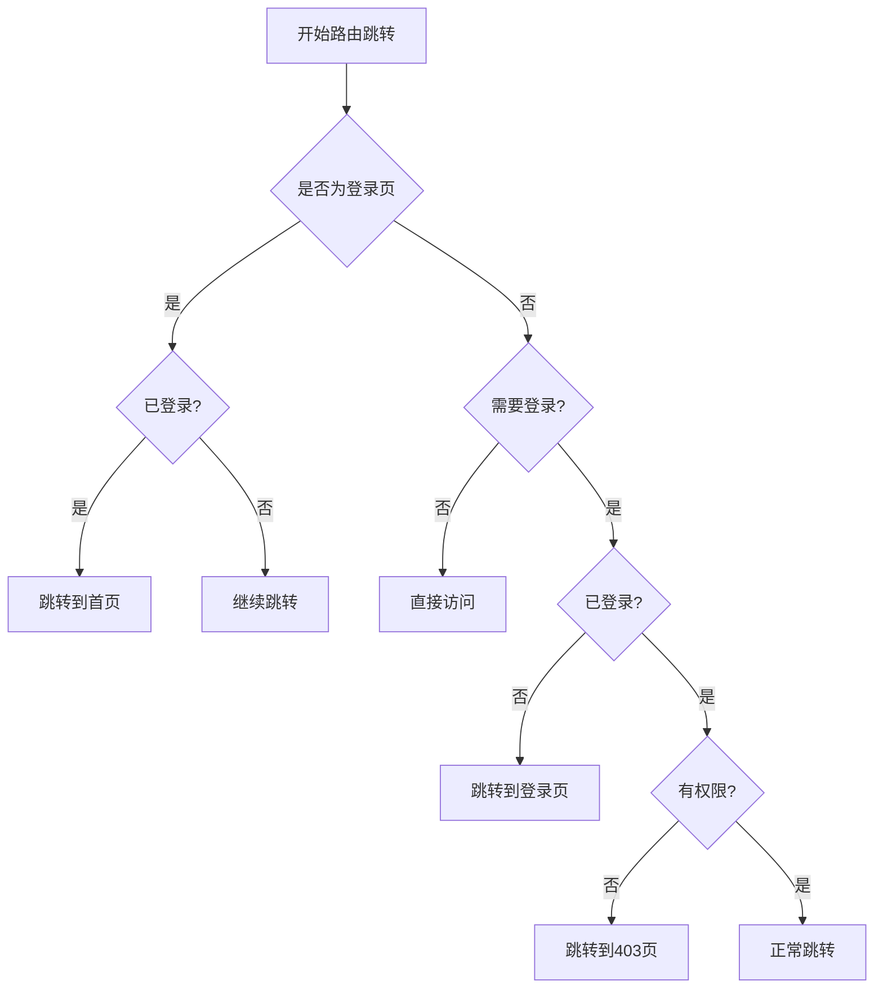
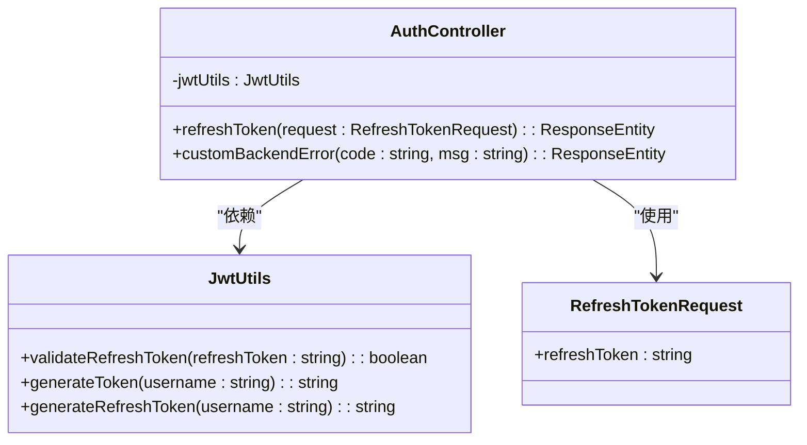
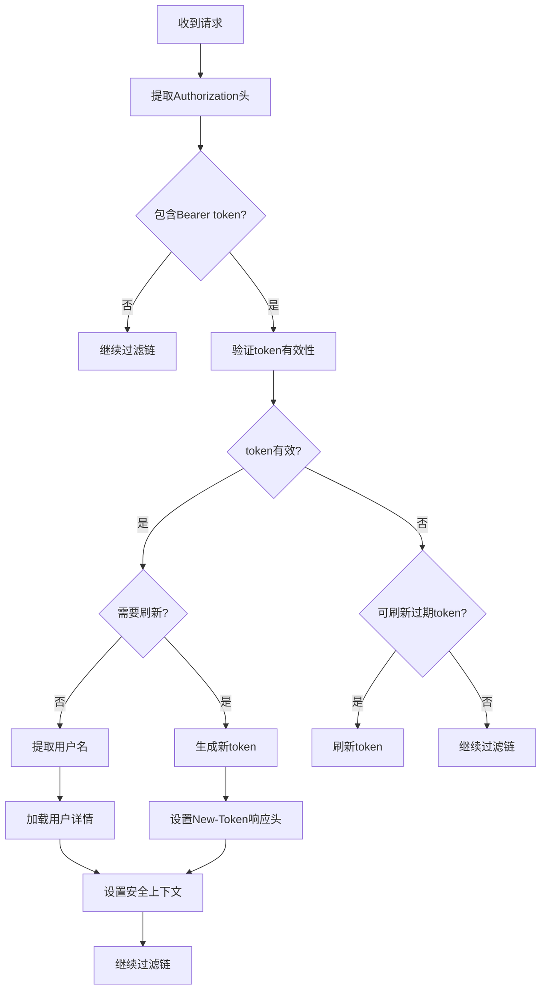
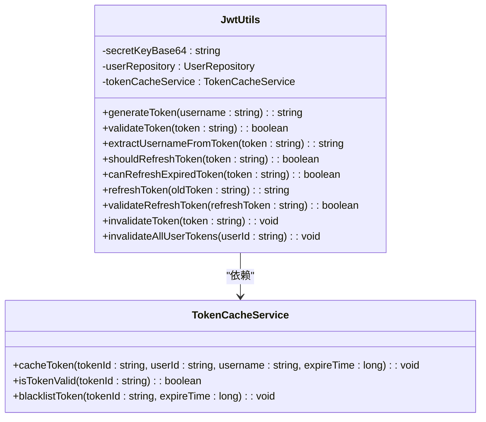
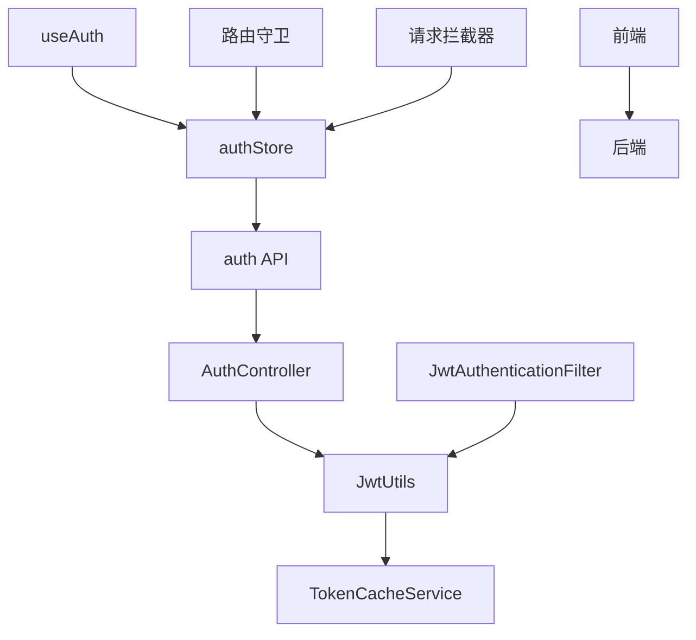

# 权限控制

<cite>
**本文档引用的文件**  
- [auth.ts](file://frontend/src/hooks/business/auth.ts)
- [index.ts](file://frontend/src/store/modules/auth/index.ts)
- [shared.ts](file://frontend/src/store/modules/auth/shared.ts)
- [auth.ts](file://frontend/src/service/api/auth.ts)
- [AuthController.java](file://src/main/java/com/yizhaoqi/smartpai/controller/AuthController.java)
- [JwtAuthenticationFilter.java](file://src/main/java/com/yizhaoqi/smartpai/config/JwtAuthenticationFilter.java)
- [JwtUtils.java](file://src/main/java/com/yizhaoqi/smartpai/utils/JwtUtils.java)
- [route.ts](file://frontend/src/router/guard/route.ts)
- [index.ts](file://frontend/src/router/guard/index.ts)
- [index.ts](file://frontend/src/service/request/index.ts)
</cite>

## 目录
1. [引言](#引言)
2. [项目结构](#项目结构)
3. [核心组件](#核心组件)
4. [架构概览](#架构概览)
5. [详细组件分析](#详细组件分析)
6. [依赖分析](#依赖分析)
7. [性能考虑](#性能考虑)
8. [故障排除指南](#故障排除指南)
9. [结论](#结论)

## 引言
本文档深入解析基于JWT的权限控制系统实现。系统采用前后端分离架构，前端使用Vue 3 + Pinia管理用户状态，后端基于Spring Boot实现JWT认证与权限校验。文档详细说明了`auth.ts`钩子如何通过Pinia store管理用户认证状态，集成路由守卫进行访问控制。同时分析了登录状态持久化、token刷新机制与登出流程的实现细节，阐述了与后端`AuthController`的交互过程，包括登录接口调用、权限码校验逻辑及角色权限映射。

## 项目结构
权限控制系统贯穿前后端多个模块，前端主要位于`frontend/src`目录下，包括`hooks/business/auth.ts`用于权限判断，`store/modules/auth/`用于状态管理，`router/guard/`用于路由守卫。后端核心逻辑位于`src/main/java/com/yizhaoqi/smartpai/`包下，`controller/AuthController.java`提供认证接口，`config/JwtAuthenticationFilter.java`实现JWT过滤，`utils/JwtUtils.java`封装JWT工具方法。

```mermaid
graph TB
subgraph "前端"
A[auth.ts] --> B[index.ts]
B --> C[shared.ts]
A --> D[route.ts]
D --> E[index.ts]
F[auth.ts] --> G[index.ts]
end
subgraph "后端"
H[AuthController.java] --> I[JwtAuthenticationFilter.java]
I --> J[JwtUtils.java]
end
A < --> H
D < --> I
G < --> J
```

**图示来源**  
- [auth.ts](file://frontend/src/hooks/business/auth.ts)
- [index.ts](file://frontend/src/store/modules/auth/index.ts)
- [shared.ts](file://frontend/src/store/modules/auth/shared.ts)
- [route.ts](file://frontend/src/router/guard/route.ts)
- [index.ts](file://frontend/src/router/guard/index.ts)
- [auth.ts](file://frontend/src/service/api/auth.ts)
- [AuthController.java](file://src/main/java/com/yizhaoqi/smartpai/controller/AuthController.java)
- [JwtAuthenticationFilter.java](file://src/main/java/com/yizhaoqi/smartpai/config/JwtAuthenticationFilter.java)
- [JwtUtils.java](file://src/main/java/com/yizhaoqi/smartpai/utils/JwtUtils.java)

## 核心组件
权限控制系统的核心组件包括前端的`useAuth`钩子、`authStore`状态管理、路由守卫，以及后端的`AuthController`、`JwtAuthenticationFilter`和`JwtUtils`工具类。这些组件协同工作，实现了完整的认证授权流程。

**组件来源**  
- [auth.ts](file://frontend/src/hooks/business/auth.ts#L1-L22)
- [index.ts](file://frontend/src/store/modules/auth/index.ts#L1-L196)
- [AuthController.java](file://src/main/java/com/yizhaoqi/smartpai/controller/AuthController.java#L1-L86)

## 架构概览
系统采用分层架构，前端通过HTTP请求与后端API交互。用户登录后，后端生成JWT token并返回，前端存储token并用于后续请求的身份验证。每次请求时，后端过滤器验证token有效性，确保请求的安全性。



**图示来源**  
- [auth.ts](file://frontend/src/service/api/auth.ts#L1-L59)
- [AuthController.java](file://src/main/java/com/yizhaoqi/smartpai/controller/AuthController.java#L1-L86)
- [JwtAuthenticationFilter.java](file://src/main/java/com/yizhaoqi/smartpai/config/JwtAuthenticationFilter.java#L1-L99)

## 详细组件分析

### 前端权限钩子分析
`useAuth`钩子提供了权限判断功能，通过`hasAuth`方法检查当前用户是否具有指定权限。



**图示来源**  
- [auth.ts](file://frontend/src/hooks/business/auth.ts#L1-L22)
- [index.ts](file://frontend/src/store/modules/auth/index.ts#L1-L196)

#### 权限判断逻辑
```typescript
function hasAuth(codes: string | string[]) {
  if (!authStore.isLogin) {
    return false;
  }

  if (typeof codes === 'string') {
    return authStore.userInfo.role === codes;
  }

  return codes.includes(authStore.userInfo.role);
}
```
该方法首先检查用户是否已登录，然后根据传入的权限码类型（字符串或数组）进行角色匹配，实现灵活的权限控制。

**组件来源**  
- [auth.ts](file://frontend/src/hooks/business/auth.ts#L4-L17)

### 认证状态管理分析
`authStore`使用Pinia管理用户认证状态，包括token、用户信息和登录状态。



**图示来源**  
- [index.ts](file://frontend/src/store/modules/auth/index.ts#L1-L196)

#### 登录流程
```typescript
async function login(userName: string, password: string, redirect = true) {
  startLoading();
  const { data: loginToken, error } = await fetchLogin(userName, password);

  if (!error) {
    const pass = await loginByToken(loginToken);
    if (pass) {
      const isClear = checkTabClear();
      let needRedirect = redirect;
      if (isClear) needRedirect = false;
      await redirectFromLogin(needRedirect);
    }
  } else {
    resetStore();
  }
  endLoading();
}
```
登录流程包括：发起登录请求、处理响应、存储token、获取用户信息、重定向等步骤，确保了完整的认证流程。

**组件来源**  
- [index.ts](file://frontend/src/store/modules/auth/index.ts#L68-L100)

### 路由守卫分析
路由守卫在页面跳转前进行权限检查，确保用户只能访问其有权限的页面。



**图示来源**  
- [route.ts](file://frontend/src/router/guard/route.ts#L1-L193)

#### 守卫实现
```typescript
export function createRouteGuard(router: Router) {
  router.beforeEach(async (to, from, next) => {
    const authStore = useAuthStore();
    const isLogin = Boolean(localStg.get('token'));
    const needLogin = !to.meta.constant;
    const routeRoles = to.meta.roles || [];
    const hasRole = routeRoles.includes(authStore.userInfo.role);
    const hasAuth = authStore.isStaticSuper || !routeRoles.length || hasRole;

    if (to.name === 'login' && isLogin) {
      next({ name: 'root' });
      return;
    }

    if (!needLogin) {
      handleRouteSwitch(to, from, next);
      return;
    }

    if (!isLogin) {
      next({ name: 'login', query: { redirect: to.fullPath } });
      return;
    }

    if (!hasAuth) {
      next({ name: '403' });
      return;
    }

    handleRouteSwitch(to, from, next);
  });
}
```
路由守卫综合判断登录状态、页面配置和用户角色，实现精细化的访问控制。

**组件来源**  
- [route.ts](file://frontend/src/router/guard/route.ts#L1-L193)

### 后端认证控制器分析
`AuthController`提供刷新token等认证接口。



**图示来源**  
- [AuthController.java](file://src/main/java/com/yizhaoqi/smartpai/controller/AuthController.java#L1-L86)
- [JwtUtils.java](file://src/main/java/com/yizhaoqi/smartpai/utils/JwtUtils.java#L1-L434)

#### 刷新Token实现
```java
@PostMapping("/refreshToken")
public ResponseEntity<?> refreshToken(@RequestBody RefreshTokenRequest request) {
    String username = null;
    try {
        if (request.refreshToken() == null || request.refreshToken().isEmpty()) {
            return ResponseEntity.badRequest().body(Map.of("code", 400, "message", "Refresh token cannot be empty"));
        }

        if (!jwtUtils.validateRefreshToken(request.refreshToken())) {
            return ResponseEntity.status(401).body(Map.of("code", 401, "message", "Invalid refresh token"));
        }

        username = jwtUtils.extractUsernameFromToken(request.refreshToken());
        String newToken = jwtUtils.generateToken(username);
        String newRefreshToken = jwtUtils.generateRefreshToken(username);

        return ResponseEntity.ok(Map.of(
            "code", 200, 
            "message", "Token refreshed successfully", 
            "data", Map.of(
                "token", newToken,
                "refreshToken", newRefreshToken
            )
        ));
    } catch (Exception e) {
        return ResponseEntity.status(HttpStatus.INTERNAL_SERVER_ERROR).body(Map.of("code", 500, "message", "Internal server error"));
    }
}
```
刷新Token接口验证refreshToken有效性后，生成新的token和refreshToken，实现token的无缝更新。

**组件来源**  
- [AuthController.java](file://src/main/java/com/yizhaoqi/smartpai/controller/AuthController.java#L15-L85)

### JWT认证过滤器分析
`JwtAuthenticationFilter`在每次请求时验证JWT token，确保请求的安全性。



**图示来源**  
- [JwtAuthenticationFilter.java](file://src/main/java/com/yizhaoqi/smartpai/config/JwtAuthenticationFilter.java#L1-L99)

#### 过滤器实现
```java
@Override
protected void doFilterInternal(HttpServletRequest request, HttpServletResponse response, FilterChain filterChain)
        throws ServletException, IOException {
    try {
        String token = extractToken(request);
        if (token != null) {
            String newToken = null;
            String username = null;
            
            if (jwtUtils.validateToken(token)) {
                if (jwtUtils.shouldRefreshToken(token)) {
                    newToken = jwtUtils.refreshToken(token);
                    if (newToken != null) {
                        logger.info("Token auto-refreshed proactively");
                    }
                }
                username = jwtUtils.extractUsernameFromToken(token);
            } else {
                if (jwtUtils.canRefreshExpiredToken(token)) {
                    newToken = jwtUtils.refreshToken(token);
                    if (newToken != null) {
                        logger.info("Expired token refreshed within grace period");
                        username = jwtUtils.extractUsernameFromToken(newToken);
                    }
                }
            }
            
            if (newToken != null) {
                response.setHeader("New-Token", newToken);
            }
            
            if (username != null && !username.isEmpty()) {
                UserDetails userDetails = userDetailsService.loadUserByUsername(username);
                UsernamePasswordAuthenticationToken authentication = new UsernamePasswordAuthenticationToken(
                        userDetails, null, userDetails.getAuthorities());
                authentication.setDetails(new WebAuthenticationDetailsSource().buildDetails(request));
                SecurityContextHolder.getContext().setAuthentication(authentication);
            }
        }
        filterChain.doFilter(request, response);
    } catch (Exception e) {
        logger.error("Cannot set user authentication: {}", e);
    }
}
```
过滤器实现了智能的token刷新机制，在token即将过期或刚过期时自动刷新，提升用户体验。

**组件来源**  
- [JwtAuthenticationFilter.java](file://src/main/java/com/yizhaoqi/smartpai/config/JwtAuthenticationFilter.java#L35-L98)

### JWT工具类分析
`JwtUtils`类提供了JWT token的生成、验证和刷新等核心功能。



**图示来源**  
- [JwtUtils.java](file://src/main/java/com/yizhaoqi/smartpai/utils/JwtUtils.java#L1-L434)
- [TokenCacheService.java](file://src/main/java/com/yizhaoqi/smartpai/service/TokenCacheService.java)

#### Token生成与验证
```java
public String generateToken(String username) {
    SecretKey key = getSigningKey();
    User user = userRepository.findByUsername(username)
            .orElseThrow(() -> new RuntimeException("User not found"));
    
    String tokenId = generateTokenId();
    long expireTime = System.currentTimeMillis() + EXPIRATION_TIME;
    
    Map<String, Object> claims = new HashMap<>();
    claims.put("tokenId", tokenId);
    claims.put("role", user.getRole().name());
    claims.put("userId", user.getId().toString());
    
    if (user.getOrgTags() != null && !user.getOrgTags().isEmpty()) {
        claims.put("orgTags", user.getOrgTags());
    }
    
    if (user.getPrimaryOrg() != null && !user.getPrimaryOrg().isEmpty()) {
        claims.put("primaryOrg", user.getPrimaryOrg());
    }

    String token = Jwts.builder()
            .setClaims(claims)
            .setSubject(username)
            .setExpiration(new Date(expireTime))
            .signWith(key, SignatureAlgorithm.HS256)
            .compact();
    
    tokenCacheService.cacheToken(tokenId, user.getId().toString(), username, expireTime);
    return token;
}

public boolean validateToken(String token) {
    try {
        String tokenId = extractTokenIdFromToken(token);
        if (tokenId == null) {
            return false;
        }
        
        if (!tokenCacheService.isTokenValid(tokenId)) {
            return false;
        }
        
        Jwts.parserBuilder()
                .setSigningKey(getSigningKey())
                .build()
                .parseClaimsJws(token);
        return true;
    } catch (Exception e) {
        return false;
    }
}
```
工具类通过Redis缓存token状态，实现高效的token验证和管理。

**组件来源**  
- [JwtUtils.java](file://src/main/java/com/yizhaoqi/smartpai/utils/JwtUtils.java#L50-L150)

## 依赖分析
权限控制系统各组件之间存在紧密的依赖关系，前端组件依赖后端API，后端组件相互协作完成认证授权功能。



**图示来源**  
- [auth.ts](file://frontend/src/hooks/business/auth.ts)
- [index.ts](file://frontend/src/store/modules/auth/index.ts)
- [auth.ts](file://frontend/src/service/api/auth.ts)
- [AuthController.java](file://src/main/java/com/yizhaoqi/smartpai/controller/AuthController.java)
- [JwtUtils.java](file://src/main/java/com/yizhaoqi/smartpai/utils/JwtUtils.java)
- [JwtAuthenticationFilter.java](file://src/main/java/com/yizhaoqi/smartpai/config/JwtAuthenticationFilter.java)

## 性能考虑
系统在性能方面做了多项优化，包括使用Redis缓存token状态、实现无感知token刷新、批量登出等机制，确保了系统的高效运行。

### 缓存机制
通过Redis缓存token状态，避免了每次请求都解析JWT token，显著提升了验证性能。

### 无感知刷新
在token即将过期时自动刷新，避免了用户操作中断，提升了用户体验。

### 批量登出
支持使用户所有token失效，确保账号安全。

## 故障排除指南

### Token过期问题
当token过期时，系统会自动尝试刷新。如果刷新失败，用户将被重定向到登录页。

**组件来源**  
- [index.ts](file://frontend/src/service/request/index.ts#L1-L155)
- [JwtAuthenticationFilter.java](file://src/main/java/com/yizhaoqi/smartpai/config/JwtAuthenticationFilter.java#L1-L99)

### 无权限访问
当用户尝试访问无权限的页面时，路由守卫会将其重定向到403页面。

**组件来源**  
- [route.ts](file://frontend/src/router/guard/route.ts#L1-L193)

### 登录失败
登录失败时，系统会清除认证存储并重定向到登录页。

**组件来源**  
- [index.ts](file://frontend/src/store/modules/auth/index.ts#L1-L196)

## 结论
本文档详细解析了基于JWT的权限控制系统实现，涵盖了前后端各个组件的协作机制。系统通过Pinia store管理用户状态，集成路由守卫进行访问控制，实现了登录状态持久化、token刷新机制与登出流程。后端通过`AuthController`、`JwtAuthenticationFilter`和`JwtUtils`等组件，提供了安全可靠的认证授权服务。整体架构设计合理，功能完整，为系统的安全运行提供了有力保障。