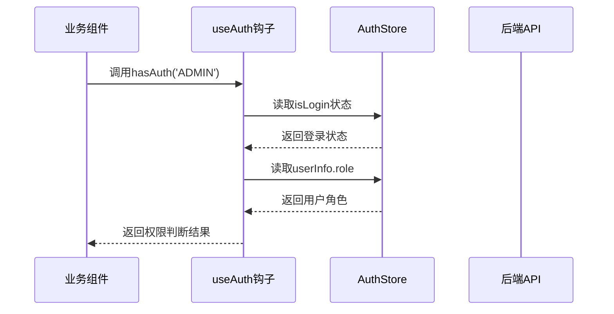
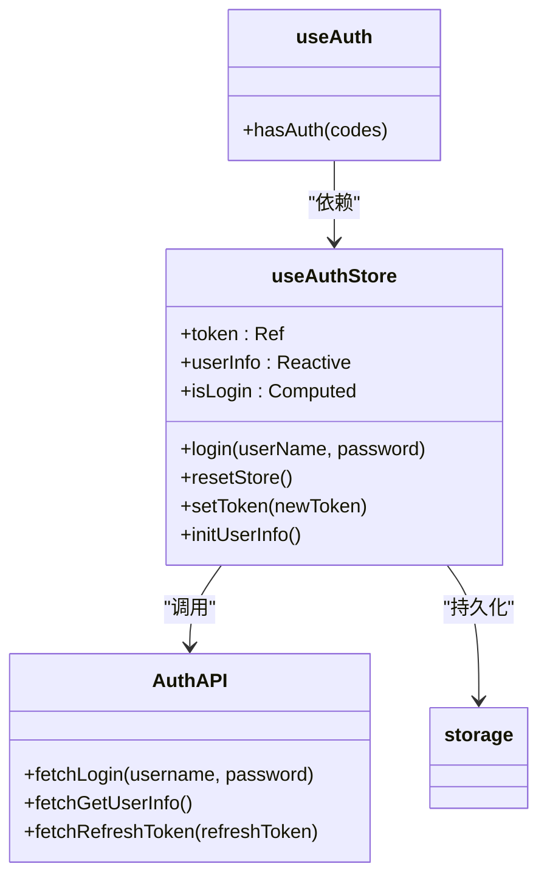
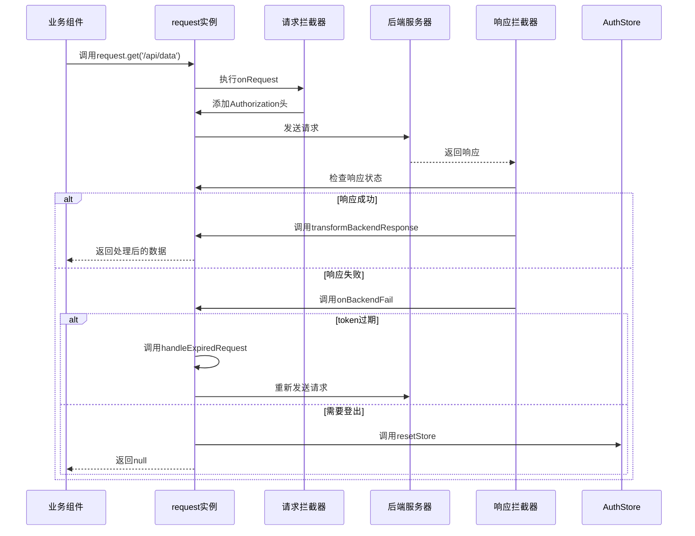
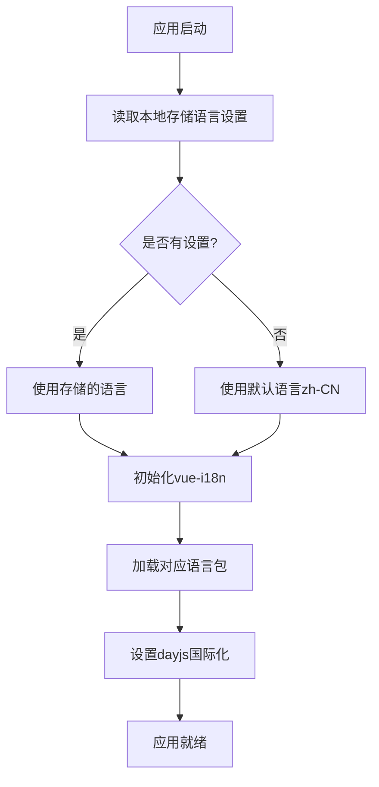
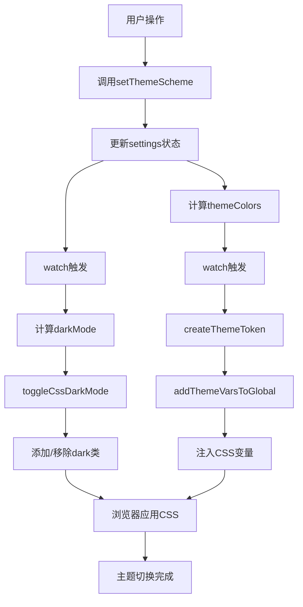

# 核心功能模块

<cite>
**本文档引用的文件**   
- [auth.ts](file://frontend/src/hooks/business/auth.ts)
- [index.ts](file://frontend/src/service/request/index.ts)
- [shared.ts](file://frontend/src/service/request/shared.ts)
- [type.ts](file://frontend/src/service/request/type.ts)
- [en-us.ts](file://frontend/src/locales/langs/en-us.ts)
- [zh-cn.ts](file://frontend/src/locales/langs/zh-cn.ts)
- [dayjs.ts](file://frontend/src/locales/dayjs.ts)
- [index.ts](file://frontend/src/locales/index.ts)
- [locale.ts](file://frontend/src/locales/locale.ts)
- [settings.ts](file://frontend/src/theme/settings.ts)
- [index.ts](file://frontend/src/store/modules/theme/index.ts)
- [shared.ts](file://frontend/src/store/modules/theme/shared.ts)
- [index.ts](file://frontend/src/store/modules/auth/index.ts)
- [shared.ts](file://frontend/src/store/modules/auth/shared.ts)
- [auth.ts](file://frontend/src/service/api/auth.ts)
- [storage.ts](file://frontend/src/utils/storage.ts)
</cite>

## 目录
1. [权限控制模块](#权限控制模块)
2. [请求封装模块](#请求封装模块)
3. [国际化支持](#国际化支持)
4. [主题系统](#主题系统)

## 权限控制模块

该模块实现了基于JWT的认证机制和细粒度的权限判断，通过组合式API和Pinia状态管理的结合，构建了完整的用户认证体系。

### 权限钩子实现

`useAuth` 钩子提供了细粒度的权限判断功能，通过读取Pinia store中的用户信息来判断当前用户是否具有指定权限。

```typescript
import { useAuthStore } from '@/store/modules/auth';

export function useAuth() {
  const authStore = useAuthStore();

  function hasAuth(codes: string | string[]) {
    if (!authStore.isLogin) {
      return false;
    }

    if (typeof codes === 'string') {
      return authStore.userInfo.role === codes;
    }

    return codes.includes(authStore.userInfo.role);
  }

  return {
    hasAuth
  };
}
```

**核心功能分析**：
- `hasAuth` 函数支持单个权限码或权限码数组的判断
- 通过 `authStore.isLogin` 检查用户登录状态
- 基于用户角色进行权限匹配，实现了基于角色的访问控制（RBAC）



**Diagram sources**
- [auth.ts](file://frontend/src/hooks/business/auth.ts)

### 认证状态管理

`useAuthStore` 使用Pinia实现用户认证状态的集中管理，包括token、用户信息和登录状态。

```typescript
export const useAuthStore = defineStore(SetupStoreId.Auth, () => {
  const token = ref(getToken());
  const userInfo: Api.Auth.UserInfo = reactive({
    id: 0,
    username: '',
    role: 'USER',
    orgTags: [],
    primaryOrg: ''
  });

  const isLogin = computed(() => Boolean(token.value));

  async function login(userName: string, password: string) {
    startLoading();
    const { data: loginToken, error } = await fetchLogin(userName, password);
    
    if (!error) {
      const pass = await loginByToken(loginToken);
      if (pass) {
        // 登录成功处理
      }
    } else {
      resetStore();
    }
    endLoading();
  }

  function setToken(newToken: string) {
    token.value = newToken;
    localStg.set('token', newToken);
  }

  return {
    token,
    userInfo,
    isLogin,
    loginLoading,
    resetStore,
    login,
    initUserInfo,
    setToken
  };
});
```

**关键特性**：
- 使用 `ref` 和 `reactive` 分别管理简单状态和复杂对象
- `isLogin` 通过计算属性自动响应token变化
- `login` 方法封装了完整的登录流程，包括加载状态管理和错误处理
- `setToken` 方法用于无感知的token刷新



**Diagram sources**
- [index.ts](file://frontend/src/store/modules/auth/index.ts)
- [auth.ts](file://frontend/src/hooks/business/auth.ts)
- [auth.ts](file://frontend/src/service/api/auth.ts)

### 认证共享逻辑

认证模块的共享工具函数提供了基础的token管理和存储操作。

```typescript
import { localStg } from '@/utils/storage';

/** 获取token */
export function getToken() {
  return localStg.get('token') || '';
}

/** 清除认证存储 */
export function clearAuthStorage() {
  localStg.remove('token');
  localStg.remove('refreshToken');
}
```

**Section sources**
- [auth.ts](file://frontend/src/hooks/business/auth.ts)
- [index.ts](file://frontend/src/store/modules/auth/index.ts)
- [shared.ts](file://frontend/src/store/modules/auth/shared.ts)

## 请求封装模块

请求模块通过axios的二次封装，实现了统一的请求配置、拦截器、错误处理和类型安全。

### 请求实例创建

`getFlatRequest` 工厂函数创建了预配置的请求实例，支持多实例管理和灵活的选项覆盖。

```typescript
function getFlatRequest(options: Partial<RequestOption<App.Service.Response>> = {}) {
  const request = createFlatRequest<App.Service.Response, RequestInstanceState>(
    {
      baseURL,
      headers: {
        apifoxToken: 'FY65Vng88xra_BveQ5E_4'
      }
    },
    {
      async onRequest(config) {
        const Authorization = getAuthorization();
        Object.assign(config.headers, { Authorization });
        return config;
      },
      onTokenRefresh(newToken) {
        const authStore = useAuthStore();
        authStore.setToken(newToken);
      },
      isBackendSuccess(response) {
        return String(response.data.code) === import.meta.env.VITE_SERVICE_SUCCESS_CODE;
      },
      async onBackendFail(response, instance) {
        const responseCode = String(response.data.code);
        const logoutCodes = import.meta.env.VITE_SERVICE_LOGOUT_CODES?.split(',') || [];
        
        if (logoutCodes.includes(responseCode)) {
          handleLogout();
          return null;
        }
        
        const expiredTokenCodes = import.meta.env.VITE_SERVICE_EXPIRED_TOKEN_CODES?.split(',') || [];
        if (expiredTokenCodes.includes(responseCode)) {
          const success = await handleExpiredRequest(request.state);
          if (success) {
            const Authorization = getAuthorization();
            Object.assign(response.config.headers, { Authorization });
            return instance.request(response.config) as Promise<AxiosResponse>;
          }
        }
        
        return null;
      },
      transformBackendResponse(response) {
        return response.data.data;
      },
      onError(error) {
        if (error.response?.status === 403) {
          const authStore = useAuthStore();
          authStore.resetStore();
          return;
        }
        
        showErrorMsg(request.state, message);
      },
      ...options
    }
  );

  return request;
}
```

**核心特性**：
- **请求拦截**：自动添加Authorization头
- **响应处理**：统一转换后端响应数据结构
- **错误处理**：分类处理不同类型的错误码
- **token刷新**：自动处理过期token的无感知刷新
- **类型安全**：通过泛型确保响应数据类型正确



**Diagram sources**
- [index.ts](file://frontend/src/service/request/index.ts)

### 请求共享逻辑

共享模块实现了token管理和错误消息显示等通用功能。

```typescript
export function getAuthorization() {
  const token = localStg.get('token');
  const Authorization = token ? `Bearer ${token}` : null;
  return Authorization;
}

async function handleRefreshToken() {
  const { resetStore } = useAuthStore();
  const rToken = localStg.get('refreshToken') || '';
  const { error, data } = await fetchRefreshToken(rToken);
  
  if (!error) {
    localStg.set('token', data.token);
    localStg.set('refreshToken', data.refreshToken);
    return true;
  }
  
  resetStore();
  return false;
}

export async function handleExpiredRequest(state: RequestInstanceState) {
  if (!state.refreshTokenFn) {
    state.refreshTokenFn = handleRefreshToken();
  }
  
  const success = await state.refreshTokenFn;
  setTimeout(() => {
    state.refreshTokenFn = null;
  }, 1000);
  
  return success;
}
```

**关键设计**：
- 使用 `state.refreshTokenFn` 防止并发刷新请求
- `handleExpiredRequest` 实现了token刷新的防抖机制
- `showErrorMsg` 管理错误消息栈，避免重复显示相同错误

**Section sources**
- [index.ts](file://frontend/src/service/request/index.ts)
- [shared.ts](file://frontend/src/service/request/shared.ts)
- [type.ts](file://frontend/src/service/request/type.ts)

## 国际化支持

系统通过vue-i18n实现了完整的多语言支持，包括语言包管理、日期库国际化和动态语言切换。

### 语言包结构

系统支持中英文两种语言，语言包采用分层结构组织。

```typescript
// zh-cn.ts
const local: App.I18n.Schema = {
  system: {
    title: '派聪明',
    updateTitle: '系统版本更新通知'
  },
  common: {
    action: '操作',
    add: '新增',
    delete: '删除'
  },
  theme: {
    themeSchema: {
      title: '主题模式',
      light: '亮色模式',
      dark: '暗黑模式'
    }
  }
};
```

```typescript
// en-us.ts
const local: App.I18n.Schema = {
  system: {
    title: 'PaiSmart',
    updateTitle: 'System Version Update Notification'
  },
  common: {
    action: 'Action',
    add: 'Add',
    delete: 'Delete'
  },
  theme: {
    themeSchema: {
      title: 'Theme Schema',
      light: 'Light',
      dark: 'Dark'
    }
  }
};
```

**语言包特点**：
- 按功能模块组织（system、common、theme等）
- 支持嵌套结构，便于管理复杂语言内容
- 包含特殊字符和占位符的支持

### 国际化主入口

`locales/index.ts` 是国际化模块的主入口，负责初始化vue-i18n实例。

```typescript
import { createI18n } from 'vue-i18n';
import { localStg } from '@/utils/storage';
import messages from './locale';

const i18n = createI18n({
  locale: localStg.get('lang') || 'zh-CN',
  fallbackLocale: 'en',
  messages,
  legacy: false
});

export function setupI18n(app: App) {
  app.use(i18n);
}

export const $t = i18n.global.t as App.I18n.$T;

export function setLocale(locale: App.I18n.LangType) {
  i18n.global.locale.value = locale;
}
```

**初始化流程**：
1. 从本地存储读取用户首选语言
2. 创建vue-i18n实例，设置默认语言和回退语言
3. 注入Vue应用
4. 导出翻译函数 `$t` 和语言切换函数 `setLocale`

### 语言包加载机制

`locale.ts` 文件负责加载和导出所有语言包。

```typescript
import zhCN from './langs/zh-cn';
import enUS from './langs/en-us';

const locales: Record<App.I18n.LangType, App.I18n.Schema> = {
  'zh-CN': zhCN,
  'en-US': enUS
};

export default locales;
```

### dayjs国际化配置

系统还配置了dayjs日期库的国际化支持。

```typescript
import { locale } from 'dayjs';
import 'dayjs/locale/zh-cn';
import 'dayjs/locale/en';
import { localStg } from '@/utils/storage';

export function setDayjsLocale(lang: App.I18n.LangType = 'zh-CN') {
  const localMap = {
    'zh-CN': 'zh-cn',
    'en-US': 'en'
  } satisfies Record<App.I18n.LangType, string>;

  const l = lang || localStg.get('lang') || 'zh-CN';
  locale(localMap[l]);
}
```

**国际化流程**：


**Diagram sources**
- [zh-cn.ts](file://frontend/src/locales/langs/zh-cn.ts)
- [en-us.ts](file://frontend/src/locales/langs/en-us.ts)
- [index.ts](file://frontend/src/locales/index.ts)
- [locale.ts](file://frontend/src/locales/locale.ts)
- [dayjs.ts](file://frontend/src/locales/dayjs.ts)

**Section sources**
- [zh-cn.ts](file://frontend/src/locales/langs/zh-cn.ts)
- [en-us.ts](file://frontend/src/locales/langs/en-us.ts)
- [index.ts](file://frontend/src/locales/index.ts)
- [locale.ts](file://frontend/src/locales/locale.ts)
- [dayjs.ts](file://frontend/src/locales/dayjs.ts)

## 主题系统

主题系统通过Pinia状态管理、CSS变量和本地存储的结合，实现了主题的动态切换和持久化。

### 主题配置结构

`settings.ts` 定义了默认的主题配置。

```typescript
export const themeSettings: App.Theme.ThemeSetting = {
  themeScheme: 'auto',
  grayscale: false,
  colourWeakness: false,
  recommendColor: true,
  themeColor: '#646cff',
  otherColor: { 
    info: '#2080f0', 
    success: '#52c41a', 
    warning: '#faad14', 
    error: '#f5222d' 
  },
  isInfoFollowPrimary: true,
  layout: { 
    mode: 'vertical', 
    scrollMode: 'content' 
  },
  header: { 
    height: 56, 
    breadcrumb: { visible: false } 
  },
  tokens: {
    light: {
      colors: {
        container: 'rgb(255, 255, 255)',
        layout: 'rgb(247, 250, 252)'
      }
    },
    dark: { 
      colors: { 
        container: 'rgb(28, 28, 28)' 
      } 
    }
  }
};
```

**配置项说明**：
- `themeScheme`：主题模式（亮色、暗黑、跟随系统）
- `themeColor`：主色调
- `layout.mode`：布局模式
- `tokens`：CSS变量定义，区分亮色和暗黑主题

### 主题状态管理

`useThemeStore` 使用Pinia管理主题状态，并实现自动持久化。

```typescript
export const useThemeStore = defineStore(SetupStoreId.Theme, () => {
  const osTheme = usePreferredColorScheme();
  const settings: Ref<App.Theme.ThemeSetting> = ref(initThemeSettings());

  const darkMode = computed(() => {
    if (settings.value.themeScheme === 'auto') {
      return osTheme.value === 'dark';
    }
    return settings.value.themeScheme === 'dark';
  });

  function setThemeScheme(themeScheme: UnionKey.ThemeScheme) {
    settings.value.themeScheme = themeScheme;
  }

  function updateThemeColors(key: App.Theme.ThemeColorKey, color: string) {
    if (settings.value.recommendColor) {
      colorValue = getPaletteColorByNumber(color, 500, true);
    }
    
    if (key === 'primary') {
      settings.value.themeColor = colorValue;
    } else {
      settings.value.otherColor[key] = colorValue;
    }
  }

  function cacheThemeSettings() {
    const isProd = import.meta.env.PROD;
    if (!isProd) return;
    localStg.set('themeSettings', settings.value);
  }

  // 页面关闭时缓存主题设置
  useEventListener(window, 'beforeunload', () => {
    cacheThemeSettings();
  });

  scope.run(() => {
    watch(darkMode, val => {
      toggleCssDarkMode(val);
      localStg.set('darkMode', val);
    }, { immediate: true });

    watch(themeColors, val => {
      setupThemeVarsToGlobal();
      localStg.set('themeColor', val.primary);
    }, { immediate: true });
  });
});
```

**核心机制**：
- 使用 `computed` 自动计算暗黑模式状态
- 通过 `watch` 监听状态变化，自动更新CSS变量和本地存储
- `cacheThemeSettings` 在页面关闭时持久化主题设置
- 支持生产环境下的主题设置缓存

### 主题工具函数

`shared.ts` 提供了主题相关的工具函数。

```typescript
export function initThemeSettings() {
  const isProd = import.meta.env.PROD;
  if (!isProd) return themeSettings;

  const localSettings = localStg.get('themeSettings');
  let settings = defu(localSettings, themeSettings);
  
  const isOverride = localStg.get('overrideThemeFlag') === BUILD_TIME;
  if (!isOverride) {
    settings = defu(overrideThemeSettings, settings);
    localStg.set('overrideThemeFlag', BUILD_TIME);
  }
  
  return settings;
}

export function createThemeToken(
  colors: App.Theme.ThemeColor,
  tokens?: App.Theme.ThemeSetting['tokens'],
  recommended = false
) {
  const paletteColors = createThemePaletteColors(colors, recommended);
  const { light, dark } = tokens || themeSettings.tokens;

  return {
    themeTokens: {
      colors: { ...paletteColors, ...light.colors },
      boxShadow: { ...light.boxShadow }
    },
    darkThemeTokens: {
      colors: { ...paletteColors, ...dark?.colors },
      boxShadow: { ...light.boxShadow, ...dark?.boxShadow }
    }
  };
}

export function addThemeVarsToGlobal(tokens: App.Theme.BaseToken, darkTokens: App.Theme.BaseToken) {
  const cssVarStr = getCssVarByTokens(tokens);
  const darkCssVarStr = getCssVarByTokens(darkTokens);

  const css = `:root { ${cssVarStr} }`;
  const darkCss = `html.${DARK_CLASS} { ${darkCssVarStr} }`;

  const style = document.querySelector('#theme-vars') || document.createElement('style');
  style.id = 'theme-vars';
  style.textContent = css + darkCss;
  document.head.appendChild(style);
}
```

**主题应用流程**：


**Diagram sources**
- [settings.ts](file://frontend/src/theme/settings.ts)
- [index.ts](file://frontend/src/store/modules/theme/index.ts)
- [shared.ts](file://frontend/src/store/modules/theme/shared.ts)

**Section sources**
- [settings.ts](file://frontend/src/theme/settings.ts)
- [index.ts](file://frontend/src/store/modules/theme/index.ts)
- [shared.ts](file://frontend/src/store/modules/theme/shared.ts)