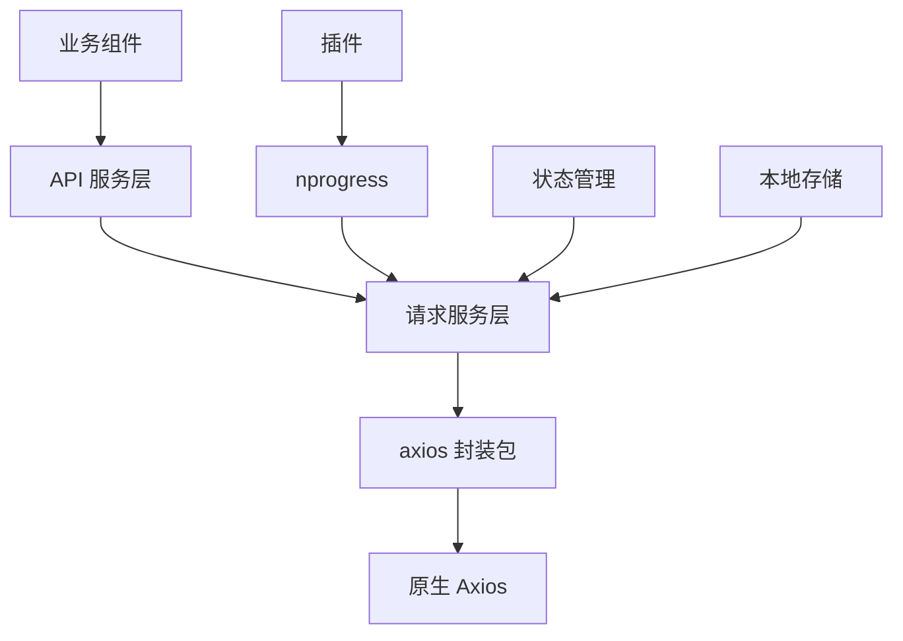
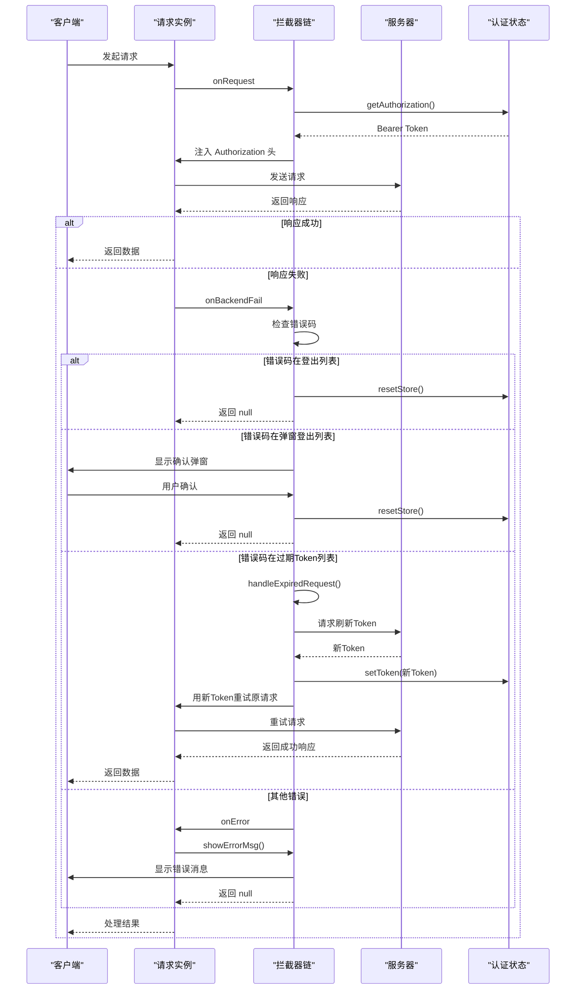

# 请求服务

<cite>
**本文档引用的文件**  
- [index.ts](file://frontend/src/service/request/index.ts)
- [shared.ts](file://frontend/src/service/request/shared.ts)
- [type.ts](file://frontend/src/service/request/type.ts)
- [nprogress.ts](file://frontend/src/plugins/nprogress.ts)
- [progress.ts](file://frontend/src/router/guard/progress.ts)
- [auth.ts](file://frontend/src/service/api/auth.ts)
- [org-tag.ts](file://frontend/src/service/api/org-tag.ts)
- [axios/src/index.ts](file://frontend/packages/axios/src/index.ts)
- [axios/src/constant.ts](file://frontend/packages/axios/src/constant.ts)
- [axios/src/options.ts](file://frontend/packages/axios/src/options.ts)
</cite>

## 目录
1. [简介](#简介)
2. [核心架构](#核心架构)
3. [请求实例创建与拦截器链](#请求实例创建与拦截器链)
4. [公共请求逻辑抽象](#公共请求逻辑抽象)
5. [请求类型体系](#请求类型体系)
6. [加载进度条集成](#加载进度条集成)
7. [错误重试与缓存策略](#错误重试与缓存策略)
8. [实际业务调用示例](#实际业务调用示例)
9. [总结](#总结)

## 简介
本文档全面解析前端请求服务的封装架构，重点阐述基于 Axios 的请求实例创建、拦截器链设计、公共逻辑抽象、类型安全机制、加载进度条集成、错误处理及重试机制。通过分析 `request/index.ts`、`shared.ts` 和 `type.ts` 等核心文件，揭示其如何实现统一的网络请求管理，确保代码的可维护性、健壮性和用户体验。

## 核心架构
请求服务采用分层架构设计，将请求逻辑、公共策略、类型定义和第三方集成分离，形成清晰的职责边界。核心组件包括：
- **请求实例创建层**：`index.ts` 负责创建和配置请求实例。
- **公共逻辑抽象层**：`shared.ts` 封装认证、错误提示等通用逻辑。
- **类型定义层**：`type.ts` 定义请求状态类型，确保类型安全。
- **第三方集成层**：`nprogress.ts` 和路由守卫集成加载进度条。



**图示来源**  
- [index.ts](file://frontend/src/service/request/index.ts#L1-L154)
- [shared.ts](file://frontend/src/service/request/shared.ts#L1-L64)
- [nprogress.ts](file://frontend/src/plugins/nprogress.ts#L1-L9)

## 请求实例创建与拦截器链
请求服务的核心是 `request/index.ts` 文件，它基于 `@sa/axios` 包创建了高度可配置的请求实例，并通过拦截器链实现请求加密、响应解密和错误统一处理。

### 请求实例创建
`getFlatRequest` 函数是创建请求实例的工厂函数。它接收可选的配置参数，并返回一个 `flatRequest` 实例。该实例的响应数据格式为扁平化对象 `{ data, error, response }`，简化了错误处理逻辑。

```typescript
function getFlatRequest(options: Partial<RequestOption<App.Service.Response>> = {}) {
  const request = createFlatRequest<App.Service.Response, RequestInstanceState>(
    {
      baseURL,
      headers: {
        apifoxToken: 'FY65Vng88xra_BveQ5E_4'
      }
    },
    {
      // 拦截器配置
      ...
    }
  );
  return request;
}
export const request = getFlatRequest();
```

**关键配置**：
- **baseURL**：通过 `getServiceBaseURL` 函数根据环境变量动态获取。
- **默认请求头**：包含 `apifoxToken`，用于 API 文档测试。

### 拦截器链设计
拦截器链是请求服务的核心，它在请求和响应的生命周期中注入自定义逻辑。

#### 请求拦截器 (onRequest)
在请求发送前执行，主要功能是**自动注入认证头**。
```typescript
async onRequest(config) {
  const Authorization = getAuthorization(); // 从 shared.ts 获取
  Object.assign(config.headers, { Authorization });
  return config;
}
```

#### 响应拦截器 (onBackendFail)
在后端返回失败时执行，实现**无感知 Token 刷新**和**统一错误处理**。
```typescript
async onBackendFail(response, instance) {
  const responseCode = String(response.data.code);
  const logoutCodes = import.meta.env.VITE_SERVICE_LOGOUT_CODES?.split(',') || [];
  const modalLogoutCodes = import.meta.env.VITE_SERVICE_MODAL_LOGOUT_CODES?.split(',') || [];
  const expiredTokenCodes = import.meta.env.VITE_SERVICE_EXPIRED_TOKEN_CODES?.split(',') || [];

  // 登出码：直接登出
  if (logoutCodes.includes(responseCode)) {
    handleLogout();
    return null;
  }

  // 弹窗登出码：显示确认弹窗后登出
  if (modalLogoutCodes.includes(responseCode)) {
    // 显示弹窗，用户确认后登出
    return null;
  }

  // 过期 Token 码：刷新 Token 并重试请求
  if (expiredTokenCodes.includes(responseCode)) {
    const success = await handleExpiredRequest(request.state);
    if (success) {
      const Authorization = getAuthorization();
      Object.assign(response.config.headers, { Authorization });
      return instance.request(response.config); // 重试
    }
  }

  return null;
}
```

#### 错误拦截器 (onError)
在请求发生网络错误或超时等异常时执行。
```typescript
onError(error) {
  if (error.code === 'ERR_CANCELED') return; // 忽略取消请求的错误

  // 处理 403 错误：用户需要登录
  if (error.response?.status === 403) {
    const authStore = useAuthStore();
    authStore.resetStore();
    return;
  }

  let message = error.message;
  let backendErrorCode = '';

  // 提取后端错误码和消息
  if (error.code && BACKEND_ERROR_CODE.split(',').includes(error.code)) {
    message = error.response?.data?.message || message;
    backendErrorCode = String(error.response?.data?.code || '');
  }

  // 对于需要弹窗登出或正在刷新 Token 的错误，不显示错误消息
  const modalLogoutCodes = import.meta.env.VITE_SERVICE_MODAL_LOGOUT_CODES?.split(',') || [];
  const expiredTokenCodes = import.meta.env.VITE_SERVICE_EXPIRED_TOKEN_CODES?.split(',') || [];
  if (modalLogoutCodes.includes(backendErrorCode) || expiredTokenCodes.includes(backendErrorCode)) {
    return;
  }

  showErrorMsg(request.state, message); // 显示错误消息
}
```



**图示来源**  
- [index.ts](file://frontend/src/service/request/index.ts#L25-L153)
- [shared.ts](file://frontend/src/service/request/shared.ts#L1-L64)

## 公共请求逻辑抽象
`shared.ts` 文件封装了与具体业务无关的公共请求逻辑，实现了代码复用和逻辑解耦。

### 认证头自动注入
`getAuthorization` 函数负责从本地存储中读取 Token，并格式化为 `Bearer` 认证头。
```typescript
export function getAuthorization() {
  const token = localStg.get('token');
  const Authorization = token ? `Bearer ${token}` : null;
  return Authorization;
}
```

### Token 刷新机制
`handleRefreshToken` 函数封装了刷新 Token 的具体逻辑，包括调用刷新接口、更新本地存储和状态管理。
```typescript
async function handleRefreshToken() {
  const { resetStore } = useAuthStore();
  const rToken = localStg.get('refreshToken') || '';
  const { error, data } = await fetchRefreshToken(rToken);
  if (!error) {
    localStg.set('token', data.token);
    localStg.set('refreshToken', data.refreshToken);
    return true;
  }
  resetStore();
  return false;
}
```

### 错误消息管理
`showErrorMsg` 函数管理错误消息的显示，防止相同错误消息重复弹出，并在消息关闭后清理状态。
```typescript
export function showErrorMsg(state: RequestInstanceState, message: string) {
  if (!state.errMsgStack?.length) {
    state.errMsgStack = [];
  }
  const isExist = state.errMsgStack.includes(message);
  if (!isExist) {
    state.errMsgStack.push(message);
    window.$message?.error(message, {
      onLeave: () => {
        state.errMsgStack = state.errMsgStack.filter(msg => msg !== message);
        setTimeout(() => {
          state.errMsgStack = [];
        }, 5000);
      }
    });
  }
}
```

**本节来源**  
- [shared.ts](file://frontend/src/service/request/shared.ts#L1-L64)

## 请求类型体系
`type.ts` 文件定义了请求实例的状态类型，确保了类型安全。
```typescript
export interface RequestInstanceState {
  /** 是否正在刷新Token */
  refreshTokenFn: Promise<boolean> | null;
  /** 请求错误消息栈 */
  errMsgStack: string[];
}
```
该接口被用作 `createFlatRequest` 的泛型参数 `State`，使得请求实例的 `state` 属性具有明确的类型定义，避免了运行时错误。

**本节来源**  
- [type.ts](file://frontend/src/service/request/type.ts#L1-L7)

## 加载进度条集成
请求服务通过集成 `nprogress` 库，在页面路由切换时显示加载进度条，提升用户体验。

### NProgress 初始化
`nprogress.ts` 文件负责初始化 `nprogress` 库，并将其挂载到全局 `window` 对象上，以便在其他地方调用。
```typescript
import NProgress from 'nprogress';
export function setupNProgress() {
  NProgress.configure({ easing: 'ease', speed: 500 });
  window.NProgress = NProgress; // 挂载到全局
}
```

### 路由守卫集成
`progress.ts` 文件在路由守卫中调用 `NProgress` 的 `start` 和 `done` 方法，实现页面跳转时的进度条控制。
```typescript
export function createProgressGuard(router: Router) {
  router.beforeEach((_to, _from, next) => {
    window.NProgress?.start?.(); // 开始进度条
    next();
  });
  router.afterEach(_to => {
    window.NProgress?.done?.(); // 完成进度条
  });
}
```
**注意**：此集成是针对**页面路由**的加载，而非单个 API 请求。API 请求的加载状态通常由组件自身管理。

**本节来源**  
- [nprogress.ts](file://frontend/src/plugins/nprogress.ts#L1-L9)
- [progress.ts](file://frontend/src/router/guard/progress.ts#L1-L11)

## 错误重试与缓存策略
### 错误重试机制
请求服务的重试机制由 `@sa/axios` 包底层的 `axios-retry` 库提供。在 `axios/src/options.ts` 中，`createRetryOptions` 函数配置了重试选项。
```typescript
export function createRetryOptions(config?: Partial<CreateAxiosDefaults>) {
  const retryConfig: IAxiosRetryConfig = {
    retries: 0 // 默认不重试
  };
  Object.assign(retryConfig, config);
  return retryConfig;
}
```
默认情况下，重试次数为 0，即不自动重试。重试策略可以在创建请求实例时通过 `options` 参数覆盖。

### 缓存策略
当前代码库中未发现显式的请求缓存策略（如基于内存或 `localStorage` 的缓存）。API 响应数据的缓存主要依赖于：
1.  **状态管理 (Pinia)**：如用户信息存储在 `authStore` 中。
2.  **组件级缓存**：使用 `keep-alive` 组件缓存整个页面实例。

## 实际业务调用示例
### 认证相关 API
`auth.ts` 文件展示了如何使用 `request` 实例进行业务调用。
```typescript
import { request } from '../request';

// 登录
export function fetchLogin(username: string, password: string) {
  return request<Api.Auth.LoginToken>({ // 使用泛型指定返回数据类型
    url: '/users/login',
    method: 'post',
    data: { username, password }
  });
}

// 获取用户信息
export function fetchGetUserInfo() {
  return request<Api.Auth.UserInfo>({ url: '/users/me' }); // GET 请求
}

// 刷新 Token
export function fetchRefreshToken(refreshToken: string) {
  return request<Api.Auth.LoginToken>({
    url: '/auth/refreshToken',
    method: 'post',
    data: { refreshToken }
  });
}
```

### 分页数据适配
`org-tag.ts` 文件展示了 `fakePaginationRequest` 的使用，用于将非分页接口的数据结构适配成分页格式。
```typescript
import { fakePaginationRequest } from '../request';

// 获取组织标签列表
export function fetchGetOrgTagList() {
  return fakePaginationRequest<Api.OrgTag.List>({ url: '/admin/org-tags/tree' });
}
```
`fakePaginationRequest` 在 `index.ts` 中定义，其 `transformBackendResponse` 函数将原始响应数据包装成 `{ data: ... }` 的分页结构。

**本节来源**  
- [auth.ts](file://frontend/src/service/api/auth.ts#L1-L58)
- [org-tag.ts](file://frontend/src/service/api/org-tag.ts#L1-L5)

## 总结
本文档详细解析了 PaiSmart 项目的前端请求服务架构。该架构通过 `@sa/axios` 封装包，构建了一个功能强大、类型安全且易于维护的请求系统。其核心优势在于：
1.  **统一的拦截器链**：实现了认证、错误处理、Token 刷新等公共逻辑的集中管理。
2.  **清晰的分层设计**：将实例创建、公共逻辑、类型定义分离，提高了代码的可读性和可维护性。
3.  **完善的错误处理**：通过环境变量配置不同的错误码处理策略，支持静默刷新、弹窗确认和直接登出。
4.  **良好的用户体验**：集成 `nprogress` 提供页面级加载反馈。
5.  **类型安全**：通过 TypeScript 泛型和接口定义，确保了 API 调用的类型正确性。

该架构为前端应用提供了稳定可靠的网络通信基础，是项目高质量代码的重要组成部分。