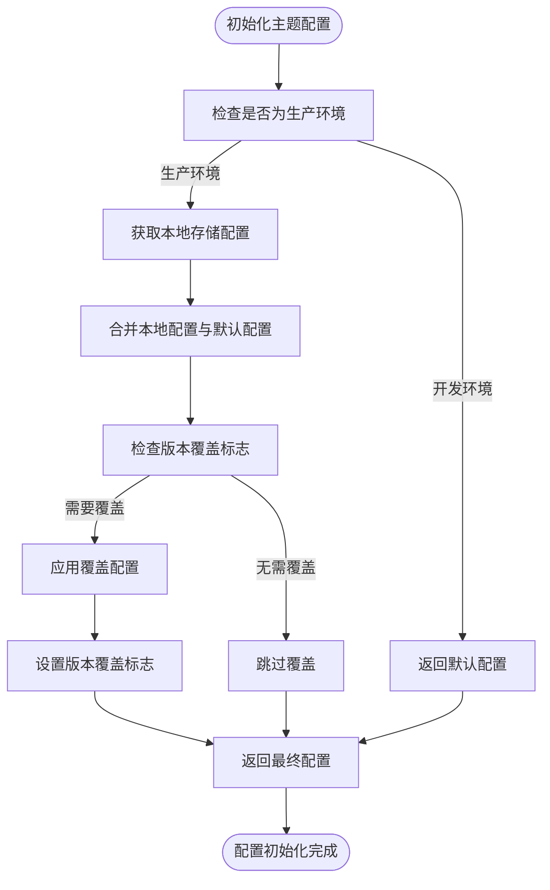
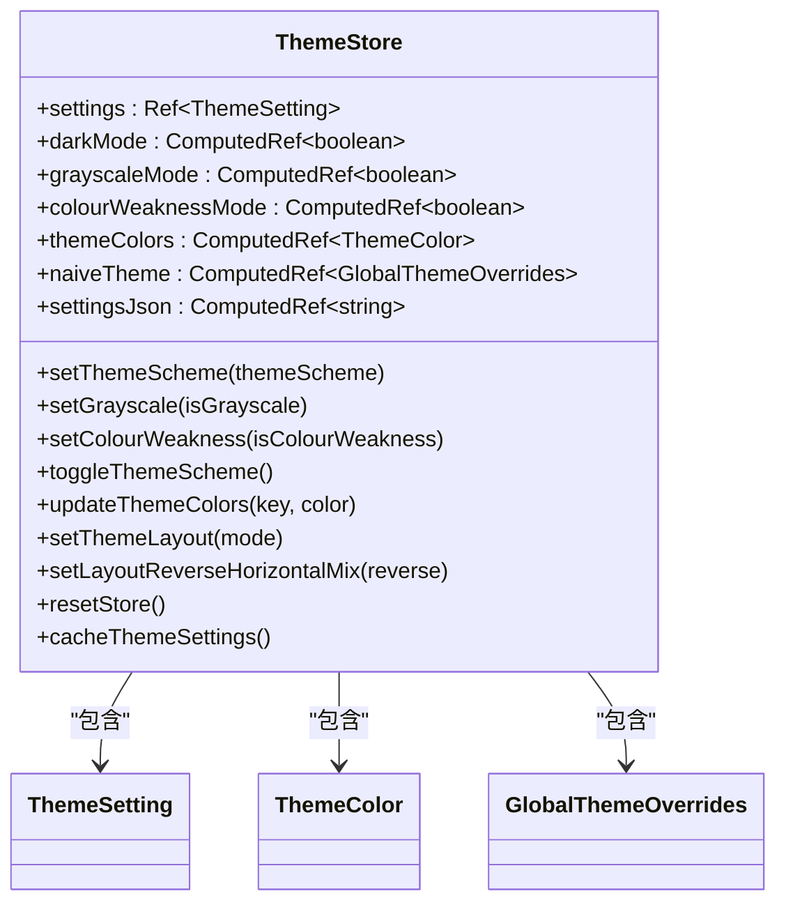
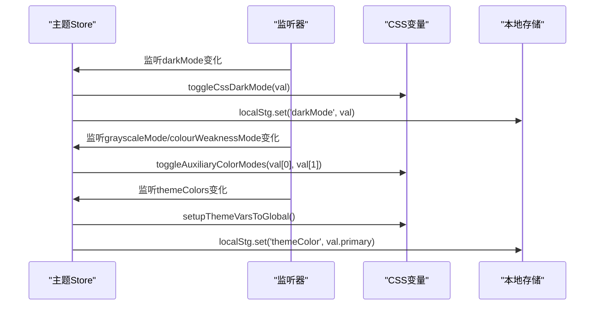
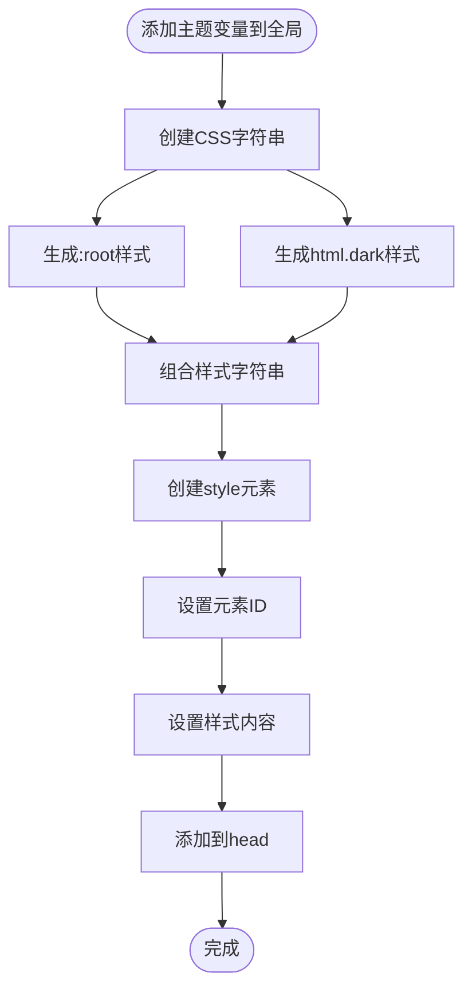
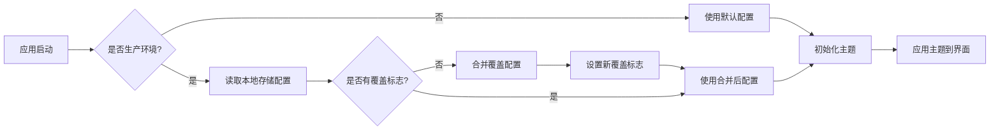

# 主题状态管理

<cite>
**本文档引用的文件**  
- [settings.ts](file://frontend/src/theme/settings.ts)
- [vars.ts](file://frontend/src/theme/vars.ts)
- [index.ts](file://frontend/src/store/modules/theme/index.ts)
- [shared.ts](file://frontend/src/store/modules/theme/shared.ts)
- [theme-schema-switch.vue](file://frontend/src/components/common/theme-schema-switch.vue)
- [app.ts](file://frontend/src/constants/app.ts)
</cite>

## 目录
1. [主题状态管理概述](#主题状态管理概述)
2. [主题配置结构与初始化](#主题配置结构与初始化)
3. [主题状态存储与响应式更新](#主题状态存储与响应式更新)
4. [主题切换组件实现](#主题切换组件实现)
5. [主题辅助函数与共享逻辑](#主题辅助函数与共享逻辑)
6. [主题持久化与恢复机制](#主题持久化与恢复机制)

## 主题状态管理概述

主题状态管理模块负责统一管理应用的视觉外观配置，包括主题模式（亮色/暗色/自动）、布局样式、颜色方案等属性。该模块通过Pinia状态管理库实现集中式状态管理，结合Vue的响应式系统，确保主题配置的变更能够实时同步到整个应用界面。

主题管理功能主要由以下几个核心部分组成：
- **主题配置定义**：在`settings.ts`中定义默认主题配置
- **状态存储**：使用Pinia store管理主题状态
- **响应式更新**：通过computed和watch实现自动更新
- **持久化存储**：利用localStorage实现配置持久化
- **UI组件**：提供主题切换、颜色选择等用户交互组件

**Section sources**
- [index.ts](file://frontend/src/store/modules/theme/index.ts#L1-L222)
- [settings.ts](file://frontend/src/theme/settings.ts#L1-L50)

## 主题配置结构与初始化

### 默认主题配置

主题配置在`frontend/src/theme/settings.ts`文件中定义，包含完整的主题设置结构。配置对象`themeSettings`定义了应用的默认外观属性。

```typescript
/** 默认主题设置 */
export const themeSettings: App.Theme.ThemeSetting = {
  themeScheme: 'auto',
  grayscale: false,
  colourWeakness: false,
  recommendColor: true,
  themeColor: '#646cff',
  otherColor: { info: '#2080f0', success: '#52c41a', warning: '#faad14', error: '#f5222d' },
  isInfoFollowPrimary: true,
  resetCacheStrategy: 'close',
  layout: { mode: 'vertical', scrollMode: 'content', reverseHorizontalMix: false },
  page: { animate: true, animateMode: 'fade-slide' },
  header: { height: 56, breadcrumb: { visible: false, showIcon: true }, multilingual: { visible: false } },
  tab: { visible: false, cache: true, height: 44, mode: 'chrome' },
  fixedHeaderAndTab: true,
  sider: {
    inverted: false,
    width: 180,
    collapsedWidth: 64,
    mixWidth: 90,
    mixCollapsedWidth: 64,
    mixChildMenuWidth: 200
  },
  footer: { visible: false, fixed: false, height: 48, right: true },
  watermark: { visible: false, text: '派聪明 PaiSmart' },
  tokens: {
    light: {
      colors: {
        container: 'rgb(255, 255, 255)',
        layout: 'rgb(247, 250, 252)',
        inverted: 'rgb(0, 20, 40)',
        'base-text': 'rgb(31, 31, 31)'
      },
      boxShadow: {
        header: '0 1px 2px rgb(0, 21, 41, 0.08)',
        sider: '2px 0 8px 0 rgb(29, 35, 41, 0.05)',
        tab: '0 1px 2px rgb(0, 21, 41, 0.08)'
      }
    },
    dark: { colors: { container: 'rgb(28, 28, 28)', layout: 'rgb(18, 18, 18)', 'base-text': 'rgb(224, 224, 224)' } }
  }
};
```

### 主题配置初始化逻辑

主题配置的初始化通过`initThemeSettings`函数实现，该函数位于`frontend/src/store/modules/theme/shared.ts`文件中。初始化过程根据应用环境和本地存储情况进行配置合并。



**Diagram sources**
- [shared.ts](file://frontend/src/store/modules/theme/shared.ts#L20-L55)

**Section sources**
- [settings.ts](file://frontend/src/theme/settings.ts#L1-L50)
- [shared.ts](file://frontend/src/store/modules/theme/shared.ts#L20-L55)

## 主题状态存储与响应式更新

### Pinia Store结构

主题状态通过Pinia store进行管理，定义在`frontend/src/store/modules/theme/index.ts`文件中。store使用`defineStore`创建，采用模块化设计。



**Diagram sources**
- [index.ts](file://frontend/src/store/modules/theme/index.ts#L1-L222)

### 响应式更新机制

主题store利用Vue的响应式系统实现自动更新。通过`computed`计算属性和`watch`监听器，确保配置变更时相关状态自动同步。

```typescript
/** 暗色模式 */
const darkMode = computed(() => {
  if (settings.value.themeScheme === 'auto') {
    return osTheme.value === 'dark';
  }
  return settings.value.themeScheme === 'dark';
});

/** 灰度模式 */
const grayscaleMode = computed(() => settings.value.grayscale);

/** 色弱模式 */
const colourWeaknessMode = computed(() => settings.value.colourWeakness);
```

store中的`scope.run()`方法设置了多个监听器，当相关状态变化时执行相应操作：



**Diagram sources**
- [index.ts](file://frontend/src/store/modules/theme/index.ts#L150-L190)

**Section sources**
- [index.ts](file://frontend/src/store/modules/theme/index.ts#L1-L222)
- [shared.ts](file://frontend/src/store/modules/theme/shared.ts#L100-L150)

## 主题切换组件实现

### theme-schema-switch组件

`theme-schema-switch`组件位于`frontend/src/components/common/theme-schema-switch.vue`，提供主题模式切换功能。

```typescript
<script setup lang="ts">
import { computed } from 'vue';
import type { PopoverPlacement } from 'naive-ui';
import { $t } from '@/locales';

defineOptions({ name: 'ThemeSchemaSwitch' });

interface Props {
  /** 主题模式 */
  themeSchema: UnionKey.ThemeScheme;
  /** 显示提示 */
  showTooltip?: boolean;
  /** 提示位置 */
  tooltipPlacement?: PopoverPlacement;
}

const props = withDefaults(defineProps<Props>(), {
  showTooltip: true,
  tooltipPlacement: 'bottom'
});

interface Emits {
  (e: 'switch'): void;
}

const emit = defineEmits<Emits>();

function handleSwitch() {
  emit('switch');
}

const icons: Record<UnionKey.ThemeScheme, string> = {
  light: 'material-symbols:sunny',
  dark: 'material-symbols:nightlight-rounded',
  auto: 'material-symbols:hdr-auto'
};

const icon = computed(() => icons[props.themeSchema]);

const tooltipContent = computed(() => {
  if (!props.showTooltip) return '';
  return $t('icon.themeSchema');
});
</script>
```

### 主题模式选项

主题模式的可用选项在`frontend/src/constants/app.ts`中定义，通过`themeSchemaRecord`常量提供。

```typescript
export const themeSchemaRecord: Record<UnionKey.ThemeScheme, App.I18n.I18nKey> = {
  light: 'theme.themeSchema.light',
  dark: 'theme.themeSchema.dark',
  auto: 'theme.themeSchema.auto'
};
```

这些选项与国际化键值关联，支持多语言显示。

**Section sources**
- [theme-schema-switch.vue](file://frontend/src/components/common/theme-schema-switch.vue#L1-L55)
- [app.ts](file://frontend/src/constants/app.ts#L6-L10)

## 主题辅助函数与共享逻辑

### 主题变量生成

`shared.ts`文件中的`createThemeToken`函数负责生成CSS变量值，基于主题配置创建主题令牌。

```typescript
/**
 * 创建主题令牌CSS变量值
 *
 * @param colors 主题颜色
 * @param tokens 主题设置令牌
 * @param recommended 是否使用推荐颜色
 */
export function createThemeToken(
  colors: App.Theme.ThemeColor,
  tokens?: App.Theme.ThemeSetting['tokens'],
  recommended = false
) {
  const paletteColors = createThemePaletteColors(colors, recommended);
  const { light, dark } = tokens || themeSettings.tokens;

  const themeTokens: App.Theme.ThemeTokenCSSVars = {
    colors: {
      ...paletteColors,
      nprogress: paletteColors.primary,
      ...light.colors
    },
    boxShadow: {
      ...light.boxShadow
    }
  };

  const darkThemeTokens: App.Theme.ThemeTokenCSSVars = {
    colors: {
      ...themeTokens.colors,
      ...dark?.colors
    },
    boxShadow: {
      ...themeTokens.boxShadow,
      ...dark?.boxShadow
    }
  };

  return {
    themeTokens,
    darkThemeTokens
  };
}
```

### CSS变量注入

`addThemeVarsToGlobal`函数将生成的主题变量注入到全局CSS中，实现主题样式的动态更新。



**Diagram sources**
- [shared.ts](file://frontend/src/store/modules/theme/shared.ts#L100-L150)

### Naive UI主题生成

为Naive UI组件库生成主题覆盖配置，确保第三方组件与应用主题保持一致。

```typescript
/**
 * 获取Naive主题
 *
 * @param colors 主题颜色
 * @param recommended 是否使用推荐颜色
 */
export function getNaiveTheme(colors: App.Theme.ThemeColor, recommended = false) {
  const { primary: colorLoading } = colors;

  const theme: GlobalThemeOverrides = {
    common: {
      ...getNaiveThemeColors(colors, recommended),
      borderRadius: '6px'
    },
    LoadingBar: {
      colorLoading
    },
    Tag: {
      borderRadius: '6px'
    }
  };

  return theme;
}
```

**Section sources**
- [shared.ts](file://frontend/src/store/modules/theme/shared.ts#L100-L258)

## 主题持久化与恢复机制

### 持久化存储策略

主题配置的持久化通过`localStg`工具实现，采用不同的策略处理开发和生产环境。

```typescript
/** 缓存主题设置 */
function cacheThemeSettings() {
  const isProd = import.meta.env.PROD;

  if (!isProd) return;

  localStg.set('themeSettings', settings.value);
}

// 页面关闭或刷新时缓存主题设置
useEventListener(window, 'beforeunload', () => {
  cacheThemeSettings();
});
```

### 版本覆盖机制

为支持新版本发布时的主题配置更新，实现了版本覆盖标志机制。

```typescript
const isOverride = localStg.get('overrideThemeFlag') === BUILD_TIME;

if (!isOverride) {
  settings = defu(overrideThemeSettings, settings);
  localStg.set('overrideThemeFlag', BUILD_TIME);
}
```

### 最佳实践方案

1. **开发环境**：直接使用`themeSettings`中的配置，便于快速调试
2. **生产环境**：优先使用本地存储的配置，确保用户偏好持久化
3. **版本更新**：通过`overrideThemeSettings`覆盖特定配置项
4. **数据安全**：敏感配置不存储在本地，避免信息泄露
5. **性能优化**：仅在必要时更新CSS变量，减少重绘开销



**Diagram sources**
- [shared.ts](file://frontend/src/store/modules/theme/shared.ts#L20-L55)
- [index.ts](file://frontend/src/store/modules/theme/index.ts#L190-L200)

**Section sources**
- [shared.ts](file://frontend/src/store/modules/theme/shared.ts#L20-L55)
- [index.ts](file://frontend/src/store/modules/theme/index.ts#L190-L200)