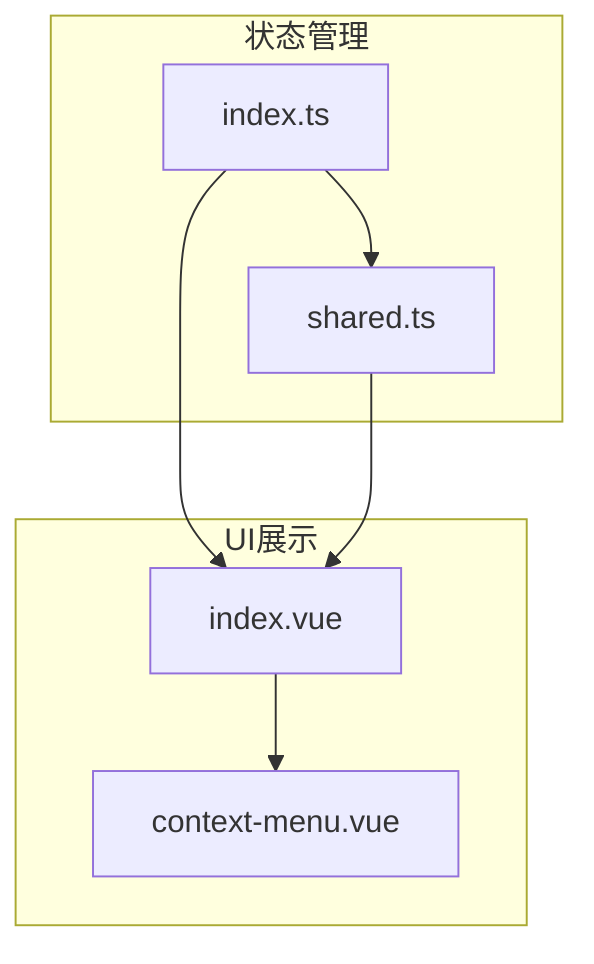
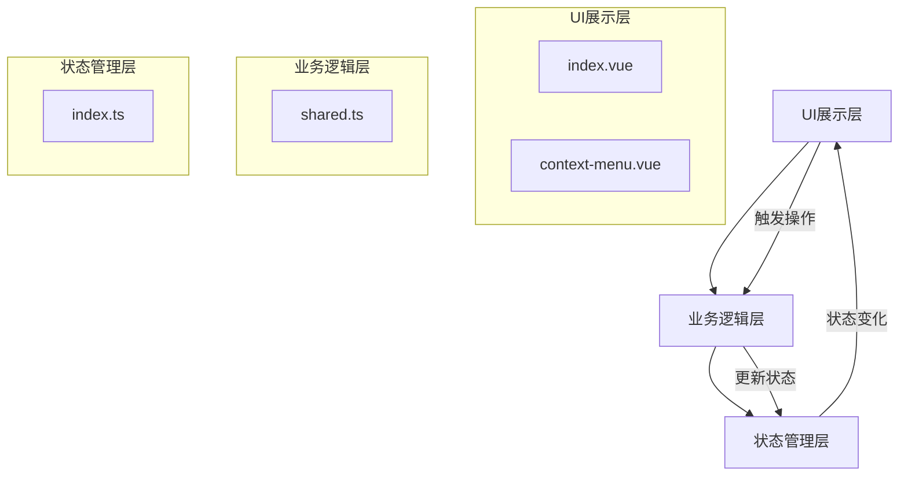
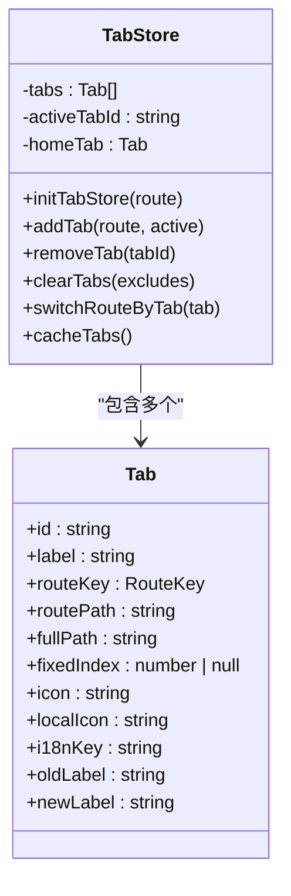
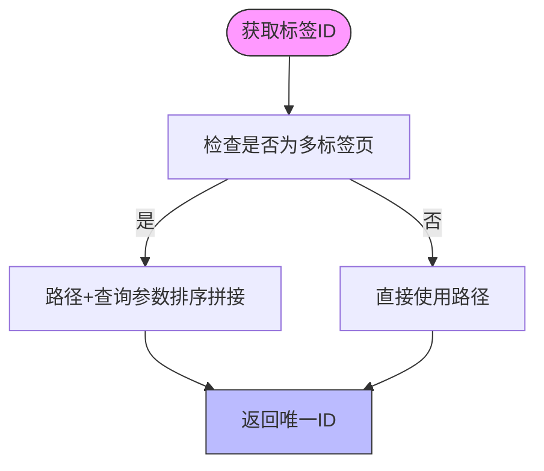
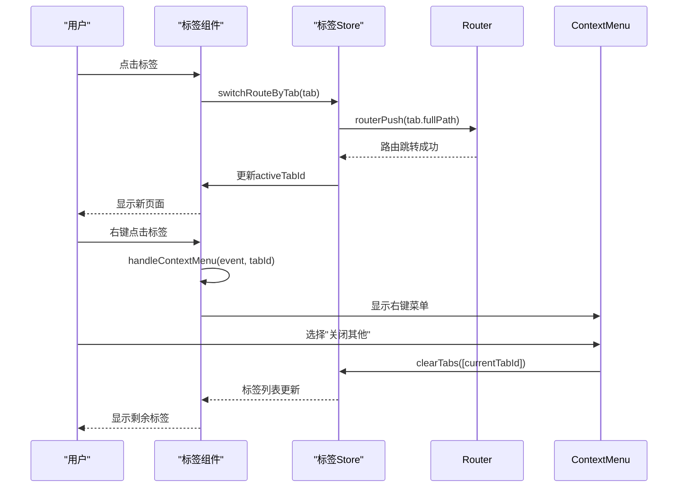
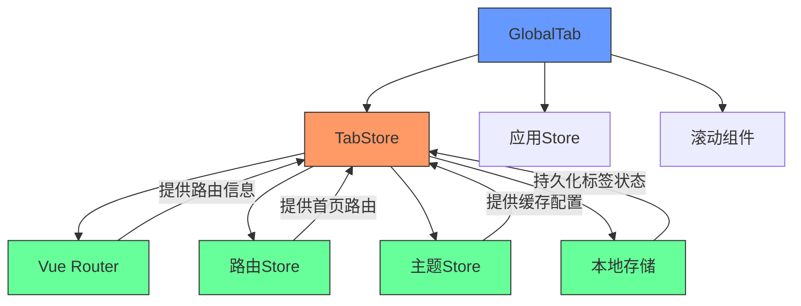

# 标签页状态管理

<cite>
**本文档引用文件**  
- [index.ts](file://frontend/src/store/modules/tab/index.ts)
- [shared.ts](file://frontend/src/store/modules/tab/shared.ts)
- [index.vue](file://frontend/src/layouts/modules/global-tab/index.vue)
- [context-menu.vue](file://frontend/src/layouts/modules/global-tab/context-menu.vue)
</cite>

## 目录
1. [引言](#引言)
2. [项目结构](#项目结构)
3. [核心组件](#核心组件)
4. [架构概览](#架构概览)
5. [详细组件分析](#详细组件分析)
6. [依赖关系分析](#依赖关系分析)
7. [性能考量](#性能考量)
8. [故障排查指南](#故障排查指南)
9. [结论](#结论)

## 引言
本文档详细说明了PaiSmart项目中标签页（Tab）状态管理的设计与实现。重点分析了多标签页的打开状态维护机制，包括当前激活标签、已打开页面列表、标签缓存策略等核心状态的实现逻辑。通过解析`index.ts`中的状态操作逻辑，结合`shared.ts`探讨标签状态与其他模块（如路由、应用）的数据交互模式，并展示`global-tab`组件如何实现右键菜单、关闭其他标签、重新加载等用户交互功能。同时提供标签状态持久化配置示例，并讨论大量标签同时打开时的内存优化策略。

## 项目结构
标签页状态管理功能主要集中在前端模块的store和布局组件中。其核心逻辑位于`frontend/src/store/modules/tab`目录下，由`index.ts`和`shared.ts`两个文件构成状态管理模块。UI展示层则由`frontend/src/layouts/modules/global-tab`目录下的`index.vue`和`context-menu.vue`组件实现。

**图示来源**  
- [index.ts](file://frontend/src/store/modules/tab/index.ts)
- [shared.ts](file://frontend/src/store/modules/tab/shared.ts)
- [index.vue](file://frontend/src/layouts/modules/global-tab/index.vue)
- [context-menu.vue](file://frontend/src/layouts/modules/global-tab/context-menu.vue)

**本节来源**  
- [index.ts](file://frontend/src/store/modules/tab/index.ts)
- [shared.ts](file://frontend/src/store/modules/tab/shared.ts)
- [index.vue](file://frontend/src/layouts/modules/global-tab/index.vue)

## 核心组件
标签页状态管理的核心是`useTabStore`，它基于Pinia实现，负责维护所有标签页的状态。该store通过`tabs`数组存储所有打开的标签，使用`activeTabId`跟踪当前激活的标签，并通过`homeTab`保留首页标签的引用。所有状态变更操作都封装在store的actions中，确保状态变更的可预测性和可追踪性。

**本节来源**  
- [index.ts](file://frontend/src/store/modules/tab/index.ts#L1-L308)

## 架构概览
整个标签页管理系统采用分层架构设计，分为状态管理层、业务逻辑层和UI展示层。状态管理层使用Pinia store集中管理标签状态；业务逻辑层通过`shared.ts`提供通用的标签处理函数；UI展示层则通过Vue组件实现用户交互界面。

**图示来源**  
- [index.ts](file://frontend/src/store/modules/tab/index.ts)
- [shared.ts](file://frontend/src/store/modules/tab/shared.ts)
- [index.vue](file://frontend/src/layouts/modules/global-tab/index.vue)
- [context-menu.vue](file://frontend/src/layouts/modules/global-tab/context-menu.vue)

## 详细组件分析

### 标签状态管理分析
`useTabStore`是标签页状态管理的核心，它定义了标签状态的数据结构和所有操作方法。

#### 状态数据结构

**图示来源**  
- [index.ts](file://frontend/src/store/modules/tab/index.ts#L1-L308)
- [shared.ts](file://frontend/src/store/modules/tab/shared.ts#L1-L252)

#### 标签增删改查操作
`index.ts`中定义了完整的标签操作API：

- **添加标签**：`addTab(route, active)` 方法根据路由信息创建标签并添加到标签列表中
- **删除标签**：`removeTab(tabId)` 方法移除指定ID的标签，并自动切换到相邻标签
- **替换标签**：`replaceTab(key, options)` 方法用于在路由跳转时替换当前标签
- **清空标签**：`clearTabs(excludes)` 方法清除所有非固定标签，可指定保留的标签

这些操作都通过Pinia的action机制实现，确保状态变更的响应性和一致性。

**本节来源**  
- [index.ts](file://frontend/src/store/modules/tab/index.ts#L1-L308)

### 标签共享逻辑分析
`shared.ts`文件提供了标签管理的通用工具函数，这些函数被`index.ts`中的store调用，实现了标签状态的计算和转换逻辑。

#### 标签ID生成逻辑

**图示来源**  
- [shared.ts](file://frontend/src/store/modules/tab/shared.ts#L50-L65)

#### 国际化标签更新
`updateTabsByI18nKey`函数负责根据当前语言环境更新标签的显示文本，确保标签标题能够随语言切换而自动更新。

**本节来源**  
- [shared.ts](file://frontend/src/store/modules/tab/shared.ts#L1-L252)

### 全局标签组件分析
`global-tab/index.vue`组件实现了标签页的UI展示和用户交互功能。

#### 组件交互流程

**图示来源**  
- [index.vue](file://frontend/src/layouts/modules/global-tab/index.vue#L1-L215)
- [context-menu.vue](file://frontend/src/layouts/modules/global-tab/context-menu.vue#L1-L124)

#### 右键菜单功能
`context-menu.vue`组件实现了标签页的右键菜单功能，提供以下操作：
- 关闭当前：关闭当前标签页
- 关闭其他：关闭除当前外的所有标签页
- 关闭左侧：关闭当前标签左侧的所有标签页
- 关闭右侧：关闭当前标签右侧的所有标签页
- 关闭全部：关闭所有非固定标签页

菜单项的禁用状态根据当前标签的类型（如首页标签）动态计算。

**本节来源**  
- [index.vue](file://frontend/src/layouts/modules/global-tab/index.vue#L1-L215)
- [context-menu.vue](file://frontend/src/layouts/modules/global-tab/context-menu.vue#L1-L124)

## 依赖关系分析
标签页管理系统与其他模块存在紧密的依赖关系，形成了一个完整的功能闭环。

**图示来源**  
- [index.ts](file://frontend/src/store/modules/tab/index.ts#L1-L308)
- [index.vue](file://frontend/src/layouts/modules/global-tab/index.vue#L1-L215)

## 性能考量
标签页管理系统在设计时考虑了多项性能优化策略：

1. **标签缓存策略**：通过`themeStore.tab.cache`配置项控制是否启用标签状态持久化，避免不必要的本地存储操作。
2. **内存优化**：使用`beforeunload`事件监听器，在页面关闭或刷新时才进行标签状态的持久化，减少运行时的IO操作。
3. **滚动性能**：集成`BetterScroll`组件，优化大量标签时的水平滚动性能，确保流畅的用户体验。
4. **计算属性优化**：使用Vue的`computed`属性`allTabs`来缓存计算结果，避免重复计算。

当大量标签同时打开时，建议通过固定标签（fixedIndex）机制将常用标签固定在左侧，减少频繁的数组操作对性能的影响。

## 故障排查指南
### 标签状态不同步问题
**现象**：标签页与实际路由不一致  
**排查步骤**：
1. 检查`watch(route.fullPath)`监听器是否正常工作
2. 确认`addTab`方法是否被正确调用
3. 验证`switchRouteByTab`中的路由跳转是否成功

### 标签无法关闭问题
**现象**：尝试关闭标签但无反应  
**排查步骤**：
1. 检查`removeTab`方法中`findIndex`是否找到目标标签
2. 确认`isTabRetain`判断逻辑是否正确阻止了固定标签的关闭
3. 验证`routerPush`在切换标签时是否成功

### 标签缓存失效问题
**现象**：页面刷新后标签状态丢失  
**排查步骤**：
1. 检查`themeStore.tab.cache`配置是否启用
2. 验证`beforeunload`事件监听器是否注册成功
3. 确认`localStg.set('globalTabs', tabs.value)`是否执行

**本节来源**  
- [index.ts](file://frontend/src/store/modules/tab/index.ts#L1-L308)
- [index.vue](file://frontend/src/layouts/modules/global-tab/index.vue#L1-L215)

## 结论
PaiSmart项目的标签页状态管理系统采用分层架构设计，通过Pinia store集中管理标签状态，实现了标签的增删改查、缓存持久化、多语言支持等核心功能。系统通过`global-tab`组件提供丰富的用户交互体验，包括右键菜单、滚动定位等特性。整体设计考虑了性能优化和用户体验，为多标签页应用提供了稳定可靠的状态管理解决方案。建议在实际使用中合理配置标签缓存策略，并利用固定标签机制优化大量标签场景下的性能表现。