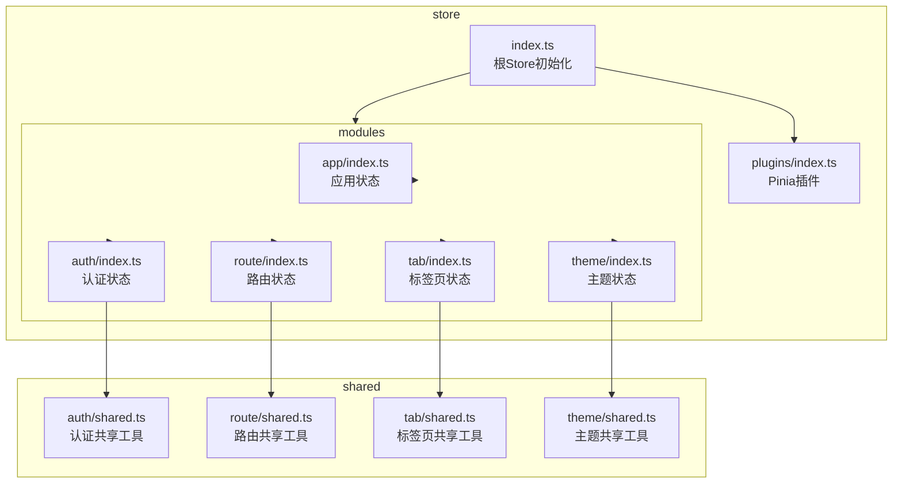
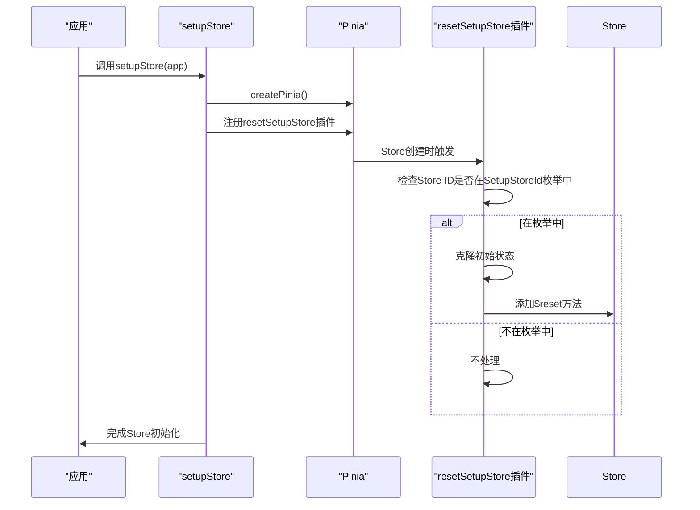
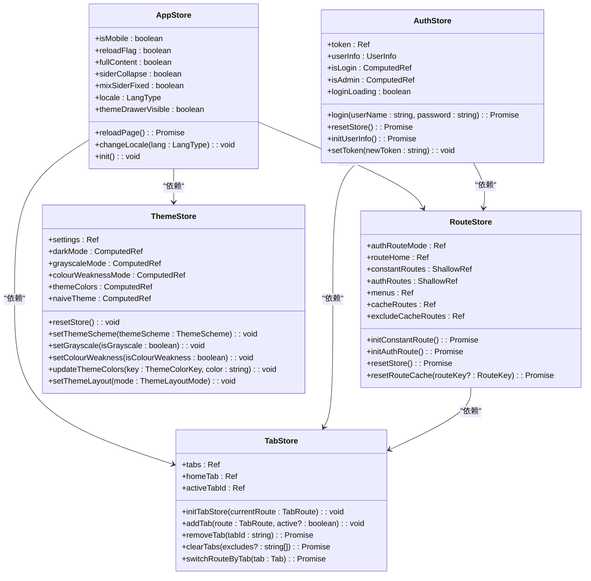
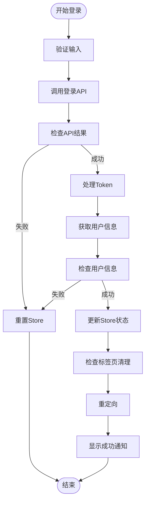
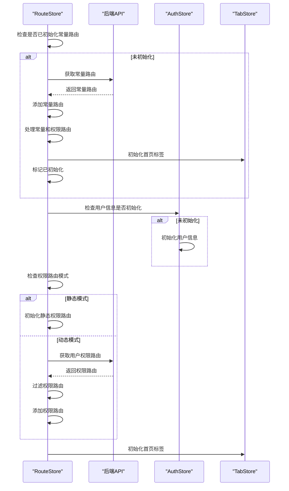
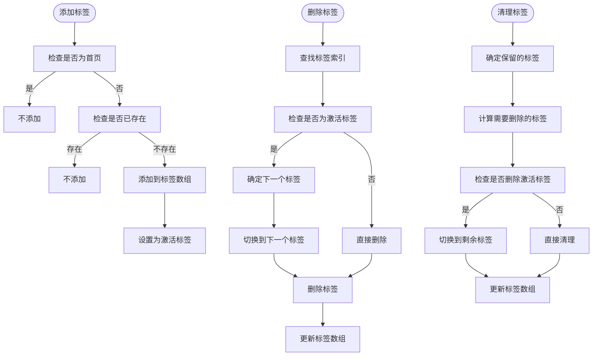
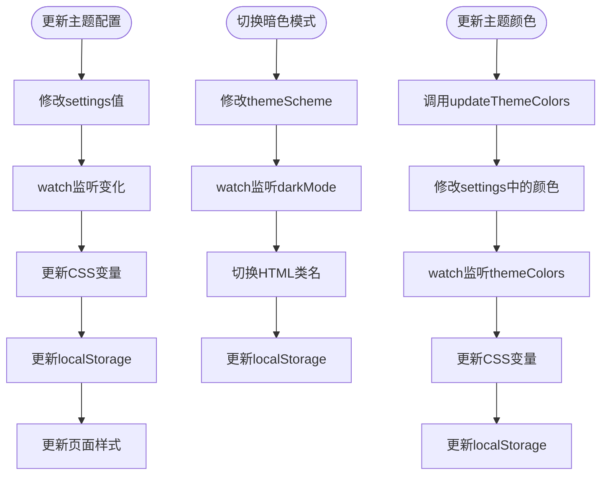
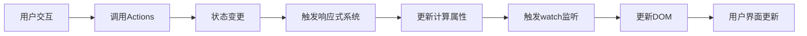

# 状态管理

<cite>
**本文档引用的文件**   
- [store/index.ts](file://frontend/src/store/index.ts)
- [store/plugins/index.ts](file://frontend/src/store/plugins/index.ts)
- [enum/index.ts](file://frontend/src/enum/index.ts)
- [modules/app/index.ts](file://frontend/src/store/modules/app/index.ts)
- [modules/auth/index.ts](file://frontend/src/store/modules/auth/index.ts)
- [modules/route/index.ts](file://frontend/src/store/modules/route/index.ts)
- [modules/tab/index.ts](file://frontend/src/store/modules/tab/index.ts)
- [modules/theme/index.ts](file://frontend/src/store/modules/theme/index.ts)
- [modules/auth/shared.ts](file://frontend/src/store/modules/auth/shared.ts)
- [modules/route/shared.ts](file://frontend/src/store/modules/route/shared.ts)
- [modules/tab/shared.ts](file://frontend/src/store/modules/tab/shared.ts)
- [modules/theme/shared.ts](file://frontend/src/store/modules/theme/shared.ts)
</cite>

## 目录
1. [项目结构](#项目结构)
2. [根Store初始化与插件集成](#根store初始化与插件集成)
3. [模块化Store设计与数据分域](#模块化store设计与数据分域)
4. [认证状态管理](#认证状态管理)
5. [动态路由存储](#动态路由存储)
6. [多标签页状态维护](#多标签页状态维护)
7. [主题配置控制](#主题配置控制)
8. [模块间状态共享实践](#模块间状态共享实践)
9. [状态订阅与Actions调用](#状态订阅与actions调用)
10. [持久化配置与响应式机制](#持久化配置与响应式机制)

## 项目结构

项目采用模块化状态管理架构，基于Pinia实现。状态管理相关代码位于`frontend/src/store`目录下，主要包含以下结构：



**Diagram sources**
- [store/index.ts](file://frontend/src/store/index.ts)
- [store/modules/app/index.ts](file://frontend/src/store/modules/app/index.ts)
- [store/modules/auth/index.ts](file://frontend/src/store/modules/auth/index.ts)
- [store/modules/route/index.ts](file://frontend/src/store/modules/route/index.ts)
- [store/modules/tab/index.ts](file://frontend/src/store/modules/tab/index.ts)
- [store/modules/theme/index.ts](file://frontend/src/store/modules/theme/index.ts)

## 根Store初始化与插件集成

根Store的初始化通过`setupStore`函数完成，该函数在应用启动时被调用，负责创建Pinia实例并注册插件。

```typescript
import type { App } from 'vue';
import { createPinia } from 'pinia';
import { resetSetupStore } from './plugins';

/** 设置Vue状态管理插件pinia */
export function setupStore(app: App) {
  const store = createPinia();

  store.use(resetSetupStore);

  app.use(store);
}
```

根Store集成了自定义的`resetSetupStore`插件，该插件为使用setup语法创建的Store提供状态重置功能。插件通过拦截Store创建过程，为符合条件的Store添加`$reset`方法。



**Diagram sources**
- [store/index.ts](file://frontend/src/store/index.ts#L0-L11)
- [store/plugins/index.ts](file://frontend/src/store/plugins/index.ts#L0-L21)

**Section sources**
- [store/index.ts](file://frontend/src/store/index.ts#L0-L11)
- [store/plugins/index.ts](file://frontend/src/store/plugins/index.ts#L0-L21)

## 模块化Store设计与数据分域

项目采用模块化Store设计，将不同功能领域的状态分离到独立的模块中，实现数据分域管理。每个模块对应一个独立的Store，通过`SetupStoreId`枚举进行标识。

```typescript
export enum SetupStoreId {
  App = 'app-store',
  Theme = 'theme-store',
  Auth = 'auth-store',
  Route = 'route-store',
  Tab = 'tab-store',
  KnowledgeBase = 'knowledge-base-store',
  Chat = 'chat-store'
}
```

各模块Store的设计理念如下：

- **app模块**：管理应用级别的UI状态，如侧边栏折叠、主题抽屉可见性等
- **auth模块**：管理用户认证相关状态，如token、用户信息等
- **route模块**：管理路由相关状态，如菜单、权限路由等
- **tab模块**：管理多标签页状态，如打开的标签、激活标签等
- **theme模块**：管理主题配置状态，如颜色、布局模式等

这种分域策略的优势包括：

1. **职责分离**：每个Store只关注特定领域的状态，降低耦合度
2. **可维护性**：状态变更影响范围明确，便于调试和维护
3. **性能优化**：状态订阅可以精确到具体模块，避免不必要的重新渲染
4. **团队协作**：不同开发人员可以独立开发和维护各自的Store模块



**Diagram sources**
- [enum/index.ts](file://frontend/src/enum/index.ts#L0-L8)
- [modules/app/index.ts](file://frontend/src/store/modules/app/index.ts)
- [modules/auth/index.ts](file://frontend/src/store/modules/auth/index.ts)
- [modules/route/index.ts](file://frontend/src/store/modules/route/index.ts)
- [modules/tab/index.ts](file://frontend/src/store/modules/tab/index.ts)
- [modules/theme/index.ts](file://frontend/src/store/modules/theme/index.ts)

## 认证状态管理

auth模块负责管理用户认证状态，包括token、用户信息、登录状态等。Store使用Pinia的setup语法创建，通过`defineStore`函数定义。

```typescript
export const useAuthStore = defineStore(SetupStoreId.Auth, () => {
  const token = ref(getToken());
  const userInfo: Api.Auth.UserInfo = reactive({
    id: 0,
    username: '',
    role: 'USER',
    orgTags: [],
    primaryOrg: ''
  });

  const isAdmin = computed(() => userInfo.role === 'ADMIN');
  const isLogin = computed(() => Boolean(token.value));

  // ... 其他状态和方法
});
```

关键状态和方法包括：

- **token**：使用`ref`创建的响应式引用，存储用户的认证token
- **userInfo**：使用`reactive`创建的响应式对象，存储用户详细信息
- **isAdmin**：计算属性，判断用户是否为管理员角色
- **isLogin**：计算属性，判断用户是否已登录
- **login**：登录方法，处理用户名密码登录流程
- **resetStore**：重置Store状态，清除认证信息并跳转到登录页

登录流程的实现细节：



**Section sources**
- [modules/auth/index.ts](file://frontend/src/store/modules/auth/index.ts)

## 动态路由存储

route模块负责存储和管理动态路由信息，包括权限路由、菜单、缓存路由等。Store的设计考虑了静态和动态两种权限路由模式。

```typescript
export const useRouteStore = defineStore(SetupStoreId.Route, () => {
  const authRouteMode = ref(import.meta.env.VITE_AUTH_ROUTE_MODE);
  const constantRoutes = shallowRef<ElegantConstRoute[]>([]);
  const authRoutes = shallowRef<ElegantConstRoute[]>([]);
  const menus = ref<App.Global.Menu[]>([]);
  const cacheRoutes = ref<RouteKey[]>([]);
  const excludeCacheRoutes = ref<RouteKey[]>([]);

  // ... 其他状态和方法
});
```

关键功能包括：

- **权限路由模式**：支持静态和动态两种模式，通过环境变量配置
- **常量路由**：存储不需要权限控制的路由
- **权限路由**：存储需要权限控制的路由
- **菜单**：基于权限路由生成的全局菜单
- **缓存路由**：需要keep-alive缓存的路由名称
- **排除缓存路由**：临时排除缓存的路由，用于刷新特定页面

动态路由的初始化流程：



**Section sources**
- [modules/route/index.ts](file://frontend/src/store/modules/route/index.ts)

## 多标签页状态维护

tab模块负责维护多标签页状态，包括打开的标签、激活标签、标签操作等。Store的设计考虑了标签的固定、缓存、多标签等功能。

```typescript
export const useTabStore = defineStore(SetupStoreId.Tab, () => {
  const tabs = ref<App.Global.Tab[]>([]);
  const homeTab = ref<App.Global.Tab>();
  const activeTabId = ref<string>('');

  // ... 其他状态和方法
});
```

关键功能包括：

- **标签管理**：管理所有打开的标签页
- **首页标签**：特殊处理的首页标签，通常不可关闭
- **激活标签**：当前激活的标签页
- **标签操作**：提供添加、删除、切换、清理等操作方法

标签操作的实现细节：



**Section sources**
- [modules/tab/index.ts](file://frontend/src/store/modules/tab/index.ts)

## 主题配置控制

theme模块负责控制主题配置，包括颜色、布局、暗色模式等。Store的设计考虑了主题的持久化、响应式更新等功能。

```typescript
export const useThemeStore = defineStore(SetupStoreId.Theme, () => {
  const settings: Ref<App.Theme.ThemeSetting> = ref(initThemeSettings());
  const darkMode = computed(() => {
    if (settings.value.themeScheme === 'auto') {
      return osTheme.value === 'dark';
    }
    return settings.value.themeScheme === 'dark';
  });
  const themeColors = computed(() => {
    const { themeColor, otherColor, isInfoFollowPrimary } = settings.value;
    const colors: App.Theme.ThemeColor = {
      primary: themeColor,
      ...otherColor,
      info: isInfoFollowPrimary ? themeColor : otherColor.info
    };
    return colors;
  });

  // ... 其他状态和方法
});
```

关键功能包括：

- **主题设置**：存储完整的主题配置
- **暗色模式**：计算属性，根据系统偏好和用户设置确定是否启用暗色模式
- **主题颜色**：计算属性，生成完整的主题颜色方案
- **Naive主题**：为Naive UI组件库生成的主题覆盖
- **CSS变量**：将主题配置转换为CSS变量并注入到页面

主题配置的更新流程：



**Section sources**
- [modules/theme/index.ts](file://frontend/src/store/modules/theme/index.ts)

## 模块间状态共享实践

项目通过shared文件实现模块间状态共享的最佳实践。每个模块的shared文件包含该模块相关的工具函数和共享逻辑，避免在Store内部实现复杂的业务逻辑。

### 认证模块共享

auth模块的shared文件提供了token管理和认证存储清理功能：

```typescript
/** 获取token */
export function getToken() {
  return localStg.get('token') || '';
}

/** 清除认证存储 */
export function clearAuthStorage() {
  localStg.remove('token');
  localStg.remove('refreshToken');
}
```

这种设计的优势：
- **单一职责**：将存储操作与业务逻辑分离
- **可复用性**：其他模块可以复用这些工具函数
- **测试友好**：工具函数可以独立测试

### 路由模块共享

route模块的shared文件包含了路由相关的工具函数：

```typescript
/**
 * 根据角色过滤权限路由
 *
 * @param routes 权限路由
 * @param role 角色
 */
export function filterAuthRoutesByRoles(routes: ElegantConstRoute[], role: string) {
  return routes.flatMap(route => filterAuthRouteByRoles(route, role));
}

/**
 * 获取缓存路由名称
 *
 * @param routes Vue路由（两级）
 */
export function getCacheRouteNames(routes: RouteRecordRaw[]) {
  const cacheNames: LastLevelRouteKey[] = [];

  routes.forEach(route => {
    route.children?.forEach(child => {
      if (child.component && child.meta?.keepAlive) {
        cacheNames.push(child.name as LastLevelRouteKey);
      }
    });
  });

  return cacheNames;
}
```

### 标签页模块共享

tab模块的shared文件提供了标签页相关的工具函数：

```typescript
/**
 * 根据路由获取标签ID
 *
 * @param route 路由
 */
export function getTabIdByRoute(route: App.Global.TabRoute) {
  const { path, query = {}, meta } = route;

  let id = path;

  if (meta.multiTab) {
    const queryKeys = Object.keys(query).sort();
    const qs = queryKeys.map(key => `${key}=${query[key]}`).join('&');

    id = `${path}?${qs}`;
  }

  return id;
}

/**
 * 获取默认首页标签
 *
 * @param router
 * @param homeRouteName useRouteStore中的routeHome
 */
export function getDefaultHomeTab(router: Router, homeRouteName: LastLevelRouteKey) {
  const homeRoutePath = getRoutePath(homeRouteName);
  const i18nLabel = $t(`route.${homeRouteName}`);

  let homeTab: App.Global.Tab = {
    id: getRoutePath(homeRouteName),
    label: i18nLabel || homeRouteName,
    routeKey: homeRouteName,
    routePath: homeRoutePath,
    fullPath: homeRoutePath
  };

  const routes = router.getRoutes();
  const homeRoute = routes.find(route => route.name === homeRouteName);
  if (homeRoute) {
    homeTab = getTabByRoute(homeRoute);
  }

  return homeTab;
}
```

### 主题模块共享

theme模块的shared文件提供了主题相关的工具函数：

```typescript
/** 初始化主题设置 */
export function initThemeSettings() {
  const isProd = import.meta.env.PROD;

  if (!isProd) return themeSettings;

  const localSettings = localStg.get('themeSettings');

  let settings = defu(localSettings, themeSettings);

  const isOverride = localStg.get('overrideThemeFlag') === BUILD_TIME;

  if (!isOverride) {
    settings = defu(overrideThemeSettings, settings);

    localStg.set('overrideThemeFlag', BUILD_TIME);
  }

  return settings;
}

/**
 * 创建主题token CSS变量值
 *
 * @param colors 主题颜色
 * @param tokens 主题设置tokens
 * @param [recommended=false] 使用推荐颜色。默认为`false`
 */
export function createThemeToken(
  colors: App.Theme.ThemeColor,
  tokens?: App.Theme.ThemeSetting['tokens'],
  recommended = false
) {
  const paletteColors = createThemePaletteColors(colors, recommended);

  const { light, dark } = tokens || themeSettings.tokens;

  const themeTokens: App.Theme.ThemeTokenCSSVars = {
    colors: {
      ...paletteColors,
      nprogress: paletteColors.primary,
      ...light.colors
    },
    boxShadow: {
      ...light.boxShadow
    }
  };

  const darkThemeTokens: App.Theme.ThemeTokenCSSVars = {
    colors: {
      ...themeTokens.colors,
      ...dark?.colors
    },
    boxShadow: {
      ...themeTokens.boxShadow,
      ...dark?.boxShadow
    }
  };

  return {
    themeTokens,
    darkThemeTokens
  };
}
```

这种模块间状态共享的实践优势：
- **逻辑分离**：将复杂的业务逻辑从Store中分离出来
- **代码复用**：工具函数可以在多个地方复用
- **易于测试**：独立的工具函数更容易进行单元测试
- **维护性好**：当需要修改共享逻辑时，只需修改shared文件

**Section sources**
- [modules/auth/shared.ts](file://frontend/src/store/modules/auth/shared.ts)
- [modules/route/shared.ts](file://frontend/src/store/modules/route/shared.ts)
- [modules/tab/shared.ts](file://frontend/src/store/modules/tab/shared.ts)
- [modules/theme/shared.ts](file://frontend/src/store/modules/theme/shared.ts)

## 状态订阅与Actions调用

在组件中使用Store的状态和方法非常简单，通过导入对应的`useStore`函数即可。

### 状态订阅示例

```typescript
import { useThemeStore } from '@/store/modules/theme';

export default {
  setup() {
    const themeStore = useThemeStore();
    
    // 订阅响应式状态
    const { darkMode, themeColors } = storeToRefs(themeStore);
    
    return {
      darkMode,
      themeColors
    };
  }
};
```

### Actions调用示例

```typescript
import { useAuthStore } from '@/store/modules/auth';

export default {
  setup() {
    const authStore = useAuthStore();
    
    const handleLogin = async () => {
      try {
        await authStore.login(username.value, password.value);
        // 登录成功后的处理
      } catch (error) {
        // 登录失败的处理
      }
    };
    
    return {
      handleLogin
    };
  }
};
```

### 计算属性使用

```typescript
import { useAuthStore } from '@/store/modules/auth';

export default {
  setup() {
    const authStore = useAuthStore();
    
    // 直接使用Store中的计算属性
    const { isLogin, isAdmin } = authStore;
    
    return {
      isLogin,
      isAdmin
    };
  }
};
```

### 组合多个Store

```typescript
import { useAppStore } from '@/store/modules/app';
import { useThemeStore } from '@/store/modules/theme';
import { useTabStore } from '@/store/modules/tab';

export default {
  setup() {
    const appStore = useAppStore();
    const themeStore = useThemeStore();
    const tabStore = useTabStore();
    
    const toggleSider = () => {
      appStore.toggleSiderCollapse();
    };
    
    const changeTheme = (mode) => {
      themeStore.setThemeScheme(mode);
    };
    
    const closeAllTabs = () => {
      tabStore.clearTabs();
    };
    
    return {
      toggleSider,
      changeTheme,
      closeAllTabs
    };
  }
};
```

**Section sources**
- [modules/app/index.ts](file://frontend/src/store/modules/app/index.ts)
- [modules/auth/index.ts](file://frontend/src/store/modules/auth/index.ts)
- [modules/route/index.ts](file://frontend/src/store/modules/route/index.ts)
- [modules/tab/index.ts](file://frontend/src/store/modules/tab/index.ts)
- [modules/theme/index.ts](file://frontend/src/store/modules/theme/index.ts)

## 持久化配置与响应式机制

### 持久化配置

项目通过localStorage实现状态的持久化，主要在以下场景使用：

1. **认证信息持久化**：token和refreshToken存储在localStorage中
2. **主题设置持久化**：主题配置在生产环境存储在localStorage中
3. **标签页状态持久化**：标签页信息可选择性地存储在localStorage中
4. **用户偏好持久化**：语言、侧边栏固定状态等用户偏好设置

持久化实现方式：

```typescript
// 在Store中使用localStg进行持久化
import { localStg } from '@/utils/storage';

// 写入持久化数据
localStg.set('token', token);

// 读取持久化数据
const token = localStg.get('token');

// 移除持久化数据
localStg.remove('token');
```

### 响应式机制

项目充分利用Vue 3的响应式系统，通过ref、reactive、computed等API实现状态的响应式更新。



关键响应式机制：

- **ref**：用于创建基本类型的响应式引用
- **reactive**：用于创建对象的响应式代理
- **computed**：创建计算属性，自动追踪依赖并缓存结果
- **watch**：监听响应式数据的变化，执行副作用
- **effectScope**：管理副作用作用域，确保资源正确清理

### 性能优化建议

1. **精确订阅**：只订阅需要的状态，避免订阅整个Store
2. **使用storeToRefs**：在setup函数中使用`storeToRefs`保持响应式
3. **合理使用计算属性**：将复杂的计算逻辑封装在计算属性中
4. **避免不必要的重新渲染**：使用`shallowRef`和`markRaw`优化性能
5. **及时清理副作用**：使用`effectScope`和`onScopeDispose`管理副作用
6. **批量更新**：使用`$patch`方法批量更新状态，减少触发次数

```typescript
// 性能优化示例
import { storeToRefs } from 'pinia';

export default {
  setup() {
    const themeStore = useThemeStore();
    
    // 使用storeToRefs保持响应式
    const { darkMode, themeColors } = storeToRefs(themeStore);
    
    // 只订阅需要的状态
    const isDark = computed(() => darkMode.value);
    
    return {
      isDark,
      themeColors
    };
  }
};
```

**Section sources**
- [modules/app/index.ts](file://frontend/src/store/modules/app/index.ts)
- [modules/auth/index.ts](file://frontend/src/store/modules/auth/index.ts)
- [modules/route/index.ts](file://frontend/src/store/modules/route/index.ts)
- [modules/tab/index.ts](file://frontend/src/store/modules/tab/index.ts)
- [modules/theme/index.ts](file://frontend/src/store/modules/theme/index.ts)
- [utils/storage.ts](file://frontend/src/utils/storage.ts)