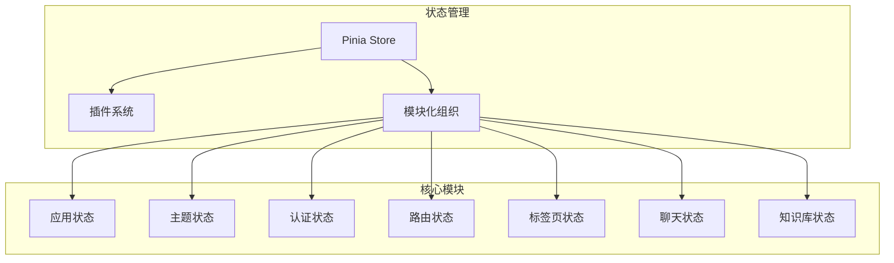
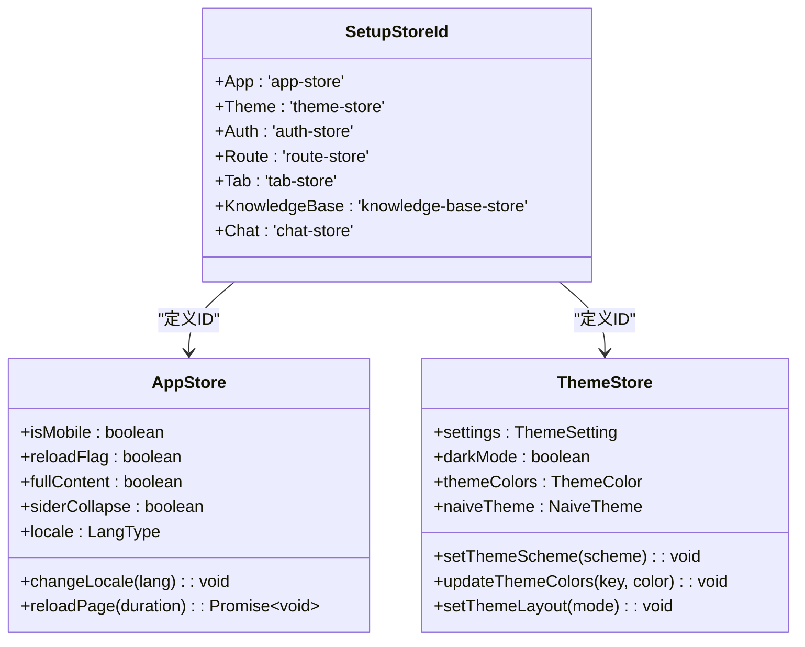
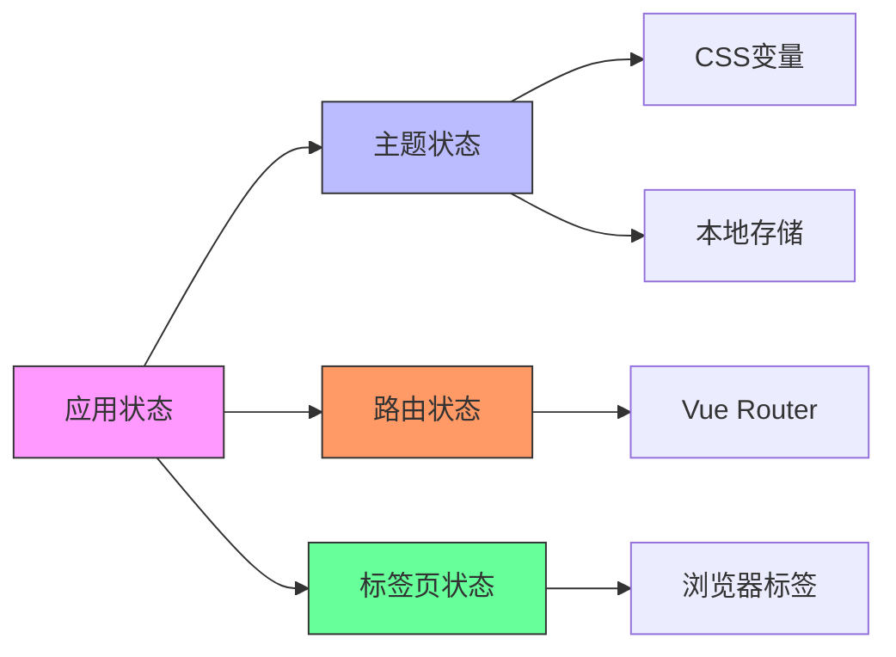

# 状态管理架构

<cite>
**本文档引用的文件**  
- [store/index.ts](file://frontend/src/store/index.ts)
- [store/plugins/index.ts](file://frontend/src/store/plugins/index.ts)
- [enum/index.ts](file://frontend/src/enum/index.ts)
- [store/modules/app/index.ts](file://frontend/src/store/modules/app/index.ts)
- [store/modules/theme/index.ts](file://frontend/src/store/modules/theme/index.ts)
- [utils/storage.ts](file://frontend/src/utils/storage.ts)
- [packages/utils/src/storage.ts](file://frontend/packages/utils/src/storage.ts)
- [packages/utils/src/klona.ts](file://frontend/packages/utils/src/klona.ts)
- [packages/hooks/src/use-context.ts](file://frontend/packages/hooks/src/use-context.ts)
- [main.ts](file://frontend/src/main.ts)
</cite>

## 目录
1. [项目结构分析](#项目结构分析)
2. [根Store创建与初始化](#根store创建与初始化)
3. [模块化状态组织](#模块化状态组织)
4. [自定义插件机制](#自定义插件机制)
5. [模块间依赖与通信](#模块间依赖与通信)
6. [状态持久化与重置](#状态持久化与重置)
7. [性能优化策略](#性能优化策略)
8. [总结](#总结)

## 项目结构分析

项目采用分层架构设计，前端状态管理位于`frontend/src/store`目录下，采用Pinia作为核心状态管理库。状态管理模块遵循模块化设计原则，将不同功能域的状态分离到独立模块中。



**图示来源**  
- [store/index.ts](file://frontend/src/store/index.ts)
- [enum/index.ts](file://frontend/src/enum/index.ts)

**本节来源**  
- [store/index.ts](file://frontend/src/store/index.ts)
- [enum/index.ts](file://frontend/src/enum/index.ts)

## 根Store创建与初始化

根Store的创建过程在`store/index.ts`文件中实现，通过`setupStore`工厂函数完成Pinia实例的初始化和插件注册。

```typescript
import type { App } from 'vue';
import { createPinia } from 'pinia';
import { resetSetupStore } from './plugins';

/** 设置Vue状态管理插件Pinia */
export function setupStore(app: App) {
  const store = createPinia();

  store.use(resetSetupStore);

  app.use(store);
}
```

根Store的初始化流程在`main.ts`中调用，确保在应用启动时完成状态管理系统的配置。

```typescript
import { setupStore } from './store';
import { setupRouter } from './router';

async function setupApp() {
  const app = createApp(App);

  setupStore(app);

  await setupRouter(app);

  app.mount('#app');
}
```

该设计模式实现了关注点分离，将状态管理的配置逻辑独立封装，提高了代码的可维护性和可测试性。

**本节来源**  
- [store/index.ts](file://frontend/src/store/index.ts#L1-L11)
- [main.ts](file://frontend/src/main.ts#L19)

## 模块化状态组织

状态管理采用模块化组织结构，每个功能模块对应一个独立的Store模块，通过`defineStore`函数创建。模块ID通过`SetupStoreId`枚举统一管理，确保命名一致性。



**图示来源**  
- [enum/index.ts](file://frontend/src/enum/index.ts#L1-L8)
- [store/modules/app/index.ts](file://frontend/src/store/modules/app/index.ts#L20)
- [store/modules/theme/index.ts](file://frontend/src/store/modules/theme/index.ts#L23)

**本节来源**  
- [enum/index.ts](file://frontend/src/enum/index.ts)
- [store/modules/app/index.ts](file://frontend/src/store/modules/app/index.ts)
- [store/modules/theme/index.ts](file://frontend/src/store/modules/theme/index.ts)

## 自定义插件机制

项目实现了自定义Pinia插件`resetSetupStore`，用于为使用Setup语法创建的Store提供状态重置功能。插件通过拦截Store创建过程，为符合条件的Store实例添加`$reset`方法。

```typescript
import type { PiniaPluginContext } from 'pinia';
import { jsonClone } from '@sa/utils';
import { SetupStoreId } from '@/enum';

/**
 * 插件用于重置使用Setup语法编写的状态
 *
 * @param context Pinia插件上下文
 */
export function resetSetupStore(context: PiniaPluginContext) {
  const setupSyntaxIds = Object.values(SetupStoreId) as string[];

  if (setupSyntaxIds.includes(context.store.$id)) {
    const { $state } = context.store;

    const defaultStore = jsonClone($state);

    context.store.$reset = () => {
      context.store.$patch(defaultStore);
    };
  }
}
```

`jsonClone`函数基于`klona`库实现深拷贝，确保默认状态的独立性，避免引用共享问题。

```typescript
import { klona as jsonClone } from 'klona/json';

export { jsonClone };
```

该插件机制展示了Pinia插件系统的灵活性，通过简单的函数即可扩展Store的核心功能。

**本节来源**  
- [store/plugins/index.ts](file://frontend/src/store/plugins/index.ts#L1-L21)
- [packages/utils/src/klona.ts](file://frontend/packages/utils/src/klona.ts)

## 模块间依赖与通信

模块间通过导入其他模块的`useStore`函数实现依赖和通信，形成清晰的依赖关系网络。以`app`模块为例，它依赖于`theme`、`route`和`tab`模块。

```typescript
import { useThemeStore } from '../theme';
import { useRouteStore } from '../route';
import { useTabStore } from '../tab';

export const useAppStore = defineStore(SetupStoreId.App, () => {
  const themeStore = useThemeStore();
  const routeStore = useRouteStore();
  const tabStore = useTabStore();
  
  // 使用其他模块的状态和方法
  watch(locale, () => {
    routeStore.updateGlobalMenusByLocale();
    tabStore.updateTabsByLocale();
    setDayjsLocale(locale.value);
  });
  
  return {
    // 状态和方法
  };
});
```

这种依赖模式实现了模块间的松耦合，每个模块仍然保持独立性，同时能够响应其他模块的状态变化。



**图示来源**  
- [store/modules/app/index.ts](file://frontend/src/store/modules/app/index.ts#L10-L15)
- [store/modules/theme/index.ts](file://frontend/src/store/modules/theme/index.ts)
- [store/modules/route/index.ts](file://frontend/src/store/modules/route/index.ts)
- [store/modules/tab/index.ts](file://frontend/src/store/modules/tab/index.ts)

**本节来源**  
- [store/modules/app/index.ts](file://frontend/src/store/modules/app/index.ts)
- [store/modules/theme/index.ts](file://frontend/src/store/modules/theme/index.ts)

## 状态持久化与重置

状态持久化通过`utils/storage.ts`中的`localStg`和`sessionStg`实现，将关键状态存储在浏览器的`localStorage`和`sessionStorage`中。

```typescript
import { createStorage } from '@sa/utils';

const storagePrefix = import.meta.env.VITE_STORAGE_PREFIX || '';

export const localStg = createStorage<StorageType.Local>('local', storagePrefix);
export const sessionStg = createStorage<StorageType.Session>('session', storagePrefix);
```

`createStorage`函数封装了存储操作，提供类型安全的接口。

```typescript
export function createStorage<T extends object>(type: StorageType, storagePrefix: string) {
  const stg = type === 'session' ? window.sessionStorage : window.localStorage;

  const storage = {
    set<K extends keyof T>(key: K, value: T[K]) {
      const json = JSON.stringify(value);
      stg.setItem(`${storagePrefix}${key as string}`, json);
    },
    get<K extends keyof T>(key: K): T[K] | null {
      const json = stg.getItem(`${storagePrefix}${key as string}`);
      if (json) {
        try {
          return JSON.parse(json) as T[K];
        } catch {}
      }
      return null;
    }
  };
  return storage;
}
```

状态重置功能通过自定义插件实现，利用`effectScope`和`onScopeDispose`确保资源的正确清理。

```typescript
const scope = effectScope();

// 在作用域内运行响应式副作用
scope.run(() => {
  watch(isMobile, newValue => {
    // 响应式逻辑
  });
});

// 作用域销毁时清理资源
onScopeDispose(() => {
  scope.stop();
});
```

**本节来源**  
- [utils/storage.ts](file://frontend/src/utils/storage.ts)
- [packages/utils/src/storage.ts](file://frontend/packages/utils/src/storage.ts)
- [store/modules/app/index.ts](file://frontend/src/store/modules/app/index.ts#L17)
- [store/modules/theme/index.ts](file://frontend/src/store/modules/theme/index.ts#L18)

## 性能优化策略

状态管理系统采用了多种性能优化策略，包括作用域隔离、惰性加载和响应式优化。

### 作用域隔离

通过`effectScope`实现作用域隔离，将相关的响应式副作用组织在一起，便于统一管理和清理。

```typescript
const scope = effectScope();

scope.run(() => {
  watch(locale, () => {
    // 语言变化的响应逻辑
  });
});

onScopeDispose(() => {
  scope.stop(); // 清理所有副作用
});
```

### 响应式优化

使用`computed`和`watch`的`immediate`选项优化响应式性能，避免不必要的计算。

```typescript
const darkMode = computed(() => {
  if (settings.value.themeScheme === 'auto') {
    return osTheme.value === 'dark';
  }
  return settings.value.themeScheme === 'dark';
});

watch(darkMode, val => {
  toggleCssDarkMode(val);
  localStg.set('darkMode', val);
}, { immediate: true });
```

### 惰性加载

通过模块化设计实现状态的惰性加载，只有在需要时才导入和使用特定模块。

```typescript
// 只在需要时导入
import { useThemeStore } from '../theme';

// 按需使用
const themeStore = useThemeStore();
```

这些优化策略共同确保了状态管理系统的高性能和可维护性。

**本节来源**  
- [store/modules/app/index.ts](file://frontend/src/store/modules/app/index.ts#L17)
- [store/modules/theme/index.ts](file://frontend/src/store/modules/theme/index.ts#L18)
- [hooks/common/echarts.ts](file://frontend/src/hooks/common/echarts.ts#L83)
- [hooks/common/table.ts](file://frontend/src/hooks/common/table.ts#L13)

## 总结

本项目基于Pinia的状态管理架构设计体现了现代前端应用的最佳实践。通过模块化组织、自定义插件、作用域隔离和性能优化等技术手段，构建了一个可扩展、可维护且高性能的状态管理系统。

核心特点包括：
- **模块化设计**：将状态按功能域分离，提高代码组织性和可维护性
- **插件扩展**：通过自定义插件机制扩展Pinia功能，实现状态重置等通用需求
- **依赖管理**：清晰的模块间依赖关系，通过导入`useStore`函数实现通信
- **性能优化**：使用`effectScope`实现作用域隔离，避免内存泄漏
- **持久化**：通过封装的存储工具实现状态的本地持久化

该架构为应用的持续演进提供了坚实的基础，能够有效支持功能的扩展和复杂性的增长。