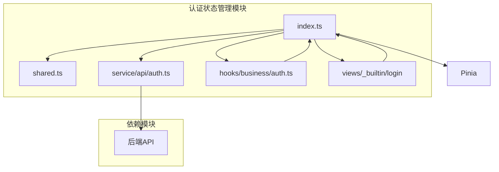
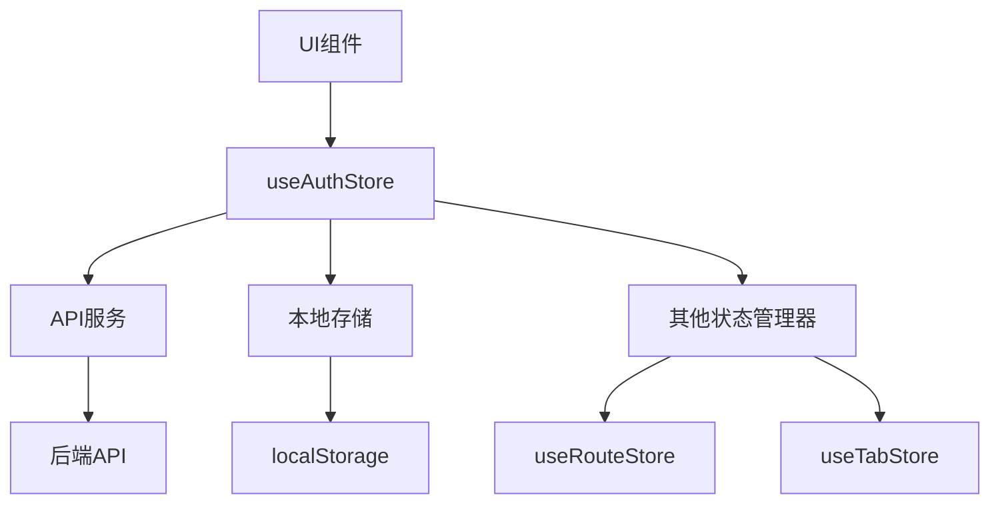
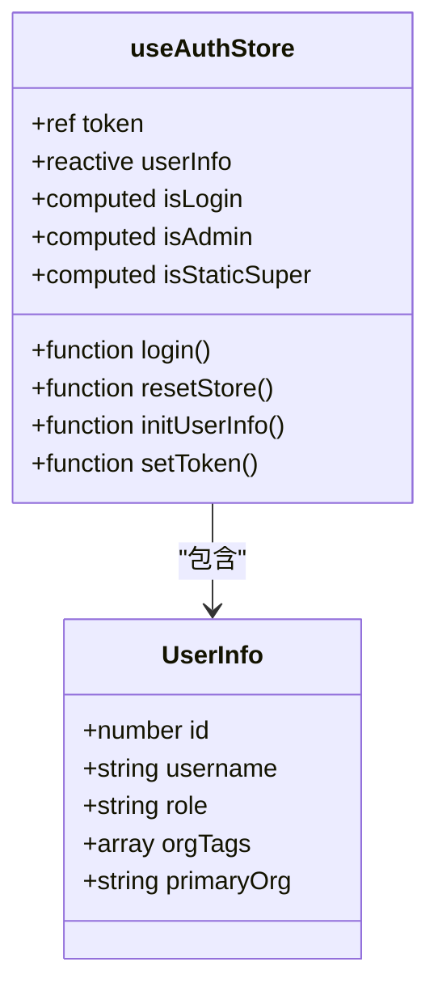
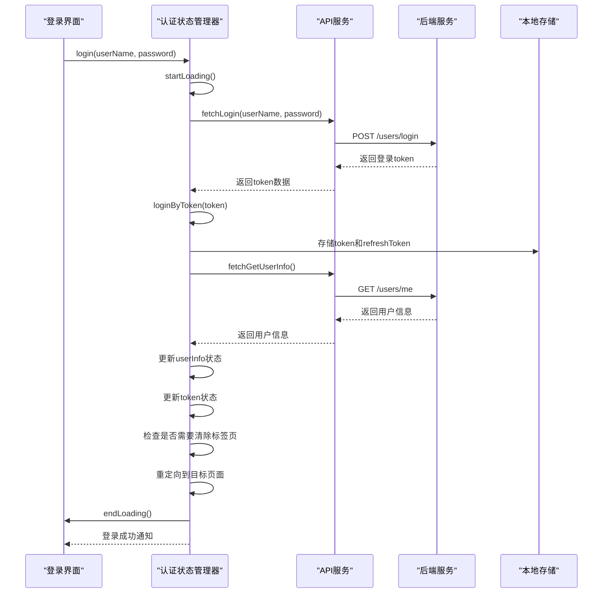
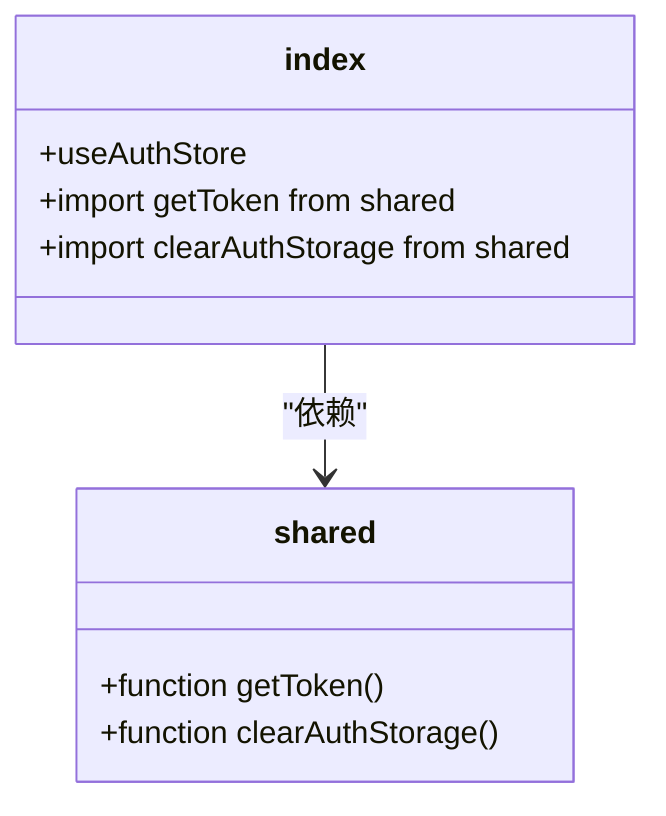
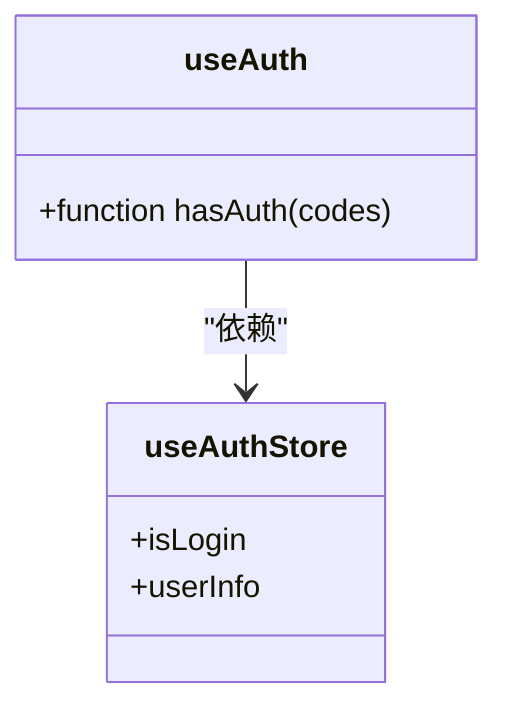
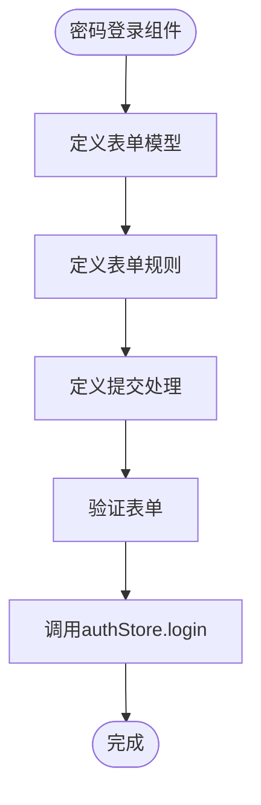
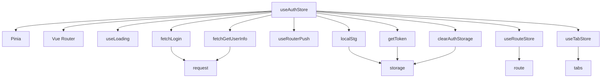

# 认证状态管理

<cite>
**本文档引用的文件**  
- [index.ts](file://frontend/src/store/modules/auth/index.ts)
- [shared.ts](file://frontend/src/store/modules/auth/shared.ts)
- [auth.ts](file://frontend/src/service/api/auth.ts)
- [auth.ts](file://frontend/src/hooks/business/auth.ts)
- [pwd-login.vue](file://frontend/src/views/_builtin/login/modules/pwd-login.vue)
- [index.vue](file://frontend/src/views/_builtin/login/index.vue)
- [main.ts](file://frontend/src/main.ts)
- [index.ts](file://frontend/src/store/index.ts)
- [index.ts](file://frontend/src/store/plugins/index.ts)
</cite>

## 目录
1. [简介](#简介)
2. [项目结构](#项目结构)
3. [核心组件](#核心组件)
4. [架构概览](#架构概览)
5. [详细组件分析](#详细组件分析)
6. [依赖分析](#依赖分析)
7. [性能考虑](#性能考虑)
8. [故障排除指南](#故障排除指南)
9. [结论](#结论)

## 简介
本文档深入解析PaiSmart项目的认证状态管理实现，重点分析基于Pinia的状态管理模式。文档详细说明了用户认证状态的定义、响应式更新机制、跨模块状态共享设计，以及在登录、登出、权限校验等场景下的实际应用。通过代码示例展示useAuthStore的使用方式，包括异步登录流程、token持久化存储与自动刷新逻辑，并提供常见问题的解决方案。

## 项目结构
认证状态管理模块位于前端代码的store/modules/auth目录下，采用模块化设计，与其他业务模块（如app、route、tab等）并列。该模块通过Pinia实现状态管理，与API服务层、业务hooks和UI组件紧密集成。



**图示来源**  
- [index.ts](file://frontend/src/store/modules/auth/index.ts)
- [shared.ts](file://frontend/src/store/modules/auth/shared.ts)

**本节来源**  
- [index.ts](file://frontend/src/store/modules/auth/index.ts)
- [shared.ts](file://frontend/src/store/modules/auth/shared.ts)

## 核心组件
认证状态管理的核心是useAuthStore，它定义了用户认证相关的所有状态字段和操作方法。主要包含token、用户信息、权限列表等状态，以及登录、登出、权限校验等操作。

**本节来源**  
- [index.ts](file://frontend/src/store/modules/auth/index.ts#L39-L93)

## 架构概览
认证状态管理采用分层架构设计，从上到下分为UI层、状态管理层、服务层和持久化层。UI组件通过调用状态管理器的方法来触发认证流程，状态管理器负责协调服务调用和状态更新，服务层负责与后端API通信，持久化层负责token的本地存储。



**图示来源**  
- [index.ts](file://frontend/src/store/modules/auth/index.ts)
- [auth.ts](file://frontend/src/service/api/auth.ts)

## 详细组件分析

### 状态定义分析
认证状态管理器定义了多个响应式状态字段，包括token、用户信息、登录状态等，这些状态通过Pinia的响应式系统进行管理。



**图示来源**  
- [index.ts](file://frontend/src/store/modules/auth/index.ts#L0-L40)

#### 状态字段说明
- **token**: 使用`ref`定义的响应式token值，初始值从本地存储获取
- **userInfo**: 使用`reactive`定义的用户信息对象，包含用户ID、用户名、角色等信息
- **isLogin**: 使用`computed`定义的计算属性，根据token是否存在判断用户是否已登录
- **isAdmin**: 使用`computed`定义的计算属性，根据用户角色判断是否为管理员
- **isStaticSuper**: 使用`computed`定义的计算属性，判断是否为静态路由模式下的超级角色

**本节来源**  
- [index.ts](file://frontend/src/store/modules/auth/index.ts#L0-L40)

### 登录流程分析
登录流程是一个典型的异步操作序列，涉及多个步骤的协调和状态更新。



**图示来源**  
- [index.ts](file://frontend/src/store/modules/auth/index.ts#L87-L137)
- [auth.ts](file://frontend/src/service/api/auth.ts)

#### 登录流程步骤
1. 调用`login`方法，传入用户名和密码
2. 开始加载状态，显示加载动画
3. 调用`fetchLogin`API，向后端发送登录请求
4. 后端验证用户名密码，返回登录token和refreshToken
5. 调用`loginByToken`方法，将token存储到本地存储
6. 调用`fetchGetUserInfo`API，获取用户详细信息
7. 更新`userInfo`状态和`token`状态
8. 检查是否需要清除标签页（用户切换时）
9. 重定向到登录前的目标页面或默认页面
10. 结束加载状态，显示登录成功通知

**本节来源**  
- [index.ts](file://frontend/src/store/modules/auth/index.ts#L87-L137)
- [auth.ts](file://frontend/src/service/api/auth.ts)

### 状态共享机制分析
认证状态管理器通过`shared.ts`文件提供跨模块状态共享功能，实现了token的统一管理和访问。



**图示来源**  
- [shared.ts](file://frontend/src/store/modules/auth/shared.ts)
- [index.ts](file://frontend/src/store/modules/auth/index.ts)

#### 共享函数说明
- **getToken()**: 从本地存储中获取token，如果不存在则返回空字符串
- **clearAuthStorage()**: 清除本地存储中的认证信息，包括token和refreshToken

这些共享函数被`index.ts`中的`useAuthStore`直接导入使用，确保了token管理的一致性和单一性。

**本节来源**  
- [shared.ts](file://frontend/src/store/modules/auth/shared.ts)
- [index.ts](file://frontend/src/store/modules/auth/index.ts)

### 权限校验分析
权限校验通过独立的业务hooks实现，与认证状态管理器解耦，提高了代码的可复用性。



**图示来源**  
- [auth.ts](file://frontend/src/hooks/business/auth.ts)
- [index.ts](file://frontend/src/store/modules/auth/index.ts)

#### 权限校验逻辑
```typescript
function hasAuth(codes: string | string[]) {
  if (!authStore.isLogin) {
    return false;
  }

  if (typeof codes === 'string') {
    return authStore.userInfo.role === codes;
  }

  return codes.includes(authStore.userInfo.role);
}
```

权限校验逻辑首先检查用户是否已登录，然后根据传入的权限码进行匹配。支持单个权限码和多个权限码数组的校验。

**本节来源**  
- [auth.ts](file://frontend/src/hooks/business/auth.ts)

### 实际使用示例
以下是在登录界面中使用认证状态管理器的实际代码示例：



**图示来源**  
- [pwd-login.vue](file://frontend/src/views/_builtin/login/modules/pwd-login.vue)

#### 代码示例
```typescript
const authStore = useAuthStore();

async function handleSubmit() {
  await validate();
  await authStore.login(model.userName, model.password);
}
```

在密码登录组件中，通过`useAuthStore()`获取认证状态管理器实例，然后在表单提交时调用`login`方法进行登录。

**本节来源**  
- [pwd-login.vue](file://frontend/src/views/_builtin/login/modules/pwd-login.vue)

## 依赖分析
认证状态管理模块依赖于多个其他模块和外部服务，形成了复杂的依赖关系网络。



**图示来源**  
- [index.ts](file://frontend/src/store/modules/auth/index.ts)
- [shared.ts](file://frontend/src/store/modules/auth/shared.ts)

**本节来源**  
- [index.ts](file://frontend/src/store/modules/auth/index.ts)
- [shared.ts](file://frontend/src/store/modules/auth/shared.ts)

## 性能考虑
认证状态管理在性能方面做了多项优化：

1. **响应式优化**: 使用Pinia的响应式系统，只在状态变化时触发更新
2. **异步操作管理**: 使用loading状态管理异步操作的UI反馈
3. **缓存机制**: 通过本地存储实现token的持久化，避免重复登录
4. **批量更新**: 使用`Object.assign`批量更新用户信息，减少状态更新次数

## 故障排除指南

### 状态不同步问题
**问题描述**: 用户信息更新后，UI组件未及时刷新

**解决方案**:
1. 确保使用`Object.assign`或`$patch`方法更新状态
2. 检查是否正确使用了响应式引用
3. 确认组件是否正确监听了状态变化

```typescript
// 正确的做法
Object.assign(userInfo, info);

// 错误的做法
userInfo = info; // 这会破坏响应式
```

**本节来源**  
- [index.ts](file://frontend/src/store/modules/auth/index.ts#L139-L194)

### Token失效处理
**问题描述**: Token过期后，用户需要重新登录

**解决方案**:
1. 实现token自动刷新机制
2. 在API请求拦截器中检查token有效性
3. 提供友好的错误提示和重新登录引导

```typescript
// 在API服务中处理token失效
if (error.code === 401) {
  authStore.resetStore();
}
```

**本节来源**  
- [index.ts](file://frontend/src/store/modules/auth/index.ts#L87-L137)

## 结论
PaiSmart项目的认证状态管理实现了一个完整、健壮的用户认证系统。通过Pinia实现的状态管理提供了清晰的状态定义和响应式更新机制，模块化设计使得代码结构清晰、易于维护。系统实现了登录、登出、权限校验等核心功能，并通过本地存储实现了token的持久化。未来可以考虑增加token自动刷新功能，进一步提升用户体验。