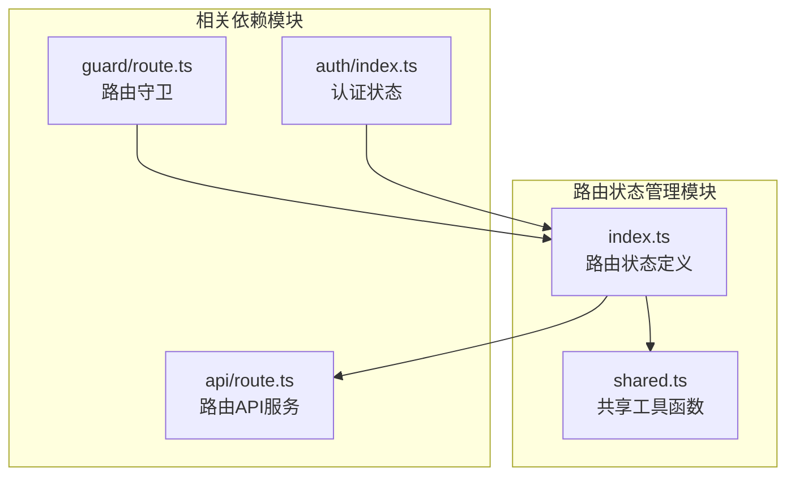
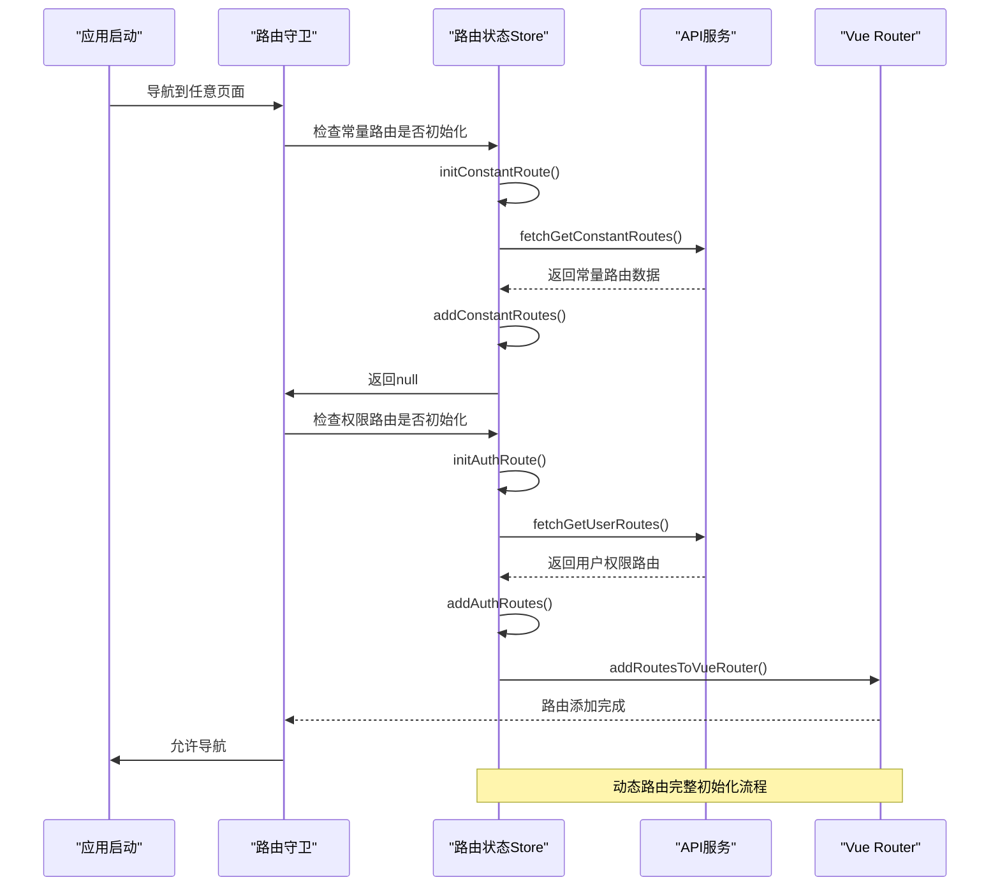
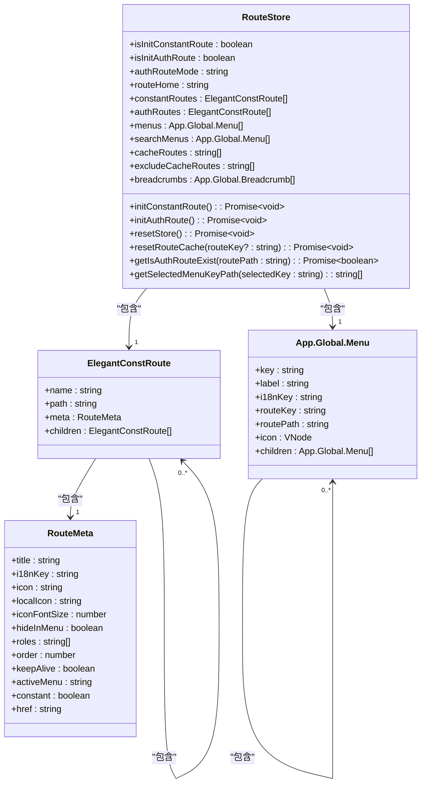
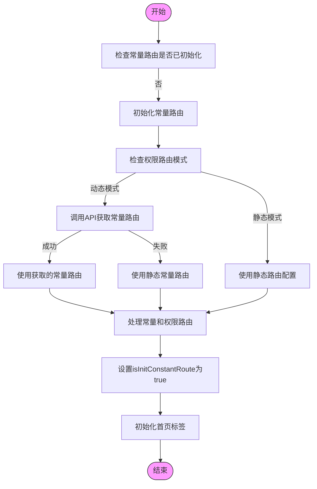
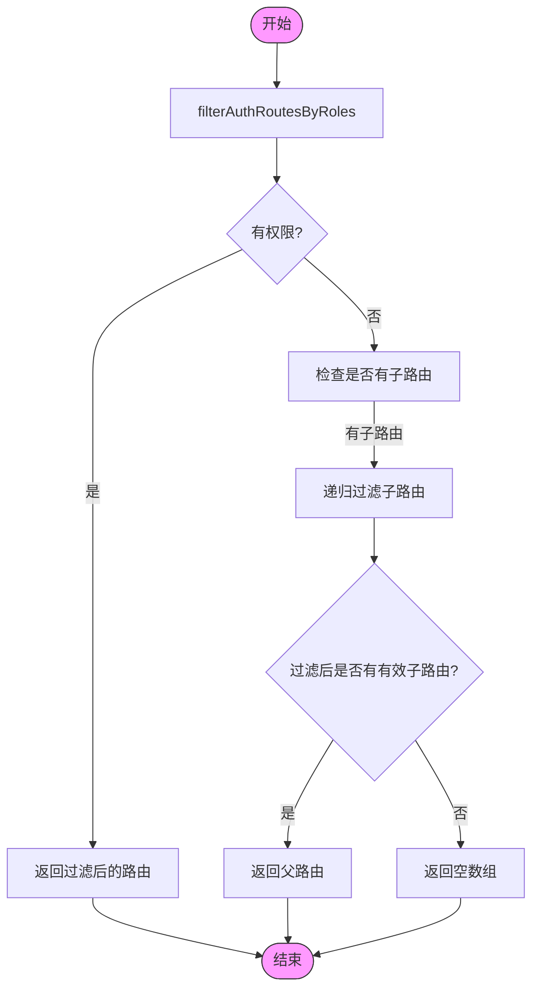
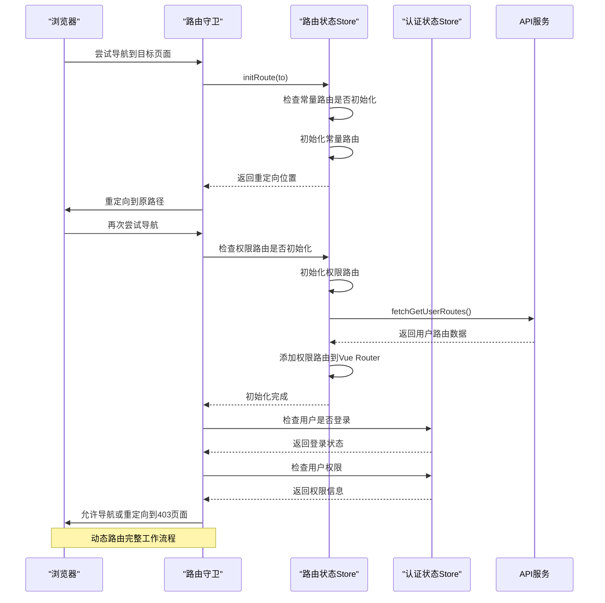
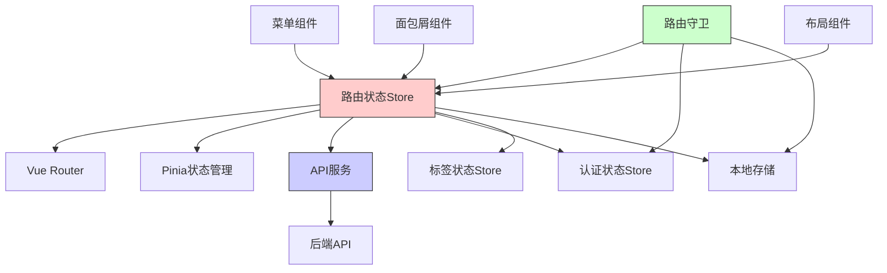

# 路由状态管理

<cite>
**本文档引用的文件**   
- [index.ts](file://frontend/src/store/modules/route/index.ts#L0-L347)
- [shared.ts](file://frontend/src/store/modules/route/shared.ts#L0-L335)
- [route.ts](file://frontend/src/router/guard/route.ts#L0-L192)
- [route.ts](file://frontend/src/service/api/route.ts#L0-L20)
</cite>

## 目录
1. [简介](#简介)
2. [项目结构](#项目结构)
3. [核心组件](#核心组件)
4. [架构概述](#架构概述)
5. [详细组件分析](#详细组件分析)
6. [依赖分析](#依赖分析)
7. [性能考虑](#性能考虑)
8. [故障排除指南](#故障排除指南)
9. [结论](#结论)

## 简介
本文档全面介绍了PaiSmart前端项目中路由状态管理模块的实现机制。该模块基于Pinia状态管理库，负责管理动态路由状态，包括已加载路由列表、权限路由映射和当前激活路由信息的存储结构。文档详细分析了路由状态的初始化逻辑与更新策略，结合共享工具函数说明路由数据在多个组件间的共享机制，并描述了该模块与Vue Router的协同工作流程。

## 项目结构
路由状态管理模块位于`frontend/src/store/modules/route/`目录下，是整个应用权限控制和导航系统的核心。该模块通过Pinia store实现，与Vue Router深度集成，实现了基于用户权限的动态路由生成功能。



**图示来源**
- [index.ts](file://frontend/src/store/modules/route/index.ts#L0-L347)
- [shared.ts](file://frontend/src/store/modules/route/shared.ts#L0-L335)
- [route.ts](file://frontend/src/service/api/route.ts#L0-L20)
- [route.ts](file://frontend/src/router/guard/route.ts#L0-L192)

**本节来源**
- [index.ts](file://frontend/src/store/modules/route/index.ts#L0-L347)
- [shared.ts](file://frontend/src/store/modules/route/shared.ts#L0-L335)

## 核心组件
路由状态管理模块的核心是`useRouteStore`，它定义了路由状态的存储结构和操作方法。该store管理着常量路由、权限路由、菜单、面包屑等关键状态，并提供了初始化和更新路由的接口。

**本节来源**
- [index.ts](file://frontend/src/store/modules/route/index.ts#L25-L347)

## 架构概述
路由状态管理模块采用分层架构，通过Pinia store集中管理路由状态，与Vue Router协同工作，实现了动态路由的完整生命周期管理。



**图示来源**
- [index.ts](file://frontend/src/store/modules/route/index.ts#L25-L347)
- [route.ts](file://frontend/src/router/guard/route.ts#L0-L192)
- [route.ts](file://frontend/src/service/api/route.ts#L0-L20)

## 详细组件分析
### 路由状态Store分析
`useRouteStore`是路由状态管理的核心，它定义了路由相关的所有状态和操作方法。

#### 状态存储结构


**图示来源**
- [index.ts](file://frontend/src/store/modules/route/index.ts#L25-L347)

#### 路由初始化流程


**图示来源**
- [index.ts](file://frontend/src/store/modules/route/index.ts#L149-L187)

**本节来源**
- [index.ts](file://frontend/src/store/modules/route/index.ts#L25-L347)

### 路由共享工具函数分析
`shared.ts`文件包含了路由数据处理的共享工具函数，这些函数在多个组件间共享，实现了路由数据的统一处理逻辑。

#### 路由过滤与排序


**图示来源**
- [shared.ts](file://frontend/src/store/modules/route/shared.ts#L11-L25)

#### 菜单与面包屑生成
```mermaid
classDiagram
class RouteSharedUtils {
+filterAuthRoutesByRoles(routes, role) : ElegantConstRoute[]
+sortRoutesByOrder(routes) : ElegantConstRoute[]
+getGlobalMenusByAuthRoutes(routes) : App.Global.Menu[]
+updateLocaleOfGlobalMenus(menus) : App.Global.Menu[]
+getCacheRouteNames(routes) : string[]
+isRouteExistByRouteName(routeName, routes) : boolean
+getSelectedMenuKeyPathByKey(selectedKey, menus) : string[]
+getBreadcrumbsByRoute(route, menus) : App.Global.Breadcrumb[]
+transformMenuToSearchMenus(menus) : App.Global.Menu[]
}
class MenuUtils {
+getGlobalMenuByBaseRoute(route) : App.Global.Menu
+transformMenuToBreadcrumb(menu) : App.Global.Breadcrumb
+findMenuPath(targetKey, menu) : string[] or null
}
RouteSharedUtils --> MenuUtils : "使用"
note right of RouteSharedUtils
共享工具函数类，提供路由数据处理的
通用方法，被路由状态Store和其他
组件复用
end note
```

**图示来源**
- [shared.ts](file://frontend/src/store/modules/route/shared.ts#L75-L315)

**本节来源**
- [shared.ts](file://frontend/src/store/modules/route/shared.ts#L0-L335)

### 路由守卫分析
路由守卫模块负责在导航过程中进行权限校验和路由初始化，是动态路由机制的关键环节。

#### 路由守卫工作流程


**图示来源**
- [route.ts](file://frontend/src/router/guard/route.ts#L0-L192)
- [index.ts](file://frontend/src/store/modules/route/index.ts#L25-L347)

**本节来源**
- [route.ts](file://frontend/src/router/guard/route.ts#L0-L192)

## 依赖分析
路由状态管理模块与其他模块存在紧密的依赖关系，形成了完整的权限控制体系。



**图示来源**
- [index.ts](file://frontend/src/store/modules/route/index.ts#L25-L347)
- [route.ts](file://frontend/src/router/guard/route.ts#L0-L192)
- [route.ts](file://frontend/src/service/api/route.ts#L0-L20)

**本节来源**
- [index.ts](file://frontend/src/store/modules/route/index.ts#L25-L347)
- [route.ts](file://frontend/src/router/guard/route.ts#L0-L192)

## 性能考虑
路由状态管理模块在设计时考虑了多项性能优化策略，确保在大型应用中的高效运行。

### 动态路由添加性能优化
1. **批量处理**：在`handleConstantAndAuthRoutes`方法中，将所有路由一次性添加到Vue Router，避免了逐个添加的性能开销。
2. **去重机制**：使用Map数据结构对常量路由和权限路由进行去重，避免重复路由的创建。
3. **懒加载**：通过`shallowRef`和`computed`实现响应式数据的懒加载，减少不必要的计算。

### 路由缓存机制
```typescript
/**
 * 获取需要缓存的路由名称
 * 只获取最后两级路由中具有keepAlive元数据的路由
 */
export function getCacheRouteNames(routes: RouteRecordRaw[]) {
  const cacheNames: LastLevelRouteKey[] = [];

  routes.forEach(route => {
    // 只获取最后两级路由，这些路由具有组件
    route.children?.forEach(child => {
      if (child.component && child.meta?.keepAlive) {
        cacheNames.push(child.name as LastLevelRouteKey);
      }
    });
  });

  return cacheNames;
}
```

该方法通过限制只处理最后两级路由，减少了遍历的深度，提高了性能。

**本节来源**
- [shared.ts](file://frontend/src/store/modules/route/shared.ts#L151-L164)
- [index.ts](file://frontend/src/store/modules/route/index.ts#L108-L118)

## 故障排除指南
### 动态路由添加失败
当动态路由添加失败时，可能的原因和解决方案包括：

1. **API服务不可用**
   - 现象：`fetchGetUserRoutes`调用失败
   - 解决方案：检查后端服务是否正常运行，网络连接是否正常

2. **权限路由模式配置错误**
   - 现象：`VITE_AUTH_ROUTE_MODE`环境变量配置错误
   - 解决方案：检查`.env`文件中的配置，确保值为'static'或'dynamic'

3. **路由数据格式错误**
   - 现象：从API获取的路由数据格式不符合预期
   - 解决方案：检查后端返回的路由数据结构，确保符合`ElegantConstRoute`类型定义

### 权限校验失败处理
当权限校验失败时，系统会自动重定向到403页面：

```typescript
// 在路由守卫中处理权限校验失败
if (!hasAuth) {
  next({ name: noAuthorizationRoute });
  return;
}
```

开发者可以通过以下方式自定义权限校验逻辑：
1. 修改`authStore.userInfo.role`的获取方式
2. 扩展`route.meta.roles`的权限定义
3. 在`filterAuthRoutesByRoles`函数中添加自定义过滤逻辑

**本节来源**
- [route.ts](file://frontend/src/router/guard/route.ts#L75-L80)
- [shared.ts](file://frontend/src/store/modules/route/shared.ts#L11-L25)

## 结论
PaiSmart项目的路由状态管理模块通过Pinia store实现了动态路由的完整生命周期管理。该模块采用分层架构，将路由状态、共享工具函数和路由守卫分离，提高了代码的可维护性。通过与Vue Router的深度集成，实现了基于用户权限的动态路由生成功能，支持静态和动态两种权限路由模式。模块设计考虑了性能优化，通过批量处理、去重机制和懒加载等策略确保了在大型应用中的高效运行。整体架构清晰，扩展性强，为应用的权限控制和导航系统提供了坚实的基础。