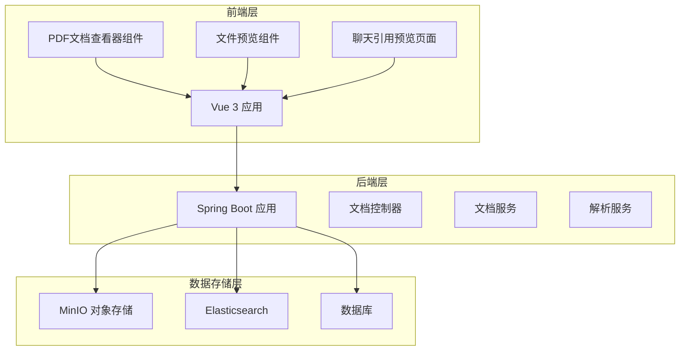
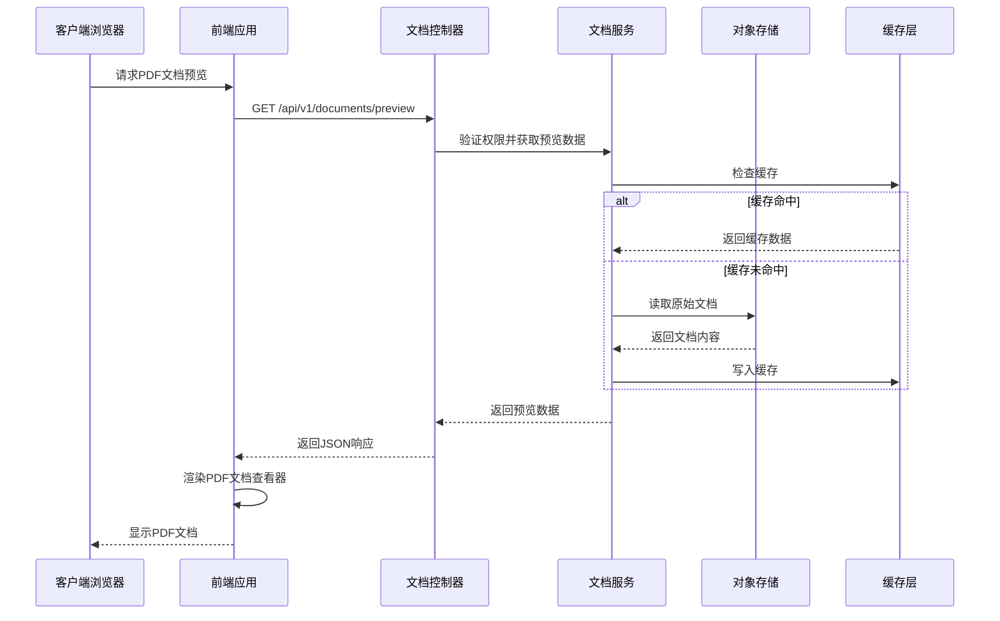
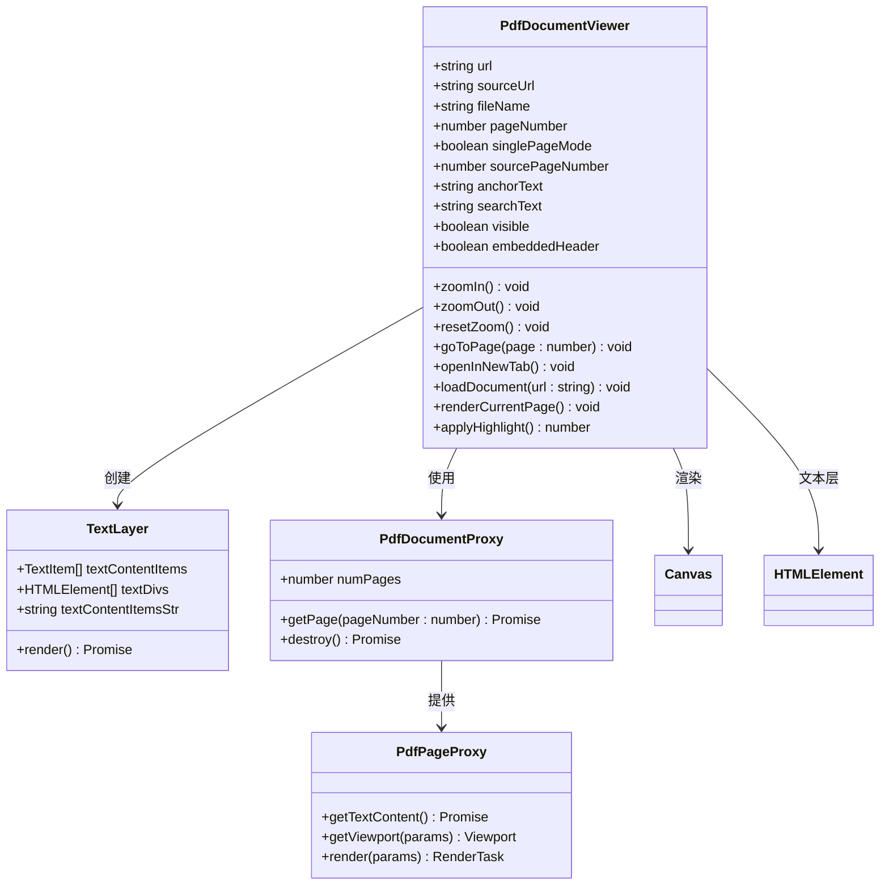
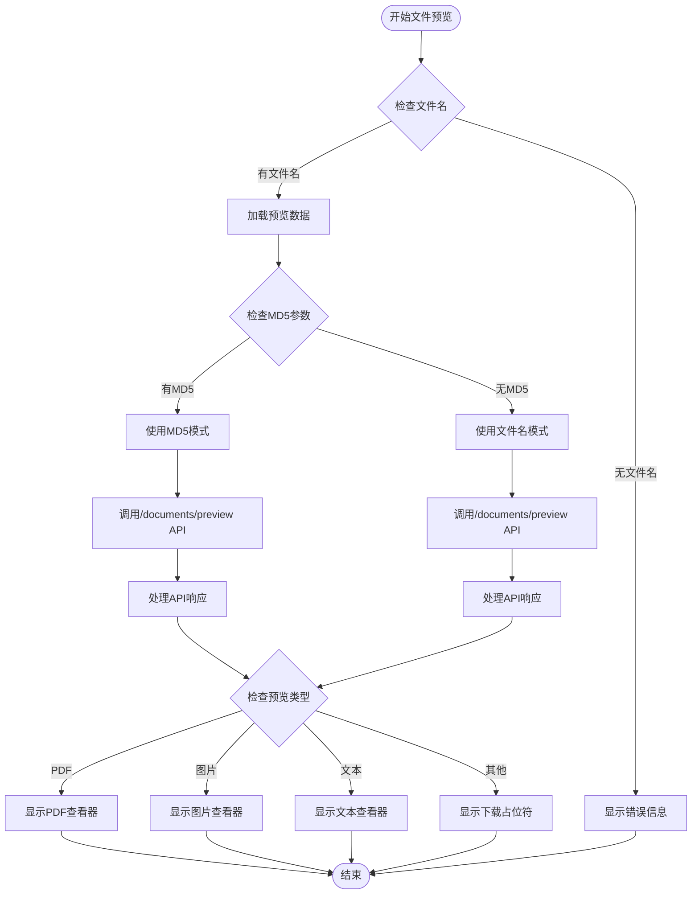
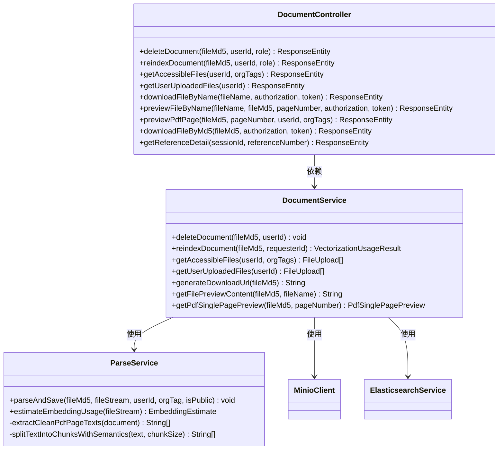
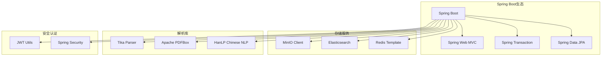

# PDF文档查看器

<cite>
**本文档引用的文件**
- [pdf-document-viewer.vue](file://frontend/src/components/custom/pdf-document-viewer.vue)
- [file-preview.vue](file://frontend/src/components/custom/file-preview.vue)
- [DocumentController.java](file://src/main/java/com/yizhaoqi/smartpai/controller/DocumentController.java)
- [DocumentService.java](file://src/main/java/com/yizhaoqi/smartpai/service/DocumentService.java)
- [ParseService.java](file://src/main/java/com/yizhaoqi/smartpai/service/ParseService.java)
- [reference-preview-page.vue](file://frontend/src/views/chat/modules/reference-preview-page.vue)
- [service.ts](file://frontend/src/utils/service.ts)
- [index.ts](file://frontend/src/service/request/index.ts)
- [shared.ts](file://frontend/src/service/request/shared.ts)
- [package.json](file://frontend/package.json)
</cite>

## 目录
1. [简介](#简介)
2. [项目结构](#项目结构)
3. [核心组件](#核心组件)
4. [架构概览](#架构概览)
5. [详细组件分析](#详细组件分析)
6. [依赖关系分析](#依赖关系分析)
7. [性能考量](#性能考量)
8. [故障排除指南](#故障排除指南)
9. [结论](#结论)

## 简介

PDF文档查看器是PaiSmart AI知识库系统中的一个核心功能模块，专门用于在线预览和浏览PDF文档。该系统集成了现代化的前端技术栈和后端微服务架构，提供了完整的文档管理、预览、搜索和引用功能。

系统的主要特点包括：
- 基于Vue 3和TypeScript的现代化前端界面
- 支持PDF单页预览和全文浏览
- 智能文本高亮和定位功能
- 完整的权限控制和安全机制
- 缓存优化和性能优化
- 支持多种文档格式的统一预览

## 项目结构

该项目采用前后端分离的架构设计，主要分为以下层次：



**图表来源**
- [pdf-document-viewer.vue:1-106](file://frontend/src/components/custom/pdf-document-viewer.vue#L1-L106)
- [file-preview.vue:1-151](file://frontend/src/components/custom/file-preview.vue#L1-L151)
- [DocumentController.java:1-80](file://src/main/java/com/yizhaoqi/smartpai/controller/DocumentController.java#L1-L80)

**章节来源**
- [pdf-document-viewer.vue:1-106](file://frontend/src/components/custom/pdf-document-viewer.vue#L1-L106)
- [file-preview.vue:1-151](file://frontend/src/components/custom/file-preview.vue#L1-L151)
- [DocumentController.java:1-80](file://src/main/java/com/yizhaoqi/smartpai/controller/DocumentController.java#L1-L80)

## 核心组件

### PDF文档查看器组件

PDF文档查看器组件是整个系统的核心UI组件，提供了完整的PDF文档预览功能：

**主要功能特性：**
- 支持PDF文档的在线预览和浏览
- 提供缩放、翻页等基本操作
- 实现文本高亮和定位功能
- 支持单页模式和全页模式
- 集成权限验证和安全机制

**关键技术实现：**
- 基于pdfjs-dist库进行PDF渲染
- 使用Vue 3 Composition API构建组件
- 实现响应式布局和自适应缩放
- 集成文本层渲染和高亮功能

**章节来源**
- [pdf-document-viewer.vue:108-171](file://frontend/src/components/custom/pdf-document-viewer.vue#L108-L171)

### 文件预览组件

文件预览组件负责协调不同类型的文件预览，特别是PDF文档的完整预览体验：

**核心功能：**
- 统一的文件预览接口
- 支持多种文件格式的预览
- 集成引用信息展示
- 实现沉浸式预览体验

**章节来源**
- [file-preview.vue:153-183](file://frontend/src/components/custom/file-preview.vue#L153-L183)

### 后端文档服务

后端文档服务提供了完整的文档管理功能，包括预览、下载、缓存等：

**主要服务：**
- PDF单页预览生成
- 文件下载链接生成
- 文档缓存管理
- 权限验证和控制

**章节来源**
- [DocumentService.java:403-450](file://src/main/java/com/yizhaoqi/smartpai/service/DocumentService.java#L403-L450)

## 架构概览

系统采用分层架构设计，从前端到后端再到数据存储层形成了完整的文档处理链路：



**图表来源**
- [DocumentController.java:395-539](file://src/main/java/com/yizhaoqi/smartpai/controller/DocumentController.java#L395-L539)
- [DocumentService.java:403-450](file://src/main/java/com/yizhaoqi/smartpai/service/DocumentService.java#L403-L450)

**章节来源**
- [DocumentController.java:395-539](file://src/main/java/com/yizhaoqi/smartpai/controller/DocumentController.java#L395-L539)
- [DocumentService.java:403-450](file://src/main/java/com/yizhaoqi/smartpai/service/DocumentService.java#L403-L450)

## 详细组件分析

### PDF文档查看器组件架构



**图表来源**
- [pdf-document-viewer.vue:120-171](file://frontend/src/components/custom/pdf-document-viewer.vue#L120-L171)
- [pdf-document-viewer.vue:686-775](file://frontend/src/components/custom/pdf-document-viewer.vue#L686-L775)

**章节来源**
- [pdf-document-viewer.vue:120-171](file://frontend/src/components/custom/pdf-document-viewer.vue#L120-L171)
- [pdf-document-viewer.vue:686-775](file://frontend/src/components/custom/pdf-document-viewer.vue#L686-L775)

### 文件预览流程

文件预览组件通过统一的接口处理不同类型的文件预览请求：



**图表来源**
- [file-preview.vue:314-427](file://frontend/src/components/custom/file-preview.vue#L314-L427)

**章节来源**
- [file-preview.vue:314-427](file://frontend/src/components/custom/file-preview.vue#L314-L427)

### 后端文档服务架构

后端文档服务提供了完整的文档管理能力，包括预览、下载、缓存等功能：



**图表来源**
- [DocumentController.java:32-800](file://src/main/java/com/yizhaoqi/smartpai/controller/DocumentController.java#L32-L800)
- [DocumentService.java:39-596](file://src/main/java/com/yizhaoqi/smartpai/service/DocumentService.java#L39-L596)
- [ParseService.java:30-649](file://src/main/java/com/yizhaoqi/smartpai/service/ParseService.java#L30-L649)

**章节来源**
- [DocumentController.java:32-800](file://src/main/java/com/yizhaoqi/smartpai/controller/DocumentController.java#L32-L800)
- [DocumentService.java:39-596](file://src/main/java/com/yizhaoqi/smartpai/service/DocumentService.java#L39-L596)
- [ParseService.java:30-649](file://src/main/java/com/yizhaoqi/smartpai/service/ParseService.java#L30-L649)

## 依赖关系分析

### 前端依赖关系

前端项目采用了现代化的技术栈，主要依赖包括：

```mermaid
graph TB
subgraph "核心框架"
Vue[Vue 3.5.13]
TS[TypeScript 5.8.3]
Router[Vue Router 4.5.1]
Pinia[Pinia 3.0.2]
end
subgraph "UI框架"
Naive[Naive UI 2.41.0]
Icons[Iconify Vue 5.0.0]
end
subgraph "PDF处理"
PDFJS[pdfjs-dist 5.5.207]
PDFBox[Apache PDFBox]
end
subgraph "工具库"
Axios[Axios]
VueUse[@vueuse/core]
Dayjs[Dayjs 1.11.13]
SparkMD5[Spark-md5 3.0.2]
end
Vue --> Router
Vue --> Pinia
Vue --> Naive
Vue --> Icons
Vue --> PDFJS
PDFJS --> PDFBox
Vue --> Axios
Vue --> VueUse
Vue --> Dayjs
Vue --> SparkMD5
```

**图表来源**
- [package.json:46-78](file://frontend/package.json#L46-L78)

**章节来源**
- [package.json:46-78](file://frontend/package.json#L46-L78)

### 后端依赖关系

后端服务基于Spring Boot构建，集成了多种企业级功能：



**图表来源**
- [DocumentService.java:1-50](file://src/main/java/com/yizhaoqi/smartpai/service/DocumentService.java#L1-L50)

**章节来源**
- [DocumentService.java:1-50](file://src/main/java/com/yizhaoqi/smartpai/service/DocumentService.java#L1-L50)

## 性能考量

### PDF渲染优化

系统在PDF渲染方面采用了多项优化策略：

**内存管理优化：**
- 使用流式处理避免大文件内存溢出
- 实现PDF文档的懒加载和按需渲染
- 采用本地缓存减少重复渲染开销

**渲染性能优化：**
- 实现渲染任务的队列管理和去重
- 支持渲染取消和中断机制
- 优化Canvas绘制性能和设备像素比适配

**缓存策略：**
- 本地内存缓存和Redis分布式缓存双层缓存
- PDF单页预览的智能缓存机制
- 缓存失效和更新策略

### 前端性能优化

**组件优化：**
- 使用Vue 3的Composition API提升组件复用性
- 实现响应式布局和自适应缩放
- 优化事件监听和生命周期管理

**网络优化：**
- 请求拦截器和自动重试机制
- Token自动刷新和错误处理
- 预加载和延迟加载策略

## 故障排除指南

### 常见问题及解决方案

**PDF加载失败：**
- 检查文件权限和访问控制
- 验证文件格式和完整性
- 确认服务器网络连接状态

**渲染性能问题：**
- 检查浏览器兼容性和版本
- 验证Canvas渲染环境
- 监控内存使用情况

**缓存相关问题：**
- 清理浏览器缓存和Cookie
- 检查Redis连接状态
- 验证缓存配置和TTL设置

**章节来源**
- [pdf-document-viewer.vue:611-620](file://frontend/src/components/custom/pdf-document-viewer.vue#L611-L620)
- [DocumentService.java:403-450](file://src/main/java/com/yizhaoqi/smartpai/service/DocumentService.java#L403-L450)

### 错误处理机制

系统实现了多层次的错误处理机制：

**前端错误处理：**
- 统一的错误消息提示系统
- Token过期自动刷新机制
- 网络异常重试和降级策略

**后端错误处理：**
- 详细的日志记录和监控
- 权限验证和访问控制
- 异常情况的优雅降级

**章节来源**
- [index.ts:34-101](file://frontend/src/service/request/index.ts#L34-L101)
- [shared.ts:44-56](file://frontend/src/service/request/shared.ts#L44-L56)

## 结论

PDF文档查看器是PaiSmart AI知识库系统中的重要组成部分，通过现代化的技术架构和优化的用户体验设计，为用户提供了完整的PDF文档预览和浏览功能。

**主要优势：**
- 完整的前后端分离架构设计
- 高性能的PDF渲染和缓存机制
- 灵活的权限控制和安全机制
- 友好的用户界面和交互体验

**技术亮点：**
- 基于Vue 3的现代化前端开发
- Spring Boot微服务架构
- 多层缓存优化策略
- 完善的错误处理和监控机制

该系统为AI知识库的文档管理提供了坚实的技术基础，支持大规模文档的高效处理和智能检索，为用户提供了优质的文档预览体验。