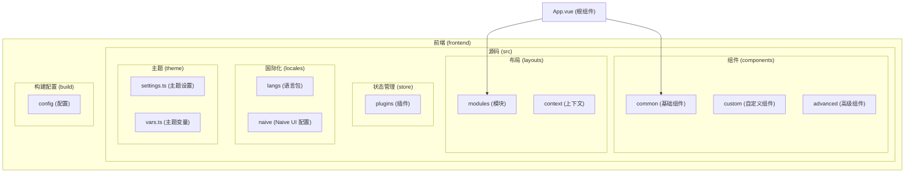
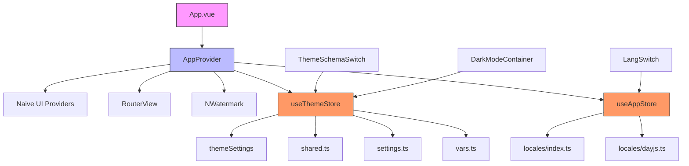
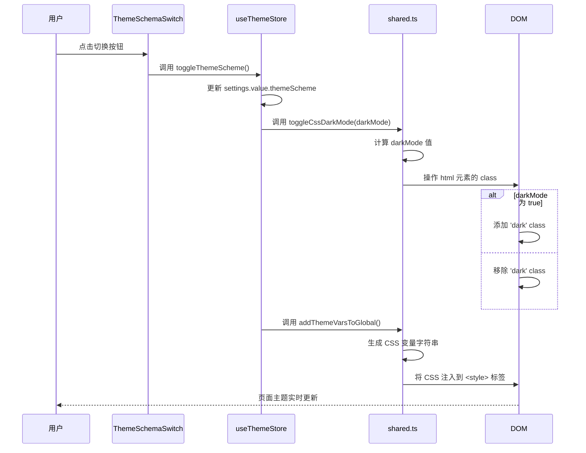
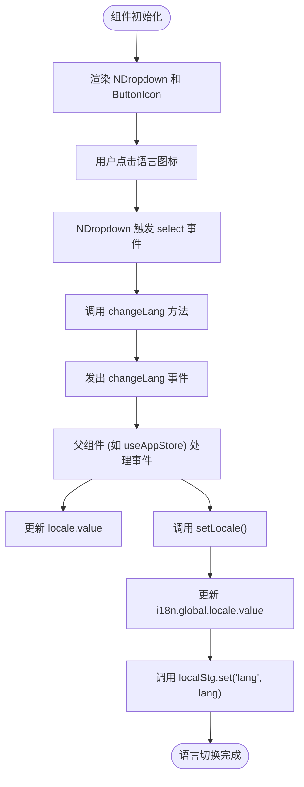
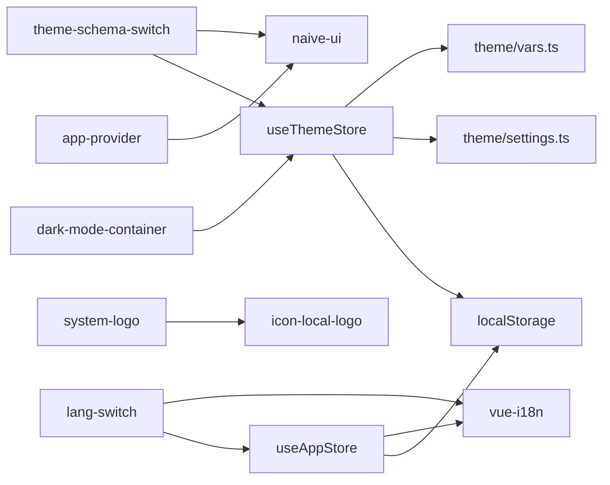

# 基础组件

<cite>
**本文档中引用的文件**  
- [app-provider.vue](file://frontend/src/components/common/app-provider.vue)
- [dark-mode-container.vue](file://frontend/src/components/common/dark-mode-container.vue)
- [theme-schema-switch.vue](file://frontend/src/components/common/theme-schema-switch.vue)
- [lang-switch.vue](file://frontend/src/components/common/lang-switch.vue)
- [system-logo.vue](file://frontend/src/components/common/system-logo.vue)
- [App.vue](file://frontend/src/App.vue)
- [theme/index.ts](file://frontend/src/store/modules/theme/index.ts)
- [theme/shared.ts](file://frontend/src/store/modules/theme/shared.ts)
- [settings.ts](file://frontend/src/theme/settings.ts)
- [vars.ts](file://frontend/src/theme/vars.ts)
- [index.ts](file://frontend/src/locales/index.ts)
- [theme-drawer/index.vue](file://frontend/src/layouts/modules/theme-drawer/index.vue)
- [global-header/components/theme-button.vue](file://frontend/src/layouts/modules/global-header/components/theme-button.vue)
- [views/_builtin/login/index.vue](file://frontend/src/views/_builtin/login/index.vue)
- [layouts/modules/global-logo/index.vue](file://frontend/src/layouts/modules/global-logo/index.vue)
</cite>

## 目录
1. [简介](#简介)
2. [项目结构](#项目结构)
3. [核心组件](#核心组件)
4. [架构概览](#架构概览)
5. [详细组件分析](#详细组件分析)
6. [依赖分析](#依赖分析)
7. [性能考虑](#性能考虑)
8. [故障排除指南](#故障排除指南)
9. [结论](#结论)

## 简介
本文档深入分析了前端基础组件的设计与实现，重点阐述了 `app-provider.vue` 作为应用根容器的核心作用，以及 `dark-mode-container.vue`、`theme-schema-switch.vue`、`lang-switch.vue` 和 `system-logo.vue` 等组件的技术细节。文档详细说明了这些组件如何协同工作以实现深色模式、主题方案切换、多语言支持和动态Logo渲染，并结合实际引用场景，展示了它们在布局模块中的集成方式。

## 项目结构
项目结构清晰，遵循功能模块化设计。前端代码位于 `frontend` 目录下，主要组件和功能模块按功能划分在 `src` 目录中。基础组件集中存放在 `components/common` 目录，布局模块位于 `layouts/modules`，状态管理使用 Pinia 存储在 `store/modules`，国际化配置在 `locales` 目录。



**Diagram sources**
- [app-provider.vue](file://frontend/src/components/common/app-provider.vue)
- [App.vue](file://frontend/src/App.vue)
- [theme-drawer/index.vue](file://frontend/src/layouts/modules/theme-drawer/index.vue)

## 核心组件
核心基础组件包括 `app-provider.vue`、`dark-mode-container.vue`、`theme-schema-switch.vue`、`lang-switch.vue` 和 `system-logo.vue`。这些组件共同构成了应用的底层支撑，负责状态集成、主题管理、国际化和UI渲染。

**Section sources**
- [app-provider.vue](file://frontend/src/components/common/app-provider.vue)
- [dark-mode-container.vue](file://frontend/src/components/common/dark-mode-container.vue)
- [theme-schema-switch.vue](file://frontend/src/components/common/theme-schema-switch.vue)
- [lang-switch.vue](file://frontend/src/components/common/lang-switch.vue)
- [system-logo.vue](file://frontend/src/components/common/system-logo.vue)

## 架构概览
系统采用 Vue 3 + Pinia + Naive UI 的技术栈。`app-provider.vue` 作为应用的根容器，负责集成全局状态和UI服务。主题系统通过 Pinia store (`useThemeStore`) 管理，利用 CSS 变量实现动态主题切换。国际化通过 `vue-i18n` 实现，与应用状态深度集成。



**Diagram sources**
- [App.vue](file://frontend/src/App.vue)
- [app-provider.vue](file://frontend/src/components/common/app-provider.vue)
- [theme/index.ts](file://frontend/src/store/modules/theme/index.ts)
- [index.ts](file://frontend/src/locales/index.ts)

## 详细组件分析

### AppProvider 分析
`app-provider.vue` 是应用的根容器组件，其核心作用是为整个应用提供全局的上下文环境。它通过嵌套的 Naive UI Provider 组件（`NLoadingBarProvider`、`NDialogProvider` 等）来初始化全局的UI服务。

```mermaid
classDiagram
class AppProvider {
+ContextHolder : Component
-register() : void
}
class ContextHolder {
+register() : void
+setup() : Function
}
AppProvider --> ContextHolder : 包含
ContextHolder --> "window.$loadingBar" : 注册
ContextHolder --> "window.$dialog" : 注册
ContextHolder --> "window.$message" : 注册
ContextHolder --> "window.$notification" : 注册
```

**Diagram sources**
- [app-provider.vue](file://frontend/src/components/common/app-provider.vue)

#### 功能与实现
`app-provider.vue` 的实现非常简洁但功能强大。它首先定义了一个名为 `ContextHolder` 的内部组件，该组件在 `setup` 钩子中调用 `useLoadingBar`、`useDialog`、`useMessage` 和 `useNotification` 这些来自 Naive UI 的 Composable 函数，并将返回的实例挂载到全局 `window` 对象上，形成 `$loadingBar`、`$dialog`、`$message` 和 `$notification` 全局变量。这使得在应用的任何地方都可以通过这些全局变量直接调用对应的UI服务，而无需在每个组件中重复导入和调用。

```vue
<script setup lang="ts">
import { createTextVNode, defineComponent } from 'vue';
import { useDialog, useLoadingBar, useMessage, useNotification } from 'naive-ui';

const ContextHolder = defineComponent({
  name: 'ContextHolder',
  setup() {
    function register() {
      window.$loadingBar = useLoadingBar();
      window.$dialog = useDialog();
      window.$message = useMessage();
      window.$notification = useNotification();
    }
    register();
    return () => createTextVNode();
  }
});
</script>

<template>
  <NLoadingBarProvider>
    <NDialogProvider>
      <NNotificationProvider>
        <NMessageProvider>
          <ContextHolder />
          <slot></slot>
        </NMessageProvider>
      </NNotificationProvider>
    </NDialogProvider>
  </NLoadingBarProvider>
</template>
```

**Section sources**
- [app-provider.vue](file://frontend/src/components/common/app-provider.vue)

### 深色模式与主题方案切换分析

#### DarkModeContainer 与 ThemeSchemaSwitch 协同机制
`dark-mode-container.vue` 和 `theme-schema-switch.vue` 协同工作，实现了深色模式的容器化管理和主题方案的切换。

`dark-mode-container.vue` 是一个简单的容器组件，它根据 `inverted` 属性的值来动态切换其CSS类，从而改变背景和文本颜色。它本身不管理状态，而是由父组件或状态管理器控制其外观。

```vue
<template>
  <div class="bg-container text-base-text transition-300" :class="{ 'bg-inverted text-#1f1f1f': inverted }">
    <slot></slot>
  </div>
</template>
```

`theme-schema-switch.vue` 则是一个交互式按钮，它接收当前的主题方案 (`themeSchema`) 作为 `props`，并定义了一个 `switch` 事件。当用户点击按钮时，会触发 `handleSwitch` 方法，进而发出 `switch` 事件，通知父组件进行主题切换。

```vue
<template>
  <ButtonIcon
    :icon="icon"
    :tooltip-content="tooltipContent"
    :tooltip-placement="tooltipPlacement"
    @click="handleSwitch"
  />
</template>
```

**Section sources**
- [dark-mode-container.vue](file://frontend/src/components/common/dark-mode-container.vue)
- [theme-schema-switch.vue](file://frontend/src/components/common/theme-schema-switch.vue)

#### CSS变量注入、存储持久化和响应式更新机制
主题系统的实现核心在于 `useThemeStore`。该 Pinia store 管理着 `themeSettings`，其中 `themeScheme` 字段决定了当前的主题模式（'light', 'dark', 'auto'）。



**Diagram sources**
- [theme/index.ts](file://frontend/src/store/modules/theme/index.ts)
- [theme/shared.ts](file://frontend/src/store/modules/theme/shared.ts)

**实现细节：**
1.  **响应式更新**：`darkMode` 是一个计算属性，它根据 `themeScheme` 和系统偏好 (`usePreferredColorScheme`) 实时计算当前是否为深色模式。
    ```ts
    const darkMode = computed(() => {
      if (settings.value.themeScheme === 'auto') {
        return osTheme.value === 'dark';
      }
      return settings.value.themeScheme === 'dark';
    });
    ```
2.  **CSS变量注入**：`addThemeVarsToGlobal` 函数是关键。它接收主题的CSS变量对象，将其转换为纯CSS字符串，并动态创建或更新一个ID为 `theme-vars` 的 `<style>` 标签插入到 `document.head` 中。这使得所有使用 `var(--variable-name)` 的CSS都能立即生效。
    ```ts
    export function addThemeVarsToGlobal(tokens: App.Theme.BaseToken, darkTokens: App.Theme.BaseToken) {
      const cssVarStr = getCssVarByTokens(tokens);
      const darkCssVarStr = getCssVarByTokens(darkTokens);
      const styleId = 'theme-vars';
      const style = document.querySelector(`#${styleId}`) || document.createElement('style');
      style.id = styleId;
      style.textContent = `:root { ${cssVarStr} }` + `html.${DARK_CLASS} { ${darkCssVarStr} }`;
      document.head.appendChild(style);
    }
    ```
3.  **存储持久化**：主题设置通过 `localStg`（基于 `localStorage` 的封装）进行持久化。`initThemeSettings` 函数在应用启动时从 `localStorage` 中读取 `themeSettings`，并与默认设置合并，确保用户偏好在刷新后依然保留。
    ```ts
    export function initThemeSettings() {
      const localSettings = localStg.get('themeSettings');
      let settings = defu(localSettings, themeSettings);
      // ... 版本覆盖逻辑
      return settings;
    }
    ```

**Section sources**
- [theme/index.ts](file://frontend/src/store/modules/theme/index.ts)
- [theme/shared.ts](file://frontend/src/store/modules/theme/shared.ts)
- [settings.ts](file://frontend/src/theme/settings.ts)
- [vars.ts](file://frontend/src/theme/vars.ts)

### LangSwitch 分析
`lang-switch.vue` 组件负责实现多语言切换功能。它通过 `props` 接收当前语言 (`lang`) 和语言选项 (`langOptions`)，并通过 `emits` 定义 `changeLang` 事件与父组件通信。



**Diagram sources**
- [lang-switch.vue](file://frontend/src/components/common/lang-switch.vue)
- [index.ts](file://frontend/src/locales/index.ts)

#### 多语言切换逻辑与i18n实例绑定
多语言切换的逻辑在 `useAppStore` 中实现。`lang-switch.vue` 发出的 `changeLang` 事件被 `useAppStore` 中的 `changeLocale` 方法捕获。

```ts
function changeLocale(lang: App.I18n.LangType) {
  locale.value = lang;
  setLocale(lang);
  localStg.set('lang', lang);
}
```
`setLocale` 函数直接修改了 `vue-i18n` 实例的全局 `locale` 值，这会触发所有使用 `$t` 的组件重新渲染，从而实现界面语言的即时切换。同时，新的语言设置也被持久化到 `localStorage` 中。

**Section sources**
- [lang-switch.vue](file://frontend/src/components/common/lang-switch.vue)
- [index.ts](file://frontend/src/locales/index.ts)
- [app/index.ts](file://frontend/src/store/modules/app/index.ts)

### SystemLogo 分析
`system-logo.vue` 组件的实现非常简单，它只是一个包装器，用于渲染一个名为 `icon-local-logo` 的自定义SVG图标。

```vue
<template>
  <icon-local-logo />
</template>
```
这个组件本身不包含任何逻辑或状态，其主要作用是提供一个可复用的、语义化的Logo渲染方式。它可以在任何需要显示系统Logo的地方被导入和使用。

**Section sources**
- [system-logo.vue](file://frontend/src/components/common/system-logo.vue)

## 依赖分析
基础组件之间以及与核心模块的依赖关系清晰。`app-provider.vue` 依赖于 Naive UI 的Provider组件和Composable函数。`dark-mode-container.vue` 和 `theme-schema-switch.vue` 依赖于 `useThemeStore` 来获取主题状态。`lang-switch.vue` 依赖于 `useAppStore` 和 `vue-i18n` 的 `$t` 函数。`system-logo.vue` 依赖于一个自定义的SVG图标。



**Diagram sources**
- [app-provider.vue](file://frontend/src/components/common/app-provider.vue)
- [dark-mode-container.vue](file://frontend/src/components/common/dark-mode-container.vue)
- [theme-schema-switch.vue](file://frontend/src/components/common/theme-schema-switch.vue)
- [lang-switch.vue](file://frontend/src/components/common/lang-switch.vue)
- [system-logo.vue](file://frontend/src/components/common/system-logo.vue)
- [theme/index.ts](file://frontend/src/store/modules/theme/index.ts)
- [app/index.ts](file://frontend/src/store/modules/app/index.ts)

## 性能考虑
该基础组件设计在性能方面表现良好：
- **轻量级**：组件本身代码量小，逻辑简单。
- **响应式高效**：利用 Vue 3 的响应式系统和计算属性，状态更新高效。
- **CSS变量优化**：通过注入CSS变量实现主题切换，避免了频繁的DOM操作，性能开销极小。
- **持久化合理**：仅对用户偏好设置进行持久化，避免了不必要的存储操作。

## 故障排除指南
- **问题：主题切换后样式未生效**
  - **检查**：确认 `addThemeVarsToGlobal` 函数是否被正确调用，检查 `document.head` 中是否存在ID为 `theme-vars` 的 `<style>` 标签。
- **问题：语言切换后界面未更新**
  - **检查**：确认 `setLocale` 函数是否成功修改了 `i18n.global.locale.value`，检查组件是否使用了 `$t` 函数进行文本渲染。
- **问题：全局UI服务（如 $message）无法使用**
  - **检查**：确认 `app-provider.vue` 是否已正确挂载到应用根组件，并且 `ContextHolder` 组件已成功执行 `register` 函数。

**Section sources**
- [shared.ts](file://frontend/src/store/modules/theme/shared.ts)
- [index.ts](file://frontend/src/locales/index.ts)
- [app-provider.vue](file://frontend/src/components/common/app-provider.vue)

## 结论
本文档详细分析了PaiSmart项目中的基础前端组件。`app-provider.vue` 作为应用的基石，成功地集成了Pinia状态、Naive UI服务和国际化配置。深色模式和主题切换通过 `useThemeStore` 和CSS变量注入实现了高效、响应式的更新。多语言切换逻辑清晰，与全局i18n实例紧密绑定。这些基础组件设计精良，为上层布局模块（如 `global-header`、`global-menu`）提供了稳定、可复用的底层支持，是构建现代化、可配置化Web应用的关键。