# 组件体系

<cite>
**本文档引用文件**   
- [app-provider.vue](file://frontend/src/components/common/app-provider.vue)
- [dark-mode-container.vue](file://frontend/src/components/common/dark-mode-container.vue)
- [theme-schema-switch.vue](file://frontend/src/components/common/theme-schema-switch.vue)
- [table-column-setting.vue](file://frontend/src/components/advanced/table-column-setting.vue)
- [table-header-operation.vue](file://frontend/src/components/advanced/table-header-operation.vue)
- [svg-icon.vue](file://frontend/src/components/custom/svg-icon.vue)
- [button-icon.vue](file://frontend/src/components/custom/button-icon.vue)
- [org-tag-cascader.vue](file://frontend/src/components/custom/org-tag-cascader.vue)
- [pdf-document-viewer.vue](file://frontend/src/components/custom/pdf-document-viewer.vue)
- [global-header.vue](file://frontend/src/layouts/modules/global-header/index.vue)
- [global-menu.vue](file://frontend/src/layouts/modules/global-menu/index.vue)
- [index.ts](file://frontend/src/store/modules/theme/index.ts)
- [shared.ts](file://frontend/src/store/modules/theme/shared.ts)
- [file-preview.vue](file://frontend/src/components/custom/file-preview.vue)
- [recharge-manage/index.vue](file://frontend/src/views/recharge-manage/index.vue)
- [usage-monitor/index.vue](file://frontend/src/views/usage-monitor/index.vue)
- [invite-code/index.vue](file://frontend/src/views/invite-code/index.vue)
- [routes.ts](file://frontend/src/router/elegant/routes.ts)
- [recharge.ts](file://frontend/src/service/api/recharge.ts)
- [invite-code.ts](file://frontend/src/service/api/invite-code.ts)
</cite>

## 更新摘要
**所做更改**   
- 新增PDF文档查看器组件分析章节
- 新增充值管理界面组件分析章节  
- 新增使用监控仪表板组件分析章节
- 新增邀请码管理界面组件分析章节
- 更新组件体系架构图以包含新增组件
- 扩展自定义业务组件分析以涵盖文件预览系统

## 目录
1. [组件体系概述](#组件体系概述)
2. [基础组件分析](#基础组件分析)
3. [高级功能组件分析](#高级功能组件分析)
4. [自定义业务组件分析](#自定义业务组件分析)
5. [新增功能组件分析](#新增功能组件分析)
6. [布局组件与功能组件集成](#布局组件与功能组件集成)

## 组件体系概述

本项目采用分层组件体系架构，将前端组件划分为四大类别：基础组件（common）、高级功能组件（advanced）、自定义业务组件（custom）和新增功能组件（新增）。这种分层设计实现了组件的高内聚、低耦合，便于维护和复用。

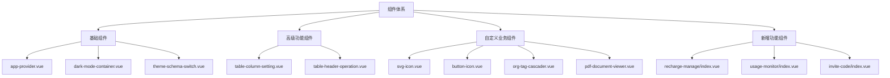

**Diagram sources**
- [app-provider.vue](file://frontend/src/components/common/app-provider.vue)
- [dark-mode-container.vue](file://frontend/src/components/common/dark-mode-container.vue)
- [theme-schema-switch.vue](file://frontend/src/components/common/theme-schema-switch.vue)
- [table-column-setting.vue](file://frontend/src/components/advanced/table-column-setting.vue)
- [table-header-operation.vue](file://frontend/src/components/advanced/table-header-operation.vue)
- [svg-icon.vue](file://frontend/src/components/custom/svg-icon.vue)
- [button-icon.vue](file://frontend/src/components/custom/button-icon.vue)
- [org-tag-cascader.vue](file://frontend/src/components/custom/org-tag-cascader.vue)
- [pdf-document-viewer.vue](file://frontend/src/components/custom/pdf-document-viewer.vue)
- [recharge-manage/index.vue](file://frontend/src/views/recharge-manage/index.vue)
- [usage-monitor/index.vue](file://frontend/src/views/usage-monitor/index.vue)
- [invite-code/index.vue](file://frontend/src/views/invite-code/index.vue)

## 基础组件分析

### 应用根提供者组件

app-provider.vue作为应用的根提供者组件，负责初始化和注册全局的UI组件实例，为整个应用提供统一的API访问接口。

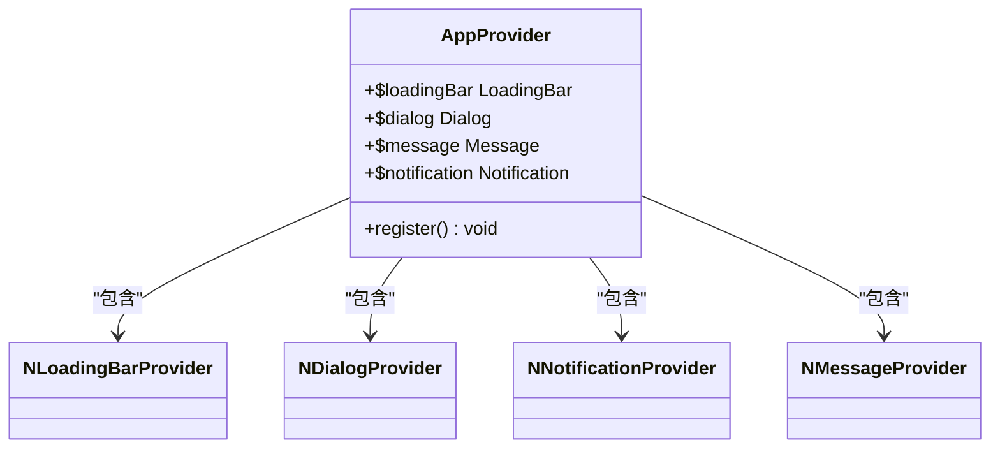

**Diagram sources**
- [app-provider.vue](file://frontend/src/components/common/app-provider.vue)

该组件通过Vue的provide/inject机制，将Naive UI的loadingBar、dialog、message和notification实例注册到全局window对象中，使得在任何组件中都可以通过$loadingBar、$dialog、$message和$notification直接调用这些功能。

```vue
<script setup lang="ts">
import { createTextVNode, defineComponent } from 'vue';
import { useDialog, useLoadingBar, useMessage, useNotification } from 'naive-ui';

const ContextHolder = defineComponent({
  name: 'ContextHolder',
  setup() {
    function register() {
      window.$loadingBar = useLoadingBar();
      window.$dialog = useDialog();
      window.$message = useMessage();
      window.$notification = useNotification();
    }

    register();

    return () => createTextVNode();
  }
});
</script>

<template>
  <NLoadingBarProvider>
    <NDialogProvider>
      <NNotificationProvider>
        <NMessageProvider>
          <ContextHolder />
          <slot></slot>
        </NMessageProvider>
      </NNotificationProvider>
    </NDialogProvider>
  </NLoadingBarProvider>
</template>
```

**Section sources**
- [app-provider.vue](file://frontend/src/components/common/app-provider.vue)

### 主题切换组件

主题切换功能由dark-mode-container.vue和theme-schema-switch.vue两个组件协同实现，结合theme store中的状态管理，实现了完整的主题切换机制。

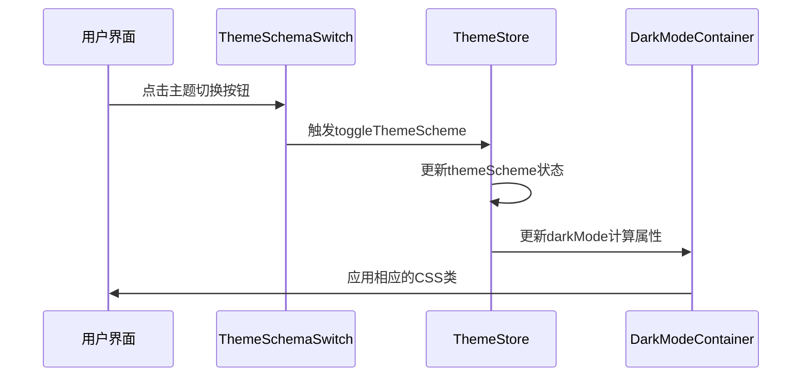

**Diagram sources**
- [theme-schema-switch.vue](file://frontend/src/components/common/theme-schema-switch.vue)
- [index.ts](file://frontend/src/store/modules/theme/index.ts)
- [dark-mode-container.vue](file://frontend/src/components/common/dark-mode-container.vue)

theme-schema-switch.vue组件提供用户界面交互，显示当前主题模式的图标，并在用户点击时触发主题切换事件。

```vue
<script setup lang="ts">
import { computed } from 'vue';
import { $t } from '@/locales';

defineOptions({ name: 'ThemeSchemaSwitch' });

interface Props {
  themeSchema: UnionKey.ThemeScheme;
  showTooltip?: boolean;
  tooltipPlacement?: PopoverPlacement;
}

const props = withDefaults(defineProps<Props>(), {
  showTooltip: true,
  tooltipPlacement: 'bottom'
});

interface Emits {
  (e: 'switch'): void;
}

const emit = defineEmits<Emits>();

function handleSwitch() {
  emit('switch');
}

const icons: Record<UnionKey.ThemeScheme, string> = {
  light: 'material-symbols:sunny',
  dark: 'material-symbols:nightlight-rounded',
  auto: 'material-symbols:hdr-auto'
};

const icon = computed(() => icons[props.themeSchema]);
</script>

<template>
  <ButtonIcon
    :icon="icon"
    :tooltip-content="$t('icon.themeSchema')"
    :tooltip-placement="tooltipPlacement"
    @click="handleSwitch"
  />
</template>
```

**Section sources**
- [theme-schema-switch.vue](file://frontend/src/components/common/theme-schema-switch.vue)

dark-mode-container.vue组件根据主题状态应用相应的CSS类，实现暗色模式的视觉效果切换。

```vue
<script setup lang="ts">
defineOptions({ name: 'DarkModeContainer' });

interface Props {
  inverted?: boolean;
}

defineProps<Props>();
</script>

<template>
  <div class="bg-container text-base-text transition-300" :class="{ 'bg-inverted text-#1f1f1f': inverted }">
    <slot></slot>
  </div>
</template>
```

**Section sources**
- [dark-mode-container.vue](file://frontend/src/components/common/dark-mode-container.vue)

主题状态管理的核心逻辑位于theme store中，通过computed属性和watch监听器实现主题状态的自动同步和持久化。

```ts
export const useThemeStore = defineStore(SetupStoreId.Theme, () => {
  const scope = effectScope();
  const osTheme = usePreferredColorScheme();

  const settings: Ref<App.Theme.ThemeSetting> = ref(initThemeSettings());

  const darkMode = computed(() => {
    if (settings.value.themeScheme === 'auto') {
      return osTheme.value === 'dark';
    }
    return settings.value.themeScheme === 'dark';
  });

  function toggleThemeScheme() {
    const themeSchemes: UnionKey.ThemeScheme[] = ['light', 'dark', 'auto'];
    const index = theme schemes.findIndex(item => item === settings.value.themeScheme);
    const nextIndex = index === themeSchemes.length - 1 ? 0 : index + 1;
    const nextThemeScheme = themeSchemes[nextIndex];
    setThemeScheme(nextThemeScheme);
  }

  scope.run(() => {
    watch(
      darkMode,
      val => {
        toggleCssDarkMode(val);
        localStg.set('darkMode', val);
      },
      { immediate: true }
    );
  });
});
```

**Section sources**
- [index.ts](file://frontend/src/store/modules/theme/index.ts)
- [shared.ts](file://frontend/src/store/modules/theme/shared.ts)

## 高级功能组件分析

### 数据表格高级交互组件

table-column-setting.vue和table-header-operation.vue两个组件为数据表格提供了高级交互功能，包括列设置和批量操作。

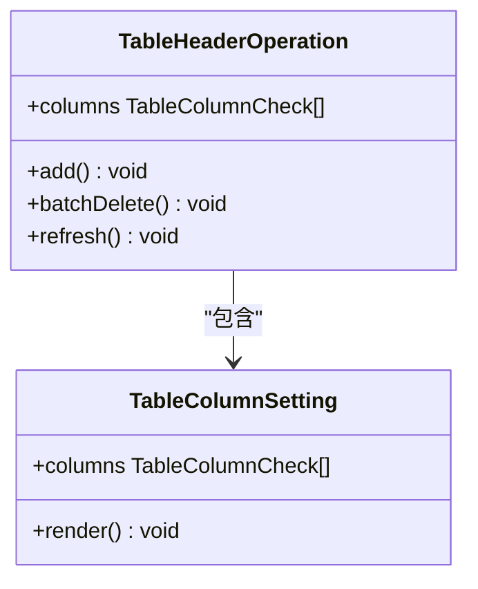

**Diagram sources**
- [table-column-setting.vue](file://frontend/src/components/advanced/table-column-setting.vue)
- [table-header-operation.vue](file://frontend/src/components/advanced/table-header-operation.vue)

table-column-setting.vue组件允许用户通过拖拽重新排序表格列，并通过复选框控制列的显示与隐藏。

```vue
<script setup lang="ts">
import { VueDraggable } from 'vue-draggable-plus';
import { $t } from '@/locales';

defineOptions({
  name: 'TableColumnSetting'
});

const columns = defineModel<NaiveUI.TableColumnCheck[]>('columns', {
  required: true
});
</script>

<template>
  <NPopover placement="bottom-end" trigger="click">
    <template #trigger>
      <NButton size="small">
        <template #icon>
          <icon-ant-design-setting-outlined class="text-icon" />
        </template>
        {{ $t('common.columnSetting') }}
      </NButton>
    </template>
    <VueDraggable v-model="columns" :animation="150" filter=".none_draggable">
      <div v-for="item in columns" :key="item.key" class="h-36px flex-y-center rd-4px hover:(bg-primary bg-opacity-20)">
        <icon-mdi-drag class="mr-8px h-full cursor-move text-icon" />
        <NCheckbox v-model:checked="item.checked" class="none_draggable flex-1">
          <template v-if="typeof item.title === 'function'">
            <component :is="item.title" />
          </template>
          <template v-else>{{ item.title }}</template>
        </NCheckbox>
      </div>
    </VueDraggable>
  </NPopover>
</template>
```

**Section sources**
- [table-column-setting.vue](file://frontend/src/components/advanced/table-column-setting.vue)

table-header-operation.vue组件提供了表格的常用操作按钮，包括添加、批量删除和刷新，并集成了列设置功能。

```vue
<script setup lang="ts">
import { $t } from '@/locales';

defineOptions({
  name: 'TableHeaderOperation'
});

interface Props {
  itemAlign?: NaiveUI.Align;
  disabledDelete?: boolean;
  loading?: boolean;
  addable?: boolean;
}

const { itemAlign = 'center', disabledDelete = true, loading = false, addable = true } = defineProps<Props>();

interface Emits {
  (e: 'add'): void;
  (e: 'delete'): void;
  (e: 'refresh'): void;
}

const emit = defineEmits<Emits>();

const columns = defineModel<NaiveUI.TableColumnCheck[]>('columns', {
  default: () => []
});

function add() {
  emit('add');
}

function batchDelete() {
  emit('delete');
}

function refresh() {
  emit('refresh');
}
</script>

<template>
  <NSpace :align="itemAlign" wrap justify="end" class="lt-sm:w-200px">
    <slot name="prefix"></slot>
    <slot name="default">
      <NButton v-if="addable" size="small" ghost type="primary" @click="add">
        <template #icon>
          <icon-ic-round-plus class="text-icon" />
        </template>
        {{ $t('common.add') }}
      </NButton>
      <NPopconfirm v-if=!disabledDelete" @positive-click="batchDelete">
        <template #trigger>
          <NButton size="small" ghost type="error">
            <template #icon>
              <icon-ic-round-delete class="text-icon" />
            </template>
            {{ $t('common.batchDelete') }}
          </NButton>
        </template>
        {{ $t('common.confirmDelete') }}
      </NPopconfirm>
    </slot>
    <NButton size="small" @click="refresh">
      <template #icon>
        <icon-mdi-refresh class="text-icon" :class="{ 'animate-spin': loading }" />
      </template>
      {{ $t('common.refresh') }}
    </NButton>
    <TableColumnSetting v-model:columns="columns" />
    <slot name="suffix"></slot>
  </NSpace>
</template>
```

**Section sources**
- [table-header-operation.vue](file://frontend/src/components/advanced/table-header-operation.vue)

## 自定义业务组件分析

### 图标渲染组件

svg-icon.vue和button-icon.vue两个组件构成了系统的图标渲染体系，支持Iconify图标库和本地SVG图标。

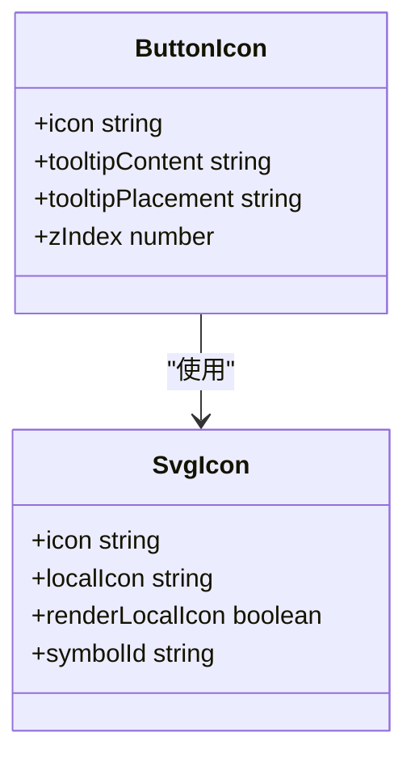

**Diagram sources**
- [svg-icon.vue](file://frontend/src/components/custom/svg-icon.vue)
- [button-icon.vue](file://frontend/src/components/custom/button-icon.vue)

svg-icon.vue组件是图标渲染的核心，支持两种图标来源：Iconify在线图标和本地SVG图标，优先渲染本地图标。

```vue
<script setup lang="ts">
import { computed, useAttrs } from 'vue';
import { Icon } from '@iconify/vue';

defineOptions({ name: 'SvgIcon', inheritAttrs: false });

interface Props {
  icon?: string;
  localIcon?: string;
}

const props = defineProps<Props>();

const attrs = useAttrs();

const bindAttrs = computed<{ class: string; style: string }>(() => ({
  class: (attrs.class as string) || '',
  style: (attrs.style as string) || ''
}));

const symbolId = computed(() => {
  const { VITE_ICON_LOCAL_PREFIX: prefix } = import.meta.env;
  const defaultLocalIcon = 'no-icon';
  const icon = props.localIcon || defaultLocalIcon;
  return `#${prefix}-${icon}`;
});

const renderLocalIcon = computed(() => props.localIcon || !props.icon);
</script>

<template>
  <template v-if="renderLocalIcon">
    <svg aria-hidden="true" width="1em" height="1em" v-bind="bindAttrs">
      <use :xlink:href="symbolId" fill="currentColor" />
    </svg>
  </template>
  <template v-else>
    <Icon v-if="icon" :icon="icon" v-bind="bindAttrs" />
  </template>
</template>
```

**Section sources**
- [svg-icon.vue](file://frontend/src/components/custom/svg-icon.vue)

button-icon.vue组件基于svg-icon构建，提供了带工具提示的图标按钮功能。

```vue
<script setup lang="ts">
import type { PopoverPlacement } from 'naive-ui';
import { twMerge } from 'tailwind-merge';

defineOptions({
  name: 'ButtonIcon',
  inheritAttrs: false
});

interface Props {
  class?: string;
  icon?: string;
  tooltipContent?: string;
  tooltipPlacement?: PopoverPlacement;
  zIndex?: number;
}

const props = withDefaults(defineProps<Props>(), {
  class: '',
  icon: '',
  tooltipContent: '',
  tooltipPlacement: 'bottom',
  zIndex: 98
});

const DEFAULT_CLASS = 'h-[36px] text-icon';
</script>

<template>
  <NTooltip :placement="tooltipPlacement" :z-index="zIndex" :disabled="!tooltipContent">
    <template #trigger>
      <NButton quaternary :class="twMerge(DEFAULT_CLASS, props.class)" v-bind="$attrs">
        <div class="flex-center gap-8px">
          <slot>
            <SvgIcon :icon="icon" />
          </slot>
        </div>
      </NButton>
    </template>
    {{ tooltipContent }}
  </NTooltip>
</template>
```

**Section sources**
- [button-icon.vue](file://frontend/src/components/custom/button-icon.vue)

### 组织标签级联选择组件

org-tag-cascader.vue组件实现了组织标签的级联选择功能，支持从API获取数据或通过props传入数据。

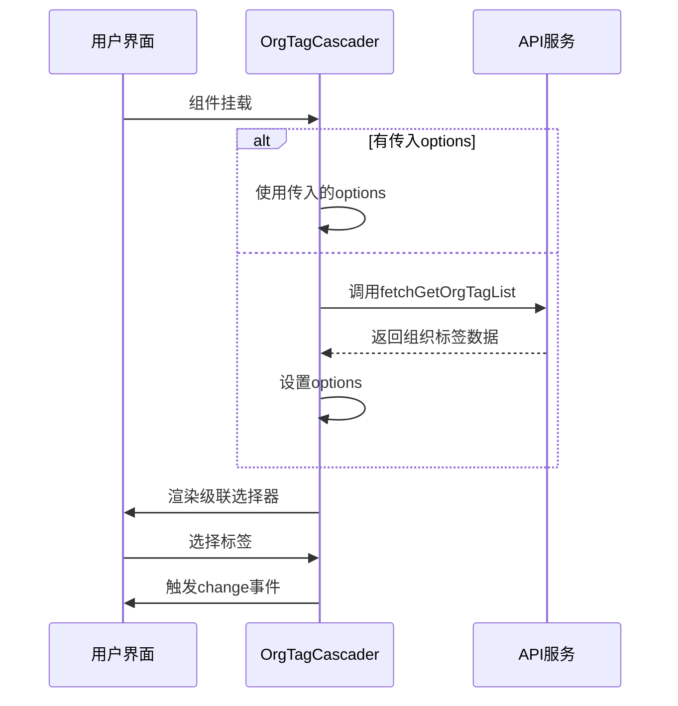

**Diagram sources**
- [org-tag-cascader.vue](file://frontend/src/components/custom/org-tag-cascader.vue)

```vue
<script lang="ts" setup>
import type { CascaderOption } from 'naive-ui';

defineOptions({
  name: 'OrgTagCascader'
});
const props = defineProps<{
  options?: Api.OrgTag.Item[];
  excludePrivate?: boolean;
}>();

const model = defineModel<string | number | Array<number | string> | undefined | null>('value', { required: true });

const opts = ref<CascaderOption[]>([]);

async function getOptions() {
  const { error, data } = await fetchGetOrgTagList();
  if (!error) opts.value = data.data as unknown as CascaderOption[];
}

onMounted(async () => {
  if (props.options) {
    opts.value = props.options as unknown as CascaderOption[];
  } else {
    await getOptions();
  }
  if (props.excludePrivate) {
    opts.value.forEach(x => {
      x.disabled = (x as unknown as Api.OrgTag.Item).tagId.startsWith('PRIVATE_');
    });
  }
});

const emit = defineEmits<{
  change: [CascaderOption | Array<CascaderOption | null> | null];
}>();

function onUpdate(
  _: string | number | Array<string | number> | null,
  option: CascaderOption | Array<CascaderOption | null> | null
) {
  emit('change', option);
}
</script>

<template>
  <NCascader
    v-model:value="model"
    placeholder="请选择组织标签"
    :options="opts"
    value-field="tagId"
    label-field="name"
    expand-trigger="hover"
    @update:value="onUpdate"
  />
</template>
```

**Section sources**
- [org-tag-cascader.vue](file://frontend/src/components/custom/org-tag-cascader.vue)

### PDF文档查看器组件

pdf-document-viewer.vue组件提供了完整的PDF文档预览功能，支持单页预览、全文浏览、缩放、搜索高亮等高级特性。

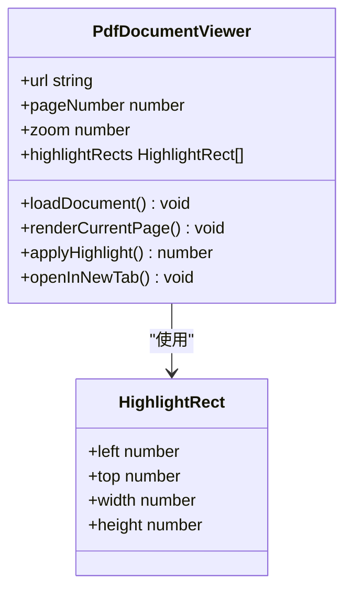

**Diagram sources**
- [pdf-document-viewer.vue](file://frontend/src/components/custom/pdf-document-viewer.vue)

该组件集成了pdfjs-dist库，实现了高性能的PDF渲染和交互功能：

- **文档加载**：支持认证头注入、范围分块下载、生命周期管理
- **页面渲染**：自适应缩放、设备像素比适配、文本层渲染
- **导航控制**：翻页、缩放、重置、新窗口查看
- **搜索高亮**：智能文本匹配、高亮矩形绘制、滚动定位
- **性能优化**：渲染队列管理、缓存机制、内存清理

```vue
<script setup lang="ts">
import { computed, nextTick, onBeforeUnmount, ref, shallowRef, watch, watchEffect } from 'vue';
import { useResizeObserver } from '@vueuse/core';
import { GlobalWorkerOptions, TextLayer, getDocument } from 'pdfjs-dist';
import type { PDFDocumentLoadingTask, PDFDocumentProxy, RenderTask } from 'pdfjs-dist';
import type { TextItem } from 'pdfjs-dist/types/src/display/api';
import { NButton, NSpin } from 'naive-ui';
import { getAuthorization } from '@/service/request/shared';
import workerSrc from 'pdfjs-dist/build/pdf.worker.min.mjs?url';

GlobalWorkerOptions.workerSrc = workerSrc;

// 组件属性、状态和方法...
</script>

<template>
  <div class="pdf-viewer-shell">
    <!-- 工具栏和页面导航 -->
    <div class="pdf-viewer-toolbar">
      <div class="toolbar-copy">
        <span class="viewer-badge">{{ singlePagePreviewActive ? '单页定位' : 'PDF 预览' }}</span>
        <span class="viewer-kicker">{{ viewerKicker }}</span>
      </div>
      <div class="toolbar-actions">
        <span class="toolbar-chip">{{ Math.round(zoom * 100) }}%</span>
        <NButton size="tiny" secondary @click="openInNewTab">新窗口</NButton>
      </div>
    </div>

    <div class="pdf-viewer-body">
      <!-- 页面侧边栏和主内容区 -->
      <div ref="stageRef" class="page-stage">
        <div v-if="documentLoading" class="stage-feedback">
          <NSpin size="large" />
          <span>正在加载 PDF 文档</span>
        </div>
        <div ref="pageShellRef" class="pdf-page-shell">
          <canvas ref="canvasRef" class="pdf-canvas" />
          <div v-if="highlightRects.length" class="pdf-highlight-overlay">
            <div
              v-for="(rect, index) in highlightRects"
              :key="`${index}-${rect.left}-${rect.top}`"
              class="pdf-highlight-rect"
              :style="{
                left: `${rect.left}px`,
                top: `${rect.top}px`,
                width: `${rect.width}px`,
                height: `${rect.height}px`
              }"
            />
          </div>
          <div ref="textLayerRef" class="pdf-text-layer textLayer" />
        </div>
      </div>
    </div>
  </div>
</template>
```

**Section sources**
- [pdf-document-viewer.vue](file://frontend/src/components/custom/pdf-document-viewer.vue)

### 文件预览系统

file-preview.vue组件整合了多种文件类型的预览能力，其中PDF文档预览通过pdf-document-viewer.vue实现。

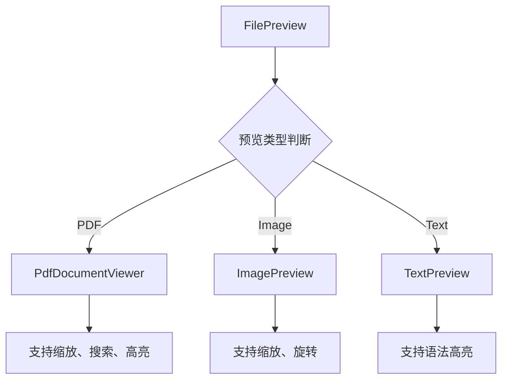

**Diagram sources**
- [file-preview.vue](file://frontend/src/components/custom/file-preview.vue)
- [pdf-document-viewer.vue](file://frontend/src/components/custom/pdf-document-viewer.vue)

**Section sources**
- [file-preview.vue](file://frontend/src/components/custom/file-preview.vue)

## 新增功能组件分析

### 充值管理界面组件

recharge-manage/index.vue组件提供了管理员充值套餐管理功能，支持套餐的CRUD操作和状态管理。

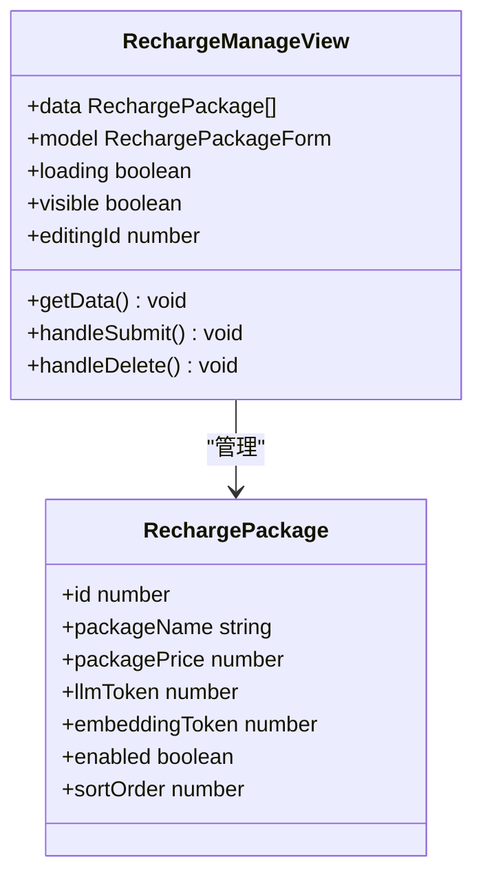

**Diagram sources**
- [recharge-manage/index.vue](file://frontend/src/views/recharge-manage/index.vue)

该组件实现了完整的充值套餐管理流程：

- **数据展示**：基于Naive UI的NDataTable展示套餐列表
- **表单管理**：支持新增、编辑、删除操作
- **数据转换**：元与分的转换、万单位格式化
- **权限控制**：仅管理员可见和操作
- **状态管理**：启用/禁用状态切换

```vue
<script setup lang="tsx">
import type { DataTableColumns, FormRules, PaginationProps } from 'naive-ui';
import { NButton, NInput, NInputNumber, NSwitch, NTag, NPopconfirm, NModal, NForm, NFormItem, NEllipsis, NCard } from 'naive-ui';
import { ref, reactive, computed, onMounted } from 'vue';
import { request } from '@/service/request';

// 常量定义
const TOKEN_UNIT = 10000;

// 接口定义
interface RechargePackage {
  id: number;
  packageName: string;
  packagePrice: number;
  packageDesc: string | null;
  packageBenefit: string | null;
  llmToken: number;
  embeddingToken: number;
  enabled: boolean;
  deleted: boolean;
  sortOrder: number;
  createdAt: string;
  updatedAt: string;
}

// 组件逻辑...
</script>

<template>
  <div class="min-h-500px flex-col-stretch gap-16px overflow-auto">
    <NCard title="充值套餐管理" :bordered="false" size="small" class="card-wrapper">
      <template #header-extra>
        <NButton type="primary" @click="handleCreate">新增套餐</NButton>
      </template>

      <NDataTable
        :columns="columns"
        :data="data"
        :loading="loading"
        :pagination="pagination"
        :scroll-x="1200"
        class="mt-4"
      />
    </NCard>

    <!-- 弹窗表单 -->
    <NModal
      v-model:show="visible"
      preset="dialog"
      :title="isEditing ? '编辑充值套餐' : '新增充值套餐'"
      :show-icon="false"
      class="w-600px!"
    >
      <!-- 表单字段 -->
      <NForm
        ref="formRef"
        :model="model"
        :rules="rules"
        label-placement="left"
        label-width="120px"
      >
        <!-- 各种输入字段 -->
      </NForm>
    </NModal>
  </div>
</template>
```

**Section sources**
- [recharge-manage/index.vue](file://frontend/src/views/recharge-manage/index.vue)
- [routes.ts](file://frontend/src/router/elegant/routes.ts)
- [recharge.ts](file://frontend/src/service/api/recharge.ts)

### 使用监控仪表板组件

usage-monitor/index.vue组件提供了系统使用情况的实时监控和分析功能，包含限流配置管理和用量趋势分析。

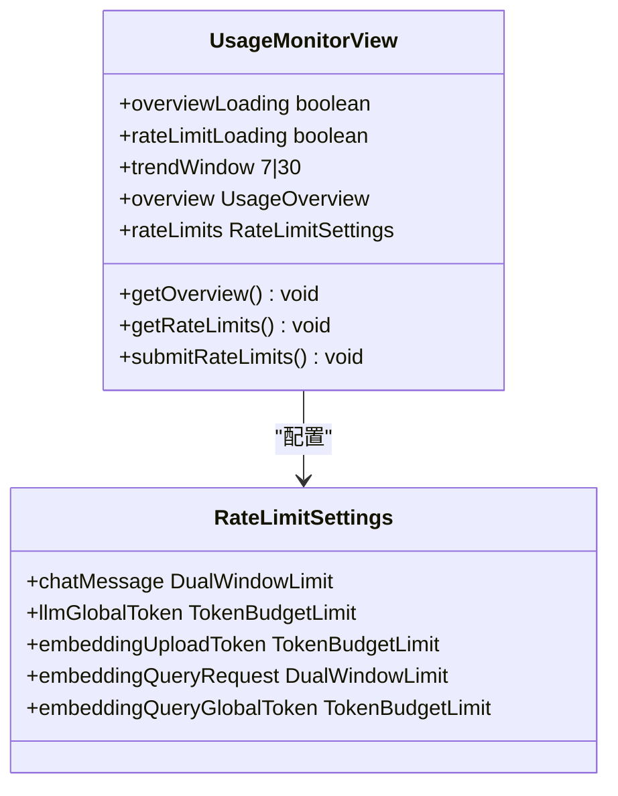

**Diagram sources**
- [usage-monitor/index.vue](file://frontend/src/views/usage-monitor/index.vue)

该组件集成了ECharts图表库，提供多维度的使用监控：

- **限流配置**：聊天消息、LLM全局Token预算、Embedding相关配置
- **用量概览**：今日用量、历史趋势、用户排行
- **告警管理**：超限告警、风险用户识别
- **可视化展示**：折线图、柱状图、标签卡片

```vue
<script setup lang="tsx">
import { computed, onMounted, ref, watch } from 'vue';
import { NButton, NCard, NEmpty, NTag } from 'naive-ui';
import type { ECOption } from '@/hooks/common/echarts';
import { useEcharts } from '@/hooks/common/echarts';

const trendWindow = ref<7 | 30>(7);
const overviewLoading = ref(false);
const overview = ref<Api.Admin.UsageOverview | null>(null);
const rateLimitLoading = ref(false);
const rateLimits = ref<Api.Admin.RateLimitSettings | null>(null);

// ECharts配置
const { domRef: trendChartRef, updateOptions } = useEcharts<ECOption>(() => ({
  tooltip: { trigger: 'axis' },
  legend: { top: 0 },
  grid: { top: 48, left: 24, right: 24, bottom: 24, containLabel: true },
  xAxis: { type: 'category', data: [] },
  yAxis: [
    { type: 'value', name: 'Tokens' },
    { type: 'value', name: 'Requests' }
  ],
  series: []
}));

// 监听数据变化并更新图表
watch([overview, trendWindow], async () => {
  const trends = overview.value?.trends || [];
  await updateOptions(() => ({
    xAxis: { type: 'category', data: trends.map(item => dayjs(item.day).format('MM-DD')) },
    series: [
      { name: 'LLM Tokens', type: 'line', smooth: true, data: trends.map(item => item.llmUsedTokens) },
      { name: 'Embedding Tokens', type: 'line', smooth: true, data: trends.map(item => item.embeddingUsedTokens) },
      { name: 'Chat Messages', type: 'bar', yAxisIndex: 1, data: trends.map(item => item.chatRequestCount) },
      { name: 'LLM Requests', type: 'bar', yAxisIndex: 1, data: trends.map(item => item.llmRequestCount) },
      { name: 'Embedding Requests', type: 'bar', yAxisIndex: 1, data: trends.map(item => item.embeddingRequestCount) }
    ]
  }));
});
</script>

<template>
  <div class="min-h-500px flex-col-stretch gap-16px overflow-auto">
    <!-- 限流配置卡片 -->
    <NCard :bordered="false" size="small" class="card-wrapper">
      <template #header>调用限流配置</template>
      <template #header-extra>
        <NButton type="primary" size="small" :loading="rateLimitSaving" @click="submitRateLimits">
          保存配置
        </NButton>
      </template>
      
      <!-- 限流配置表单 -->
      <div class="grid gap-4 xl:grid-cols-2">
        <!-- 各种限流配置项 -->
      </div>
    </NCard>

    <!-- 用量概览卡片 -->
    <NCard :bordered="false" size="small" class="card-wrapper">
      <template #header>
        <div class="flex items-center gap-3">
          <span>用量总览</span>
          <NTag size="small" type="warning">今日告警 {{ alertCount }}</NTag>
          <NTag size="small" type="error">超额 {{ criticalAlertCount }}</NTag>
        </div>
      </template>
      
      <!-- 图表和排行 -->
      <div class="grid gap-4 xl:grid-cols-[minmax(0,1.4fr)_minmax(320px,0.6fr)]">
        <NCard size="small" embedded class="overview-section">
          <template #header>调用趋势</template>
          <div ref="trendChartRef" class="h-360px w-full" />
        </NCard>
        
        <!-- 告警和排行信息 -->
      </div>
    </NCard>
  </div>
</template>
```

**Section sources**
- [usage-monitor/index.vue](file://frontend/src/views/usage-monitor/index.vue)
- [routes.ts](file://frontend/src/router/elegant/routes.ts)

### 邀请码管理界面组件

invite-code/index.vue组件提供了完整的邀请码管理系统，支持批量创建、状态管理和分享功能。

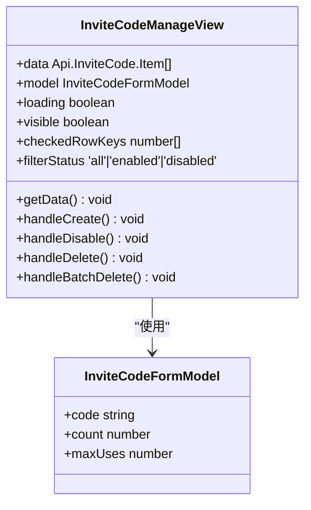

**Diagram sources**
- [invite-code/index.vue](file://frontend/src/views/invite-code/index.vue)

该组件实现了邀请码的全生命周期管理：

- **批量创建**：支持1-100个邀请码的批量生成
- **状态管理**：启用/禁用状态切换，使用情况跟踪
- **分享功能**：自动生成分享链接和推广话术
- **筛选过滤**：按状态筛选、分页显示
- **批量操作**：支持批量删除等操作

```vue
<script setup lang="tsx">
import type { DataTableColumns, DataTableRowKey, FormRules, PaginationProps, SelectOption } from 'naive-ui';
import { NButton, NInput, NInputNumber, NPopconfirm, NTag } from 'naive-ui';
import { buildInviteCodeShareMessage } from '@/constants/invite-channel';
import {
  fetchCreateInviteCode,
  fetchDeleteInviteCode,
  fetchDisableInviteCode,
  fetchGetInviteCodeList,
  fetchUpdateInviteCode
} from '@/service/api';

const enabledOptions: SelectOption[] = [
  { label: '全部状态', value: 'all' },
  { label: '仅启用', value: 'enabled' },
  { label: '仅禁用', value: 'disabled' }
];

// 数据表格列定义
const columns = computed<DataTableColumns<Api.InviteCode.Item>>(() => [
  {
    type: 'selection'
  },
  {
    key: 'code',
    title: '邀请码',
    minWidth: 240,
    render: row => (
      <div class="min-w-0">
        <div class="truncate text-3.5 leading-5 font-mono">{row.code}</div>
        <div class="mt-2 flex flex-wrap gap-2">
          <NButton size="tiny" quaternary onClick={() => { /* 复制功能 */ }}>
            复制
          </NButton>
          <NButton size="tiny" quaternary onClick={() => { /* 复制链接功能 */ }}>
            复制链接
          </NButton>
          <NButton size="tiny" quaternary onClick={() => { /* 复制话术功能 */ }}>
            复制话术
          </NButton>
        </div>
      </div>
    )
  },
  {
    key: 'usage',
    title: '使用情况',
    width: 92,
    render: row => `${row.usedCount}/${row.maxUses}`
  },
  {
    key: 'availability',
    title: '可用性',
    width: 92,
    render: row => {
      if (!row.enabled) return <NTag type="default">不可用</NTag>;
      if (row.usedCount >= row.maxUses) return <NTag type="error">已耗尽</NTag>;
      return <NTag type="success">可使用</NTag>;
    }
  }
]);

// 组件逻辑...
</script>

<template>
  <div class="min-h-500px flex-col-stretch gap-16px overflow-auto">
    <NCard
      title="邀请码管理"
      :bordered="false"
      size="small"
      class="sm:flex-1-hidden card-wrapper"
      content-class="flex-col-stretch min-h-0 sm:h-full"
    >
      <template #header-extra>
        <NSpace :size="12" align="center" wrap>
          <NSelect
            v-model:value="filterStatus"
            :options="enabledOptions"
            class="w-140px"
            @update:value="handleFilterChange"
          />
          <NButton type="primary" @click="openCreateDialog">创建邀请码</NButton>
          <NPopconfirm @positive-click="handleBatchDelete">
            <template #trigger>
              <NButton type="error" ghost :disabled="!hasCheckedRows || loading">批量删除</NButton>
            </template>
          </NPopconfirm>
          <NButton @click="getData">刷新</NButton>
        </NSpace>
      </template>

      <NDataTable
        :columns="columns"
        :data="data"
        size="small"
        :flex-height="!appStore.isMobile"
        :scroll-x="1100"
        :loading="loading"
        remote
        :pagination="mobilePagination"
        class="sm:h-full"
      />
    </NCard>
  </div>
</template>
```

**Section sources**
- [invite-code/index.vue](file://frontend/src/views/invite-code/index.vue)
- [routes.ts](file://frontend/src/router/elegant/routes.ts)
- [invite-code.ts](file://frontend/src/service/api/invite-code.ts)

## 布局组件与功能组件集成

### 全局头部组件集成

global-header.vue组件集成了多个功能组件，构成了应用的全局头部区域。

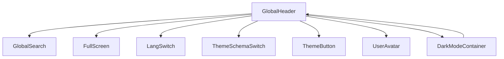

**Diagram sources**
- [global-header.vue](file://frontend/src/layouts/modules/global-header/index.vue)

```vue
<script setup lang="ts">
import { useFullscreen } from '@vueuse/core';
import { useAppStore } from '@/store/modules/app';
import { useThemeStore } from '@/store/modules/theme';
import GlobalSearch from '../global-search/index.vue';
import ThemeButton from './components/theme-button.vue';
import UserAvatar from './components/user-avatar.vue';

defineOptions({
  name: 'GlobalHeader'
});

interface Props {
  showMenuToggler?: App.Global.HeaderProps['showMenuToggler'];
}

defineProps<Props>();

const appStore = useAppStore();
const themeStore = useThemeStore();
const { isFullscreen, toggle } = useFullscreen();

const isDev = import.meta.env.DEV;
</script>

<template>
  <DarkModeContainer class="ml-12 h-full flex-y-center justify-between bg-transparent">
    <div id="header-extra" class="h-full flex-col justify-center rd-full bg-container shadow-2xl"></div>
    <MenuToggler
      v-if="showMenuToggler && appStore.isMobile"
      :collapsed="appStore.siderCollapse"
      @click="appStore.toggleSiderCollapse"
    />
    <div class="h-full flex-y-center justify-end rd-full bg-container px-8 shadow-2xl">
      <GlobalSearch />
      <FullScreen v-if!appStore.isMobile" :full="isFullscreen" @click="toggle" />
      <LangSwitch
        v-if="themeStore.header.multilingual.visible"
        :lang="appStore.locale"
        :lang-options="appStore.localeOptions"
        @change-lang="appStore.changeLocale"
      />
      <ThemeSchemaSwitch
        :theme-schema="themeStore.themeScheme"
        :is-dark="themeStore.darkMode"
        @switch="themeStore.toggleThemeScheme"
      />
      <ThemeButton v-if="isDev" />
      <UserAvatar />
    </div>
  </DarkModeContainer>
</template>
```

**Section sources**
- [global-header.vue](file://frontend/src/layouts/modules/global-header/index.vue)

### 全局菜单组件集成

global-menu.vue组件根据主题设置动态选择不同的菜单布局组件，实现了灵活的菜单系统。

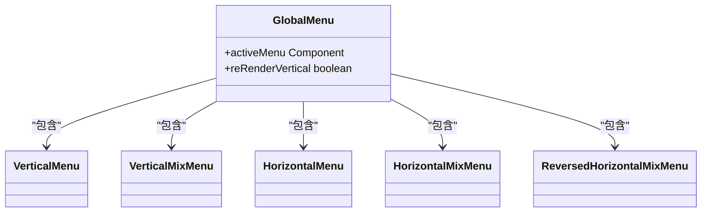

**Diagram sources**
- [global-menu.vue](file://frontend/src/layouts/modules/global-menu/index.vue)

```vue
<script setup lang="ts">
import { computed } from 'vue';
import type { Component } from 'vue';
import { useAppStore } from '@/store/modules/app';
import { useThemeStore } from '@/store/modules/theme';
import VerticalMenu from './modules/vertical-menu.vue';
import VerticalMixMenu from './modules/vertical-mix-menu.vue';
import HorizontalMenu from './modules/horizontal-menu.vue';
import HorizontalMixMenu from './modules/horizontal-mix-menu.vue';
import ReversedHorizontalMixMenu from './modules/reversed-horizontal-mix-menu.vue';

defineOptions({
  name: 'GlobalMenu'
});

const appStore = useAppStore();
const themeStore = useThemeStore();

const activeMenu = computed(() => {
  const menuMap: Record<UnionKey.ThemeLayoutMode, Component> = {
    vertical: VerticalMenu,
    'vertical-mix': VerticalMixMenu,
    horizontal: HorizontalMenu,
    'horizontal-mix': themeStore.layout.reverseHorizontalMix ? ReversedHorizontalMixMenu : HorizontalMixMenu
  };

  return menuMap[themeStore.layout.mode];
});

const reRenderVertical = computed(() => themeStore.layout.mode === 'vertical' && appStore.isMobile);
</script>

<template>
  <component :is="activeMenu" :key="reRenderVertical" />
</template>
```

**Section sources**
- [global-menu.vue](file://frontend/src/layouts/modules/global-menu/index.vue)

### 新增路由集成

新增的功能组件都已集成到路由系统中，支持权限控制和菜单导航：

- **充值管理**：`/recharge-manage` - 管理员专用
- **使用监控**：`/usage-monitor` - 管理员专用  
- **邀请码管理**：`/invite-code` - 管理员专用
- **个人中心**：`/personal-center` - 用户专用

**Section sources**
- [routes.ts](file://frontend/src/router/elegant/routes.ts)