# 自定义业务组件

<cite>
**本文档引用的文件**  
- [svg-icon.vue](file://frontend/src/components/custom/svg-icon.vue#L1-L54)
- [button-icon.vue](file://frontend/src/components/custom/button-icon.vue#L1-L48)
- [org-tag-cascader.vue](file://frontend/src/components/custom/org-tag-cascader.vue#L1-L56)
- [soybean-avatar.vue](file://frontend/src/components/custom/soybean-avatar.vue#L1-L13)
- [the-select.vue](file://frontend/src/components/custom/the-select.vue#L1-L67)
- [iconify.ts](file://frontend/src/plugins/iconify.ts#L1-L10)
- [unocss.ts](file://frontend/build/plugins/unocss.ts#L1-L32)
- [org-tag.ts](file://frontend/src/service/api/org-tag.ts#L1-L5)
- [org-tag/index.vue](file://frontend/src/views/org-tag/index.vue#L1-L111)
- [org-tag-operate-dialog.vue](file://frontend/src/views/org-tag/modules/org-tag-operate-dialog.vue#L1-L132)
- [pin-toggler.vue](file://frontend/src/components/common/pin-toggler.vue#L1-L25)
- [full-screen.vue](file://frontend/src/components/common/full-screen.vue#L1-L21)
- [reload-button.vue](file://frontend/src/components/common/reload-button.vue#L1-L20)
</cite>

## 目录
1. [简介](#简介)
2. [项目结构](#项目结构)
3. [核心组件](#核心组件)
4. [架构概览](#架构概览)
5. [详细组件分析](#详细组件分析)
6. [依赖分析](#依赖分析)
7. [性能考量](#性能考量)
8. [故障排除指南](#故障排除指南)
9. [结论](#结论)

## 简介
本文档系统性地文档化了PaiSmart项目中自定义业务组件的实现原理与使用规范。重点解析了基于Iconify的动态图标渲染机制、常用图标按钮模式的封装、组织标签级联选择器的业务逻辑、头像组件的合成策略以及增强型选择器的功能特性。通过结合用户管理、权限配置等实际业务场景，提供了集成示例和最佳实践建议，旨在为开发者提供全面的技术参考。

## 项目结构
项目采用模块化分层架构，前端代码位于`frontend`目录下，主要组件集中在`src/components/custom`路径中。核心自定义业务组件包括`svg-icon.vue`、`button-icon.vue`、`org-tag-cascader.vue`、`soybean-avatar.vue`和`the-select.vue`，分别处理图标渲染、按钮封装、组织标签选择、头像展示和选择器增强功能。

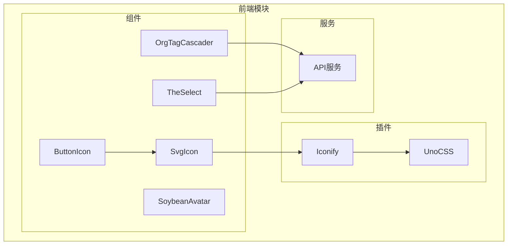

**图示来源**
- [svg-icon.vue](file://frontend/src/components/custom/svg-icon.vue#L1-L54)
- [button-icon.vue](file://frontend/src/components/custom/button-icon.vue#L1-L48)
- [org-tag-cascader.vue](file://frontend/src/components/custom/org-tag-cascader.vue#L1-L56)
- [the-select.vue](file://frontend/src/components/custom/the-select.vue#L1-L67)
- [iconify.ts](file://frontend/src/plugins/iconify.ts#L1-L10)
- [unocss.ts](file://frontend/build/plugins/unocss.ts#L1-L32)
- [org-tag.ts](file://frontend/src/service/api/org-tag.ts#L1-L5)

**本节来源**
- [project_structure](file://#L1-L200)

## 核心组件
本文档分析的核心组件包括：`svg-icon.vue`（基于Iconify的动态图标渲染）、`button-icon.vue`（图标按钮封装）、`org-tag-cascader.vue`（组织标签级联选择）、`soybean-avatar.vue`（头像合成）和`the-select.vue`（增强选择器）。这些组件共同构成了系统的UI基础，支持用户管理、权限配置等关键业务功能。

**本节来源**
- [frontend/src/components/custom](file://frontend/src/components/custom#L1-L10)

## 架构概览
系统采用Vue 3 + Vite技术栈，结合Naive UI组件库和UnoCSS原子化样式方案。图标系统通过Iconify实现动态加载，支持在线图标库和本地SVG图标。数据交互通过alova请求库完成，组件间通信采用标准的Vue props和emit机制。整体架构清晰分离关注点，便于维护和扩展。

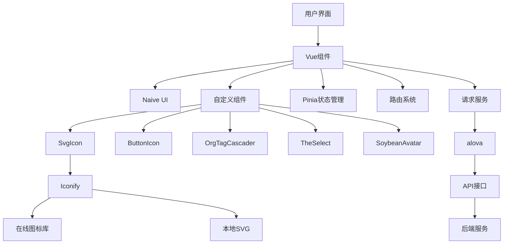

**图示来源**
- [svg-icon.vue](file://frontend/src/components/custom/svg-icon.vue#L1-L54)
- [button-icon.vue](file://frontend/src/components/custom/button-icon.vue#L1-L48)
- [org-tag-cascader.vue](file://frontend/src/components/custom/org-tag-cascader.vue#L1-L56)
- [the-select.vue](file://frontend/src/components/custom/the-select.vue#L1-L67)
- [iconify.ts](file://frontend/src/plugins/iconify.ts#L1-L10)

## 详细组件分析

### SvgIcon 组件分析
`svg-icon.vue`组件实现了基于Iconify的动态图标渲染机制，支持Iconify图标库和本地SVG图标的双重加载模式。

#### 图标名称解析与缓存策略
组件通过`symbolId`计算属性解析本地图标名称，使用环境变量`VITE_ICON_LOCAL_PREFIX`作为前缀构建SVG symbol ID。当同时传递`icon`和`localIcon`属性时，优先渲染本地图标。

```mermaid
classDiagram
class SvgIcon {
+icon : string
+localIcon : string
-symbolId : string
-renderLocalIcon : boolean
+bindAttrs : object
}
SvgIcon --> Icon : "使用"
Icon --> "@iconify/vue" : "依赖"
```

**图示来源**
- [svg-icon.vue](file://frontend/src/components/custom/svg-icon.vue#L1-L54)

#### 按需加载优化
通过`setupIconifyOffline`函数配置离线图标资源，将`VITE_ICONIFY_URL`指向本地图标服务，减少网络请求。UnoCSS插件配置了`FileSystemIconLoader`，在构建时预加载本地SVG图标，实现按需加载优化。

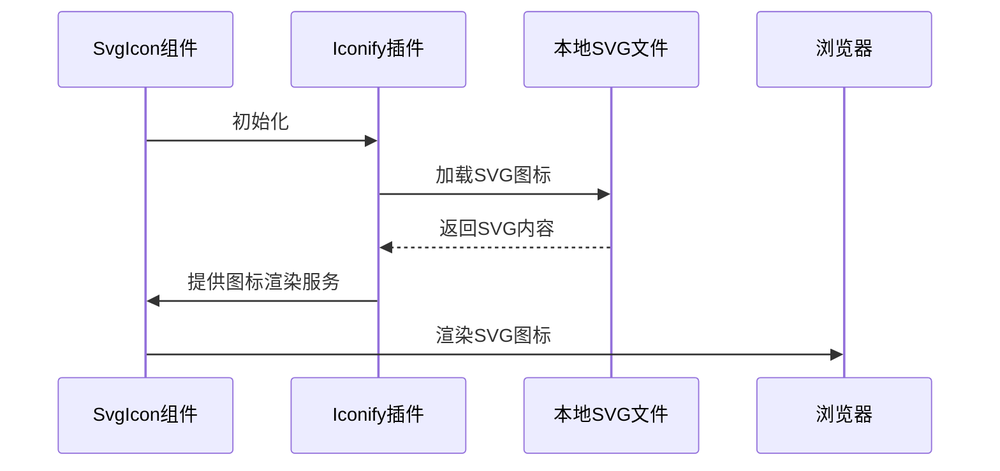

**图示来源**
- [iconify.ts](file://frontend/src/plugins/iconify.ts#L1-L10)
- [unocss.ts](file://frontend/build/plugins/unocss.ts#L1-L32)

**本节来源**
- [svg-icon.vue](file://frontend/src/components/custom/svg-icon.vue#L1-L54)
- [iconify.ts](file://frontend/src/plugins/iconify.ts#L1-L10)
- [unocss.ts](file://frontend/build/plugins/unocss.ts#L1-L32)

### ButtonIcon 组件分析
`button-icon.vue`组件封装了常用的图标按钮模式，集成了Tooltip提示功能，支持主题适配。

#### 封装模式与主题适配
组件基于Naive UI的`NButton`和`NTooltip`构建，通过`twMerge`工具函数合并Tailwind CSS类名，实现灵活的样式定制。默认高度为36px，文本颜色继承自主题配置。

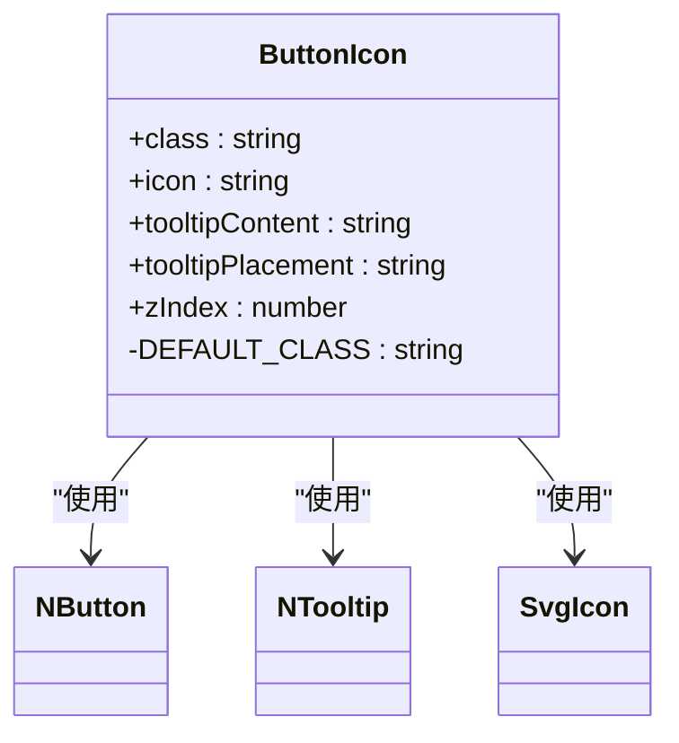

**图示来源**
- [button-icon.vue](file://frontend/src/components/custom/button-icon.vue#L1-L48)

#### 实际应用示例
在`pin-toggler.vue`、`full-screen.vue`和`reload-button.vue`等组件中被广泛使用，提供统一的图标按钮交互体验。

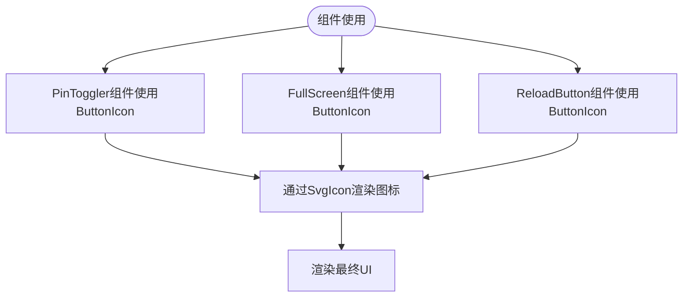

**图示来源**
- [pin-toggler.vue](file://frontend/src/components/common/pin-toggler.vue#L1-L25)
- [full-screen.vue](file://frontend/src/components/common/full-screen.vue#L1-L21)
- [reload-button.vue](file://frontend/src/components/common/reload-button.vue#L1-L20)

**本节来源**
- [button-icon.vue](file://frontend/src/components/custom/button-icon.vue#L1-L48)
- [pin-toggler.vue](file://frontend/src/components/common/pin-toggler.vue#L1-L25)

### OrgTagCascader 组件分析
`org-tag-cascader.vue`组件实现了组织标签的级联选择功能，支持数据懒加载、权限过滤和选中状态同步。

#### 业务逻辑与数据懒加载
组件通过`fetchGetOrgTagList` API获取组织标签树结构数据，默认在组件挂载时自动加载。支持通过`options`属性传入外部数据，实现数据复用。

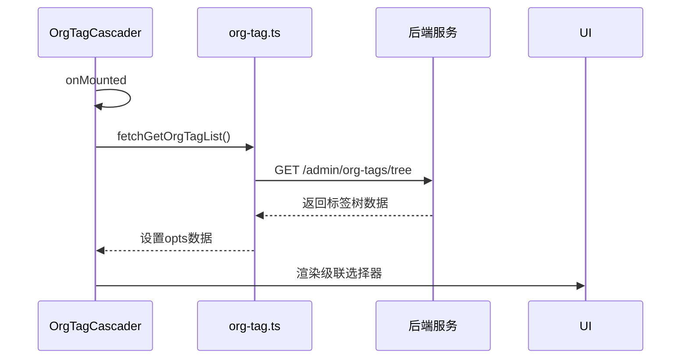

**图示来源**
- [org-tag-cascader.vue](file://frontend/src/components/custom/org-tag-cascader.vue#L1-L56)
- [org-tag.ts](file://frontend/src/service/api/org-tag.ts#L1-L5)

#### 权限过滤与选中状态同步
通过`excludePrivate`属性过滤以"PRIVATE_"开头的私有标签，实现权限控制。使用`defineModel`实现v-model双向绑定，确保选中状态与父组件同步。

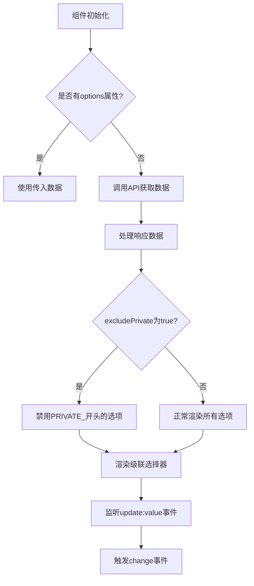

**图示来源**
- [org-tag-cascader.vue](file://frontend/src/components/custom/org-tag-cascader.vue#L1-L56)

#### 实际业务场景集成
在`org-tag/index.vue`的表格操作和`org-tag-operate-dialog.vue`的表单中被使用，支持新增、编辑组织标签时选择父级标签。

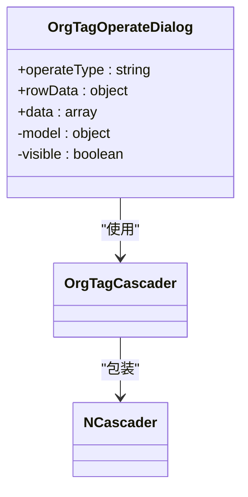

**图示来源**
- [org-tag-operate-dialog.vue](file://frontend/src/views/org-tag/modules/org-tag-operate-dialog.vue#L1-L132)

**本节来源**
- [org-tag-cascader.vue](file://frontend/src/components/custom/org-tag-cascader.vue#L1-L56)
- [org-tag.ts](file://frontend/src/service/api/org-tag.ts#L1-L5)
- [org-tag-operate-dialog.vue](file://frontend/src/views/org-tag/modules/org-tag-operate-dialog.vue#L1-L132)

### SoybeanAvatar 组件分析
`soybean-avatar.vue`组件实现了简单的头像展示功能，采用固定的图片资源作为头像。

#### 头像合成与fallback策略
组件直接引用`@/assets/imgs/soybean.jpg`作为头像图片，通过CSS类名`size-72px overflow-hidden rd-1/2`实现72px圆形裁剪显示。目前未实现动态头像或fallback机制。

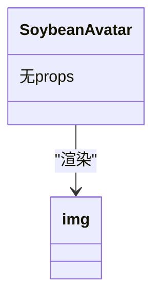

**图示来源**
- [soybean-avatar.vue](file://frontend/src/components/custom/soybean-avatar.vue#L1-L13)

**本节来源**
- [soybean-avatar.vue](file://frontend/src/components/custom/soybean-avatar.vue#L1-L13)

### TheSelect 组件分析
`the-select.vue`组件对原生选择器进行了功能增强，支持远程数据获取、搜索、分组和虚拟滚动。

#### 增强功能实现
组件基于Naive UI的`NSelect`构建，通过`url`属性配置数据源，支持远程数据加载。`params`属性用于传递查询参数，`watch`监听器在参数变化时重新获取数据。

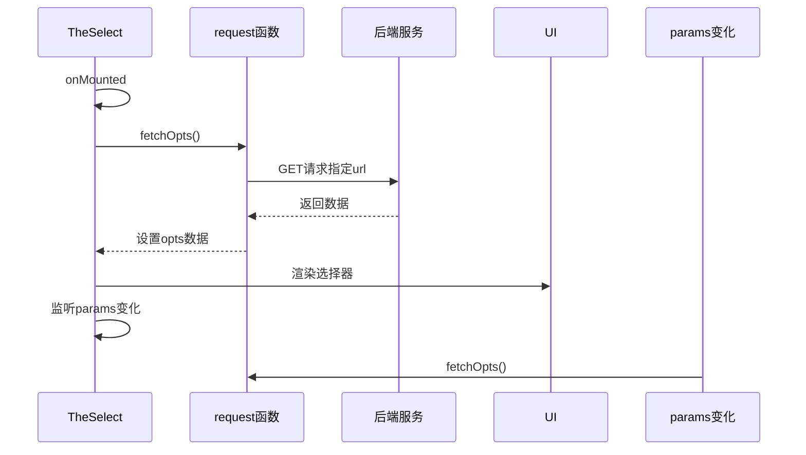

**图示来源**
- [the-select.vue](file://frontend/src/components/custom/the-select.vue#L1-L67)

#### 高级特性支持
- **搜索功能**：通过`filterable`属性启用
- **远程数据**：通过`remote`属性标识
- **首次选择**：`selectFirst`属性自动选择第一个选项
- **分组支持**：通过`SelectGroupOption`类型支持
- **虚拟滚动**：由Naive UI底层实现

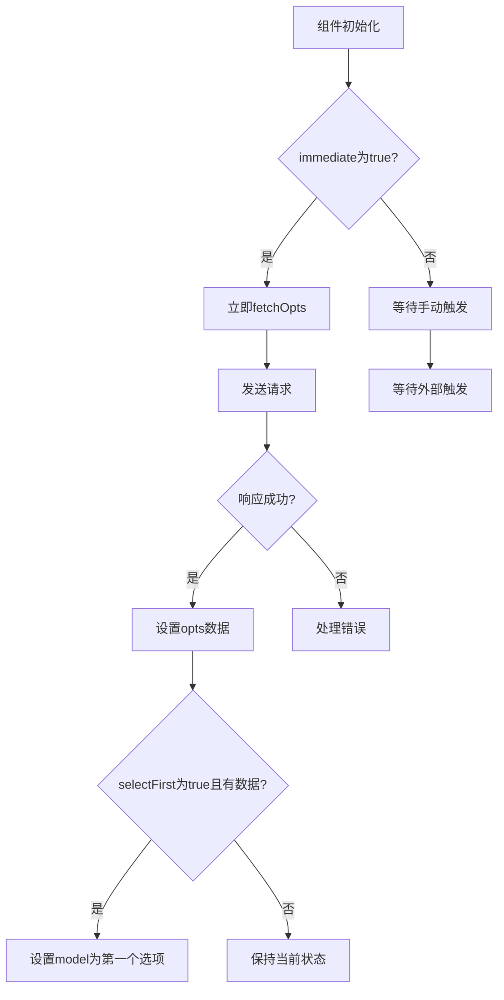

**图示来源**
- [the-select.vue](file://frontend/src/components/custom/the-select.vue#L1-L67)

**本节来源**
- [the-select.vue](file://frontend/src/components/custom/the-select.vue#L1-L67)

## 依赖分析
各组件之间存在明确的依赖关系，形成清晰的调用链。`button-icon.vue`依赖`svg-icon.vue`实现图标渲染，`org-tag-cascader.vue`和`the-select.vue`依赖API服务获取数据，`svg-icon.vue`依赖Iconify插件提供图标资源。

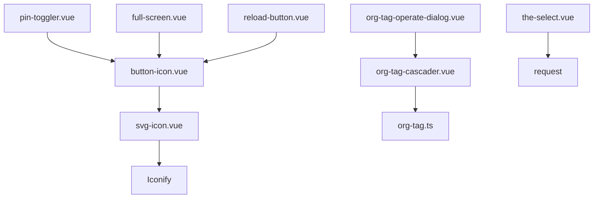

**图示来源**
- [svg-icon.vue](file://frontend/src/components/custom/svg-icon.vue#L1-L54)
- [button-icon.vue](file://frontend/src/components/custom/button-icon.vue#L1-L48)
- [org-tag-cascader.vue](file://frontend/src/components/custom/org-tag-cascader.vue#L1-L56)
- [the-select.vue](file://frontend/src/components/custom/the-select.vue#L1-L67)
- [org-tag-operate-dialog.vue](file://frontend/src/views/org-tag/modules/org-tag-operate-dialog.vue#L1-L132)
- [pin-toggler.vue](file://frontend/src/components/common/pin-toggler.vue#L1-L25)

**本节来源**
- 所有引用文件

## 性能考量
- **图标加载**：通过Iconify离线模式和UnoCSS预加载优化图标渲染性能
- **数据获取**：`the-select.vue`和`org-tag-cascader.vue`采用懒加载策略，避免初始渲染时的性能开销
- **内存使用**：合理使用`ref`和`computed`，避免不必要的响应式开销
- **渲染效率**：基于Naive UI组件构建，继承其虚拟滚动和懒渲染优化

## 故障排除指南
- **图标不显示**：检查`VITE_ICONIFY_URL`环境变量配置和网络连接
- **数据加载失败**：验证API接口地址和权限配置
- **样式异常**：确认UnoCSS和Tailwind CSS配置正确
- **交互无响应**：检查事件绑定和props传递是否正确

**本节来源**
- [svg-icon.vue](file://frontend/src/components/custom/svg-icon.vue#L1-L54)
- [the-select.vue](file://frontend/src/components/custom/the-select.vue#L1-L67)
- [org-tag-cascader.vue](file://frontend/src/components/custom/org-tag-cascader.vue#L1-L56)

## 结论
本文档详细分析了PaiSmart项目中的自定义业务组件，涵盖了实现原理、使用规范和最佳实践。这些组件通过合理的封装和优化，为系统提供了稳定可靠的UI基础。建议在实际开发中遵循本文档的指导原则，充分利用组件的特性，同时注意性能优化和错误处理，确保应用的高质量交付。