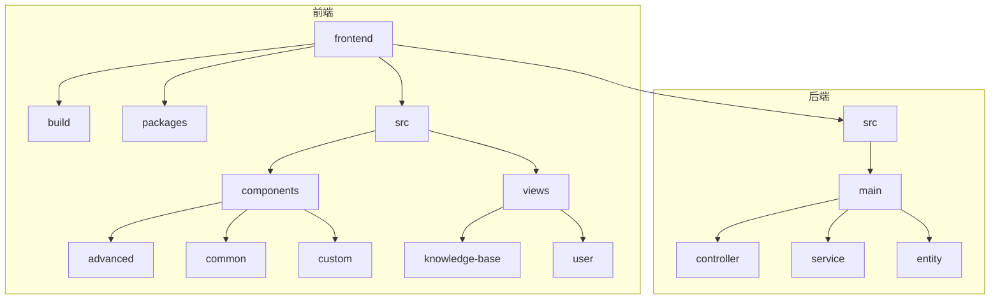
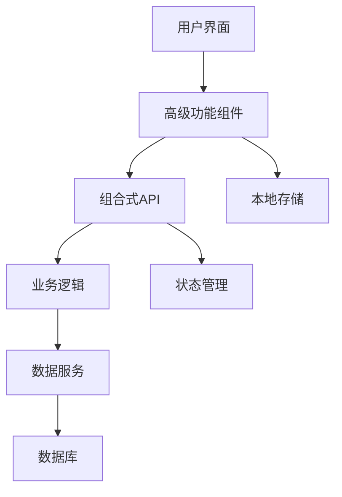
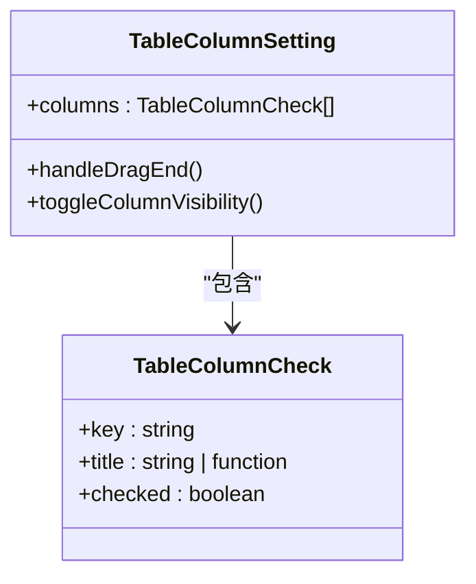
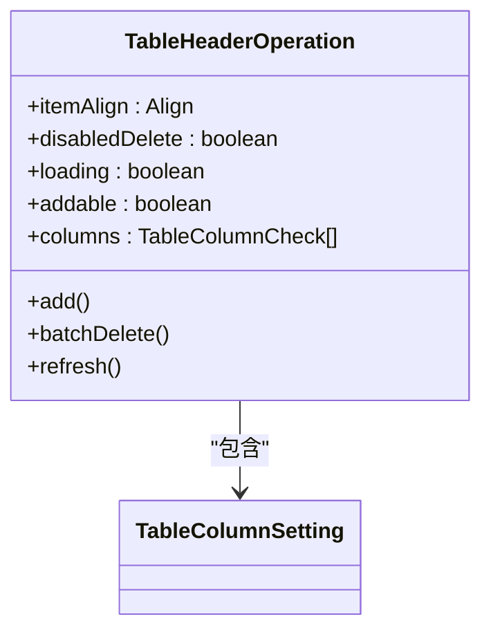
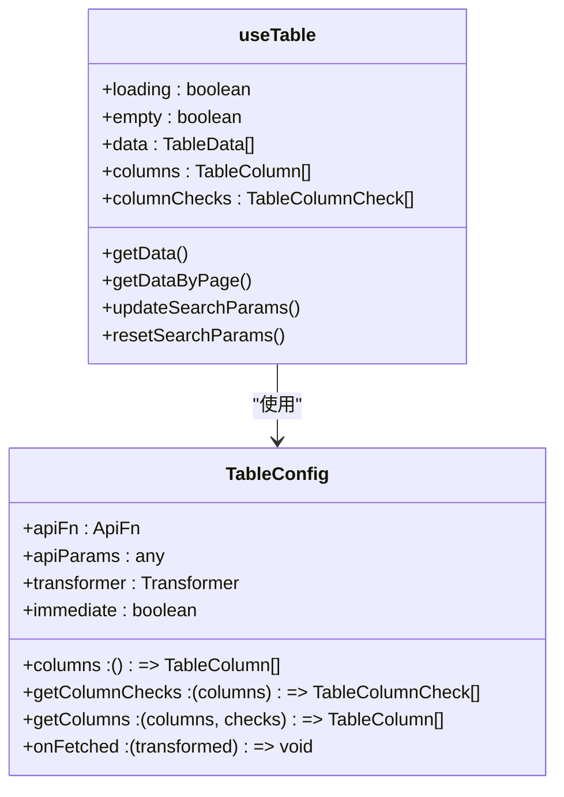
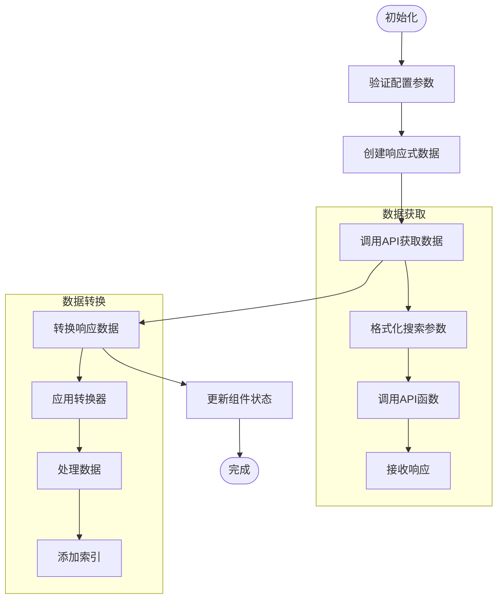
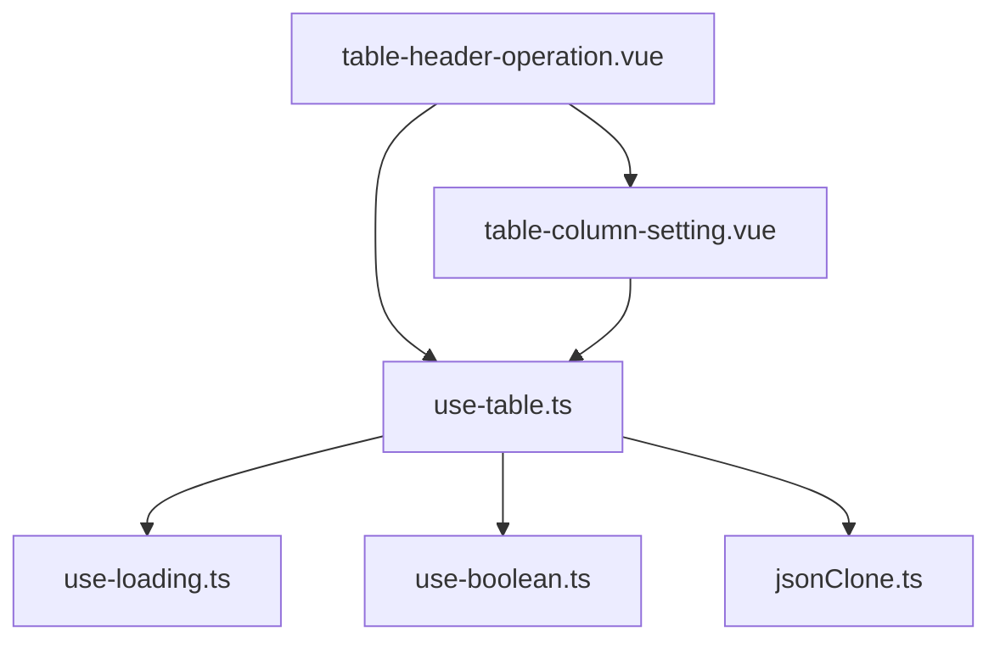

# 高级功能组件

<cite>
**本文档引用的文件**   
- [table-column-setting.vue](file://frontend/src/components/advanced/table-column-setting.vue)
- [table-header-operation.vue](file://frontend/src/components/advanced/table-header-operation.vue)
- [use-table.ts](file://frontend/packages/hooks/src/use-table.ts)
- [table.ts](file://frontend/src/hooks/common/table.ts)
- [naive-ui.d.ts](file://frontend/src/typings/naive-ui.d.ts)
- [index.vue](file://frontend/src/views/knowledge-base/index.vue)
- [user/index.vue](file://frontend/src/views/user/index.vue)
- [storage.ts](file://frontend/packages/utils/src/storage.ts)
</cite>

## 目录
1. [引言](#引言)
2. [项目结构](#项目结构)
3. [核心组件](#核心组件)
4. [架构概述](#架构概述)
5. [详细组件分析](#详细组件分析)
6. [依赖分析](#依赖分析)
7. [性能考虑](#性能考虑)
8. [故障排除指南](#故障排除指南)
9. [结论](#结论)

## 引言
本文档全面解析高级功能组件在复杂业务场景中的设计与应用。重点分析`table-column-setting.vue`和`table-header-operation.vue`两个核心组件，深入探讨它们如何通过动态列配置、本地存储记忆和事件总线机制实现表格列的个性化定制。同时，结合`use-table`等组合式API，说明这些组件如何与业务逻辑层解耦并提供灵活的API接口。文档还提供了在知识库管理、用户列表等页面中的实际使用案例，并讨论了性能优化策略。

## 项目结构
项目采用分层架构设计，前端代码主要位于`frontend`目录下，后端代码位于`src`目录下。前端部分采用了模块化设计，将功能组件、业务逻辑和工具函数分离。



**图示来源**
- [项目结构](file://frontend/src/components/advanced/table-column-setting.vue)

## 核心组件
本文档的核心组件包括`table-column-setting.vue`、`table-header-operation.vue`和`use-table.ts`。这些组件共同构成了表格功能的高级特性，提供了列配置、头部操作和数据管理等核心功能。

**组件来源**
- [table-column-setting.vue](file://frontend/src/components/advanced/table-column-setting.vue#L1-L37)
- [table-header-operation.vue](file://frontend/src/components/advanced/table-header-operation.vue#L1-L75)
- [use-table.ts](file://frontend/packages/hooks/src/use-table.ts#L1-L154)

## 架构概述
系统采用前后端分离架构，前端使用Vue 3和Naive UI组件库，后端使用Java Spring Boot框架。高级功能组件通过组合式API与业务逻辑层解耦，实现了高内聚低耦合的设计。



**图示来源**
- [use-table.ts](file://frontend/packages/hooks/src/use-table.ts#L1-L154)
- [table-column-setting.vue](file://frontend/src/components/advanced/table-column-setting.vue#L1-L37)

## 详细组件分析

### table-column-setting.vue 分析
`table-column-setting.vue`组件实现了表格列的个性化定制功能，包括字段显隐控制和顺序调整。

#### 组件结构


**图示来源**
- [table-column-setting.vue](file://frontend/src/components/advanced/table-column-setting.vue#L1-L37)

#### 功能实现
该组件使用`VueDraggable`实现列顺序的拖拽调整，通过`NCheckbox`组件控制列的显隐状态。组件通过`defineModel`接收和同步列配置数据。

```vue
<template>
  <NPopover placement="bottom-end" trigger="click">
    <template #trigger>
      <NButton size="small">
        <template #icon>
          <icon-ant-design-setting-outlined class="text-icon" />
        </template>
        {{ $t('common.columnSetting') }}
      </NButton>
    </template>
    <VueDraggable v-model="columns" :animation="150" filter=".none_draggable">
      <div v-for="item in columns" :key="item.key" class="h-36px flex-y-center rd-4px hover:(bg-primary bg-opacity-20)">
        <icon-mdi-drag class="mr-8px h-full cursor-move text-icon" />
        <NCheckbox v-model:checked="item.checked" class="none_draggable flex-1">
          <template v-if="typeof item.title === 'function'">
            <component :is="item.title" />
          </template>
          <template v-else>{{ item.title }}</template>
        </NCheckbox>
      </div>
    </VueDraggable>
  </NPopover>
</template>
```

**组件来源**
- [table-column-setting.vue](file://frontend/src/components/advanced/table-column-setting.vue#L1-L37)

### table-header-operation.vue 分析
`table-header-operation.vue`组件作为表格头部操作区的容器，支持插槽注入、批量操作和工具按钮集成。

#### 组件结构


**图示来源**
- [table-header-operation.vue](file://frontend/src/components/advanced/table-header-operation.vue#L1-L75)

#### 功能实现
该组件通过插槽机制提供了高度的可扩展性，允许在头部操作区注入自定义内容。组件内置了添加、批量删除和刷新等常用操作按钮，并集成了`TableColumnSetting`组件。

```vue
<template>
  <NSpace :align="itemAlign" wrap justify="end" class="lt-sm:w-200px">
    <slot name="prefix"></slot>
    <slot name="default">
      <NButton v-if="addable" size="small" ghost type="primary" @click="add">
        <template #icon>
          <icon-ic-round-plus class="text-icon" />
        </template>
        {{ $t('common.add') }}
      </NButton>
      <NPopconfirm v-if="!disabledDelete" @positive-click="batchDelete">
        <template #trigger>
          <NButton size="small" ghost type="error">
            <template #icon>
              <icon-ic-round-delete class="text-icon" />
            </template>
            {{ $t('common.batchDelete') }}
          </NButton>
        </template>
        {{ $t('common.confirmDelete') }}
      </NPopconfirm>
    </slot>
    <NButton size="small" @click="refresh">
      <template #icon>
        <icon-mdi-refresh class="text-icon" :class="{ 'animate-spin': loading }" />
      </template>
      {{ $t('common.refresh') }}
    </NButton>
    <TableColumnSetting v-model:columns="columns" />
    <slot name="suffix"></slot>
  </NSpace>
</template>
```

**组件来源**
- [table-header-operation.vue](file://frontend/src/components/advanced/table-header-operation.vue#L1-L75)

### use-table.ts 分析
`use-table.ts`是组合式API的核心，负责表格数据的获取、转换和管理。

#### API 结构


**图示来源**
- [use-table.ts](file://frontend/packages/hooks/src/use-table.ts#L1-L154)

#### 数据流分析


**图示来源**
- [use-table.ts](file://frontend/packages/hooks/src/use-table.ts#L72-L121)

## 依赖分析
高级功能组件之间存在紧密的依赖关系，通过组合式API实现了解耦。



**图示来源**
- [use-table.ts](file://frontend/packages/hooks/src/use-table.ts#L1-L154)
- [table-header-operation.vue](file://frontend/src/components/advanced/table-header-operation.vue#L1-L75)

## 性能考虑
在实现高级功能组件时，需要考虑以下性能优化策略：

1. **虚拟滚动兼容性**：对于大数据量的表格，建议结合虚拟滚动技术，避免一次性渲染所有数据。
2. **本地存储优化**：列配置信息可以存储在本地，减少重复配置的开销。
3. **事件总线优化**：避免频繁的事件触发，使用防抖和节流技术优化性能。
4. **按需加载**：对于复杂的列配置，可以采用按需加载策略，提高初始渲染速度。

## 故障排除指南
在使用高级功能组件时，可能会遇到以下常见问题：

1. **列配置不保存**：检查本地存储是否正常工作，确保`storage.ts`文件正确配置。
2. **拖拽功能失效**：确认`VueDraggable`组件正确导入，检查CSS类名是否冲突。
3. **数据不更新**：验证`use-table`的`immediate`参数设置，确保API调用正常。
4. **插槽内容不显示**：检查父组件是否正确使用了具名插槽。

**问题来源**
- [storage.ts](file://frontend/packages/utils/src/storage.ts#L1-L76)
- [table-header-operation.vue](file://frontend/src/components/advanced/table-header-operation.vue#L28-L74)

## 结论
本文档详细分析了高级功能组件的设计与应用，展示了`table-column-setting.vue`、`table-header-operation.vue`和`use-table.ts`如何协同工作，实现表格的个性化定制和高效管理。通过组合式API的设计，这些组件实现了与业务逻辑层的解耦，提供了灵活的API接口。在实际应用中，这些组件已经在知识库管理和用户列表等页面中得到了成功应用，证明了其设计的合理性和实用性。