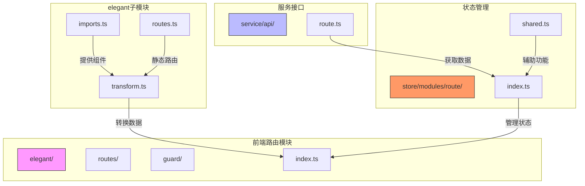
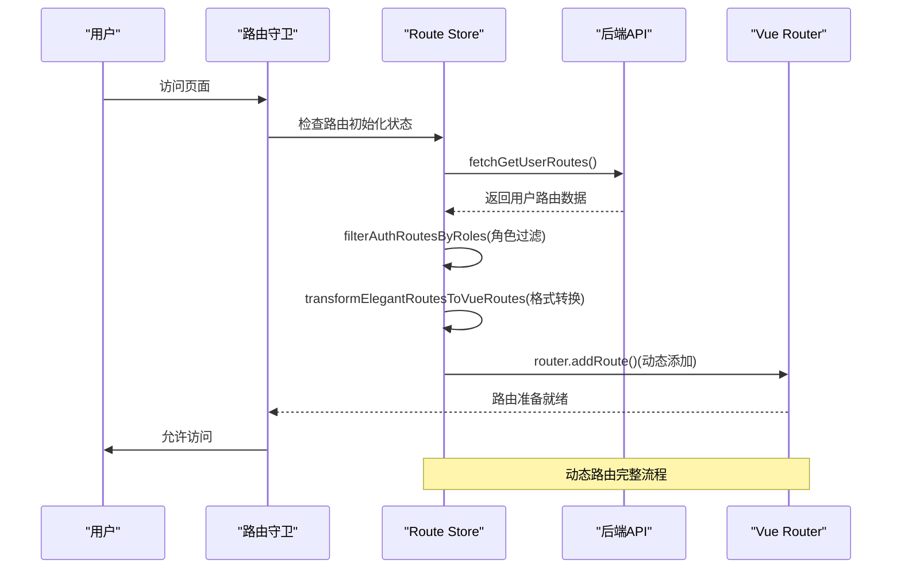
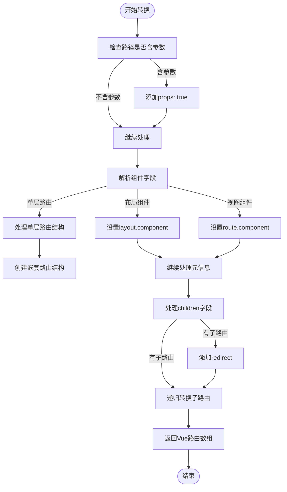
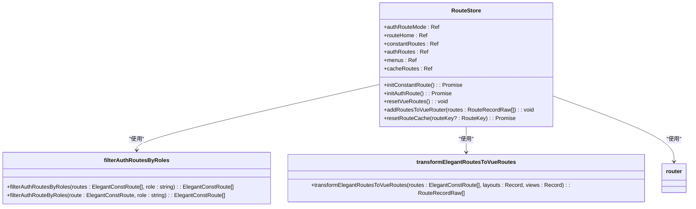
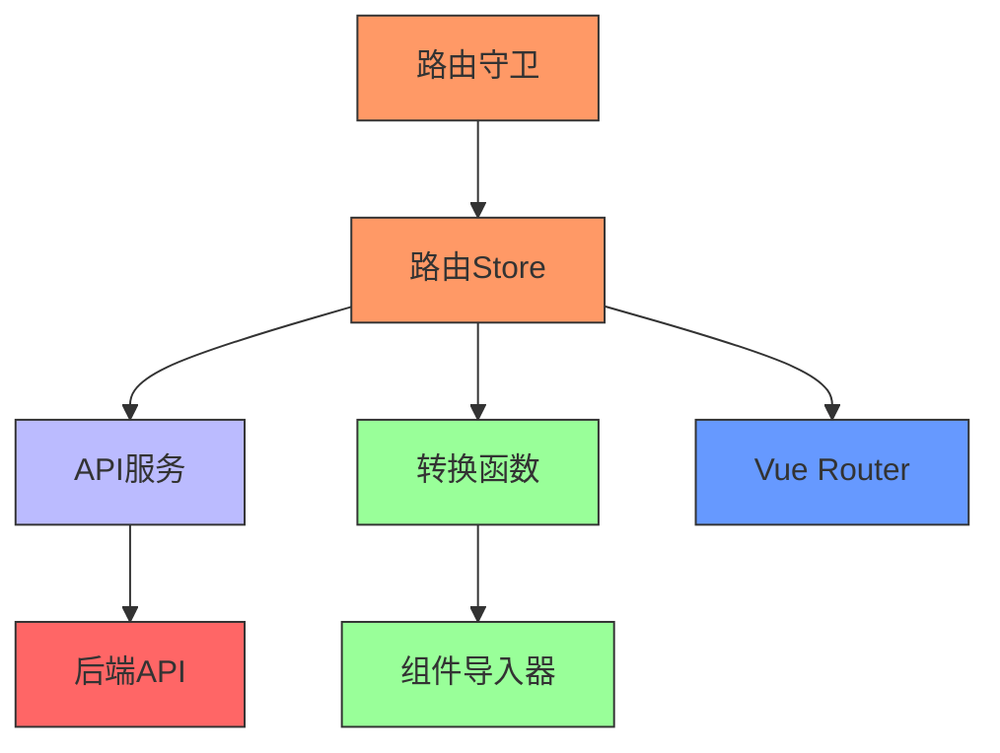

# 动态路由

<cite>
**本文档引用的文件**   
- [transform.ts](file://frontend/src/router/elegant/transform.ts)
- [imports.ts](file://frontend/src/router/elegant/imports.ts)
- [route.ts](file://frontend/src/service/api/route.ts)
- [index.ts](file://frontend/src/store/modules/route/index.ts)
- [shared.ts](file://frontend/src/store/modules/route/shared.ts)
- [routes/index.ts](file://frontend/src/router/routes/index.ts)
- [guard/route.ts](file://frontend/src/router/guard/route.ts)
- [app.ts](file://frontend/src/store/modules/app/index.ts)
</cite>

## 目录
1. [引言](#引言)
2. [项目结构](#项目结构)
3. [核心组件](#核心组件)
4. [架构概览](#架构概览)
5. [详细组件分析](#详细组件分析)
6. [依赖分析](#依赖分析)
7. [性能考量](#性能考量)
8. [故障排除指南](#故障排除指南)
9. [结论](#结论)

## 引言
本文档系统阐述了基于用户权限的动态路由生成机制。通过分析`transform.ts`、`imports.ts`和`service/api/route.ts`等核心文件，详细解析了从后端获取路由数据到前端Vue Router识别的完整流程。文档涵盖了路由数据结构转换、组件自动化导入、权限控制、安全添加及内存泄漏防范等关键环节，为开发者提供了全面的技术参考。

## 项目结构
项目采用模块化设计，前端路由相关代码主要集中在`frontend/src/router`目录下。核心的动态路由功能由`elegant`子模块实现，包括路由转换、组件导入和静态路由定义。权限相关的路由数据通过`service/api/route.ts`接口从后端获取。路由状态管理则由Pinia的`route`模块负责。



**图示来源**
- [transform.ts](file://frontend/src/router/elegant/transform.ts)
- [imports.ts](file://frontend/src/router/elegant/imports.ts)
- [route.ts](file://frontend/src/service/api/route.ts)
- [index.ts](file://frontend/src/store/modules/route/index.ts)

## 核心组件
动态路由系统由三个核心组件构成：路由转换器、组件导入器和路由管理器。`transform.ts`负责将后端返回的路由数据转换为Vue Router可识别的格式；`imports.ts`利用Vite的`import.meta.glob`实现路由组件的自动化导入与懒加载；`route/index.ts`中的Pinia Store则负责路由的获取、过滤、添加和状态管理。

**组件来源**
- [transform.ts](file://frontend/src/router/elegant/transform.ts#L0-L197)
- [imports.ts](file://frontend/src/router/elegant/imports.ts#L0-L29)
- [index.ts](file://frontend/src/store/modules/route/index.ts#L0-L199)

## 架构概览
系统采用分层架构，从后端API到前端路由的完整流程如下：用户登录后，前端通过`fetchGetUserRoutes`接口获取用户专属的路由配置；这些路由数据经过`filterAuthRoutesByRoles`函数根据用户角色进行过滤；然后通过`transformElegantRoutesToVueRoutes`函数转换为Vue Router的路由记录格式；最后通过`router.addRoute()`方法动态添加到路由实例中。



**图示来源**
- [route.ts](file://frontend/src/service/api/route.ts#L0-L19)
- [index.ts](file://frontend/src/store/modules/route/index.ts#L183-L243)
- [transform.ts](file://frontend/src/router/elegant/transform.ts#L0-L197)

## 详细组件分析

### 路由转换器分析
`transform.ts`文件中的`transformElegantRoutesToVueRoutes`函数是路由转换的核心。它接收后端返回的路由数据、布局组件映射和视图组件映射，将其转换为Vue Router的`RouteRecordRaw`格式。



**图示来源**
- [transform.ts](file://frontend/src/router/elegant/transform.ts#L0-L197)

**组件来源**
- [transform.ts](file://frontend/src/router/elegant/transform.ts#L0-L197)

### 组件导入器分析
`imports.ts`文件利用Vite的`import.meta.glob`特性实现了路由组件的自动化导入与懒加载。该文件导出了两个关键映射：`layouts`和`views`，分别对应布局组件和视图组件。

```typescript
// imports.ts 核心代码
export const layouts: Record<RouteLayout, RouteComponent | (() => Promise<RouteComponent>)> = {
  base: BaseLayout,
  blank: BlankLayout,
};

export const views: Record<LastLevelRouteKey, RouteComponent | (() => Promise<RouteComponent>)> = {
  403: () => import("@/views/_builtin/403/index.vue"),
  404: () => import("@/views/_builtin/404/index.vue"),
  // ... 其他组件
};
```
这种设计实现了组件的按需加载，只有当路由被访问时，对应的组件才会被加载，有效减少了初始包体积。

**组件来源**
- [imports.ts](file://frontend/src/router/elegant/imports.ts#L0-L29)

### 路由管理器分析
`route/index.ts`中的Pinia Store是动态路由的管理中心。它负责路由的获取、过滤、添加和状态管理。核心功能包括权限过滤、路由添加和内存泄漏防范。



**图示来源**
- [index.ts](file://frontend/src/store/modules/route/index.ts#L0-L199)
- [shared.ts](file://frontend/src/store/modules/route/shared.ts#L0-L199)

**组件来源**
- [index.ts](file://frontend/src/store/modules/route/index.ts#L0-L199)

## 依赖分析
动态路由系统涉及多个模块的协同工作。核心依赖关系包括：路由守卫依赖路由Store来检查路由初始化状态；路由Store依赖API服务获取路由数据；转换函数依赖组件导入器提供的组件映射；整个系统依赖Vue Router的动态添加能力。



**图示来源**
- [guard/route.ts](file://frontend/src/router/guard/route.ts#L0-L192)
- [index.ts](file://frontend/src/store/modules/route/index.ts#L0-L199)
- [route.ts](file://frontend/src/service/api/route.ts#L0-L19)

## 性能考量
动态路由系统在性能方面有以下考量：
1. **懒加载**：通过`import()`语法实现组件的按需加载，减少初始加载时间。
2. **缓存机制**：通过`cacheRoutes`存储需要缓存的路由，配合`<keep-alive>`实现页面状态保持。
3. **内存管理**：通过`removeRouteFns`数组存储`router.addRoute()`返回的移除函数，在路由刷新时统一清理，防止内存泄漏。
4. **批量操作**：路由添加采用批量处理，减少Vue Router的响应式更新次数。

## 故障排除指南
### 路由无法访问
可能原因及解决方案：
- **组件未找到**：检查`imports.ts`中是否正确定义了组件路径。
- **权限不足**：检查用户角色是否符合路由的`meta.roles`要求。
- **路由未添加**：检查`initAuthRoute`是否成功执行，查看网络请求是否正常。

### 内存泄漏
如果发现内存持续增长，检查以下几点：
- 确保在路由刷新时调用`resetVueRoutes()`清理旧路由。
- 确认`removeRouteFns`数组中的移除函数被正确调用。
- 检查是否有重复添加相同路由的情况。

### 路由转换错误
如果`transformElegantRoutesToVueRoutes`抛出错误：
- 检查后端返回的路由数据格式是否符合预期。
- 验证组件字段的命名规范（如`layout.base$view.chat`）。
- 确认布局和视图组件在`imports.ts`中已正确定义。

**组件来源**
- [index.ts](file://frontend/src/store/modules/route/index.ts#L240-L348)
- [app.ts](file://frontend/src/store/modules/app/index.ts#L0-L169)

## 结论
本文档详细解析了基于用户权限的动态路由生成机制。系统通过`service/api/route.ts`获取用户路由，利用`transform.ts`进行数据格式转换，通过`imports.ts`实现组件懒加载，最终在`route/index.ts`中完成路由的权限过滤和动态添加。整个流程安全可靠，通过`removeRouteFns`机制有效防范了内存泄漏，为复杂权限系统的前端路由管理提供了完整的解决方案。