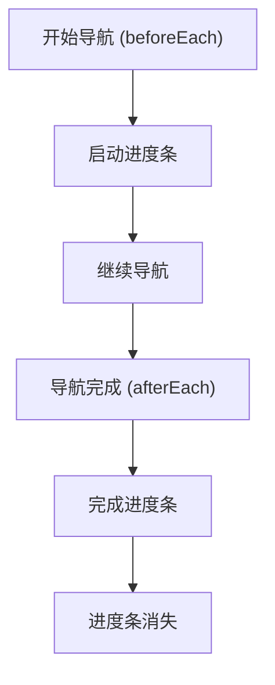
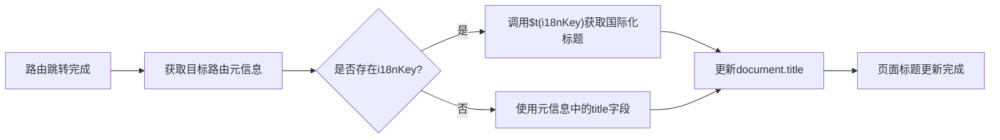
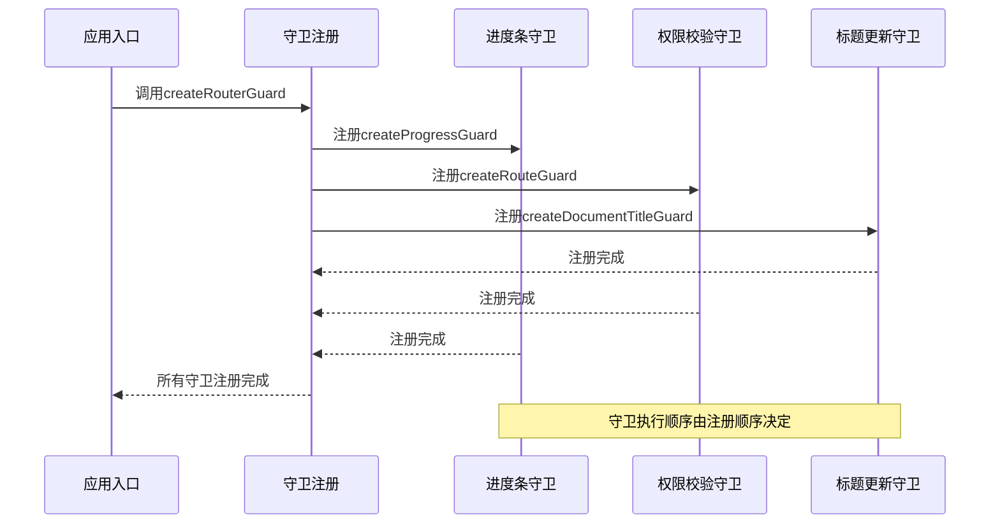

# 路由守卫

<cite>
**本文档引用的文件**   
- [index.ts](file://frontend/src/router/guard/index.ts)
- [route.ts](file://frontend/src/router/guard/route.ts)
- [progress.ts](file://frontend/src/router/guard/progress.ts)
- [title.ts](file://frontend/src/router/guard/title.ts)
- [nprogress.ts](file://frontend/src/plugins/nprogress.ts)
- [auth/index.ts](file://frontend/src/store/modules/auth/index.ts)
- [route/index.ts](file://frontend/src/store/modules/route/index.ts)
- [storage.ts](file://frontend/src/utils/storage.ts)
- [auth.ts](file://frontend/src/service/api/auth.ts)
- [route.ts](file://frontend/src/service/api/route.ts)
- [index.ts](file://frontend/src/router/routes/index.ts)
</cite>

## 目录
1. [路由守卫](#路由守卫)
2. [权限校验守卫](#权限校验守卫)
3. [进度条守卫](#进度条守卫)
4. [页面标题更新守卫](#页面标题更新守卫)
5. [守卫注册与执行流程](#守卫注册与执行流程)
6. [异步处理与错误捕获](#异步处理与错误捕获)
7. [常见陷阱与解决方案](#常见陷阱与解决方案)

## 权限校验守卫

深入分析 `route.ts` 文件中实现的权限校验守卫机制。该守卫通过 `createRouteGuard` 函数创建，利用 Vue Router 的 `beforeEach` 导航守卫拦截所有路由跳转请求。


**图示来源**
- [route.ts](file://frontend/src/router/guard/route.ts#L15-L192)
- [auth/index.ts](file://frontend/src/store/modules/auth/index.ts#L13-L194)
- [route/index.ts](file://frontend/src/store/modules/route/index.ts#L25-L347)

**本节来源**
- [route.ts](file://frontend/src/router/guard/route.ts#L15-L192)

### 权限校验逻辑

权限校验守卫的核心逻辑在 `initRoute` 和 `createRouteGuard` 两个函数中实现。守卫首先检查路由是否已初始化，若未初始化则先初始化常量路由或权限路由，然后根据用户登录状态和角色进行权限判断。

```typescript
// 权限判断核心逻辑
const isLogin = Boolean(localStg.get('token'));
const needLogin = !to.meta.constant;
const routeRoles = to.meta.roles || [];
const hasRole = routeRoles.includes(authStore.userInfo.role);
const hasAuth = authStore.isStaticSuper || !routeRoles.length || hasRole;
```

当用户尝试访问需要登录的页面但未登录时，守卫会将用户重定向到登录页面，并在查询参数中携带原请求路径，以便登录后自动跳转。当用户已登录但无权访问特定页面时，则重定向到403无权限页面。

### 路由初始化机制

守卫通过 `useRouteStore` 状态库管理路由的初始化状态。系统区分常量路由（所有用户均可访问的基础路由）和权限路由（根据用户角色动态加载的路由）。初始化过程如下：

1. 检查常量路由是否已初始化，若未初始化则调用 `initConstantRoute`
2. 根据环境变量 `VITE_AUTH_ROUTE_MODE` 决定使用静态路由模式还是动态路由模式
3. 在动态模式下，向后端请求用户专属的路由配置
4. 将常量路由和权限路由合并后添加到 Vue Router 实例中

## 进度条守卫

分析 `progress.ts` 文件中集成 NProgress 的进度条守卫实现。该守卫通过简单的 API 调用为页面跳转提供流畅的用户体验反馈。



**图示来源**
- [progress.ts](file://frontend/src/router/guard/progress.ts#L3-L10)
- [nprogress.ts](file://frontend/src/plugins/nprogress.ts#L0-L8)

**本节来源**
- [progress.ts](file://frontend/src/router/guard/progress.ts#L3-L10)

### NProgress 集成

进度条功能通过 NProgress 库实现，该库在项目中的集成分为三个步骤：

1. **插件安装**：在 `plugins/nprogress.ts` 中配置 NProgress
2. **样式引入**：在 `styles/css/nprogress.css` 中定义进度条样式
3. **守卫绑定**：在 `guard/progress.ts` 中将进度条控制绑定到路由导航钩子

```typescript
// NProgress 配置
NProgress.configure({ easing: 'ease', speed: 500 });
window.NProgress = NProgress; // 挂载到全局对象
```

进度条守卫在 `beforeEach` 钩子中启动进度条，在 `afterEach` 钩子中完成进度条。这种简单的实现方式确保了在任何路由跳转时都能提供一致的加载反馈，提升了应用的响应感知质量。

## 页面标题更新守卫

分析 `title.ts` 文件中实现的页面标题自动更新机制。该守卫通过 VueUse 库的 `useTitle` 函数实现路由变化与文档标题的自动同步。



**图示来源**
- [title.ts](file://frontend/src/router/guard/title.ts#L7-L13)

**本节来源**
- [title.ts](file://frontend/src/router/guard/title.ts#L7-L13)

### 标题同步机制

页面标题更新守卫利用 Vue Router 的 `afterEach` 钩子，在每次路由跳转完成后执行标题更新操作。实现代码简洁而高效：

```typescript
router.afterEach(to => {
  const { i18nKey, title } = to.meta;
  const documentTitle = i18nKey ? $t(i18nKey) : title;
  useTitle(documentTitle);
});
```

该机制支持两种标题定义方式：国际化键名（`i18nKey`）和静态标题（`title`）。当路由元信息中包含 `i18nKey` 时，使用 `$t` 函数获取对应的语言文本；否则直接使用 `title` 字段值。这种设计既支持多语言环境，又保持了配置的灵活性。

## 守卫注册与执行流程

分析 `index.ts` 文件中多个守卫的注册顺序与执行流程。主入口文件通过 `createRouterGuard` 函数统一注册所有路由守卫，确保它们按特定顺序执行。



**图示来源**
- [index.ts](file://frontend/src/router/guard/index.ts#L9-L15)
- [progress.ts](file://frontend/src/router/guard/progress.ts#L3-L10)
- [route.ts](file://frontend/src/router/guard/route.ts#L15-L192)
- [title.ts](file://frontend/src/router/guard/title.ts#L7-L13)

**本节来源**
- [index.ts](file://frontend/src/router/guard/index.ts#L9-L15)

### 执行顺序分析

守卫的注册顺序至关重要，直接影响用户体验和功能正确性：

```typescript
export function createRouterGuard(router: Router) {
  createProgressGuard(router);    // 1. 进度条守卫
  createRouteGuard(router);       // 2. 权限校验守卫  
  createDocumentTitleGuard(router); // 3. 标题更新守卫
}
```

执行顺序设计遵循以下原则：
1. **进度条优先**：最先注册，确保在任何处理开始前显示加载状态
2. **权限校验居中**：在进度条之后、标题更新之前进行权限判断
3. **标题更新最后**：在所有导航决策完成后更新页面标题

这种顺序确保了用户在等待时能看到进度反馈，权限检查不会阻塞进度条显示，且页面标题只在最终确定的页面上更新。

## 异步处理与错误捕获

深入分析守卫函数中的异步处理机制和 `next` 控制流管理。Vue Router 的导航守卫支持异步操作，这在权限校验等场景中尤为重要。

### 异步权限校验

权限校验守卫中的 `initRoute` 函数是典型的异步处理示例：

```typescript
async function initRoute(to: RouteLocationNormalized): Promise<RouteLocationRaw | null> {
  const routeStore = useRouteStore();
  
  if (!routeStore.isInitConstantRoute) {
    await routeStore.initConstantRoute(); // 异步初始化
    // 返回重定向位置
    return { path: to.fullPath, replace: true };
  }
  // ... 其他逻辑
}
```

通过 `async/await` 语法，守卫可以等待路由初始化完成后再进行后续判断，避免了因路由未加载而导致的404错误。

### next 控制流管理

`next` 函数是导航守卫的核心控制机制，有多种调用方式：

- `next()`：继续导航到目标页面
- `next(false)`：中断当前导航
- `next(path)`：重定向到指定路径
- `next(error)`：触发错误，中断导航

在项目中，`next` 的使用模式清晰且一致：

```typescript
// 重定向到根页面
next({ name: rootRoute });

// 重定向到登录页并携带跳转参数
next({ name: loginRoute, query: { redirect: to.fullPath } });

// 正常导航
next();
```

### 错误处理策略

虽然当前代码中未显式捕获异步操作的错误，但在实际生产环境中应添加适当的错误处理：

```typescript
router.beforeEach(async (to, from, next) => {
  try {
    const location = await initRoute(to);
    if (location) {
      next(location);
      return;
    }
    // 其他逻辑
    handleRouteSwitch(to, from, next);
  } catch (error) {
    console.error('路由守卫异常:', error);
    next({ name: '500' }); // 导航到错误页面
  }
});
```

## 常见陷阱与解决方案

### 陷阱一：守卫注册顺序错误

**问题**：若标题更新守卫在权限校验守卫之前注册，可能导致用户看到无权限页面的标题后立即跳转到登录页，造成闪烁。

**解决方案**：确保权限校验守卫在标题更新守卫之前注册，如项目中所示。

### 陷阱二：异步初始化导致的404

**问题**：在动态路由模式下，用户首次访问时权限路由尚未加载，可能导致"未找到页面"错误。

**解决方案**：项目通过 `initRoute` 函数中的路由存在性检查解决此问题：

```typescript
const exist = await routeStore.getIsAuthRouteExist(to.path as RoutePath);
if (exist) {
  next({ name: '403' });
}
```

### 陷阱三：内存泄漏风险

**问题**：在 `progress.ts` 中直接使用 `window.NProgress?.start?.()` 可能因全局对象引用导致内存泄漏。

**解决方案**：建议在组件销毁时清理引用，或使用更严格的类型检查。

### 陷阱四：死循环风险

**问题**：在守卫中重定向时未正确使用 `replace: true`，可能导致浏览器历史记录膨胀。

**解决方案**：项目中已正确处理：

```typescript
const location: RouteLocationRaw = {
  path,
  replace: true, // 避免历史记录堆积
  query: to.query,
  hash: to.hash
};
```

### 陷阱五：SSR 兼容性问题

**问题**：直接使用 `window` 对象在服务端渲染时会报错。

**解决方案**：添加环境判断：

```typescript
if (typeof window !== 'undefined') {
  window.NProgress?.start?.();
}
```