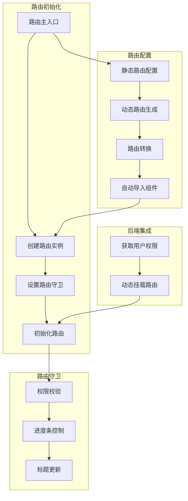
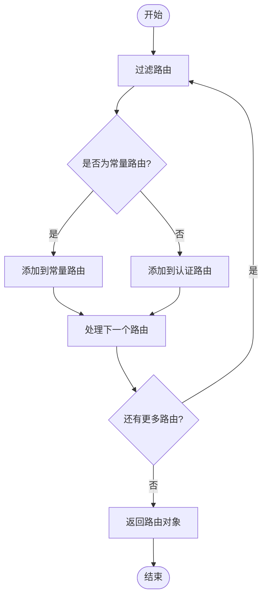
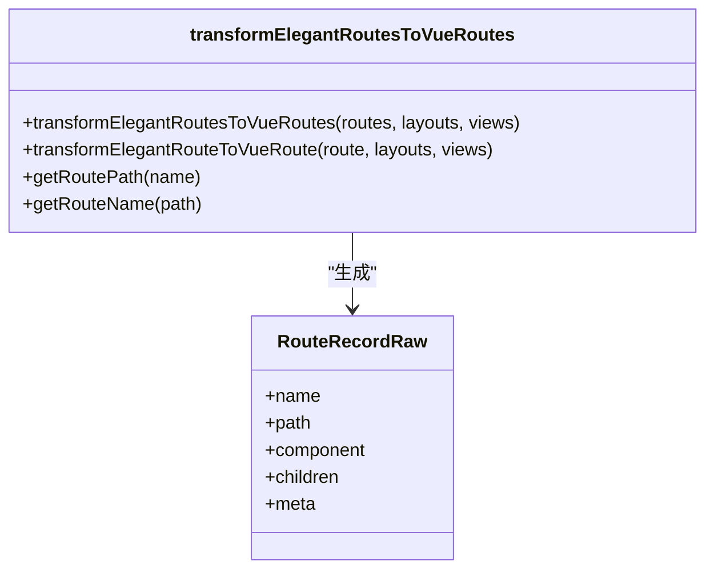
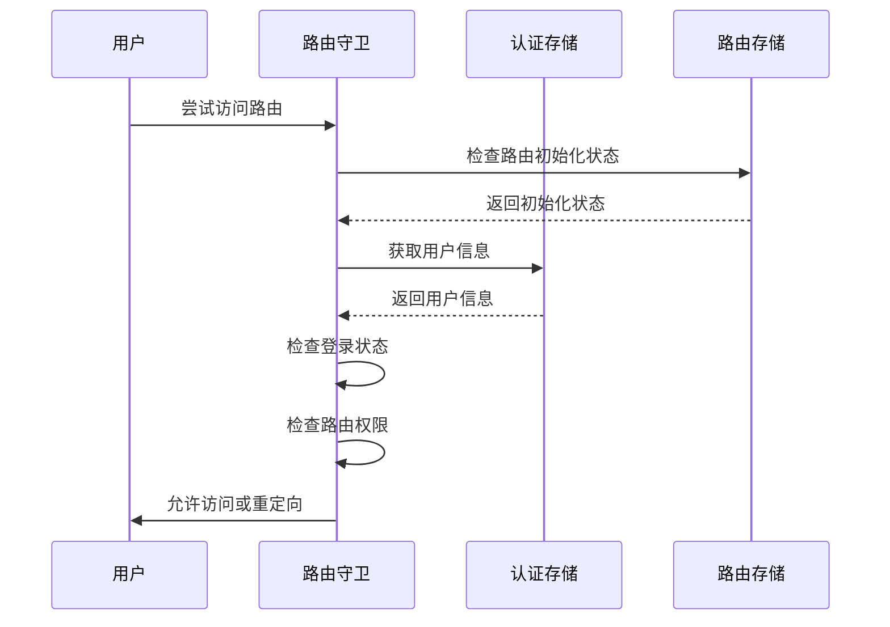
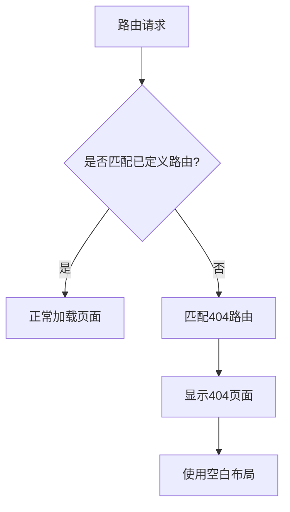
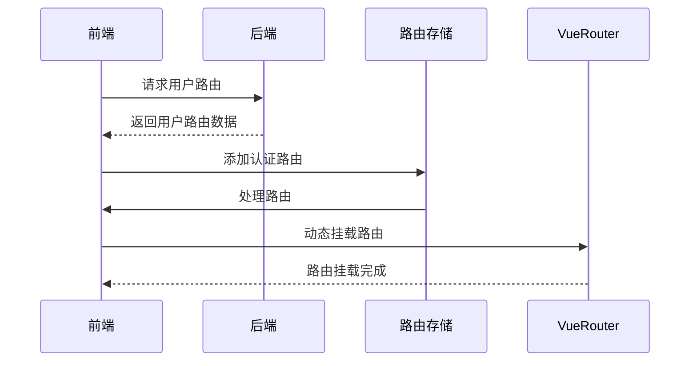

# 路由设计

<cite>
**本文档中引用的文件**   
- [index.ts](file://frontend/src/router/index.ts)
- [builtin.ts](file://frontend/src/router/routes/builtin.ts)
- [routes.ts](file://frontend/src/router/elegant/routes.ts)
- [transform.ts](file://frontend/src/router/elegant/transform.ts)
- [imports.ts](file://frontend/src/router/elegant/imports.ts)
- [route.ts](file://frontend/src/router/guard/route.ts)
- [progress.ts](file://frontend/src/router/guard/progress.ts)
- [title.ts](file://frontend/src/router/guard/title.ts)
- [route.ts](file://frontend/src/service/api/route.ts)
- [index.ts](file://frontend/src/store/modules/route/index.ts)
- [index.ts](file://frontend/src/router/routes/index.ts)
</cite>

## 目录
1. [路由系统概述](#路由系统概述)
2. [静态路由配置](#静态路由配置)
3. [动态路由生成机制](#动态路由生成机制)
4. [路由转换与自动导入](#路由转换与自动导入)
5. [路由守卫体系](#路由守卫体系)
6. [内置路由处理](#内置路由处理)
7. [后端权限路由集成](#后端权限路由集成)
8. [最佳实践示例](#最佳实践示例)

## 路由系统概述

本系统基于Vue Router构建了完整的前端路由解决方案，采用模块化设计，实现了静态路由配置、动态路由生成、权限校验、进度条控制和页面标题更新等核心功能。路由系统通过`elegant-router`工具链实现自动化路由管理，结合Pinia状态管理实现动态路由挂载。

系统主要由以下几个核心模块组成：
- **路由配置**：通过`routes.ts`文件定义所有路由规则
- **路由转换**：通过`transform.ts`将优雅路由转换为Vue Router可识别的格式
- **自动导入**：通过`imports.ts`实现布局和视图组件的自动导入
- **路由守卫**：通过`guard`目录下的文件实现权限、进度和标题控制
- **状态管理**：通过`route`模块实现路由状态的持久化和动态更新



**图示来源**
- [index.ts](file://frontend/src/router/index.ts)
- [routes.ts](file://frontend/src/router/elegant/routes.ts)
- [transform.ts](file://frontend/src/router/elegant/transform.ts)
- [imports.ts](file://frontend/src/router/elegant/imports.ts)

## 静态路由配置

静态路由配置位于`frontend/src/router/elegant/routes.ts`文件中，通过`generatedRoutes`数组定义了系统中所有的路由规则。每个路由对象包含名称、路径、组件和元数据等关键信息。

```typescript
export const generatedRoutes: GeneratedRoute[] = [
  {
    name: 'chat',
    path: '/chat',
    component: 'layout.base$view.chat',
    meta: {
      title: 'chat',
      i18nKey: 'route.chat',
      icon: 'solar:chat-round-call-line-duotone',
      order: 1
    }
  },
  {
    name: 'user',
    path: '/user',
    component: 'layout.base$view.user',
    meta: {
      title: 'user',
      i18nKey: 'route.user',
      icon: 'solar:user-line-duotone',
      roles: ['ADMIN'],
      order: 5
    }
  }
];
```

路由配置的关键特性包括：
- **组件标识**：使用`layout.base$view.chat`格式标识组件，其中`layout`表示布局组件，`view`表示视图组件
- **元数据**：包含标题、国际化键、图标、角色权限和排序等信息
- **常量路由**：通过`constant: true`标记的路由为常量路由，无需登录即可访问
- **隐藏菜单**：通过`hideInMenu: true`标记的路由不会显示在菜单中

**节来源**
- [routes.ts](file://frontend/src/router/elegant/routes.ts)

## 动态路由生成机制

动态路由生成机制通过`frontend/src/router/routes/index.ts`文件中的`createStaticRoutes`函数实现。该函数根据路由的`constant`元数据将路由分为常量路由和认证路由两类。



**图示来源**
- [index.ts](file://frontend/src/router/routes/index.ts)

动态路由生成的核心逻辑如下：

1. **路由分类**：遍历所有路由，根据`meta.constant`字段将路由分为常量路由和认证路由
2. **权限过滤**：对于认证路由，根据用户角色进行权限过滤
3. **路由排序**：根据`meta.order`字段对路由进行排序
4. **Vue路由转换**：调用`getAuthVueRoutes`函数将优雅路由转换为Vue Router可识别的格式

```typescript
export function createStaticRoutes() {
  const constantRoutes: ElegantRoute[] = [];
  const authRoutes: ElegantRoute[] = [];

  [...customRoutes, ...generatedRoutes].forEach(item => {
    if (item.meta?.constant) {
      constantRoutes.push(item);
    } else {
      authRoutes.push(item);
    }
  });

  return {
    constantRoutes,
    authRoutes
  };
}
```

**节来源**
- [index.ts](file://frontend/src/router/routes/index.ts)

## 路由转换与自动导入

### 路由转换设计原理

路由转换功能位于`frontend/src/router/elegant/transform.ts`文件中，通过`transformElegantRoutesToVueRoutes`函数实现。该函数将优雅路由格式转换为Vue Router可识别的`RouteRecordRaw`格式。



**图示来源**
- [transform.ts](file://frontend/src/router/elegant/transform.ts)

转换过程的关键步骤包括：

1. **组件解析**：解析`component`字段，识别布局和视图组件
2. **单层路由处理**：对于单层路由，创建嵌套路由结构
3. **子路由处理**：递归处理子路由
4. **重定向设置**：为有子路由的路由设置默认重定向

```typescript
function transformElegantRouteToVueRoute(
  route: ElegantConstRoute,
  layouts: Record<string, RouteComponent | (() => Promise<RouteComponent>)>,
  views: Record<string, RouteComponent | (() => Promise<RouteComponent>)>
) {
  const vueRoutes: RouteRecordRaw[] = [];

  // 处理单层路由
  if (isSingleLevelRoute(route)) {
    const { layout, view } = getSingleLevelRouteComponent(component);
    const singleLevelRoute: RouteRecordRaw = {
      path,
      component: layouts[layout],
      meta: { title: route.meta?.title || '' },
      children: [
        {
          name,
          path: '',
          component: views[view],
          ...rest
        }
      ]
    };
    return [singleLevelRoute];
  }

  // 处理普通路由
  if (isLayout(component)) {
    vueRoute.component = layouts[getLayoutName(component)];
  }
  if (isView(component)) {
    vueRoute.component = views[getViewName(component)];
  }

  // 处理子路由
  if (children?.length) {
    vueRoute.children = children.flatMap(child => 
      transformElegantRouteToVueRoute(child, layouts, views)
    );
  }

  vueRoutes.unshift(vueRoute);
  return vueRoutes;
}
```

**节来源**
- [transform.ts](file://frontend/src/router/elegant/transform.ts)

### 自动导入设计原理

自动导入功能位于`frontend/src/router/elegant/imports.ts`文件中，通过`layouts`和`views`两个对象实现布局和视图组件的自动导入。

```typescript
export const layouts: Record<RouteLayout, RouteComponent | (() => Promise<RouteComponent>)> = {
  base: BaseLayout,
  blank: BlankLayout,
};

export const views: Record<LastLevelRouteKey, RouteComponent | (() => Promise<RouteComponent>)> = {
  403: () => import("@/views/_builtin/403/index.vue"),
  404: () => import("@/views/_builtin/404/index.vue"),
  chat: () => import("@/views/chat/index.vue"),
  user: () => import("@/views/user/index.vue"),
};
```

自动导入的关键特性包括：
- **布局组件**：同步导入，因为布局组件较少且必须存在
- **视图组件**：异步导入，实现路由懒加载
- **组件映射**：通过键值对建立路由名称与组件的映射关系

**节来源**
- [imports.ts](file://frontend/src/router/elegant/imports.ts)

## 路由守卫体系

### 权限校验守卫

权限校验守卫位于`frontend/src/router/guard/route.ts`文件中，通过`createRouteGuard`函数实现。该守卫在路由跳转前进行权限校验。



**图示来源**
- [route.ts](file://frontend/src/router/guard/route.ts)

权限校验的核心逻辑包括：

1. **初始化检查**：检查常量路由和认证路由是否已初始化
2. **登录状态检查**：检查用户是否已登录
3. **权限检查**：检查用户角色是否具有访问当前路由的权限
4. **特殊路由处理**：处理登录、403等特殊路由的跳转逻辑

```typescript
export function createRouteGuard(router: Router) {
  router.beforeEach(async (to, from, next) => {
    const location = await initRoute(to);
    if (location) {
      next(location);
      return;
    }

    const isLogin = Boolean(localStg.get('token'));
    const needLogin = !to.meta.constant;
    const routeRoles = to.meta.roles || [];
    const hasRole = routeRoles.includes(authStore.userInfo.role);
    const hasAuth = authStore.isStaticSuper || !routeRoles.length || hasRole;

    // 已登录时访问登录页，跳转到首页
    if (to.name === loginRoute && isLogin) {
      next({ name: rootRoute });
      return;
    }

    // 无需登录的路由直接放行
    if (!needLogin) {
      handleRouteSwitch(to, from, next);
      return;
    }

    // 未登录跳转到登录页
    if (!isLogin) {
      next({ name: loginRoute, query: { redirect: to.fullPath } });
      return;
    }

    // 无权限跳转到403页
    if (!hasAuth) {
      next({ name: noAuthorizationRoute });
      return;
    }

    // 正常跳转
    handleRouteSwitch(to, from, next);
  });
}
```

**节来源**
- [route.ts](file://frontend/src/router/guard/route.ts)

### 进度条守卫

进度条守卫位于`frontend/src/router/guard/progress.ts`文件中，通过`createProgressGuard`函数实现。该守卫使用NProgress库在路由跳转时显示进度条。

```typescript
export function createProgressGuard(router: Router) {
  router.beforeEach((_to, _from, next) => {
    window.NProgress?.start?.();
    next();
  });
  router.afterEach(_to => {
    window.NProgress?.done?.();
  });
}
```

进度条守卫的工作流程：
1. **路由跳转前**：调用`NProgress.start()`显示进度条
2. **路由跳转后**：调用`NProgress.done()`隐藏进度条

**节来源**
- [progress.ts](file://frontend/src/router/guard/progress.ts)

### 标题更新守卫

标题更新守卫位于`frontend/src/router/guard/title.ts`文件中，通过`createDocumentTitleGuard`函数实现。该守卫在路由跳转后更新页面标题。

```typescript
export function createDocumentTitleGuard(router: Router) {
  router.afterEach(to => {
    const { i18nKey, title } = to.meta;
    const documentTitle = i18nKey ? $t(i18nKey) : title;
    useTitle(documentTitle);
  });
}
```

标题更新的逻辑：
1. **获取元数据**：从路由元数据中获取`i18nKey`或`title`
2. **国际化处理**：如果有`i18nKey`，使用国际化函数`$t`获取翻译后的标题
3. **更新标题**：使用`useTitle`函数更新页面标题

**节来源**
- [title.ts](file://frontend/src/router/guard/title.ts)

## 内置路由处理

内置路由处理位于`frontend/src/router/routes/builtin.ts`文件中，定义了系统必需的内置路由，如根路由和404路由。

```typescript
export const ROOT_ROUTE: CustomRoute = {
  name: 'root',
  path: '/',
  redirect: getRoutePath(import.meta.env.VITE_ROUTE_HOME) || '/home',
  meta: {
    title: 'root',
    constant: true
  }
};

const NOT_FOUND_ROUTE: CustomRoute = {
  name: 'not-found',
  path: '/:pathMatch(.*)*',
  component: 'layout.blank$view.404',
  meta: {
    title: 'not-found',
    constant: true
  }
};
```

内置路由的关键特性：
- **根路由**：重定向到环境变量`VITE_ROUTE_HOME`指定的首页
- **404路由**：使用通配符路径`/:pathMatch(.*)*`捕获所有未匹配的路由
- **常量路由**：标记为`constant: true`，无需登录即可访问
- **空白布局**：使用`blank`布局，不显示侧边栏和头部



**图示来源**
- [builtin.ts](file://frontend/src/router/routes/builtin.ts)

**节来源**
- [builtin.ts](file://frontend/src/router/routes/builtin.ts)

## 后端权限路由集成

后端权限路由集成通过`frontend/src/service/api/route.ts`文件中的API函数和`frontend/src/store/modules/route/index.ts`文件中的状态管理实现。

### 后端API接口

```typescript
/** 获取常量路由 */
export function fetchGetConstantRoutes() {
  return request<Api.Route.MenuRoute[]>({ url: '/route/getConstantRoutes' });
}

/** 获取用户路由 */
export function fetchGetUserRoutes() {
  return request<Api.Route.UserRoute>({ url: '/route/getUserRoutes' });
}

/** 检查路由是否存在 */
export function fetchIsRouteExist(routeName: string) {
  return request<boolean>({ url: '/route/isRouteExist', params: { routeName } });
}
```

### 动态路由挂载

动态路由挂载在`useRouteStore`中通过`initDynamicAuthRoute`函数实现：

```typescript
/** 初始化动态认证路由 */
async function initDynamicAuthRoute() {
  const { data, error } = await fetchGetUserRoutes();

  if (!error) {
    const { routes, home } = data;

    addAuthRoutes(routes);
    handleConstantAndAuthRoutes();
    setRouteHome(home);
    handleUpdateRootRouteRedirect(home);
    setIsInitAuthRoute(true);
  } else {
    // 获取用户路由失败，重置存储
    authStore.resetStore();
  }
}
```

动态路由挂载的完整流程：
1. **调用API**：调用`fetchGetUserRoutes`获取用户权限路由
2. **添加路由**：将获取的路由添加到`authRoutes`中
3. **处理路由**：调用`handleConstantAndAuthRoutes`处理常量和认证路由
4. **更新首页**：设置用户的首页路由
5. **更新重定向**：更新根路由的重定向目标



**图示来源**
- [route.ts](file://frontend/src/service/api/route.ts)
- [index.ts](file://frontend/src/store/modules/route/index.ts)

**节来源**
- [route.ts](file://frontend/src/service/api/route.ts)
- [index.ts](file://frontend/src/store/modules/route/index.ts)

## 最佳实践示例

### 路由懒加载

路由懒加载通过在`imports.ts`文件中使用`import()`函数实现：

```typescript
export const views: Record<LastLevelRouteKey, RouteComponent | (() => Promise<RouteComponent>)> = {
  chat: () => import("@/views/chat/index.vue"),
  user: () => import("@/views/user/index.vue"),
};
```

**优势**：
- 减少初始加载体积
- 提升首屏加载速度
- 按需加载组件

### 嵌套路由

嵌套路由通过在路由配置中使用`children`字段实现：

```typescript
{
  name: 'user',
  path: '/user',
  component: 'layout.base$view.user',
  children: [
    {
      name: 'user-profile',
      path: 'profile',
      component: 'view.user-profile',
      meta: { title: 'user-profile' }
    }
  ]
}
```

**优势**：
- 实现复杂的页面结构
- 共享布局组件
- 简化URL结构

### 参数传递

参数传递通过在路由路径中使用冒号`:`定义参数：

```typescript
{
  name: 'login',
  path: '/login/:module(pwd-login|code-login|register|reset-pwd|bind-wechat)?',
  component: 'layout.blank$view.login',
  props: true,
  meta: {
    title: 'login',
    constant: true,
    hideInMenu: true
  }
}
```

**使用方式**：
- **路径参数**：通过`$route.params`访问
- **查询参数**：通过`$route.query`访问
- **Props传递**：设置`props: true`将参数作为props传递给组件

```typescript
// 在组件中使用
const route = useRoute();
const module = route.params.module; // 获取路径参数
const redirect = route.query.redirect; // 获取查询参数
```

**节来源**
- [imports.ts](file://frontend/src/router/elegant/imports.ts)
- [routes.ts](file://frontend/src/router/elegant/routes.ts)
- [transform.ts](file://frontend/src/router/elegant/transform.ts)