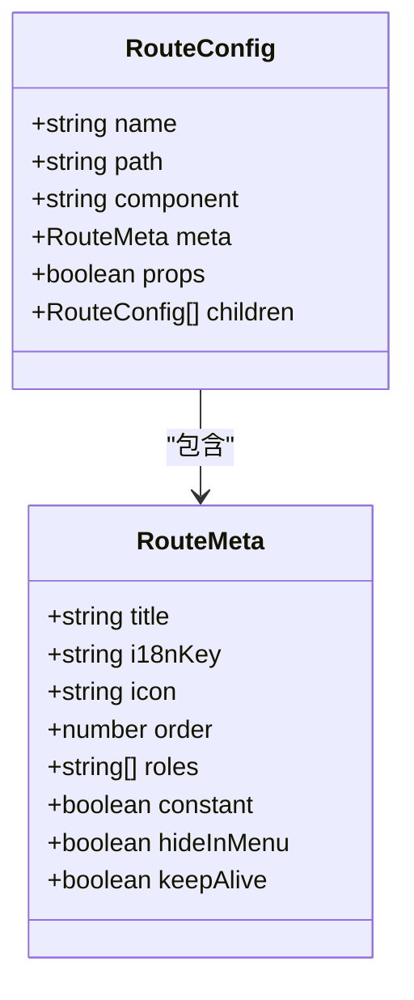
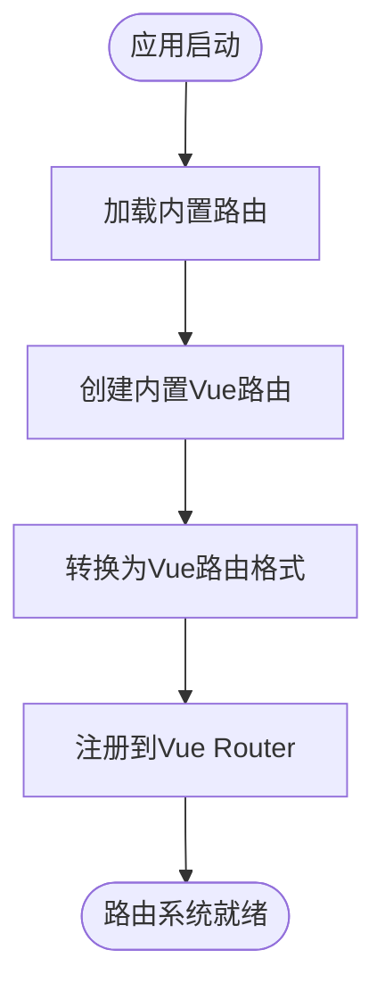
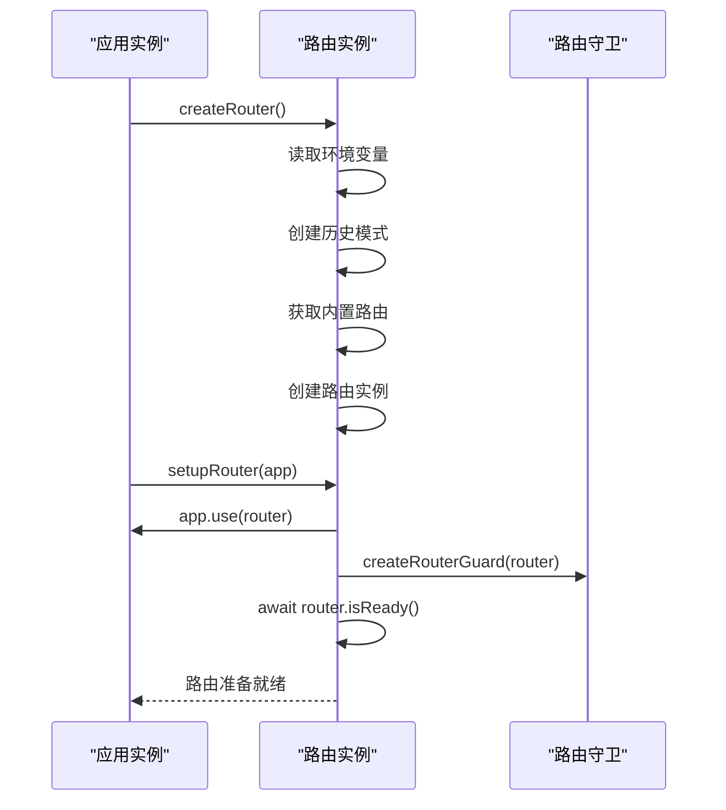
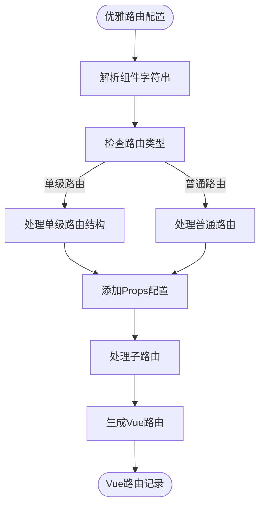
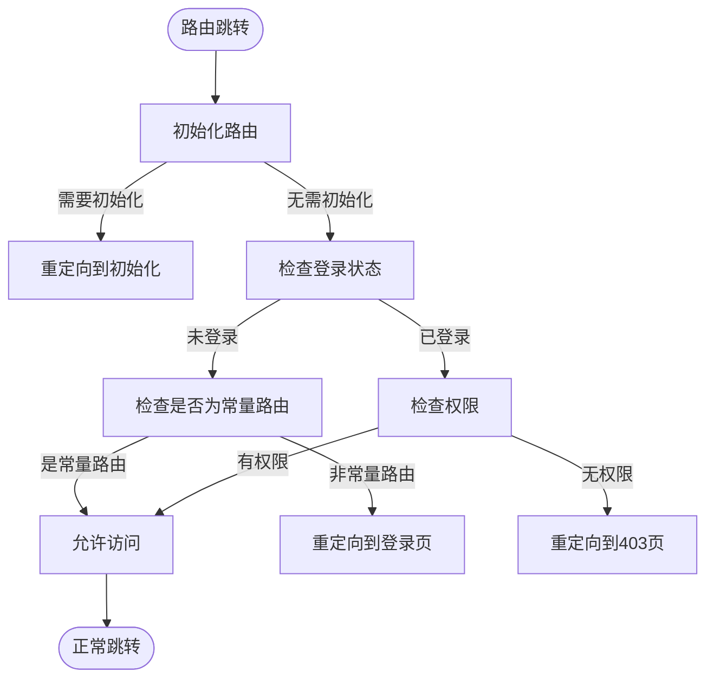
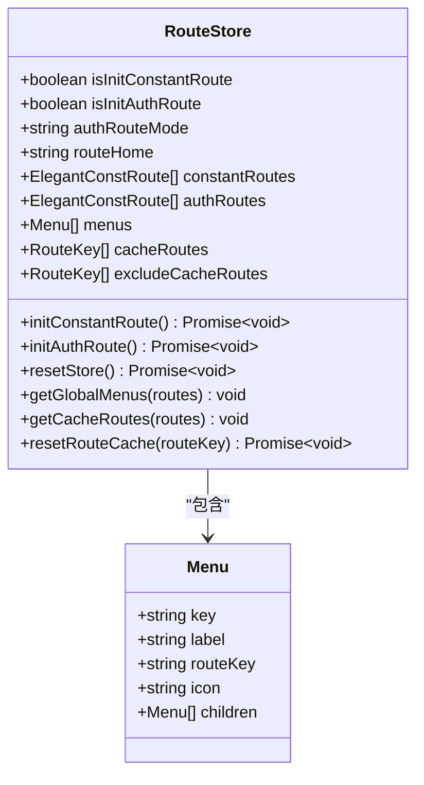
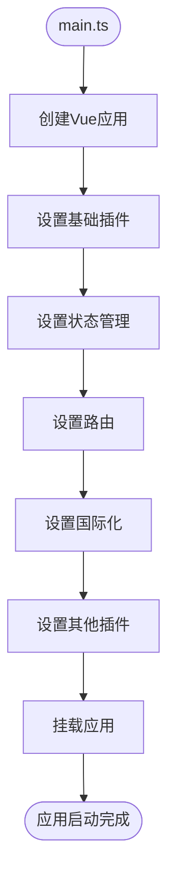

# 路由配置

<cite>
**本文档中引用的文件**   
- [routes.ts](file://frontend/src/router/elegant/routes.ts)
- [builtin.ts](file://frontend/src/router/routes/builtin.ts)
- [index.ts](file://frontend/src/router/index.ts)
- [transform.ts](file://frontend/src/router/elegant/transform.ts)
- [imports.ts](file://frontend/src/router/elegant/imports.ts)
- [main.ts](file://frontend/src/main.ts)
- [guard/index.ts](file://frontend/src/router/guard/index.ts)
- [routes/index.ts](file://frontend/src/router/routes/index.ts)
- [store/modules/route/index.ts](file://frontend/src/store/modules/route/index.ts)
</cite>

## 目录
1. [路由配置](#路由配置)
2. [静态路由结构设计](#静态路由结构设计)
3. [内置异常页面路由](#内置异常页面路由)
4. [路由模块初始化流程](#路由模块初始化流程)
5. [路由转换机制](#路由转换机制)
6. [路由守卫机制](#路由守卫机制)
7. [路由状态管理](#路由状态管理)
8. [最佳实践与配置示例](#最佳实践与配置示例)
9. [路由模块集成](#路由模块集成)

## 静态路由结构设计

前端路由的核心配置机制基于 `elegant-router` 框架实现，其核心配置文件位于 `frontend/src/router/elegant/routes.ts`。该文件定义了应用的静态路由结构，采用声明式配置方式，通过 `generatedRoutes` 数组定义所有路由。

路由结构设计遵循以下原则：
- **命名规范**：路由名称采用小写字母和连字符组合，如 `chat-history`、`knowledge-base`，确保命名清晰且易于理解。
- **层级组织**：通过路由名称中的下划线 `_` 表示层级关系，如 `demo-route_child` 表示子路由。
- **组件映射**：使用特定语法 `layout.layoutName$view.viewName` 明确指定布局组件和视图组件，实现组件的灵活组合。

路由配置包含以下关键属性：
- **name**: 路由唯一标识符
- **path**: 路由路径
- **component**: 组件映射字符串
- **meta**: 路由元信息，包含标题、国际化键、图标、权限等



**图示来源**
- [routes.ts](file://frontend/src/router/elegant/routes.ts#L15-L136)

**本节来源**
- [routes.ts](file://frontend/src/router/elegant/routes.ts#L15-L136)

## 内置异常页面路由

系统预置了403、404、500等内置异常页面路由，配置逻辑位于 `frontend/src/router/routes/builtin.ts` 文件中。这些路由在系统容错中起着关键作用，确保用户在访问不存在或无权限的页面时能够获得友好的错误提示。

内置路由主要包括：
- **ROOT_ROUTE**: 根路由，配置了默认重定向路径
- **NOT_FOUND_ROUTE**: 404路由，捕获所有未匹配的路径

```typescript
export const ROOT_ROUTE: CustomRoute = {
  name: 'root',
  path: '/',
  redirect: getRoutePath(import.meta.env.VITE_ROUTE_HOME) || '/home',
  meta: {
    title: 'root',
    constant: true
  }
};

const NOT_FOUND_ROUTE: CustomRoute = {
  name: 'not-found',
  path: '/:pathMatch(.*)*',
  component: 'layout.blank$view.404',
  meta: {
    title: 'not-found',
    constant: true
  }
};
```

这些内置路由通过 `createBuiltinVueRoutes` 函数转换为 Vue Router 可识别的路由格式，并在应用启动时优先加载，确保路由系统的稳定性和可靠性。



**图示来源**
- [builtin.ts](file://frontend/src/router/routes/builtin.ts#L3-L30)

**本节来源**
- [builtin.ts](file://frontend/src/router/routes/builtin.ts#L3-L30)

## 路由模块初始化流程

路由模块的初始化流程始于 `frontend/src/router/index.ts` 文件，该文件负责创建路由实例并设置路由守卫。初始化过程遵循以下步骤：

1. **环境变量读取**：读取 `VITE_ROUTER_HISTORY_MODE` 和 `VITE_BASE_URL` 环境变量
2. **历史模式创建**：根据环境变量选择合适的路由历史模式（hash、history、memory）
3. **路由实例创建**：使用 `createRouter` 函数创建路由实例
4. **路由守卫设置**：调用 `createRouterGuard` 设置路由守卫

```typescript
export const router = createRouter({
  history: historyCreatorMap[VITE_ROUTER_HISTORY_MODE](VITE_BASE_URL),
  routes: createBuiltinVueRoutes()
});

/** 设置Vue Router */
export async function setupRouter(app: App) {
  app.use(router);
  createRouterGuard(router);
  await router.isReady();
}
```

路由实例的创建过程通过 `createBuiltinVueRoutes` 函数获取内置路由，并将其作为初始路由配置。`setupRouter` 函数负责将路由实例安装到应用中，并设置路由守卫，最后等待路由准备就绪。



**图示来源**
- [index.ts](file://frontend/src/router/index.ts#L15-L30)

**本节来源**
- [index.ts](file://frontend/src/router/index.ts#L15-L30)

## 路由转换机制

路由转换机制是连接优雅路由配置与Vue Router的核心桥梁，实现在 `frontend/src/router/elegant/transform.ts` 文件中。该机制负责将声明式的优雅路由配置转换为Vue Router可识别的路由记录。

核心转换函数包括：
- **transformElegantRoutesToVueRoutes**: 批量转换优雅路由到Vue路由
- **transformElegantRouteToVueRoute**: 单个路由转换
- **getRoutePath**: 根据路由名称获取路径
- **getRouteName**: 根据路径获取路由名称

转换过程的关键逻辑：
1. **组件解析**：解析 `layout.` 和 `view.` 前缀，映射到实际组件
2. **单级路由处理**：特殊处理单级路由，创建嵌套路由结构
3. **动态参数处理**：自动为包含参数的路径添加 `props: true`
4. **重定向处理**：为有子路由的父路由自动添加重定向

```typescript
function transformElegantRouteToVueRoute(
  route: ElegantConstRoute,
  layouts: Record<string, RouteComponent>,
  views: Record<string, RouteComponent>
) {
  // 自动为包含参数的路径添加props
  if (route.path.includes(':') && !route.props) {
    route.props = true;
  }

  // 处理单级路由
  if (isSingleLevelRoute(route)) {
    const { layout, view } = getSingleLevelRouteComponent(component);
    return [{
      path,
      component: layouts[layout],
      children: [{
        name,
        path: '',
        component: views[view],
        ...rest
      }]
    }];
  }
  
  // 处理普通路由
  if (isLayout(component)) {
    vueRoute.component = layouts[layoutName];
  }
  
  return [vueRoute];
}
```



**图示来源**
- [transform.ts](file://frontend/src/router/elegant/transform.ts#L15-L197)

**本节来源**
- [transform.ts](file://frontend/src/router/elegant/transform.ts#L15-L197)

## 路由守卫机制

路由守卫机制是保障应用安全和用户体验的关键组件，实现在 `frontend/src/router/guard/` 目录下。守卫机制通过 `createRouterGuard` 函数统一设置，包含进度守卫、路由守卫和文档标题守卫。

核心路由守卫逻辑位于 `frontend/src/router/guard/route.ts`，主要功能包括：
- **路由初始化**：在路由跳转前初始化常量路由和认证路由
- **权限验证**：检查用户登录状态和角色权限
- **路由跳转控制**：根据验证结果决定跳转目标

```typescript
export function createRouteGuard(router: Router) {
  router.beforeEach(async (to, from, next) => {
    const location = await initRoute(to);
    if (location) {
      next(location);
      return;
    }

    const isLogin = Boolean(localStg.get('token'));
    const needLogin = !to.meta.constant;
    const hasAuth = authStore.isStaticSuper || !routeRoles.length || hasRole;

    if (to.name === loginRoute && isLogin) {
      next({ name: rootRoute });
      return;
    }

    if (!needLogin) {
      handleRouteSwitch(to, from, next);
      return;
    }

    if (!isLogin) {
      next({ name: loginRoute, query: { redirect: to.fullPath } });
      return;
    }

    if (!hasAuth) {
      next({ name: noAuthorizationRoute });
      return;
    }

    handleRouteSwitch(to, from, next);
  });
}
```



**图示来源**
- [guard/route.ts](file://frontend/src/router/guard/route.ts#L15-L192)

**本节来源**
- [guard/index.ts](file://frontend/src/router/guard/index.ts#L1-L15)
- [guard/route.ts](file://frontend/src/router/guard/route.ts#L15-L192)

## 路由状态管理

路由状态管理通过Pinia store实现，核心逻辑位于 `frontend/src/store/modules/route/index.ts`。该模块负责管理路由相关的状态，包括常量路由、认证路由、菜单、缓存路由等。

主要状态和功能：
- **常量路由管理**：通过 `initConstantRoute` 方法初始化常量路由
- **认证路由管理**：通过 `initAuthRoute` 方法初始化认证路由
- **菜单管理**：根据认证路由生成全局菜单
- **缓存管理**：管理需要缓存的路由

```typescript
export const useRouteStore = defineStore(SetupStoreId.Route, () => {
  const { bool: isInitConstantRoute, setBool: setIsInitConstantRoute } = useBoolean();
  const { bool: isInitAuthRoute, setBool: setIsInitAuthRoute } = useBoolean();

  const constantRoutes = shallowRef<ElegantConstRoute[]>([]);
  const authRoutes = shallowRef<ElegantConstRoute[]>([]);
  const menus = ref<App.Global.Menu[]>([]);
  const cacheRoutes = ref<RouteKey[]>([]);

  async function initConstantRoute() {
    if (isInitConstantRoute.value) return;

    const staticRoute = createStaticRoutes();

    if (authRouteMode.value === 'static') {
      addConstantRoutes(staticRoute.constantRoutes);
    } else {
      const { data, error } = await fetchGetConstantRoutes();
      if (!error) {
        addConstantRoutes(data);
      } else {
        addConstantRoutes(staticRoute.constantRoutes);
      }
    }

    handleConstantAndAuthRoutes();
    setIsInitConstantRoute(true);
    tabStore.initHomeTab();
  }
});
```



**图示来源**
- [store/modules/route/index.ts](file://frontend/src/store/modules/route/index.ts#L1-L199)

**本节来源**
- [store/modules/route/index.ts](file://frontend/src/store/modules/route/index.ts#L1-L199)

## 最佳实践与配置示例

### 路由命名规范
路由命名应遵循以下最佳实践：
- 使用小写字母和连字符分隔单词
- 层级路由使用下划线连接，如 `user_profile`
- 避免使用特殊字符和空格

### 嵌套路由结构
嵌套路由通过 `children` 属性定义，父路由通常作为布局容器：

```typescript
{
  name: 'user',
  path: '/user',
  component: 'layout.base',
  meta: {
    title: 'user',
    icon: 'solar:user-line-duotone'
  },
  children: [
    {
      name: 'user_profile',
      path: 'profile',
      component: 'view.user-profile',
      meta: {
        title: 'user-profile',
        i18nKey: 'route.user-profile'
      }
    },
    {
      name: 'user_settings',
      path: 'settings',
      component: 'view.user-settings',
      meta: {
        title: 'user-settings',
        i18nKey: 'route.user-settings'
      }
    }
  ]
}
```

### 路径别名
路径别名通过 `alias` 属性配置，允许一个路由响应多个URL：

```typescript
{
  name: 'home',
  path: '/home',
  alias: ['/index', '/'],
  component: 'view.home',
  meta: {
    title: 'home',
    i18nKey: 'route.home'
  }
}
```

### 动态路径参数
动态路径通过冒号 `:` 定义参数，系统会自动设置 `props: true`：

```typescript
{
  name: 'user-detail',
  path: '/user/:id',
  component: 'view.user-detail',
  meta: {
    title: 'user-detail',
    i18nKey: 'route.user-detail'
  }
  // 系统自动添加 props: true
}
```

### 可复用的路由组件
通过组件导入机制实现路由组件的复用：

```typescript
// imports.ts
export const views: Record<LastLevelRouteKey, RouteComponent> = {
  user: () => import("@/views/user/index.vue"),
  'user-detail': () => import("@/views/user/detail.vue"),
  'user-settings': () => import("@/views/user/settings.vue"),
};
```

**本节来源**
- [routes.ts](file://frontend/src/router/elegant/routes.ts#L15-L136)
- [imports.ts](file://frontend/src/router/elegant/imports.ts#L1-L29)
- [transform.ts](file://frontend/src/router/elegant/transform.ts#L15-L197)

## 路由模块集成

路由模块通过 `frontend/src/main.ts` 文件集成到应用主入口，这是整个路由系统的起点。集成过程遵循以下流程：

1. **应用创建**：创建Vue应用实例
2. **插件设置**：依次设置各种插件（存储、路由、国际化等）
3. **应用挂载**：将应用挂载到DOM元素

```typescript
async function setupApp() {
  setupLoading();
  setupNProgress();
  setupIconifyOffline();
  setupDayjs();

  const app = createApp(App);

  setupStore(app);
  await setupRouter(app);
  setupI18n(app);
  setupAppVersionNotification();

  app.use(markdownPlugin);
  app.mount('#app');
}

setupApp();
```

路由模块的统一导出通过 `frontend/src/router/index.ts` 实现，该文件导出 `router` 实例和 `setupRouter` 函数，为应用提供标准化的路由接口。



**图示来源**
- [main.ts](file://frontend/src/main.ts#L1-L33)
- [index.ts](file://frontend/src/router/index.ts#L15-L30)

**本节来源**
- [main.ts](file://frontend/src/main.ts#L1-L33)
- [index.ts](file://frontend/src/router/index.ts#L15-L30)