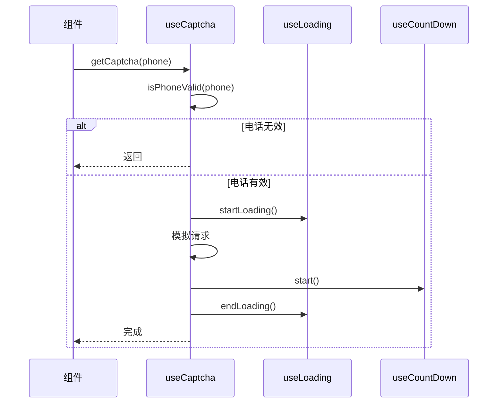
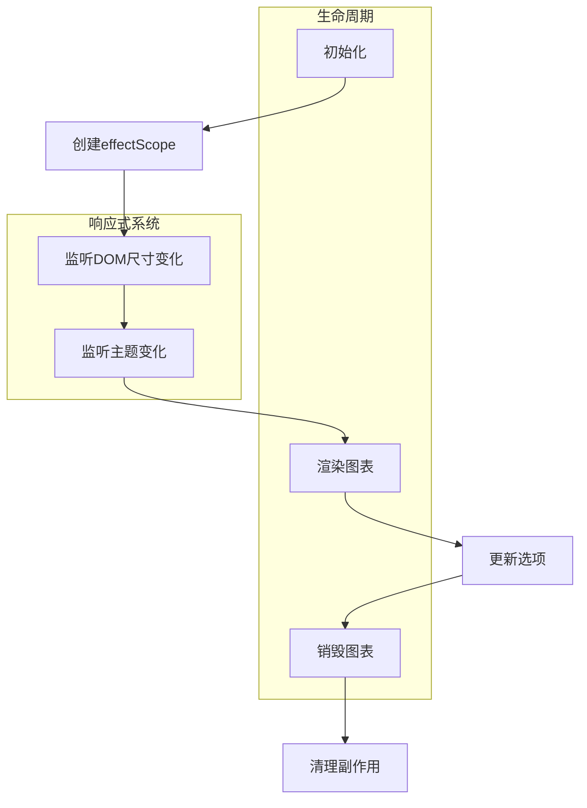

# Hooks系统

<cite>
**本文档引用的文件**   
- [auth.ts](file://frontend/src/hooks/business/auth.ts#L1-L22)
- [captcha.ts](file://frontend/src/hooks/business/captcha.ts#L1-L72)
- [echarts.ts](file://frontend/src/hooks/common/echarts.ts#L1-L240)
- [form.ts](file://frontend/src/hooks/common/form.ts#L1-L98)
- [router.ts](file://frontend/src/hooks/common/router.ts#L1-L116)
- [table.ts](file://frontend/src/hooks/common/table.ts#L1-L280)
- [use-boolean.ts](file://frontend/packages/hooks/src/use-boolean.ts#L1-L32)
- [use-loading.ts](file://frontend/packages/hooks/src/use-loading.ts#L1-L17)
- [use-request.ts](file://frontend/packages/hooks/src/use-request.ts#L1-L80)
- [use-table.ts](file://frontend/packages/hooks/src/use-table.ts#L1-L155)
- [index.ts](file://frontend/src/store/modules/auth/index.ts#L1-L196)
- [shared.ts](file://frontend/src/store/modules/auth/shared.ts#L1-L13)
- [auth.ts](file://frontend/src/service/api/auth.ts#L1-L59)
</cite>

## 目录
1. [Hooks系统概述](#hookssystem-overview)
2. [基础Hooks设计与实现](#base-hooks-design-and-implementation)
3. [业务Hooks封装与Store协同](#business-hooks-encapsulation-and-store-cooperation)
4. [UI集成Hooks生命周期管理](#ui-integration-hooks-lifecycle-management)
5. [自定义Hooks开发规范](#custom-hooks-development-guidelines)

## Hooks系统概述

Hooks系统是前端架构中的核心抽象层，旨在通过函数式编程范式实现状态逻辑的复用与解耦。本系统采用分层设计理念，将Hooks划分为三个层级：基础通用Hooks（common）、业务领域Hooks（business）和UI集成Hooks（UI integration），形成清晰的职责边界。

基础通用Hooks提供原子化的状态管理能力，如`use-boolean`、`use-loading`等，作为构建更复杂逻辑的基石。业务领域Hooks封装特定业务场景的逻辑，如认证授权、验证码处理等，并与全局状态管理store协同工作。UI集成Hooks则专注于与特定UI组件库（如Naive UI）的深度集成，提供表格、图表等复杂组件的声明式操作接口。

这种分层架构实现了关注点分离，既保证了基础功能的可复用性，又确保了业务逻辑的内聚性，同时提升了UI组件的开发效率。

## 基础Hooks设计与实现

基础通用Hooks的设计遵循单一职责原则和组合优于继承的设计理念，通过构建可复用的原子化状态管理单元，为上层提供灵活的构建能力。

### use-boolean状态管理Hook

`use-boolean`是状态管理的基础单元，提供对布尔值状态的完整控制接口。其设计体现了函数式编程的简洁性与封装性。

```mermaid
classDiagram
class useBoolean {
+bool : Ref<boolean>
+setBool(value : boolean) : void
+setTrue() : void
+setFalse() : void
+toggle() : void
}
note right of useBoolean
原子化布尔状态管理Hook
提供setTrue、setFalse、toggle等便捷方法
end note
```

**图示来源**
- [use-boolean.ts](file://frontend/packages/hooks/src/use-boolean.ts#L1-L32)

**本节来源**
- [use-boolean.ts](file://frontend/packages/hooks/src/use-boolean.ts#L1-L32)

该Hook的核心实现是通过`ref`创建一个响应式布尔值，并暴露`setBool`、`setTrue`、`setFalse`和`toggle`四个操作方法。参数`initValue`允许在初始化时指定默认状态，增强了灵活性。这种设计模式使得任何需要布尔状态管理的场景都可以通过简单的函数调用获得完整的能力集。

### use-loading加载状态Hook

`use-loading`基于`use-boolean`构建，体现了Hooks的组合设计模式，专门用于管理异步操作的加载状态。

```mermaid
classDiagram
class useLoading {
+loading : Ref<boolean>
+startLoading() : void
+endLoading() : void
}
useLoading --> useBoolean : "组合"
note right of useLoading
基于use-boolean构建的加载状态管理
提供startLoading和endLoading语义化方法
end note
```

**图示来源**
- [use-loading.ts](file://frontend/packages/hooks/src/use-loading.ts#L1-L17)
- [use-boolean.ts](file://frontend/packages/hooks/src/use-boolean.ts#L1-L32)

**本节来源**
- [use-loading.ts](file://frontend/packages/hooks/src/use-loading.ts#L1-L17)

该Hook通过解构`use-boolean`的返回值，将`setTrue`重命名为`startLoading`，将`setFalse`重命名为`endLoading`，从而提供了更具语义化的API。这种设计不仅减少了代码重复，还通过语义化命名提升了代码的可读性，开发者可以直观地理解`startLoading`表示开始加载，`endLoading`表示结束加载。

### use-request请求处理Hook

`use-request`是网络请求处理的核心Hook，封装了请求发起、状态管理和错误处理的完整流程，提供了声明式的API调用方式。

```mermaid
classDiagram
class createHookRequest {
+createHookRequest(axiosConfig, options) : HookRequestInstance
}
class HookRequestInstance {
+loading : Ref<boolean>
+data : Ref<T>
+error : Ref<AxiosError>
+cancelRequest(requestId) : void
+cancelAllRequest() : void
}
createHookRequest --> useLoading : "使用"
createHookRequest --> createFlatRequest : "依赖"
note right of createHookRequest
创建具有加载状态的请求实例
返回包含loading、data、error的响应对象
end note
```

**图示来源**
- [use-request.ts](file://frontend/packages/hooks/src/use-request.ts#L1-L80)
- [use-loading.ts](file://frontend/packages/hooks/src/use-loading.ts#L1-L17)

**本节来源**
- [use-request.ts](file://frontend/packages/hooks/src/use-request.ts#L1-L80)

该Hook通过`createHookRequest`工厂函数创建一个请求实例，该实例在调用时会自动管理加载状态。其返回值是一个包含`loading`、`data`和`error`三个响应式属性的对象，实现了"请求即状态"的设计理念。内部通过`useLoading`管理加载状态，在请求开始时调用`startLoading`，在响应处理完成后调用`endLoading`。这种设计将异步请求的复杂性封装在Hook内部，使组件层只需关注数据状态的变化。

## 业务Hooks封装与Store协同

业务领域Hooks封装了特定业务场景的复杂逻辑，通过与全局状态管理store的深度集成，实现了业务状态的集中管理与逻辑复用。

### auth认证授权Hook

`use-auth`是认证授权领域的核心Hook，封装了权限校验的业务逻辑，并与`authStore`紧密协同工作。

```mermaid
classDiagram
class useAuth {
+hasAuth(codes : string | string[]) : boolean
}
useAuth --> useAuthStore : "依赖"
useAuthStore --> authStore : "提供"
class authStore {
+isLogin : ComputedRef<boolean>
+userInfo : Reactive<Api.Auth.UserInfo>
+token : Ref<string>
}
note right of useAuth
封装权限校验逻辑
依赖authStore获取用户认证状态
end note
```

**图示来源**
- [auth.ts](file://frontend/src/hooks/business/auth.ts#L1-L22)
- [index.ts](file://frontend/src/store/modules/auth/index.ts#L1-L196)

**本节来源**
- [auth.ts](file://frontend/src/hooks/business/auth.ts#L1-L22)
- [index.ts](file://frontend/src/store/modules/auth/index.ts#L1-L196)

该Hook通过`useAuthStore()`获取全局认证状态，其核心方法`hasAuth`用于校验当前用户是否具有指定权限。当`authStore.isLogin`为`false`时，直接返回`false`；当传入单个权限码时，比较用户角色是否匹配；当传入权限码数组时，检查用户角色是否在数组中。这种设计将权限校验的复杂逻辑封装在Hook内部，组件层只需调用`hasAuth`方法即可完成权限判断。

`authStore`作为状态管理中心，管理着`token`、`userInfo`、`isLogin`等核心认证状态。`isLogin`是一个计算属性，基于`token`的存在性动态计算用户登录状态。`login`方法封装了完整的登录流程：调用`fetchLogin`API、存储token、获取用户信息、处理跳转逻辑等。这种分层设计使得认证逻辑高度内聚，同时通过Pinia store实现了状态的全局可访问性。

### captcha验证码Hook

`use-captcha`封装了验证码获取的完整业务流程，整合了加载状态、倒计时和表单验证等多重逻辑。



**图示来源**
- [captcha.ts](file://frontend/src/hooks/business/captcha.ts#L1-L72)
- [use-loading.ts](file://frontend/packages/hooks/src/use-loading.ts#L1-L17)
- [use-count-down.ts](file://frontend/packages/hooks/src/use-count-down.ts#L1-L30)

**本节来源**
- [captcha.ts](file://frontend/src/hooks/business/captcha.ts#L1-L72)

该Hook通过组合`useLoading`和`useCountDown`两个基础Hook，构建了完整的验证码业务逻辑。`loading`状态用于在请求期间显示加载指示器，`count`和`isCounting`用于管理倒计时。`getCaptcha`方法首先调用`isPhoneValid`进行表单验证，验证通过后启动加载状态，模拟API请求，发送成功后启动倒计时。`label`计算属性根据当前状态动态返回按钮文本，实现了"获取验证码"、"重新获取(10s)"等状态的自动切换。这种设计将验证码业务的复杂状态机封装在Hook内部，组件层只需绑定`label`和调用`getCaptcha`即可。

## UI集成Hooks生命周期管理

UI集成Hooks专注于与特定UI组件库的深度集成，通过精细化的生命周期管理，实现了复杂UI组件的声明式操作。

### use-echarts图表集成Hook

`use-echarts`是ECharts图表库的集成Hook，通过`effectScope`和`onScopeDispose`实现了完整的生命周期管理与性能优化。



**图示来源**
- [echarts.ts](file://frontend/src/hooks/common/echarts.ts#L1-L240)

**本节来源**
- [echarts.ts](file://frontend/src/hooks/common/echarts.ts#L1-L240)

该Hook的核心设计是使用`effectScope`创建一个副作用作用域，将所有响应式副作用（如watch监听）组织在一起。通过`useElementSize`监听宿主DOM元素的尺寸变化，实现图表的自动响应式重绘。`watch([width, height], ...)`监听尺寸变化并调用`renderChartBySize`方法，确保图表在容器大小改变时能正确重绘。

性能优化方面，Hook通过`canRender`和`isRendered`方法避免了无效的渲染操作。`changeTheme`方法实现了主题切换时的平滑过渡：先销毁当前图表实例，再以新主题重新创建。`onScopeDispose`钩子确保在组件卸载时调用`destroy`方法，清理ECharts实例并停止副作用作用域，防止内存泄漏。

### use-table表格集成Hook

`use-table`是Naive UI表格组件的集成Hook，通过分层设计实现了数据获取、列配置和分页管理的完整解决方案。

```mermaid
classDiagram
class useTable {
+loading : Ref<boolean>
+empty : Ref<boolean>
+data : Ref<TableData[]>
+columns : ComputedRef<TableColumn[]>
+pagination : Reactive<PaginationProps>
+getData() : Promise<void>
+getDataByPage(pageNum) : Promise<void>
}
useTable --> useHookTable : "依赖"
useHookTable --> useLoading : "使用"
useHookTable --> useBoolean : "使用"
class useHookTable {
+loading : Ref<boolean>
+empty : Ref<boolean>
+data : Ref<T[]>
+columns : ComputedRef<C[]>
+getData() : Promise<void>
+updateSearchParams(params) : void
+resetSearchParams() : void
}
note right of useTable
高层表格Hook，提供完整表格功能
end note
note left of useHookTable
低层表格Hook，提供数据获取核心能力
end note
```

**图示来源**
- [table.ts](file://frontend/src/hooks/common/table.ts#L1-L280)
- [use-table.ts](file://frontend/packages/hooks/src/use-table.ts#L1-L155)

**本节来源**
- [table.ts](file://frontend/src/hooks/common/table.ts#L1-L280)
- [use-table.ts](file://frontend/packages/hooks/src/use-table.ts#L1-L155)

该系统采用分层架构，`use-hook-table`作为底层Hook，专注于数据获取的核心逻辑：封装API调用、数据转换、列配置管理等。`use-table`作为高层Hook，在`use-hook-table`的基础上增加了分页管理、移动端适配等UI相关功能。

`use-hook-table`通过`transformer`函数将API响应转换为表格所需的数据结构，通过`getColumnChecks`和`getColumns`实现列的显隐控制。`use-table`则在此基础上构建了`pagination`响应式对象，封装了分页参数的更新逻辑，并通过`mobilePagination`计算属性实现移动端的分页适配。这种分层设计既保证了数据获取逻辑的可复用性，又允许根据不同UI需求进行灵活扩展。

## 自定义Hooks开发规范

基于项目实践，总结出自定义Hooks的开发规范，涵盖副作用处理、类型定义、错误边界等最佳实践。

### 副作用处理规范

所有产生副作用的Hooks必须使用`effectScope`进行组织，并在`onScopeDispose`中进行清理。对于需要监听响应式数据的场景，应在`scope.run()`中使用`watch`，确保副作用与组件生命周期同步。

```typescript
function useCustomHook() {
  const scope = effectScope();
  
  scope.run(() => {
    watch(source, callback);
  });
  
  onScopeDispose(() => {
    scope.stop();
  });
}
```

### 类型定义规范

Hooks应提供完整的TypeScript类型定义，使用泛型提高灵活性。对于返回值对象，应明确定义接口或类型别名，避免使用`any`或过于宽泛的类型。

```typescript
type TableConfig<A, T, C> = {
  apiFn: A;
  transformer: Transformer<T, Awaited<ReturnType<A>>>;
  columns: () => C[];
  // ...
};
```

### 错误边界处理

异步操作应包含完整的错误处理机制，使用try-catch捕获同步错误，通过Promise的catch处理异步错误。对于UI相关的错误，应提供用户友好的提示。

```typescript
async function safeOperation() {
  try {
    await riskyOperation();
  } catch (error) {
    window.$message?.error?.('操作失败');
    // 记录错误日志
  }
}
```

这些规范确保了Hooks的健壮性、可维护性和类型安全性，为团队协作开发提供了统一的标准。